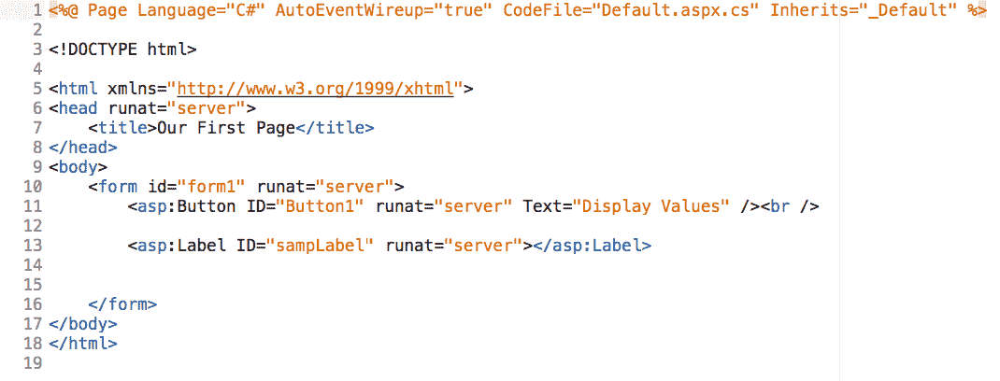

# 第一章：创建一个简单的泛型类

在本章中，您将学习制作一个简单的泛型类的基础知识，以便一个类可以操作许多不同的数据类型。泛型的一个巨大好处是灵活性。

# 创建一个泛型类

打开一个项目，转到解决方案资源管理器；右键单击，选择添加，然后单击类。将类命名为`GenericsClass`；一个简单的泛型类。然后，单击确定。当 Visual Studio 消息出现时，单击是。

对于我们的目的，您不需要顶部的任何`using System`行，也不需要下面的任何注释，所以删除它们。您的初始屏幕应该看起来像*图 1.1.1*：


图 1.1.1：初始 GenericsClass.cs 屏幕

# 使用不同的数据类型

现在，在`public class GenericsClass`后面加上`<T>`符号，如下所示：

```cs
public class GenericsClass<T>
```

这意味着这个单一的类可以同样有效地处理几种不同的数据类型。接下来，在上一行的开放大括号下面输入以下内容：

```cs
private T[] vals;
```

在此行的正上方直接输入以下注释：

```cs
//generic array instance variable
```

换句话说，这将在双精度、小数、整数等上同样有效。

# 制作通用参数

现在，在下一行中，输入以下内容：

```cs
public GenericsClass(T[] input)
```

正如您所看到的，您也可以制作像这样通用的参数。这是一个参数，`input`是它的名称，类型是`T`。所以，它是一个通用数组。

接下来，在上一行的一对大括号之间输入以下内容：

```cs
vals = input;
```

# 显示值

当然，您应该能够显示这些值。因此，在`vals = input;`行的关闭大括号下面输入以下行：

```cs
public string DisplayValues()
```

要显示这些值，您将在上一行的一对大括号之间输入以下内容。

首先，输入一个字符串，如下所示：

```cs
string str = null;
```

接下来，声明字符串并将值初始化为 null。

然后，在此行的正下方输入以下内容：

```cs
foreach ( T t in vals)
```

正如你所看到的，在这里`foreach`循环将会运行。`T`对象将是不同的数据类型，取决于我们如何选择制作对象。当然，`t`变量是`vals`数组中每个特定值。

接下来，在上一行下面的一对大括号之间输入以下内容：

```cs
str += $"<br>Value={t}";
```

请记住，我们使用`+=`运算符来累积和`<br>`来推到下一行。当然，为了得到值，我们将放入`t`变量。

最后，您希望返回这个，所以您将在上一行的关闭大括号下面输入以下内容：

```cs
return str;
```

就是这样。本章的`GenericsClass.cs`文件的最终版本，包括注释，如下所示：

```cs
 //<T> means this class can operate on many different data types
public class GenericsClass<T>
{
    //generic array instance variable
    private T[] vals;//array of T inputs
    public GenericsClass(T[] input)
    {
        //set value of instance variable
        vals = input;
    }
    public string DisplayValues()
    {
        string str = null;//create string to build up display
        foreach(T t in vals)
        {
            //actually accumulate stuff to be displayed
            str += $"<br>Value={t}";
        }
    //return string of outputs to calling code
    return str;
    }
}  
```

请注意，我们有一个代码块；现在它将在整数、双精度等上运行。

# 向 Default.aspx 添加按钮

现在，让我们看看`Default.aspx`。此时，我们真正需要做的唯一的事情就是添加一个`Button`控件。为此，转到工具箱，从那里获取一个`Button`控件。将其拖放到以`<form id=...`开头的行下面。更改`Button`控件上的文本，例如为`显示值`。您的完整的`Default.aspx`文件应该看起来像*图 1.1.2*中显示的那样：



图 1.1.2：此项目的完整 HTML

现在，转到设计视图。我们非常简单的界面显示在*图 1.1.3*中：


图 1.1.3：我们在设计视图中非常简单的界面

# 将整数集合初始化为它们的数组并显示结果

现在，双击`显示值`按钮，进入`Default.aspx.cs`。删除`Page_Load`块。接下来，在以`protected void Button1_Click...`开头的行下面的一对大括号之间，输入以下内容：

```cs
GenericsClass<int> ints = new GenericsClass<int>(new int[] { 1, 2, 3, 4, 5 });
```

你可以在这行中看到，我们基本上是将整数的集合初始化为它们的数组。

现在，你可以显示这个。例如，你可以在这行下面输入以下内容：

```cs
sampLabel.Text += ints.DisplayValues();
```

请注意，我们构建的`GenericsClass`正在操作整数，但它同样可以在任何其他数据类型上同样有效地操作。

# 更改我们泛型类中的数据类型

现在，为了更明显地显示代码的效率，将前面的两行都复制（*Ctrl* + *C*）并粘贴（*Ctrl* + *V*）在下面，并将其改为 double，如下所示：

```cs
GenericsClass<double> dubs = new GenericsClass<double>(new double[] {1, 2, 3, 4, 5});
sampLabel.Text = ints.DisplayValues();
```

我们将这个称为`dubs`，并在这里将名称更改为 double：这是相同的代码，相同的类，以及你可以在双精度上操作的相同的泛型类。再次强调一遍，以及看到这种灵活性和代码重用确实是这里的目的；也就是说，重用代码的能力，我们现在将这两行新代码再次复制粘贴到下面，并将`double`改为`decimal`，如下所示：

```cs
GenericsClass<decimal> decs = new GenericsClass<decimal>(new decimal[] { 1, 2, 3, 4, 5 });
sampLabel.Text = ints.DisplayValues();
```

让我们称这个为`decs`。现在，当然，如果你想让事情变得更有趣一点，你可以加入一些小数：

```cs
GenericsClass<double> dubs = new GenericsClass<double>(new double[] { 1.0, -2.3, 3, 4, 5 });
sampLabel.Text = ints.DisplayValues();
GenericsClass<decimal> decs = new GenericsClass<decimal>(new decimal[] { 1, 2.0M, 3, 4, 5.79M });
sampLabel.Text = ints.DisplayValues();
```

对于小数，只需确保在其中加入`M`后缀，因为你需要在末尾加上`M`后缀来表示它是一个小数。

# 运行程序

现在，让我们来看看。当你运行这段代码并点击“显示数值”按钮时，你的屏幕将会看起来像*图 1.1.4*中所示的样子：


图 1.1.4：我们代码的初始运行

# 累积输入

现在，我们将累积输入。所以，在以下的`sampLabel.Text`行中，我们将`=`号改为`+=`，如下所示：

```cs
GenericsClass<double> dubs = new GenericsClass<double>(new double[] { 1.0, -2.3, 3, 4, 5 });
sampLabel.Text += ints.DisplayValues();
GenericsClass<decimal> decs = new GenericsClass<decimal>(new decimal[] { 1, 2.0M, 3, 4, 5.79M });
sampLabel.Text += ints.DisplayValues();
```

让我们再跑一遍。点击“显示数值”按钮，你的屏幕现在会看起来像*图 1.1.5*中所示的样子：


图 1.1.5：现在正在累积输入，并且值显示如预期

程序现在按预期工作。

所以，泛型的重要概念是你可以定义一个泛型类。这个类可以在许多不同的数据类型上同样有效地操作。例如，你可以创建一个泛型类，它既可以操作整数，也可以操作双精度和小数。

这一步并不是严格要求的，但是这里有一点额外的见解。如果你愿意，你可以设置一个断点。选择以`protected void Button1_Click....`开头的行下面的大括号所在的行。现在，转到调试 | 逐步执行（*F11*），然后点击“显示数值”。

现在，我们将逐步进行。首先，将鼠标悬停在`Generics Class.cs`中以下行中的`T`对象上：

```cs
public GenericsClass(T[] input)
```

在这里，`T`本质上就像一个参数，因此它确实有一个特定的值，这在`vals = input;`行中得到了表达。第一次，`T`用于整数。这就是你可以逐步执行这段代码的方式。在屏幕底部，数组中的值被显示出来，就像*图 1.1.6*中所示的那样：


图 1.1.6：数组中的值

正如你在*图 1.1.7*中所看到的，`t`变量是一个整数，它的操作方式如下：


图 1.1.7：t 是一个整数

还要注意在截图中，它是一个带有`<int>`数据类型的泛型类。

`foreach(T t in vals)`行中的`T`对象现在代表一个整数，其他数据类型也是如此。因此，代码的灵活性和重用意味着你将写更少的代码。如果没有泛型，你将不得不创建单独的类来处理每种不同的数据类型。

# 章节回顾

回顾一下，包括注释在内，本章的`Default.aspx.cs`文件的完整版本如下所示：

```cs
//using is a directive
//System is a name space
//name space is a collection of features that our needs to run
using System;
//public means accessible anywhere
//partial means this class is split over multiple files
//class is a keyword and think of it as the outermost level of grouping
//:System.Web.UI.Page means our page inherits the features of a Page
public partial class _Default : System.Web.UI.Page
{
    protected void Button1_Click(object sender, EventArgs e)
    {
        //in each case below, GenericsClass<...> works equally well with
        //integers, doubles and decimals, among others
        GenericsClass<int> ints = new GenericsClass<int>(new int[] { 1, 2, 3, 4, 5 });
        sampLabel.Text = ints.DisplayValues();
        GenericsClass<double> dubs = new GenericsClass&lt;double>(new double[] { 1.0, -2.3, 3, 4, 5 });
        sampLabel.Text += ints.DisplayValues();
        GenericsClass<decimal> decs = new GenericsClass<decimal>(new decimal[] { 1, 2.0M, 3, 4, 5.79M });
        sampLabel.Text += decs.DisplayValues();
    }
} 
```

# 摘要

在本章中，您学习了创建一个简单的通用类的基础知识，以便一个类可以操作许多不同的数据类型。通用类的一个巨大好处是灵活性。您创建了一个简单的通用类，可以处理不同的数据类型，创建了通用参数，将整数集合初始化为它们的数组并显示结果，然后将通用类中的数据类型更改为双精度和小数。

在下一章中，您将学习关于通用方法的知识，或者可以操作不同数据类型的方法。您还将学习如何约束方法可以操作的数据类型，因此我们将添加一个叫做约束的概念。
