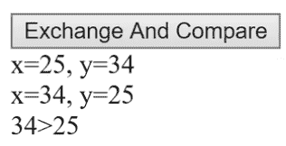

# 第二章：创建一个泛型方法

在本章中，你将学习关于泛型方法的知识，这些方法可以操作不同的数据类型。你还将学习如何约束方法以便它可以操作的数据类型，因此我们将添加一个叫做*约束*的概念。

# 创建一个按钮来交换然后比较两个值

打开一个项目并单击<html>标签。在里面唯一需要放置的是一个按钮。这一次，我们不会从用户那里读取任何值，以节省时间。因此，去工具箱中抓取一个`Button`控件。将其拖放到以`<form id=...`开头的行下面（你可以删除`<div>`行，因为我们不需要它们）。将按钮上的文本更改为`Exchange And Compare`。因此，这将交换两个值然后进行比较。你的完整的`Default.aspx`文件应该看起来像*图 2.2.1*中所示的那样：


图 2.2.1：本章的完整 HTML 文件

# 编写一个交换函数

*swap*函数是一个常见的写法：一个交换两个值的函数。要做到这一点，转到解决方案资源管理器，右键单击网站的名称，选择添加，然后单击类。将类命名为`GenMethods`以保持简单，然后单击确定。当 Visual Studio 消息出现时，单击是。

当`GenMethods`文件出现时，你应该只保留`using System`。我们不需要这个类的构造函数，所以去掉它。然后，在`GenMethods`的主体内，定义以下内容，放在下面一行的公共类`GenMethods`行的大括号之间：

```cs
public static void Swap<T>(ref T x, ref T y)
```

这将在类级别起作用：你不必创建`GenMethods`类型的对象。从某种意义上说，这里唯一新的东西就是这是一个`Swap<T>`函数，这意味着它可以同样很好地作用于几种不同的数据类型。现在，还要记住，`ref`关键字表示在这一行的`x`和`y`参数中，当你在方法内部改变值时，这些改变的值也可以在调用代码内部访问。记住这一点。

在继续之前，让我们在这一行上面输入以下注释：

```cs
//method can operate on multiple data types 
```

这基本上意味着这个方法可以在多种数据类型上平等地操作。

现在，在前一行下面的大括号之间，输入以下内容来交换值：

```cs
T temp = x;
```

在这里，你正在取`x`的值并将其赋给一个临时的值。然后，在下一个阶段，你可以取`x`并将`y`赋给它，然后你可以取`y`并将`temp`赋给它，如下所示：

```cs
x = y;
y = temp;
```

在继续之前，让我们添加以下注释：

```cs
T temp = x; 
//save x 
x = y;
//assign y to x 
y = temp;
//assign original value of x back to y 
```

在这里，第一行的意思是用`y`的值覆盖`x`的值，然后将`y`赋给`x`。在最后阶段，你将`temp`，即`x`的原始值，重新赋给`y`。这代表了值的交换。

# 使用 CompareTo 方法比较值

现在，让我们再做一个方法。这个方法会更加复杂一些。它将被称为`Compare`，并且将操作不同的数据类型。因此，在前面一行的闭合大括号下面输入以下内容：

```cs
public static string Compare<T>(T x, T y) where T : IComparable
```

# 介绍约束

要比较值，你需要使用`CompareTo`方法。如果你有`where T : IComparable`，它就可以使用。这是一个新的构造。这是一个*约束*。`Compare`方法可以工作，但只有在它所操作的数据类型上实现了`IComparable`时才能这样做。换句话说，比较这些值是有意义的。

# 完成 GenMethods 类

对于下一个阶段，你可以说以下内容。在这一行下面的一对大括号中输入它：

```cs
if(x.CompareTo(y) < 0)
```

现在，为什么我们要写这个呢？我们写这个是因为如果你右键点击`CompareTo`方法并在下拉菜单中选择 Go To Definition（*F12*），你会看到它是在`IComparable`接口内定义的。如果你展开它并查看它返回的内容，它说：值的含义小于零 这个实例在排序顺序中位于 obj 之前。如*图 2.2.2*所示：


图 2.2.2：IComparable 的定义

换句话说，在我们的上下文中，这意味着`x`和`y`在以下意义上相关。

如果`CompareTo`返回的值小于`0`，那么`x`小于`y`。

现在，在前面一行的一对大括号内输入以下内容：

```cs
return $"<br>{x}<{y}"; 
```

在这一行中，你返回并实际格式化一个字符串，所以它不仅仅是一个简单的比较。例如，你可以在这里说`x`小于`y`。

另一个可能性是相反的。现在，在之前的闭合大括号下面输入以下内容：

```cs
else
{
     return $"<br>{x}>{y}";
} 
```

如果你想了解更多关于`CompareTo`的信息，右键点击它并在下拉菜单中选择 Go To Definition（*F12*）。如*图 7.2.3*中的 Returns 中所示，它说：零 这个实例在排序顺序中与 obj 处于相同位置。大于零 这个实例在排序顺序中跟随对象。：


图 2.2.3：CompareTo 的定义

在`if (x.CompareTo(y) < 0)`行中，这个实例表示`x`变量，对象表示`y`变量。

所以，这是基本的`GenMethods`类。包括注释的`GenMethods.cs`文件的最终版本如下所示：

```cs
using System;
public class GenMethods
{
    //method can operate on multiple data types
    public static void Swap<T>(ref T x, ref T y)
    {
        T temp = x; //save x
        x = y;//assign y to x
        y = temp;//assign original value of x back to y
    }
    //this function has a constraint, so it can operate on values
    //that can be compared
    public static string Compare<T>(T x, T y) where T :IComparable
    {
        //CompareTo returns < 0, =0,or >0, depending on the relationship
        //between x and y
        if(x.CompareTo(y)<0)
        {
            return $"<br>{x}<{y}";
        }
        else
        {
            return $"<br>{x}>{y}";
        }
    }
} 
```

如你所见，`GenMethods`类包含一些通用函数，因为它可以操作不同的数据类型，除了第二个`CompareTo`方法，它是一个稍微更受限制的版本，意味着`IComparable`类型有一个约束。

# 硬编码数值

现在，回到`Default.aspx`，转到设计视图，并双击 Exchange 和 Compare 按钮。我们将只是硬编码值以节省时间。我们不必从用户那里读取它们。当然，如果你愿意的话，你可以通过输入两个框并使用`double`转换来处理。

现在，在`Default.aspx.cs`中，在以`protected void Button1_Click...`开头的一行下面的一对大括号之间，输入以下行：

```cs
double x = 25, y = 34;
```

然后使用`sampLabel.Text`在屏幕上显示原始值，首先显示`x`的值，然后显示`y`的值：

```cs
sampLabel.Text = $"x={x}, y={y}";
```

接下来，进行值的交换。输入以下内容：

```cs
GenMethods.Swap<double>(ref x, ref y);  
```

首先，输入类的名称，然后是函数`Swap`。你会看到`<T>`现在可以替换为`<double>`，因为我们在交换 double。然后，你会输入`ref x`和`ref y`。

因为我们使用了`ref`，所以`x`和`y`的值必须被初始化，现在我们可以再次显示它们，但是交换了，如下所示：

```cs
sampLabel.Text += $"<br>x={x}, y={y}";
```

# 运行程序

让我们看看效果，看看这是否按预期工作。所以，在你的浏览器中试一试。点击 Exchange 和 Compare 按钮。结果显示在*图 2.2.4*中：


图 2.2.4：初始程序运行的结果

如你所见，x 是 25，y 是 34。然后，当你点击 Exchange 和 Compare 后，x 是 34，y 是 25。所以，这正如预期的那样工作。

# 修改程序以进行额外类型的比较

现在，回到`Default.aspx`，在设计视图中，我们也将比较这些值。为此，再次双击 Exchange 和 Compare 按钮，并在我们输入的最后一行下面添加以下内容：

```cs
sampLabel.Text += GenMethods.Compare<double>(x, y);
```

请记住，我们设计`Compare`的方式是返回一个字符串，根据具体情况返回两个值中的一个。因此，在这一行中，我们将比较`double`；所以你把它放在那里，然后两个值将是`x`，`y`。

让我们在你的浏览器中试一试。再次点击“交换和比较”按钮。新的结果显示在*图 2.2.5*中：



图 2.2.5：修改后程序运行的结果

现在，x 是 25，y 是 34。当你交换值时，x 是 34，y 是 25。此外，34 肯定比 25 大。看起来非常漂亮和专业。

# 修改程序以适应不同的数据类型

现在的好处是：想象一下，如果你想重新做这个；你只需输入`int`作为示例，并将数据类型更改为整数或小数类型以及方法。我们在本章中编写的代码同样适用于这些情况：

```cs
int x = 25, y = 34;
sampLabel.Text = $"x={x}, y={y}";
GenMethods.Swap<int> (ref x, ref y);
sampLabel.Text += $"<br>x={x}, y={y}";
sampLabel.Text += GenMethods.Compare<int>(x, y);
```

当然，唯一的问题是，如果你右键点击`int`并在下拉菜单中选择“转到定义”（*F12*），你会看到它说`public struct Int32`并且它实现了`IComparable`：


图 2.2.6：public struct Int32 的定义

这将起作用是因为我们的函数有一个约束，它规定了`T`应该是可比较的，如下所示：

```cs
public static string Compare<T>(T x, T y) where T : IComparable
```

这些都是基础知识。

# 章节复习

为了复习，包括注释在内的本章`Default.aspx.cs`文件的完整版本如下所示：

```cs
//using is a directive
//System is a name space
//name space is a collection of features that our needs to run
using System;
//public means accessible anywhere
//partial means this class is split over multiple files
//class is a keyword and think of it as the outermost level of grouping
//:System.Web.UI.Page means our page inherits the features of a Page
public partial class _Default : System.Web.UI.Page
{
    protected void Button1_Click(object sender, EventArgs e)
    {
        int x = 25, y = 34;//declare and set two variables
        sampLabel.Text = $"x={x}, y={y}";//display variables
        GenMethods.Swap (ref x, ref y);//swap values
        sampLabel.Text += $"<br>x={x}, y={y}";//display swapped values
        sampLabel.Text += GenMethods.Compare (x, y);
    }
}
```

# 摘要

在本章中，你学习了关于泛型方法的知识，这些方法可以操作不同的数据类型。你还学习了如何约束方法以便它可以操作的数据类型，这个概念叫做*约束*。你创建了一个`GenMethods`类，编写了一个`Swap`函数，使用`CompareTo`方法比较值，学习了约束，并修改了程序以执行额外类型的比较和使用不同的数据类型。

在下一章中，你将学习关于向上转型、向下转型，以及如何实现泛型接口以及它如何帮助我们。
