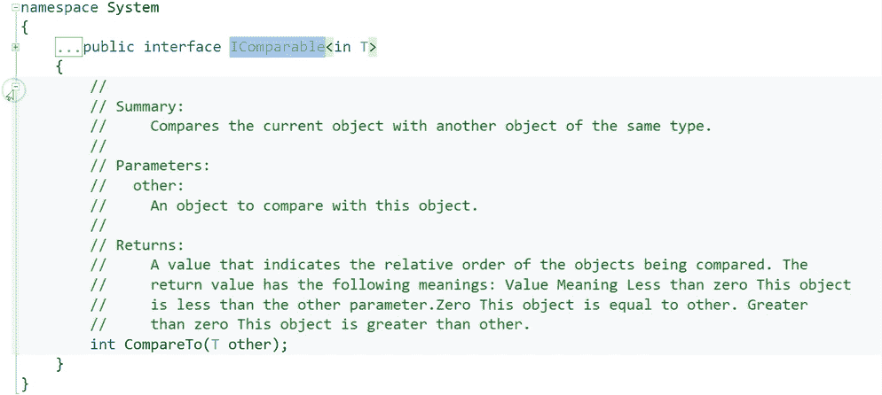

# 第三章：实现泛型接口以实现排序

在本章中，你将学习向上转型和向下转型，然后学习如何实现泛型接口以及它如何帮助我们。

想象一下，你有一个对象列表，你已经用自己的类型创建了这些对象，并且你想对它们进行排序。你需要弄清楚如何对这些对象进行排序。这来自于实现`IComparable`，这是一个可以作用于不同数据类型的泛型接口。

# 添加一个按钮来排序和显示结果

打开一个项目并点击<html>标签。同样，你需要放入的只是一个按钮。为此，转到工具箱并拖动一个`Button`控件。将其放在`<form id=...`行下面并将按钮上的文本更改为`Sort and Show`。现在，在该行的末尾放入一个`<br>`标签，并保持标签不变：

```cs
<asp:Button ID="Button1" runat="server" Text="Sort And Show"/><br />
```

现在，转到设计视图，在那里你应该只看到一个名为 Sort and Show 的按钮，如*图 3.3.1*所示。


图 3.3.1：添加一个按钮

# 创建一个泛型接口类

接下来，转到解决方案资源管理器。右键点击网站的名称，选择添加，然后点击类。将类命名为`GenInterface`，然后点击确定。当 Visual Studio 消息出现时，点击是。记住，这只是一个例子。

`GenInterface`类的代码真的很复杂。我将逐行创建它，解释我在做什么以及为什么这样做。

首先，在顶部除了`using System;`之外删除所有内容。接下来，你将创建一个名为`Quad`的类，用于表示某种四边形。在`using System`之后输入以下内容：

```cs
public class Quad : IComparable<Quad>
```

这需要`System`，这样我们才能使用`IComparable`。如果你右键点击它并在下拉菜单中选择 Go To Definition（*F12*），你可以看到这个东西的定义。你会看到`namespace System`在顶部附近，以及`public intCompareTo (T other);`函数在`Returns`定义之后，如*图 3.3.2*所示：



图 3.3.2：IComparable 的定义

注意它返回一个整数。因此，当我们实现这个接口时，我们必须记住这一点。现在关闭定义窗口。

在我们的特定情况下，在以`public class Quad...`开头的行下面输入以下文本：

```cs
private string name;
public Quad(string na)
```

现在，为了设置值，在上述行的大括号之间输入以下内容：

```cs
name = na;
```

毕竟，每个四边形形状，无论是正方形、矩形还是菱形，都有一个名称，对吧？所以，在`Quad`类中将名称特性集中起来是个好主意。

# 实现接口

接下来，因为`IComparable`有一个函数，右键点击它，选择快速操作，然后从弹出菜单中选择实现接口。现在，我们需要编写代码。

首先删除`throw new NotImplementedException()`。现在，我们将以足够说明问题的方式实现接口。为此，在`public int CompareTo(Quad other)`行下的大括号内输入以下内容：

```cs
if(this.name.CompareTo(other.name) <0)
```

在这里，`this`表示当前对象，这个对象的名称与`other.name`进行比较，意思是另一个对象。看看上面一行中`(Quad other)`所在的地方；换句话说，我们正在比较两个`Quads`。因此，在左边的对象中，`this`是调用该函数的对象，而另一个`Quad`类是与之进行比较的对象。因此，如果`this`小于`0`，我们将返回一个数字，比如`-1`，否则它可以返回其他值，比如`1`。在这行下面的大括号之间输入以下内容：

```cs
{
    return -1;
}
else
{
    return 1;
} 
```

我们刚刚实现了`CompareTo`。现在注意到`*this*`是不必要的。你可以删除它，它仍然可以工作。但请记住，name 本质上意味着将在其中调用`CompareTo`的当前对象。这就是为什么我喜欢有`this`关键字存在，因为它更能暗示我想要知道的内容。

基本上，这行的意思是，如果当前对象与另一个名称比较小于`0`，那么我们返回`-1`，这意味着当前对象将在排序时出现在下一个对象之前。这是一个简单的解释。

# 添加一个虚函数

现在，在下一个阶段，我们将添加一个名为`Perimeter`的虚函数。为此，请在闭合大括号下面输入以下内容：

```cs
public virtual string Perimeter()
```

再次，我们将尽可能地集中。因此，请在此行下面的一对大括号中输入以下内容：

```cs
return $"The perimeter of {name} is ";
```

特定的名称可以来自这一行，因为`name`实例变量在`private string name`上面声明。然而，`Perimeter`将来自派生类。

现在，在前面的闭合大括号下面输入以下内容：

```cs
public class Square : Quad
```

# 添加改进

现在添加类特定的改进；为此，请在前面的行下面的一对大括号之间输入以下内容：

```cs
private double sideLength;
public Square(string n, double s) : base(n) {sideLength = s;}
```

在这里，`string n`是名称，`doubles`是边。然后，用名称（`n`）调用`base`类构造函数，然后输入`sideLength = s`。请记住，当你调用`base`类构造函数时，你正在重用代码。

我选择将其表达为一行，只是为了节省空间。请记住，通常它看起来是这样的：

```cs
private double sideLength;
public Square(string n, double s) : base(n)
{
    sideLength = s;
}
```

接下来，我们必须实现`Perimeter`的覆盖版本。因此，在前面的闭合大括号下面输入以下内容：

```cs
public override string Perimeter()
```

现在，我们想要保留`return base.Perimeter()`，它会自动出现，因为它提供了有用的默认功能，`$"The perimeter of {name} is ";`，来自前面的返回行：我们不想一直输入那个。我们想要做的是添加一个小的改进。所以，在`return base.Perimeter()`中添加以下改进：

```cs
return base.Perimeter() + 4 * sideLength;
```

这意味着四倍的`sideLength`变量，因为要找到正方形的周长，你要取四乘以一边的长度。

改进来自派生类的通用功能，这同样适用于你将其放入`base`类的虚方法中的所有类：你不必一直写它。

接下来，我们可以为我们的矩形重复这个过程。所以，复制`public class Square : Quad`块（*Ctrl* + *C*），然后粘贴（*Ctrl* + *V*）到下面：

```cs
public class Rectangle : Quad
{
    private double sideOne, sideTwo;
    public Rectangle(string n, double s1, double s2) : base(n)
    {
        sideOne = s1; sideTwo = s2;
    }
    public override string Perimeter()
    {
        return base.Perimeter() + (2 * sideOne + 2 * sideTwo);
    } 
}
```

现在进行以下更改：

1.  将此块重命名为`Rectangle`。这也是从`Quad`派生的，所以没问题。

1.  改变`sideLength`的地方；因为矩形有两个不同的边长，所以把它改成`sideOne`和`sideTwo`。

1.  将`public Square`改为`public Rectangle`作为构造函数的名称。它调用了带有名称的基类构造函数。

1.  然后，初始化另外两个，现在你会说`double s1`和`double s2`。

1.  接下来，您必须初始化字段，所以说`sideOne = s1;`和`sideTwo = s2;`。就是这样：它们已经被初始化了。

1.  现在再次在`Rectangle`类中覆盖`Perimeter`，就像之前展示的那样。在这里，你指定适用于矩形的部分，所以是`(2 * sideOne + 2 * sideTwo)`。确保将其括在括号中，这样计算就会先进行，然后再与`base.Perimeter`的其余部分结合在一起。

所以，就是这样的类。供参考，包括注释的`GenInterface`类的完整版本如下所示：

```cs
using System;
public class Quad:IComparable<Quad>//implement IComparable
{
    private string name;//instance field
    public Quad(string na)
    {
        name = na;//set value of instance field
    }
    //implement CompareTo to make list sortable
    //in this case, the items are sorted by name
    public int CompareTo(Quad other)
    {
        if(this.name.CompareTo(other.name) < 0)
        {
            return -1;
        }
        else
        {
            return 1;
        }
    }//put default code inside Perimeter
    public virtual string Perimeter()
    {
        return $"The perimeter of {name} is ";
    }
}
public class Square: Quad
{
    private double sideLength;
    public Square(string n, double s):base(n)
    {
        sideLength = s;
    }
    //override Perimeter, calling the base portion
    //and then adding refinement with 4*sideLength
    public override string Perimeter()
    {
        return base.Perimeter() + 4 * sideLength;
    }
}
public class Rectangle: Quad
{
    private double sideOne, sideTwo;
    public Rectangle(string n, double s1, double s2) : base(n)
    {
        sideOne = s1; sideTwo = s2;
    }
    //override Perimeter, calling the base portion
    //and then adding refinement with 2sideOne+2sideTwo
    public override string Perimeter()
    {
        return base.Perimeter() + (2 * sideOne + 2 * sideTwo);
    } 
 }
```

# 输入参考代码

现在，我将进行参考代码。这段代码是机械的。有很多代码，但它是机械的。记住，这里的重要思想是使用`Quad`类内部的`CompareTo`方法来实现`IComparable`，这意味着现在当我们将不同的形状放入`Quads`列表中时，我们将能够以某种方式对它们进行排序。所以，现在我们的名称将被排序。在我们的情况下，我们将按名称对它们进行排序。

现在转到`Default.aspx`，并进入设计视图。双击“排序并显示”按钮。这将带我们进入`Default.aspx.cs`。删除`Page_Load`块。

接下来，在以`protected void Button1_Click...`开头的一行下的大括号之间，我们要做的第一件事是在左侧放置一个`Quad`，然后我们称之为`sqr`：

```cs
Quad sqr = new Square("Square", 4);
```

# 向上转型

注意，我写了`new Square`。这是*向上转型*。在这里，这涉及到将右侧的对象转换，因为它是从其`Quad`派生的。在左侧，你可以创建一个`Quad`命名空间，并在右侧放置一个派生类型的对象；所以，我们将称之为`Square`，然后输入一个边长为`4`。

接下来，在这行的正下方直接输入以下内容：

```cs
Quad rect = new Rectangle("Rectangle", 2, 5);
```

再次，我们在左侧放置了一个`Quad`命名空间，这次我们称之为`rect`。我们给它起名叫`Rectangle`，然后我们放入两条边，长度分别为`2`和`5`。

现在，你可以将这个存储在一个列表中，例如，你可以对其进行排序。想象一下，如果你有很多这样的东西，你需要一种方法来对这些信息进行排序。所以现在，转到这个文件的顶部，在`using System`下面输入以下内容：

```cs
using System.Collections.Generic;
```

接下来，在`Quad rect...`行下面输入以下内容：

```cs
List<Quad> lst = new List<Quad>(new Quad[] { sqr, rect, rect2, sqr1 });
```

我们将称这个列表为`new List<Quad>`，要初始化一个列表，你总是可以使用数组。为此，输入`new Quad`，然后用`sqr`和`rect`进行初始化。这就是你可以在数组中初始化列表的方法。

然后，为了对列表进行排序，在这行的正下方直接输入以下内容：

```cs
lst.Sort();
```

所以，现在这是有意义的。它不会出错。想象一下，如果你在`GenInterface`类的顶部没有写`IComparable<Quad>`。这个排序就不会起作用。如果你去掉`IComparable<Quad>`，然后把`CompareTo`方法拿出来，你会有问题。所以，对于我们的目的，我们现在有一种对这些`Quads`类进行排序的方法。

在最后阶段，从`Sort`行下面开始输入以下内容：

```cs
if(lst[0] is Square)
```

所以，`is`是一个新关键字。你可以用它来检查某个东西是否是某种类型。

# 向下转型

现在，我们将讨论*向下转型*，这意味着从父类型转到子类型。在这行下面的大括号之间输入以下内容：

```cs
sampLabel.Text += ((Square)lst[0]).Perimeter();
```

现在，在前一行之后的封闭大括号下面输入以下内容：

```cs
else if(lst[0] is Rectangle)
```

然后，你可以调用以下代码；所以，复制`sampLabel.Text...`行，并将其粘贴在一对大括号之间：

```cs
sampLabel.Text += ((Rectangle)lst[0]).Perimeter();
```

确保将`Square`更改为`Rectangle`，这样它就会被转换为矩形，然后矩形上的`Perimeter`函数将被调用。当你将鼠标悬停在前两行的`Perimeter`上时，弹出窗口显示`string Square.Perimeter()`和`string Square.Perimeter()`。如果你从前一行中删除`(Rectangle)`并将鼠标悬停在`Perimeter`上，弹出窗口将显示`string Quad.Perimeter()`。你明白吗？这就是为什么我有这个转型：因为它改变了函数被识别的方式。

这是从父类向子类的向下转型。所以，当我们谈论批量操作时，你不能转型为父类，执行类似排序的批量操作，或者如果你想添加称为子类和子类对象的细化，那么你可以向下转型。

# 运行程序

现在，让我们来看看。在浏览器中打开程序，然后点击“排序并显示”按钮。结果显示在*图 3.3.3*中：


图 3.3.3：运行程序的结果

这确实是矩形的周长。

这些是向上转型、向下转型和实现通用接口（如`IComparable`）的基础知识。这是非常复杂的代码，但我希望您已经学到了很多。

# 章节回顾

为了复习，包括注释在内的本章的`Default.aspx.cs`文件的完整版本如下所示：

```cs
//using is a directive
//System is a name space
//name space is a collection of features that our needs to run
using System;
using System.Collections.Generic;
//public means accessible anywhere
//partial means this class is split over multiple files
//class is a keyword and think of it as the outermost level of grouping
//:System.Web.UI.Page means our page inherits the features of a Page
public partial class _Default : System.Web.UI.Page
{
    protected void Button1_Click(object sender, EventArgs e)
    {
        sampLabel.Text = "";//clear label every time
        Quad sqr = new Square("John",4);//make a square
        Quad rect = new Rectangle("Bob", 2, 5);//make a rectangle
        Quad rect2 = new Rectangle("Jerry", 4, 5);//make another rectangle
        //stick all these shapes into a list of quads
        List<Quad> lst = new List<Quad>(new Quad[] { sqr, rect,rect2});
        lst.Sort();//sort the list
        if(lst[0] </span>is Square) //if it's asquare
        {
               //down cast to a square, and call Perimeter on it
                sampLabel.Text += ((Square)lst[0]).Perimeter();
        }
        else if(lst[0] is Rectangle)
        {
            //if it's a rectangle, down cost to a rectangle, 
            //and call Perimeter
            sampLabel.Text += ((Rectangle)lst[0]).Perimeter();
        }
    }
} 
```

# 摘要

在本章中，您学习了向上转型、向下转型，然后学习了如何实现通用接口以及这对我们有何帮助。您创建了一个通用接口类和一个 Quad 类，实现了一个接口，添加了一个虚拟的`Perimeter`函数，对代码进行了改进，并输入了大量的机械引用代码。

在下一章中，您将学习有关通用委托的知识。
