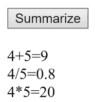

# 第四章：使用泛型使委托更加灵活

在本章中，你将学习关于泛型委托。记住，就像在之前的课程中一样，基本的好处是泛型允许你创建灵活的代码，可以轻松处理各种数据类型。如果没有泛型，你将不得不创建更多的代码。

# 在 HTML 中添加一个总结按钮

打开一个项目。在基本的 HTML 中，删除`<div>`行，因为你不需要它们。现在，让我们添加一个按钮。这个按钮唯一要做的就是为我们总结一些信息。

转到工具箱，抓取一个`Button`控件。将其拖放到以`<form id=...`开头的行下面，并将按钮上的文本更改为`Summarize`。现在，用一个`<br>`标签关闭它，并像往常一样保留`Label`控件。

现在，转到`Default.aspx`，进入设计视图。你会看到一个按钮用于界面，上面写着 Summarize，看起来像*图 4.4.1*：


图 4.4.1：这个项目的简单界面

现在，双击`Summarize`按钮。这会带我们进入`Default.aspx.cs`。删除`Page_Load`块。你的这个项目的初始代码屏幕应该看起来像*图 4.4.2*：


图 4.4.2：这个项目的初始 Default.aspx.cs 代码

# 构造委托

首先，为了创建委托，在以`public partial class...`开头的行上方输入以下内容：

```cs
public delegate void Summarize<T>(T x, T y);
```

这里，`public`表示可以在任何地方访问，`delegate`是一个关键字，`void`不返回值。委托名称是`Summarize`，它可以作用于不同的数据类型，因为`T`存在，而不是整数、双精度或类似的东西。`T`是一个通用类型。

现在记住，委托本质上是函数包装器。对吧？你用它们指向多个函数，这样你就可以级联函数调用，例如。同样的原则在这里也适用。例如，为了利用这一点，输入以下内容在以`protected void Button1_Click...`开头的行下面的大括号之间：

```cs
Summarize<double> s =
```

# 分配函数来代表委托

对于右侧，我们首先需要开始分配它所代表的函数。为此，我们可以在这行之后的闭合大括号下面，例如，说以下内容：

```cs
public void FindSum(double x, double y)
```

想象一下，你要做的第一件事是找到两个值的和。所以，例如，你说`Find Sum`，然后`double x`和`double y`。

然后，你可以更新标签；所以，在这行下面的大括号之间输入以下内容：

```cs
sampLabel.Text = $"<br>{x}+{y}={x + y}";
```

现在，你可以将`FindSum`分配给前面的`<int>`。你可以设置它等于，如下所示：

```cs
Summarize<double> s = FindSum;
```

当然，还有许多其他操作可以执行。所以，让我们来看看这段代码：这是一个基本的添加函数，并定义一些其他操作。复制（*Ctrl* + *C*）这两行，然后粘贴（*Ctrl* + *V*）到下面。这次，将`FindSum`改为`FindRatio`，并基本上按照相同的计划进行。我们将应用`+=`运算符来确保它在追加。然后，为了换行，在那里放一个`<br>`标签，而不是`x + y`，将它们改为`x / y`。当然，在这里你需要确保`y`不是`0`。我们可以弄清楚这一点：

```cs
public void FindRatio(decimal x, decimal y)
{
    sampLabel.Text += $"<br>{x}/{y}={x / y}";
}  
```

再做一次。所以再次复制这两行，然后粘贴到下面。这次，将`FindRatio`改为`FindProduct`，这是两个值相乘的结果，并将`x / y`改为`x * y`。

```cs
public void FindProduct(decimal x, decimal y)
{
    sampLabel.Text += $"<br>{x}*{y}={x * y}";
}
```

**提醒：**如果是棕色（Windows）或橙色（Mac），它会在屏幕上显示为原样。

始终记得放入`<br>`标签，这样东西就会被推到下一行。

# 调用委托

现在，我们需要堆叠这些调用；所以，在`Summarize<double> s = FindSum;`行下面输入以下内容：

```cs
s += FindRatio;
s += FindProduct;
```

注意，你放下一个函数名，`FindRatio`，然后下一行将是`FindProduct`。

然后，当然，要调用它，输入以下内容在下一行：

```cs
s(4, 5); 
```

这是你如何调用那个代理的方式：你会调用它，指定名称，然后传入那些`4`和`5`的值。

`Default.aspx.cs`文件的完整版本，包括注释，如下所示：

```cs
//using is a directive
//System is a name space
//name space is a collection of features that our needs to run
using System;
//public means accessible anywhere
//partial means this class is split over multiple files
//class is a keyword and think of it as the outermost level of grouping
//:System.Web.UI.Page means our page inherits the features of a Page
public delegate void Summarize<T>(T x, T y);//declare generic delegate
public partial class _Default : System.Web.UI.Page
{
    protected void Button1_Click(object sender, EventArgs e)
    {
        Summarize<decimal> s = FindSum;//assign FindSum to the delegate
        s += FindRatio;//assign FindRatio to the delegate
        s += FindProduct;//assign FindProduct to the delegate
        s(4, 5);//invoke the delegate, causing the chain of functions to be executed
    }
    public void FindSum(decimal x, decimal y)
    {
        sampLabel.Text = $"<br>{x}+{y}={x + y}";
    }
    public void FindRatio(decimal x, decimal y)
    {
        sampLabel.Text += $"<br>{x}/{y}={x / y}";
    }
    public void FindProduct(decimal x, decimal y)
    {
        sampLabel.Text += $"<br>{x}*{y}={x * y}";
    }
}
```

# 运行程序。

现在，让我们来看看效果。为此，启动你的浏览器中的程序。点击 Summarize 按钮。结果显示在*图 4.4.3*中：



图 4.4.3：运行我们项目的结果

正如你所看到的，4+5=9，4/5=0.8，4*5=20。所以，它的工作效果符合预期。`public delegate void Summarize<T>(T x, T y);`这一行是一个单一的通用代理，因为它有`T`而不是固定的数据类型，比如整数或双精度，所以它可以操作不同的数据类型。

现在，如果你打开你的`Default.aspx.cs`页面，搜索所有的`double`出现的地方，然后用`int`替换，会有七个地方被替换。如果你再次运行代码，你会发现它同样有效。为了进一步说明这一点，将`int`替换为`decimal`，同样有七个地方被替换。现在，它将以十进制类型运行，如果你再次点击 Summarize 按钮，你会发现它同样有效。

所以，你有一个通用的代理。记住，通过单击一个按钮，你可以通过`s`代理将一系列函数链接在一起调用，这个代理是 Summarize 类型的，是通用的，所以它可以同样有效地操作不同的数据类型。

# 总结

在本章中，你学习了关于通用代理。你构建了一个代理，分配了函数来代表这个代理，并调用了这个代理。

在下一章中，你将学习关于通用字典。
