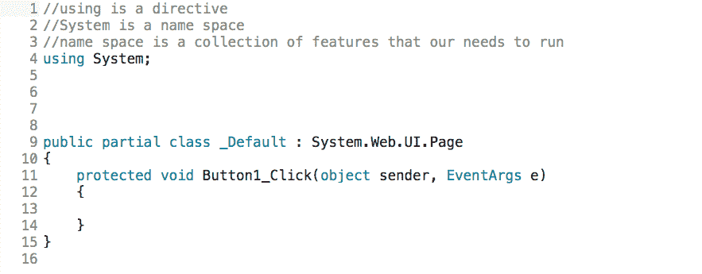
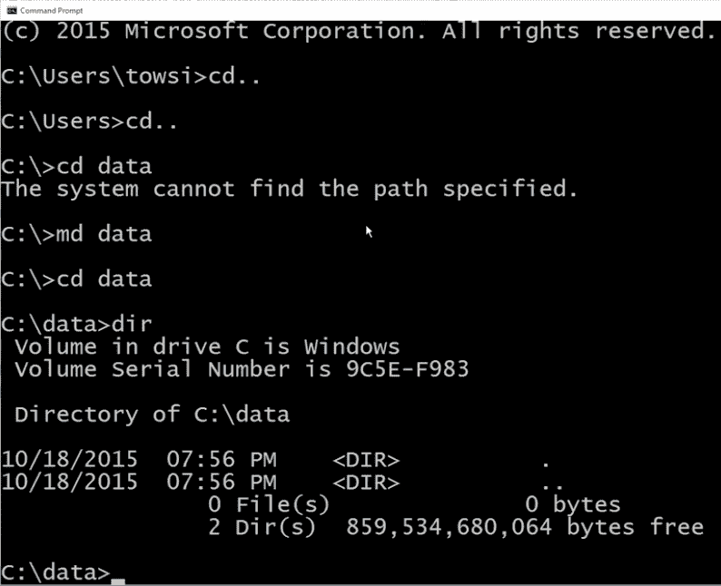
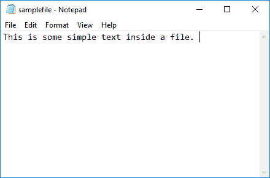
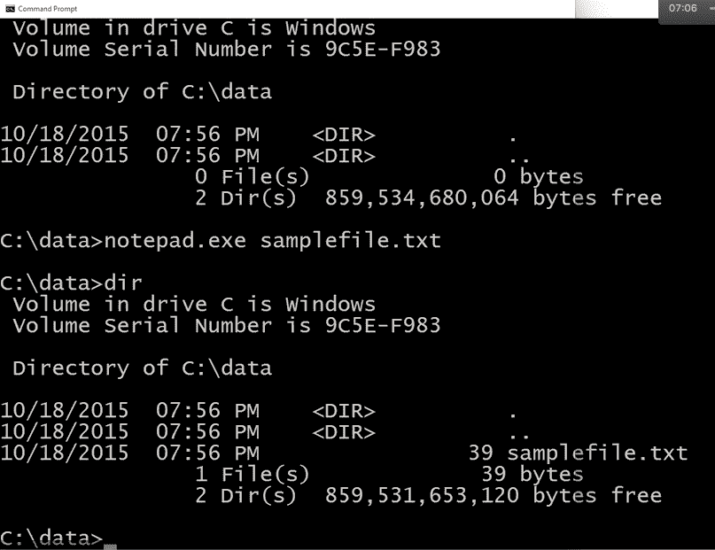

# 第五章：创建和使用通用字典

在本章中，您将学习有关通用字典的知识。字典用于存储*键值对*。

# 在 HTML 中添加一个显示按钮

打开 Visual Studio。我们需要在<html>中放置一个按钮；因此，转到工具箱并获取一个`Button`控件。将其拖放到以`<form id=...`开头的行下方。更改按钮上的文本为`Show`。您可以删除`<div>`行，因为您不需要它们。

# 从网页启动进程

在本章中，我们将学习如何打开记事本，然后直接从页面上进行探索。为此，转到`Default.aspx`，并进入设计视图。双击显示按钮。这将带我们进入`Default.aspx.cs`。

删除`Page_Load`块，使其看起来像*图 5.5.1*所示的屏幕：



图 5.5.1：此项目的初始 Default.aspx.cs 代码

首先，在`using System`行下面，输入以下内容：

```cs
using System.Collections.Generic;
```

您添加了这行是因为我们正在处理字典。然后，在此行下面再添加一行：

```cs
using System.Diagnostics;
```

很快您将看到为什么需要这行。这是如何启动一个进程的。例如，*进程*指的是记事本。

现在，在以`protected void Button1_Click...`开头的行下面的大括号之间，输入以下内容：

```cs
Dictionary<string, string> filePrograms = new Dictionary<string, string>();
```

将鼠标悬停在`Dictionary`上，并查看弹出提示，如*图 5.5.2*所示。您看到了吗？它说 TKey？这表示键的类型，TValue 指定值的类型。在我们的情况下，两者都将是`string`类型：


图 5.5.2：字典的弹出提示

请注意，我们给字典起了一个名字，比如`filePrograms`。接下来，为它分配内存，输入`new Dictionary<string, string>`来指示键的类型和值的类型，并用分号结束。

在下一阶段，我们将填充这个字典。因此，在这行的下面直接输入以下内容：

```cs
filePrograms.Add("notepad.exe", @"c:\data\samplefile.txt");
```

# 创建一个逐字字符串

在前一行中，您需要在括号内指定键值对。键是`notepad.exe`。如果您尝试直接将路径（例如`c:\data\samplefile.txt`）放入代码中，它不起作用。您看到它被划为红色了吗？弹出窗口表示将文本表示为一系列 Unicode 字符。这些东西不起作用。因此，为了解决这个问题，您在其前面放置`@`（at）符号。现在，您有了一个*逐字字符串*。

用旧的方法，您处理这个问题的方式是：`c:\\data\\samplefile.txt`。这被称为*字符转义*。如果您尝试使用前面的行，注意红色的下划线消失了，因为`c:\`已经有了意义。因此，为了避免通常的含义，您添加第二个反斜杠。不过，这是旧的方法。对于这种情况的新方法是使用逐字字符串，以便它被解释为它出现的样子。

在这个上下文中，记事本是键，值是`samplefile.txt`文件。

接下来，在前一行的下面直接输入以下内容：

```cs
filePrograms.Add("iexplore.exe", "http://www.bing.com");
```

因此，Internet Explorer 将打开[`www.bing.com`](http://www.bing.com)页面。您看到了吗？

# 遍历键值对

现在，假设我们想要遍历这些键，因为我们可能有很多键。一种方法是这样的：

```cs
foreach(KeyValuePair<string, string> kvp in filePrograms)
```

您可以像这样遍历键值对。接下来，在前一行下面的大括号之间输入以下内容：

```cs
Process.Start(kvp.Key, kvp.Value);
```

在`Process.start`之后，您显示键和值。因此，您可以说`kvp.key`，这是键值对的属性，`kvp.value`也是键值对的属性。

在一个现实的应用程序中，程序可能丢失或其他情况可能发生，最好将其放在`TryCatch`块中等等，但对于我们的目的来说，这已经足够了，而且保持了简洁。

如果需要，您还可以遍历单个键和值等。因此，作为另一个示例，您可以在前一行下的封闭大括号下方输入以下内容：

```cs
foreach(string key in filePrograms.Keys)
```

要获取单个键，您需要键入字典的名称，然后键入键集合的名称`Keys`，该名称将出现在弹出窗口中。

这就是您可以访问键的方法。如果要显示它们，您绝对可以；要执行此操作，请在此行下的一组大括号之间输入以下内容：

```cs
sampLabel.Txt += $"<br>{key}";
```

要显示键，您需要键入`{key}`。记得插入`<br>`标签，`+=`运算符进行追加，`$`符号，并以分号结尾。

# 从命令提示符中创建目录和文件

现在，您需要确保您有`samplefile.txt`文件。因此，在 Windows 中，要执行此操作，请键入`cmd`，这是 Command Prompt 的缩写，并打开它。在`C:\>`提示符下，首先键入`cd..`以向上移动一级，然后再次键入`cd..`以再次向上移动一级。然后输入`cd data`以切换到 data 目录。系统会响应此路径不存在，如*图 5.5.3*所示；因此，我们需要创建路径并创建文件：



图 5.5.3：系统指示路径 c:\>data 不存在

要创建路径，请在命令提示符中键入以下内容：

```cs
C:\>md data
```

然后，输入以下内容以切换到该目录：

```cs
C:\>cd data
```

接下来，键入以下内容以显示目录中的文件列表：

```cs
C:\data\dir
```

如*图 5.5.3*中所示，目录中没有任何内容：它是新的，我们刚刚创建它。因此，要在 Notepad 中打开文件，请在提示符中键入以下内容：

```cs
C:\data\notepad.exe samplefile.txt
```

这将创建文件。当屏幕提示询问您是否要创建新文件时，请单击“是”按钮。这将打开一个空的 Notepad 文件。输入一些文本，如*图 5.5.4*所示：



图 5.5.4：在您创建的新 Notepad 文件中输入一些文本

确保将其保存在`C:\data`目录中（*Ctrl* + *S*），然后可以关闭它。

现在看一下。要调用以前的命令，您只需按上箭头键，或者在这种情况下，在命令提示符中键入`dir`，如前所述：`C:\data\dir`。现在您可以看到`samplefile.txt`存在于目录中，如*图 5.5.5*所示：



图 5.5.5：samplefile.txt 现在存在于目录中

现在在浏览器中启动它，并查看结果。单击“显示”按钮。它按预期工作：它同时打开了 Notepad 文件和 Bing 主页，如*图 5.5.6*所示：


图 5.5.6：Notepad 文件和 http://www.bing.com 已在我们的程序中打开

现在，您可以直接从您的页面启动任何浏览器，某种进程，并显示它，如果需要，还可以直接从浏览器中打开文件。

请注意，这是因为我们正在从本地 Web 服务器运行页面，因此我们可以访问 Notepad 和浏览器。在真正的互联网应用程序中，情况会有所不同。

此外，您可以查看键的列表，如*图 5.5.7*所示：


图 5.5.7：键的列表

因此，这些是您可以使用通用字典的一些基础知识。

# 章节回顾

回顾一下，包括注释在内的本章的`Default.aspx.cs`文件的完整版本如下所示：

```cs
//using is a directive
//System is a name space
//name space is a collection of features that our needs to run
using System;//needed for EventArgs
using System.Collections.Generic;//needed for dictionary
using System.Diagnostics;//needed for Process.Start
//public means accessible anywhere
//partial means this class is split over multiple files
//class is a keyword and think of it as the outermost level of grouping
//:System.Web.UI.Page means our page inherits the features of a Page
public partial class _Default : System.Web.UI.Page
{
    protected void Button1_Click(object sender, EventArgs e)
    {
        //make a dictionary using string as the type for keys and values
        Dictionary<string, string> filePrograms = 
        new Dictionary<string, string>();
        //add two key/value pairs to the dictionary
        filePrograms.Add("notepad.exe", @"c:\data\samplefile.txt");
        filePrograms.Add("iexplore.exe", "http://www.bing.com");
        //iterate over the key/value pairs
        foreach(KeyValuePair<string, string> kvp in filePrograms)
        {
            //invoke Process.Start to launch notepad and internet explorer
            Process.Start(kvp.Key, kvp.Value);
        }
        //lines below get only at the key inside the filePrograms 
        //dictionary
        foreach(string key in filePrograms.Keys)
        {
            sampLabel.Text += $"<br>{key}";
        }
    }
}
```

# 总结

在本章中，您了解了通用字典。这些被称为键值对。您从网页启动了一个进程，制作了一个逐字字符串，遍历了键值对，从命令提示符中创建了一个目录并创建了一个文件。

在下一章中，我们将看一下委托和 lambda 表达式之间的连接。
