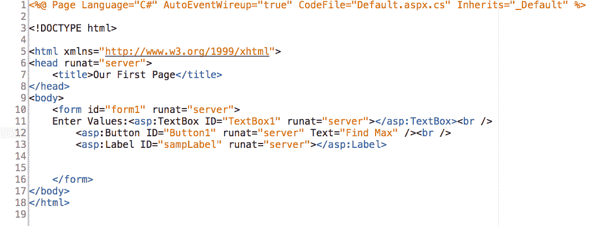
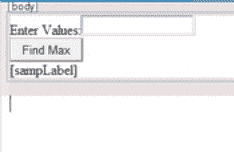

# 第七章：表达式主体 Lambda 和表达式主体成员

在本章中，您将学习关于表达式主体成员，然后是由代码块定义的 Lambda 表达式。

# 在 HTML 中添加一个框和一个 Find Max 按钮

打开一个项目，我们将设置一个框，从该框中读取三个值，然后找到最大值。我们还将做一些其他事情，比如学习如何从一个数据类型的数组转换为另一个数据类型的数组。

让我们从在以`<form id=...`开头的行下方输入`Enter Values:`开始：

然后，转到工具箱，获取一个`Textbox`控件，并将其放在 Enter Values:之后。您可以删除`<div>`行，因为您不需要它们。确保在行末插入`<br>`标签：

```cs
Enter Values:<asp:TextBox ID="TextBox1" runat="server"></asp:TextBox><br />
```

在下一阶段，您将插入一个`Button`控件；所以从工具箱中获取一个并将其放在此行下方。将按钮上的文本更改为 Find Max。再次以`<br>`标签结束该行：

```cs
<asp:Button ID="Button1" runat="server" Text="Find Max" /><br />
```

您的项目的 HTML 文件应该像*图 7.2.1*那样：



图 7.2.1：该项目的 HTML 文件

现在转到设计视图。我们现在只有一个框和一个按钮，如*图 7.2.2*所示：



图 7.2.2：我们在设计视图中的简单界面

接下来，双击 Find Max 按钮转到`Default.aspx.cs`文件，并删除所有内容。本章中的代码可能会有些复杂，也许比以前的章节更具挑战性，但这是成长和前进的最佳方式。我将逐行讲解代码的构建过程。到目前为止，您应该能够看到开始良好编程所需的条件以及您需要了解的内容。

# 创建委托

像往常一样，在文件的顶部输入`using System`。接下来，要创建一个委托，请输入以下内容：

```cs
delegate double CompareValues(double x, double y);
```

在这一行中，您有一个`delegate`类。它返回一个`double`并接受两个`double`数据类型。因此，它封装了具有这种签名的函数。

在下一阶段，您将在大括号内输入以下内容：

```cs
public partial class_Default: System.Web.UI.Page
```

这一行像往常一样继承自`Page`。

# 定义一个表达式主体成员

在下一阶段，我们将开始定义一个表达式成员，因此在一对大括号之间输入以下内容：

```cs
double FromStringToDouble(string s) => Convert.ToDouble(s);
```

这一行展示了创建函数的一种新方法。这本质上就是这样。现在，您可以不在行内放大括号，而是可以直接放一个 Lambda 表达式，例如在这种情况下是`=>`。然后要转换为`double`数据类型的是`s`字符串。它也更加简洁；看起来更现代化，像一个表达式主体成员，像一个函数。请记住，函数是类的成员。

因此，在下一阶段，我们将在此行下方定义按钮点击事件。如果您返回到设计视图并双击按钮，它将自动插入以下行：

```cs
protected void Button1_Click(object sender, EventArgs e)
```

接下来，在上一行下方的大括号之间输入以下内容：

```cs
string[] vals = TextBox1.Text.Split(new char[] { ',' });
```

# 将字符串数组转换为双精度数组

接下来，让我们使用不同的方法将字符串数组转换为双精度数组；为此，请在此行下面输入以下内容：

```cs
double[] doubleVals = Array.ConvertAll(vals, new Converter<string, double>(FromStringToDouble));
```

注意`ConvertAll`方法。它并不容易使用。您需要有一个要操作的数组。因此，在这种情况下，数组称为`vals`，然后需要有一个称为*转换器对象*的东西（请注意弹出窗口显示`Converter<TInput, TOutput> converter>`）。要创建一个转换器，您输入`new Converter`，然后在这种情况下，您将把一个字符串数组转换为双精度数组。因此，字符串是您要转换的内容，双精度是您要转换的类型。这个新的转换器实际上只是包装了一个函数调用，因此在那之后，您输入`(FromStringToDouble)`。

前一行将完成将数组从一种数据类型转换为另一种数据类型。记住，最终它会获取每个值并使用顶部附近的`Convert.ToDouble(s)`进行转换。

接下来，输入以下内容：

```cs
CompareValues compareValues = (xin, yin) =>
```

在这里，`CompareValues`是一个委托类型——就像一个数据类型——我们将其命名为`compareValues`，然后定义一个新的 Lambda`(xin, yin)=>`。

# 创建一个表达式体 lambda

接下来，你将定义 Lambda 的主体。因为这个 Lambda 将做几件事，你可以将它的主体放在一对大括号中，如下所示：

```cs
{
    double x = xin, y = yin;
}
```

因此，这一行将分配上面参数的值。

接下来直接在这行下面输入以下内容：

```cs
return x > y ? x : y;
```

因此，如果`x`大于`y`，则返回`x`；否则，返回`y`。这是一个表达式体 Lambda，在结束时使用封闭的大括号后加上分号，就像这样`};`。正如你所看到的，这个 Lambda 表达式跨越了多行。因此，你可以像前一行一样再次内联代码，使用`double FromStringToDouble(string s) => Convert.ToDouble(s);`函数。

# 比较值

在下一个阶段的过程中，我们将比较值。为此，在上一行的封闭大括号/分号之后输入以下内容：

```cs
sampLabel.Text = CompareValuesInList(compareValues, doubleVals[0], doubleVals[1], doubleVals[2]).ToString();
```

在这里，`CompareValuesInList`是一个你可以创建的函数。然后你将传入`compareValues`。换句话说，当这一行说`compareValues`时，整个上面的`CompareValues`块将被传递到函数的主体中。你以前从未这样做过。你正在传递整个代码块！接下来，你输入`doubleVals[0]`来获取第一个值，然后你可以复制（*Ctrl* + *C*）并重复这个操作，索引为 1 的值为`doubleVals[1]`，索引为 2 的值为`doubleVals[2]`，因为有三个值。

# 指定参数

现在，在下一个阶段，在上一行之后的封闭大括号下面，输入以下内容：

```cs
static double CompareValuesInList(CompareValues compFirstTwo, double first, double second, double third)
```

在`CompareValuesInList`之后，你将指定参数。所以，第一个参数将是`CompareValues`。这表明委托也可以用作参数的类型。我们将其命名为`compFirstTwo`。然后，你做`double first`、`double second`和`double third`参数。所以，有三个值要传入。

接下来，在上一行之后的一对大括号中输入以下内容：

```cs
return third > compFirstTwo(first, second) ? third : compFirstTwo(first, second);
```

这一行的意思是，如果`third`大于比较前两个`compFirstTwo(first, second)`参数的结果（记住，这个表达式会先运行，然后返回一个比较前两个的值），那么它返回`third`；否则，它会再次运行`compFirstTwo`并返回这两个中较大的一个。

# 运行程序

你在这里看到的是非常复杂的代码。现在在浏览器中加速它，并查看结果。输入一些值，比如`1`、`5`和`-3`，然后单击“查找最大”按钮。结果是 5，如*图 7.2.3*所示：


图 7.2.3：使用纯整数值运行程序的初步结果

接下来，输入诸如`1.01`、`1.02`和`0.9999`之类的内容，然后单击“查找最大”按钮。结果是 1.02，如*图 7.2.4*所示：


图 7.2.4：使用扩展小数值运行程序的结果

因此，程序正在按预期工作。

再次回顾一下，因为这里有很多代码，我们在这个程序中做了以下工作：

1.  首先，我们声明了一个委托。

1.  然后我们声明了一个表达式体成员，在这段代码的上下文中，它是一个基本上用 Lambda 定义的函数。

1.  接下来，我们创建了一个值数组。

1.  然后我们创建了一行来将值从`string`类型转换为`double`类型。

1.  之后，我们创建了一个表达式体 Lambda。

1.  然后我们构建了一个名为`CompareValuesInList`的函数，它将 Lambda 作为参数，然后还会查看其他值。

1.  最后，`CompareValuesInList`是魔术真正发生的地方，因为它说，如果`third`值比前两个比较的值都大，那么你就返回`third`值。然而，如果不是，那么就简单地返回前两个中较大的那个。

我知道这似乎不是一件容易的事情。我知道这是因为我以前做过这个。然而，你必须绝对添加这个编码水平。输入它，运行它，处理它；然后你会很快发展你的理解。这些是使一些东西有用的基础。

# 章节回顾

回顾一下，包括注释在内的本章的`Default.aspx.cs`文件的完整版本如下所示：

```cs
using System;//needed for array, Convert, and Converter
delegate double CompareValues(double x, double y);//delegate for defining expression bodied lambda
public partial class _Default :System.Web.UI.Page
{
    double FromStringToDouble(string s) => Convert.ToDouble(s);//expression bodied function member
    protected void Button1_Click(object sender, EventArgs e)
    {
        //split entries into array of strings
        string[] vals = TextBox1.Text.Split(new char[] { ',' });
        //line 10 below converts all strings to doubles using the 
        //vals array, and a new Converter object
        //which really just calls FromStringToDouble
        double[] doubleVals = 
        Array.ConvertAll(vals, new Converter<string, double>(FromStringToDouble));
        //lines 13-17 define the expression bodied lambda, this one compares two 
        //values and returns the bigger
        CompareValues compareValues = (xin, yin) =>
        {
            double x = xin, y = yin;
            return x > y ? x : y;
        };
        //line 19 invokes CompareValuesInList, which needs the lambda, and 
        //list of values to compare
        sampLabel.Text = 
        CompareValuesInList(compareValues, doubleVals[0], doubleVals[1],doubleVals[2]).ToString();
    }
    //lines 22-25 below return either third value if it's biggest, 
    //or one of the other two
    static double CompareValuesInList(CompareValues compFirstTwo, double first, double second, double     third)
    {
        return third > compFirstTwo(first, second) ? third : compFirstTwo(first, second);
    }
}
```

# 摘要

在本章中，你学习了表达式主体成员，然后是 Lambda 表达式，它们由代码块定义。你创建了一个委托，定义了一个表达式主体成员，将字符串数组转换为双精度数组，创建了一个表达式主体的 Lambda，并构建了比较值和指定参数的代码。

在下一章中，你将学习有关匿名函数的知识。
