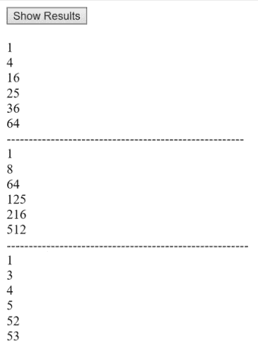

# 第八章：匿名方法和运行其自己委托的对象

在本章中，我们将讨论匿名函数。

# 将“显示结果”按钮添加到 HTML

打开一个项目，在<html>标签内放入一个写着“显示结果”的按钮。为此，转到工具箱并获取一个“按钮”控件。将其拖放到以<form id=...开头的行下方。您可以删除<div>行，因为您不需要它们。确保在按钮行的末尾插入<br>标记。

```cs
<asp:Button ID="Button1" runat="server" Text="Show Results" /><br />
```

接下来，我们将向用户显示一些结果。要做到这一点，请转到设计视图，并双击“显示结果”按钮。这将带我们进入`Default.aspx.cs`。删除`Page_Load`块。该项目的起始代码的相关部分应如*图 8.3.1*所示：


图 8.3.1：该项目的起始代码部分

# 简化编写函数

在主体内，但在以`protected void Button1_Click...`开头的行之上，输入以下内容：

```cs
private void ShowSquare(double x) => sampLabel.Text += "<br>" + (x * x);
```

请记住，`=>`是一个*表达式成员*。它是一个函数。换句话说，它采用 Lambda 的形式。在行的末尾，我们返回`x * x`。正如您所看到的，这是编写函数的一种非常简化的方式。

接下来，我们需要添加命名空间。因此，在`using System`之后，输入以下行：

```cs
using System.Collections.Generic;
using System.Threading;
```

现在，在按钮的事件内，我们将放置以下代码列表；因此，在以`protected void Button1_Click...`开头的行下方的一组大括号之间输入此行：

```cs
List<double> vals = new List<double>(new double[] { 1, 2, 4, 5, 6, 8 });
```

在这一行中，您正在创建一个新的`double`数据类型列表，然后将对其进行初始化。您可以以几种方式做到这一点，但您可以只需编写一个数组，然后输入一些值。这些值并不重要。这将创建一个`double`数据类型的列表。

# 对所有值执行操作

现在，您可以对所有值执行操作。因此，要执行此操作，输入以下内容：

```cs
vals.ForEach(ShowSquare);
```

这是如何对每个值调用`ShowSquare`的方法。请注意，在这种情况下，`ShowSquare`是有名字的。`ShowSquare`代表这个表达式，`sampLabel.Text += "<br>" + (x * x)`；所以它是一个*有名字的数量*。

# 创建匿名函数或方法

现在，如果您愿意，您还可以做一些不涉及名称的事情。例如，您可以输入以下内容：

```cs
vals.ForEach(delegate (double x)
```

接下来，我们将定义一组大括号之间的主体或逻辑。这是一个无名或*匿名*的。例如，您可以在此行下方输入以下内容（请注意，在关闭大括号后用括号和分号结束）：

```cs
{
    sampLabel.Text += "<br>" + Math.Pow(x, 3);
});
```

这一行与前一行做的事情类似。唯一的区别是我们没有调用任何有名字的东西；我们只是使用`delegate`关键字定义了一个*匿名函数*，一个无名函数。当然，这会接受一个值，即`x`值。然后你对`x`值进行立方；`Math.Pow(x, 3)`的意思是，立方然后使用`+=`将其附加到标签上，并使用`<br>`将其推到下一行，如常规操作。

现在，在下一个阶段，您还可以执行以下操作，这是非常有趣的：

```cs
Thread td = new Thread(delegate ())
```

信不信由你，虽然这并不被推荐，但在`new Thread`之后，您甚至可以输入`dele`而不是`delegate`。

现在，当您创建这种类型的对象时，您还可以创建一个委托。因此，当您创建这个`Thread`对象时，您也在创建一个匿名函数。换句话说，您正在发送一段处理，以便它在自己的线程上运行，然后您可以插入以下内容：

```cs
{
List<double> arrs = new List<double>(new double[] { 1, 4, 5, 3, 53, 52 });arrs.Sort();arrs.ForEach(x => sampLabel.Text += $"<br>{x}");
}); 
```

再次注意，在这里，您在关闭大括号后用括号和分号结束。

# 启动线程

现在，像这样使用线程，您可以在下一行启动一个线程，如下所示：

```cs
td.Start();
```

这将在自己的小独立处理中启动线程，与主程序分开。

因此，这里的重要思想是，这种匿名的东西非常强大。例如，您可以构建一个匿名函数或方法，就像我们创建的前面的那个一样。它可以运行，但没有命名，基本上，即使您创建了一个新的`Thread`对象，也可以创建一个委托。换句话说，它可以进行一些自己的处理，您不必将其放入其他函数或任何其他地方。

# 运行和修改程序

现在，让我们运行程序。为此，请在浏览器中启动并单击“显示结果”按钮。查看结果，如*图 8.3.2*所示。程序存在一个小问题。我们将很快了解问题的原因，然后解决它：


图 8.3.2：我们程序的初始运行

现在，我还想告诉您另一个函数，`Join`。输入以下内容作为下一行：

```cs
td.Join();
```

现在，如果您将鼠标悬停在`Join`上，弹出提示会说阻止调用线程，直到线程终止，同时继续执行标准 COM 和 Send，消息泵。如果您将鼠标悬停在`Start`上，弹出提示会说导致操作系统将当前实例的状态更改为 ThreadState.Running。换句话说，在`Thread td = new Thread(delegate ()`块中，`Thread`是一个对象。在这种情况下，您正在创建一个具有委托的新线程，因此它在自己的处理线程中运行，远离主程序。所以，这有点有趣。

现在请注意，当我们打印这些内容时，实际上只有两个主要列表，第二个列表基本上附加到第一个列表上。因此，让我们这样做；否则，我们将无法清楚地看到效果。在前面的`vals.ForEach(ShowSquare)`行下面，输入以下内容：

```cs
sampLabel.Text += "<br>------------------------------------------------------";
```

请注意，我用引号中的长破折号分隔了这一点。

接下来，在这个之后，让我们在`sampLabel.Text += "<br>" + Math.Pow(x, 3)`行的闭合大括号、括号和分号下面再做一次。

```cs
sampLabel.Text += "<br>-------------------------------------------------------";
```

现在，如果我们删除`td.Join()`并运行程序，只有两个列表，如*图 8.3.3*所示。然而应该有三个：


图 8.3.3：修改后的运行只显示两个列表

因此，重新插入`td.Join();`并在浏览器中再次查看。现在，正如*图 8.3.4*所示，有三个列表，正如应该有的那样：



图 8.3.4：最终程序运行显示三个单独的列表

再次回顾，我们在本程序中做了以下工作：

1.  首先，我们调用了`vals.ForEach(ShowSquare)`，生成了一个列表。

1.  然后我们调用了以`vals.ForEach(delegate (double x)`开头的块，作为生成列表的匿名函数或方法。

1.  接下来，我们使用以`Thread td = new Thread(delegate ()`开头的块创建了这个匿名对象`td`，它是一个具有自己匿名方法的`Thread`类，运行在自己独立的线程中。

1.  最后，我们启动了它，`Join`函数阻塞当前线程，等待`Thread td = new Thread(delegate ()`块执行，然后恢复，这样就显示了所有内容。

这些是这种匿名构造的基础知识。

# 章节回顾

回顾一下，包括注释的本章`Default.aspx.cs`文件的完整版本如下所示：

```cs
//using is a directive
//System is a name space
//name space is a collection of features that our needs to run
using System;
using System.Collections.Generic;
using System.Threading;
//public means accessible anywhere
//partial means this class is split over multiple files
//class is a keyword and think of it as the outermost level of grouping
//:System.Web.UI.Page means our page inherits the features of a Page
public partial class _Default : System.Web.UI.Page
{
    private void ShowSquare(double x) => 
    sampLabel.Text += "<br>" + (x * x);//expression bodied function
    protected void Button1_Click(object sender, EventArgs e)
    {
        //make list of double values
        List<double> vals = 
        new List<double>(new double[] { 1, 2, 4, 5, 6, 8 });
        //call ShowSquare on each value inside the list
        vals.ForEach(ShowSquare);
        sampLabel.Text += "<br>-----------------------------------" ;
        //lines 21-24 define an unnamed method, which is applied to each 
        //value in the list
        vals.ForEach(delegate (double x)
        {
            sampLabel.Text += "<br>" + Math.Pow(x, 3);
        });
        sampLabel.Text += "<br>-----------------------------------" ;
        //lines 28-35 create a thread object, and an unnamed method inside
        //it that spawns
        //a thread of processing separate from the "main" program
        Thread td = new Thread(delegate ()
        {
            List<double> arrs = 
            new List<double>(new double[] { 1, 4, 5, 3, 53, 52 });
            arrs.Sort();
            arrs.ForEach(x => sampLabel.Text += $"<br>{x}");
        });
        //start the thread
        td.Start();
        td.Join(); //this is needed to ensure that the thread 
        //"td" runs, and then joins back to the
        //current, main thread, so the program finishes running
    }
} 
```

# 摘要

在本章中，您学习了匿名函数。您简化了编写函数，对所有值执行了操作，创建了匿名函数或方法，并启动了一个线程。

在下一章中，我们将介绍语言的基础知识：语言集成查询。这是一种在 C#代码中直接操作数据的强大方式。
