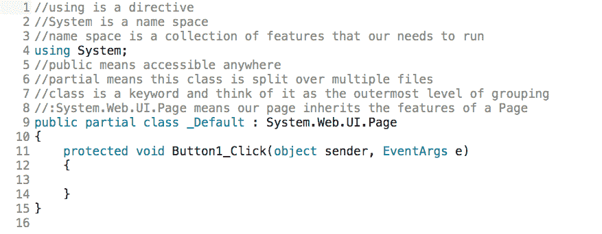

# 第九章：使用 LINQ 和内置类型的 C#

在本章中，我们将讨论 LINQ 的基础知识。你将学习如何使用 LINQ 或语言集成查询。这是一种在 C#代码中直接操作数据的强大方式。

# 在 HTML 中添加一个显示值按钮

打开一个项目，在`<form id=...`开头的行下面，在<html>中放置一个按钮。更改按钮上的文本为不同的内容，例如，显示值。

现在切换到设计视图，并双击显示值按钮。这将带我们进入`Default.aspx.cs`。删除`Page_Load`块。我们不需要它。该项目的起始代码的相关部分应该如*图 9.4.1*所示：



图 9.4.1：该项目的起始代码部分

我们将在本章中使用一些代码，但是它是从上到下顺序执行的。

# 添加命名空间

首先要做的是添加两个新的命名空间；因此，在`using System`之后输入以下内容：

```cs
using System.Linq;
using System.Collections.Generic;
```

LINQ 代表语言集成查询，`using System.Collections .Generic`用于处理列表。这是我们正在使用的两个新命名空间。

# 使用 IEnumerable 通用接口

接下来，在以`protected void Button1_Click...`开头的行下面的花括号之间，我们将首先创建一个名字数组。为此，请输入以下内容：

```cs
IEnumerable<string> names = new string[] { "john", "job", "janet", "mary", "steve" };
```

让我们称其为`names`，然后说，创建一个`new string`数组。然后，为了指定初始化列表，我们输入一系列用引号括起来的名字，并以分号结束。

现在注意一下，左侧有`IEnumerable`。这是一个通用接口。正如你所看到的，这一行中的`new string`数组可以通过这种方式创建，因为可以取一个数组然后逐个遍历，这样数组中的每个条目都是一个字符串。所以，它是`IEnumerable`：我们可以在其中列出值，要列出的每个值都是一个字符串。枚举意味着列举。

# 将数组转换为整数列表

接下来，在这行下面输入以下内容：

```cs
List<int> lst = new int[] { 1, 2, 12, 4, 5, -10, 5, 25, 54 }.ToList();
```

要创建一个整数列表，我们说`lst = new int[]`。然后我们指定初始化列表和这里显示的值。你使用什么值都无所谓。我会向你展示一些方法。当然，你可以想象到，有很多方法。

现在，请注意，你不能在数组之后停止编写这行。如果你这样做了，弹出提示会说无法隐式转换类型'int[]'为'System.Collections.Generic.List<int>';因此你必须添加`.ToList()`。你可以将一个数组转换为整数列表。

# 确定集合中的值

现在我们有了要遍历的项目集合，我们可以这样做。为此，请输入以下内容：

```cs
IEnumerable<int> valuesMoreThanTen = lst.Where(x => x >10);
```

在这里，我们首先操作数字值列表，所以我们说`valuesMoreThanTen`。为了实现这一点，你输入列表的名称，即`lst`。注意弹出提示中出现的所有函数。其中之一是`Where<>`。在选择`Where<>`之后，你可以指定一个条件，即在我们的情况下，当`x`大于`10`时，或者`(x => x > 10)`，并以分号结束。

如果你将鼠标悬停在`Where`上，并查看它所说的`IEnumerable<int>`，它表示返回的是一个`IEnumerable`结构，我们可以通过`foreach`循环进行迭代。此外，它说`(Func<int,bool>...`，然后是一个`predicate`委托。所以，我们将取每个值，然后基本上对其应用一些操作。我们将检查某个条件是否成立：条件对它成立或不成立。

正如你所看到的，我们基本上有了 LINQ，然后在其中有一个 Lambda 表达式。因此，要使用它，你将在下面输入以下内容：

```cs
valuesMoreThanTen.ToList().ForEach(x => sampLabel.Text += $"<br>x={x}");
```

# 将值转换回列表

在`valuesMoreThanTen`之后，你想要使用`foreach`循环。为了做到这一点，你必须将其转换回列表，因为记住，`IEnumerable`不是一个列表。这就是为什么如果你在`valuesMoreThanTen`的`.`（点）后面直接输入`foreach`循环，它不会显示出来。你将它转换为列表，然后`foreach`就会显示出来。现在你可以再次显示这些值；所以在`foreach x`中，你将取出`x`的值，并在标签中显示它，就像在前一行代码中所示的那样。这一行现在将显示`valuesMoreThanTen`列表中的每个`x`值。

现在，你可以通过检查它来确定`12`、`25`和`54`应该打印出来。这是第一件事。现在，让我们在这一行下面再显示一条水平线。所以，输入以下内容：

```cs
sampLabel.Text += "<br><hr/>";
```

# 从列表中提取值并对其进行排序

现在，想象一下，你有一个名字数组，你想提取那些，例如，有一个`j`字母的名字，然后按照从最短到最长的顺序进行排序。当你操作数据时，你可以做这样的事情。所以，输入以下内容：

```cs
IEnumerable<string> namesWithJSorted = names.Where(name => name.Contains("j")).OrderBy(name => name.Length);
```

在这一行中，`IEnumerable`的类型是`string`。这就是为什么我们说`IEnumerable`是泛型的，因为它可以操作整数、字符串等等。接下来，你说`namesWithJSorted`，我以这种特定的方式命名这个变量，因为函数将从左到右链接。所以，你输入名字数组的名称，然后输入`Where(name => name.Contains("j")`来检查每个名字是否包含字母`j`。然后，一旦你有了所有包含字母`j`的名字，你将按照每个名字的长度对结果进行排序，使用`OrderBy(name => name.Length)`。

再次，从左到右，你可以链接这些函数。这就是 LINQ。正如你在每个函数中所看到的，基本上都有一个 Lambda 表达式：`Where`，然后是`OrderBy`。它很强大，对吧？

接下来，要显示它，记住，因为`namesWithJSorted`是`IEnumerable`，你可以将它转换回列表，然后使用`foreach`；或者，如果你愿意，你也可以直接输入以下内容：

```cs
foreach(var str in namesWithJSorted)
{
    sampLabel.Text += $"<br>{str}";
}
```

记住，在直接前一行中，`+=`是用来追加的，`$`是用于字符串插值，`<br>`是用来换行的。要打印的实际值出现在花括号内。

这些是这些概念的基础。

# 运行程序

现在，我们必须确认这将按预期工作。所以，打开你的浏览器，点击“显示值”按钮。正如你在*图 9.4.2*中所看到的，它显示了 x=12、x=25 和 x=54，然后在下面显示了名字 job、john 和 janet。每个名字都包含一个`j`字母，并且按照预期的顺序列出：


图 9.4.2：运行本章程序的结果

记住，这基本上是一个组合。你有一个 Lambda 表达式`(x => x > 10)`，然后你把它放到`where`或`OrderBy`这样的方法中。当你把这两者结合起来时，代码变得非常强大，正如你所看到的，非常表达，让你能够完成很多事情。还要记住，在左侧，LINQ 中的许多结果返回的是`IEnumerable`类型的项目。

# 章节回顾

回顾一下，包括注释在内的本章`Default.aspx.cs`文件的完整版本如下所示：

```cs
//using is a directive
//System is a name space
//name space is a collection of features that our needs to run
using System;
using System.Linq;
using System.Collections.Generic;
//public means accessible anywhere
//partial means this class is split over multiple files
//class is a keyword and think of it as the outermost level of grouping
//:System.Web.UI.Page means our page inherits the features of a Page
public partial class _Default : System.Web.UI.Page
{
    protected void Button1_Click(object sender, EventArgs e)
    {
        //line 16 creates array of names
        IEnumerable<string> names = new string[] { "john", "job", "janet",
        "mary", "steve" };
        //line 18 creates array of integers, and converts to 
        //list of integers
        List<int> lst = new int[] { 1, 2, 12, 4, 5, -10, 5, 25, 54 }.ToList();
        //line below puts a lambda expression inside Where to 
        //create a query
        IEnumerable<int> valuesMoreThanTen = lst.Where(x => x > 10);
        //line 22 prints the results from lines 20 above
        valuesMoreThanTen.ToList().ForEach(x => sampLabel.Text += $"<br>x={x}");
        sampLabel.Text += "<br><hr/>";
        //line 25 below chains functions, going from left to right, to 
        //produce a list of names with j, sorted by length
        IEnumerable<string> namesWithJSorted = 
        names.Where(name => name.Contains( "j")).OrderBy
        (name => name.Length);
        //lines below display the names that are generated line 25 above
        foreach (var str in namesWithJSorted)
        {
            sampLabel.Text += $"<br>{str}";
        }
    }
}
```

# 总结

在本章中，我们讨论了 LINQ 的基础知识。你学会了如何使用 LINQ，或者说是语言集成查询。这是一种在 C#代码中直接操作数据的强大方式。你添加了命名空间，使用了`IEnumerable`泛型接口，将数组转换为整数列表，确定了集合中的值，将这些值转换回列表，并提取并排序了这些值。

在下一章中，我们将讨论如何在自定义类型中使用 LINQ。
