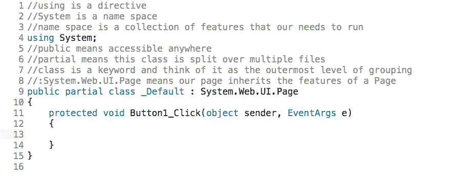

# 第十章：使用 C#和 LINQ 以及自定义数据类型

在本章中，我们将讨论如何使用 LINQ 与自定义类型。

# 在 HTML 中添加一个显示人员的按钮

打开一个项目。转到`Default.aspx`，并在以`<form id=...`开头的行下面放置一个按钮。要做到这一点，转到工具箱，获取一个`Button`控件，并将其拖放到那里。更改按钮上的文本以显示“显示人员”：

```cs
<asp:Button ID="Button1" runat="server" Text="Show People" />
```

# 设置数据库

我们将有一个数据库，我们将对其进行查询，并且我们将展示那些，例如，名字中有某个字母的人，赚取一定数量的钱，并以某种方式进行排序。

为了实现这一点，转到设计视图，并双击“显示人员”按钮。这将带我们进入`Default.aspx.cs`。删除`Page_Load`块。该项目的起始代码的相关部分应该看起来像*图 10.5.1*：



图 10.5.1：该项目的起始代码部分

在下一阶段，首先转到文件顶部，并在`using System`之后输入以下内容：

```cs
using System.Linq;
```

接下来，我们将创建一个类。我们将其称为`Person`。因此，在以`public partial class...`开头的行上面插入以下内容：

```cs
public class Person
```

# 使用 LINQ 制作自定义类型

现在，在上一行下面的花括号集之间，您将声明两个自动属性，如下所示：

```cs
public string Name { get; set; }
public decimal Salary { get; set; }
```

然后，为了创建一个构造函数，请在这些行下面输入以下内容：

```cs
public Person(string name, decimal salary)
```

接下来，您将在构造函数内设置属性的值。因此，请在以下这些行下面的一组花括号之间输入以下内容：

```cs
Name = name; Salary = salary;
```

这是我们简单的自定义类型`Person`，具有两个自动属性和一个带参数的构造函数。

# 设置一个人员数组

在下一阶段，您将创建一个人员数组；请在以下以`protected void Button1_Click....`开头的行下面的一组花括号之间输入以下内容：

```cs
Person[] people = new Person[] { new Person("John", 76877), new Person("Bobby", 78988), new Person("Joan", 87656) };
```

# 查询数组

现在，要查询这个，请在此行下面输入以下内容：

```cs
IEnumerable<Person> peopleWithN = people.Where(per => per.Name.EndsWith("n")).OrderByDescending(per => per.Salary);
```

当您输入时，注意到`IEnumerable`不会显示出来，因此您必须再次转到文件顶部，并在`using System.Linq`之后输入以下内容：

```cs
using System.Collections.Generic;
```

现在让我们在下面使用它；因此，在以`Person[] people...`开头的行下面，输入前面提到的`IEnumerable<Person>...`行。

在这里，`Person`是可以从人员列表中枚举的对象类型。`peopleWithN`表示我们将搜索名字中有字母`n`的人。实际上，代码搜索名字以`n`结尾的人。（请注意，`per`代表列表中的每个人。）此外，我们按工资降序排序。

因为人们有时会不一致地输入信息，所以您首先必须将所有内容转换为等效的情况，但这是您自己要解决的问题。

请记住，在这一行中，我们有`people`，这是某种对象的名称，以及`Where`，一个扩展方法，后跟一个 Lambda。接下来，我们使用`OrderByDescending`，您可以从方法列表中选择它，以按降序排序值，例如人的工资。

因此，此行的目的是选择每个名字以`n`结尾的人，然后按工资排序结果。这将产生一个`IEnumerable`对象，现在您当然可以逐步进行，并在下一行中说以下内容：

```cs
foreach(Person p in peopleWithN)
```

现在，为了打印所有内容，请在此行下面的一组花括号之间输入以下内容：

```cs
sampLabel.Text += $"<br>{p.Name} {p.Salary:C}";
```

在这里，我们首先放置了`Name`变量，然后是格式化为货币的`Salary`变量。

# 运行程序

这是我们程序的核心。在浏览器中启动它。单击“显示人员”按钮，结果将显示如*图 10.5.2*所示：


图 10.5.2：运行程序的结果

所以，琼赚了$87,656.00，约翰赚了$76,877.00。他们被选中是因为他们的名字都以小写字母**n**结尾，正如您所看到的，然后按工资降序排序。所以，它的运行结果符合预期。正如您所看到的，您还可以使用 LINQ 定义自定义类型，比如在`public class Person`下面的花括号中。它非常强大并且运行良好。

# 章节复习

为了复习，包括注释在内的本章的`Default.aspx.cs`文件的完整版本如下所示：

```cs
//using is a directive
//System is a name space
//name space is a collection of features that our needs to run
using System;
using System.Linq;
using System.Collections.Generic;
//public means accessible anywhere
//partial means this class is split over multiple files
//class is a keyword and think of it as the outermost level of grouping
//:System.Web.UI.Page means our page inherits the features of a Page
public class Person
{
    public string Name { get; set; } //auto implemented properties
    public decimal Salary { get; set; }
    public Person(string name, decimal salary)
    {
        Name = name; Salary = salary;//set values of properties
    }
}
public partial class _Default : System.Web.UI.Page
{
    protected void Button1_Click(object sender, EventArgs e)
    {
        //make array of people
        Person[] people = new Person[] { new Person("John", 76877), 
                                         new Person("Bobby",78988), 
                                         new Person("Joan", 87656) };
        //find all people with "n" as the last letter, and then display 
        //the results sorted from high to low salary
        IEnumerable<Person> peopleWithN = 
        people.Where(per => per.Name.EndsWith("n")).OrderByDescending
        (per => per.Salary);
        //display name and salary formatted as currency
        foreach (Person p in peopleWithN)
        {
            sampLabel.Text += $"<br>{p.Name} {p.Salary:C}";
        }
    }
}
```

# 摘要

在本章中，我们讨论了如何将 LINQ 与自定义类型一起使用。您设置了一个数据库，使用 LINQ 创建了一个自定义类型，设置了一个人员数组，并对数组进行了查询。

在下一章中，您将学习如何使用查询语法编写查询。
