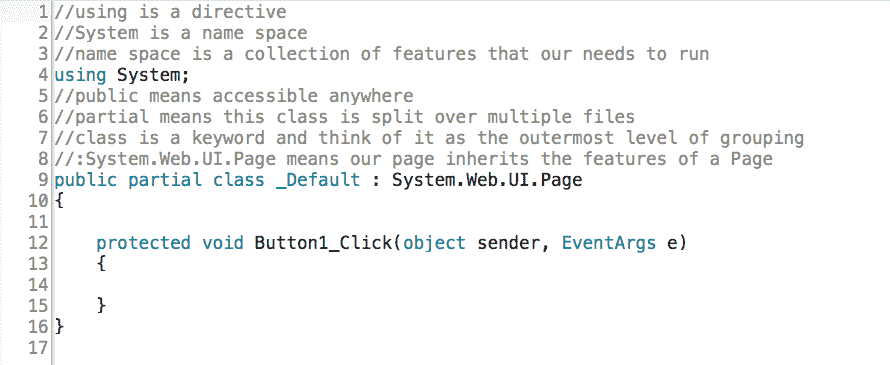

# 第十三章：使用 LINQ 对元组进行总结

在本章中，您将了解元组。这些基本上是几个值的集合。

# 在 HTML 中添加显示元组摘要值按钮

打开一个项目，并在以`<form id=....`开头的行下放置一个按钮。将按钮文本替换为`显示元组摘要值`。

现在，切换到设计视图，并双击显示元组摘要值按钮。这将带我们进入`Default.aspx.cs`。删除`Page_Load`块。该项目的起始代码的相关部分应该看起来像*图 13.8.1*：



图 13.8.1：该项目的起始代码部分

# 介绍元组

现在，首先我们将创建一个返回元组值的函数。那么，什么是元组？让我们定义它们。正如我之前所说，它基本上是几个值的集合。现在，在 C#中，这意味着您将在以`public partial class...`开头的行下的封闭大括号下方输入以下内容：

```cs
private static Tuple<double, double, double, double> SummarizeList(List<double> listDoubles)
```

在前一行中，`Tuple`是一个类。然后，要定义元组存储的值的数量，请记住我们与向量的工作。我们向向量添加了两个或三个值。这是一个类似的概念。如果您将鼠标悬停在`Tuple`上，它会说*Tuple 表示 n 元组*，其中*n*是八或更多，因此 T1、T2、T3，一直到 TRest。哇，所以您可以创建八个或更多的元组！

# 添加命名空间

在我们的案例中，我们放置了`<double, double, double, double>`。所以，这是一个可以容纳四个值的元组。请注意，当您输入时，`List<double>`没有显示，因此您需要添加一些命名空间。在文件顶部的`using System`下，输入以下内容：

```cs
using System.Collections.Generic;
using System.Linq;
```

在这里，我们使用了通用集合和 LINQ，现在`List<double>`显示为高亮显示，应该称为`listDoubles`。

# 使用元组制作列表

在过程的下一个阶段，您将创建此列表。因此，在以下行的大括号之间输入以下内容：

```cs
Tuple<double, double, double, double> summary = Tuple.Create(listDoubles.Sum(),listDoubles.Average(),listDoubles.Max(), listDoubles.Min());
```

要形成元组，您说`Tuple.Create(listDoubles.Sum()`。`Tuple`是类的名称，该类内的成员之一是`Create`函数，因此选择它。现在，我们可以创建一个具有四个条目的元组。接下来，我们说`listDoubles.Sum()`。请注意，当您输入`Sum`时，它是一个扩展方法。如果您删除`Sum`，您会注意到`Linq`变为灰色。这再次确认了为什么需要`Linq`——用于`Sum`函数。

这个元组中的第一个条目是列表的总和。记住，我们正在调用`summary`。所以，这就像是列表中条目的统计摘要。除了`listDoubles.Sum()`，您当然也可以有其他一些。您可以有一个平均值，`listDoubles.Average()`，您还可以添加`listDoubles.Max()`和`listDoubles.Min()`。

# 返回元组

最后，您可以返回元组。为此，请在以下行下输入以下内容：

```cs
return summary;
```

在您之前写的第一行中，记住`private`表示只有在那里可访问，`static`表示它在类级别上运行，这意味着您可以直接使用名称调用`SummarizeList`——您不需要将其放在对象上。

现在，在这种特殊情况下，它将返回这个结构，`Tuple<double, double, double, double>`，称为元组，在这里只是一种存储四个双精度值的方式。然后，要为第一个条目创建一个元组，您使用 LINQ。然后您使用 LINQ 来获取第二个条目，LINQ 来获取第三个条目，最后，LINQ 来获取第四个条目。因此，`Sum`，`Min`，`Max`和`Average`都是扩展方法，然后您将其`return`。

# 创建一个双精度列表

现在，对于下一阶段，看一下按钮单击事件。这里的代码非常简单。首先，在以`protected void Button1_Click...`开头的行下的大括号内输入以下内容。您将创建一个名为`lst`的双精度列表，如下所示：

```cs
List<double> lst = new List<double> { 1, 2, 5, 68, 899, 1, -989, 0.1143, 98, 2553 };
```

在`new List of double`值之后，通过在大括号中添加一些数字来指定初始化程序——不管它们是什么，对吧？放一些负数、一些小数、一些整数等等。

# 总结列表

接下来，我们将调用`SummarizeList`。因此，请在此行下面输入以下内容：

```cs
var results = SummarizeList(lst);
```

在这种情况下，老实说，`var`很容易，对吧？如果你不使用它，你将不得不输入`Tuple<double, double, double, double>`，这将是数据类型。换句话说，那真的很啰嗦，而且占用了很多空间。所以，请记住，`var`表示隐式数据类型，但它足够聪明，知道数据类型是什么。

# 显示结果

然后一旦你返回它，你可以去那里的项目商店。因此，你可以输入以下内容：

```cs
sampLabel.Text = $"Sum={results.Item1}";
```

在下一阶段，复制这行并直接粘贴到下面。编辑`Average`函数的文本如下：

```cs
sampLabel.Text += $"<br>Average={results.Item2}";
```

确保你调用这些行的方式与函数对应；所以，`Sum`、`Average`、`Max`和`Min`。再次复制上一行并直接粘贴到下面，这样你就不必追加了。由于下一个是为`Max`，编辑文本如下：

```cs
sampLabel.Text += $"<br>Max={results.Item3}";
```

这将是`Item3`和你可以提取的元组。

最后，让我们再做一次。因此，再次复制上一行并直接粘贴到下面。由于最后一个是为`Min`，编辑文本如下：

```cs
sampLabel.Text += $"<br>Min={results.Item4}";
```

当然，这是`Item4`和你可以提取的元组。

# 运行程序

现在，让我们在浏览器中加速。点击显示元组摘要值按钮。结果显示在*图 13.8.2*中：


图 13.8.2：运行本章程序的结果

你看到了 Sum、Average、Max 和 Min，所以它的工作符合预期。

现在，作为对此更现实的扩展，想象一个元组列表。你肯定可以做到，所以你可以在最后一行下面添加类似以下内容：

```cs
List<Tuple<string, double, double, decimal>>;
```

你可以有一个元组列表。每个元组代表，例如，关于一个人的信息，然后你会有一个人的列表。这是让你思考的事情：如何构建它并为自己做一个项目。然而，这些都是基础。

# 章节回顾

回顾一下，包括注释的本章`Default.aspx.cs`的完整版本在以下代码块中显示：

```cs
//using is a directive
//System is a name space
//name space is a collection of features that our needs to run
using System;
using System.Collections.Generic;
using System.Linq;
//public means accessible anywhere
//partial means this class is split over multiple files
//class is a keyword and think of it as the outermost level of grouping
//:System.Web.UI.Page means our page inherits the features of a Page
public partial class _Default : System.Web.UI.Page
{
    private static Tuple<double, double, double , double> SummarizeList(List<double> listDoubles)
    {
        Tuple<double, double, double, double> summary = 
        Tuple.Create(listDoubles.Sum(),
        listDoubles.Average(), listDoubles.Max(), listDoubles.Min());
    return summary;
    }
    protected void Button1_Click(object sender, EventArgs e)
    {
        List<double> lst = 
        new List<double> { 1, 2, 5, 68, 899, 1, -989, 0.1143, 98, 2553 };
        var results = SummarizeList(lst);
        sampLabel.Text = $"Sum={results.Item1}";
        sampLabel.Text += $"<br>Average={results.Item2}";
        sampLabel.Text += $"<br>Max={results.Item3}";
        sampLabel.Text += $"<br>Min={results.Item4}";
    }
}
```

# 总结

在本章中，你学习了关于元组的知识，它基本上是几个值的集合。你创建了一个带有元组的列表，返回了元组，并对列表进行了总结。

在下一章中，我们将讨论使用 LINQ 来对相关结果进行分组。分组是在数据库中对结果进行分类的基本操作。
