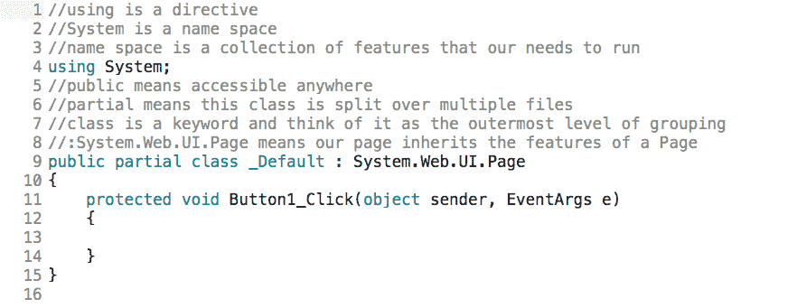
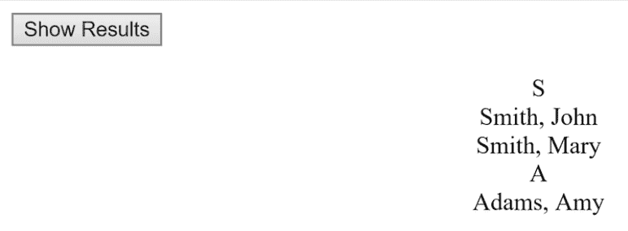

# 第十四章：用分组总结结果

在本章中，我们将讨论使用 LINQ 对相关结果进行分组。分组是在数据库中对结果进行分类的基本操作。

# 在 HTML 中添加一个显示结果按钮

打开一个项目。首先，我们将在 HTML 中放置一个按钮，上面写着“显示结果”；要做到这一点，在以`<form id=....`开头的行下面放置一个按钮。

```cs
<asp:Button ID="Button1" runat="server" Text="Show Results" /<br />
```

接下来，切换到设计视图，并双击“显示结果”按钮。这将带我们进入`Default.aspx.cs`。删除`Page_Load`块。这个项目的起始代码的相关部分应该看起来像*图 14.9.1*：



图 14.9.1：这个项目的起始代码部分

# 添加命名空间

首先，我们需要添加一些命名空间。要做到这一点，在文件顶部的`using System`下面输入以下内容：

```cs
using System.Linq;
using System.Collections.Generic;
```

# 创建学生类并定义字段

接下来，我们将创建一个名为`Student`的类。在以`public partial class _Default...`开头的行之上输入以下内容：

```cs
public class Student
```

接下来，要定义字段，在这一行下面的一对大括号之间输入以下内容：

```cs
public string Name { get; set; }
```

这里有一些属性，然后让我们再添加一个。在这一行下面输入以下内容：

```cs
public List<int> Grades;
```

在这里，`List<int>`是学生的成绩，让我们称之为`Grades`。

# 制作学生名单

现在，在下一个阶段，我们将制作一个学生名单。要做到这一点，首先在以`protected void Button1_Click...`开头的行之后的一对大括号之间输入以下内容：

```cs
List<Student> students = new List<Student>
```

在这里，`students`是列表的名称。然后我们有一个新的学生列表。接下来，为了初始化列表，我们将把所有新学生放在这一行下面的一对大括号之间，开始如下：

```cs
new Student {Name="Smith, John", Grades=new List<int> {78,98,67,87 } },
```

在前一行的`new Student`之后，你需要在一对大括号中分别放入每个学生的所有信息。首先，你需要定义`Name`的值，所以你将其设置为`Smith`，例如，`John`，插入一个逗号，然后在一个新的整数列表中放入 John 的`Grades`，将这些值设置为`78`，`98`，`67`和`87`。

接下来，我们需要为其他学生重复几次这个过程；所以，复制这一行，然后粘贴到下面。编辑这一行，将`Name`变量的值更改为`Adams`，`Amy`，然后将成绩更改为`91`，`99`，`89`和`93`：

```cs
new Student {Name="Adams, Amy", Grades=new List<int> {91,99,89,93 } },
```

这种编码水平非常实用和现实。在编码了五年之后，我可以告诉你，事情总是更有趣和更具挑战性。

现在，再重复一次这个过程。复制前面的行，然后粘贴到下面。编辑这一行，将`Name`变量的值更改为`Smith`，`Mary`，然后将成绩更改为`89`，`87`，`84`和`88`。确保在最后一个`new Student`类的下一行插入一个闭合的大括号和一个分号：

```cs
new Student {Name="Smith, Mary", Grades=new List<int> {89,87,84,88 }};
```

# 分组名称

同样，因为我们想要按姓和名分组，所以我使用了两个相同的姓。我们将以姓的首字母和名字的顺序进行分组显示结果。

接下来，我们将编写 LINQ 查询来完成分组。同样，这可以以更复杂的方式完成，但这是一个相对简单的例子。所以，在列表中最后一个`new Student`类的下一行输入以下内容：

```cs
var groupsByFirstLetters = from student in students group student by student.Name[0];
```

记住，`groupsByFirstLetters`表示姓的第一个字母。所以，要编写查询，你说`fromstudent`在`students`中，然后在下一行你`group`学生按`student.Name`分组。因为`Name`是一个字符串，你可以通过使用方括号提取第一个字符，然后在字符串中获取索引为`0`的值。这就是你可以写的原因。否则，它会显得有点神秘。

# 显示分组结果

现在，要以分组的方式显示结果，你必须使用嵌套的`foreach`循环。所以，接下来输入以下内容：

```cs
foreach(var studentGroup in groupsByFirstLetters)
```

在这里，情况变得更有趣。如果你将鼠标悬停在`var`上，它会告诉你`var`代表什么。它说，*它是一个字符和学生的分组。它代表具有共同键的对象集合*。

现在，我们可以按以下方式使用它。在前一行下面的一对大括号之间输入以下内容：

```cs
sampLabel.Text += $"<br>{studentGroup.Key}";
```

首先，我们想显示键，也就是每个姓氏的第一个字母，然后所有内容将在该姓氏的第一个字母下进行总结。所以，我们说`studentGroup.Key`。这里有一个叫做`Key`的属性，它是每个组的分组键。请记住，这里我们是按姓氏的第一个字母进行分组。所以，键就是那个数量。

接下来，一旦你修复了该组内的第一个字母，通常会有几个学生或几个项目，对吧？所以，现在你需要逐个显示这些项目。在下面输入以下内容：

```cs
foreach(var st in studentGroup)
```

注意一下关于`foreach`循环嵌套的情况。你看到了吗，在`foreach (var studentGroup in groupsByFirstLetters)`这一行中，外部的`for`循环获取了`studentGroup`变量，然后该组的键通过`sampLabel.Text += $"<br>{studentGroup.Key}"`这一行显示出来了？接下来，你将遍历每个组内的学生。这就是为什么在下一阶段，如果你将鼠标悬停在前一行的`var`上，你会看到它显示`student st`在`studentGroup`中。这就是细节。

接下来，为了显示它，输入以下内容在前面`foreach`行的大括号中： 

```cs
sampLabel.Text += $"<br>{st.Name}";
```

这就是核心。现在记住，我们从一个叫做`Student`的类开始。然后我们有一个学生列表。请注意，在学生列表中，你也可以使用一种语法，即属性的名称，然后是属性的值，不需要括号。你可以直接使用大括号在学生列表的定义中创建对象。

以`var groupsByFirstLetters...`开头的代码块为我们分组。然后我们需要外部循环`foreach (var studentGroup...`来显示每个组的键。然后内部的`foreach`循环`foreach (var st in studentGroup)`显示该组内的学生。所以，这两个循环是必需的，它们有不同的作用。

现在在浏览器中运行一下，看看结果。点击“显示结果”按钮。如你所见，在*图 14.9.2*中，你有字母 S，这是第一组的键，组内有 Smith, John 和 Smith, Mary。接下来，你有字母 A，这是第二组的键，组内有 Adams, Amy：



图 14.9.2：运行本章程序的结果

当然，这些可以进行排序，还可以做各种其他操作。但这些只是基础知识。所以，你看到这里可以做什么；还有许多更复杂的事情是可能的。

# 章节回顾

回顾一下，包括注释在内的本章`Default.aspx.cs`文件的完整版本如下所示：

```cs
//using is a directive
//System is a name space
//name space is a collection of features that our needs to run
using System;
using System.Linq;
using System.Collections.Generic;
//public means accessible anywhere
//partial means this class is split over multiple files
//class is a keyword and think of it as the outermost level of grouping
//:System.Web.UI.Page means our page inherits the features of a Page
public class Student //define student class
{
    public string Name { get; set; }
    public List<int> Grades;
}
public partial class _Default : System.Web.UI.Page
{
    protected void Button1_Click(object sender, EventArgs e)
    {
        //create list of students
        List<Student> students = new List<Student>
        {
            new Student {Name="Smith, John", 
            Grades=new List<int> {78,98,67,87}},
            new Student {Name="Adams, Amy", 
            Grades=new List<int> {91,99,89,93}},
            new Student {Name="Smith, Mary", 
            Grades=new List<int> {89,87,84,88}}
        };
        //create query that groups students by first letter of last name
        //Name is a string, so student.Name[0] means grab the 
        //first character for grouping
        var groupsByFirstLetters = 
        from student in students group student by student.Name[0];
        //the outer loop is needed to display the "Key", 
        //which is the first letter for each group
        foreach(var studentGroup in groupsByFirstLetters)
        {
            sampLabel.Text += $"<br>{studentGroup.Key}";
            //the inner loop is needed to display the students 
            //within each group
            foreach(var st in studentGroup)
            {
                sampLabel.Text += $"<br>{st.Name}";
            }
        }
    }
}
```

# 总结

在本章中，我们讨论了使用 LINQ 对相关结果进行分组。你创建了一个学生类并定义了字段，创建了一个学生列表，对名字进行了分组，最后显示了分组结果。

在下一章中，你将学习如何使用 LINQ 编写查询，以连接不同的结果集或不同的数据集。
