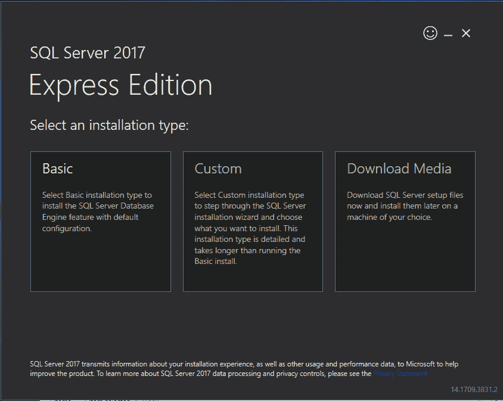
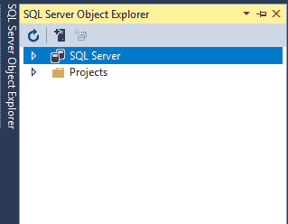
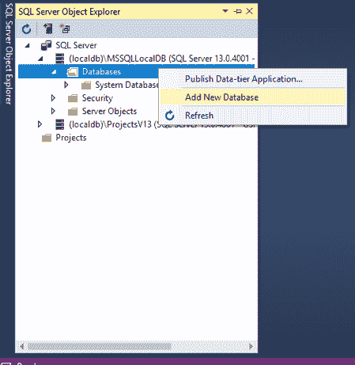
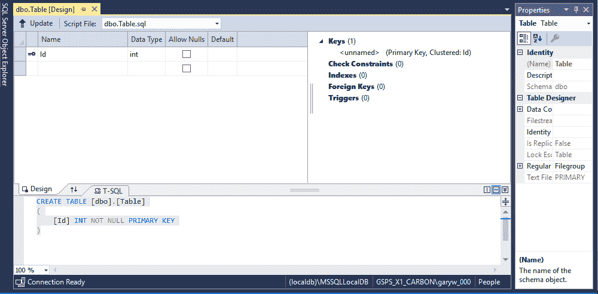
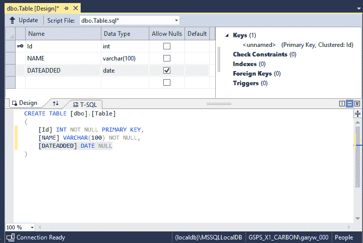

# 第十六章：下载、安装和运行 SQL Server 2017

在本章中，您将下载、安装和运行 SQL Server 2017 Express。

# 下载 SQL Server 2017 Express

单击以下链接，将您带到可以下载 SQL Server 2017 Express 的网站，如*图 16.1.1*所示：

[`www.microsoft.com/en-us/sql-server/sql-server-editions-express`](https://www.microsoft.com/en-us/sql-server/sql-server-editions-express)


图 16.1.1：SQL Server 2017 Express 版下载屏幕

接下来，单击“立即下载”按钮。下载完成后，双击`SQL Server2017-SSEI-Expr.exe`。在用户账户控制屏幕上选择“是”。

# 选择安装类型

接下来，您需要选择安装类型，如*图 16.1.2*所示。选择基本安装并接受许可条款协议：



图 16.1.2：从安装类型屏幕中选择基本安装

# 安装程序

接下来，要么接受默认的安装位置，要么选择自己的位置。然后安装程序将下载并安装。在安装过程中要耐心等待，因为这是一个很大的程序，可能需要一点时间。

安装完成后，您将看到一个类似于*图 16.1.3*的屏幕：


图 16.1.3：安装已成功完成

# 在 Visual Studio 中使用 SQL Server

一旦我们下载并安装了 SQL Server，让我们在 Visual Studio 中查看它。转到“视图”，然后选择“SQL Server 对象资源管理器”；它会在左侧打开一个小窗格，如*图 16.1.4*所示：



图 16.1.4：Visual Studio 中的 SQL Server 对象资源管理器窗格

接下来，单击“添加 SQL Server”按钮，如*图 16.1.5*所示：


图 16.1.5：添加 SQL Server 按钮

现在，出现了*图 16.1.6*中显示的对话框。注意其中写着 Windows 身份验证。这被称为*集成安全性*。您不必指定不同的用户名和密码。只需填写服务器名称字段，单击“连接”，然后您就可以登录：


图 16.1.6：连接对话框

您拥有的具体版本将与*图 16.1.7*中显示的版本不同，但这些是适用于许多不同版本的基本内容：


图 16.1.7：特定于 SQL Server 2017 Express 版本的数据库文件夹

# 创建 SQL Server 数据库

现在，我们将创建一个数据库。要做到这一点，展开“数据库”文件夹，右键单击它。选择“添加新数据库”，如*图 16.1.8*所示，并将数据库命名为`People`。



图 16.1.8：添加新数据库

# 添加和定义表

现在，展开 People 节点，然后在其中，您将看到一个名为 Tables 的文件夹。再次展开 Tables 节点，因为您需要添加自己的表。您的 SQL Server 对象资源管理器窗格应该看起来像*图 16.1.9*中显示的那样：


图 16.1.9：SQL Server 对象资源管理器窗格，其中 People 节点和 Tables 节点已展开

现在，右键单击“Tables”文件夹，然后选择“添加新表”。这将打开表定义阶段，如*图 16.1.10*所示：



图 16.1.10：表定义屏幕

这是您定义表的地方。看一下截图中左上角附近的第一个带有小键的字段。此键将用于标识表的记录或行，以及当您想要启用自动生成时。换句话说，您希望为每条记录分配的编号自动生成，这样您就不必跟踪它。

因此，如果右键单击键并选择属性，它会在屏幕右侧显示*图 16.1.11*中显示的面板：


图 16.1.11：表属性面板

现在，看标识规范的位置。展开该节点，然后在标识处，从下拉菜单中选择 True。如*图 16.1.12*所示，标识增量为 1，标识种子为 1，这很好。因此，它从 1 开始，每次添加新记录时，记录编号只增加 1。请注意，它还会自动更改代码视图。


图 16.1.12：设置标识规范

现在，在屏幕底部的 T-SQL 窗口中，它说`CREATE TABLE [dbo].[Table]`。如果您将`[Table]`更改为`[People]`，那么现在就是表名，如*图 16.1.13*所示：


图 16.1.13：更改表的名称

在以下行中，`[Id]`是列或字段的名称；`INT`是数据类型，`NOT NULL`表示必须指定条目，`PRIMARY KEY`用于标识记录；您现在知道`IDENTITY`是什么了，因为您在之前的步骤中已经看到了它。

# 向表中添加字段

现在，您将添加自己的字段和列。因此，接下来，输入以下内容：

```cs
[NAME] VARCHAR(100) NOT NULL
```

这是`NAME`字段，数据类型是`varchar`，代表可变字符。这基本上是一个文本字段，因此将长度指定为`100`，并且因为条目应该被指定，我们将使其为`NOT NULL`。

让我们再添加一个字段。要做到这一点，请输入以下内容：

```cs
[DATEADDED] DATE NULL
```

在这里，`DATE ADDED`是记录添加的日期，`DATE`是数据类型。您的屏幕应该看起来像*图 16.1.14*中显示的那样。

同样，如果您不想要空值，可以在设计窗口中取消选中。因此，设计选项卡中的表视图和代码视图是相互交互的：



图 16.1.14：已向表中添加了两个字段，NAME 和 DATEADDED

这里需要注意的一点是选项卡上标有 T-SQL。嗯，SQL 是*结构化查询语言*，微软版本是 T-SQL 或*Transact 结构化查询语言*。核心基本相同，但在微软版本中有一些附加功能。

# 更新数据库的结构

现在，您必须更新事物的结构，因此点击屏幕右上角的更新按钮。等待一会儿更新所有内容，然后点击更新数据库按钮。

如*图 16.1.15*所示，更新已成功完成：


图 16.1.15：数据库更新已完成并成功！

现在，在左侧的 SQL Server 对象资源管理器窗格中，如果展开 dbo.People，然后展开列，您可以看到默认字段或列以及您创建的新字段，如*图 16.1.16*所示：


图 16.1.16：我们在 dbo.People 中创建的列

# 章节回顾

在上面的截图中，从顶部开始，第二项表示服务器（SQL Server）。然后，在其中，您有数据库，如 People 图标所示。当您展开数据库时，会有一个表的图标，一个列的图标，以及表示主键的关键图标。因此，使用的小图标代表不同级别的嵌套在这个数据库结构中。

这些是基础知识。

因此，请确保您可以重新创建所有这些。退出此窗口，然后单击“查看”，转到“起始页”。然后，执行以下操作：

1.  打开 SQL Server 对象资源管理器窗格。

1.  右键单击 SQL Server。

1.  从下拉菜单中选择“断开连接”。

1.  右键单击，然后从下拉菜单中选择“添加 SQL Server”。

1.  浏览您的服务器。

1.  单击连接屏幕底部的“连接”按钮。

1.  展开服务器以显示“数据库”文件夹。

1.  展开“数据库”文件夹，您可以看到`People`数据库。

1.  打开“表”文件夹，那里有`dbo.People`表。

# 摘要

在本章中，您下载、安装并运行了 SQL Server 2017 Express。您在 Visual Studio 中使用 SQL Server，连接了两者，创建了一个 SQL Server 数据库，添加并定义了一个表，向表中添加了字段，并更新了数据库的结构。

在下一章中，您将学习如何连接到 SQL Server，然后在网页中显示数据库表中的记录。
