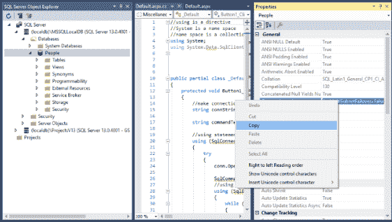
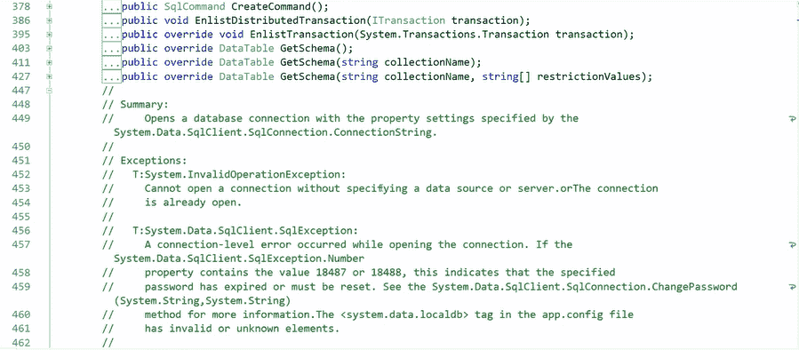
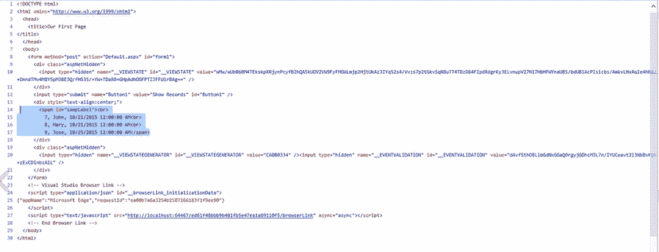

# 第十七章：编写手动连接到表并检索记录的代码

在本章中，您将学习如何连接到 SQL Server，然后在网页中显示数据库表`dbo.People`中的记录。

# 在 HTML 中添加显示记录按钮

打开一个项目，并在<html>页面中，在以`<form id=....`开头的行下放置一个按钮。为此，转到工具箱，获取一个`Button`控件，并将其拖放到那里。将按钮上的文本更改为`显示记录`。记住，*记录*只是一行信息，而一行当然是表中的一行，例如，从左到右横跨的一行。

现在，切换到设计视图，并左键双击显示记录按钮。这将带我们进入带有事件处理程序的`Default.aspx.cs`。删除`Page_Load`块。该项目的起始代码的相关部分应该如*图 17.2.1*所示：


图 17.2.1：该项目的起始代码部分

# 添加一个命名空间

要使其与 SQL Server 一起工作，您必须添加一个命名空间。因此，转到文件顶部，并在`using System`下输入以下内容：

```cs
using System.Data.SqlClient;
```

# 创建连接字符串

现在，除此之外，我们将逐行构建代码。您需要的第一件事是*连接字符串*。因此，让我们做以下事情：

1.  打开 SQL Server 对象资源管理器。

1.  右键单击数据库的名称，例如 People，在此处查看其属性。

1.  然后，要获取连接字符串，请确保展开属性窗格中的 General 节点，然后转到称为 Connection string 的节点，并双击它以选择它及其长描述。

1.  接下来，右键单击长描述并复制它。（手工构造很难准确，最好直接从那里复制）。此过程显示在*图 17.2.2*中：



图 17.2.2：复制连接字符串

1.  现在，在以`protected void Button1_Click...`开头的行下的大括号集合中输入以下内容：

```cs
string connString = @"Data Source=(localdb)\MSSQLLocalDB;Initial Catalog=People;Integrated Security=True;Connect Timeout=30;Encrypt=False;TrustServerCertificate=True;ApplicationIntent=ReadWrite;MultiSubnetFailover=False";
```

在这里，输入`string connString =`后，放置`@`符号以指示它是一个文字字符串或逐字字符串，应该准确解释。然后，在`""`符号中粘贴长字符串。因此，在这一行中，您当然有`Data Source`，计算机的名称，`Initial Catalog`作为数据库，`Integrated Security`是`True`，因为我们是这样设置的，以及一些其他现在并不是很重要的信息。

# 连接到 SQL Server

要通过页面连接到 SQL Server，我们将尝试以下操作。首先，您必须创建一个要发给 SQL Server 的命令。为此，请输入以下内容：

```cs
string commandText = "Select * from dbo.People";
```

在这里，`Select *`表示从`dbo.People`中选择所有内容。请记住，我们称我们的数据库为`People`；因此，这意味着从`People`数据库中的表中选择所有内容。这就是它的意思：从该表中选择所有内容。

现在，还有一件事。当您处理低级资源时，特别是读取硬盘时，例如，您必须建立与硬盘的通信通道。因此，因为这是这种情况，接下来键入以下内容：

```cs
using (SqlConnection conn = new SqlConnection(connString))
```

在这里，`using`是一个很好的构造，因为它允许您获取资源，使用资源，然后为您处理资源-非常好地和非常干净地。例如，`SqlConnection`就是这样一种东西。

现在，如果右键单击`SqlConnection`并从菜单中选择转到定义，并滚动到底部，您将看到有一行说 Dispose-protected override void Dispose。现在，如果展开`protected override void Open()`行，它说，使用由 system.Data.SqlClient.SqlConnection.ConnectionString 指定的属性设置打开数据库连接，如*图 17.2.3*所示：



图 17.2.3：protected override void Open 的扩展定义

如果你想知道可能会抛出哪些异常，所有的都列在`protected override void Open()`的定义中，同样也是`protected override void Close()`。

构造函数是定义中列出的第一个函数。所以，现在让我们关闭它。

# 捕获异常

在下一阶段，因为可能会抛出错误，我们将使用`try`和`catch`，这样我们就可以捕获它们并显示给用户。首先在以`using (SqlConnection conn...`开头的行下面的开花括号下面的一行中输入`try`：

```cs
try
```

接下来，在`try`下面插入一对花括号，然后在那里的闭合花括号下面输入以下内容：

```cs
catch (Exception ex)
```

# 显示错误

现在，如果生成错误，我们将显示它；因此在此行下面的一对花括号中输入以下内容：

```cs
sampLabel.Text = $"{ex.Message}";
```

如果数据库连接出现问题，将显示一个有用的消息。

# 打开连接

现在让我们继续连接。首先，让我们尝试打开它。在`try`下面的一对花括号中输入以下内容：

```cs
conn.Open();
```

这打开了一个连接。然后你将制作一个 SQL 命令，所以接下来输入以下内容：

```cs
SqlCommand sqlComm = new SqlCommand(commandText, conn);
```

这需要命令的文本。所以，我们将从前一行写的`Select * from dbo.People`中选择它；选择所有人，然后你说`(command,conn)`，这是连接的名称。

请记住，在以`string commandText...`开头的行中，参数是*command*，在下面的行中是*connection*。这是两件不同的事情。

# 使用 SQL Server 数据读取器

现在，在下一阶段，输入以下内容：

```cs
using (SqlDataReader reader = sqlComm.ExecuteReader())
```

在这里，`SqlDataReader`是一个类。如果你将鼠标悬停在它上面，弹出的工具提示会告诉你这个东西究竟能做什么。现在，如果你右键单击`SqlDataReader`并选择“转到定义”，它特别实现了一个叫做`IDisposable`的接口，以及你可以在下拉时看到的所有函数。此外，如果你右键单击`IDisposable`并选择“转到定义”，那么就会有`void Dispose()`，展开后会说，执行与释放、释放或重置非托管资源相关的应用程序定义的任务。这特指低级磁盘写入和读取等操作。

接下来，你会看到前一行中的`reader`变量和`sqlComm.ExecuteReader()`，它返回一个`SqlDataReader`类，正如你在工具提示中所看到的。

现在在此行下面的一对花括号中输入以下内容：

```cs
while(reader.Read())
```

现在，为什么这是合法的？将鼠标悬停在`Read`上，你会看到它返回一个布尔值，并且它说，将 SqlDataReader 推进到下一条记录。它返回`true`或`false`，无论是否还有记录可以读取。因此，在此行下面的一对花括号中输入以下内容：

```cs
sampLabel.Text += $"<br>{reader[0]}, {reader[1]}, {reader[2]}";
```

一定要放入`<br>`标签，因为可能会返回多个项目，所以你希望它们垂直堆叠。

在前一行中，`0`、`1`、`2`是索引；`reader[0]`、`reader[1]`和`reader[2]`表示`列 1`、`列 2`和`列 3`。这与索引为`0`的数组相同。

# 运行程序

现在在浏览器中启动这个程序。点击“显示记录”按钮，然后你会看到记录——Id、名称和日期，如*图 17.2.4*所示：


图 17.2.4：运行我们的程序的结果

如果你右键单击屏幕并选择查看源代码，如*图 17.2.5*中所示的高亮区域，它会生成一个 span。退出这个屏幕并关闭你不再需要的窗口。



图 17.2.5：如果查看源代码，你会看到它生成了一个 span

# 章节回顾

为了复习，本章的 HTML 文件的完整版本如下所示：

```cs
<!DOCTYPE html>
<html >
  <head runat="server">
    <title>Our First Page</title>
  </head>
  <body>
    <form id="form1" runat="server">
        <asp:Button ID="Button1" runat="server" Text="Show Records"
        OnClick="Button1_Click" />
      <div style="text-align:center;">
        <asp:Label ID="sampLabel" runat="server"></asp:Label>
      </div>
    </form>
  </body>
</html> 
```

本章的`default.aspx.cs`文件的完整版本，包括注释，如下所示：

```cs
//using is a directive
//System is a name space
//name space is a collection of features that our needs to run
using System;
using System.Data.SqlClient;//needed for SQL commands and connections
//public means accessible anywhere
//partial means this class is split over multiple files
//class is a keyword and think of it as the outermost level of grouping
//:System.Web.UI.Page means our page inherits the features of a Page
public partial class _Default : System.Web.UI.Page
{
    protected void Button1_Click(object sender, EventArgs e)
    {
        //make connection string
        string connString = @"Data Source=DESKTOP-4L6NSGO\SQLEXPRESS;Initial Catalog=People;Integrated Security=True;Connect Timeout=15;Encrypt=False;TrustServerCertificate=False;ApplicationIntent=ReadWrite;Mu
ltiSubnetFailover=False";
        //this is the SQL that runs against the table
        string commandText = "Select * from dbo.People";
        //using statement here helps to ensure connection is properly
        //disposed of here
        using (SqlConnection conn = new SqlConnection(connString))
        {
            try
            {
                conn.Open(); //open connection
                //make command object
                SqlCommand sqlComm = new SqlCommand(commandText, conn);
                //using here helps to ensure data reader is properly 
                //disposed of also
                using (SqlDataReader reader = sqlComm.ExecuteReader())
                {
                    //Read returns true while there are records to read
                    while(reader.Read())
                    {
                        //reader[0] is column 1, and so on for the 
                        //other two
                        sampLabel.Text += $"<br>{reader[0]}, {reader[1]}, {reader[2]}";
                    }
                }
            }
            //a common exception occurs when the server is down and cannot 
            //be reached
            catch(Exception ex)
            {
                sampLabel.Text = $"{ex.Message}";
            }
        }
    }
}
```

您可以查看代码并注意以下内容，这是您在本章中学到的：

1.  首先是连接字符串`connString`。

1.  然后是`CommandText`。

1.  获取`SqlConnection`。

1.  使用`conn.Open()`打开它。

1.  创建一个命令：`SqlCommand(commandText, conn)`。

1.  使用`SqlDataReader`数据读取器。

1.  读取值：`sampLabel.Text += $"<br>{reader[0]}, {reader[1]}, {reader[2]}";`。

1.  如果有任何异常，您可以使用`catch (Exception ex)`捕获它们。

# 总结

在本章中，您学会了如何连接到 SQL Server，然后在网页中显示来自数据库表的记录。您创建了一个连接字符串，连接到 SQL Server，编写了捕获异常和显示错误的代码，打开了连接，并与 SQL Server 的`DataReader`一起工作。

在下一章中，您将制作一个表，编写一个过程，并使用该过程将记录插入到表中。
