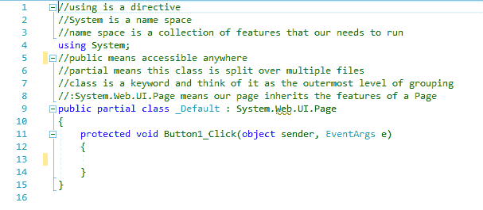

# 第十八章：使用存储过程将记录插入表中

在本章中，您将学习如何使用存储在 SQL Server 的`Programmability`文件夹中的*存储过程*直接将记录插入表中。我们将通过 HTML 页面中的文本框进行操作。

# 在 HTML 中添加文本框和按钮

启动一个项目。首先，在<html>页面中放入一对框。为此，请在以`<form id= ....`开头的行下输入以下内容：

```cs
Enter Name:<asp:TextBoxID="TextBox1" runat="server"></asp:TextBox><br />
Enter Date:<asp:TextBoxID="TextBox2" runat="server"></asp:TextBox><br />
```

对于`Name`字段，它只是一个文本框。因此，对于文本，换句话说，我们将使用一个字符串。转到工具箱，获取一个`TextBox`控件，并将其拖放到那里。对于日期，我们将尝试从框中解析为日期时间。

您的`Default.aspx`屏幕现在应该看起来像*图 18.3.1*中显示的屏幕。


图 18.3.1：本章的 Default.aspx 屏幕中的屏幕

请记住，我们有两个框，我们输入值，并将它们保存到表中。这是这里的目标。

接下来，让我们也在那里放一个按钮。因此，再次转到工具箱，获取一个按钮，并将其拖放到这些行的正下方。更改按钮上的文本，以使其更有帮助，例如，说`插入并显示`。

因此，当您单击按钮时，您将插入新记录，并且还将显示记录以确认它与现有记录一起保存。

# 回顾在 SQL Server 中已经创建的内容

接下来，打开 SQL Server 对象资源管理器屏幕。现在，请记住，您创建了一个名为`People`的数据库，然后在其中还有一个名为`People`的表。此外，在其中，您有一个名为`Id`的列。这是主键。请记住，它是自动递增的，因此您不必指定 ID。也就是说，它会自动为您完成。

接下来，有两个字段：一个是`NAME`，另一个是`DATEADDED`；`NAME`是`varchar(100)`，`DATEADDED`的类型是`date`。两个值都必须提供，这就是为什么它说`not null`。到目前为止，SQL Server 对象资源管理器屏幕显示在*图 18.3.2*中：


图 18.3.2：数据库 People 的 SQL Server 对象资源管理器屏幕

# 创建新的存储过程

现在，展开`Programmability`文件夹。有一个名为*存储过程*的文件夹。右键单击它，然后选择添加新存储过程...。这是基本的存储过程代码：


图 18.3.3：默认存储过程屏幕

要使用存储过程，您首先需要将其重命名。为此，请将顶行中的`[Procedure]`更改为`[AddName]`，如下所示：

```cs
CREATE PROCEDURE[dbo].[AddName]
```

正如您所看到的，它只是驻留在 SQL Server 中的一些代码。然后，您可以，例如，执行该代码以在数据库表中执行某些操作。

在我们的情况下，我们将使用此过程将记录插入表中。我们需要参数，因为我们将输入两个值。因此，按照以下方式编辑存储过程的下两行：

首先，将`param1`更改为`Name`，将默认值更改为`int = 0`，并将数据类型分配为`varchar(100)`。

下一行，将`param2`更改为`DateAdded`，类型为`date`。因此，这是两个参数：

```cs
@Name varchar(100), 
@DateAdded date
```

现在，因为您不会选择记录，而是会*插入*记录，所以，我们将输入一个`insert`语句，然后在`SELECT`行的位置键入以下内容：

```cs
insert into People (NAME,DATEADDED) values (@Name,@DateAdded)
```

在这里，您`insert into` `People`数据库，然后列出应接收新信息的字段，即`NAME`和`DATEADDED`。然后，您输入`values`，然后是参数列表—`@Name`和`@DateAdded`。

记住，这行中的参数类似于之前创建的函数。通过它们，在你在 C#中编写函数时，将值传递给函数。同样的原理也适用于这里。通过参数，值被传递到存储过程的主体中，在这种特殊情况下，直接将字段值插入到表中。在这里，`@Name`和`@DateAdded`的值被传递到`NAME`和`DATEADDED`中。这就是目标。

完整的存储过程显示在*图 18.3.4*中：


图 18.3.4：存储过程，dbo.AddName

# 更新数据库结构

现在，让我们更新一下结构；所以，单击“更新”按钮，然后在弹出的对话框中单击“更新数据库”，如*图 18.3.5*所示。


图 18.3.5：预览数据库更新对话框

更新后，展开“可编程性”文件夹，然后展开“存储过程”文件夹。在那里，你会看到`dbo.AddName`。现在，如果你展开`dbo.AddName`，会看到一系列参数：`@Name`和`@DateAdded`。

现在，让我们利用到目前为止所做的事情。单击`Default.aspx`选项卡，然后进入设计视图，双击“插入并显示”按钮。这将带我们进入`Default.aspx.cs`。删除`Page_Load`存根。我们将从*图 18.3.6*中显示的代码开始这个项目：



图 18.3.6：这个项目的起始代码

# 添加一个命名空间

再次，要使这个与 SQL Server 一起工作，你必须添加一个命名空间。所以，转到文件顶部，在`using System`下输入以下内容：

```cs
using System.Data.SqlClient;//commands and connections 
```

当然，这将用于诸如命令和连接之类的东西，你可以将其填写为注释。我们将在这一行下面再做一个，所以输入以下内容：

```cs
using System.Data;
```

这行也将为我们服务。会有相当多的代码，但它是高度顺序的——它从上到下自然而然地进行，它会为你完成工作。

现在，每次单击按钮时，你都希望清除标签，以便输出不会继续累积；所以，在以`protected void Button1_Click...`开头的行下的一对大括号之间，输入以下内容：

```cs
sampLabel.Text = "";
```

# 构建连接字符串

在下一阶段，你想要获取连接字符串；所以，在下一行开始时输入`string connString =`，然后跟上`@`符号使其成为逐字字符串，然后放入`""`符号。现在，要获取连接字符串，做以下操作：

1.  单击菜单栏中的“查看”，然后选择“SQL Server 对象资源管理器”。

1.  右键单击`People`数据库，然后选择“属性”。

1.  在属性窗格中，双击连接字符串以选择它及其长描述。

1.  然后，右键单击长描述并复制它。

1.  在一对`""`符号之间粘贴描述。

连接字符串行应该看起来像下面这样：

```cs
string connString = @"Data Source=(localdb)\MSSQLLocalDB;Initial Catalog=People;Integrated Security=True;Connect Timeout=30;Encrypt=False;TrustServerCertificate=True;ApplicationIntent=ReadWrite;MultiSubnetFailover=False";
```

现在可以关闭 SQL Server 对象资源管理器和属性窗格。

# 初始化连接

在下一阶段，因为我们正在访问硬盘来读取和保存记录，输入以下内容：

```cs
using (SqlConnection conn = new SqlConnection(connString))
```

这就是如何初始化连接。如果右键单击`SqlConnection`并选择“转到定义”，它会说它是`DbConnection`类型，并且继承自`SqlConnection`。现在，如果你右键单击`DbConnection`并选择“转到定义”，它会说它实现了`IDisposable`。然后，如果你右键单击`IDisposable`并选择“转到定义”，它会说，执行与释放、释放或重置非托管资源相关的应用程序定义的任务。因此，例如，对于从硬盘获取信息的低级通道，你必须确保它们被正确清理。现在可以关闭这个窗口。

# 捕获异常

接下来，因为在与数据库一起工作时可能会出现各种问题，您需要先`try`，然后捕获任何异常。为此，在前一行下的开放大括号下面，输入以下内容：

```cs
try
{

}
catch (Exception ex) 
```

在这里，我真的只是为了能够显示一些诊断信息而添加了`catch (Exception ex)`。接下来，在此下面的一对大括号之间，输入以下内容：

```cs
sampLabel.Text = $"{ex.Message}";
```

我们使用这行只是为了显示诊断信息。

# 尝试命令

现在，让我们进入`try`部分。这是一切都可能发生的地方。首先，让我们创建一个命令。在`try`下面的大括号之间输入以下内容：

```cs
SqlCommand cmd = new SqlCommand();
```

接下来，您将设置命令的类型，因此请输入以下内容：

```cs
cmd.CommandType = CommandType.StoredProcedure;
```

这行说明了它自己。

现在，为了实际获取文本以选择要调用的特定存储过程，您需要输入以下内容：

```cs
cmd.CommandText = "AddName";
```

记住，`AddName`是我们在 SQL Server 中称之为的存储过程。

# 添加参数

现在，对于下一个阶段，我们将添加所谓的*参数*。换句话说，您必须确保实际传递值到存储过程中，以便您可以将它们保存在表中。因此，请接下来输入以下内容：

```cs
cmd.Parameters.AddWithValue("@Name", TextBox1.Text);
```

在这里，我们从参数的名称开始：`@Name`，然后它的值将来自第一个框：`TextBox1.Text`。

接下来，您将重复此逻辑，因此请输入以下内容：

```cs
cmd.Parameters.AddWithValue("@DateAdded", DateTime.Parse(TextBox2.Text));
```

在这里，`@DateAdded`是参数的名称，下一个阶段来自第二个框：`TextBox2.Text`。这行将转换框中的值，假设它可以转换为`DateTime`对象，以便它与数据库中的`@DateAdded`类型匹配。这就是为什么我们要采取这一步骤。

当然，在更现实的情况下，您可能想尝试`DateTime.TryParse`。为了避免过多的复杂性，我们将只使用`DateTime.Parse`。

接下来输入以下内容：

```cs
cmd.Connection = conn;
```

您必须设置`conn`属性。我们在文件顶部创建了这个属性，以`using(SqlConnection conn...`开头的行。

对于下一行，请输入以下内容以打开连接：

```cs
conn.Open();
```

# 保存信息以便以后检索

在下一个阶段，我们将执行`NonQuery`。为此，请输入以下内容：

```cs
cmd.ExecuteNonQuery();
```

这行将保存信息。现在，从那里开始，当您想要检索信息时，请确保它按预期工作。我们只需将命令类型切换为`Text`类型的`CommandType`，因此请接下来输入以下内容：

```cs
cmd.CommandType = CommandType.Text;
```

接下来，我们将指定文本，因此请输入以下内容：

```cs
cmd.CommandText = "select * from dbo.People";
```

在这里，`select *`表示从`People`数据库中选择所有内容。

之后，输入以下内容：

```cs
using (SqlDataReader reader = cmd.ExecuteReader())
```

# 认识索引器的作用

现在，我将向您展示一些以前没有向您展示的东西。将鼠标悬停在`ExecuteReader`上。这将返回一个`SqlDataReader`类。现在，在前一行中右键单击`SqlDataReader`，然后选择“转到定义”。您还记得我们之前学到的索引器吗？看看它说的 public override object this[string name]。如果您展开它，它说它获取指定列的值及其本机格式，给定列名。如果您返回，下一个定义是 public override object this[int i]。如果您展开这个，它说，获取指定列的值及其本机格式，给定列的顺序，这里是列的编号。因此，`public override object...`行是指当前的`SqlDataReader`对象。这基本上是一个索引器。现在您可以看到索引器确实发挥了作用。现在您可以关闭这个。

为了利用这些信息，请在前面`using`行下的一对大括号之间输入以下内容：

```cs
while(reader.Read())
```

然后，在这行下面的一对大括号之间，输入以下内容：

```cs
sampLabel.Text += $"<br>{reader[0]}, {reader[1]}, {reader[2]}";
```

在这里，在`sampLabel.Text...`之后，您指定`reader[0]`，`{reader[1]}`和`{reader2}`，这是通过索引访问的三列。

您现在已经输入了程序的核心。

# 运行程序

现在，让我们来看看结果。在浏览器中打开这个。首先，输入一些值：`Berry Gibbs`作为`Name`，一个日期，然后点击“插入并显示”按钮。结果显示在*图 18.3.7*中：


图 18.3.8：运行程序后修改的结果

所以，这些是建立连接的基础知识。

现在考虑这一点。想象一下，在前一行中，我写成了`cmd.CommandText = "AddNames"`而不是`AddName`。换句话说，我拼错了存储过程的名称。如果我在浏览器中打开这个，就像*图 18.3.9*中所看到的那样，它会显示“字符串无法识别为有效的日期时间”。这很有用，对吧？我没有填写`Name`或`Date`。所以，它无法转换为`DateTime`：


图 18.3.9：未输入值运行程序的结果

现在，即使我为`Name`和`Date`输入值，它也会显示“找不到存储过程'AddNames'”，如*图 18.3.10*所示，因为我拼错了存储过程的名称：


图 18.3.10：拼错存储过程名称后运行程序的结果

所以，使用`try`行，因为之后的所有命令都可能产生某种错误，至少您可以捕获它并显示错误消息，这样您就能知道发生了什么。所以，这非常有用。

# 章节回顾

为了回顾，包括注释的本章`Default.aspx.cs`文件的完整版本如下所示：

```cs
//using is a directive
//System is a name space
//name space is a collection of features that our needs to run
using System;
using System.Data.SqlClient;//commands and connections
using System.Data;
//public means accessible anywhere
//partial means this class is split over multiple files
//class is a keyword and think of it as the outermost level of grouping
//:System.Web.UI.Page means our page inherits the features of a Page
public partial class _Default : System.Web.UI.Page
{
    protected void Button1_Click(object sender, EventArgs e)
    {
        sampLabel.Text = "";
        string connString = @"Data Source=DESKTOP-4L6NSGO\SQLEXPRESS;Initial Catalog=People;Integrated Security=True;Connect Timeout=15;Encrypt=False;TrustServerCertificate=False;ApplicationIntent=ReadWrite;MultiSubnetFailover=False";
        //put conn in a using so it can be properly closed and disposed of
        using (SqlConnection conn = new SqlConnection(connString))
        {
            try
            {
                //make sql command
                SqlCommand cmd = new SqlCommand();
                //specify type
                cmd.CommandType = CommandType.StoredProcedure;
                //write name of stored procedure inside SQL Server as  
                //the name here
                cmd.CommandText = "AddName";
                //read the field box 1, and pass in through @Name
                cmd.Parameters.AddWithValue("@Name", TextBox1.Text);
                //pass in date through @DateAdded
                cmd.Parameters.AddWithValue("@DateAdded", 
                DateTime.Parse(TextBox2.Text));
                //set connection property of command object
                cmd.Connection = conn;
                //open connection
                conn.Open();
                //execute the stored procedure
                cmd.ExecuteNonQuery();
                //change command type to just plain text
                cmd.CommandType = CommandType.Text;
                //write a simple SQL select statement
                cmd.CommandText = "select * from dbo.People";
                //execute reader
                using (SqlDataReader reader = cmd.ExecuteReader())
                {
                    //Read() returns true while it can read
                    while(reader.Read())
                    {
                        //reader[0] means get first column, 
                        //reader uses an indexer to do this
                        sampLabel.Text += $"<br>{reader[0]}, {reader[1]}, {reader[2]}";
                    }
                }
            }
            catch(Exception ex)
            {
                sampLabel.Text = $"{ex.Message}";
            }
        }
    }
}
```

# 总结

在本章中，您学习了如何使用存储过程直接将记录插入到表中，并存储在 SQL Server 的可编程文件夹中。您创建了一个新的存储过程，更新了数据库结构，构建了连接字符串，初始化了连接，尝试了命令并捕获了异常，添加了参数，保存了信息以供以后检索，并认识到了索引器的作用。

在下一章中，您将学习如何使用`nullable`关键字来确保具有缺失值的记录仍然可以被引入应用程序中。
