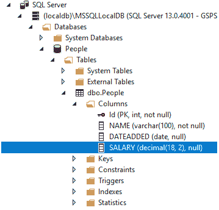
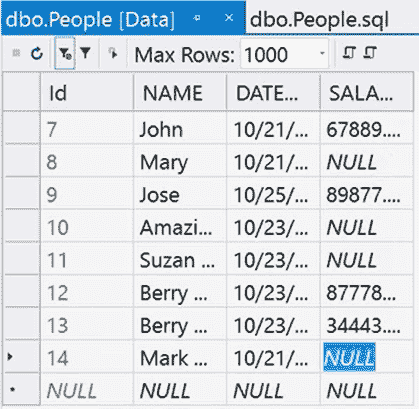
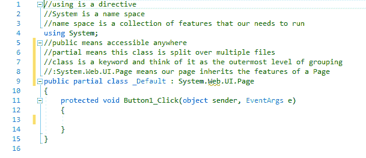

# 第十九章：使用可空特性使应用程序更稳定

在本章中，您将学习使用*nullable*关键字来确保具有缺失值的记录仍然可以被引入应用程序中。

# 在 HTML 中添加一个显示人员按钮

打开 Visual Studio，创建一个项目。我们首先要做的是将一个简单的按钮放入 HTML 页面中。为此，请转到工具箱，获取一个`Button`控件，并将其放在以`<form id=...`开头的行下面。将按钮上的文本更改为“显示人员”。

您将创建一个名为`Person`的类，并且将从数据库中创建该类。要做到这一点，转到“视图”菜单并打开 SQL Server 对象资源管理器。请记住，我们创建了一个名为`People`的数据库，它由这些字段组成：`Id`，`NAME`和`DATEADDED`。

# 向 people 数据库添加一个字段

现在，让我们再添加一个字段。右键单击 dbo.People 表图标，然后选择“查看代码”。要添加一个额外的字段，在`DATEADDED`之后输入以下内容：

```cs
SALARY decimal(18,2)
```

这是一个新的字段类型，`decimal (18,2)`表示一个宽度为 18 个单位且有 2 位小数的字段；也就是说，它总共有 18 个单位宽，右边有 2 个单位，左边有 16 个单位，总共有 18 个单位。接下来，点击“更新”，然后点击出现的对话框中的“更新数据库”按钮。现在，您可以在 SQL Server 对象资源管理器窗格中看到，该字段已添加，如*图 19.4.1*所示：



图 19.4.1：工资字段已添加到 dbo.People

# 修改 dbo.People 表

现在，有了这个，您可以修改表。右键单击 dbo.People 表图标，然后转到“查看数据”。为了说明这个概念，在一些行中输入一些工资金额，将其他行留空。因此，数据库的组合将获得 NULL 信息。dbo.People 现在看起来像*图 19.4.2*：



图 19.4.2：工资已输入到表中

如果点击刷新按钮（）重新加载它，它会确认已保存。

如果双击工资列标题，它会展开列以适应。 

在这里，如果您为薪水输入诸如`77777777777777777777`之类的内容，将显示一个错误消息，指示单元格（行，列）的值无效。因此，请记住，如果您尝试输入诸如`788777.988888`之类的内容，它将自动四舍五入为两位小数，即`788777.99`。这基本上就是`decimal (18,2)`的工作原理：它对可以输入的数据施加限制。

# 为该项目编写代码

在下一个阶段，转到设计视图，并双击“显示人员”按钮。这将带我们进入`Default.aspx.cs`。删除`Page_Load`块。该项目的起始代码的相关部分应如*图 19.4.3*所示：



图 19.4.3：该项目的起始代码部分

现在，我们将编写代码。让我们逐步进行代码的创建。首先，在`using System`下面的文件顶部输入以下内容：

```cs
using System.Collections.Generic;
```

我们将使用这行来制作一个人员列表。然后，在它的下面也输入以下内容：

```cs
using System.Data.SqlClient;
```

# 创建 person 类

现在是下一个阶段；我们将创建一个名为`Person`的类；因此，请在以`public partial class _Default...`开头的行的上方输入以下内容：

```cs
public class Person
```

# 创建属性

接下来，我们将创建两个属性。因此，请在一对大括号之间输入以下行：

```cs
public string Name { get; set; }
public decimal? Salary { get; set; }
```

因为由 public decimal 引用的信息可能丢失，所以您要输入一个`?`符号。这是一个*nullable*数量，我们将其称为`Salary`。这就是这个类。

现在，要使用这个，你必须采取以下典型的步骤。首先，你希望在有人点击按钮时清除标签的输出，所以在以`protected void Button1_Click...`开头的行下面的花括号之间输入以下内容：

```cs
sampLabel.Text = "";
```

# 制作人员名单

在下一个阶段，我们将制作一个人员名单，所以在这一行下面输入以下内容：

```cs
List<Person> peopleList = new List<Person>();
```

在这里，我们称之为`peopleList`，并将其设置为新的人员列表。

# 构建连接字符串

在下一个阶段，你需要获取连接字符串，所以，在下一行开始，输入`string connString =`，然后跟上`@`符号使其成为逐字字符串，然后放上`""`符号。现在，要获取连接字符串，做以下操作：

1.  点击菜单栏中的“查看”，选择“SQL Server 对象资源管理器”。

1.  右键单击 People 数据库，选择属性。

1.  在属性窗格中，双击连接字符串以选择它及其长描述。

1.  然后右键单击长描述并复制它。

1.  在一对`""`符号之间粘贴描述。

连接字符串行应该如下所示：

```cs
string connString = @"Data Source=(localdb)\MSSQLLocalDB;Initial Catalog=People;Integrated Security=True;Connect Timeout=30;Encrypt=False;TrustServerCertificate=True;ApplicationIntent=ReadWrite;MultiSubnetFailover=False";
```

现在可以关闭 SQL Server 对象资源管理器和属性窗格了。

# 输入与 SQL 相关的代码

现在，让我们转到与 SQL 相关的代码。首先，在连接字符串下面输入以下内容：

```cs
using (SqlConnection conn = new SqlConnection(connString))
```

我们将调用 SQL 连接，`conn`，并使用连接字符串初始化新的 SQL 连接。

现在，让我们创建一个命令；在这一行下面的花括号之间输入以下内容：

```cs
SqlCommand comm = new SqlCommand("select * from dbo.People", conn);
```

接下来，通过在下面输入以下内容打开一个连接：

```cs
conn.Open();
```

接下来，在这条线下面输入以下内容：

```cs
using (SqlDataReader reader = comm.ExecuteReader())
```

# 从表中添加人员到列表

在过程的下一个阶段，从下面的花括号之间输入以下内容：

```cs
while(reader.Read())
```

当这个条件返回`True`时，我们将使用数据库中表的信息来创建对象。为了做到这一点，在这一行下面的花括号之间输入以下内容：

```cs
peopleList.Add(new Person() { Name = (string)reader[1], Salary = reader[3] as decimal? });
```

这里，这行的第一部分获取索引为 1 的列，将其转换为字符串，然后将其分配给每个对象的名称属性。然后，我们说`Salary = reader[3]`，因为这是可能缺少值的部分，我们说`decimal?`—即可空的十进制。

# 显示记录

在这一点上我们已经接近了；最后阶段，当然是显示记录以查看可空的效果。在`peopleList.Add...`行下面的所有花括号之外（如下所示），输入以下`foreach`语句：

```cs
peopleList.Add(new Person()... 
    }}}foreach (Person p in peopleList)
```

接下来，在这一行下面的花括号之间输入以下内容：

```cs
sampLabel.Text += $"<br>{p.Name}, {p.Salary:C}";
```

这是我们应用程序的核心。

在运行此应用程序之前，再次注意`...Salary = reader[3] as decimal? })`中`Salary`属性的一个有趣的地方。`as decimal`后面的问号表示它是一个可空的十进制数。十进制值可能丢失，这是一个不同的情况。如果你只是写`as decimal`，工具提示会说这是一个错误。

# 运行程序

现在，打开你的浏览器。点击“显示人员”按钮。让我们检查结果，如*图 19.4.4*所示：


图 19.4.4：运行程序的结果

注意，当没有工资时，它只显示姓名，不会提供其他任何信息，也不会崩溃。所以，这很好。

这是那个小符号的实际应用，问号，在我们的数据类型和可空之后。

# 章节回顾

为了回顾，包括注释的本章`Default.aspx.cs`文件的完整版本如下所示：

```cs
//using is a directive
//System is a name space
//name space is a collection of features that our needs to run
using System;
using System.Collections.Generic; //needed for lists
using System.Data.SqlClient;//needed for commands and connections
//public means accessible anywhere
//partial means this class is split over multiple files
//class is a keyword and think of it as the outermost level of grouping
//:System.Web.UI.Page means our page inherits the features of a Page
public class Person
{
    public string Name { get; set; }
    public decimal? Salary { get; set;}
}
public partial class _Default : System.Web.UI.Page
{
    protected void Button1_Click(object sender, EventArgs e)
    {
        //clear label text every button click
        sampLabel.Text = "";
        //make list of people
        List<Person> peopleList = new List<Person>();
        //get connection string form SQL Server
        string connString = @"Data Source=DESKTOP-4L6NSGO\SQLEXPRESS;Initial
        Catalog=People;Integrated Security=True;Connect Timeout=15;Encrypt=False;TrustServerCertificate=False;ApplicationIntent=ReadWrite;MultiSubnetFailover=False";
        //make connection, be sure it's in a using so it's properly
        //disposed of
        using (SqlConnection conn = new SqlConnection(connString))
        {
            //make sql command
            SqlCommand comm = new SqlCommand("select * from dbo.People", conn);
            //open connection
            conn.Open();
            //make reader, be sure it's inside a using so it's properly 
            //disposed of
            using (SqlDataReader reader = comm.ExecuteReader())
            {
                while (reader.Read())
                {
                    //add new people to list, noting that reader[3] 
                    //could be null, so do it as "as decimal?" 
                    //nullable decimal
                    peopleList.Add(new Person() { Name = (string)reader[1], 
                    Salary = reader[3] as decimal? });
                }
            }
        }
        //display list of people, formatting salary as currency
        foreach(Person p in peopleList)
        {
            sampLabel.Text += $"<br>{p.Name}, {p.Salary:C}";
        }
    }
}
```

# 总结

在本章中，您学习了使用*nullable*关键字来确保具有缺失值的记录仍然可以被引入应用程序。您向`People`数据库添加了一个字段，修改了`dbo.people`表，创建了一个`Person`类，制作了一个人员列表，构建了连接字符串，输入了与 SQL 相关的代码，并从`dbo.people`表中添加了人员到列表中。

在下一章中，您将学习如何将图表拖入页面，然后通过 C#作为连接页面和数据库的语言，使它们与 SQL Server 内的一些简单表格配合使用。
