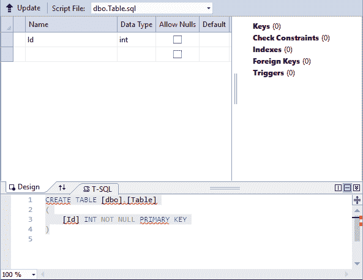
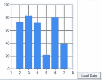
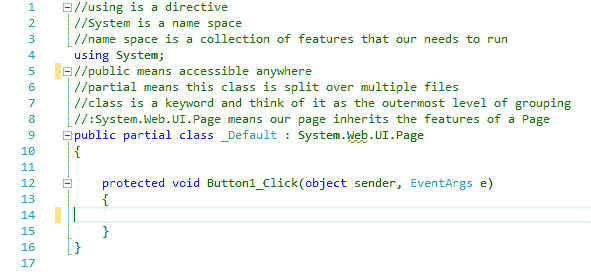

# 第二十章：将图表控件连接到 SQL Server

在本章中，你将学习如何将图表拖放到页面中，然后通过 C#作为连接页面和数据库的语言，使其与 SQL Server 中的一些简单表一起工作。

# 将图表放入 HTML 页面

启动一个项目，我们首先要做的是将一个图表放在<html>页面中。转到工具箱（*Ctrl* + *Alt* + *X*），在搜索栏中输入`char...`，然后将其拖放到以`<form id=...`开头的行下面。

如你在屏幕上看到的，这生成了所有以下标记。你可以保持不变。对我们的目的来说已经足够了：

```cs
<asp:Chart ID="Chart1"runat="server">
  <Series>
    <asp:SeriesName="Series1" ChartType="Point"></asp:Series>
  </Series>
  <ChartAreas>
    <asp:ChartArea Name="ChartArea1"></asp:ChartArea>
  </ChartAreas>
</asp:Chart>
```

你可以删除两个`<div...`行和`<asp:Label ID...`行。我们不需要它们。

# 在 HTML 页面中添加一个按钮

接下来，在`</asp:Chart>`行下面放置一个按钮。再次，转到工具箱，抓取一个`Button`控件，拖放到那里。将按钮上的文本更改为“加载数据”。这里，“加载数据”意味着加载并在图表中显示它。

注意，当你拖入一个图表时，页面会在`System.Web.UI.DataVisualization.Charting`的顶部添加整个块，如下所示：

```cs
<%@Register Assembly="System.Web.DataVisualization, Version=4.0.0.0, Culture=neutral, PublicKeyToken=31bf3856ad364e35" Namespace="System.Web.UI.DataVisualization.Charting" TagPrefix="asp" %>
```

# 在`People`数据库中添加一个新表

接下来，在下一个阶段，点击菜单栏中的“查看”，选择“SQL Server 对象资源管理器”。你需要添加一个新表，所以在`People`数据库中，右键点击“表”文件夹，选择“添加新表...”。你的屏幕应该看起来像*图 20.5.1*中所示的样子：



图 20.5.1：一个空白的新表

接下来，在`Id`字段中输入`XValues`，然后点击数据类型字段。开始输入`decimal`，注意到`decimal(18,0)`会自动显示出来。现在将其改为`(18,3)`。这意味着一个宽度为 18 且有 3 位小数的字段；也就是说，总共有 18 位，右边 3 位，左边 15 位。对于这个字段，应该勾选“允许空值”。对于`YValues`也是一样。假设我们做了一个实验，测量了一些数量。所以，在`Id`字段中输入`YValues`，在数据类型字段中输入`decimal(18,3)`，并且对于这个字段勾选“允许空值”。

接下来，右键点击“Id”，选择“设置为主键”。

# 启用自动递增

接下来，你想要启用自动递增，具体来说就是以下内容：

1.  首先，将表重命名为`ExperimentValues`，如下所示：

```cs
    CREATE TABLE [dbo].[ExperimentValues]
```

1.  在“主键”后面，输入`identity(1,1)`，如下所示：

```cs
    [Id] INT NOT NULL PRIMARY KEY identity(1,1),
```

在这里，`identity(1,1)`，正如你之前学到的，意味着这个字段将从 1 开始每次添加新记录时增加 1。所以，这是我们表的结构，如*图 20.5.2*所示：


图 20.5.2：本章表的结构

# 向新表中添加值

接下来，点击“更新”按钮。在弹出的对话框中点击“更新数据库”。

现在，你有了`ExperimentValues`。右键点击它，选择“查看数据”，然后让我们添加一些数值，如*图 20.5.3*所示：


图 20.5.3：添加到 ExperimentValues 表中的值

现在，我们在表中有了一些数值。再次注意到，“Id”字段是自动递增的——它从 1 开始，每添加一条新记录就增加 1。关闭表窗口，回到`Default.aspx.cs`。

现在，双击“设计”按钮，会出现一个小图表，如*图 20.5.4*所示：



图 20.5.4：实验值表中数据的理论预览

# 编码项目

这个图表还不代表真实的数据。这只是一个理论预览。所以，双击“加载数据”按钮，这会打开`Default.aspx.cs`中的事件处理程序。删除`Page_Load`存根。我们将从本项目的代码开始，如*图 20.5.5*所示：



图 20.5.5：此项目的起始代码

# 添加命名空间

首先，您必须添加一个命名空间。因此，转到文件顶部，在`using System`下输入以下内容：

```cs
using System.Data.SqlClient;
```

此行用于连接和命令。

# 构建连接字符串

在下一阶段，您需要连接字符串。因此，在下一行开始时，输入`string connString =`，然后输入`@`符号使其成为逐字字符串，然后放置`""`符号。现在，要获取连接字符串，请执行以下操作：

1.  单击菜单栏中的“查看”，然后选择“SQL Server 对象资源管理器”。

1.  右键单击 People 数据库，然后选择属性。

1.  在属性窗格中，双击连接字符串以选择其长描述。

1.  然后，右键单击长描述并将其复制。

1.  在`""`符号集之间粘贴描述。

然后，连接字符串行应如下所示：

```cs
string connString = @"Data Source=(localdb)\MSSQLLocalDB;Initial Catalog=People;Integrated Security=True;Connect Timeout=30;Encrypt=False;TrustServerCertificate=True;ApplicationIntent=ReadWrite;MultiSubnetFailover=False";
```

这是特定于您计算机的连接字符串。您现在可以关闭 SQL Server 对象资源管理器和属性窗格。

现在，在此行下方输入以下内容：

```cs
using (SqlConnection conn = new SqlConnection(connString)) 
```

# 编写 SQL 查询

接下来，您将创建`commandText`变量。因此，在一对大括号之间，输入以下内容：

```cs
string commandText = "select XValues, YValues from dbo.ExperimentValues";
```

要定义文本，您必须编写实际的 SQL 查询，因此输入`select XValues, YValues from dbo.ExperimentValues`。这将从`ExperimentValues`表中的这两个列名中选择`XValues`和`YValues`。

# 创建命令对象

现在，您需要创建命令对象，因此接下来输入以下内容：

```cs
SqlCommand command = new SqlCommand(commandText, conn);
```

在这里，您传入两个相关数量，两个参数，具体来说是`(commandText, conn)`。

# 打开连接并创建 SQL 数据读取器

在下一阶段，您将打开一个连接，因此在上一行下方输入以下内容：

```cs
conn.Open();
```

然后，您将创建一个 SQL 数据读取器，因此接下来输入以下内容：

```cs
SqlDataReader reader = command.ExecuteReader(); 
```

此行将获取我们需要的数据。

现在您已经完成了所有这些，接下来在上一行下方输入以下内容：

```cs
Chart1.DataBindTable(reader, "XValues");
```

请注意，我们包括列名`XValues`，它将用作*x*轴的标签。因此，*x*轴是水平轴。

# 运行程序

这是应用程序的核心。在浏览器中启动它，并单击“加载数据”按钮。


图 20.5.6：来自 ExperimentValues 表的实际数据的显示

这是数据，如*图 20.5.6*所示。它具有沿水平和垂直轴的值。

# 修改程序以显示 Y 值

如果您愿意，只是为了向您展示它有多容易，您可以将以下行更改为 Y 值。换句话说，您可以将它们颠倒过来：

```cs
Chart1.DataBindTable(reader, "YValues");
```

现在，在浏览器中启动它，并再次单击“加载数据”按钮。结果显示在*图 20.5.7*中：


图 20.5.7：来自 ExperimentValues 表的值的图表

现在您看到它看起来非常不同。这就是您如何制作简单的图表。现在保存这个。这就是整个应用程序。

# 章节回顾

让我们回顾一下我们做了什么：您构建了连接字符串并完成了在`using (SqlConnection conn...`行内建立连接，以便可以正确处理连接。然后，您编写了查询字符串，创建了命令对象，打开了连接并执行了读取器。最后，您使用`DataBind`将数据库表绑定到图表，以便可以显示结果。

本章的`Default.aspx.cs`文件的完整版本，包括注释，显示在以下代码块中：

```cs
//using is a directive
//System is a name space
//name space is a collection of features that our needs to run
using System;
using System.Data.SqlClient;
//public means accessible anywhere
//partial means this class is split over multiple files
//class is a keyword and think of it as the outermost level of grouping
//:System.Web.UI.Page means our page inherits the features of a Page
public partial class _Default : System.Web.UI.Page
{
    protected void Button1_Click(object sender, EventArgs e)
    {
        //make connection string
        string connString = @"Data Source=DESKTOP-4L6NSGO\SQLEXPRESS;Initial Catalog=People;Integrated Security=True;Connect Timeout=15;Encrypt=False;TrustServerCertificate=False;ApplicationIntent=ReadWrite;MultiSubnetFailover=False";
        //enclose connection making inside a using so connection is
        //properly disposed of
        using (SqlConnection conn = new SqlConnection(connString))
        {
            //make command text
            string commandText = "select XValues, YValues from dbo.ExperimentValues";
            //make command object
            SqlCommand command = new SqlCommand(commandText, conn);
            //open connection
            conn.Open();
            //execute reader to read values from table
            SqlDataReader reader = command.ExecuteReader();
            //bind chart to table do display the results
            Chart1.DataBindTable(reader, "XValues");
        }
    }
}
```

# 摘要

在本章中，您学习了如何将图表拖入页面，然后通过 C#作为连接页面和数据库的语言，使它们与 SQL Server 中的一些简单表一起工作。您将图表放入 HTML 页面，向`People`数据库添加了一个新表，启用了自动递增，向新表添加了值，添加了命名空间，构建了连接字符串，编写了 SQL 查询，打开了连接并创建了一个 SQL 数据读取器，运行了程序，最后修改它以显示 Y 值。

在下一章中，您将学习如何将 LINQ 与 SQL 和 SQL Server 一起使用。
