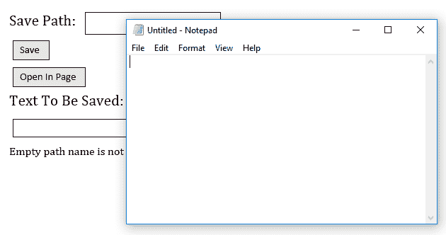
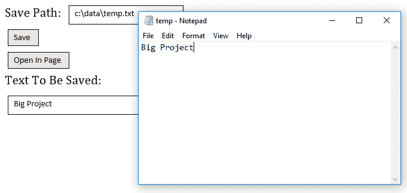

# 第二十二章：创建一个保存文本到磁盘的页面

在本章中，您将学习如何制作一个页面，将页面上的内容保存到硬盘上，然后再读取它。

# 创建一个保存文本的应用程序

在本章结束时，您将制作一个类似于*图 22.1.1*所示的小应用程序。对于保存位置，您可以输入类似于`c:\data\samp.txt`的内容，以保存一个文本文件：


图 22.1.1：与本章中要构建的应用程序类似的用户界面

然后，您可以输入一些文本，例如`这是要保存的一些示例文本。`：


图 22.1.2：在应用程序中输入一些示例文本的保存位置

现在单击“保存文本”按钮。这将弹出记事本，以确认已保存，如*图 22.1.3*所示：


图 22.1.3：示例文本已保存，并弹出记事本

如果您愿意，您也可以在页面中打开文本。因此，单击“打开”，然后它保存在页面中，如*图 22.1.4*所示：


图 22.1.4：示例文本保存在页面中

此外，如果您没有指定路径，显然会导致错误，如*图 22.1.5*所示。在这种情况下，它显示“空路径名不合法。”消息：


图 22.1.5：未输入保存位置时显示的错误消息

所以，这是这里的目标。记住这个例子。

现在让我们创建一个项目。转到“文件”|“新建”|“网站...”然后，从“视图”菜单中，转到“解决方案资源管理器”，并单击“Default.aspx”。

# 为您的项目创建用户界面

首先，您必须构建您的用户界面，因此您需要在 HTML 页面中有一个文本框，您可以在其中输入路径。为此，请转到工具箱，获取一个`TextBox`控件，并将其放在以`<form id=...`开头的行下面。在此行的开头输入“保存路径”，如下所示：

```cs
Save Path:<asp:TextBoxID="TextBox1"runat="server"></asp:TextBox><br/>
```

接下来，您将有一个按钮，基本上是用来在网页中打开保存的文件，因此将按钮中的文本更改为“在页面中打开”，如下所示：

```cs
<asp:Button ID="Button1"runat="server"Text="Open In Page" /><br />
```

在这种情况下，它只是意味着将简单的文本读回页面。现在进入设计视图，查看到目前为止的用户界面，如*图 22.1.6*所示：


图 22.1.6：到目前为止的用户界面

接下来，您还需要一个地方来输入要保存的文本。因此，获取另一个`TextBox`控件，并在此行的开头输入`Text To Be Saved`，如下所示：

```cs
Text To Be Saved:<asp:TextBoxID="TextBox2"runat="server"Width="1069px"></asp:TextBox><br/>
```

删除两个`<div>`行 - 您不需要它们。

现在让我们添加一个“保存”按钮。因此，我们将有一个“在页面中打开”按钮和一个“保存”按钮。现在，从工具箱中拖动一个按钮，并将其放在`Button1`上方。（当然，布局取决于您。）更改文本如下：

```cs
<asp:Button ID="Button2"runat="server"Text="Save" /><br />
```

该项目的完整 HTML 文件如下代码块所示。

```cs
<%@ Page Language="C#" AutoEventWireup="true" CodeFile="Default.aspx.cs" Inherits="_Default" %>
<!DOCTYPE html>
<html >
  <head runat="server">
    <title>Our First Page</title>
  </head>
  <body>
    <form id="form1" runat="server">
      Save Path:<asp:TextBox ID="TextBox1" runat="server"></asp:TextBox>
      <br />
      <asp:Button ID="Button2" runat="server" Text="Save" 
      OnClick="Button2_Click" />
      <br />
      <asp:Button ID="Button1" runat="server" Text="Open In Page" 
      OnClick="Button1_Click" />
      <br />
      Text To Be Saved:<asp:TextBox ID="TextBox2" runat="server" 
      Width="1069px"></asp:TextBox>
      <br />
      <asp:Label ID="sampLabel" runat="server"></asp:Label>
    </form>
  </body>
</html>
```

现在，如果您进入设计视图，将显示一个简单的界面，如*图 22.1.7*所示：


图 22.1.7：完整的简单用户界面

如果您愿意，您可以拖动`Text To Be Saved`框的一个角，将其放大，以便有更大的地方保存您的文本。现在您有一个保存的地方，一个保存按钮，打开页面和`sampLabel`。这对我们的目的已经足够了。

# 开始编写项目

现在双击“保存”按钮。这将带我们进入`Default.aspx.cs`。删除`Page_Load`块。该项目的起始代码的相关部分应如*图 22.1.8*所示：


图 22.1.8：该项目的起始代码

因此，对于“保存”按钮代码，您必须添加一个命名空间。首先，在文件顶部的`using System`下，输入以下内容：

```cs
using System.IO;
```

# 捕获异常

让我们利用一下这个。现在，因为有可能有人没有在框中输入任何内容，可能会生成错误消息，你想要捕获它。所以，在以`protected void Button2_Click...`开头的行的大括号下面，输入以下内容：

```cs
try
{

}
catch(Exception ex)
{
   sampLabel.Text = ex.Message;
}
```

前面的`sampLabel.Text`行用于显示生成并捕获的异常的消息。

# 创建一个 StreamWriter 类

接下来，我们将使用一个`StreamWriter`类。这个类可以获得对硬盘等的低级访问，所以你必须确保它在一个`using`语句内。你需要能够创建它，使用它，并完全处理掉它。所以，在`try`下面的一对大括号之间输入以下内容：

```cs
using (StreamWriter sw = new StreamWriter(TextBox1.Text))
```

初始化这个类时，要传入的参数是`TextBox1.Text`。所以这个将写入文件。确认一下，你可以在`Default.aspx`的源视图中，验证`Save Path`是`TextBox1`。

现在，为了实际写入文件，在上一条语句下的一对大括号之间输入以下内容：

```cs
sw.Write(TextBox2.Text);
```

在这里，`sw`是一个流写入器，`sw.write`是它的一个方法，一个函数，然后你将取出`TextBox2`的东西并写入。所以，从`TextBox1`中获取路径，从`TextBox2`中取出文本。

现在，如果你右键点击`StreamWriter`并选择`Go To Definition`，结果看起来像*图 22.1.9*所示：


图 22.1.9：StreamWriter 的定义

在最底部，你可以看到它有`Dispose`，你可以在顶部附近看到`StreamWriter`继承自`TextWriter`。接下来，如果你选择`TextWriter`的`Go To Definition`，你会看到有`IDisposable`，如*图 22.1.10*所示：


图 22.1.10：TextWriter 的定义

如果你右键点击`IDisposable`并选择`Go To Definition`，就会出现`Dispose`，如*图 22.1.11*所示：


图 22.1.11：IDisposable 的定义

如果你展开`public interface IDisposable`，它会显示注释，执行与释放、释放或重置非托管资源相关的应用程序定义的任务；换句话说，这些是低级资源，所以最好不要使用它。

另外，你想要确认它保存到文件中，所以在文件顶部的`using System.IO;`下面输入以下内容：

```cs
using System.Diagnostics;
```

这一行将在一切保存之后打开记事本。

现在，在`sampLabel.Text = ex.Message;`下面的闭合大括号下面输入以下内容：

```cs
Process.Start("notepad.exe", TextBox1.Text);
```

在这里，`TextBox1.Text`只是将你在框中输入的文本反馈出来。

接下来，回到`Default.aspx`。在设计视图中，双击打开页面按钮。这将再次带你进入`Default.aspx.cs`。你接下来编写的代码将在`Open`按钮上执行。所以逻辑上非常相似。

现在，在以`protected void Button1_Click...`开头的行的大括号下面，输入以下内容：

```cs
try
{
}
catch(Exception ex)
{
   sampLabel.Text = ex.Message;
}
```

再次，你使用`try`和`catch`，因为在尝试打开时可能会产生错误。在标签上显示相同的文本。基本上，从上面复制`try`/`catch`块，然后粘贴到下面。它完全相同。

# 创建一个 StreamReader 类

现在，然而，你将在这个`try`语句下的大括号之间输入以下内容：

```cs
using (StreamReader sr = new StreamReader(TextBox1.Text))
```

再次，`StreamReader`是一个类——它需要一个流。*流*就像是两个地方之间的通信渠道。

接下来，为了显示文本，在这行下面的一对大括号之间输入以下内容：

```cs
sampLabel.Text = sr.ReadToEnd();
```

在这里，`ReadToEnd`是`StreamReader`类内部可用的函数，它从当前位置读取到流的末尾的所有字符。这对我们的目的已经足够了。所以这就是代码。

你已经创建了在设计视图中看到的简单界面，如*图 22.1.7*所示。

# 运行程序

现在，在浏览器中打开它。在顶部，您有保存路径。首先，想象一下在框中未输入路径，然后单击保存按钮。如*图 22.1.12*所示，它会打开记事本；所以，那部分是有效的。但是，它显示了消息“空路径名称不合法”。但这是一个有用的东西，对吧？



图 22.1.12：未指定路径时，显示错误消息并打开空白记事本

现在，让我们指定一个合法的路径，比如`c:\data\temp.txt`。然后，在“要保存的文本”框中输入“大项目”。单击保存按钮。大项目被打开，文件名为 temp，如*图 22.1.13*所示。所以，它已经保存了：



图 22.1.13：指定合法路径后，记事本打开，显示“要保存的文本”框中的文本

如果您愿意，您可以确认它将在页面中打开，因此单击“在页面中打开”，页面上也会显示“大项目”，如*图 22.1.14*所示：


图 22.1.14：文本也在页面中打开

所以，它正在按预期工作。

# 章节回顾

回顾一下，回到`Default.aspx.cs`。因为您正在处理输入/输出资源，所以必须确保您有 I/O（`using System.IO;`）；另外，因为您正在处理低级磁盘写入和读取，所以确保您将`StreamWriter`和`StreamReader`封装在`using`中，这样您就可以获取它们，使用它们，并正确地处理掉它们。最后，因为通常会生成异常，例如当找不到路径或类似情况时，还要使用`try`和`catch`，并向用户显示消息，使应用程序看起来专业。请记住，这将运行，因为我们正在从本地计算机运行页面。

本章的`Default.aspx.cs`文件的完整版本，包括注释，如下代码块所示：

```cs
//using is a directive
//System is a name space
//name space is a collection of features that our needs to run
using System;
using System.IO;//needed for files
using System.Diagnostics;//needed for Process.Start
//public means accessible anywhere
//partial means this class is split over multiple files
//class is a keyword and think of it as the outermost level of grouping
//:System.Web.UI.Page means our page inherits the features of a Page
public partial class _Default : System.Web.UI.Page
{
    protected void Button2_Click(object sender, EventArgs e)
    {
        //this is needed so that errors can be caught
        try
        {
            //enclose Streams inside usings because streams deal with 
            //low level access
            using (StreamWriter sw = new StreamWriter(TextBox1.Text))
            {
                //this writes the text to a file
                sw.Write(TextBox2.Text);
            }
        }
        catch(Exception ex)
        {
            sampLabel.Text = ex.Message;
        }
        Process.Start("notepad.exe", TextBox1.Text);
    }
    protected void Button1_Click(object sender, EventArgs e)
    {
        //same as try above
        try
        {
            //save as StreamWriter above
            using (StreamReader sr = new StreamReader(TextBox1.Text))
            {
                //read file contents into label text property
                sampLabel.Text = sr.ReadToEnd();
            }
        }
        catch (Exception ex)
        {
            sampLabel.Text = ex.Message;
        }
    }
}
```

# 总结

在本章中，您学会了如何创建页面，然后将页面上的内容保存到硬盘并读取回来。您创建了一个简单的用户界面，编写了捕获异常的代码，并创建了`StreamWriter`和`StreamReader`类。

在下一章中，您将学习如何在 ASP.NET 中使用上传功能。
