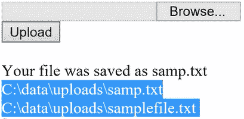
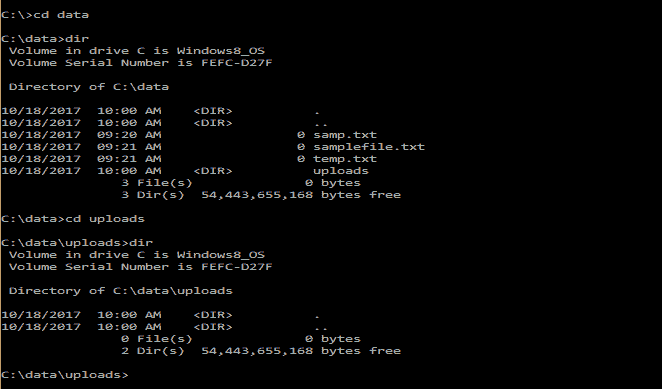

# 第二十三章：创建使用文件上传控件的页面

在本章中，您将学习如何在 ASP.NET 中使用上传功能。为此，我们将在页面上创建一个带有以下控件的界面：


*图 23.2.1*：我们用户界面的控件

当您点击浏览按钮时，您应该会得到一些示例文件，如*图 23.2.2*所示。选择其中一个文件，例如`samp.txt`：


*图 23.2.2*：C:\data 目录文件列表

现在，当您点击上传按钮时，一旦文件上传完成，浏览器将显示一个消息，类似于*图 23.2.3*中显示的消息，显示文件已上传的位置，目录中有多少文件，以及它们的名称。这是我们的目标：



*图 23.2.3*：单击上传按钮时显示的消息

确保您的硬盘的根目录中有一个名为`data`的文件夹，并且在该文件夹中，您有另一个名为`uploads`的文件夹。要在命令行级别执行此操作，请转到命令提示符（`C:\`）并按照以下步骤操作：

1.  输入`cd..`以切换到根目录。

1.  然后，输入`cd data`并按*Enter*。

1.  在`C:\data`目录下，输入`dir`，如下所示：

```cs
 C:\data\dir
```

1.  在`C:\data`目录下，输入`cd uploads`，如下所示：

```cs
 C:\data\cd uploads
```

1.  在`C:\data\uploads`目录下，再次输入`dir`：

```cs
 C:\data\cd uploads\dir
```

您的屏幕将类似于*图 23.2.4*所示的屏幕：



*图 23.2.4*：C:\data\uploads 的命令行目录列表

现在让我们实现这一点。

# 从头开始启动我们的项目

让我们从头开始创建一个新项目。转到文件 | 新建 | 网站...；然后，转到解决方案资源管理器，单击`Default.aspx`。

现在我们可以看到一个基本的 HTML。让我们把一个`FileUpload`控件放进去。要做到这一点，去工具箱，抓取一个`FileUpload`控件，并将其拖放到以`<form id=...`开头的行下方，并在其后添加一个`<br/>`标签，如下所示：

```cs
<asp:FileUploadID ="FileUpload1" runat="server" /><br/>
```

接下来，在这一行下面放入一个按钮，如下所示：

```cs
<asp:Button ID="Button1" runat="server" Text="Upload" /><br /> 
```

更改按钮上的文本，使其显示更有意义的内容，例如`上传`。

删除两个`<div>`行——您不需要它们。

当您进入设计视图时，您会看到这个简单的界面，如*图 23.2.5*所示。您有一个浏览按钮，它是上传控件的一部分，因此不需要单独放在那里，还有一个上传按钮：


*图 23.2.5*：我们项目的简单界面

现在，双击上传按钮。这将带您进入`Default.aspx.cs`。删除`Page_Load`块。该项目的起始代码的相关部分应该如*图 23.2.6*所示：


*图 23.2.6*：该项目的起始代码

# 添加一个命名空间

要读取文件，首先在文件顶部的`using System`之后插入以下内容：

```cs
using System.IO;
```

# 将文件保存到特定位置

您需要做的第一件事是指定文件应该保存的位置。因此，在以`protected void Button1_Click...`开头的行下方的一对大括号中输入以下内容：

```cs
string savePath = @"c:\data\uploads\";
```

这里，`savePath`是文件将被保存的路径的名称。您输入`@`符号来创建一个逐字字符串，`c:\data\uploads`就是文件将被保存的地方。请记住，如果您删除`@`符号，会导致错误，因为它意味着按照原样读取字符串。

接下来，输入以下内容：

```cs
if(FileUpload1.HasFile)
```

这里，`HasFile`是一个简单的属性。然后，您可以这样说（在一对大括号之间）：

```cs
{
    string fileName = FileUpload1.FileName;
}
```

此行获取文件名，这里再次，`FileName`是一个属性。

现在，输入以下内容：

```cs
savePath += fileName;
```

因此，`savePath`首先是文件夹结构，然后您还将文件名附加到其中。

# 保存文件

现在，要实际保存文件，请输入以下内容：

```cs
FileUpload1.SaveAs(savePath);
```

请记住，每当您想了解这些术语中的任何一个更多信息时，都可以这样做。只需右键单击它们，然后选择转到定义。例如，如*图 23.2.7*所示，如果展开`public void SaveAs`行，它会说将上传文件的内容保存到 Web 服务器上指定的路径。它还会引发异常，因此存在错误的可能性。请记住这一点。 


图 23.2.7：Go To Definition 中 SaveAs 的解释

# 向用户显示消息

接下来，让我们向用户显示一些有用的诊断消息。为此，请输入以下内容：

```cs
sampLabel.Text = "<br>Your file was saved as " + fileName;
```

另一种可能性是没有文件。换句话说，`FileUpload1.HasFile`为 false。如果是这种情况——没有文件，您可以将前一行复制到下面，并更改文本以使其有意义。从上一个闭合大括号下面开始输入`else`，然后输入以下内容：

```cs
{
   sampLabel.Text = "<br>You did not specify a file to upload.";
} 
```

# 确定目录中存储了哪些文件

接下来，让我们去看看目录中有哪些文件。因此，在上一行下面的闭合大括号下面输入以下内容：

```cs
string sourceDirectory = @"C:\data\uploads";
```

同样，您将从与之前以“String savePath…”开头的相同位置获取它，并将`c:\data\uploads\`粘贴到这一行中。

接下来，您可以在以下行上键入`try`，并在其下的一对大括号之间输入以下内容：

```cs
{
   var txtFiles = Directory.EnumerateFiles(sourceDirectory, "*.txt");
}
```

输入`EnumerateFiles`时出现的工具提示显示有几种重载——`string path`和`string searchPattern`。因此，这里的路径将是`sourceDirectory`，而`searchPattern`将用于搜索以`.txt`结尾的所有内容。因此我们在末尾放置`*.txt`。这就是如何枚举所有文件。

# 确定返回类型

如果您将鼠标悬停在上一行中的`var`上，弹出的工具提示会告诉您返回类型是什么。它说`IEnumerable`。现在将鼠标悬停在`EnumerateFiles`上，右键单击它，然后选择转到定义：


图 23.2.8：在定义中，它显示返回类型为 IEnumerable

如*图 23.2.8*所示，返回类型是`IEnumerable`，这意味着您可以遍历结果，或者使用`foreach`语句显示它们。

接下来，在上一行下面输入以下内容：

```cs
foreach(string currentFile in txtFiles)
```

然后就在这下面输入以下内容（缩进）：

```cs
sampLabel.Text += $"<br>{currentFile}";
```

# 探索 EnumerateFiles 的异常

现在，再次将鼠标悬停在`EnumerateFiles`上，右键单击它，然后选择转到定义。展开定义并查看它可能引发的异常。有很多异常，其中一些在*图 23.2.9*中显示：


图 23.2.9：EnumerateFiles 可能引发的异常的部分列表

例如，`DirectoryNotFound`可能是一个常见的异常；`path`是一个文件名，`PathTooLong`和`SecurityException`也是常见的异常。因此，`EnumerateFiles`有相当多的异常。

# 捕获异常

换句话说，您需要插入某种`catch`来处理这些情况。因此，在最后一个闭合大括号之后输入以下内容：

```cs
catch(Exception ex)
```

现在，在一对大括号之间，输入以下内容：

```cs
{
    sampLabel.Text += ex.Message;
}
```

在这里，`ex.Message`表示要在屏幕上显示的异常对象的消息。

# 运行程序

现在让我们确认这将起作用，所以在浏览器中启动它。单击“浏览”，并从`C:\data`目录中获取`temp.txt`文件。单击“上传”。正如您在*图 23.2.10*中所看到的，您的文件已保存，并且在同一目录中还有其他文件。完美！


图 23.2.10：运行我们的程序的结果

现在，想象一下您犯了以下错误（输入`upload`而不是“uploads”）：

```cs
string sourceDirectory = @"C:\data\upload";
```

如果您再次运行它，通过单击“浏览”并选择`samplefile.txt`文件，您可以从*图 23.2.11*中显示的错误消息中看到，它找不到路径的一部分...：


图 23.2.11：当路径输入错误时显示的错误消息

所以这些是使它工作的基础知识。再次确保输入并运行此代码几次，然后您将完全了解发生了什么。请记住，我们可以这样做是因为网页只能在我们的本地计算机上访问。在更现实的情况下，您需要更加关注安全性，并防范恶意上传。

# 章节回顾

本章的`Default.aspx.cs`文件的完整版本，包括注释，如下所示：

```cs
using System;
using System.IO;
public partial class _Default : System.Web.UI.Page
{
    protected void Button1_Click(object sender, EventArgs e)
    {
        string savePath = @"c:\data\uploads\"; //make upload directory
        if (FileUpload1.HasFile)
        {
            string fileName = FileUpload1.FileName;//get file name
            savePath += fileName;//attach file name to save path
            FileUpload1.SaveAs(savePath);//save file
            sampLabel.Text = "<br>Your file was saved as " + fileName;
        }
        else
        {
            sampLabel.Text = "<br>You did not specify a file to upload.";
        }
        //could also use savePath here
        string sourceDirectory = @"C:\data\uploads";
        try
        {
            //list files using EnumerateFiles
            var txtFiles = Directory.EnumerateFiles(sourceDirectory,
            "*.txt");
            foreach (string currentFile in txtFiles) //display files
            sampLabel.Text += $"<br>{currentFile}";
        }
        //display any error messages
        catch (Exception ex)
        {
            sampLabel.Text += ex.Message;
        }
    }
} 
```

# 总结

在本章中，您学会了如何在 ASP.NET 中使用上传功能。您将文件保存到特定位置，向用户显示消息，确定存储在目录中的文件，探索`EnumerateFiles`的异常，并编写捕获异常的代码。

在下一章中，您将学习使用序列化将对象保存到硬盘的另一种方法。然后，您将了解从硬盘重建对象的过程，这被称为**反序列化**。
