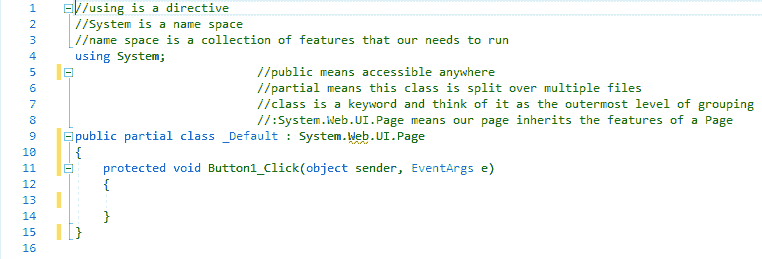

# 第二十四章：序列化和反序列化对象

在本章中，您将学习另一种将对象保存到硬盘的方法—使用序列化。您还将学习从硬盘重建对象的过程，这称为反序列化。

# 将两个按钮添加到 HTML 中

启动一个项目，在这个项目中，您将在<html>页面中插入两个按钮。您将在以`<form id=...`开头的行下方放置第一个按钮。要做到这一点，转到工具箱，获取一个`Button`控件，并将其拖放到那里。将第一个按钮上的文本更改为`Save`。现在获取另一个按钮，并将其拖放到该行下方。将第二个按钮上的文本更改为`Open`。因此，您在页面中放置了两个按钮，如下所示：

```cs
<asp:ButtonID="Button1" runat="server" Text="Save" /><br/>
<asp:ButtonID="Button2" runat="server" Text="Open" /><br/>
```

删除两个`<div>`行—您不需要它们。当然，在最后您还有一个标签：

```cs
<asp:LabelID="sampLabel" runat="server"></asp:Label>
```

在设计视图中，如*图 24.3.1*所示，您有两个按钮—Save 和 Open—然后是一个标签，打开的对象可以在其中显示：


图 24.3.1：我们在设计视图中的简单界面

# 开始编写项目

首先，我们将创建`Save`按钮，双击它，这将显示`Button1_click`的事件处理程序。删除`Page_Load`块。该项目的起始代码的相关部分应如*图 24.3.2*所示：



图 24.3.2：该项目的起始代码

# 添加命名空间

接下来，您需要添加新的命名空间，因此在文件顶部的`using System`下面，输入以下内容：

```cs
using System.IO;
```

显然，这一行用于输入和输出。接下来，输入以下内容：

```cs
using System.Runtime.Serialization.Formatters.Binary;
```

这一行允许您编写代码。当我们一起编写代码时，您将更好地理解这些命名空间的目的。接下来，让我们再做一个，如下所示：

```cs
using System.Diagnostics;
```

这一行只是为了让您能够打开记事本。保存为二进制格式后，您将使用记事本查看文件。现在您可以折叠这些命名空间，如果您愿意的话。

# 创建可序列化类

因此，首先您需要可以序列化的东西—一个可序列化的类。您将在前面的`using`语句下方放置它。输入以下内容：

```cs
[Serializable()]
```

您可以以这种方式装饰一个类。接下来，要序列化的内容如下输入：

```cs
public class Person
```

# 为可序列化类添加功能

这是你的可序列化类。接下来，你将为其添加功能。因此，在此行下面的一对大括号之间，输入以下内容：

```cs
public string Name { get; set; }
public decimal Salary { get; set; }
```

接下来，我们将重写一个方法，以便我们可以显示一个人并实际格式化它。因此，输入以下内容：

```cs
public override string ToString()
```

现在，如果您将鼠标悬停在`ToString`上，您将看到它是一个对象类。请记住，对象类是整个层次结构的父类。这是`ToString`被定义的地方。工具提示显示为 string object.ToString()。现在我们将覆盖它并编写我们自己的定义。

接下来，在`override`行下面的一对大括号中，输入以下内容：

```cs
return $"{Name} makes {Salary:C} per year.";
```

这将是我们对`ToString`的特定实现；也就是说，`Name`每年赚取一定金额的钱—无论每个`Person`类的实例的名称和薪水是什么。

# 定义保存文件的路径

接下来，在以`protected void Button1_Click...`开头的行下面的一对大括号中，输入以下内容：

```cs
string file = @"c:\data\person.bin"; 
```

在这里，您正在定义文件将被保存的路径。请注意，这次我们使用了不同的扩展名—`.bin`代表二进制，而不是`.txt`代表文本。

# 创建一个 Person 对象

接下来，输入以下内容以创建一个新的`Person`对象：

```cs
Person per = new Person() { Name = "John Smith", Salary = 78999 };
```

请记住，创建对象的另一种方法是您可以在大括号内设置属性的值。因此，我们有`John Smith`和他的`Salary`属性值。因此，我们创建了一个`new Person`对象。

# 处理非托管资源

现在，输入以下内容：

```cs
using (FileStream str = File.Create(file))
```

将鼠标悬停在前一行的`FileStream`上，以查看其位置；它在`System.IO`内。请注意，`using System.IO;`不再是灰色的，因为`FileStream`现在在那里。

接下来，右键单击`FileStream`，然后选择“转到定义”。您会看到它是从`Stream`派生的。现在，如果您向下滚动到底部，看到`Dispose`并展开它，您会看到它说释放 System.IO.FileStream 使用的未托管资源...，如*图 24.3.3*所示：


图 24.3.3：FileStream 的扩展定义

这就是为什么我们将其放在`using`语句中的原因，因为它涉及到未托管资源，比如低级磁盘访问。所以，我们将创建一个文件。

# 创建一个二进制格式化程序

接下来，您将创建一个二进制格式化程序，所以在以下行之间输入以下内容：

```cs
BinaryFormatter binFormatter = new BinaryFormatter();
```

同样，`BinaryFormatter`在这里是一个类，所以如果您将鼠标悬停在它上面，工具提示会说以二进制格式序列化和反序列化对象，或连接对象的整个图形。

# 序列化对象

接下来，要序列化我们的对象，您说`binFormatter.Serialize`，这是一个在那里定义的函数，然后您需要一个流和一个要通过流序列化的对象（`per`）：

```cs
binFormatter.Serialize(str, per);
```

为了确认这个工作，输入以下内容在闭合大括号下面：

```cs
Process.Start("notepad.exe", file);
```

这将只是启动文件，以确认它已经被保存。

# 测试程序

在编写其余代码之前，我们可以进行一次测试。所以让我们在浏览器中启动它，然后点击保存*:*。


图 24.3.4：程序的测试运行，以确保它正常工作

现在您可以看到，当您检查它时，保存的内容看起来与普通文本非常不同。请记住，当您学习属性时，我们谈到了*后备字段*。字段的实际值显示在*图 24.3.5*中。您可以看到工资、姓名值，然后是字段。这就是我们所说的*二进制*。它看起来与普通文本非常不同：


图 24.3.5：后备字段显示字段的实际值

# 从硬盘重建对象

在下一阶段，我们希望能够从硬盘重新构建这个对象。为此，在设计视图中双击“打开”按钮。这将带您回到`Default.aspx.cs`文件。

现在，在以`protected void Button2_Click...`开头的行下面的一组大括号内，创建一个新的`Person`对象，如下所示：

```cs
Person personRebuilt;
```

我们从硬盘构建这个。在这行下面输入以下内容：

```cs
string file = @"c:\data\person.bin";
```

通过这行，我们将从该文件中读取回来。

接下来，您必须确认文件实际存在，所以输入以下内容：

```cs
if(File.Exists(file))
```

如果文件存在，您将采取一些操作，这些操作将重建对象。

现在在以下行下面的一组大括号之间输入以下内容：

```cs
using (FileStream personStream = File.OpenRead(file))
```

在这里，我们打开文件进行读取。将鼠标悬停在`OpenRead`上。注意它返回一个`FileStream`类，因此表达式的右侧和左侧是一致的。

接下来，在这行下面的另一组大括号之间，输入以下内容：

```cs
BinaryFormatter binReader = new BinaryFormatter();
```

现在，我们将重建`Person`对象，所以接下来输入以下内容：

```cs
personRebuilt = (Person)binReader.Deserialize(personStream);
```

这将是对`Person`类型的转换。然后，将`personStream`传递到二进制读取器上定义的`Deserialize`函数中，然后将其转换回`Person`对象。

# 显示结果

现在，有了这个，我们可以显示东西。例如，接下来输入以下内容：

```cs
sampLabel.Text = personRebuilt.ToString();
```

请记住，此行中的`ToString`是在`Person`内部定义的。它是覆盖对象内部定义的基本`ToString`方法的方法。如果您将鼠标悬停在此处的`ToString`上，它会显示字符串`Person.ToString()`。

# 运行程序

现在让我们在浏览器中打开这个新代码。单击“保存”按钮，它会打开记事本，如*图 24.3.6*所示：


图 24.3.6：单击“保存”按钮时运行程序的结果

现在单击“打开”按钮，它看起来像*图 24.3.7*中显示的屏幕：


图 24.3.7：单击“打开”按钮时运行程序的结果

因此，这证明了对象已被构建，并且还证实了在这个重建的对象`personRebuilt`上，您可以调用在类的定义中详细说明的通常函数、方法等，即`return $"{Name} makes {Salary:C} per year.";`行。

# 章节回顾

回顾一下，要记住的重点是，您可以从一个对象开始，并添加相当多的命名空间，特别是`BinaryFormatter`和`IO`。接下来，您定义一个类，并在下面添加可序列化属性。然后，您编写代码以二进制格式保存，还编写了代码以从二进制格式重建为您的应用程序中可以使用的格式。

本章的`Default.aspx.cs`文件的完整版本，包括注释，如下所示：

```cs
//using is a directive
//System is a name space
//name space is a collection of features that our needs to run
using System;
using System.IO;
using System.Runtime.Serialization.Formatters.Binary;
using System.Diagnostics; //for notepad
//public means accessible anywhere
//partial means this class is split over multiple files
//class is a keyword and think of it as the outermost level of grouping
//:System.Web.UI.Page means our page inherits the features of a Page
[Serializable()]
public class Person //make class serializable
{
    public string Name { get; set; } //define name property
    public decimal Salary { get; set; } //define Salary property
    public override string ToString() 
    //override ToString() from object class
    {
        //return pretty string to describe each person
        return $"{Name} makes {Salary:C} per year.";
    }
}
public partial class _Default : System.Web.UI.Page
{
    protected void Button1_Click(object sender, EventArgs e)
    {
        //define path where file will be saved
        string file = @"c:\data\person.bin";
        //build an object
        Person per = new Person() { Name = "John Smith", Salary = 78999 };
        //enclose FileStream in a using because of low level access
        using (FileStream str = File.Create(file))
        {
            //make a formatter
            BinaryFormatter binFormatter = new BinaryFormatter();
            //this is the step that saves the information
            binFormatter.Serialize(str, per);
        }
        //start notepad and display file
        Process.Start("notepad.exe", file);
    }
    protected void Button2_Click(object sender, EventArgs e)
    {
        //person object to hold the rebuild person from disk
        Person personRebuilt;
        string file = @"c:\data\person.bin"; //path
        if(File.Exists(file)) //first confirm file exists
        {
            //enclose FileStream in a using
            using (FileStream personStream = File.OpenRead(file))
            {
                //make a formatter
                BinaryFormatter binReader = new BinaryFormatter();
                //reconstruct person using a cast
                personRebuilt = 
                (Person)binReader.Deserialize(personStream);
                //invoke to string on the person
                sampLabel.Text = personRebuilt.ToString();
            }
        }
    }
}
```

# 总结

在本章中，您学习了另一种将对象保存到硬盘的方法——使用序列化。然后，您学习了从硬盘重建对象的过程——反序列化。您创建了一个`serializable`类，为该类添加了特性，定义了保存文件的路径，创建了一个`Person`对象，编写了处理非托管资源的代码，创建了一个二进制格式化程序，对对象进行了序列化，并测试了您的程序。

在下一章中，您将学习如何在像素级别处理图像。我们将反转颜色并进行更改。
