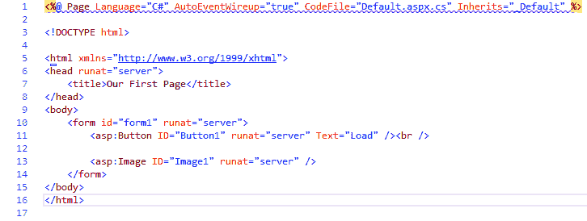
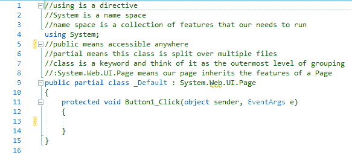

# 第二十五章：通过像素操作图像来玩一点

在本章中，你将学习如何在像素级别处理图像。你将反转颜色，改变它们。

# 操作图像

首先，在我的`c:\data`文件夹中，我有一个名为*lessonimage*的文件。正如你在*图 25.4.1*中所看到的，可乐罐上的文字是红色的，背景似乎是红棕色的：


图 25.4.1：本章中用于在像素级别反转颜色的图像

我们要做的是交换颜色，这样可乐罐上的文字，例如，将变成绿色，你将学习如何在单个像素级别操作图像。

# 向 HTML 添加一个按钮和一个图像控件

打开一个新项目。删除以`<div...`开头的两行；也删除这次的`Label`行。你不需要它们中的任何一个。

接下来，你需要在<html>页面中插入一个`Button`控件。要做到这一点，去工具箱，拖动一个`Button`控件，并将其拖放到以`<form id=...`开头的行下面。将第一个按钮上的文本更改为`Load`。

现在，你需要在<html>页面中插入一个图像控件。所以，回到工具箱，拖动一个`Image`控件，并将其拖放到前一行下面，两者之间留一行空白。你的`Default.aspx`文件应该看起来像*图 25.4.2*中显示的那样：



图 25.4.2：本章的完整 HTML

所以，你为这个项目有一个非常简单的界面：一个按钮用于加载图像，另一个按钮是一个图像控件，用于显示图像：


图 25.4.3：我们项目的简单界面

现在，双击加载按钮。这会带你进入`Default.aspx.cs`。删除`Page_Load`事件；我们不关心那个。这个项目起始代码的相关部分应该看起来像*图 25.4.4*：



图 25.4.4：这个项目的起始代码

# 添加一个命名空间

自然而然的，首先要做的是添加一个相关的新命名空间。为此，在文件顶部的`using System`下面输入以下行：

```cs
using System.Drawing;
```

为了使事情变得清晰干净，如果你愿意的话，你可以折叠文件顶部的所有代码组，这样基本上第一行清晰可见的是`public partial class...`。

# 制作一个位图

当然，下一步是放入代码来实现你想要的功能。首先，你将制作一个位图。在以`protected void Button1_Click...`开头的行下面的大括号之间输入以下内容：

```cs
Bitmap image = new Bitmap(@"c:\data\lessonimage.bmp");
```

在这里，`Bitmap`是一个我们将称之为`image`的类。基本上，你有一个可以操作的位图。然后，为了初始化它，你传入一个路径。在这种情况下，它是`(@"c:\data\lessonimage.bmp");`。

# 将图像保存为位图图片

接下来，打开画图并加载本章要操作的图像，如*图 25.4.5*所示：


图 25.4.5：在画图中要操作的图像

现在，要将其保存为位图，转到文件 | 另存为，然后选择 BMP 图片，如*图 25.4.6*所示：


图 25.4.6：画图中的另存为选项

BMP 图片的描述说保存任何类型的高质量图片并在计算机上使用。当你要保存文件时，另存为对话框中的文件类型字段显示为 24 位位图(*.bmp;*.dib)。你可以将任何图像保存为位图。

# 访问像素的位置

接下来，在`Bitmap image = new Bitmap...`行后输入以下内容：

```cs
int x, y;
```

你需要这行来获取图像中每个像素的位置。

现在，要访问每个像素的位置，你需要嵌套的`for`循环。首先输入下一行：

```cs
for(x = 0; x < image.Width; x++)
```

这里的外部`for`循环用于控制`x`坐标的水平移动。

现在，在一对花括号之间，输入以下内容：

```cs
for(y = 0; y < image.Height; y++)
```

这个内部的`for`循环是为了控制每个像素的`y`坐标，或者它的垂直位置。

# 操纵像素

一旦你完成了所有这些，下一阶段就是操纵像素。所以，从另一组花括号开始，并在它们之间输入以下内容，缩进：

```cs
Color pixelColor = image.GetPixel(x, y);
```

这一行首先读取每个像素的颜色。如果你将鼠标悬停在这一行的`GetPixel`上，你会看到它返回的是颜色，而不是位置。工具提示说它获取了位图中指定像素的颜色。

现在你将创建一个新的颜色。输入以下内容，也缩进，接下来：

```cs
Color newColor = Color.FromArgb(pixelColor.B, pixelColor.R, pixelColor.G);
```

在这里，`=`符号后面的`Color`是一个`struct`值类型。除了`FromArgb`，你还可以使用`FromKnownColor`或`FromName`。这意味着字符串名称是已知的。在`FromArgb`后面，你说`pixelColor.B`来获取这个颜色结构的蓝色分量，`pixelColor.R`来获取红色分量，然后`pixelColor.G`来获取绿色分量。因此，你用这一行创建了一个新的`Color`对象。

接下来，输入以下内容：

```cs
image.SetPixel(x, y, newColor);
```

如果你将鼠标悬停在`SetPixel`上，工具提示说在这个位图中设置指定像素的颜色。然后，`(x, y, newColor)`表示要用来着色该像素的新颜色。

# 将图片转换为字节数组

现在你需要能够显示图片。你需要写一些代码来完成转换。所以，从外部`for`循环的闭合花括号下面输入以下内容：

```cs
byte[] picBytes = (byte[])new ImageConverter().ConvertTo(image, typeof(byte[]));
```

在这里，你创建了一个名为`picBytes`的字节数组，然后使用`(byte[])`进行转换。有一个图像转换器类，所以你创建了一个新的`ImageConverter()`类，然后你转换为目标类型，`typeof`，然后是`byte`。所以，在这里你将图片转换为字节数组。

现在，如果你去掉`(byte[])`的转换，工具提示会说你的字节数组不能隐式转换为'object'。这是因为`ConvertTo`返回一个对象。因此，你需要在它的前面有`(byte[])`转换。

现在你有了这个，接下来可以说以下内容：

```cs
string baseString = Convert.ToBase64String(picBytes);
```

在`Convert`内部，你现在可以输入`Convert.ToBase64String`，并且`picBytes`可以转换为`base64`字符串。

# 发送图片 URL

现在你可以发送图片 URL，所以输入以下内容：

```cs
Image1.ImageUrl = "data:image/png;base64," + baseString;
```

在这一行的末尾的`baseString`变量是在一个图片字节数组上运行两个`base64`字符串的结果。

# 运行程序

有了这个，现在让我们来看一下结果；打开你的浏览器，点击加载按钮。修改后的图片显示在*图 25.4.7*中：


图 25.4.7：运行程序时产生的操纵后的图片

现在你会看到，承诺的图片已经被反转：颜色是绿色的。原来的背景有点红棕色，现在是绿色的。男人的头发原来有点棕色，现在有点深色，桌子也是一样。然而，有些东西似乎没有受到太大影响，比如钱的颜色，对吧？那仍然有点灰色。图片中的黑色物体也是一样。

正如你所看到的，你可以操纵图片，改变它们的位置，并使它们看起来非常不同，所以没有什么是真正固定的。这就是重点。此外，你可以单独访问每个像素，改变颜色，然后程序中最后三行代码负责让你写入`Image1.ImageUrl`。要设置这个图片的 URL，你需要通过这三行中的前两行。可能有一些更简单的方法，但这是一个可行的方法。

# 章节回顾

本章的`Default.aspx.cs`文件的完整版本，包括注释，显示在以下代码块中：

```cs
//using is a directive
//System is a name space
//name space is a collection of features that our needs to run
using System;
using System.Drawing;
//public means accessible anywhere
//partial means this class is split over multiple files
//class is a keyword and think of it as the outermost level of grouping
//:System.Web.UI.Page means our page inherits the features of a Page
public partial class _Default : System.Web.UI.Page
{
    protected void Button1_Click(object sender, EventArgs e)
    {
        Bitmap image = new Bitmap(@"c:\data\lessonimage.bmp");
        //to get each pixel's location
        int x, y;
        //controls moving horizontally
        for(x=0;x<image.Width;x++)
        {
            //controls moving vertically
            for(y=0;y<image.Height;y++)
            {
                //get each pixel's color
                Color pixelColor = image.GetPixel(x, y);
                //make a new color
                Color newColor = Color.FromArgb(pixelColor.B, pixelColor.R, 
                pixelColor.G);
                image.SetPixel(x, y, newColor);//set new color
            }
        }
        //converts picture to array of bytes
        byte[] picBytes =(byte[])new ImageConverter().ConvertTo(image, 
        typeof(byte[]));
        //converts array of bytes to a certain kind of string
        string baseString = Convert.ToBase64String(picBytes);
        //sets the image URL in a format that allows the image to be
        //displayed in a web page
        Image1.ImageUrl = "data:image/png;base64," + baseString;
    }
}
```

# 总结

在本章中，您学会了如何在像素级别处理图像。您反转了颜色，对其进行了更改。您将按钮和图像控件插入到 HTML 中，制作了位图，将图像保存为位图图片，编写了访问每个像素位置以操纵像素的代码，将图片转换为字节数组，并发送了图像 URL。

在下一章中，您将学习如何读取文件，然后将它们保存到 SQL Server 作为图像。
