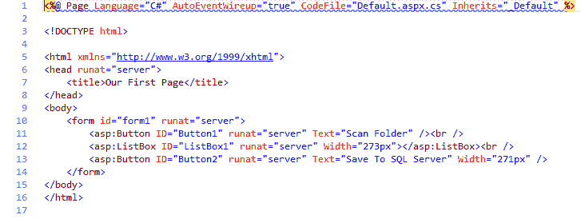
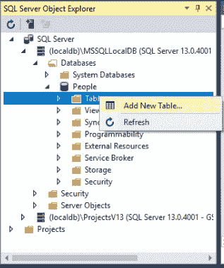
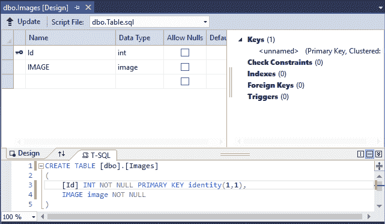
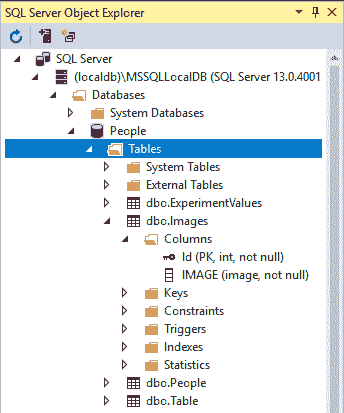
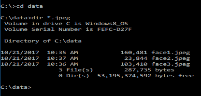
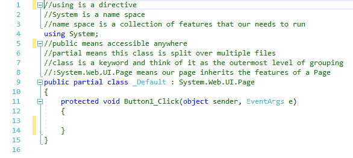
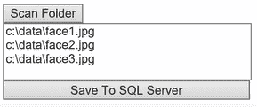

# 第二十六章：将图像保存到 SQL Server

在本章中，您将学习如何读取文件，然后将它们保存到 SQL Server 中作为图像。

# 在 HTML 中添加按钮和列表框

打开一个包含基本 HTML 的项目。这里需要做的第一件事是插入一个按钮。要做到这一点，转到工具箱，然后将`Button`控件拖放到以`<form id=...`开头的行下方。请记住，我们将在此项目中构建的简单界面将涉及单击按钮并从硬盘中读取文件到列表框中。更改`Button`控件上的文本为`扫描文件夹`。您将在此项目中扫描图像文件夹。

之后，您将插入一个`ListBox`控件。因此，再次转到工具箱，在搜索字段中键入`list`，然后将`ListBox`控件拖放到上一行下方。单击按钮后，您将填充`ListBox`控件。

在最后阶段，您将把所有文件保存到 SQL Server。这是我们的目标。为此，在上一行下方再拖入一个按钮。更改`Button`控件上的文本为`保存到 SQL Server`。

删除以`<div...`开头的两行，还有`Label`行也要删除。这些都不需要。

你的`Default.aspx`文件应该看起来像*图 26.5.1*中显示的那样：



图 26.5.1：本章的完整 HTML

转到设计视图，如*图 26.5.2*所示，您将得到此项目的非常简单的界面：一个扫描文件夹按钮，用于获取文件名，然后一个保存文件到 SQL Server 的按钮：


图 26.5.2：我们项目的简单界面

# 创建用于存储文件的数据库表

您需要有一个数据库表，可以在其中保存文件。首先打开 SQL Server 对象资源管理器。您会记得您有一个名为`People`的数据库。转到表文件夹，在其上右键单击，并选择`添加新表...`，如*图 26.5.3*所示：



图 26.5.3：在 SQL Server 对象资源管理器中添加新表

您可以保留顶部的默认内容基本上不变，但要进行以下更改：

1.  更改底部的 T-SQL 选项卡中的第一行，如下所示：

```cs
    [Id] INT NOT NULL PRIMARY KEY identity(1.1),
```

1.  接下来添加这一行：

```cs
    IMAGE image not null
```

1.  更改表的名称为`Images`，如下所示：

```cs
    CREATE TABLE[dbo].Images
```

这是我们的表，如*图 26.5.4*所示：



图 26.5.4：SQL Server 中的 dbo.Images 表

然后更新此内容，然后单击出现的对话框中的“更新数据库”按钮。等待更改生效。因此，如果展开表节点，您应该看到一个带有 IMAGE 列的 dbo.Images 表，如*图 26.5.5*所示：



图 26.5.5：表节点包含带有 IMAGE 列的 dbo.Images 表

# 将图像文件存储在硬盘上

在下一个阶段的过程中，您必须确保您有要读取的图像。因此，请在`C:\`驱动器的某个位置放置一些图像。例如，*图 26.5.6*显示了针对此特定计算机上的`C:\data`目录运行`dir *.jpeg`命令时获得的列表：



图 26.5.6：列出存储在 C:\data 目录中的三个图像文件

列表显示这些图像：`face1.jpeg`，`face2.jpeg`和`face3.jpeg`。因此，在这种特殊情况下，有三个文件需要从硬盘中读取。

现在在设计视图中双击扫描文件夹按钮。这将带您进入`Default.aspx.cs`。删除`Page_Load`存根。我们将处理与此相关的事件。这涉及到相当多的代码，因此这更像是一个项目。此项目的起始代码的相关部分应如*图 26.5.7*所示：



图 26.5.7：此项目的起始代码

# 添加命名空间

首先，您需要添加相关的命名空间。因此，在文件顶部附近的`using System`下面，输入以下内容：

```cs
using System.Data.SqlClient;
```

请记住，我们在连接和命令中使用这个。

在这一行下面输入以下内容：

```cs
using System.IO;
```

同样，这一行是为了能够读取硬盘。这是两个新的命名空间。您现在可以折叠掉以`public partial class...`开头的所有内容。

# 编写应用程序

现在让我们逐行通过代码的创建。因此，从以`protected void Button1_Click...`开头的行开始，在一组花括号中输入以下内容：

```cs
var imgFiles = Directory.GetFiles(@"c:\data\", "*.jpg");
```

在这里，您有一个`Directory`类和一个名为`GetFiles`的文件读取方法，它返回一个字符串数组，这些字符串是文件的路径。然后指定它们搜索的目录的路径，所以`(@"c:\data\"...)`，然后您只想搜索图像文件，所以您可以指定一个过滤器，或者在这种情况下是`*.jpg`。如果您将鼠标悬停在`var`上，您会看到它是一个字符串数组。

现在您可以加载到`ListBox`控件中。接下来输入以下内容：

```cs
foreach(var imgFile in imgFiles)
```

接下来，对于文件数组中的每个文件，输入以下内容：

```cs
ListBox1.Items.Add(imgFile);
```

因此，您获取了所有文件路径，然后使用`foreach`循环将它们添加到`ListBox`控件中，以便它们可以在页面中显示。这是我们的目标。

# 测试扫描文件夹功能

进入设计视图，在这一点上，扫描文件夹应该可以工作。为此，点击“扫描文件夹”按钮。

正如您在*图 26.5.8*中所看到的，文件已加载：



图 26.5.8：文件已正确加载到 ListBox 中

现在这一步完成了，您可以再次使用`foreach`循环获取每个文件，并将其保存到 SQL Server。接下来我们来做这个。

# 构建连接字符串

现在在设计视图中双击“保存到 SQL Server”按钮。这将带您回到`Default.aspx.cs`。正如您可以想象的那样，下一个阶段将是获取连接字符串。您以前已经做过这个。因此，在以`protected void Button2_Click...`开头的行下面的一组花括号中，首先输入`string connString =`，然后输入`@`符号使其成为逐字字符串，然后放入`""`符号。现在要获取连接字符串，请执行以下操作：

1.  单击菜单栏中的“查看”，然后选择“SQL Server 对象资源管理器”。

1.  右键单击“People”数据库，然后选择“属性”。

1.  在属性窗格中，双击“连接字符串”以选择它及其长描述。

1.  然后，右键单击长描述并将其复制。

1.  在“”符号的一组之间粘贴描述。

连接字符串行应该如下所示：

```cs
string connString = @"Data Source=(localdb)\MSSQLLocalDB;Initial Catalog=People;Integrated Security=True;Connect Timeout=30;Encrypt=False;TrustServerCertificate=True;ApplicationIntent=ReadWrite;MultiSubnetFailover=False";
```

您可以将此内容分成多行，这样会更整洁一些，如果您愿意的话。现在可以关闭 SQL Server 对象资源管理器和属性窗格。

# 使用连接字符串

现在我们将使用连接字符串，当然。因此，对于下一个阶段，在另一组花括号中输入以下内容：

```cs
using (SqlConnection conn = new SqlConnection(connString))
```

我们将调用连接字符串`conn`，并使用连接字符串初始化`SqlConnection`。

接下来，我们需要打开一个连接。在上一行下面的一组花括号中输入以下内容：

```cs
conn.Open();
```

然后，输入以下`foreach`循环：

```cs
foreach(var item in ListBox1.Items)
```

这里，`Items`是`ListBox`控件的一个属性。这是它包含的项目的列表，您可以逐个检查它们，以便对它们采取离散的操作。在另一组花括号中输入以下内容：

```cs
using (SqlCommand cmd = new SqlCommand("insert into dbo.Images (image) values(@image)", conn))
```

请注意，我们将`SqlCommand`放在`using`语句中。如果您右键单击`SqlCommand`并选择“转到定义”，您会看到它说，DbCommand 继承自它，如果您向下滚动到底部，您会看到它有一个`Dispose`行。要完成这里的代码，您有`(image)`作为字段，其参数是`@image`。

对于下一个阶段，在另一组花括号中输入以下内容：

```cs
byte[] picAsBytes = File.ReadAllBytes(item.ToString());
```

如果您将前一行仅留在`(item)`，它会在红色下划线下出现错误。因此，我们将其转换为`ToString`。在这里，我们将每个项目作为一系列字节读取，并将其存储在数组中，因为然后，它可以在 SQL Server 中转换为图像。

输入以下内容：

```cs
cmd.Parameters.AddWithValue("@image", picAsBytes);
```

再次，`@image`在这里是参数。因此，我们将把图片保存到`image`参数作为一系列字节。现在输入以下内容：

```cs
cmd.ExecuteNonQuery();
```

这一行执行实际的保存。信不信由你，这就是整个应用程序。

# 运行程序

现在让我们在浏览器中查看结果。首先，点击“扫描文件夹”。您可以看到图像列表。然后，点击“保存到 SQL Server”按钮。页面上没有显示任何内容，因为我们还没有编写任何代码在保存后显示任何内容。所以现在我们必须检查 SQL Server。

让我们转到“查看”|“SQL Server 对象资源管理器”。右键单击 dbo.Images 表图标，然后选择“查看数据”。正如您在*图 26.5.9*中所看到的，这些是以低级形式存储的图像。这证实它们已经被保存了：


图 26.5.9：dbo.Images 表中以低级形式存储的图像

也许，作为自己的任务，您可以从 SQL Server 中提取文件并将它们显示为图像。这将是一个有趣的练习。

# 章节回顾

回顾一下，`Default.aspx`是扫描文件夹按钮、`ListBox`和保存到 SQL Server 按钮的源代码。`Button1_Click...`块内的代码实际上扫描文件夹，然后显示可用的图像文件；也就是说，至少以`.jpg`结尾的文件。然后，当您想要从`ListBox`控件保存文件到 SQL Server 时，以连接字符串开头的代码运行。

本章的`Default.aspx.cs`文件的完整版本，包括注释，如下所示：

```cs
//using is a directive
//System is a name space
//name space is a collection of features that our needs to run
using System;
using System.Data.SqlClient;
using System.IO;
//public means accessible anywhere
//partial means this class is split over multiple files
//class is a keyword and think of it as the outermost level of grouping
//:System.Web.UI.Page means our page inherits the features of a Page
public partial class _Default : System.Web.UI.Page
{
    protected void Button1_Click(object sender, EventArgs e)
    {
        //scan folder for all files ending in jpg
        var imgFiles = Directory.GetFiles(@"c:\data\", "*.jpg");
        foreach(var imgFile in imgFiles)
        {
            //add files to list box in page
            ListBox1.Items.Add(imgFile);
        }
    }
    protected void Button2_Click(object sender, EventArgs e)
    {
        //make a connection string
        string connString = @"Data Source=DESKTOP-4L6NSGO\SQLEXPRESS; Initial Catalog=People;Integrated Security=True;Connect Timeout=15;Encrypt=False;TrustServerCertificate=False; ApplicationIntent=ReadWrite;MultiSubnetFailover=False";
        //make connection
        using (SqlConnection conn = new SqlConnection(connString))
        {
            //open connection
            conn.Open();
            foreach(var item in ListBox1.Items)
            {
                using (SqlCommand cmd = 
                new SqlCommand
                ("insert into dbo.Images (image) values (@image)", conn))
                {
                    //read picture as bytes
                    byte[] picAsBytes = File.ReadAllBytes(item.ToString());
                    //add pictures to SQL server as bytes
                    cmd.Parameters.AddWithValue("@image", picAsBytes);
                    //perform the actual saving
                    cmd.ExecuteNonQuery();
                }
            }
        }
    }
}
```

# 摘要

在本章中，您学会了如何读取文件，然后将它们保存在 SQL Server 中作为图像。您创建了一个数据库表来存储文件，在硬盘上存储图像文件，添加了命名空间，测试了扫描文件夹功能，并建立并利用了连接字符串。

在下一章中，我们将介绍 XML 的基础知识，XML 代表可扩展标记语言。
