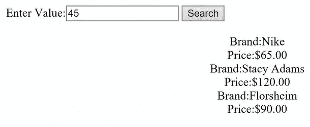

# 第二十九章：使用 LINQ 查询 XML 文档

在本章中，您将学习如何将 LINQ 和 XML 结合起来，使其更加实用。

# 向 HTML 添加文本框和按钮

启动项目，并在<html>内部，您需要做的第一件事是添加一个`TextBox`控件。要执行此操作，请转到视图|工具箱，在搜索字段中键入`tex`，然后将`TextBox`拖放到以`<form id=...`开头的行下面。在该行开头输入`输入值：`，使其看起来如下：

```cs
Enter Value:<asp:TextBoxID="TextBox1" runat="server"></asp:TextBox>
```

因此，您将有一个框；在框中输入一个值，然后您将获得一个结果。您将扫描 XML 文档以选择高于某个值的项目，例如$50 或$60。这是我们的目标；换句话说，制作一个可搜索的页面。

接下来，您将在<html>中插入一个按钮。因此，再次转到工具箱，在搜索字段中键入`but`，然后将`Button`控件拖放到前一行下面。更改`Button`控件上的文本，例如更改为`搜索`：

```cs
<asp:ButtonID="Button1" runat="server" Text="Search" />
```

接下来，转到设计视图。它看起来像*图 29.3.1*中显示的屏幕截图：


图 29.3.1: 设计视图中该项目的界面

双击搜索按钮。这将打开`Default.aspx.cs`文件。删除`Page_Load`存根。折叠`using System;`上下的所有注释—您不需要它们。该项目起始代码的相关部分应如*图 29.3.2*所示：


图 29.3.2: 该项目的起始代码

这里有一些有趣的代码—非常实用。请记住，无论您学习编程语言，现实生活中的挑战远比您在这本书中看到的任何内容都要困难得多。

# 添加命名空间

现在让我们添加一些命名空间。在文件顶部附近的`using System`下面输入以下内容：

```cs
using System.Xml.Linq;
using System.Linq;
```

因此，我们在 XML 和 LINQ 之间建立了一个桥梁—这是我们的目标。

# 清除输出

首先，您需要每次清除标签，以便输出不会在标签上累积。因此，在以`protected void Button1_Click...`开头的行下面的大括号之间输入以下内容：

```cs
sampLabel.Text = "";
```

# 构建元素树

接下来，我们将使用以下语法创建一个元素树：

```cs
XElement store = new XElement("store",
```

在这一行中，`store`是树的名称。基本上，它保存有关产品的信息。请记住，如果您想知道某物来自何处，只需将鼠标悬停在其上。因此，如果您将鼠标悬停在此行开头的`XElement`上，工具提示将显示它不是来自 XML 命名空间。相反，它来自 Xml.Linq 命名空间。

接下来，您将在`store`内放入其他元素。因此，在带有分号的括号关闭之前插入几行空行，现在您将在其中堆叠东西。

确保在前一行的`store`后面加上逗号。在键入逗号时，查看工具提示。您看到它说 params object[] content 吗？这意味着您可以指定要构建树的可变数量的参数。请记住，params 表示您可以指定可变数量的参数。

首先，我们将在 store 内部添加一个名为`shoes`的新元素。因此，缩进以下行：

```cs
new XElement("shoes",
```

接下来，进一步缩进以下行：

```cs
new XElement("brand", "Nike", new XAttribute("price", "65")),
```

在这里，您说`new XAttribute`，只是为了向您表明这是可能的。属性将是`price`，值将是，例如，`$65`。您关闭该属性并使用逗号关闭元素。

现在，由于您将重复此操作，请复制此行，并在下面粘贴它，将品牌名称更改为`Stacy Adams`，价格更改为`$120`，如下所示：

```cs
new XElement("brand", "Stacy Adams", new XAttribute("price", "120")),
```

让我们再重复一次。因此，再次复制此行，并将其粘贴在下面，将品牌名称更改为`Florsheim`，价格更改为`$90`，如下所示：

```cs
new XElement("brand", "Florsheim", new XAttribute("price", "90"))));
```

注意，在这里的最后一行，你用四个括号和一个分号结束。你必须非常小心。你必须确保一切匹配。所以，你有一个商店，然后你有一个鞋部门，在鞋部门内部你有不同的品牌：Nike、Stacy Adams 和 Florsheim。

# 保存商店 XML 文件

现在，最好能将这些写入文件，以确认结构被解释为预期的样子。所以在前面的`XElement store...`行下面输入以下内容，对齐缩进：

```cs
store.Save(@"c:\data\storefile.xml");
```

在这里，`store.Save()`是一个很好的函数，你可以直接调用它。你可以将它保存到一个文件中，比如：`(@"c:\data \storefile.xml");`。

# 测试程序

在做任何其他事情之前，让我们确认这将按预期工作，并且生成一个看起来不错的 XML 文件。所以，打开它在你的浏览器中，并点击搜索按钮，如*图 29.3.3*所示：


图 29.3.3：目前测试程序时显示的界面

当然，现在什么都没有显示，因为你还没有编写那部分代码。但是，如果你在`c:\data`目录下列出目录，就会看到保存的文件`storefile.xml`，如*图 29.3.4*所示：


图 29.3.4：文件 storefile.xml 保存在 c:\data 目录中

如果你在`c:\data>`提示符下键入`notepad.exe storefile.xml`，你将在记事本中看到*图 29.3.5*中显示的结果：


图 29.3.5：在记事本中打开的文件 storefile.xml

看起来很不错。你有一个`store`元素，然后在`store`元素内部有`shoes`，在`shoes`内部有品牌`Nike`、`Stacy Adams`和`Florsheim`，每双鞋的价格分别是：$65、$120 和$90。所以，这看起来是一个很好的文件，对我们的目的来说已经足够了。（在现实生活中，相信我，这些事情要复杂得多。）

# 搜索符合特定条件的项目

接着，在以`store.Save...`开头的行下面输入以下内容，以搜索鞋子：

```cs
var shoeSearch = from shoes in store.Descendants("shoes").Descendants("brand")
```

在这里，`var shoeSearch`是 LINQ 和 XML 的组合。

接下来，输入`where (decimal)`，用于转换为十进制值，并且价格大于用户输入的值：

```cs
where (decimal)shoes.Attribute("price") >decimal.Parse(TextBox1.Text)
```

# 从符合搜索条件的项目中进行选择

一旦找到这些鞋子，你可以从中选择：

```cs
select shoes;
```

如果你将鼠标悬停在前面使用`Descendants`的第一次上面，它会告诉你它返回 IEnumerable。工具提示说它返回此文档或元素的后代元素的过滤集合，按文档顺序排列。

另外，如果你将鼠标悬停在第二次使用`Descendants`上，你会看到它是按品牌进行的。一旦你到达那个级别，你可以，例如，将鼠标悬停在前面以`where...`开头的行中的`price`属性上，然后将这个属性与用户指定的值进行比较。所以，就好像你从外部到内部遍历，直到你到达价格属性，然后在那个阶段，你将该值与用户输入的值进行比较。

# 显示结果

接下来输入以下行，以显示搜索选择的所有鞋子品牌和价格：

```cs
foreach(XElement shoeBrand in shoeSearch)
```

最后，在前面的行下面的一对大括号之间输入以下内容：

```cs
sampLabel.Text += $"<br>Brand:{shoeBrand}<br>Price:{(decimal)shoeBrand.Attribute("price"):C}";
```

在这一行中，可能有多个值，所以你要追加。请注意，我们使用`<br>`标签将每个结果推到下一行。要显示价格，你要说`(decimal)`来转换为十进制值，然后在`shoeBrand.Attribute("price")`之后，你用`:C`将其转换为货币格式。这就是所有的代码。将所有这些都打出来非常重要。学习的最佳方式是通过实践，而不仅仅是打开一个事先准备好的文件并运行它。

# 运行程序

现在再次打开浏览器，输入一个值，比如`45`，然后点击搜索按钮。它应该返回所有的鞋子，因为价格都高于这个值，如*图 29.3.6*所示：



图 29.3.6：显示所有鞋子和价格，因为输入的值小于任何鞋子的价格

现在输入`100`作为值，然后再次点击搜索按钮。在这种情况下，它只返回价格为 120 美元的 Stacy Adams 鞋子，如*图 29.3.7*所示：


图 29.3.7：只返回 Stacy Adams 鞋子，因为它的价格超过 100 美元

让我们再做一个。再输入`85`，然后再次点击搜索按钮。如*图 29.3.8*所示，它返回 Stacy Adams 和 Florsheim 鞋子，因为这两者的价格都在 85 美元或以上：


图 29.3.8：返回 Stacy Adams 和 Florsheim 鞋子，因为两者的价格都在 85 美元或以上

就是这样。一切都按预期运行。我们还使用了你编写的整个`XElement`构造来生成了一个漂亮的 XML 文件，以便这个程序能够正确运行。

# 章节回顾

本章的`Default.aspx.cs`文件的完整版本，包括注释，如下所示：

```cs
//using is a directive
//System is a name space
//name space is a collection of features that our needs to run
using System;
using System.Xml.Linq;
using System.Linq;
//public means accessible anywhere
//partial means this class is split over multiple files
//class is a keyword and think of it as the outermost level of grouping
//:System.Web.UI.Page means our page inherits the features of a Page
public partial class _Default : System.Web.UI.Page
{
    protected void Button1_Click(object sender, EventArgs e)
    {
        //clear label on every button click so stuff does not accumulate
        sampLabel.Text = "";
        //create a nice XML tree structure for searching: store is the 
        //root, inside that is shoes,
        //and then under shoes are three different brands
        XElement store = new XElement("store",
                            new XElement("shoes",
                            new XElement("brand","Nike", 
                            new XAttribute("price","65")),
                            new XElement("brand", "Stacy Adams", 
                            new XAttribute("price","120")),
                            new XElement("brand", "Florsheim", 
                            new XAttribute("price","90"))));
        //save file to drive to confirm it looks like healthy XML
        store.Save(@"c:\data\storefile.xml");
        //search down to the level of the price attribute, and compare that
        //value against the value entered in the search box by the user
        var shoeSearch = from shoes in store.Descendants("shoes").Descendants("brand")
        where (decimal)shoes.Attribute("price") > decimal.Parse(TextBox1.Text)select shoes;
        //display all the shoe brands, and the prices
        foreach(XElement shoeBrand in shoeSearch)
        {
            sampLabel.Text += $"<br>Brand:{shoeBrand}<br>Price:{(decimal)shoeBrand.Attribute("price"):C}";
        }
    }
} 
```

# 总结

在本章中，你学会了如何结合 LINQ 和 XML 来做一些更实际的事情。你构建了一个元素树，并编写了代码来保存商店的 XML 文件，搜索符合特定条件的项目，并从找到的项目中选择符合搜索条件的项目。
