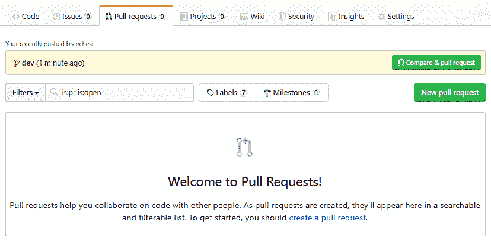
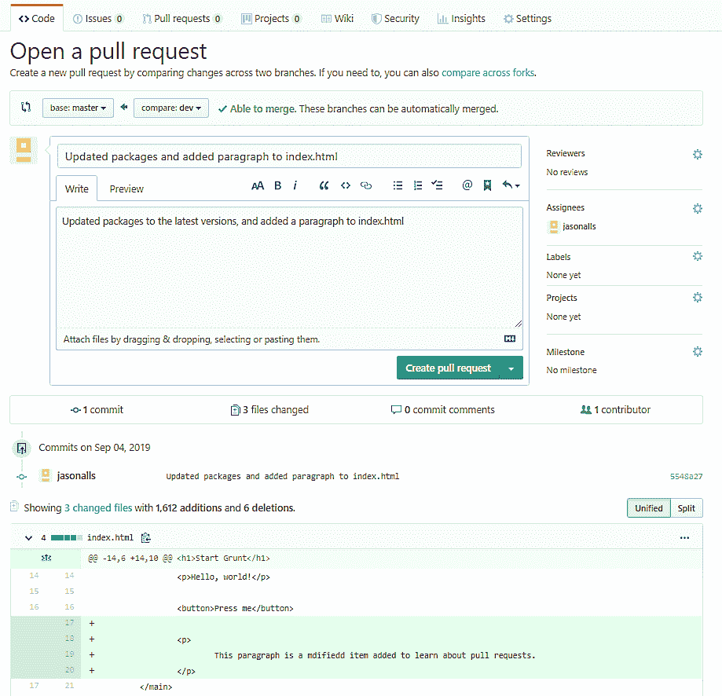
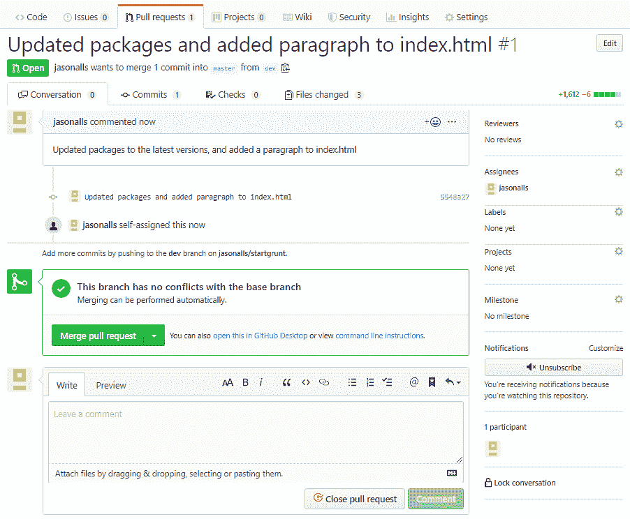
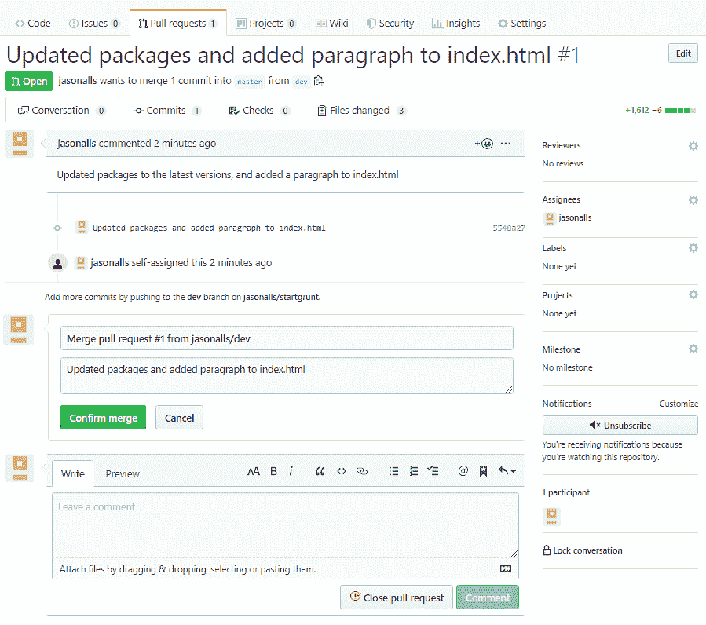
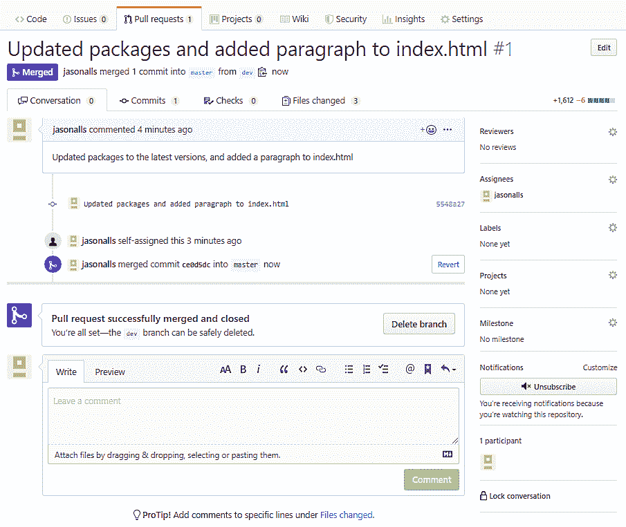
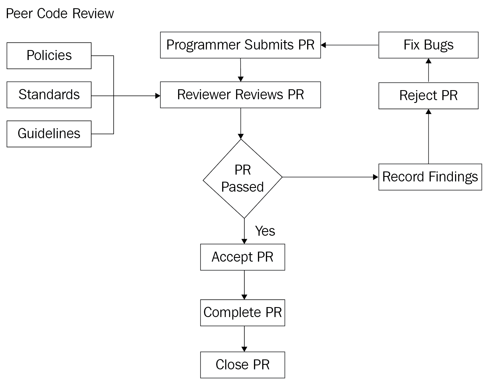

# 第二章：代码审查 - 流程和重要性

任何代码审查的主要动机都是为了提高代码的整体质量。代码质量非常重要。这几乎是不言而喻的，特别是如果您的代码是团队项目的一部分或者对其他人可访问，比如通过托管协议的开源开发者和客户。

如果每个开发人员都可以随心所欲地编写代码，最终会得到以许多不同方式编写的相同类型的代码，最终代码将变得难以管理。这就是为什么有必要制定编码标准政策，概述公司的编码实践和应遵循的代码审查程序。

进行代码审查时，同事们将审查其他同事的代码。同事们会理解犯错误是人之常情。他们将检查代码中的错误、违反公司编码规范的编码以及在语法上正确但可以改进以使其更易读、更易维护或更高效的代码。

因此，在本章中，我们将详细介绍以下主题以了解代码审查流程：

+   为审查准备代码

+   领导代码审查

+   知道要审查什么

+   知道何时发送代码进行审查

+   提供和回应审查反馈

请注意，对于*为审查准备代码*和*知道何时发送代码进行审查*部分，我们将从**程序员**的角度进行讨论。对于*领导代码审查*和*知道要审查什么*部分，我们将从**代码审查人员**的角度进行讨论。然而，至于*提供和回应审查反馈*部分，我们将涵盖**程序员**和**代码审查人员**的观点。

本章的学习目标是让您能够做到以下几点：

+   了解代码审查及其好处

+   参与代码审查

+   提供建设性的批评

+   积极回应建设性的批评

在我们深入讨论这些话题之前，让我们先了解一下一般的代码审查流程。

# 代码审查流程

进行代码审查的正常程序是确保您的代码能够编译并满足设定的要求。它还应该通过所有单元测试和端到端测试。一旦您确信能够成功编译、测试和运行您的代码，那么它就会被检入到当前的工作分支。检入后，您将发出一个拉取请求。

然后同行审阅人将审阅您的代码并分享评论和反馈。如果您的代码通过了代码审查，那么您的代码审查就完成了，然后您可以将您的工作分支合并到主干。否则，同行审查将被拒绝，并且您将需要审查您的工作并解决评论中提出的问题。

以下图表显示了同行代码审查流程：

# 为审查准备代码

为代码审查做准备有时可能会很麻烦，但它确实能够提高代码的整体质量，使其易于阅读和维护。这绝对是一个值得团队开发人员作为标准编码程序执行的实践。这是代码审查流程中的一个重要步骤，因为完善这一步骤可以节省审查人员在进行审查时的大量时间和精力。

在准备代码进行审查时，请记住以下一些标准要点：

+   **始终牢记代码审查**：在开始任何编程时，您应该牢记代码审查。因此，保持您的代码简洁。如果可能的话，将您的代码限制在一个功能上。

+   确保所有的测试都通过，即使你的代码能够构建：如果你的代码能够构建，但是测试失败了，那么立即处理导致测试失败的原因。然后，当测试按预期通过时，你可以继续进行。确保所有单元测试都通过，并且端到端测试也通过了所有的测试。非常重要的是确保所有的测试都完成并且通过了，因为发布能够工作但测试失败的代码可能会导致在代码投入生产时出现一些非常不满意的客户。

+   记住 YAGNI：在编写代码时，确保只添加满足需求或正在开发的功能的必要代码。如果你现在不需要它，那就不要编写它。只有在需要时才添加代码，而不是提前添加。

+   检查重复代码：如果你的代码必须是面向对象的，并且符合 DRY 和 SOLID 原则，那么请检查自己的代码，看看是否包含任何过程性或重复的代码。如果有的话，花时间重构它，使其成为面向对象的、DRY 和 SOLID 的代码。

+   **使用**静态分析器：已经配置为执行公司最佳实践的静态代码分析器将检查你的代码，并突出显示遇到的任何问题。确保你不要忽略信息和警告。这些可能会在后续引起问题。

最重要的是，只有在你确信你的代码满足业务需求、符合编码标准并且通过了所有测试时才提交你的代码。如果你将代码作为**持续集成**（**CI**）流程的一部分提交，而你的代码构建失败了，那么你需要解决 CI 流程提出的问题。当你能够提交你的代码并且 CI 通过时，那么你可以发起一个拉取请求。

# 领导代码审查

在进行代码审查时，重要的是有合适的人员在场。参加同行代码审查的人员将与项目经理商定。负责提交代码进行审查的程序员将出席代码审查，除非他们远程工作。在远程工作的情况下，审阅者将审查代码，然后接受拉取请求、拒绝拉取请求，或者在采取进一步行动之前向开发人员提出一些问题。

进行代码审查的合适负责人应具备以下技能和知识：

+   成为技术权威：领导代码审查的人应该是一个技术权威，了解公司的编码准则和软件开发方法。同时，他们对正在审查的软件有一个良好的整体理解也是非常重要的。

+   具备良好的软技能：作为代码审查的负责人，必须是一个热情鼓励的个体，能够提供建设性的反馈。审查程序员代码的人必须具备良好的软技能，以确保审阅者和被审阅代码的人之间没有冲突。

+   不要过于批判：代码审查的负责人不应过于批判，并且必须能够解释他们对程序员代码的批评。如果领导者接触过不同的编程风格，并且能够客观地查看代码以确保其满足项目的要求，那将非常有用。

根据我的经验，同行代码审查总是在团队使用的版本控制工具中进行拉取请求。程序员将代码提交到版本控制，然后发出拉取请求。同行代码审阅者将在拉取请求中审查代码。建设性的反馈将以评论的形式附加到拉取请求上。如果拉取请求存在问题，审阅者将拒绝更改请求并评论需要程序员解决的具体问题。如果代码审查成功，审阅者可能会添加评论以提供积极的反馈，合并拉取请求并关闭它。

程序员需要注意审阅者的任何评论，并加以采纳。如果需要重新提交代码，程序员需要确保在重新提交之前已经解决了审阅者的所有评论。

保持代码审查简短是个好主意，不要一次审查太多行。

由于代码审查通常始于拉取请求，我们将看看如何发出拉取请求，然后回应拉取请求。

## 发出拉取请求

当你完成编码并对代码质量和构建有信心时，你可以根据你使用的源代码控制系统推送或提交你的更改。当你的代码被推送后，你可以发出拉取请求。发出拉取请求后，对代码感兴趣的其他人会收到通知并能够审查你的更改。然后可以讨论这些更改，并就可能需要进行的任何更改发表评论。实质上，你推送到源代码控制存储库并发出拉取请求是启动同行代码审查流程的开始。

要发出拉取请求，你只需（在提交或推送代码后）点击版本控制的拉取请求选项卡。然后会出现一个按钮，你可以点击“新拉取请求”。这将把你的拉取请求添加到等待相关审阅者处理的队列中。

在接下来的截图中，我们将看到通过 GitHub 请求和完成拉取请求的过程：

1.  在你的 GitHub 项目页面上，点击拉取请求选项卡：

1.  然后，点击“新拉取请求”按钮。这将显示“比较更改”页面：

1.  如果你满意，然后点击“创建拉取请求”按钮开始拉取请求。然后会出现“打开拉取请求”屏幕：

1.  写下关于拉取请求的评论。为代码审阅者提供所有必要的信息，但保持简洁明了。有用的评论包括对所做更改的说明。根据需要修改“审阅者”、“受让人”、“标签”、“项目”和“里程碑”字段。然后，一旦你对拉取请求的细节满意，点击“创建拉取请求”按钮创建拉取请求。你的代码现在准备好由同行审阅了。

## 回应拉取请求

由于审阅者负责在分支合并之前审查拉取请求，我们最好看看如何回应拉取请求：

1.  首先克隆要审查的代码副本。

1.  审查拉取请求中的评论和更改。

1.  检查基本分支是否存在冲突。如果有冲突，那么您将不得不拒绝拉取请求并附上必要的评论。否则，您可以审查更改，确保代码构建无错误，并确保没有编译警告。在这个阶段，您还将注意代码异味和任何潜在的错误。您还将检查测试构建、运行是否正确，并为要合并的功能提供良好的测试覆盖。除非您满意，否则请进行任何必要的评论并拒绝拉取请求。当满意时，您可以添加您的评论，并通过单击合并拉取请求按钮来合并拉取请求，如下所示：

1.  现在，通过输入评论并单击确认合并按钮来确认合并：

1.  一旦拉取请求已合并并关闭，可以通过单击删除分支按钮来删除分支，如下截图所示：

在前一节中，您看到被审阅者提出拉取请求，要求在合并之前对其代码进行同行审查。在本节中，您已经了解了如何审查拉取请求并将其作为代码审查的一部分完成。现在，我们将看看在回应拉取请求时进行同行代码审查时应该审查什么。

## 反馈对被审阅者的影响

在审查同行代码时，您还必须考虑到反馈可能是积极的或消极的。负面反馈不提供有关问题的具体细节。审阅者关注的是被审阅者而不是问题。审阅者不向被审阅者提供改进代码的建议，而且审阅者的反馈旨在伤害被审阅者。

被审阅者收到的这种负面反馈会冒犯他们。这会产生负面影响，并可能导致他们开始怀疑自己。被审阅者内部产生缺乏动力的情况，这可能对团队产生负面影响，因为工作没有按时完成或达到所需水平。审阅者和被审阅者之间的不良情绪也会影响团队，并可能导致对整个团队产生负面影响的压抑氛围。这可能导致其他同事变得缺乏动力，最终导致整个项目遭受损失。

最后，到了被审阅者已经受够了的地步，离开去别的地方找新职位摆脱这一切。项目随后在时间和财务上都遭受损失，因为需要花费时间和金钱来寻找替代者。然后找到的人还必须接受系统和工作程序以及指南的培训。以下图表显示了审阅者对被审阅者的负面反馈：

相反，审阅者对被审阅者的积极反馈产生相反的效果。当审阅者向被审阅者提供积极反馈时，他们关注的是问题，而不是人。他们解释为什么提交的代码不好，以及可能引起的问题。然后审阅者会建议被审阅者改进代码的方法。审阅者提供的反馈只是为了提高被审阅者提交的代码的质量。

当被审查者收到积极（建设性）的反馈时，他们会以积极的方式回应。他们会接受审阅者的评论，并以适当的方式回答任何问题，提出任何相关问题，然后根据审阅者的反馈更新代码。修改后的代码然后重新提交进行审查和接受。这对团队有积极的影响，因为氛围保持积极，工作按时完成并达到所需的质量。以下图表显示了审阅者对被审阅者的积极反馈的结果：

要记住的一点是，你的反馈可以是建设性的，也可以是破坏性的。作为审阅者，你的目标是建设性的，而不是破坏性的。一个快乐的团队是一个高效的团队。一个士气低落的团队是无法高效工作的，对项目也是有害的。因此，始终努力通过积极的反馈来保持一个快乐的团队。

积极批评的一种技巧是反馈三明治技巧。你从赞扬好的地方开始，然后提出建设性的批评，最后再次赞扬。如果团队中有成员对任何形式的批评都反应不好，这种技巧就非常有用。你在处理人际关系的软技能和交付高质量代码的软件技能一样重要。不要忘记这一点！

我们现在将继续看一下我们应该审查的内容。

# 知道要审查什么

在审查代码时，必须考虑不同的方面。首先，被审查的代码应该只是程序员修改并提交审查的代码。这就是为什么你应该经常提交小的代码。少量的代码更容易审查和评论。

让我们来看看代码审阅者应该评估的不同方面。

## 公司的编码准则和业务需求

所有被审查的代码都应该符合公司的编码准则和代码所要满足的业务需求。所有新代码都应该遵循公司采用的最新编码标准和最佳实践。

业务需求有不同的类型。这些需求包括业务和用户/利益相关者的需求，以及功能和实施需求。无论代码要满足的需求类型是什么，都必须对其进行全面检查，以确保满足需求的正确性。

例如，如果用户/利益相关者的需求规定“作为用户，我想要添加一个新的客户账户”，那么审查的代码是否满足这一要求中列出的所有条件？如果公司的编码准则规定所有代码必须包括测试正常流程和异常情况的单元测试，那么是否已经实现了所有必需的测试？如果对任何一个问题的答案是“否”，那么必须对代码进行评论，程序员必须解决评论，并重新提交代码。

## 命名约定

应该检查代码是否遵循了各种代码结构的命名约定，比如类、接口、成员变量、局部变量、枚举和方法。没有人喜欢难以解读的神秘名称，尤其是当代码库很大时。

以下是审阅者应该问的一些问题：

+   名称是否足够长，以便人类阅读和理解？

+   它们是否与代码的意图相关，但又足够简短，不会惹恼其他程序员？

作为审阅者，你必须能够阅读并理解代码。如果代码难以阅读和理解，那么在合并之前它确实需要重构。

## 格式

格式化对于使代码易于理解至关重要。命名空间、大括号和缩进应根据指南使用，并且代码块的开始和结束应该易于识别。

以下是审阅者在审查中应考虑询问的一组问题：

+   代码是否应使用空格或制表符缩进？

+   是否使用了正确数量的空格？

+   是否有任何代码行太长，应该分成多行？

+   换行呢？

+   遵循样式指南，每行只有一个语句吗？每行只有一个声明吗？

+   连续行是否正确缩进了一个制表符？

+   方法是否用一行分隔？

+   组成单个表达式的多个子句是否用括号分隔？

+   类和方法是否干净且简洁，并且它们只做它们应该做的工作？

## 测试

测试必须易于理解，并覆盖大部分用例。它们必须覆盖正常的执行路径和异常用例。在测试代码时，审阅者应检查以下内容：

+   程序员是否为所有代码提供了测试？

+   有没有未经测试的代码？

+   所有测试都有效吗？

+   任何测试失败了吗？

+   代码是否有足够的文档，包括注释、文档注释、测试和产品文档？

+   您是否看到任何突出的东西，即使它在隔离环境中可以编译和工作，但在集成到系统中时可能会引起错误？

+   代码是否有良好的文档以帮助维护和支持？

让我们看看流程如何进行：

未经测试的代码可能在测试和生产过程中引发意外异常。但与未经测试的代码一样糟糕的是不正确的测试。这可能导致难以诊断的错误，可能会让客户感到恼火，并且会给您带来更多的工作。错误是技术债务，业务上是被贬低的。此外，您可能已经编写了代码，但其他人可能需要阅读它，因为他们维护和扩展项目。为同事提供一些文档始终是一个好主意。

现在，关于客户，他们将如何知道您的功能在哪里以及如何使用它们？用户友好的良好文档是一个好主意。记住，并非所有用户都可能具有技术知识。因此，要迎合可能需要援助的非技术人员，但不要显得居高临下。

作为审查代码的技术权威，您是否发现了可能会成为问题的代码异味？如果是的话，您必须标记、评论和拒绝拉取请求，并让程序员重新提交他们的工作。

作为审阅者，您应该检查这些异常是否被用于控制程序流，并且引发的任何错误是否具有对开发人员和接收错误信息的客户有帮助的有意义消息。

## 架构指南和设计模式

必须检查新代码，以确定它是否符合项目的架构指南。代码应遵循公司采用的任何编码范例，如 SOLID、DRY、YAGNI 和 OOP。此外，可能的话，代码应采用适当的设计模式。

这就是**四人帮**（**GoF**）模式发挥作用的地方。 GOF 包括《设计模式：可复用面向对象软件的元素》一书的四位作者。作者是 Erich Gamma，Richard Helm，Ralph Johnson 和 John Vlissides。

如今，设计模式在大多数，如果不是所有的面向对象编程语言中都被广泛使用。Packt 出版社有涵盖设计模式的书籍，包括 Praseen Pai 和 Shine Xavier 合著的*.NET 设计模式*。这是一个我推荐您访问的非常好的资源：[`www.dofactory.com/net/design-patterns`](https://www.dofactory.com/net/design-patterns)。该网站涵盖了每个 GoF 模式，并提供了定义、UML 类图、参与者、结构代码以及一些模式的真实代码。

GoF 模式包括创建、结构和行为设计模式。创建设计模式包括抽象工厂、生成器、工厂方法、原型和单例。结构设计模式包括适配器、桥接、组合、装饰器、外观、享元和代理。行为设计模式包括责任链、命令、解释器、迭代器、中介者、备忘录、观察者、状态、策略、模板方法和访问者。

代码还应该被正确组织并放置在正确的命名空间和模块中。还要检查代码是否过于简单或过度工程化。

## 性能和安全性

可能需要考虑的其他事项包括性能和安全性：

+   代码的性能如何？

+   是否有需要解决的瓶颈？

+   代码是否以一种方式编程，以防止 SQL 注入攻击和拒绝服务攻击？

+   代码是否经过适当验证，以保持数据的干净，以便只有有效的数据存储在数据库中？

+   您是否检查了用户界面、文档和拼写错误的错误消息？

+   您是否遇到任何魔术数字或硬编码的值？

+   配置数据是否正确？

+   是否意外泄露了任何机密信息？

全面的代码审查将包括所有前述方面及其各自的审查参数。但让我们找出何时进行代码审查才是正确的时间。

# 知道何时发送代码进行审查

代码审查应在开发完成后、程序员将代码传递给质量保证部门之前进行。在将任何代码检入版本控制之前，所有代码都应该能够在没有错误、警告或信息的情况下构建和运行。您可以通过以下方式确保这一点：

+   您应该对程序运行静态代码分析，以查看是否存在任何问题。如果收到任何错误、警告或信息，请解决每个问题。不要忽视它们，因为它们可能会在后续过程中引起问题。您可以在 Visual Studio 2019 项目属性选项卡的代码分析页面上访问代码分析配置对话框。右键单击您的项目，然后选择属性|代码分析。

+   您还应确保所有测试都能成功运行，并且应该确保所有新代码都能完全覆盖正常和异常用例，以测试代码对您正在处理的规范的正确性。

+   如果您在工作场所采用了持续开发软件实践，将您的代码集成到更大的系统中，那么您需要确保系统集成成功，并且所有测试都能够正常运行。如果遇到任何错误，那么您必须在继续之前修复它们。

当您的代码完成、完全文档化并且您的测试工作正常，系统集成也没有任何问题时，那就是进行同行代码审查的最佳时机。一旦您的同行代码审查获得批准，您的代码就可以传递给质量保证部门。以下图表显示了**软件开发生命周期**（**SDLC**）从代码开发到代码生命周期结束的过程：

程序员根据规格编写软件。他们将源代码提交到版本控制存储库并发出拉取请求。请求将被审查。如果请求失败，那么将以评论的形式拒绝请求。如果代码审查通过，那么代码将部署到 QA 团队进行他们自己的内部测试。发现的任何错误都将被提出给开发人员进行修复。如果内部测试通过 QA，那么它将被部署到**用户验收测试**（**UAT**）。

如果 UAT 失败，那么将与 DevOps 团队提出错误，他们可能是开发人员或基础架构。如果 UAT 通过 QA，那么它将部署到暂存环境。暂存是负责在生产环境中部署产品的团队。当软件交到客户手中时，如果他们遇到任何错误，他们会提出错误报告。然后开发人员开始修复客户的错误，流程重新开始。一旦产品寿命结束，它将退出服务。

# 提供和回应审阅反馈

值得记住的是，代码审查旨在符合公司指南的代码整体质量。因此，反馈应该是建设性的，而不应该被用作放下或尴尬同事的借口。同样，审阅者的反馈不应该被个人化，对审阅者的回应应该专注于适当的行动和解释。

以下图表显示了发出**拉取请求**（**PR**），进行代码审查，并接受或拒绝 PR 的过程：

## 作为审阅者提供反馈

职场欺凌可能是一个问题，编程环境也不例外。没有人喜欢自以为了不起的程序员。因此，审阅者具有良好的软技能和非常圆滑是很重要的。请记住，有些人很容易感到冒犯，会误解事情。因此，了解您正在处理的人以及他们可能如何回应；这将帮助您谨慎选择您的方法和措辞。

作为同行代码审阅者，您将负责理解需求，并确保代码符合该要求。因此，请寻找以下问题的答案：

+   您能够阅读和理解代码吗？

+   您能看到任何潜在的错误吗？

+   是否做出了任何权衡？

+   如果是这样，为什么要做出这些权衡？

+   这些权衡是否会产生任何技术债务，需要在项目的后续阶段考虑进去？

一旦您的审查完成，您将有三类反馈可供选择：积极的、可选的和关键的。通过**积极的反馈**，您可以对程序员做得非常好的地方进行表扬。这是提高编程团队士气的好方法，因为编程团队的士气通常很低。**可选的反馈**对于帮助计算机程序员根据公司指南提高他们的编程技能非常有用，并且可以帮助改善正在开发的软件的整体健康状况。

最后，我们有关键反馈。**关键反馈**对于已经确定的任何问题是必要的，在代码可以被接受并传递给 QA 部门之前必须解决。这是需要您谨慎选择措辞以避免冒犯任何人的反馈。重要的是，您的关键评论要针对具体的问题，并提供有效的理由支持反馈。

## 作为被审阅者回应反馈

作为被审阅的程序员，您必须有效地向审阅者传达代码的背景。您可以通过进行小的提交来帮助他们。少量的代码比大量的代码更容易审查。审查的代码越多，错过的东西就越容易滑过去。在等待您的代码被审查时，您不能对其进行任何进一步的更改。

你可以猜到，你将从审查者那里收到积极的、可选的或者关键的反馈。积极的反馈有助于增强你对项目的信心以及士气。建立在此基础上，继续保持良好的实践。你可以选择是否采取可选的反馈，但与审查者讨论总是一个好主意。

对于关键的反馈，你必须认真对待并采取行动，因为这些反馈对项目的成功至关重要。重要的是你以礼貌和专业的方式处理关键的反馈。不要因为审查者的评论而感到冒犯；它们并不是针对个人的。这对于新程序员和缺乏信心的程序员尤为重要。

一旦收到审查者的反馈，请立即采取行动，并确保根据需要与他们讨论。

# 总结

在本章中，我们讨论了进行代码审查的重要性，以及准备代码进行审查和作为程序员如何回应审查者评论的完整过程，以及如何领导代码审查以及作为代码审查者进行审查时要注意的事项。可以看到同行代码审查中明显有两个角色。这些是审查者和被审查者。审查者是进行代码审查的人，而被审查者是被审查代码的人。

你还看到了作为审查者如何对你的反馈进行分类，以及在向其他程序员提供反馈时软技能的重要性。作为被审查者，你的代码正在接受审查，你看到了建立在积极和可选反馈上的重要性，以及对关键反馈采取行动的重要性。

到目前为止，你应该已经很好地理解了为什么进行定期的代码审查很重要，以及为什么在代码传递给 QA 部门之前应该进行代码审查。同行代码审查确实需要时间，对于审查者和被审查者都可能会感到不舒服。但从长远来看，它们有助于打造易于扩展和维护的高质量产品，也有助于更好地重用代码。

在下一章中，我们将学习如何编写清晰的类、对象和数据结构。你将看到我们如何组织我们的类，确保我们的类只负责一个职责，并对我们的类进行注释以帮助生成文档。然后，我们将研究内聚性和耦合性，为变更设计，以及迪米特法则。然后，我们将研究不可变对象和数据结构，隐藏数据，并在对象中公开方法，最后研究数据结构。

# 问题

1.  同行代码审查中涉及的两个角色是什么？

1.  谁同意参与同行代码审查的人员？

1.  在请求同行代码审查之前，你如何节省审查者的时间和精力？

1.  在审查代码时，你必须注意哪些事项？

1.  反馈有哪三类？

# 进一步阅读

+   [`docs.microsoft.com/en-us/visualstudio/code-quality/?view=vs-2019`](https://docs.microsoft.com/en-us/visualstudio/code-quality/?view=vs-2019)：这是微软提供的文档，介绍了不同的工具，帮助你分析和改进代码的质量和可维护性。

+   [`en.wikipedia.org/wiki/Code_review`](https://en.wikipedia.org/wiki/Code_review)：这个页面上有很多有用的链接，可以进一步了解代码审查及其对业务的价值。

+   [`springframework.guru/gang-of-four-design-patterns/`](https://springframework.guru/gang-of-four-design-patterns/)：四人帮设计模式书籍。

+   [`www.packtpub.com/application-development/net-design-patterns`](https://www.packtpub.com/application-development/net-design-patterns)：*NET 设计模式*，作者 Praseed Pai 和 Shine Xavier。

+   [`help.github.com/en`](https://help.github.com/en)：GitHub 的帮助页面。
