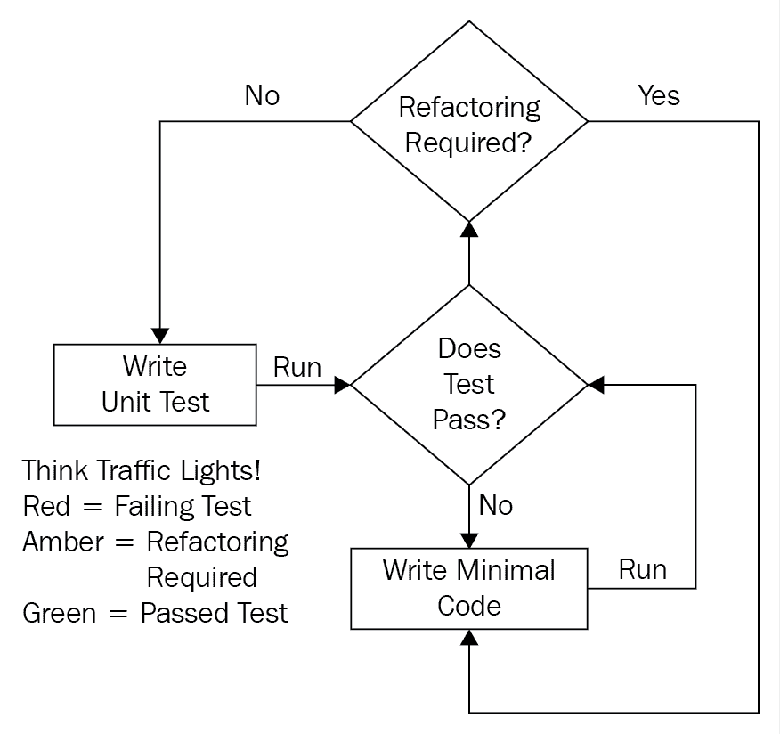
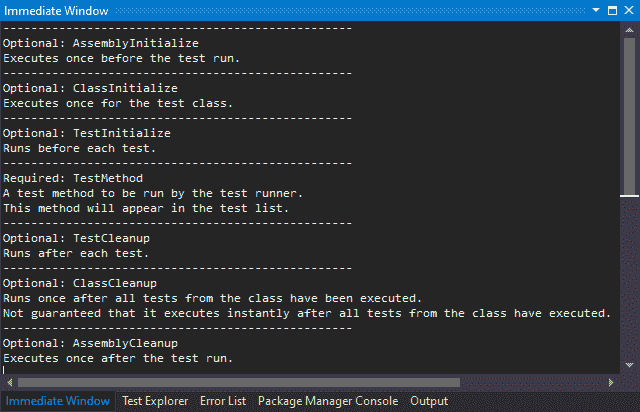
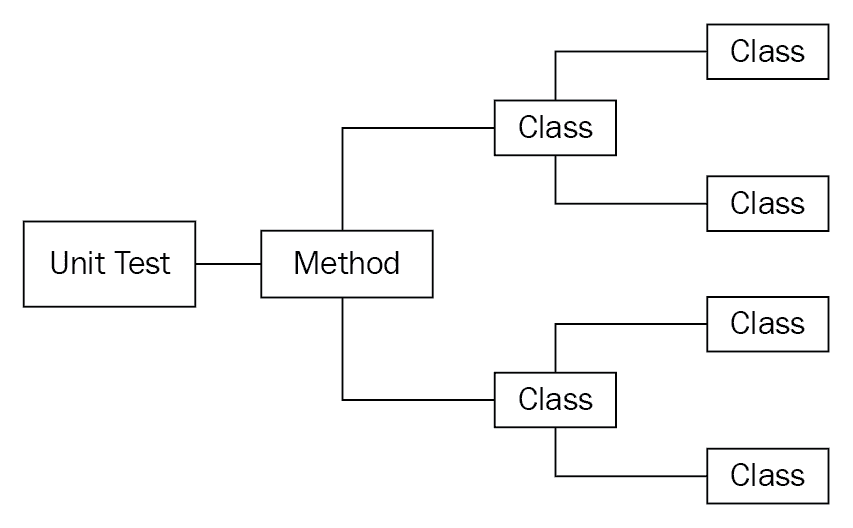
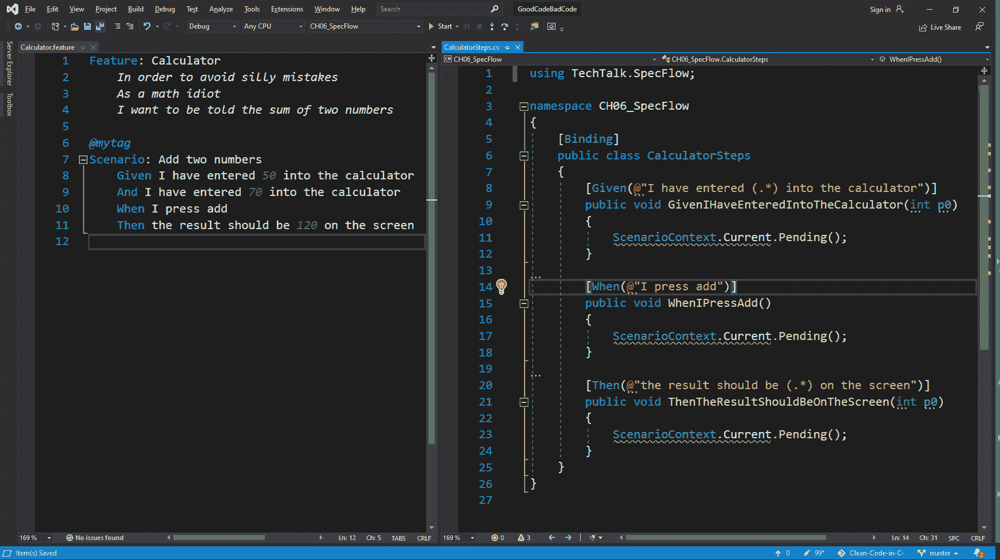

# 第六章：单元测试

之前，我们讨论了异常处理，如何正确实施以及在问题发生时对客户和程序员有何用处。在本章中，我们将看看程序员如何实施他们自己的质量保证（QA），以提供健壮的、不太可能在生产中产生异常的优质代码。

我们首先看看为什么应该测试我们自己的代码，以及什么样的测试才算是好测试。然后，我们看看 C#程序员可以使用的几种测试工具。然后，我们转向单元测试的三大支柱：失败、通过和重构。最后，我们看看多余的单元测试以及为什么它们应该被删除。

在本章中，我们将涵盖以下主题：

+   理解好测试的原因

+   理解测试工具

+   TDD 方法实践-失败、通过和重构

+   删除多余的测试、注释和无用代码

到本章结束时，你将获得以下技能：

+   能够描述良好代码的好处

+   能够描述不进行单元测试可能带来的潜在负面影响

+   能够安装和使用 MSTest 来编写和运行单元测试

+   能够安装和使用 NUnit 来编写和运行单元测试

+   能够安装和使用 Moq 来编写虚假（模拟）对象

+   能够安装和使用 SpecFlow 来编写符合客户规范的软件

+   能够编写失败的测试，然后使其通过，然后进行任何必要的重构

# 技术要求

要访问本章的代码文件，你可以访问以下链接：[`github.com/PacktPublishing/Clean-Code-in-C-/tree/master/CH06`](https://github.com/PacktPublishing/Clean-Code-in-C-/tree/master/CH06)。

# 理解好测试的原因

作为程序员，如果你对一个你觉得有趣的新开发项目感到高度积极，那是很不错的。但是，如果你被叫去处理一个错误，那会非常令人沮丧。如果不是你的代码，你对代码背后的完整理解也不足，那情况会更糟。如果是你自己的代码，你会有那种“我在想什么？”的时刻！你越是被叫去处理现有代码的维护工作，你就越能体会到进行单元测试的必要性。随着这种认识的增长，你开始看到学习测试方法和技术（如测试驱动开发（TDD）和行为驱动开发（BDD））的真正好处。

当你在其他人的代码上担任维护程序员一段时间后，你会看到好的、坏的和丑陋的代码。这样的代码可以让你积极地学习，让你明白编程的更好方式是什么，以及为什么不应该这样做。糟糕的代码会让你大喊“不。就是不行！”丑陋的代码会让你眼睛发红，头脑麻木。

直接与客户打交道，为他们提供技术支持，你会看到良好的客户体验对业务成功有多么关键。相反，你也会看到糟糕的客户体验如何导致一些非常沮丧、愤怒和极其粗鲁的客户；以及由于客户退款和因社交媒体和评论网站上的恶劣客户抱怨而导致销售迅速流失的情况。

作为技术负责人，你有责任进行技术代码审查，以确保员工遵守公司的编码准则和政策，分类错误，并协助项目经理管理你负责领导的人员。作为技术负责人，高水平的项目管理、需求收集和分析、架构设计和清晰的编程是很重要的。你还需要具备良好的人际交往能力。

你的项目经理只关心按照业务需求按时按预算交付项目。他们真的不关心你如何编写软件，只关心你能否按时按约定预算完成工作。最重要的是，他们关心发布的软件是否完全符合业务要求——不多也不少——以及软件是否达到非常高的专业水准，因为代码的质量同样可以提升或摧毁公司品牌。当项目经理对你很苛刻时，你知道业务正在给他们施加更大的压力。这种压力会传递给你。

作为技术负责人，你处于项目经理和项目团队之间。在日常工作中，你将主持 Scrum 会议并处理问题。这些问题可能是编码人员需要分析人员的资源，测试人员等待开发人员修复错误，等等。但最困难的工作将是进行同行代码审查并提供建设性反馈，以达到期望的结果而不冒犯人。这就是为什么你应该非常认真地对待清晰的编码，因为如果你批评一个人的代码，如果你自己的代码不合格，你就会招致反弹。此外，如果软件测试失败或出现大量错误，你将成为项目经理的责骂对象。

因此，作为技术负责人，鼓励 TDD 是一个好主意。最好的方法是*以身作则*。现在我知道，即使是受过学位教育和经验丰富的程序员也可能对 TDD 持保留态度。最常见的原因之一是学习和实践起来可能很困难，而且在代码变得更加复杂时，TDD 可能会显得更加耗时。我曾经从那些不喜欢单元测试的同事那里听到过这种反对意见。

但作为一个程序员，如果你想真正自信（一旦你编写了一段代码，你就能对其质量有信心，并且不会被退回来修复自己的错误），那么 TDD 是提升自己作为程序员水平的绝佳方式。当你学会在开始编程之前先进行测试，这很快就会成为*习惯性*。作为程序员，这样的习惯对你非常有用和有益，尤其是当你需要找新工作时，因为许多就业机会都在招聘具有 TDD 或 BDD 经验的人。

在编写代码时需要考虑的另一件事是，简单的、非关键的记事应用中的错误并不是世界末日。但如果你在国防或医疗领域工作呢？想象一下，一种大规模杀伤性武器被编程以朝特定方向击中敌方领土上的特定目标，但出现了问题，导致导弹瞄准了你盟友的平民人口。或者，想象一下，如果你的亲人因为医疗设备软件中的错误而处于危急生命支持状态，最终死亡，而这是你自己的错。然后，再想想，如果一架载有乘客的客机上的安全软件出现问题，导致飞机坠毁在人口密集区，造成机上和地面的人员伤亡，会发生什么？

软件越关键，就越需要认真对待单元测试技术（如 TDD 和 BDD）。我们将在本章后面讨论 BDD 和 TDD 工具。在编写软件时，想象一下如果你是客户，如果你编写的代码出现问题，你会受到什么影响。这会如何影响你的家人、朋友和同事？此外，想想如果你对关键故障负责的话，会有哪些道德和法律责任。

作为程序员，了解为什么应该学会测试自己的代码是很重要的。他们说“程序员永远不应该测试自己的代码”是对的。但这只适用于代码已经完成并准备好进入生产测试之前的情况。因此，在代码仍在编程过程中，程序员应该始终测试自己的代码。然而，一些企业时间非常紧迫，以至于适当的质量保证经常被牺牲，以便企业能够率先上市。

对于企业来说，率先上市可能非常重要，但第一印象至关重要。如果一个企业率先上市，而产品存在严重缺陷并被全球广播，这可能会对企业产生长期的负面影响。因此，作为程序员，你必须非常谨慎，并尽力确保如果软件存在缺陷，你不是责任人。当企业出现问题时，责任人将会受到惩罚。在不粘锅管理中，管理人员会把推动荒谬的截止日期的罪责从自己身上转嫁到不得不满足截止日期并做出牺牲的程序员身上。

因此，作为程序员，你测试自己的代码并经常测试是非常重要的，特别是在将其发布给测试团队之前。这就是为什么你被积极鼓励过渡到根据你当前正在实施的规范编写你的测试的思维方式和习惯行为。你的测试应该一开始就失败。然后你只需编写足够的代码来使测试通过，然后根据需要重构你的代码。

开始使用 TDD 或 BDD 可能很困难。但一旦掌握了，TDD 和 BDD 就会变得很自然。你可能会发现，从长远来看，你留下的代码更加清晰易读，易于维护。你可能还会发现，你对修改代码而不破坏它的能力也大大提高了。显然，从某种意义上来说，代码更多了，因为你有生产方法和测试方法。但实际上，你可能会写更少的代码，因为你不会添加你认为可能需要的额外代码！

想象一下自己坐在电脑前，手头有一份软件规范需要翻译成可运行的软件。许多程序员有一个坏习惯，我过去也曾犯过，那就是他们直接开始编码，而没有进行任何真正的设计工作。根据我的经验，这实际上会延长开发代码的时间，并经常导致更多的错误和难以维护和扩展的代码。事实上，尽管对一些程序员来说似乎违反直觉，但适当的规划和设计实际上会加快编码速度，特别是考虑到维护和扩展。

这就是测试团队的作用。在我们进一步讨论之前，让我们描述一下用例、测试设计、测试用例和测试套件，以及它们之间的关系。

用例解释了单个操作的流程，比如添加客户记录。测试设计将包括一个或多个测试用例，用于测试单个用例可能发生的不同情景。测试用例可以手动进行，也可以是由测试套件执行的自动化测试。测试套件是用于发现和运行测试并向最终用户报告结果的软件。编写用例将是业务分析师的角色。至于测试设计、测试用例和测试套件，这将是专门的测试团队的责任。开发人员无需担心编写用例、测试设计或测试用例，并在测试套件中执行它们。开发人员必须专注于编写和使用他们的单元测试来编写失败的代码，然后运行，并根据需要进行重构。

软件测试人员与程序员合作。这种合作通常从项目开始时开始，并持续到最后。开发团队和测试团队将通过共享每个产品待办事项的测试用例来合作。这个过程通常包括编写测试用例。为了通过测试，它们必须满足测试标准。这些测试用例通常将使用手动测试和一些测试套件自动化的组合来运行。

在开发阶段，测试人员编写他们的 QA 测试，开发人员编写他们的单元测试。当开发人员将他们的代码提交给测试团队时，测试团队将运行他们的一系列测试。这些测试的结果将反馈给开发人员和项目利益相关者。如果遇到问题，这被称为技术债务。开发团队将不得不考虑解决测试团队提出的问题所需的时间。当测试团队确认软件已经达到所需的质量水平时，代码将被传递给基础设施以发布到生产环境中。

假设我们正在启动一个全新的项目（也称为绿地项目），我们将选择适当的项目类型并选中包括测试项目的选项。这将创建一个解决方案，包括我们的主要项目和测试项目。

我们创建的项目类型和要实施的项目特性将取决于用例。用例在系统分析期间用于识别、确认和组织软件需求。从用例中，测试用例可以分配给验收标准。作为程序员，您可以使用这些用例及其测试用例来为每个测试用例编写自己的单元测试。然后，您的测试将作为测试套件的一部分运行。在 Visual Studio 2019 中，您可以从“视图|测试资源管理器”菜单中访问测试资源管理器。当您构建项目时，将会发现测试。发现测试后，它们将在测试资源管理器中显示。然后，您可以在测试资源管理器中运行和/或调试您的测试。

值得注意的是，在这个阶段，设计测试并提出适当数量的测试用例将是测试人员的责任，而不是开发人员的责任。一旦软件离开开发人员的手，他们还负责 QA。但是，单元测试代码的责任仍然是开发人员的责任，这就是测试用例可以在编写代码的单元测试中提供真正帮助和动力的地方。

创建解决方案时，您要做的第一件事是打开提供的测试类。在该测试类中，您编写必须完成的伪代码。然后，您逐步执行伪代码，并添加测试方法，测试必须完成的每个步骤，以便达到完成软件项目的目标。您编写的每个测试方法都是为了失败。然后，您只需编写足够的代码来通过测试。然后，一旦测试通过，您就可以在进行下一个测试之前重构代码。因此，您可以看到，单元测试并不是什么高深的科学。但是，编写一个好的单元测试需要什么呢？

任何正在测试中的代码都应该提供特定的功能。一个功能接受输入并产生输出。

在正常运行的计算机程序中，一个方法（或函数）将具有*可接受*范围的输入和输出，以及*不可接受*范围的输入和输出。因此，完美的单元测试将测试最低可接受值，最高可接受值，并提供超出可接受值范围的测试用例，无论高低。

单元测试必须是原子的，这意味着它们只能测试一件事。由于方法可以在同一个类中链接在一起，甚至可以跨多个程序集中的多个类进行链接，因此为了保持它们的原子性，通常有必要为受测试的类提供虚假或模拟对象。输出必须确定它是通过还是失败。良好的单元测试绝对不能是不确定的。

测试的结果应该是可重复的，即在特定条件下，它要么总是通过，要么总是失败。也就是说，同一个测试一遍又一遍地运行时，每次运行都不应该有不同的结果。如果有的话，那么它就不是可重复的。单元测试不应该依赖于其他测试在它们之前运行，并且它们应该与其他方法和类隔离开来。您还应该力求使单元测试在毫秒内运行。任何需要一秒或更长时间才能运行的测试都太长了。如果代码运行时间超过一秒，那么您应该考虑重构或实现一个用于测试的模拟对象。由于我们是忙碌的程序员，单元测试应该易于设置，不需要大量编码或配置。以下图表显示了单元测试的生命周期：



在本章中，我们将编写单元测试和模拟对象。但在此之前，我们需要了解一些作为 C#程序员可用的工具。

# 理解测试工具

我们将在 Visual Studio 中查看的测试工具有**MSTest**、**NUnit**、**Moq**和**SpecFlow**。每个测试工具都会创建一个控制台应用程序和相关的测试项目。NUnit 和 MSTest 是单元测试框架。NUnit 比 MSTest 早得多，因此与 MSTest 相比，它具有更成熟和功能齐全的 API。我个人更喜欢 NUnit 而不是 MSTest。

Moq 与 MSTest 和 NUnit 不同，因为它不是一个测试框架，而是一个模拟框架。模拟框架会用虚拟（假的）实现替换项目中的真实类，用于测试目的。您可以将 Moq 与 MSTest 或 NUnit 一起使用。最后，SpecFlow 是一个 BDD 框架。您首先使用用户和技术人员都能理解的业务语言在一个特性文件中编写一个特性。然后为该特性生成一个步骤文件。步骤文件包含实现该特性所需的方法作为步骤。

通过本章结束时，您将了解每个工具的作用，并能够在自己的项目中使用它们。因此，让我们开始看看 MSTest。

## MSTest

在本节中，我们将安装和配置 MSTest 框架。我们将编写一个带有测试方法并初始化的测试类。我们将执行程序集设置和清理、类清理和方法清理，并进行断言。

要在 Visual Studio 的命令行中安装 MSTest 框架，您需要通过 Tools | NuGet Package Manager | Package Manager Console 打开 Package Manager Console：


然后，运行以下三个命令来安装 MSTest 框架：

```cs
install-package mstest.testframework
install-package mstest.testadapter
install-package microsoft.net.tests.sdk
```

或者，您可以添加一个新项目，并在 Solution Explorer 的 Context | Add 菜单中选择 Unit Test Project (.NET Framework)。请参阅以下截图。在命名测试项目时，接受的标准是以`<ProjectName>.Tests`的形式。这有助于将它们与测试关联起来，并将它们与受测试的项目区分开来：


以下代码是在将 MSTest 项目添加到解决方案时生成的默认单元测试代码。正如您所看到的，该类导入了`Microsoft.VisualStudio.TestTools.UnitTesting`命名空间。`[TestClass]`属性标识 MS 测试框架，该类是一个测试类。`[TestMethod]`属性标记该方法为测试方法。所有具有`[TestMethod]`属性的类都将出现在测试播放器中。`[TestClass]`和`[TestMethod]`属性是强制性的：

```cs
using Microsoft.VisualStudio.TestTools.UnitTesting;

namespace CH05_MSTestUnitTesting.Tests
{
    [TestClass]
    public class UnitTest1
    {
        [TestMethod]
        public void TestMethod1()
        {
        }
    }
}
```

还有其他方法和属性可以选择组合以生成完整的测试执行工作流程。这些包括`[AssemblyInitialize]`、`[AssemblyCleanup]`、`[ClassInitialize]`、`[ClassCleanup]`、`[TestInitialize]`和`[TestCleanup]`。正如它们的名称所暗示的那样，初始化属性用于在运行测试之前在程序集、类和方法级别执行任何初始化。同样，清理属性在测试运行后在方法、类和程序集级别执行以执行任何必要的清理操作。我们将依次查看每个属性，并在运行最终代码时将它们添加到您的项目中，以便了解它们的执行顺序。

`WriteSeparatorLine()`方法是一个辅助方法，用于分隔我们的测试方法输出。这将帮助我们更容易地跟踪我们的测试类中发生的情况：

```cs
private static void WriteSeparatorLine()
{
    Debug.WriteLine("--------------------------------------------------");
}
```

可选地，分配`[AssemblyInitialize]`属性以在执行测试之前执行代码：

```cs
[AssemblyInitialize]
public static void AssemblyInit(TestContext context)
{
    WriteSeparatorLine();
    Debug.WriteLine("Optional: AssemblyInitialize");
    Debug.WriteLine("Executes once before the test run.");
}
```

然后，您可以选择分配`[ClassInitialize]`属性以在执行测试之前执行一次代码：

```cs
[ClassInitialize]
public static void TestFixtureSetup(TestContext context)
{
    WriteSeparatorLine();
    Console.WriteLine("Optional: ClassInitialize");
    Console.WriteLine("Executes once for the test class.");
}
```

然后，通过将`[TestInitialize]`属性分配给设置方法，在每个单元测试之前运行设置代码：

```cs
[TestInitialize]
public void Setup()
{
    WriteSeparatorLine();
    Debug.WriteLine("Optional: TestInitialize");
    Debug.WriteLine("Runs before each test.");
}
```

当您完成测试运行后，可以选择分配`[AssemblyCleanup]`属性以执行任何必要的清理操作：

```cs
[AssemblyCleanup]
public static void AssemblyCleanup()
{
    WriteSeparatorLine();
    Debug.WriteLine("Optional: AssemblyCleanup");
    Debug.WriteLine("Executes once after the test run.");
}
```

标记为`[ClassCleanup]`的可选方法在类中的所有测试执行后运行一次。您无法保证此方法何时运行，因为它可能不会立即在所有测试执行后运行：

```cs
[ClassCleanup]
public static void TestFixtureTearDown()
{
    WriteSeparatorLine();
    Debug.WriteLine("Optional: ClassCleanup");
    Debug.WriteLine("Runs once after all tests in the class have been 
     executed.");
    Debug.WriteLine("Not guaranteed that it executes instantly after all 
     tests the class have executed.");
}
```

在每个测试运行后执行清理操作，将`[TestCleanup]`属性应用于测试清理方法：

```cs
[TestCleanup]
public void TearDown()
{
    WriteSeparatorLine();
    Debug.WriteLine("Optional: TestCleanup");
    Debug.WriteLine("Runs after each test.");
    Assert.Fail();
}
```

现在我们的代码已经就位，构建它。然后，从“测试”菜单中，选择“测试资源管理器”。您应该在测试资源管理器中看到以下测试。正如您从以下截图中所看到的，该测试尚未运行：


因此，让我们运行我们唯一的测试。哦不！我们的测试失败了，如下截图所示：


按照下面的片段中所示更新`TestMethod1()`代码，然后再次运行测试：

```cs
[TestMethod]
public void TestMethod1()
{
    WriteSeparatorLine();
    Debug.WriteLine("Required: TestMethod");
    Debug.WriteLine("A test method to be run by the test runner.");
    Debug.WriteLine("This method will appear in the test list.");
    Assert.IsTrue(true);
}
```

您可以看到测试在测试资源管理器中已通过，如下截图所示：


因此，从先前的截图中，您可以看到尚未执行的测试为*蓝色*，失败的测试为*红色*，通过的测试为*绿色*。从“工具”|“选项”|“调试”|“常规”，选择将所有输出窗口文本重定向到“立即窗口”。然后，选择“运行”|“调试所有测试”。

当您运行测试并将输出打印到“立即窗口”时，将清楚地看到属性的执行顺序。以下截图显示了我们测试方法的输出：



正如您已经看到的，我们使用了两个`Assert`方法——`Assert.Fail()`和`Assert.IsTrue(true)`。`Assert`类非常有用，因此了解单元测试类中可用的方法是很值得的。这些可用的方法列在下面并进行描述：

| **方法** | **描述** |
| --- | --- |
| `Assert.AreEqual()` | 测试指定的值是否相等，并在两个值不相等时引发异常。 |
| `Assert.AreNotEqual()` | 测试指定的值是否不相等，并在两个值相等时引发异常。 |
| `Assert.ArtNotSame()` | 测试指定的对象是否引用不同的对象，并在两个输入引用相同对象时引发异常。 |
| `Assert.AreSame()` | 测试指定的对象是否都引用同一个对象，并在两个输入不引用相同对象时引发异常。 |
| `Assert.Equals()` | 此对象将始终使用`Assert.Fail`抛出异常。因此，我们可以使用`Assert.AreEqual`代替。 |
| `Assert.Fail()` | 抛出`AssertFailedException`异常。 |
| `Assert.Inconclusive()` | 抛出`AssertInconclusiveException`异常。 |
| `Assert.IsFalse()` | 测试指定的条件是否为假，并在条件为真时引发异常。 |
| `Assert.IsInstanceOfType()` | 测试指定的对象是否是预期类型的实例，并在预期类型不在对象的继承层次结构中时引发异常。 |
| `Assert.IsNotInstanceOfType()` | 测试指定的对象是否是错误类型的实例，并在指定类型在对象的继承层次结构中时引发异常。 |
| `Assert.IsNotNull()` | 测试指定的对象是否非 null，并在其为 null 时引发异常。 |
| `Assert.IsNull()` | 测试指定的对象是否为 null，并在其不为 null 时引发异常。 |
| `Assert.IsTrue()` | 测试指定的条件是否为真，并在条件为假时引发异常。 |
| `Assert.ReferenceEquals()` | 确定指定的对象实例是否是同一个实例。 |
| `Assert.ReplaceNullChars()` | 用"`\\0`"替换空字符（`'\0'`）。 |
| `Assert.That()` | 获取`Assert`功能的单例实例。 |
| `Assert.ThrowsException()` | 测试由委托操作指定的代码是否引发了类型为`T`的给定异常（而不是派生类型），如果代码没有引发异常，或引发了除`T`之外的类型的异常，则引发`AssertFailedException`。简而言之，这需要一个委托，并断言它引发了带有预期消息的预期异常。 |
| `Assert.ThrowsExceptionAsync()` | 测试由委托操作指定的代码是否引发了类型为`T`的给定异常（而不是派生类型），如果代码没有引发异常，或引发了除`T`之外的类型的异常，则引发`AssertFailedException`。 |

现在我们已经看过了 MSTest，是时候看看 NUnit 了。

## NUnit

如果在 Visual Studio 中未安装 NUnit，则可以通过 Extensions | Manage Extensions 下载并安装它。之后，创建一个新的 NUnit 测试项目（.NET Core）。以下代码包含了 NUnit 创建的默认类，名为`Tests`：

```cs
public class Tests
{
    [SetUp]
    public void Setup()
    {
    }

    [Test]
    public void Test1()
    {
        Assert.Pass();
    }
}
```

从`Test1`方法中可以看出，测试方法也使用了`Assert`类，就像 MSTest 用于测试代码断言一样。 NUnit Assert 类为我们提供了以下方法（请注意，以下表中标记为[NUnit]的方法是特定于 NUnit 的；其他所有方法也存在于 MSTest 中）：

| **方法** | **描述** |
| --- | --- |
| `Assert.AreEqual()` | 验证两个项是否相等。如果它们不相等，则引发异常。 |
| `Assert.AreNotEqual()` | 验证两个项是否不相等。如果它们相等，则引发异常。 |
| `Assert.AreNotSame()` | 验证两个对象是否不引用同一个对象。如果是，则引发异常。 |
| `Assert.AreSame()` | 验证两个对象是否引用同一个对象。如果不是，则引发异常。 |
| `Assert.ByVal()` | [NUnit] 对实际值应用约束，如果约束满足则成功，并在失败时引发断言异常。在私有 setter 导致 Visual Basic 编译错误的罕见情况下，用作`That`的同义词。 |
| `Assert.Catch()` | [NUnit] 验证委托在调用时是否抛出异常，并返回该异常。 |
| `Assert.Contains()` | [NUnit] 验证值是否包含在集合中。 |
| `Assert.DoesNotThrow()` | [NUnit] 验证方法是否不会抛出异常。 |
| `Assert.Equal()` | [NUnit] 不要使用。请改用`Assert.AreEqual()`。 |
| `Assert.Fail()` | 抛出`AssertionException`。 |
| `Assert.False()` | [NUnit] 验证条件是否为假。如果条件为真，则抛出异常。 |
| `Assert.Greater()` | [NUnit] 验证第一个值是否大于第二个值。如果不是，则抛出异常。 |
| `Assert.GreaterOrEqual()` | [NUnit] 验证第一个值是否大于或等于第二个值。如果不是，则抛出异常。 |
| `Assert.Ignore()` | [NUnit] 抛出带有传入消息和参数的`IgnoreException`。这会导致测试被报告为被忽略。 |
| `Assert.Inconclusive()` | 抛出带有传入消息和参数的`InconclusiveException`。这会导致测试被报告为不确定。 |
| `Assert.IsAssignableFrom()` | [NUnit] 验证对象是否可以分配给给定类型的值。 |
| `Assert.IsEmpty()` | [NUnit] 验证值（如字符串或集合）是否为空。 |
| `Assert.IsFalse()` | 验证条件是否为假。如果为真，则抛出异常。 |
| `Assert.IsInstanceOf()` | [NUnit] 验证对象是否是给定类型的实例。 |
| `Assert.NAN()` | [NUnit] 验证值是否不是一个数字。如果是，则抛出异常。 |
| `Assert.IsNotAssignableFrom()` | [NUnit] 验证对象是否不可从给定类型分配。 |
| `Assert.IsNotEmpty()` | [NUnit] 验证字符串或集合是否不为空。 |
| `Asserts.IsNotInstanceOf()` | [NUnit] 验证对象不是给定类型的实例。 |
| `Assert.InNotNull()` | 验证对象是否不为 null。如果为 null，则抛出异常。 |
| `Assert.IsNull()` | 验证对象是否为 null。如果不是，则抛出异常。 |
| `Assert.IsTrue()` | 验证条件是否为真。如果为假，则抛出异常。 |
| `Assert.Less()` | [NUnit] 验证第一个值是否小于第二个值。如果不是，则抛出异常。 |
| `Assert.LessOrEqual()` | [NUnit] 验证第一个值是否小于或等于第二个值。如果不是，则抛出异常。 |
| `Assert.Multiple()` | [NUnit] 包装包含一系列断言的代码，应该全部执行，即使它们失败。失败的结果将被保存，并在代码块结束时报告。 |
| `Assert.Negative()` | [NUnit] 验证数字是否为负数。如果不是，则抛出异常。 |
| `Assert.NotNull()` | [NUnit] 验证对象是否不为 null。如果为 null，则抛出异常。 |
| `Assert.NotZero()` | [NUnit] 验证数字是否不为零。如果为零，则抛出异常。 |
| `Assert.Null()` | [NUnit] 验证对象是否为 null。如果不是，则抛出异常。 |
| `Assert.Pass()` | [NUnit] 抛出带有传入消息和参数的`SuccessException`。这允许测试被提前结束，并将成功结果返回给 NUnit。 |
| `Assert.Positive()` | [NUnit] 验证数字是否为正数。 |
| `Assert.ReferenceEquals()` | [NUnit] 不要使用。抛出`InvalidOperationException`。 |
| `Assert.That()` | 验证条件是否为真。如果不是，则抛出异常。 |
| `Assert.Throws()` | 验证委托在调用时是否抛出特定异常。 |
| `Assert.True()` | [NUnit] 验证条件是否为真。如果不是，则调用异常。 |
| `Assert.Warn()` | [NUnit] 使用提供的消息和参数发出警告。 |
| `Assert.Zero()` | [NUnit] 验证数字是否为零。 |

NUnit 的生命周期始于`TestFixtureSetup`，在第一个测试`SetUp`之前执行。然后，在每个测试之前执行`SetUp`。每个测试执行完毕后，执行`TearDown`。最后，在最后一个测试`TearDown`之后执行`TestFixtureTearDown`。我们现在将更新`Tests`类，以便我们可以调试并看到 NUnit 的生命周期在运行中：

```cs
using System;
using System.Diagnostics;
using NUnit.Framework;

namespace CH06_NUnitUnitTesting.Tests
{
    [TestFixture]
    public class Tests : IDisposable
    {
        public TestClass()
        {
            WriteSeparatorLine();
            Debug.WriteLine("Constructor");
        }

        public void Dispose()
        {
            WriteSeparatorLine();
            Debug.WriteLine("Dispose"); 
        } 
    }
}
```

我们已经在类中添加了`[TestFixture]`并实现了`IDisposable`接口。`[TextFixture]`属性对于非参数化和非泛型的夹具是可选的。只要至少有一个方法被标记为`[Test]`、`[TestCase]`或`[TestCaseSource]`属性，类就会被视为`[TextFixture]`。

`WriteSeparatorLine()`方法作为我们调试输出的分隔符。这个方法将在`Tests`类中所有方法的顶部调用：

```cs
private static void WriteSeparatorLine()
{
 Debug.WriteLine("--------------------------------------------------");
}
```

标有`[OneTimeSetUp]`属性的方法将在该类中的任何测试运行之前运行一次。这里将执行所有不同测试所需的任何初始化：

```cs
[OneTimeSetUp]
public void OneTimeSetup()
{
    WriteSeparatorLine();
    Debug.WriteLine("OneTimeSetUp");
    Debug.WriteLine("This method is run once before any tests in this 
     class are run.");
}
```

标有`[OneTimeTearDown]`属性的方法在所有测试运行后运行一次，并在类被处理之前运行：

```cs
[OneTimeTearDown]
public void OneTimeTearDown()
{
    WriteSeparatorLine();
    Debug.WriteLine("OneTimeTearDown");
    Debug.WriteLine("This method is run once after all tests in this 
    class have been run.");
    Debug.WriteLine("This method runs even when an exception occurs.");
}
```

标有`[Setup]`属性的方法在每个测试方法之前运行一次：

```cs
[SetUp]
public void Setup()
{
    WriteSeparatorLine();
    Debug.WriteLine("Setup");
    Debug.WriteLine("This method is run before each test method is run.");
}
```

标有`[TearDown]`属性的方法在每个测试方法完成后运行一次：

```cs
[TearDown]
public void Teardown()
{
    WriteSeparatorLine();
    Debug.WriteLine("Teardown");
    Debug.WriteLine("This method is run after each test method 
     has been run.");
    Debug.WriteLine("This method runs even when an exception occurs.");
}
```

`Test2()`方法是一个测试方法，由`[Test]`属性表示，并且将作为第二个测试方法运行，由`[Order(1)]`属性确定。这个方法抛出`InconclusiveException`：

```cs
  [Test]
  [Order(1)]
  public void Test2()
  {
      WriteSeparatorLine();
      Debug.WriteLine("Test:Test2");
      Debug.WriteLine("Order: 1");
      Assert.Inconclusive("Test 2 is inconclusive.");
  }
```

`Test1()`方法是一个测试方法，由`[Test]`属性表示，并且将作为第一个测试方法运行，由`[0rder(0)]`属性确定。这个方法通过`SuccessException`：

```cs
[Test]
[Order(0)]
public void Test1()
{
    WriteSeparatorLine();
    Debug.WriteLine("Test:Test1");
    Debug.WriteLine("Order: 0");
    Assert.Pass("Test 1 passed with flying colours.");
}
```

`Test3()`方法是一个测试方法，由`[Test]`属性表示，并且将作为第三个测试方法运行，由`[Order(2)]`属性确定。这个方法抛出`AssertionException`：

```cs
[Test]
[Order(2)]
public void Test3()
{
    WriteSeparatorLine();
    Debug.WriteLine("Test:Test3");
    Debug.WriteLine("Order: 2");
    Assert.Fail("Test 1 failed dismally.");
}
```

当你调试所有测试时，你的立即窗口应该看起来像下面的截图：


你现在已经接触过 MSTest 和 NUnit，并且已经看到了每个框架的测试生命周期。现在是时候看一下 Moq 了。

从 NUnit 方法表和 MSTest 方法表的比较中可以看出，NUnit 可以实现更精细的单元测试，执行性能更好，因此比 MSTest 更广泛地使用。

## Moq

单元测试应该只测试被测试的方法。参见下图。如果被测试的方法调用其他方法，这些方法可以是当前类中的方法，也可以是不同类中的方法，那么不仅测试方法，其他方法也会被测试：



克服这个问题的一种方法是使用模拟（虚假）对象。模拟对象只会测试你想要测试的方法，你可以让模拟对象按你想要的方式工作。如果你要编写自己的模拟对象，你很快就会意识到这需要大量的工作。这在时间敏感的项目中可能是不可接受的，而且你的代码变得越复杂，你的模拟对象也变得越复杂。

你最终会放弃这个糟糕的工作，或者你会寻找一个适合你需求的模拟框架。Rhino Mocks 和 Moq 是.NET Framework 的两个模拟框架。在本章中，我们只会看 Moq，它比 Rhino Mocks 更容易学习和使用。有关 Rhino Mocks 的更多信息，请访问[`hibernatingrhinos.com/oss/rhino-mocks`](http://hibernatingrhinos.com/oss/rhino-mocks)。

在使用 Moq 进行测试时，我们首先添加模拟对象，然后配置模拟对象执行某些操作。然后我们断言配置是否起作用，并且模拟对象是否被调用。这些步骤使我们能够确定模拟对象是否正确设置。Moq 只生成测试替身。它不测试代码。您仍然需要一个像 NUnit 这样的测试框架来测试您的代码。

我们现在将看一个使用 Moq 和 NUnit 的例子。

创建一个新的控制台应用程序，命名为`CH06_Moq`。添加以下接口和类——`IFoo`、`Bar`、`Baz`和`UnitTests`。然后，通过 Nuget 包管理器，安装 Moq、NUnit 和 NUnit3TestAdapter。使用以下代码更新`Bar`类：

```cs
namespace CH06_Moq
{
    public class Bar
    {
        public virtual Baz Baz { get; set; }
        public virtual bool Submit() { return false; }
    }
}
```

`Bar`类有一个虚拟属性，类型为`Baz`，以及一个名为`Submit()`的虚拟方法，返回值为`false`。现在按照以下方式更新`Baz`类：

```cs
namespace CH06_Moq
{
    public class Baz
    {
        public virtual string Name { get; set; }
    }
}
```

`Baz`类有一个名为`Name`的单个虚拟属性，类型为字符串。修改`IFoo`文件，包含以下源代码：

```cs
namespace CH06_Moq
{
    public interface IFoo
    {
        Bar Bar { get; set; }
        string Name { get; set; }
        int Value { get; set; }
        bool DoSomething(string value);
        bool DoSomething(int number, string value);
        string DoSomethingStringy(string value);
        bool TryParse(string value, out string outputValue);
        bool Submit(ref Bar bar);
        int GetCount();
        bool Add(int value);
    }
}
```

`IFoo`接口有许多属性和方法。正如您所看到的，该接口引用了`Bar`类，我们知道`Bar`类包含对`Baz`类的引用。我们现在将开始更新我们的`UnitTests`类，使用 NUnit 和 Moq 测试我们新创建的接口和类。修改`UnitTests`类文件，使其看起来像下面的代码：

```cs
using Moq;
using NUnit.Framework;
using System;

namespace CH06_Moq
{
    [TestFixture]
    public class UnitTests
    {
    }
}
```

现在，添加`AssertThrows`方法，断言是否抛出了指定的异常：

```cs
public bool AssertThrows<TException>(
    Action action,
    Func<TException, bool> exceptionCondition = null
) where TException : Exception
    {
        try
        {
            action();
        }
        catch (TException ex)
        {
            if (exceptionCondition != null)
            {
                return exceptionCondition(ex);
            }
            return true;
        }
        catch
        {
            return false;
        }
        return false;
    }
```

`AssertThrows`方法是一个通用方法，如果您的方法抛出指定的异常，它将返回`true`，如果没有抛出异常，则返回`false`。在本章的后续测试异常时，我们将使用这个方法。现在，添加`DoSomethingReturnsTrue()`方法：

```cs
[Test]
public void DoSomethingReturnsTrue()
{
    var mock = new Mock<IFoo>();
    mock.Setup(foo => foo.DoSomething("ping")).Returns(true);
    Assert.IsTrue(mock.Object.DoSomething("ping"));
}
```

`DoSomethingReturnsTrue()`方法创建了`IFoo`接口的一个新的模拟实现。然后设置`DoSomething()`方法接受包含单词`"ping"`的字符串，并返回`true`。最后，该方法断言当`DoSomething()`方法被调用时，传入文本`"ping"`，方法返回值为`true`。我们现在将实现一个类似的测试方法，如果值为`"tracert"`，则返回`false`：

```cs
[Test]
public void DoSomethingReturnsFalse()
{
    var mock = new Mock<IFoo>();
    mock.Setup(foo => foo.DoSomething("tracert")).Returns(false);
    Assert.IsFalse(mock.Object.DoSomething("tracert"));
}
```

`DoSomethingReturnsFalse()`方法遵循与`DoSomethingReturnsFalse()`方法相同的过程。我们创建一个`IFoo`接口的模拟对象，设置它在参数值为`"tracert"`时返回`false`，然后断言参数值为`"tracert"`时返回`false`。接下来，我们将测试我们的参数：

```cs
[Test]
public void OutArguments()
{
    var mock = new Mock<IFoo>();
    var outString = "ack";
    mock.Setup(foo => foo.TryParse("ping", out outString)).Returns(true);
    Assert.AreEqual("ack", outString);
    Assert.IsTrue(mock.Object.TryParse("ping", out outString));
}
```

`OutArguments()`方法创建了`IFoo`接口的一个实现。然后声明一个将用作输出参数的字符串，并赋值为`"ack"`。接下来，设置`IFoo`模拟对象的`TryParse()`方法，对输入值`"ping"`返回`true`，并输出字符串值`"ack"`。然后我们断言`outString`等于值`"ack"`。最后的检查断言`TryParse()`对输入值`"ping"`返回`true`：

```cs
[Test]
public void RefArguments()
{
    var instance = new Bar();
    var mock = new Mock<IFoo>();
    mock.Setup(foo => foo.Submit(ref instance)).Returns(true);
    Assert.AreEqual(true, mock.Object.Submit(ref instance));
}
```

`RefArguments()`方法创建了`Bar`类的一个实例。然后，创建了`IFoo`接口的一个模拟实现。然后设置`Submit()`方法，如果传入的引用类型是`Bar`类型，则返回`true`。然后我们断言传入的参数是`Bar`类型的`true`。在我们的`AccessInvocationArguments()`测试方法中，我们创建了`IFoo`接口的一个新实现：

```cs
[Test]
public void AccessInvocationArguments()
{
    var mock = new Mock<IFoo>();
    mock.Setup(foo => foo.DoSomethingStringy(It.IsAny<string>()))
        .Returns((string s) => s.ToLower());
    Assert.AreEqual("i like oranges!", mock.Object.DoSomethingStringy("I LIKE ORANGES!"));
}
```

然后设置`DoSomethingStringy()`方法将输入转换为小写并返回。最后，我们断言返回的字符串是传入的字符串转换为小写后的字符串：

```cs
[Test]
public void ThrowingWhenInvokedWithSpecificParameters()
{
    var mock = new Mock<IFoo>();
    mock.Setup(foo => foo.DoSomething("reset"))
        .Throws<InvalidOperationException>();
    mock.Setup(foo => foo.DoSomething(""))
        .Throws(new ArgumentException("command"));
    Assert.IsTrue(
        AssertThrows<InvalidOperationException>(
            () => mock.Object.DoSomething("reset")
        )
    );
    Assert.IsTrue(
        AssertThrows<ArgumentException>(
            () => mock.Object.DoSomething("")
        )
    );
    Assert.Throws(
        Is.TypeOf<ArgumentException>()
          .And.Message.EqualTo("command"),
          () => mock.Object.DoSomething("")
    );
 }
```

在我们的最终测试方法`ThrowingWhenInvokedWithSpecificParameters()`中，我们创建了`IFoo`接口的一个模拟实现。然后配置`DoSomething()`方法，在传入值为`"reset"`时抛出`InvalidOperationException`。

当传入空字符串时，会抛出一个`ArgumentException`异常。然后我们断言当输入值为`"reset"`时会抛出`InvalidOperationException`。当输入值为空字符串时，我们断言会抛出`ArgumentException`，并断言`ArgumentException`的消息为`"command"`。

你已经看到了如何使用一个名为 Moq 的模拟框架来创建模拟对象，以使用 NUnit 测试你的代码。现在我们要看的最后一个工具是**SpecFlow**。SpecFlow 是一个 BDD 工具。

## SpecFlow

用户关注的行为测试是 BDD 的主要功能，这些测试是在编码之前编写的。BDD 是一种从 TDD 演变而来的软件开发方法。你可以从一系列特性开始 BDD。特性是用正式的商业语言编写的规范。这种语言可以被项目中的所有利益相关者理解。一旦特性被同意和生成，开发人员就需要为特性语句开发步骤定义。一旦步骤定义被创建，下一步就是创建外部项目来实现特性并添加引用。然后，步骤定义被扩展以实现特性的应用代码。

这种方法的一个好处是，作为程序员，你可以保证按照业务的要求交付成果，而不是按照你认为他们要求的交付成果。这可以为企业节省大量资金和时间。过去的历史表明，许多项目因为业务团队和编程团队之间对需要交付的内容缺乏清晰度而失败。BDD 有助于在开发新特性时减轻这种潜在风险。

在本章的这一部分中，我们将使用 BDD 软件开发方法来开发一个非常简单的计算器示例，使用 SpecFlow。

我们将首先编写一个特性文件，作为我们的规范和验收标准。然后我们将从特性文件中生成我们的步骤定义，以生成我们所需的方法。一旦我们的步骤定义生成了所需的方法，我们将为它们编写代码，以完成我们的特性。

创建一个新的类库，并添加以下包——NUnit、NUnit3TestAdapter、SpecFlow、SpecRun.SpecFlow 和 SpecFlow.NUnit。添加一个名为`Calculator`的新的 SpecFlow Feature 文件：

```cs
Feature: Calculator
  In order to avoid silly mistakes
  As a math idiot
  I want to be told the sum of two numbers

@mytag
Scenario: Add two numbers
  Given I have entered 50 into the calculator
  And I have entered 70 into the calculator
  When I press add
  Then the result should be 120 on the screen
```

在创建`Calculator.feature`文件时，上述文本会自动添加到文件中。因此，我们将使用这个作为我们学习使用 SpecFlow 进行 BDD 的起点。在撰写本文时，值得注意的是 SpecFlow 和 SpecMap 已被**Tricentis**收购。Tricentis 表示 SpecFlow、SpecFlow+和 SpecMap 都将保持免费，所以现在是学习和使用 SpecFlow 和 SpecMap 的好时机，如果你还没有这样做的话。

现在我们有了我们的特性文件，我们需要创建步骤定义，将我们的特性请求与我们的代码绑定。在代码编辑器中右键单击，会弹出上下文菜单。选择生成步骤定义。你应该会看到以下对话框：


为类名输入`CalculatorSteps`。点击生成按钮生成步骤定义并保存文件。打开`CalculatorSteps.cs`文件，你应该会看到以下代码：

```cs
using TechTalk.SpecFlow;

namespace CH06_SpecFlow
{
    [Binding]
    public class CalculatorSteps
    {
        [Given(@"I have entered (.*) into the calculator")]
        public void GivenIHaveEnteredIntoTheCalculator(int p0)
        {
            ScenarioContext.Current.Pending();
        }

        [When(@"I press add")]
        public void WhenIPressAdd()
        {
            ScenarioContext.Current.Pending();
        }

        [Then(@"the result should be (.*) on the screen")]
        public void ThenTheResultShouldBeOnTheScreen(int p0)
        {
            ScenarioContext.Current.Pending();
        }
    }
}
```

步骤文件的内容与特性文件的比较如下截图所示：



实现特性的代码必须在一个单独的文件中。创建一个新的类库，命名为`CH06_SpecFlow.Implementation`。然后，添加一个名为`Calculator.cs`的文件。在 SpecFlow 项目中添加对新创建的库的引用，并在`CalculatorSteps.cs`文件的顶部添加以下行：

```cs
private Calculator _calculator = new Calculator();
```

现在，我们可以扩展我们的步骤定义，以便它们实现应用程序代码。在`CalculatorSteps.cs`文件中，用数字替换所有的`p0`参数。这使参数要求更加*明确*。在`Calculate`类的顶部，添加两个名为`FirstNumber`和`SecondNumber`的公共属性，如下面的代码所示：

```cs
public int FirstNumber { get; set; }
public int SecondNumber { get; set; }
```

在`CalculatorSteps`类中，更新`GivenIHaveEnteredIntoTheCalculator()`方法如下：

```cs
[Given(@"I have entered (.*) into the calculator")]
public void GivenIHaveEnteredIntoTheCalculator(int number)
{
    calculator.FirstNumber = number;
}
```

现在，如果尚不存在，添加第二个方法`GivenIHaveAlsoEnteredIntoTheCalculator()`，并将`number`参数分配给计算器的第二个数字：

```cs
public void GivenIHaveAlsoEnteredIntoTheCalculator(int number)
{
    calculator.SecondNumber = number;
}
```

在`CalculatorSteps`类的顶部和任何步骤之前添加`private int result;`。将`Add()`方法添加到`Calculator`类中：

```cs
public int Add()
{
    return FirstNumber + SecondNumber;
}
```

现在，更新`CalculatorSteps`类中的`WhenIPressAdd()`方法，并用调用`Add()`方法的结果更新`result`变量：

```cs
[When(@"I press add")]
public void WhenIPressAdd()
{
    _result = _calculator.Add();
}
```

接下来，修改`ThenTheResultShouldBeOnTheScreen()`方法如下：

```cs
[Then(@"the result should be (.*) on the screen")]
public void ThenTheResultShouldBeOnTheScreen(int expectedResult)
{
    Assert.AreEqual(expectedResult, _result);
}
```

构建您的项目并运行测试。您应该看到测试通过。只编写了通过功能所需的代码，并且您的代码已通过测试。

您可以在[`specflow.org/docs/`](https://specflow.org/docs/)找到更多关于 SpecFlow 的信息。我们已经介绍了一些可用于开发和测试代码的工具。现在是时候看一个真正简单的例子，演示我们如何使用 TDD 进行编码。我们将首先编写失败的代码。然后，我们将编写足够的代码使测试通过。最后，我们将重构代码。

# TDD 方法实践-失败，通过和重构

在本节中，您将学习编写失败的测试。然后，您将学习编写足够的代码使测试通过，然后如果必要，您将执行任何需要进行的重构。

让我们深入了解 TDD 的实际例子之前，让我们考虑一下为什么我们需要 TDD。在前一节中，您看到了我们如何创建功能文件并从中生成步骤文件，以编写满足业务需求的代码。确保您的代码满足业务需求的另一种方法是使用 TDD。通过 TDD，您从一个失败的测试开始。然后，您只编写足够的代码使测试通过，并在需要时对新代码进行重构。这个过程重复进行，直到所有功能都被编码。

但是，*为什么*我们需要 TDD 呢？

业务软件规格是由与项目利益相关者合作设计新软件或对现有软件进行扩展和修改的业务分析师组合起来的。一些软件是关键的，不能出现错误。这样的软件包括处理私人和商业投资的金融系统；需要功能软件才能工作的医疗设备，包括关键的生命支持和扫描设备；交通管理和导航系统的交通信号软件；太空飞行系统；以及武器系统。

好的，但 TDD 在哪里适用呢？

好吧，你已经得到了编写软件规范的任务。你需要做的第一件事是创建你的项目。然后，你为你要实现的功能编写伪代码。然后，你继续为每个伪代码编写测试。测试失败。然后，你编写必要的代码使测试通过，然后根据需要重构你的代码。你正在编写经过充分测试和健壮的代码。你能够保证你的代码在隔离环境中按预期执行。如果你的代码是一个更大系统的组件，那么测试团队将负责测试你的代码的集成，而不是你。作为开发人员，你已经赢得了对代码的信心，可以将其发布给测试团队。如果测试团队发现了以前被忽视的用例，他们会与你分享。然后，你将编写进一步的测试并使其通过，然后将更新后的代码发布给他们。这种工作方式确保了代码的最高标准，并且可以信任它按照给定输入的预期输出进行工作。最后，TDD 使软件进展可衡量，这对经理来说是个好消息。

现在是我们进行 TDD 的小演示的时候了。在这个例子中，我们将使用 TDD 来开发一个简单的日志记录应用程序，可以处理内部异常，并将异常记录到一个带有时间戳的文本文件中。我们将编写程序并使测试通过。一旦我们编写了程序并使所有测试通过，然后我们将重构我们的代码，使其可重用和更易读，当然，我们将确保我们的测试仍然通过。

1.  创建一个新的控制台应用程序，并将其命名为`CH06_FailPassRefactor`。添加一个名为`UnitTests`的类，其中包含以下伪代码：

```cs
using NUnit.Framework;

namespace CH06_FailPassRefactor
{
    [TestFixture]
    public class UnitTests
    {
        // The PseudoCode.
        // [1] Call a method to log an exception.
        // [2] Build up the text to log including 
        // all inner exceptions.
        // [3] Write the text to a file with a timestamp.
    }
}
```

1.  我们将编写我们的第一个单元测试来满足条件`[1]`。在我们的单元测试中，我们将测试创建`Logger`变量，调用`Log()`方法，并通过测试。所以，让我们写代码：

```cs
// [1] Call a method to log an exception.
[Test]
public void LogException()
{
    var logger = new Logger();
    var logFileName = logger.Log(new ArgumentException("Argument cannot be null"));
    Assert.Pass();
}
```

这个测试不会运行，因为项目无法构建。这是因为`Logger`类不存在。因此，在项目中添加一个名为`Logger`的内部类。然后运行你的测试。构建仍然会*失败*，测试也不会运行，因为现在缺少`Log()`方法。所以让我们在`Logger`类中添加`Log()`方法。然后，我们将尝试再次运行我们的测试。这次，测试应该成功。

1.  在这个阶段，我们将执行任何必要的重构。但由于我们刚刚开始，没有需要重构的地方，所以我们可以继续进行下一个测试。

我们的代码生成日志消息并保存到磁盘的功能将包含私有成员。使用 NUnit，你不测试私有成员。这种思想是，如果你必须测试私有成员，那么你的代码肯定有问题。所以，我们将继续进行下一个单元测试，确定日志文件是否存在。在编写单元测试之前，我们将编写一个返回具有内部异常的异常的方法。我们将在我们的单元测试中将返回的异常传递给`Log()`方法：

```cs
private Exception GetException()
{
    return new Exception(
        "Exception: Main exception.",
        new Exception(
            "Exception: Inner Exception.",
            new Exception("Exception: Inner Exception Inner Exception")
        )
    );
}
```

1.  现在，我们已经有了`GetException()`方法，我们可以编写我们的单元测试来检查日志文件是否存在：

```cs
[Test]
public void CheckFileExists()
{
    var logger = new Logger();
    var logFile = logger.Log(GetException());
    FileAssert.Exists(logFile);
}
```

1.  如果我们构建我们的代码并运行`CheckFileExists()`测试，它将失败，所以我们需要编写代码使其成功。在`Logger`类中，将`private StringBuilder _stringBuilder;`添加到`Logger`类的顶部。然后，修改`Log()`方法，并在`Logger`类中添加以下方法：

```cs
private StringBuilder _stringBuilder;

public string Log(Exception ex)
{
    _stringBuilder = new StringBuilder();
    return SaveLog();
}

private string SaveLog()
{
    var fileName = $"LogFile{DateTime.UtcNow.GetHashCode()}.txt";
    var dir = Environment.GetFolderPath(Environment.SpecialFolder.MyDocuments);
    var file = $"{dir}\\{fileName}";
    return file;
}
```

1.  我们已经调用了`Log()`方法，并生成了一个日志文件。现在，我们只需要将文本记录到文件中。根据我们的伪代码，我们需要记录主异常和所有内部异常。让我们编写一个检查日志文件是否包含消息`"Exception: Inner Exception Inner Exception"`的测试：

```cs
[Test]
public void ContainsMessage()
{
    var logger = new Logger();
    var logFile = logger.Log(GetException());
    var msg = File.ReadAllText(logFile);
    Assert.IsTrue(msg.Contains("Exception: Inner Exception Inner Exception"));
}
```

1.  现在，我们知道测试将会失败，因为字符串生成器是*空的*，所以我们将在`Logger`类中添加一个方法，该方法将接受一个异常，记录消息，并检查异常是否有内部异常。如果有，那么它将使用参数`isInnerException`调用自身：

```cs
private void BuildExceptionMessage(Exception ex, bool isInnerException)
{
    if (isInnerException)
        _stringBuilder.Append("Inner Exception: ").AppendLine(ex.Message);
    else
        _stringBuilder.Append("Exception: ").AppendLine(ex.Message);
    if (ex.InnerException != null)
       BuildExceptionMessage(ex.InnerException, true);
}
```

1.  最后，更新`Logger`类的`Log()`方法以调用我们的`BuildExceptionMessage()`方法：

```cs
public string Log(Exception ex)
{
    _stringBuilder = new StringBuilder();
    _stringBuilder.AppendLine("-----------------------
      -----------------");
    BuildExceptionMessage(ex, false);
    _stringBuilder.AppendLine("-----------------------
      -----------------");
    return SaveLog();
}
```

现在我们所有的测试都通过了，我们有一个完全正常运行的程序，但是这里有一个重构的机会。名为`BuildExceptionMessage()`的方法是可以重复使用的候选方法，特别是在调试时非常有用，尤其是当您有一个带有内部异常的异常时，所以我们将把该方法移动到自己的方法中。请注意，`Log()`方法也正在构建要记录的文本的开头和结尾部分。

我们可以并且将把这个移到`BuildExceptionMessage()`方法中：

1.  创建一个新的类并将其命名为`Text`。在构造函数中添加一个私有的`StringBuilder`成员变量并对其进行实例化。然后，通过添加以下代码来更新类：

```cs
public string ExceptionMessage => _stringBuilder.ToString();

public void BuildExceptionMessage(Exception ex, bool isInnerException)
{
    if (isInnerException)
    {
        _stringBuilder.Append("Inner Exception: ").AppendLine(ex.Message);
    }
    else
    {
        _stringBuilder.AppendLine("--------------------------------------------------------------");
        _stringBuilder.Append("Exception: ").AppendLine(ex.Message);
    }
    if (ex.InnerException != null)
        BuildExceptionMessage(ex.InnerException, true);
    else
        _stringBuilder.AppendLine("--------------------------------------------------------------");
}
```

1.  现在我们有一个有用的`Text`类，它可以从带有内部异常的异常中返回有用的异常消息，但是我们也可以重构`SaveLog()`方法中的代码。我们可以将生成唯一哈希文件名的代码提取到自己的方法中。因此，让我们向`Text`类添加以下方法：

```cs
public string GetHashedTextFileName(string name, SpecialFolder folder)
{
    var fileName = $"{name}-{DateTime.UtcNow.GetHashCode()}.txt";
    var dir = Environment.GetFolderPath(folder);
    return $"{dir}\\{fileName}";
}
```

1.  `GetHashedTextFileName()` 方法接受用户指定的文件名和特殊文件夹。然后在文件名末尾添加连字符和当前 UTC 日期的哈希码。然后添加`.txt`文件扩展名并将文本分配给`fileName`变量。然后将调用者请求的特殊文件夹的绝对路径分配给`dir`变量，然后将路径和文件名返回给用户。此方法保证返回唯一的文件名。

1.  用以下代码替换`Logger`类的主体：

```cs
        private Text _text;

        public string Log(Exception ex)
        {
            BuildMessage(ex);
            return SaveLog();
        }

        private void BuildMessage(Exception ex)
        {
            _text = new Text();
            _text.BuildExceptionMessage(ex, false);
        }

        private string SaveLog()
        {
            var filename = _text.GetHashedTextFileName("Log", 
              Environment.SpecialFolder.MyDocuments);
            File.WriteAllText(filename, _text.ExceptionMessage);
            return filename;
        }
```

该类仍然在做同样的事情，但是它更清洁、更小，因为消息和文件名的生成已经移动到一个单独的类中。如果您运行代码，它的行为方式是相同的。如果您运行测试，它们都会通过。

在这一部分中，我们编写了失败的单元测试，然后修改它们使其通过。然后，我们重构了代码，使其更加清晰，这导致我们编写的代码可以在同一项目或其他项目中重复使用。现在让我们简要地看一下多余的测试。

# 删除多余的测试、注释和死代码

正如书中所述，我们对编写清晰的代码很感兴趣。随着我们的程序和测试的增长以及开始重构，一些代码将变得多余。任何多余的代码并且没有被调用的代码都被称为**死代码**。一旦识别出死代码，就应该立即删除。死代码不会在编译后的代码中执行，但它仍然是需要维护的代码库的一部分。带有死代码的代码文件比它们需要的要长。除了使文件变得更大之外，它还可能使阅读源代码变得更加困难，因为它可能打断代码的自然流程，并给阅读它的程序员增加困惑和延迟。不仅如此，对于项目中的新程序员来说，最不希望的是浪费宝贵的时间来理解永远不会被使用的死代码。因此最好是摆脱它。

至于注释，如果做得当，它们可以非常有用，特别是 API 注释对 API 文档生成特别有益。但有些注释只会给代码文件增加噪音，令人惊讶的是，很多程序员会因此感到非常恼火。有一群程序员会对一切都做注释。另一群则什么都不注释，因为他们认为代码应该像读书一样。还有一些人采取平衡的态度，只在必要时才对代码做注释。

当你看到这样的注释时——“这会偶尔生成一个随机 bug。不知道为什么。但欢迎你来修复它！”——警钟应该响起。首先，写下这条注释的程序员应该坚持在代码上工作，直到找出生成 bug 的条件，然后修复 bug。如果你知道写下这条注释的程序员是谁，那就把代码还给他们去修复，并删除注释。我在多个场合看到过这样的代码，也看到过网上对这些注释表达强烈情绪的评论。我想这是应对懒惰程序员的一种方式。如果他们不是懒惰，而只是经验不足，那么这是一个很好的学习任务，可以学习问题诊断和解决的艺术。

如果代码已经经过检查和批准，你发现有一些代码块被注释掉了，那就把它们删除。这些代码仍然存在于版本控制历史中，如果需要的话，你可以从那里检索出来。

代码应该像读书一样，所以你不应该让你的代码变得晦涩难懂，只是为了给同事留下好印象，因为我保证，当你几周后回到自己的代码时，你会摸着头想知道自己的代码是做什么的，为什么要这样写。我见过很多初学者犯这个错误。

冗余测试也应该被移除。你只需要运行必要的测试。对于冗余代码的测试没有价值，可能会浪费大量时间。此外，如果你的公司有在云中运行测试的 CI/CD 流水线，那么冗余测试和死代码会给构建、测试和部署流水线增加业务成本。这意味着你上传、构建、测试和部署的代码行数越少，公司在运行成本上的支出就越少。记住，在云中运行进程是要花钱的，企业的目标是尽量少花钱，但赚取大量利润。

现在我们完成了这一章，让我们总结一下我们学到的东西。

# 总结

我们首先看了开发人员编写单元测试以开发质量保证代码的重要性。我们确定了软件中可能出现的理论问题，包括生命损失和昂贵的诉讼。然后讨论了单元测试和什么是好的单元测试。我们确定了一个好的单元测试必须是原子的、确定性的、可重复的和快速的。

接下来，我们将看一下开发人员可用的辅助 TDD 和 BDD 的工具。我们讨论了 MSTest 和 NUnit，并提供了示例，展示了如何实施 TDD。然后，我们看了如何使用一个名为 Moq 的模拟框架与 NUnit 一起测试模拟对象。我们的工具介绍最后以 SpecFlow 结束——这是一个 BDD 工具，允许我们用业务语言编写功能，技术人员和非技术人员都能理解，以确保业务得到的是业务想要的。

接着，我们使用 *失败、通过和重构* 方法，通过一个非常简单的 TDD 示例来使用 NUnit，最后看了为什么我们应该删除不必要的注释、冗余测试和死代码。

在本章的最后，您将找到有关测试软件程序的进一步资源。在下一章中，我们将看一下端到端测试。但在那之前，您可能也可以尝试以下问题，看看您对单元测试有多少了解。

# 问题

1.  什么是一个好的单元测试？

1.  一个好的单元测试不应该是什么？

1.  TDD 代表什么？

1.  BDD 代表什么？

1.  什么是单元测试？

1.  什么是模拟对象？

1.  什么是虚拟对象？

1.  列出一些单元测试框架。

1.  列出一些模拟框架。

1.  列出一个 BDD 框架。

1.  应该从源代码文件中删除什么？

# 进一步阅读

+   可以在[`softwaretestingfundamentals.com/unit-testing`](http://softwaretestingfundamentals.com/unit-testing/)找到对单元测试的简要概述，以及链接到不同类型的单元测试，包括集成测试、验收测试和测试人员工作描述的更多信息。

+   Rhino Mocks 的主页可以在[`hibernatingrhinos.com/oss/rhino-mocks`](http://hibernatingrhinos.com/oss/rhino-mocks)找到。
