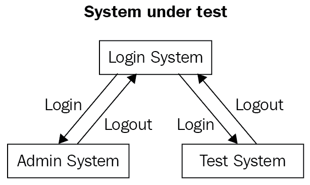
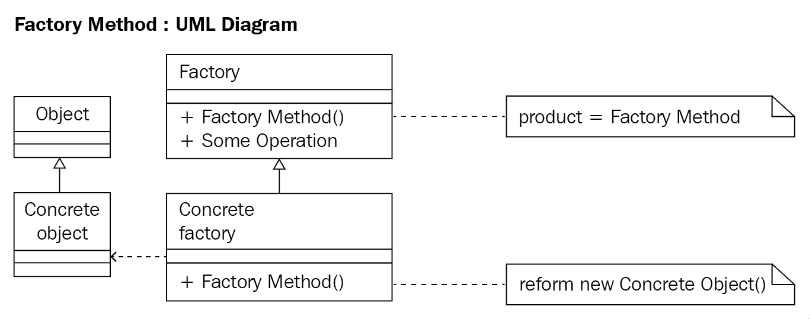
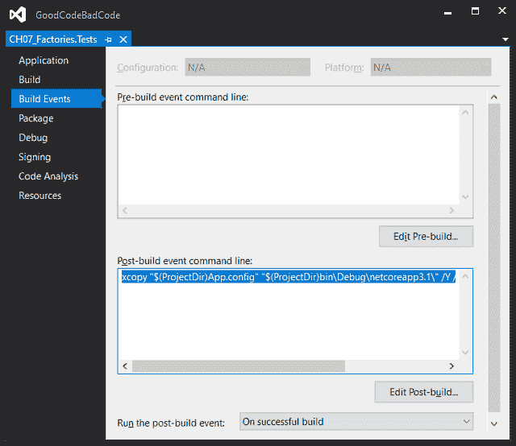

端到端系统测试

端到端（E2E）系统测试是对整个系统进行自动化测试。作为程序员，您的代码单元测试只是整个系统的一个小因素。因此，在本章中，我们将讨论以下主题：

+   执行端到端测试

+   编码和测试工厂

+   编码和测试依赖注入

+   测试模块化

在本章结束时，您将获得以下技能：

+   能够定义端到端测试

+   能够执行端到端测试

+   能够解释工厂是什么，以及如何使用它们

+   能够理解依赖注入是什么，以及如何使用它

+   能够理解模块化是什么，以及如何利用它

# 第八章：端到端测试

因此，您已经完成了项目，所有单元测试都通过了。但是，您的项目是更大系统的一部分。需要测试更大的系统，以确保您的代码以及其接口的其他代码都按预期工作。在隔离测试的代码集成到更大的系统时，可能会出现故障，并且在添加新代码时可能会破坏现有系统，因此执行端到端测试（也称为集成测试）非常重要。

集成测试负责测试从头到尾的完整程序流程。集成测试通常从“需求收集阶段”开始。您首先收集和记录系统的各种需求。然后设计所有组件并为每个子系统设计测试，然后为整个系统设计端到端测试。然后，根据要求编写代码并实施自己的单元测试。一旦代码完成并且所有测试都通过，代码就会在测试环境中集成到整个系统中，并执行端到端测试。通常，端到端测试是手动进行的，尽管在可能的情况下，它们也可以自动化。以下图表显示了一个包含两个子系统和数据库的系统。在端到端测试中，所有这些模块都将进行手动测试，使用自动化测试，或两种方法都使用：


每个系统的输入和输出是测试的主要焦点。您必须问自己，“每个系统是否传递了正确的信息？”

此外，在构建端到端测试时有三件事需要考虑：

+   会有哪些“用户功能”，每个功能将执行哪些步骤？

+   每个功能及其各个步骤将有什么“条件”？

+   我们将为哪些“不同的场景”构建测试用例？

每个子系统将提供一个或多个功能，并且每个功能将按特定顺序执行多个操作。这些操作将接收输入并提供输出。您还必须确定功能和函数之间的关系，然后确定函数是“可重用”还是“独立”的。

考虑在线测试产品的场景。老师和学生将登录系统。如果老师登录，他们将进入管理控制台，如果学生登录，他们将进入测试菜单进行一个或多个测试。在这种情况下，我们实际上有三个子系统：

+   登录系统

+   管理系统

+   测试系统

在上述系统中有两种执行流程。我们有管理员流程和测试流程。必须为每个流程建立条件和测试用例。我们将使用这个非常简单的评估系统登录场景作为我们的 E2E 示例。在现实世界中，E2E 将比本章节更复杂。本章的主要目的是让您思考 E2E 测试以及如何最好地实现它，因此我们将尽量简化事情，以便复杂性不会妨碍我们试图实现的目标，即手动测试必须相互交互的三个模块。

本节的目标是构建三个控制台应用程序，组成完整的系统：登录模块、管理模块和测试模块。然后一旦它们被构建，我们将手动测试它们。接下来的图表显示了系统之间的交互。我们将从登录模块开始：



## 登录模块（子系统）

我们系统的第一部分要求老师和学生都使用用户名和密码登录系统。任务列表如下：

1.  输入用户名。

1.  输入密码。

1.  按取消（这将重置用户名和密码）。

1.  按下确定。

1.  如果用户名无效，则在登录页面上显示错误消息。

1.  如果用户有效，则执行以下操作：

+   如果用户是老师，则加载管理控制台。

+   如果用户是学生，则加载测试控制台。

让我们从创建一个控制台应用程序开始。将其命名为`CH07_Logon`。在`Program.cs`类中，用以下代码替换现有代码：

```cs
using System;
using System.Collections.Generic;
using System.Diagnostics;
using System.Linq;

namespace CH07_Logon
{
    internal static class Program
    {
        private static void Main(string[] args)
        {
            DoLogin("Welcome to the test platform");
        }
    }
}
```

`DoLogin()`方法将使用传入的字符串作为标题。由于我们还没有登录，标题将设置为“欢迎来到测试平台”。我们需要添加`DoLogin()`方法。该方法的代码如下：

```cs
private static void DoLogin(string message)
{
    Console.WriteLine("----------------------------");
    Console.WriteLine(message);
    Console.WriteLine("----------------------------");
    Console.Write("Enter your username: ");
    var usr = Console.ReadLine();
    Console.Write("Enter your password: ");
    var pwd = ReadPassword();
    ValidateUser(usr, pwd);
}
```

先前的代码接受一条消息。该消息用作控制台窗口中的标题。然后提示用户输入他们的用户名和密码。`ReadPassword()`方法读取所有输入，并用*星号*替换过滤的字母以隐藏用户的输入。然后通过调用`ValidateUser()`方法验证用户名和密码。

我们接下来必须添加`ReadPassword()`方法，如下所示的代码：

```cs
public static string ReadPassword()
{
    return ReadPassword('*');
}
```

这个方法非常简单。它调用同名的重载方法，并传入密码掩码字符。让我们实现重载的`ReadPassword()`方法：

```cs
        public static string ReadPassword(char mask)
        {
            const int enter = 13, backspace = 8, controlBackspace = 127;
            int[] filtered = { 0, 27, 9, 10, 32 };
            var pass = new Stack<char>();
            char chr = (char)0;
            while ((chr = Console.ReadKey(true).KeyChar) != enter)
            {
                if (chr == backspace)
                {
                    if (pass.Count > 0)
                    {
                        Console.Write("\b \b");
                        pass.Pop();
                    }
                }
                else if (chr == controlBackspace)
                {
                    while (pass.Count > 0)
                    {
                        Console.Write("\b \b");
                        pass.Pop();
                    }
                }
                else if (filtered.Count(x => chr == x) <= 0)
                {
                    pass.Push((char)chr);
                    Console.Write(mask);
                }
            }
            Console.WriteLine();
            return new string(pass.Reverse().ToArray());
        }
```

重载的`ReadPassword()`方法接受密码掩码。该方法将每个字符添加到堆栈中。除非按下的键是*Enter*键，否则将检查按下的键是否是*Delete*键。如果用户按下*Delete*键，则从堆栈中删除输入的最后一个字符。如果输入的字符不在过滤列表中，则将其推送到堆栈上。然后将密码掩码写入屏幕。一旦按下*Enter*键，就会在控制台窗口中写入一个空行，并且堆栈的内容被反转，以字符串形式返回。

我们需要为该子系统编写的最后一个方法是`ValidateUser()`方法：

```cs
private static void ValidateUser(string usr, string pwd)
{
    if (usr.Equals("admin") && pwd.Equals("letmein"))
    {
        var process = new Process();
        process.StartInfo.FileName = @"..\..\..\CH07_Admin\bin\Debug\CH07_Admin.exe";
        process.StartInfo.Arguments = "admin";
        process.Start();
    }
    else if (usr.Equals("student") && pwd.Equals("letmein"))
    {
        var process = new Process();
        process.StartInfo.FileName = @"..\..\..\CH07_Test\bin\Debug\CH07_Test.exe";
        process.StartInfo.Arguments = "test";
        process.Start();
    }
    else
    {
        Console.Clear();
        DoLogin("Invalid username or password");
    }
}
```

`ValidateUser()`方法检查用户名和密码。如果它们验证为管理员，则加载管理员页面。如果它们验证为学生，则加载学生页面。否则，清除控制台，通知用户凭据错误，并提示他们重新输入凭据。

在成功登录操作执行后，相关子系统被加载，然后登录子系统终止。现在我们已经编写了登录模块，我们将编写我们的管理模块。

## 管理模块（子系统）

管理子系统是进行所有系统管理的地方。这包括以下内容：

+   导入学生

+   导出学生

+   添加学生

+   删除学生

+   编辑学生档案

+   将测试分配给学生

+   更改管理员密码

+   备份数据

+   恢复数据

+   擦除所有数据

+   查看报告

+   导出报告

+   保存报告

+   打印报告

+   注销

在这个练习中，我们不会实现任何这些功能。我会让你作为一个有趣的练习来完成。我们感兴趣的是管理员模块在成功登录时加载。如果管理员模块在未登录的情况下加载，则会显示错误消息。然后当用户按下一个键时，他们将被带到登录模块。成功登录是指用户成功以管理员身份登录，并且调用了 admin 可执行文件并带有*admin 参数*。

在 Visual Studio 中创建一个控制台应用程序，并将其命名为`CH07_Admin`。更新`Main()`方法如下：

```cs
private static void Main(string[] args)
{
    if ((args.Count() > 0) && (args[0].Equals("admin")))
    {
        DisplayMainScreen();
    }
    else
    {
        DisplayMainScreenError();
    }
}
```

`Main()`方法检查参数计数是否大于`0`，并且数组中的第一个参数是 admin。如果是，通过调用`DisplayMainScreen()`方法显示主屏幕。否则，调用`DisplayMainScreenError()`方法，警告用户他们必须登录才能访问系统。是时候写`DisplayMainScreen()`方法了：

```cs
private static void DisplayMainScreen()
{
    Console.WriteLine("------------------------------------");
    Console.WriteLine("Test Platform Administrator Console");
    Console.WriteLine("------------------------------------");
    Console.WriteLine("Press any key to exit");
    Console.ReadKey();
    Process.Start(@"..\..\..\CH07_Logon\bin\Debug\CH07_Logon.exe");
}
```

正如你所看到的，`DisplayMainScreen()`方法非常简单。它显示一个标题和一个按任意键退出的消息，然后等待按键。按下按键后，程序将外壳转到登录模块并退出。现在，对于`DisplayMainScreenError()`方法：

```cs
private static void DisplayMainScreenError()
{
    Console.WriteLine("------------------------------------");
    Console.WriteLine("Test Platform Administrator Console");
    Console.WriteLine("------------------------------------");
    Console.WriteLine("You must login to use the admin module.");
    Console.WriteLine("Press any key to exit");
    Console.ReadKey();
    Process.Start(@"..\..\..\CH07_Logon\bin\Debug\CH07_Logon.exe");
}
```

从这个方法中，您可以看到模块是在未登录的情况下启动的。这是不允许的。因此，当用户按下任意键时，用户将被重定向到登录模块，他们可以登录以使用管理员模块。我们的最终模块是测试模块。让我们开始写吧。

## 测试模块（子系统）

测试系统由一个菜单组成。该菜单显示学生必须执行的测试列表，并提供退出测试系统的选项。该系统的功能包括以下内容：

+   显示一个要完成的测试菜单。

+   从菜单中选择一个项目开始测试。

+   在测试完成后，保存结果并返回菜单。

+   当测试完成时，从菜单中删除它。

+   当用户退出测试模块时，他们将返回到登录模块。

与之前的模块一样，我会让你玩一下，并添加上述功能。我们在这里感兴趣的主要是确保只有在用户登录后才能运行测试模块。当模块退出时，加载登录模块。

测试模块或多或少是管理员模块的一个重新整理，所以我们将匆匆忙忙地通过这一部分，以便到达我们需要去的地方。更新`Main()`方法如下：

```cs
 private static void Main(string[] args)
 {
     if ((args.Count() > 0) && (args[0].Equals("test")))
     {
         DisplayMainScreen();
     }
     else
     {
         DisplayMainScreenError();
     }
}
```

现在添加`DisplayMainScreen()`方法：

```cs
private static void DisplayMainScreen()
{
    Console.WriteLine("------------------------------------");
    Console.WriteLine("Test Platform Student Console");
    Console.WriteLine("------------------------------------");
    Console.WriteLine("Press any key to exit");
    Console.ReadKey();
    Process.Start(@"..\..\..\CH07_Logon\bin\Debug\CH07_Logon.exe");
}
```

最后，编写`DisplayMainScreenError()`方法：

```cs
private static void DisplayMainScreenError()
{
    Console.WriteLine("------------------------------------");
    Console.WriteLine("Test Platform Student Console");
    Console.WriteLine("------------------------------------");
    Console.WriteLine("You must login to use the student module.");
    Console.WriteLine("Press any key to exit");
    Console.ReadKey();
    Process.Start(@"..\..\..\CH07_Logon\bin\Debug\CH07_Logon.exe");
}
```

现在我们已经编写了所有三个模块，我们将在下一节中对它们进行测试。

## 使用 E2E 测试我们的三模块系统

在这一部分，我们将对我们的三模块系统进行手动 E2E 测试。我们将测试登录模块，以确保它只允许有效的登录访问管理员模块或测试模块。当有效的管理员登录到系统时，他们应该看到管理员模块，并且登录模块应该被卸载。当有效的学生登录到系统时，他们应该看到测试模块，并且登录模块应该被卸载。

如果我们尝试加载管理员模块而没有先登录，我们应该被警告我们必须登录。按下任意键应该卸载管理员模块并加载登录模块。尝试在没有登录的情况下使用测试模块应该与管理员模块的行为相同。我们应该被警告除非我们登录否则不能使用测试模块，按下任意键应该加载登录模块并卸载测试模块。

现在让我们通过手动测试过程：

1.  确保所有项目都已构建，然后运行登录模块。您应该看到以下屏幕：


1.  输入错误的用户名和/或密码，然后按*Enter*，您将看到以下屏幕：


1.  现在，输入`admin`作为用户名，`letmein`作为密码，然后按*Enter*。您应该会看到成功登录的管理员模块屏幕：


1.  按任意键退出，您应该再次看到登录模块：


1.  输入`student`作为用户名，`letmein`作为密码。按*Enter*，您应该会看到学生模块：


1.  现在加载管理员模块而不登录，您应该会看到以下内容：


1.  按任意键将返回登录模块。现在加载测试模块而不登录，您应该会看到以下内容：


我们已经成功地手动进行了系统的端到端测试，该系统由三个模块组成。这绝对是进行端到端测试时的最佳方式。您的单元测试将非常有用，使得这个阶段相当简单。到达这个阶段时，您的错误应该已经被捕获和处理。但是，像往常一样，总会有可能遇到问题，这就是为什么手动运行整个系统是一个好主意。这样，您可以通过视觉看到您的交互，系统是否按预期行为。

更大的系统使用工厂和依赖注入。在本章的后续部分，我们将分别查看它们，从工厂开始。

# 工厂

工厂是使用**工厂方法模式**实现的。此模式的目的是允许创建对象而不指定它们的类。这是通过调用工厂方法来实现的。工厂方法的主要目标是创建类的实例。

您可以在以下情况下使用工厂方法模式：

+   当类无法预测必须实例化的对象类型

+   当子类必须指定要实例化的对象类型

+   当类控制其对象的实例化

考虑以下图表：



如前图所示，您有以下项目：

+   `Factory`，提供了返回类型的`FactoryMethod()`的接口

+   `ConcreteFactory`，覆盖或实现`FactoryMethod()`以返回具体类型

+   `ConcreteObject`，继承或实现基类或接口

现在是进行演示的好时机。想象一下，您有三个不同的客户。每个客户都需要使用不同的关系数据库作为后端数据源。您的客户使用的数据库将是 Oracle Database、SQL Server 和 MySQL。

作为端到端测试的一部分，您将需要针对每个数据源进行测试。但是如何编写程序一次，使其适用于这些数据库中的任何一个？这就是“工厂”方法模式发挥作用的地方。

在安装过程中或通过应用程序的初始配置，用户可以指定他们希望用作数据源的数据库。这些信息可以存储在配置文件中，作为加密的数据库连接字符串。当应用程序启动时，它将读取数据库连接字符串并对其进行解密。然后将数据库连接字符串传递到工厂方法中。最后，将选择、实例化并返回适当的数据库连接对象供应用程序使用。

现在您已经有了一些背景知识，让我们在 Visual Studio 中创建一个.NET Framework 控制台应用程序，并将其命名为`CH07_Factories`。将`App.cong`文件中的代码替换为以下内容：

```cs
<?xml version="1.0" encoding="utf-8" ?>
<configuration>
  <startup> 
    <supportedRuntime version="v4.0" sku=".NETFramework,Version=v4.8" />
  </startup>
  <connectionStrings>
    <clear />
    <add name="SqlServer"
         connectionString="Data Source=SqlInstanceName;Initial Catalog=DbName;Integrated Security=True"
         providerName="System.Data.SqlClient"
    />
    <add name="Oracle"
         connectionString="Data Source=OracleInstance;User Id=usr;Password=pwd;Integrated Security=no;"
         providerName="System.Data.OracleClient"
    />
    <add name="MySQL"
         connectionString="Server=MySqlInstance;Database=MySqlDb;Uid=usr;Pwd=pwd;"
         providerName="System.Data.MySqlClient"
    />
 </connectionStrings>
</configuration>
```

正如你所看到的，前面的代码已经在配置文件中添加了`connectionStrings`元素。在该元素中，我们清除了任何现有的连接字符串，然后添加了我们将在应用程序中使用的三个数据库连接字符串。为了简化本节的内容，我们使用了未加密的连接字符串，但在生产环境中，请确保您的连接字符串是加密的！

在这个项目中，我们不会使用`Program`类中的`Main()`方法。我们将启动`Factory`类，如下所示：

```cs
namespace CH07_Factories
{
    public abstract class Factory
    {
        public abstract IDatabaseConnection FactoryMethod();
    }
}
```

前面的代码是我们的抽象工厂，其中有一个抽象的`FactoryMethod()`，返回一个`IDatabaseConnection`类型。由于它还不存在，我们接下来会添加它：

```cs
namespace CH07_Factories
{
    public interface IDatabaseConnection
    {
        string ConnectionString { get; }
        void OpenConnection();
        void CloseConnection();
    }
}
```

在这个接口中，我们有一个只读的连接字符串，一个名为`OpenConnection()`的方法来打开数据库连接，以及一个名为`CloseConnection()`的方法来关闭已打开的数据库连接。到目前为止，我们有了我们的抽象`Factory`和我们的`IDatababaseConnection`接口。接下来，我们将创建我们的具体数据库连接类。让我们从 SQL Server 数据库连接类开始：

```cs
public class SqlServerDbConnection : IDatabaseConnection
{
    public string ConnectionString { get; }
    public SqlServerDbConnection(string connectionString)
    {
        ConnectionString = connectionString;
    }
    public void CloseConnection()
    {
        Console.WriteLine("SQL Server Database Connection Closed.");
    }
    public void OpenConnection()
    {
        Console.WriteLine("SQL Server Database Connection Opened.");
    }
}
```

正如你所看到的，`SqlServerDbConnection`类完全实现了`IDatabaseConnection`接口。构造函数以`connectionString`作为单个参数。只读的`ConnectionString`属性然后被赋值为`connectionString`。`OpenConnection()`方法只是在控制台上打印。

然而，在实际实现中，连接字符串将被用于连接到字符串中指定的有效数据源。一旦数据库连接打开，就必须*关闭*。关闭数据库连接将由`CloseConnection()`方法执行。接下来，我们重复前面的过程，为 Oracle 数据库连接和 MySQL 数据库连接进行实现：

```cs
public class OracleDbConnection : IDatabaseConnection
{
    public string ConnectionString { get; }
    public OracleDbConnection(string connectionString)
    {
        ConnectionString = connectionString;
    }
    public void CloseConnection()
    {
        Console.WriteLine("Oracle Database Connection Closed.");
    }
    public void OpenConnection()
    {
        Console.WriteLine("Oracle Database Connection Closed.");
    }
}
```

我们现在已经放置了`OracleDbConnection`类。所以，我们需要实现的最后一个类是`MySqlDbConnection`类：

```cs
public class MySqlDbConnection : IDatabaseConnection
{
    public string ConnectionString { get; }
    public MySqlDbConnection(string connectionString)
    {
        ConnectionString = connectionString;
    }
    public void CloseConnection()
    {
        Console.WriteLine("MySQL Database Connection Closed.");
    }
    public void OpenConnection()
    {
        Console.WriteLine("MySQL Database Connection Closed.");
    }
}
```

有了这个，我们已经添加了我们的具体类。唯一剩下的事情就是创建我们的`ConcreteFactory`类，它继承了抽象的`Factory`类。你需要引用`System.Configuration.ConfigurationManager` NuGet 包：

```cs
using System.Configuration;

namespace CH07_Factories
{
    public class ConcreteFactory : Factory
    {
        private static ConnectionStringSettings _connectionStringSettings;

        public ConcreteFactory(string connectionStringName)
        {
            GetDbConnectionSettings(connectionStringName);
        }

        private static ConnectionStringSettings GetDbConnectionSettings(string connectionStringName)
        {
            return ConfigurationManager.ConnectionStrings[connectionStringName];
        }
    }
}
```

正如你所看到的，这个类使用了`System.Configuration`命名空间。`ConnectionStringSettings`的值存储在`_connectionStringSettings`成员变量中。这是在接受`connectionStringName`的构造函数中设置的。名称被传递到`GetDbConnectionSettings()`方法中。敏锐的读者会发现构造函数中的一个明显错误。

方法被调用了，但成员变量没有被设置。然而，当我们开始运行我们尚未编写的测试时，我们将注意到这个疏忽并加以修复。`GetDbConnectionSettings()`方法使用`ConfigurationManager`从`ConnectionStrings[]`数组中读取所需的连接字符串。

现在，是时候通过添加`FactoryMethod()`来完成我们的`ConcreteClass`了：

```cs
public override IDatabaseConnection FactoryMethod()
{
    var providerName = _connectionStringSettings.ProviderName;
    var connectionString = _connectionStringSettings.ConnectionString;
    switch (providerName)
    {
        case "System.Data.SqlClient":
            return new SqlServerDbConnection(connectionString);
        case "System.Data.OracleClient":
            return new OracleDbConnection(connectionString);
        case "System.Data.MySqlClient":
            return new MySqlDbConnection(connectionString);
        default:
            return null;
    }
}
```

我们的`FactoryMethod()`返回一个`IDatabaseConnection`类型的具体类。在类的开头，成员变量被读取并存储在`providerName`和`connectionString`中。然后使用 switch 来确定要构建和传回什么类型的数据库连接。

现在我们可以测试我们的工厂，看它是否能够处理我们客户使用的不同类型的数据库。这个测试可以手动进行，但为了这个练习的目的，我们将编写自动化测试。

创建一个新的 NUnit 测试项目。添加对`CH07_Factories`项目的引用。然后添加`System.Configuration.ConfigurationManager` NuGet 包。将类重命名为`UnitTests.cs`。现在，添加第一个测试，如下所示：

```cs
[Test]
public void IsSqlServerDbConnection()
{
    var factory = new ConcreteFactory("SqlServer");
    var connection = factory.FactoryMethod();
    Assert.IsInstanceOf<SqlServerDbConnection>(connection);
}
```

这个测试是针对 SQL Server 数据库连接的。它创建了一个新的 `ConcreteFactory()` 实例，并传入了 `"SqlServer"` 的 `connectionStringName` 值。然后工厂通过 `FactoryMethod()` 实例化并返回正确的数据库连接对象。最后，连接对象被断言以测试它确实是 `SqlServerDbConnection` 类型的实例。我们需要再为其他数据库连接编写前面的测试两次，所以现在让我们添加 Oracle 数据库连接测试：

```cs
[Test]
public void IsOracleDbConnection()
{
    var factory = new ConcreteFactory("Oracle");
    var connection = factory.FactoryMethod();
    Assert.IsInstanceOf<OracleDbConnection>(connection);
}
```

测试通过了 `"Oracle"` 的 `connectionStringName` 值。进行了断言来测试返回的连接对象是否是 `OracleDbConnection` 类型。最后，我们有我们的 MySQL 数据库连接测试：

```cs
[Test]
public void IsMySqlDbConnection()
{
    var factory = new ConcreteFactory("MySQL");
    var connection = factory.FactoryMethod();
    Assert.IsInstanceOf<MySqlDbConnection>(connection);
}
```

测试通过了 `"MySQL"` 的 `connectionStringName` 值。进行了断言来测试返回的连接对象是否是 `MySqlDbConnection` 类型。如果我们现在运行测试，它们都会失败，因为 `_connectionStringSettings` 变量没有被设置，所以让我们来修复这个问题。修改你的 `ConcreteFactory` 构造函数如下：

```cs
public ConcreteFactory(string connectionStringName)
{
    _connectionStringSettings = GetDbConnectionSettings(connectionStringName);
}
```

如果你现在运行所有的测试，它们应该可以工作。如果 NUnit 没有获取到连接字符串，那么它会在一个不同的 `App.config` 文件中查找，而不是你期望的那个。在读取连接字符串的那一行之前添加以下行：

```cs
var filepath = ConfigurationManager.OpenExeConfiguration(ConfigurationUserLevel.None).FilePath;
```

这将告诉你 NUnit 正在查找你的连接字符串设置。如果文件不存在，你可以手动创建它，并从你的主 `App.config` 文件中复制内容。但这样做的问题是，该文件很可能会在下次构建时被删除。因此，为了使更改永久生效，你可以向你的测试项目添加后期构建事件命令行。

要做到这一点，右键单击你的测试项目，选择属性。然后在属性选项卡上，选择“构建事件”。在后期构建事件命令行中，添加以下命令：

```cs
xcopy "$(ProjectDir)App.config" "$(ProjectDir)bin\Debug\netcoreapp3.1\" /Y /I /R
```

以下截图显示了项目属性对话框的“构建事件”页面，其中包含了后期构建事件命令行：



这将在测试项目输出文件夹中创建缺失的文件。在你的系统上，该文件可能被命名为 `testhost.x86.dll.config`，因为在我的系统上是这样的。现在，你的构建应该可以工作了。

如果你改变 `FactoryMethod()` 中某个 case 的返回类型，你会发现你的测试失败，如下截图所示：


将代码改回正确的类型，这样你的代码现在就可以通过了。

我们已经看到了如何手动 E2E 测试系统，以及如何使用软件工厂，并且我们如何自动测试我们的工厂是否按预期工作。现在我们将看看依赖注入以及如何进行 E2E 测试。

# 依赖注入

**依赖注入**（**DI**）帮助你通过将代码的行为与其依赖项分离来生成松耦合的代码，这导致了更易于测试、扩展和维护的可读代码。代码更易于阅读，因为你遵循了单一职责原则。这也导致了更小的代码。更小的代码更容易维护和测试，因为我们依赖于抽象而不是实现，所以我们可以根据需要更轻松地扩展代码。

以下是你可以实现的 DI 类型：

+   构造函数注入

+   属性/设置器注入

+   方法注入

*穷人的 DI* 是不使用容器构建的。然而，推荐的最佳实践是使用 DI 容器。简单来说，DI 容器是一个注册框架，它在请求时实例化依赖项并注入它们。

现在，我们将为我们的 DI 示例编写自己的依赖容器、接口、服务和客户端。然后我们将为依赖项目编写测试。请记住，即使测试应该首先编写，在我遇到的大多数业务情况下，它们是在软件编写后编写的！因此，在这种情况下，我们将在编写所需软件后编写测试。当您雇用多个团队时，其中一些团队使用 TDD，而另一些团队不使用 TDD，或者您使用第三方代码而没有测试时，这种情况经常发生。

我们之前提到过，E2E 最好手动完成，自动化很困难，但您可以自动化系统的测试，以及进行手动测试。如果您的目标是多个数据源，这将特别有用。

首先，您需要准备好一个依赖容器。依赖容器保留类型和实例的注册。在使用之前，您需要注册类型。当需要使用对象的实例时，您将其解析为变量并注入（传递）到构造函数、方法或属性中。

创建一个新的类库，命名为`CH07_DependencyInjection`。添加一个名为`DependencyContainer`的新类，并添加以下代码：

```cs
public static readonly IDictionary<Type, Type> Types = new Dictionary<Type, Type>();
public static readonly IDictionary<Type, object> Instances = new Dictionary<Type, object>();

public static void Register<TContract, TImplementation>()
{
    Types[typeof(TContract)] = typeof(TImplementation);
}

public static void Register<TContract, TImplementation>(TImplementation instance)
{
    Instances[typeof(TContract)] = instance;
}
```

在此代码中，我们有两个字典，其中包含类型和实例。我们还有两种方法。一种用于注册我们的类型，另一种用于注册我们的实例。现在我们已经有了注册和存储类型和实例的代码，我们需要一种在运行时解析它们的方法。将以下代码添加到`DependencyContainer`类中：

```cs
public static T Resolve<T>()
{
    return (T)Resolve(typeof(T));
}
```

此方法传入一个类型。它调用解析类型的方法并返回该类型的实例。因此，现在让我们添加该方法：

```cs
public static object Resolve(Type contract)
{
    if (Instances.ContainsKey(contract))
    {
        return Instances[contract];
    }
    else
    {
        Type implementation = Types[contract];
        ConstructorInfo constructor = implementation.GetConstructors()[0];
        ParameterInfo[] constructorParameters = constructor.GetParameters();
        if (constructorParameters.Length == 0)
        {
            return Activator.CreateInstance(implementation);
        }
        List<object> parameters = new List<object>(constructorParameters.Length);
        foreach (ParameterInfo parameterInfo in constructorParameters)
        {
            parameters.Add(Resolve(parameterInfo.ParameterType));
        }
        return constructor.Invoke(parameters.ToArray());
    }
}
```

`Resolve()`方法检查`Instances`字典是否包含与合同匹配的实例。如果是，则返回该实例。否则，创建并返回一个新实例。

现在，我们需要一个接口，我们要注入的服务将实现该接口。我们将其命名为`IService`。它将有一个返回字符串的单个方法，该方法将被命名为`WhoAreYou()`：

```cs
public interface IService
{
    string WhoAreYou();
}
```

我们要注入的服务将实现上述接口。我们的第一个类将被命名为`ServiceOne`，并且该方法将返回字符串`"CH07_DependencyInjection.ServiceOne()"`：

```cs
public class ServiceOne : IService
{
    public string WhoAreYou()
    {
        return "CH07_DependencyInjection.ServiceOne()";
    }
}
```

第二个服务与第一个服务相同，只是它被称为`ServiceTwo`，并且该方法返回字符串`"CH07_DependencyInjection.ServiceTwo()"`：

```cs
public class ServiceTwo : IService
{
    public string WhoAreYou()
    {
        return "CH07_DependencyInjection.ServiceTwo()";
    }
}
```

依赖容器、接口和服务类现在已经就位。最后，我们将添加客户端，该客户端将用作演示对象，通过 DI 来使用我们的服务。我们的类将演示构造函数注入、属性注入和方法注入。将以下代码添加到类的顶部：

```cs
private IService _service;

public Client() { }
```

`_service`成员变量将用于存储我们注入的服务。我们有一个默认构造函数，以便我们可以测试我们的属性和方法注入。添加接受并设置`IService`成员的构造函数：

```cs
public Client (IService service) 
{
    _service = service;
}
```

接下来，我们将添加用于测试属性注入和构造函数注入的属性：

```cs
public IService Service
{
    get { return _service; }
    set
    {
        _service = value;
    }
}
```

然后我们将添加一个调用`WhoAreYou()`的方法注入对象。`Service`属性允许设置和检索`_service`成员变量。最后，我们将添加`GetServiceName()`方法：

```cs
public string GetServiceName(IService service)
{
    return service.WhoAreYou();
}
```

`GetServiceName()`方法在`IService`类的注入实例上调用。此方法返回传入的服务的完全限定名称。现在我们将编写单元测试来测试功能。添加一个测试项目并引用依赖项目。将测试项目命名为`CH07_DependencyInjection.Tests`，并将`UnitTest1`重命名为`UnitTests`。

我们将编写测试来检查我们实例的注册和解析是否有效，并且正确的类是否通过构造函数注入、setter 注入和方法注入。我们的测试将测试`ServiceOne`和`ServiceTwo`的注入。让我们从编写以下`Setup()`方法开始：

```cs
[TestInitialize]
public void Setup()
{
    DependencyContainer.Register<ServiceOne, ServiceOne>();
    DependencyContainer.Register<ServiceTwo, ServiceTwo>();
}
```

在我们的`Setup()`方法中，我们注册了`IService`类的两个实现，即`ServiceOne()`和`ServiceTwo()`。现在我们将编写两个测试方法来测试依赖容器：

```cs
[TestMethod]
public void DependencyContainerTestServiceOne()
{
    var serviceOne = DependencyContainer.Resolve<ServiceOne>();
    Assert.IsInstanceOfType(serviceOne, typeof(ServiceOne));
}

[TestMethod]
public void DependencyContainerTestServiceTwo()
{
    var serviceTwo = DependencyContainer.Resolve<ServiceTwo>();
    Assert.IsInstanceOfType(serviceTwo, typeof(ServiceTwo));
}
```

这两种方法都调用`Resolve()`方法。该方法检查类型的实例。如果实例存在，则返回它。否则，将实例化并返回。现在是时候为`serviceOne`和`serviceTwo`编写构造函数注入测试了：

```cs
[TestMethod]
public void ConstructorInjectionTestServiceOne()
{
    var serviceOne = DependencyContainer.Resolve<ServiceOne>();
    var client = new Client(serviceOne);
    Assert.IsInstanceOfType(client.Service, typeof(ServiceOne));
}

[TestMethod]
public void ConstructorInjectionTestServiceTwo()
{
    var serviceTwo = DependencyContainer.Resolve<ServiceTwo>();
    var client = new Client(serviceTwo);
    Assert.IsInstanceOfType(client.Service, typeof(ServiceTwo));
}
```

在这两个构造函数测试方法中，我们从容器注册表中解析相关服务。然后将服务传递到构造函数中。最后，使用`Service`属性，我们断言通过构造函数传入的服务是预期服务的实例。让我们编写测试以显示属性 setter 注入按预期工作：

```cs
[TestMethod]
public void PropertyInjectTestServiceOne()
{
    var serviceOne = DependencyContainer.Resolve<ServiceOne>();
    var client = new Client();
    client.Service = serviceOne;
    Assert.IsInstanceOfType(client.Service, typeof(ServiceOne));
}

[TestMethod]
public void PropertyInjectTestServiceTwo()
{
    var serviceTwo = DependencyContainer.Resolve<ServiceTwo>();
    var client = new Client();
    client.Service = serviceTwo;
    Assert.IsInstanceOfType(client.Service, typeof(ServiceOne));
}
```

为了测试 setter 注入是否解析了我们想要的类，使用默认构造函数创建一个客户端，然后将解析后的实例分配给`Service`属性。接下来，我们断言服务是否是预期类型的实例。最后，对于我们的测试，我们只需要测试我们的方法注入：

```cs
[TestMethod]
public void MethodInjectionTestServiceOne()
{
    var serviceOne = DependencyContainer.Resolve<ServiceOne>();
    var client = new Client();
    Assert.AreEqual(client.GetServiceName(serviceOne), "CH07_DependencyInjection.ServiceOne()");
}

[TestMethod]
public void MethodInjectionTestServiceTwo()
{
    var serviceTwo = DependencyContainer.Resolve<ServiceTwo>();
    var client = new Client();
    Assert.AreEqual(client.GetServiceName(serviceTwo), "CH07_DependencyInjection.ServiceTwo()");
}
```

在这里，我们再次解析我们的实例。使用默认构造函数创建一个新的客户端，并断言传入的解析实例和调用`GetServiceName()`方法返回传入实例的正确标识。

# 模块化

系统由一个或多个模块组成。当一个系统包含两个或多个模块时，您需要测试它们之间的交互，以确保它们按预期一起工作。让我们考虑一下以下图表中 API 的系统：


从前面的图表中可以看出，我们有一个客户端通过 API 访问云中的数据存储。客户端向 HTTP 服务器发送请求。请求经过身份验证。一旦经过身份验证，请求就被授权访问 API。客户端发送的数据被反序列化，然后传递到业务层。业务层然后在数据存储上执行读取、插入、更新或删除操作。数据然后通过业务层从数据库传回客户端，然后通过序列化层传回客户端。

正如您所看到的，我们有许多相互交互的模块。我们有以下内容：

+   安全（身份验证和授权）与序列化（序列化和反序列化）进行交互

+   与包含所有业务逻辑的业务层进行交互的序列化

+   业务逻辑层与数据存储进行交互

如果我们看一下前面的三点，我们可以看到可以编写许多测试来自动化 E2E 测试过程。许多测试本质上是单元测试，这些测试成为我们的集成测试套件的一部分。现在让我们考虑一些。我们能够测试以下内容：

+   正确的登录

+   登录错误

+   授权访问

+   未经授权的访问

+   数据序列化

+   数据反序列化

+   业务逻辑

+   数据库读取

+   数据库更新

+   数据库插入

+   数据库删除

从这些测试中可以看出，它们是集成测试的单元测试。那么，我们可以编写哪些集成测试呢？嗯，我们可以编写以下测试：

+   发送读取请求。

+   发送插入请求。

+   发送编辑请求。

+   发送删除请求。

这四个测试可以使用正确的用户名和密码以及格式良好的数据请求进行编写，也可以针对无效的用户名或密码和格式不良的数据请求进行编写。

因此，您可以通过使用单元测试来测试每个模块中的代码，然后使用仅测试两个模块之间交互的测试来执行集成测试。您还可以编写执行完整 E2E 操作的测试。

尽管可以使用代码测试所有这些，但你*必须*手动运行系统，以验证一切是否按预期工作。

所有这些测试都成功完成后，您可以放心地将代码发布到生产环境。

现在我们已经介绍了 E2E 测试（也称为**集成测试**），让我们花点时间总结一下我们学到的东西。

# 总结

在本章中，我们了解了什么是 E2E 测试。我们看到我们可以编写自动化测试，但我们也意识到了从最终用户的角度手动测试完整应用程序的重要性。

当我们研究工厂时，我们看到了它们在数据库连接方面的使用示例。我们考虑了一个场景，即我们的应用程序将允许用户使用他们选择的数据库。我们加载连接字符串，然后根据该连接字符串实例化并返回相关的数据库连接对象供使用。我们看到了如何可以针对每个不同数据库的每个用例测试我们的工厂。工厂可以在许多不同的场景中使用，现在您知道它们是什么，如何使用它们，最重要的是，您知道如何测试它们。

DI 使单个类能够与接口的多个不同实现一起工作。当我们编写自己的依赖容器时，我们看到了这一点。我们创建的接口由两个类实现，添加到依赖注册表中，并在依赖容器调用时解析。我们实施了单元测试，以测试构造函数注入、属性注入和方法注入的不同实现。

然后，我们看了模块。一个简单的应用程序可能只包含一个模块，但随着应用程序复杂性的增加，组成该应用程序的模块也会增加。模块数量的增加也增加了出错的机会。因此，测试模块之间的交互非常重要。模块本身可以使用单元测试进行测试。模块之间的交互可以使用更复杂的测试进行测试，从头到尾运行完整的场景。

在下一章中，我们将探讨在处理线程和并发时的最佳实践。但首先，让我们测试一下你对本章内容的了解。

# 问题

1.  什么是 E2E 测试？

1.  E2E 测试的另一个术语是什么？

1.  在 E2E 测试期间我们应该采用什么方法？

1.  工厂是什么，为什么我们要使用它们？

1.  DI 是什么？

1.  为什么我们应该使用依赖容器？

# 进一步阅读

+   Manning 的书《.NET 中的依赖注入》将在向您介绍.NET DI 之前，引导您了解各种 DI 框架。
