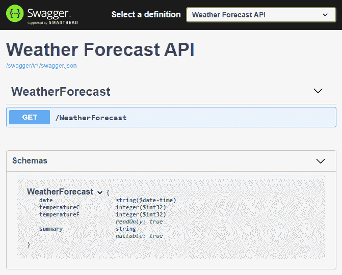
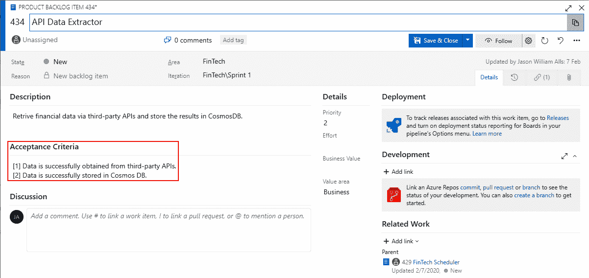
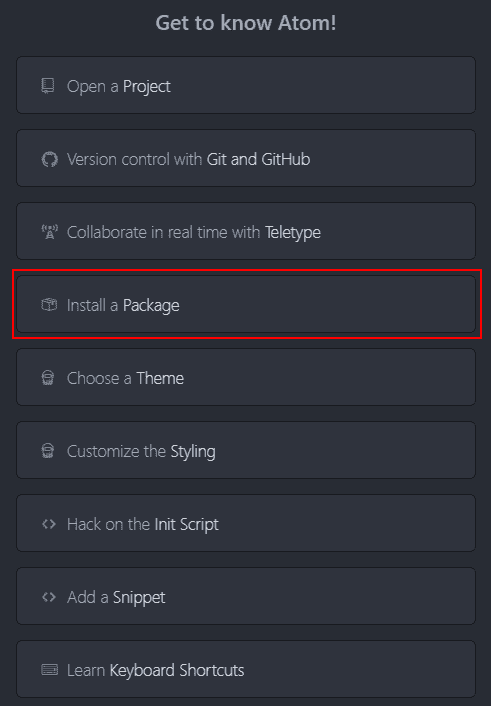
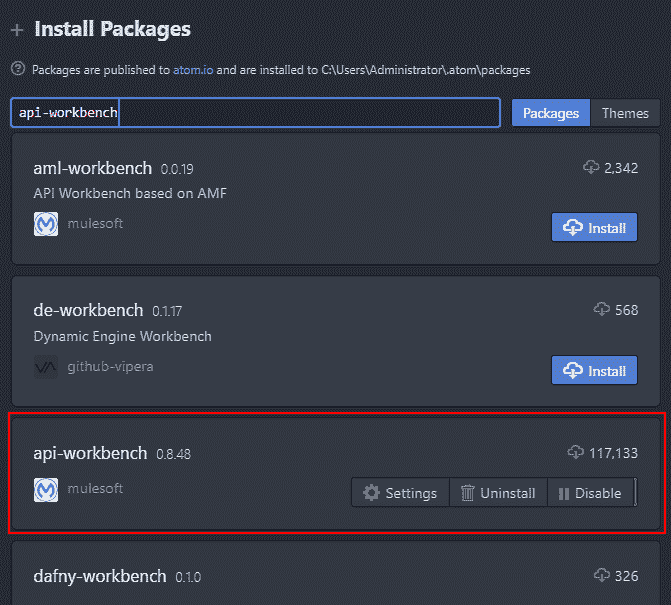

# 第九章：设计和开发 APIs

**应用程序编程接口**（**APIs**）在如今的许多方面从未像现在这样重要。APIs 用于连接政府和机构共享数据，并以协作的方式解决商业和政府问题。它们用于医生诊所和医院实时共享患者数据。当您连接到您的电子邮件并通过 Microsoft Teams、Microsoft Azure、Amazon Web Services 和 Google Cloud Platform 等平台与同事和客户进行协作时，您每天都在使用 APIs。

每次您使用计算机或手机与某人聊天或进行视频通话时，您都在使用 API。当流媒体视频会议、进入网站技术支持聊天或播放您喜爱的音乐和视频时，您都在使用 API。因此，作为程序员，了解 API 是什么以及如何设计、开发、保护和部署它们是至关重要的。

在本章中，我们将讨论 API 是什么，它们如何使您受益，以及为什么有必要了解它们。我们还将讨论 API 代理、设计和开发指南，如何使用 RAML 设计 API 以及如何使用 Swagger 文档 API。

本章涵盖以下主题：

+   什么是 API？

+   API 代理

+   API 设计指南

+   使用 RAML 进行 API 设计

+   Swagger API 开发

本章将帮助您获得以下技能：

+   了解 API 以及为什么您需要了解它们

+   了解 API 代理以及我们为什么使用它们

+   在设计自己的 API 时了解设计指南

+   使用 RAML 设计自己的 API

+   使用 Swagger 来记录您的 API

通过本章结束时，您将了解良好 API 设计的基础，并掌握推动 API 能力所需的知识。了解 API 是什么很重要，因此我们将从这一点开始本章。但首先，请确保您实现以下技术要求，以充分利用本章。

# 技术要求

我们将在本章中使用以下技术来创建 API：

+   Visual Studio 2019 社区版或更高版本

+   Swashbuckle.AspNetCore 5 或更高版本

+   Swagger ([`swagger.io`](https://swagger.io))

+   Atom ([`atom.io`](http://atom.io))

+   MuleSoft 的 API Workbench

# 什么是 API？

**APIs**是可重用的库，可以在不同应用程序之间共享，并可以通过 REST 服务提供（在这种情况下，它们被称为**RESTful APIs**）。

**表述状态转移**（**REST**）由 Roy Fielding 于 2000 年引入。

REST 是一种由*约束*组成的架构风格。总共有六个约束在编写 REST 服务时应该考虑。这些约束如下：

+   **统一接口**：用于识别资源，并通过*表示*来操作这些资源。消息使用超媒体并且是自描述的。**超媒体作为应用程序状态的引擎**（**HATEOAS**）被用来包含关于客户端可以执行的下一步操作的信息。

+   **客户端-服务器**：这个约束通过*封装*利用信息隐藏。因此，只有客户端将要使用的 API 调用将是可见的，所有其他 API 将被保持隐藏。RESTful API 应该独立于系统的其他部分，使其松散耦合。

+   **无状态**：这表示 RESTful API 没有会话或历史。如果客户端需要会话或历史，那么客户端必须在请求中提供所有相关信息给服务器。

+   **可缓存**：这个约束意味着资源必须声明自己是可缓存的。这意味着资源可以被快速访问。因此，我们的 RESTful API 变得更快，服务器负载减少。

+   **分层系统**：分层系统约束规定每个层必须只做一件事。每个组件只应知道它需要使用的内容以便进行功能和任务的执行。组件不应该了解它不使用的系统部分。

+   **可选的可执行代码**：可执行代码约束是可选的。此约束确定服务器可以临时扩展或自定义客户端的功能，通过传输可执行代码。

因此，在设计 API 时，最好假设最终用户是具有任何经验水平的程序员。他们应该能够轻松获取 API，阅读相关信息，并立即投入使用。

不要担心创建完美的 API。API 通常会随着时间的推移而不断发展，如果您曾经使用过 Microsoft 的 API，您会知道它们经常进行升级。将来将删除的功能通常会用注释标记，告知用户不要使用特定的属性或方法，因为它们将在将来的版本中被删除。然后，当它们不再被使用时，通常会在最终删除之前用过时的注释标记进行标记。这告诉 API 的用户升级使用过时功能的任何应用程序。

为什么要使用 REST 服务进行 API 访问？嗯，许多公司通过在线提供 API 并对其收费而获得巨大利润。因此，RESTful API 可以是一项非常有价值的资产。Rapid API ([`rapidapi.com/`](https://rapidapi.com/))提供免费和付费的 API 供使用。

您的 API 可以永久保持在原位。如果您使用云提供商，您的 API 可以具有高度可扩展性，并且您可以通过免费或订阅的方式使其普遍可用。您可以通过简单的接口封装所有复杂的工作，并暴露所需的内容，因为您的 API 将是小型且可缓存的，所以非常快速。现在让我们来看看 API 代理以及为什么要使用它们。

# API 代理

**API 代理**是位于客户端和您的 API 之间的类。它本质上是您和将使用您的 API 的开发人员之间的 API 合同。因此，与其直接向开发人员提供 API 的后端服务（随着您对其进行重构和扩展，可能会发生故障），不如向 API 的使用者提供保证，即使后端服务发生变化，API 合同也将得到遵守。

以下图表显示了客户端、API 代理、实际访问的 API 以及 API 与数据源之间的通信：


本节将编写一个演示实现代理模式的控制台应用程序。我们的示例将具有一个接口，该接口将由 API 和代理实现。API 将返回实际消息，代理将从 API 获取消息并将其传递给客户端。代理还可以做的远不止简单调用 API 方法并返回响应。它们可以执行身份验证、授权、基于凭据的路由等等。但是，我们的示例将保持在绝对最低限度，以便您可以看到代理模式的简单性。

启动一个新的.NET Framework 控制台应用程序。添加`Apis`、`Interfaces`和`Proxies`文件夹，并将`HelloWorldInterface`接口放入`Interfaces`文件夹中：

```cs
public interface HelloWorldInterface
{
    string GetMessage();
}
```

我们的接口方法`GetMessage()`以字符串形式返回一条消息。代理和 API 类都将实现这个接口。`HelloWorldApi`类实现了`HelloWorldInterface`，所以将其添加到`Apis`文件夹中：

```cs
internal class HelloWorldApi : HelloWorldInterface
{
    public string GetMessage()
    {
        return "Hello World!";
    }
}
```

正如您所看到的，我们的 API 类实现了接口并返回了一个`"Hello World!"`的消息。我们还将类设置为内部类。这可以防止外部调用者访问此类的内容。现在，我们将`HelloWorldProxy`类添加到`Proxies`文件夹中：

```cs
    public class HelloWorldProxy : HelloWorldInterface
    {
        public string GetMessage()
        {
            return new HelloWorldApi().GetMessage();
        }
    }
```

我们的代理类设置为`public`，因为此类将由客户端调用。代理类将调用 API 类中的`GetMessage()`方法，并将响应返回给调用者。现在剩下的事情就是修改我们的`Main()`方法：

```cs
static void Main(string[] args)
{
    Console.WriteLine(new HelloWorldProxy().GetMessage());
    Console.ReadKey();
}
```

我们的`Main()`类调用`HelloWorldProxy`代理类的`GetMessage()`方法。我们的代理类调用 API 类，并将返回的方法打印在控制台窗口中。然后控制台等待按键后退出。

运行代码并查看输出；您已成功实现了 API 代理类。您可以使代理尽可能简单或复杂，但您在这里所做的是成功的基础。

在本章中，我们将构建一个 API。因此，让我们讨论一下我们将要构建的内容，然后开始着手处理它。完成项目后，您将拥有一个可以生成 JSON 格式的月度股息支付日历的工作 API。

# API 设计指南

有一些基本的指南可供遵循，以编写有效的 API—例如，您的资源应使用复数形式的名词。因此，例如，如果您有一个批发网站，那么您的 URL 将看起来像以下虚拟链接：

+   `http://wholesale-website.com/api/customers/1`

+   `http://wholesale-website.com/api/products/20`

上述 URL 将遵循`api/controller/id`的控制器路由。在业务域内的关系方面，这些关系也应反映在 URL 中，例如`http://wholesale-website.com/api/categories/12/products`—此调用将返回类别`12`的产品列表。

如果您需要将动词用作资源，则可以这样做。在进行 HTTP 请求时，使用`GET`检索项目，`HEAD`仅检索标头，`POST`插入或保存新资源，`PUT`替换资源，`DELETE`删除资源。通过使用查询参数使资源保持精简。

在分页结果时，应向客户端提供一组现成的链接。RFC 5988 引入了**链接标头**。在规范中，**国际资源标识符（IRI）**是两个资源之间的类型化连接。有关更多信息，请参阅[`www.greenbytes.de/tech/webdav/rfc5988.html`](https://www.greenbytes.de/tech/webdav/rfc5988.html)。链接标头请求的格式如下：

+   `<https://wholesale-website.com/api/products?page=10&per_page=100>; rel="next"`

+   `<https://wholesale-website.com/api/products?page=11&per_page=100>; rel="last"`

您的 API 的版本可以在 URL 中进行版本控制。因此，每个资源将具有相同资源的不同 URL，如以下示例：

+   `https://wholesale-website.com/api/v1/cart`

+   `https://wholesale-website.com/api/v2/cart`

这种版本控制方式非常简单，可以轻松找到正确的 API 版本。

JSON 是首选的资源表示。它比 XML 更易于阅读，而且体积更小。当您使用`POST`、`PUT`和`PATCH`动词时，还应要求将内容类型标头设置为 application/JSON，或抛出`415`HTTP 状态码（表示不支持的媒体类型）。Gzip 是一种单文件/流无损数据压缩实用程序。默认使用 Gzip 可以节省带宽的很大比例，并始终将 HTTP `Accept-Encoding`标头设置为`gzip`。

始终为您的 API 使用 HTTPS（TLS）。调用者的身份验证应始终在标头中完成。我们在设置 API 时看到了这一点，当我们使用 API 访问密钥设置了`x-api-key`标头。每个请求都应进行身份验证和授权。未经授权的访问应导致`HTTP 403 Forbidden`响应。还应使用正确的 HTTP 响应代码。因此，如果请求成功，请使用`200`状态代码，如果找不到资源，请使用`404`，依此类推。有关 HTTP 状态代码的详尽列表，请访问[`httpstatuses.com/`](https://httpstatuses.com/)。OAuth 2.0 是授权的行业标准协议。您可以在[`oauth.net/2/`](https://oauth.net/2/)上阅读有关它的所有信息。

API 应提供有关其使用的文档和示例。文档应始终与当前版本保持最新，并且应具有视觉吸引力和易于阅读。我们将在本章后面看一下 Swagger，以帮助我们创建文档。

您永远不知道您的 API 何时需要扩展。因此，这应该从一开始就考虑进去。在下一章的*股息日历 API*项目中，您将看到我们如何实现限流，每月只能调用一次 API，在特定日期。但是，根据您自己的需求，您可以有效地想出 1001 种不同的方法来限制您的 API，但这应该在项目开始时完成。因此，一旦开始新项目，就要考虑*可扩展性*。

出于安全和性能原因，您可能决定实现 API 代理。API 代理将客户端与直接访问您的 API 断开连接。代理可以访问同一项目中的 API 或外部 API。通过使用代理，您可以避免暴露数据库架构。

对客户端的响应不应与数据库的结构匹配。这可能会成为黑客的绿灯。因此，应避免数据库结构和发送回客户端的响应之间的一对一映射。您还应该向客户端隐藏标识符，因为客户端可以使用它们手动访问数据。

API 包含资源。**资源**是可以以某种方式操作的项目。资源可以是文件或数据。例如，学校数据库中的学生是可以添加、编辑或删除的资源。视频文件可以被检索和播放，音频文件也可以。图像也是资源，报告模板也是，它们将在呈现给用户之前被打开、操作和填充数据。

通常，资源形成项目的集合，例如学校数据库中的学生。`Students`是`Student`类型的集合的名称。可以通过 URL 访问资源。URL 包含到资源的路径。

URL 被称为**API 端点**。API 端点是资源的地址。可以通过带有一个或多个参数的 URL 或不带任何参数的 URL 访问此资源。URL 应该只包含复数名词（资源的名称），不应包含动词或操作。参数可用于标识集合中的单个资源。如果数据集将非常庞大，则应使用分页。对于超出 URI 长度限制的带参数的请求，可以将参数放在`POST`请求的正文中。

动词是 HTTP 请求的一部分。`POST`动词用于添加资源。要检索一个或多个资源，您可以使用`GET`动词。`PUT`更新或替换一个或多个资源，`PATCH`更新或修改一个资源或集合。`DELETE`删除一个资源或集合。

您应该始终确保适当地提供和响应 HTTP 状态代码。有关完整的 HTTP 状态代码列表，请访问[`httpstatuses.com/`](https://httpstatuses.com/)。

至于字段、方法和属性名称，您可以使用任何您喜欢的约定，但必须保持一致并遵循公司的指南。在 JSON 中通常使用驼峰命名约定。由于您将在 C#中开发 API，最好遵循行业标准的 C#命名约定。

由于您的 API 将随着时间的推移而发展，最好采用某种形式的版本控制。版本控制允许消费者使用特定版本的 API。当 API 的新版本实施破坏性更改时，这可能非常重要以提供向后兼容性。通常最好在 URL 中包含版本号，如 v1 或 v2。无论您使用什么方法来为 API 版本，只需记住要保持*一致*。

如果您将使用第三方 API，您需要保持 API 密钥的机密性。实现这一点的一种方法是将密钥存储在诸如 Azure Key Vault 之类的密钥库中，该库需要进行身份验证和授权。您还应该使用您选择的方法保护自己的 API。如今一个常见的方法是通过使用 API 密钥。在下一章中，您将看到如何使用 API 密钥和 Azure Key Vault 来保护第三方密钥和您自己的 API。

## 明确定义的软件边界

理智的人都不喜欢意大利面代码。它很难阅读、维护和扩展。因此，在设计 API 时，您可以通过明确定义的软件边界来解决这个问题。在**领域驱动设计**（**DDD**）中，一个明确定义的软件边界被称为**有界上下文**。在业务术语中，有界上下文是业务运营单位，如人力资源、财务、客户服务、基础设施等。这些业务运营单位被称为**领域**，它们可以被分解成更小的子领域。然后，这些子领域可以被进一步分解成更小的子领域。

通过将业务分解为业务运营单位，领域专家可以在这些特定领域受雇。在项目开始时可以确定一个共同的语言，以便业务了解 IT 术语，IT 员工了解业务术语。如果业务和 IT 员工的语言是一致的，由于双方的误解，错误的余地就会减少。

将一个重大项目分解为子领域意味着您可以让较小的团队独立地在项目上工作。因此，大型开发团队可以分成较小的团队，同时在各种项目上并行工作。

DDD 是一个很大的主题，本章不涉及。然而，更多信息的链接已经发布在本章的*进一步阅读*部分。

API 应该暴露的唯一项目是形成合同和 API 端点的接口。其他所有内容都应该对订阅者和消费者隐藏。这意味着即使是大型数据库也可以被分解，以便每个 API 都有自己的数据库。鉴于如今标准的网站可以是多么庞大和复杂，我们甚至可以拥有微服务、微数据库和微前端。

微前端是网页的一个小部分，根据用户交互动态检索和修改。该前端将与一个 API 进行交互，而该 API 将访问一个微数据库。这在**单页应用程序**（**SPAs**）方面是理想的。

单页应用是由单个页面组成的网站。当用户发起操作时，只更新网页的必需部分；页面的其余部分保持不变。例如，网页有一个 aside。这个 aside 显示广告。这些广告以 HTML 的形式存储在数据库中。aside 被设置为每 5 秒自动更新一次。当 5 秒时间到时，aside 请求 API 分配一个新的广告。然后 API 使用任何已经存在的算法从数据库中获取要显示的新广告。然后 HTML 文档被更新，aside 也被更新为新的广告。下图显示了典型的单页应用程序生命周期：


这个 aside 是一个明确定义的软件边界。它不需要知道显示在其中的页面的任何内容。它所关心的只是每 5 秒显示一个新的广告：


先前的图表显示了一个单页应用通过 API 代理与一个 RESTful API 进行通信，API 能够访问文档和数据库。

组成 aside 的唯一组件是 HTML 文档片段、微服务和数据库。这些可以由一个小团队使用他们喜欢和熟悉的任何技术来处理。完整的单页应用程序可能由数百个微文档、微服务和微数据库组成。关键点在于这些服务可以由任何技术组成，并且可以由任何团队独立工作。也可以同时进行多个项目。

在我们的边界上下文中，我们可以使用以下软件方法来提高我们代码的质量：

+   **单一职责**、**开闭**、**里氏替换**、**接口隔离**和**依赖反转**（**SOLID**）原则

+   **不要重复自己**（**DRY**）

+   **你不会需要它**（**YAGNI**）

+   **保持简单，愚蠢**（**KISS**）

这些方法可以很好地协同工作，消除重复代码，防止编写不需要的代码，并保持对象和方法的简洁。我们为类和方法开发的原因是它们应该只做一件事，并且做得很好。

命名空间用于执行逻辑分组。我们可以使用命名空间来定义软件边界。命名空间越具体，对程序员越有意义。有意义的命名空间帮助程序员分割代码，并轻松找到他们正在寻找的内容。使用命名空间来逻辑分组接口、类、结构和枚举。

在接下来的部分，您将学习如何使用 RAML 设计 API。然后，您将从 RAML 文件生成一个 C# API。

## 理解良好质量 API 文档的重要性

在项目中工作时，有必要了解已经使用的所有 API。这是因为您经常会写已经存在的代码，这显然会导致浪费。不仅如此，通过编写自己版本的已经存在的代码，现在您有两份做同样事情的代码。这增加了软件的复杂性，并增加了维护开销，因为必须维护两个版本的代码。这也增加了错误的可能性。

在跨多个技术和存储库的大型项目中，团队人员流动性高，尤其是没有文档存在的情况下，代码重复成为一个真正的问题。有时，可能只有一两个领域专家，大多数团队根本不了解系统。我以前就曾参与过这样的项目，它们真的很难维护和扩展。

这就是为什么 API 文档对于任何项目都是至关重要的，无论其大小如何。在软件开发领域，人们会离开，尤其是在其他地方提供更有利可图的工作时。如果离开的人是领域专家，那么他们将带走他们的知识。如果没有文档存在，那么新加入项目的开发人员将不得不通过阅读代码来陡峭地学习项目。如果代码混乱复杂，这可能会给新员工带来真正的头痛。

因此，由于缺乏系统知识，程序员倾向于或多或少地从头开始编写他们需要的代码以按时交付给业务。这通常会导致重复的代码和未被利用的代码重用。这会导致软件变得复杂且容易出错，这种软件最终变得难以扩展和维护。

现在，您了解了为什么 API 必须进行文档化。良好文档化的 API 将使程序员更容易理解，并更有可能被重复使用，从而减少了代码重复的可能性，并产生了难以扩展或维护的代码。

您还应该注意任何标记为弃用或过时的代码。弃用的代码将在未来版本中被移除，而过时的代码已不再使用。如果您正在使用标记为弃用或过时的 API，则应优先处理此代码。

现在您了解了良好质量 API 文档的重要性，我们将看一下一个名为 Swagger 的工具。Swagger 是一个易于使用的工具，用于生成外观漂亮、高质量的 API 文档。

### Swagger API 开发

Swagger 提供了一套围绕 API 开发的强大工具。使用 Swagger，您可以做以下事情：

+   **设计**：设计您的 API 并对其进行建模，以符合基于规范的标准。

+   **构建**：构建一个稳定且可重用的 C# API。

+   **文档**：为开发人员提供可以交互的文档。

+   **测试**：轻松测试您的 API。

+   **标准化**：使用公司指南对 API 架构应用约束。

我们将在 ASP.NET Core 3.0+项目中启动 Swagger。因此，请在 Visual Studio 2019 中创建项目。选择 Web API 和无身份验证设置。在我们继续之前，值得注意的是，Swagger 会自动生成外观漂亮且功能齐全的文档。设置 Swagger 所需的代码非常少，这就是为什么许多现代 API 使用它的原因。

在我们可以使用 Swagger 之前，我们首先需要在项目中安装对其的支持。要安装 Swagger，您必须安装`Swashbuckle.AspNetCore`依赖包的 5 版或更高版本。截至撰写本文时，NuGet 上可用的版本是 5.3.3。安装完成后，我们需要将要使用的 Swagger 服务添加到服务集合中。在我们的情况下，我们只会使用 Swagger 来记录我们的 API。在`Startup.cs`类中，将以下行添加到`ConfigureServices()`方法中：

```cs
services.AddSwaggerGen(swagger =>
{
    swagger.SwaggerDoc("v1", new OpenApiInfo { Title = "Weather Forecast API" });
});
```

在我们刚刚添加的代码中，Swagger 文档服务已分配给了服务集合。我们的 API 版本是`v1`，API 标题是`Weather Forecast API`。现在我们需要更新`Configure()`方法，在`if`语句之后立即添加我们的 Swagger 中间件，如下所示：

```cs
app.UseSwagger();
app.UseSwaggerUI(c =>
{
    c.SwaggerEndpoint("/swagger/v1/swagger.json", "Weather Forecast API");
});
```

在我们的`Configure()`方法中，我们正在通知我们的应用程序使用 Swagger 和 Swagger UI，并为`Weather Forecast API`分配我们的 Swagger 端点。接下来，您需要安装`Swashbuckle.AspNetCore.Newtonsoft`NuGet 依赖包（截至撰写本文时的版本为 5.3.3）。然后，将以下行添加到您的`ConfigureServices()`方法中：

```cs
services.AddSwaggerGenNewtonsoftSupport();
```

我们为我们的 Swagger 文档生成添加了 Newtonsoft 支持。这就是使 Swagger 运行起来的全部内容。因此，运行你的项目，然后导航到`https://localhost:PORT_NUMBER/swagger/index.html`。你应该看到以下网页：



现在我们将看一下为什么我们应该传递不可变的结构而不是可变的对象。

## 传递不可变的结构而不是可变的对象

在这一部分，你将编写一个计算机程序，处理 100 万个对象和 100 万个不可变的结构。你将看到在性能方面，结构比对象更快。我们将编写一些代码，处理 100 万个对象需要 1440 毫秒，处理 100 万个结构需要 841 毫秒。这是 599 毫秒的差异。这样一个小的时间单位听起来可能不多，但当处理大型数据集时，使用不可变的结构而不是可变的对象将会带来很大的性能改进。

可变对象中的值也可以在线程之间修改，这对业务来说可能非常糟糕。想象一下你的银行账户里有 15000 英镑，你支付房东 435 英镑的房租。你的账户有一个可以透支的限额。现在，在你支付 435 英镑的同时，另一个人正在支付 23000 英镑给汽车公司买一辆新车。汽车购买者的线程修改了你账户上的值。因此，你最终支付给房东 23000 英镑，使你的银行余额欠 8000 英镑。我们不会编写一个可变数据在线程之间被修改的示例，因为这在第八章中已经涵盖过了，*线程和并发*。

本节的要点是，结构比对象更快，不可变的结构是线程安全的。

在创建和传递对象时，结构比对象更高效。你也可以使结构不可变，这样它们就是线程安全的。在这里，我们将编写一个小程序。这个程序将有两个方法——一个将创建 100 万个人对象，另一个将创建 100 万个人结构。

添加一个新的.NET Framework 控制台应用程序，名为`CH11_WellDefinedBoundaries`，以及以下`PersonObject`类：

```cs
public class PersonObject
{
    public string FirstName { get; set; }
    public string LastName { get; set; }
}
```

这个对象将用于创建 100 万个人对象。现在，添加`PersonStruct`：

```cs
    public struct PersonStruct
    {
        private readonly string _firstName;
        private readonly string _lastName;

        public PersonStruct(string firstName, string lastName)
        {
            _firstName = firstName;
            _lastName = lastName;
        }

        public string FirstName => _firstName;
        public string LastName => _lastName;
    }
```

这个结构是不可变的，`readonly`属性是通过构造函数设置的，并用于创建我们的 100 万个结构。现在，我们可以修改程序来显示对象和结构创建之间的性能。添加`CreateObject()`方法：

```cs
private static void CreateObjects()
{
    Stopwatch stopwatch = new Stopwatch();
    stopwatch.Start();
    var people = new List<PersonObject>();
    for (var i = 1; i <= 1000000; i++)
    {
        people.Add(new PersonObject { FirstName = "Person", LastName = $"Number {i}" });
    }
    stopwatch.Stop();
    Console.WriteLine($"Object: {stopwatch.ElapsedMilliseconds}, Object Count: {people.Count}");
    GC.Collect();
}
```

正如你所看到的，我们启动了一个秒表，创建了一个新列表，并向列表中添加了 100 万个人对象。然后我们停止了秒表，将结果输出到窗口，然后调用垃圾收集器来清理我们的资源。现在让我们添加我们的`CreateStructs()`方法：

```cs
private static void CreateStructs()
{
    Stopwatch stopwatch = new Stopwatch();
    stopwatch.Start();
    var people = new List<PersonStruct>();
    for (var i = 1; i <= 1000000; i++)
    {
        people.Add(new PersonStruct("Person", $"Number {i}"));
    }
    stopwatch.Stop();
    Console.WriteLine($"Struct: {stopwatch.ElapsedMilliseconds}, Struct Count: {people.Count}");
    GC.Collect();
}
```

我们的结构在这里做了与`CreateObjects()`方法类似的事情，但是创建了一个结构列表，并向列表中添加了 100 万个结构。最后，修改`Main()`方法，如下所示：

```cs
static void Main(string[] args)
{
    CreateObjects();
    CreateStructs();
    Console.WriteLine("Press any key to exit.");
    Console.ReadKey();
}
```

我们调用我们的两种方法，然后等待用户按任意键退出。运行程序，你应该看到以下输出：


正如你从之前的截图中所看到的，创建 100 万个对象并将它们添加到对象列表中花费了 1,440 毫秒，而创建 100 万个结构并将它们添加到结构列表中只花费了 841 毫秒。

因此，不仅可以使结构不可变和线程安全，因为它们不能在线程之间修改，而且与对象相比，它们的性能也更快。因此，如果你正在处理大量数据，结构可以节省大量处理时间。不仅如此，如果你的云计算服务按执行时间计费，那么使用结构而不是对象将为你节省金钱。

现在让我们来看看为将要使用的 API 编写第三方 API 测试。

## 测试第三方 API

为什么我应该测试第三方 API 呢？这是一个很好的问题。你应该测试第三方 API 的原因是，就像你自己的代码一样，第三方代码也容易出现编程错误。我记得曾经在为一家律师事务所建立的文件处理网站上遇到了一些真正困难。经过多次调查，我发现问题是由于我使用的 Microsoft API 中嵌入的有错误的 JavaScript 导致的。下面的截图是 Microsoft 认知工具包的 GitHub Issues 页面，其中有 738 个未解决的问题：


正如你从 Microsoft 认知工具包中看到的，第三方 API 确实存在问题。这意味着作为程序员，你有责任确保你使用的第三方 API 能够正常工作。如果遇到任何 bug，那么告知第三方是一个良好的做法。如果 API 是开源的，并且你可以访问源代码，甚至可以检查代码并提交你自己的修复。

每当你在第三方代码中遇到 bug，而这些 bug 又无法及时解决以满足你的截止日期时，你可以选择编写一个**包装类**，该类具有与第三方类相同的构造函数、方法和属性，并使它们调用第三方类上的相同构造函数、方法和属性，但你需要编写第三方属性或方法的无 bug 版本。第十一章，“解决横切关注点”，提供了关于代理模式和装饰器模式的部分，这将帮助你编写包装类。

## 测试你自己的 API

在第六章，“单元测试”，和第七章，“端到端系统测试”中，你看到了如何测试你自己的代码，还有代码示例。你应该始终测试自己的 API，因为对 API 的质量完全信任是很重要的。因此，作为程序员，你应该在交付给质量保证之前对代码进行单元测试。质量保证应该进行集成和回归测试，以确保 API 达到公司约定的质量水平。

你的 API 可能完全符合业务要求，没有 bug；但当它与系统集成时，在某些情况下会发生你无法测试的奇怪情况吗？在开发团队中，我经常遇到这样的情况，代码在一个人的电脑上可以工作，但在其他电脑上却不能。然而，这似乎并没有逻辑上的原因。这些问题可能会非常令人沮丧，甚至需要花费大量时间才能找到问题的根源。但你希望在将代码交给质量保证之前解决这些问题，而且在发布到生产环境之前更是如此。处理客户 bug 并不总是一种愉快的经历。

测试你的程序应该包括以下内容：

+   当给定正确的值范围时，被测试的方法会输出正确的结果。

+   当给定不正确的值范围时，该方法会提供适当的响应而不会崩溃。

记住，你的 API 应该只包括业务要求，并且不应该使内部细节对客户可见。这就是 Scrum 项目管理方法中的产品积压的用处。

产品积压是你和你的团队将要处理的新功能和技术债务的列表。产品积压中的每个项目都将有描述和验收标准，如下图所示：



你的单元测试是围绕验收标准编写的。你的测试将包括正常执行路径和异常执行路径。以这个截图为例，我们有两个验收标准：

+   成功从第三方 API 获取数据。

+   数据已成功存储在 Cosmos DB 中。

在这两个验收标准中，我们知道我们将调用获取数据的 API。这些数据将来自第三方。一旦获取，数据将存储在数据库中。从表面上看，我们必须处理的这个规范相当模糊。在现实生活中，我发现这种情况经常发生。

鉴于规范的模糊性，我们将假设规范是通用的，并适用于不同的 API 调用，并且我们可以假设返回的数据是 JSON 数据。我们还假设返回的 JSON 数据将以其原始形式存储在 Cosmos DB 数据库中。

那么，我们可以为我们的第一个验收标准写什么测试？嗯，我们可以写以下测试用例：

1.  当给定一个带参数列表的 URL 时，断言当提供所有正确的信息时，我们会收到`200`的状态和`GET`请求返回的 JSON。

1.  当未经授权的`GET`请求被发出时，我们会收到`401`的状态。

1.  断言当经过身份验证的用户被禁止访问资源时，我们会收到`403`的状态。

1.  当服务器宕机时，我们会收到`500`的状态。

我们可以为我们的第二个验收标准写什么测试？嗯，我们可以写以下测试用例：

1.  断言拒绝对数据库的未经授权访问。

1.  断言 API 在数据库不可用的情况下能够优雅地处理。

1.  断言授予对数据库的授权访问。

1.  断言 JSON 插入数据库成功。

因此，即使从如此模糊的规范中，我们已经能够获得八个测试用例。在它们之间，所有这些情况都测试了成功地往返到第三方服务器，然后进入数据库。它们还测试了过程可能失败的各个点。如果所有这些测试都通过，我们对我们的代码完全有信心，并且在离开我们作为开发人员的手时，它将通过质量控制。

在下一节中，我们将看看如何使用 RAML 设计 API。

# 使用 RAML 进行 API 设计

在这一部分，我们将讨论使用 RAML 设计 API。你可以从 RAML 网站([`raml.org/developers/design-your-api`](https://raml.org/developers/design-your-api))获得关于 RAML 各个方面的深入知识。我们将通过在 Atom 中使用 API Workbench 设计一个非常简单的 API 来学习 RAML 的基础知识。我们将从安装开始。

第一步是安装软件包。

## 安装 Atom 和 MuleSoft 的 API Workbench

让我们看看如何做到这一点：

1.  从[`atom.io`](http://atom.io)安装 Atom。

1.  然后，点击`Install a Package`：



1.  然后搜索`api-workbench by mulesoft`并安装它：



1.  如果你在`Packages`|`Installed Packages`下找到它，安装就成功了。

现在我们已经安装了软件包，让我们继续创建项目。

## 创建项目

让我们看看如何做到这一点：

1.  点击`File`|`Add Project Folder`。

1.  创建一个新文件夹或选择一个现有的文件夹。我将创建一个名为`C:\Development\RAML`的新文件夹并打开它。

1.  在你的项目文件夹中添加一个名为`Shop.raml`的新文件。

1.  右键单击文件，然后选择`Add New`|`Create New API`。

1.  给它任何你想要的名字，然后点击`Ok`。你现在刚刚创建了你的第一个 API 设计。

如果你看一下 RAML 文件，你会发现它的内容是人类可读的文本。我们刚刚创建的 API 包含一个简单的`GET`命令，返回一个包含单词`"Hello World"`的字符串：

```cs
#%RAML 1.0
title: Pet Shop
types:
  TestType:
    type: object
    properties:
      id: number
      optional?: string
      expanded:
        type: object
        properties:
          count: number
/helloWorld:
  get:
    responses:
      200:
        body:
          application/json:
            example: |
              {
                "message" : "Hello World"
              }
```

这是 RAML 代码。您会看到它与 JSON 非常相似，因为代码是简单的、可读的代码，它是缩进的。删除文件。从“包”菜单中，选择“API Workbench | 创建 RAML 项目”。填写“创建 RAML 项目”对话框，如下面的屏幕截图所示：


此对话框中的设置将生成以下 RAML 代码：

```cs
#%RAML 1.0
title: Pet Shop
version: v1
baseUri: /petshop
types:
  TestType:
    type: object
    properties:
      id: number
      optional?: string
      expanded:
        type: object
        properties:
          count: number
/helloWorld:
  get:
    responses:
      200:
        body:
          application/json:
            example: |
              {
                "message" : "Hello World"
              }
```

您查看的最后一个 RAML 文件和第一个 RAML 文件之间的主要区别是插入了`version`和`baseUri`属性。这些设置还会更新您的“Project”文件夹的内容，如下所示：


有关此主题的非常详细的教程，请访问[`apiworkbench.com/docs/`](http://apiworkbench.com/docs/)。此 URL 还提供了如何添加资源和方法、填写方法体和响应、添加子资源、添加示例和类型、创建和提取资源类型、添加资源类型参数、方法参数和特性、重用特性、资源类型和库、添加更多类型和资源、提取库等详细信息，远远超出了本章的范围。

既然我们有了一个与语言实现无关的设计，那么我们如何在 C#中生成我们的 API 呢？

## 从我们的通用 RAML 设计规范生成我们的 C# API

您至少需要安装 Visual Studio 2019 社区版。然后确保关闭 Visual Studio。还要下载并安装 Visual Studio 的`MuleSoftInc.RAMLToolsforNET`工具。安装了这些工具后，我们现在将按照生成我们先前指定的 API 的骨架框架所需的步骤进行。这将通过添加 RAML/OAS 合同并导入我们的 RAML 文件来实现：

1.  在 Visual Studio 2019 中，创建一个新的.NET Framework 控制台应用程序。

1.  右键单击项目，选择“添加 RAML/OAS 合同”。这将打开以下对话框：


1.  点击“上传”，然后选择您的 RAML 文件。然后将呈现“导入 RAML/OAS”对话框。填写对话框如下所示，然后点击“导入”：


您的项目现在将使用所需的依赖项进行更新，并且新的文件夹和文件将被添加到您的控制台应用程序中。您将注意到三个根文件夹，称为`Contracts`、`Controllers`和`Models`。在`Contracts`文件夹中，我们有我们的 RAML 文件和`IV1HelloWorldController`接口。它包含一个方法：`Task<IHttpActionResult> Get()`。v1HelloWorldController 类实现了 Iv1HelloWorldController 接口。让我们来看看控制器类中实现的`Get()`方法：

```cs
/// <summary>
/// /helloWorld
/// </summary>
/// <returns>HelloWorldGet200</returns>
public async Task<IHttpActionResult> Get()
{
    // TODO: implement Get - route: helloWorld/helloWorld
    // var result = new HelloWorldGet200();
    // return Ok(result);
    return Ok();
}
```

在上面的代码中，我们可以看到代码注释掉了`HelloWorldGet200`类的实例化和返回结果。`HelloWorldGet200`类是我们的模型类。我们可以更新我们的模型，使其包含我们想要的任何数据。在我们的简单示例中，我们不会太过于烦恼；我们只会返回`"Hello World!"`字符串。将取消注释的行更新为以下内容：

```cs
return Ok("Hello World!");
```

“Ok()`方法返回`OkNegotiatedContentResult<T>`类型。我们将从`Program`类中的`Main()`方法中调用此`Get()`方法。更新`Main()`方法，如下所示：

```cs
static void Main(string[] args)
{
    Task.Run(async () =>
    {
        var hwc = new v1HelloWorldController();
        var response = await hwc.Get() as OkNegotiatedContentResult<string>;
        if (response is OkNegotiatedContentResult<string>)
        {
            var msg = response.Content;
            Console.WriteLine($"Message: {msg}");
        }
    }).GetAwaiter().GetResult();
    Console.ReadKey();
}
```

由于我们在静态方法中运行异步代码，因此我们必须将工作添加到线程池队列中。然后执行我们的代码并等待结果。一旦代码返回，我们只需等待按键，然后退出。

我们在控制台应用程序中创建了一个 MVC API，并根据我们导入的 RAML 文件执行了 API 调用。这个过程对于 ASP.NET 和 ASP.NET Core 网站也适用。现在我们将从现有 API 中提取 RAML。

从本章前面的股息日历 API 项目中加载。然后，右键单击该项目并选择提取 RAML。然后，一旦提取完成，运行您的项目。将 URL 更改为`https://localhost:44325/raml`。提取 RAML 时，代码生成过程会向您的项目添加一个`RamlController`类，以及一个 RAML 视图。您将看到您的 API 现在已经记录在案，如 RAML 视图所示：


通过使用 RAML，您可以设计一个 API，然后生成结构，也可以反向工程一个 API。RAML 规范帮助您设计 API，并通过修改 RAML 代码进行更改。如果您想了解更多信息，可以查看[`raml.org`](http://raml.org)网站，以了解如何充分利用 RAML 规范。现在，让我们来看看 Swagger 以及如何在 ASP.NET Core 3+项目中使用它。

好了，我们现在已经到了本章的结尾。现在，我们将总结我们所取得的成就和所学到的知识。

# 总结

在本章中，我们讨论了 API 是什么。然后，我们看了如何使用 API 代理作为我们和 API 使用者之间的合同。这可以保护我们的 API 免受第三方的直接访问。接下来，我们看了一些改进 API 质量的设计准则。

然后，我们讨论了 Swagger，并了解了如何使用 Swagger 记录天气 API。然后介绍了测试 API，并看到了为什么测试您的代码以及您在项目中使用的任何第三方代码是有益的。最后，我们看了如何使用 RAML 设计一个与语言无关的 API，并将其翻译成一个使用 C#的工作项目。

在下一章中，我们将编写一个项目来演示如何使用 Azure Key Vault 保护密钥，并使用 API 密钥保护我们自己的 API。但在那之前，让我们让您的大脑运转一下，看看您学到了什么。

# 问题

1.  API 代表什么？

1.  REST 代表什么？

1.  REST 的六个约束是什么？

1.  HATEOAS 代表什么？

1.  RAML 是什么？

1.  Swagger 是什么？

1.  术语“良好定义的软件边界”是什么意思？

1.  为什么您应该了解您正在使用的 API？

1.  结构体和对象哪个性能更好？

1.  为什么应该测试第三方 API？

1.  为什么应该测试您自己的 API？

1.  您如何确定要为您的代码编写哪些测试？

1.  列举三种将代码组织成良好定义的软件边界的方法。

# 进一步阅读

+   [`weblogs.asp.net/sukumarraju/asp-net-web-api-testing-using-nunit-framework`](https://weblogs.asp.net/sukumarraju/asp-net-web-api-testing-using-nunit-framework)提供了使用 NUnit 测试 Web API 的完整示例。

+   [`raml.org/developers/design-your-api`](https://raml.org/developers/design-your-api)展示了如何使用 RAML 设计您的 API。

+   [`apiworkbench.com/docs/`](http://apiworkbench.com/docs/)提供了在 Atom 中使用 RAML 设计 API 的文档。

+   [`dotnetcoretutorials.com/2017/10/19/using-swagger-asp-net-core/`](https://dotnetcoretutorials.com/2017/10/19/using-swagger-asp-net-core/)是使用 Swagger 的很好的介绍。

+   [`swagger.io/about/`](https://swagger.io/about/)带您到 Swagger 关于页面。

+   [`httpstatuses.com/`](https://httpstatuses.com/)是 HTTP 状态代码列表。

+   [`www.greenbytes.de/tech/webdav/rfc5988.html`](https://www.greenbytes.de/tech/webdav/rfc5988.html)是 RFC 5988 的 Web 链接规范。

+   [`oauth.net/2/`](https://oauth.net/2/)带您到 OAuth 2.0 主页。

+   [`en.wikipedia.org/wiki/Domain-driven_design`](https://en.wikipedia.org/wiki/Domain-driven_design)是领域驱动设计的维基百科页面。

+   [`www.packtpub.com/gb/application-development/hands-domain-driven-design-net-core`](https://www.packtpub.com/gb/application-development/hands-domain-driven-design-net-core)提供了关于《Hands-On Domain-Driven Design with .NET Core》一书的信息。

+   [`www.packtpub.com/gb/application-development/test-driven-development-c-and-net-core-mvc-video`](https://www.packtpub.com/gb/application-development/test-driven-development-c-and-net-core-mvc-video) 提供了关于使用 C#和.NET Core 以及 MVC 进行测试驱动开发的信息。
