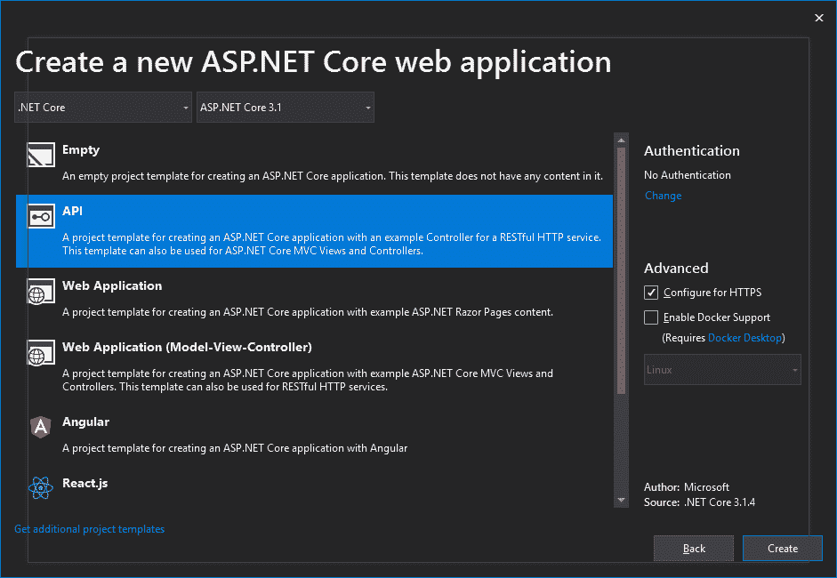
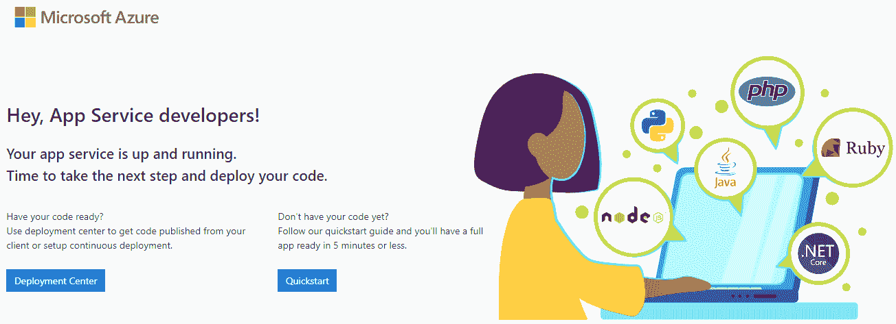
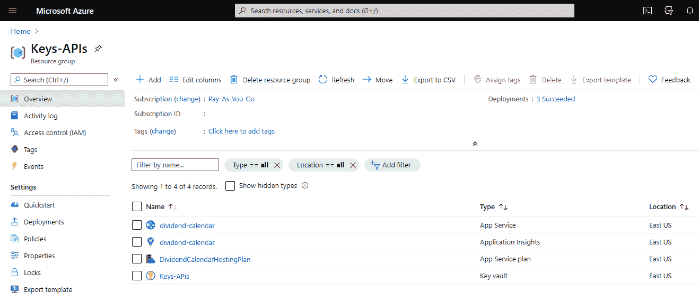
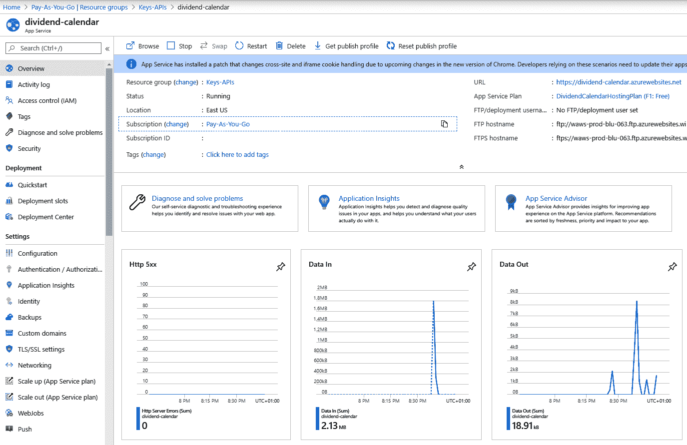
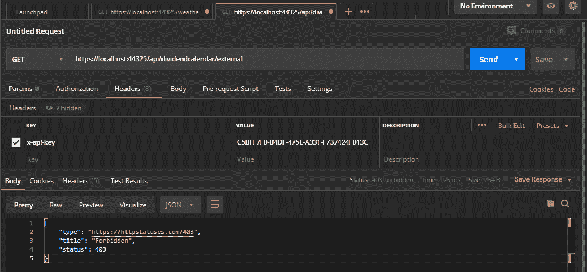
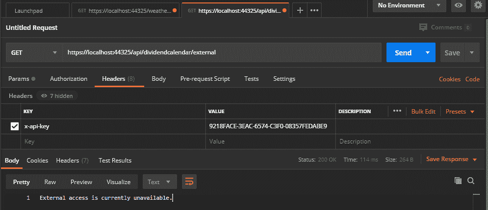

# 第十章：使用 API 密钥和 Azure Key Vault 保护 API

在本章中，我们将看到如何在 Azure Key Vault 中保存秘密。我们还将研究如何使用 API 密钥来通过身份验证和基于角色的授权保护我们自己的密钥。为了获得 API 安全性的第一手经验，我们将构建一个完全功能的 FinTech API。

我们的 API 将使用私钥（在 Azure Key Vault 中安全保存）提取第三方 API 数据。然后，我们将使用两个 API 密钥保护我们的 API；一个密钥将在内部使用，第二个密钥将由外部用户使用。

本章涵盖以下主题：

+   访问 Morningstar API

+   将 Morningstar API 存储在 Azure Key Vault 中

+   在 Azure 中创建股息日历 ASP.NET Core Web 应用程序

+   发布我们的 Web 应用程序

+   使用 API 密钥保护我们的股息日历 API

+   测试我们的 API 密钥安全性

+   添加股息日历代码

+   限制我们的 API

您将了解良好 API 设计的基础知识，并掌握推动 API 能力所需的知识。本章将帮助您获得以下技能：

+   使用客户端 API 密钥保护 API

+   使用 Azure Key Vault 存储和检索秘密

+   使用 Postman 执行发布和获取数据的 API 命令

+   在 RapidAPI.com 上申请并使用第三方 API

+   限制 API 使用

+   编写利用在线财务数据的 FinTech API

在继续之前，请确保您实施以下技术要求，以充分利用本章。

# 技术要求

在本章中，我们将使用以下技术编写 API：

+   Visual Studio 2019 社区版或更高版本

+   您自己的个人 Morningstar API 密钥来自[`rapidapi.com/integraatio/api/morningstar1`](https://rapidapi.com/integraatio/api/morningstar1)

+   RestSharp ([`restsharp.org/`](http://restsharp.org/))

+   Swashbuckle.AspNetCore 5 或更高版本

+   Postman ([`www.postman.com/`](https://www.postman.com/))

+   Swagger ([`swagger.io`](https://swagger.io))

# 进行 API 项目-股息日历

学习的最佳方式是通过实践。因此，我们将构建一个可用的 API 并对其进行安全保护。API 不会完美无缺，还有改进的空间。但是，您可以自由地实施这些改进，并根据需要扩展项目。这里的主要目标是拥有一个完全运作的 API，只做一件事：返回列出当前年度将支付的所有公司股息的财务数据。

我们将在本章中构建的股息日历 API 是一个使用 API 密钥进行身份验证的 API。根据使用的密钥，授权将确定用户是内部用户还是外部用户。然后，控制器将根据用户类型执行适当的方法。只有内部用户方法将被实现，但您可以自由地实施外部用户方法，作为训练练习。

内部方法从 Azure Key Vault 中提取 API 密钥，并执行对第三方 API 的各种 API 调用。数据以**JavaScript 对象表示法**（**JSON**）格式返回，反序列化为对象，然后处理以提取未来的股息支付，并将其添加到股息列表中。然后将此列表以 JSON 格式返回给调用者。最终结果是一个 JSON 文件，其中包含当前年度的所有计划股息支付。然后，最终用户可以将这些数据转换为可以使用 LINQ 查询的股息列表。

我们将在本章中构建的项目是一个 Web API，它从第三方金融 API 返回处理过的 JSON。我们的项目将从给定的股票交易所获取公司列表。然后，我们将循环遍历这些公司以获取它们的股息数据。然后将处理股息数据以获取当前年份的数据。因此，我们最终将返回给 API 调用者的是 JSON 数据。这些 JSON 数据将包含公司列表及其当前年份的股息支付预测。然后，最终用户可以将 JSON 数据转换为 C#对象，并对这些对象执行 LINQ 查询。例如，可以执行查询以获取下个月的除权支付或本月到期的支付。

我们将使用的 API 将是 Morningstar API 的一部分，该 API 可通过 RapidAPI.com 获得。您可以注册一个免费的 Morningstar API 密钥。我们将使用登录系统来保护我们的 API，用户将使用电子邮件地址和密码登录。您还需要 Postman，因为我们将使用它来发出 API 的`POST`和`GET`请求到股息日历 API。

我们的解决方案将包含一个项目，这将是一个 ASP.NET Core 应用程序，目标是.NET Framework Core 3.1 或更高版本。现在我们将讨论如何访问 Morningstar API。

# 访问 Morningstar API

转到[`rapidapi.com/integraatio/api/morningstar1`](https://rapidapi.com/integraatio/api/morningstar1)并请求 API 访问密钥。该 API 是 Freemium API。这意味着您可以在有限的时间内免费使用一定数量的调用，之后需要支付使用费用。花些时间查看 API 及其文档。当您收到密钥时，注意定价计划并保持密钥的机密性。

我们感兴趣的 API 如下：

+   `GET /companies/list-by-exchange`：此 API 返回指定交易所的国家列表。

+   `GET /dividends`：此 API 获取指定公司的所有历史和当前股息支付信息。

API 请求的第一部分是`GET` HTTP 动词，用于检索资源。API 请求的第二部分是要`GET`的资源，在这种情况下是`/companies/list-by-exchange`。正如我们在前面列表的第二个项目符号中所看到的，我们正在获取`/dividends`资源。

您可以在浏览器中测试每个 API，并查看返回的数据。我建议您在继续之前先这样做。这将帮助您对我们将要处理的内容有所了解。我们将使用的基本流程是获取属于指定交易所的公司列表，然后循环遍历它们以获取股息数据。如果股息数据有未来的支付日期，那么股息数据将被添加到日历中；否则，它将被丢弃。无论公司有多少股息数据，我们只对第一条记录感兴趣，这是最新的记录。

现在您已经拥有 API 密钥（假设您正在按照这些步骤进行），我们将开始构建我们的 API。

## 在 Azure Key Vault 中存储 Morningstar API 密钥

我们将使用 Azure Key Vault 和**托管服务标识**（MSI）与 ASP.NET Core Web 应用程序。因此，在继续之前，您将需要 Azure 订阅。对于新客户，可在[`azure.microsoft.com/en-us/free`](https://azure.microsoft.com/en-us/free/)上获得免费 12 个月的优惠。

作为 Web 开发人员，不将机密存储在代码中非常重要，因为代码可以被*反向工程*。如果代码是开源的，那么上传个人或企业密钥到公共版本控制系统存在危险。解决这个问题的方法是安全地存储机密，但这会引发一个困境。要访问机密密钥，我们需要进行身份验证。那么，我们如何克服这个困境呢？

我们可以通过为我们的 Azure 服务启用 MSI 来克服这一困境。因此，Azure 会生成一个服务主体。用户开发的应用程序将使用此服务主体来访问 Microsoft Azure 上的资源。对于服务主体，您可以使用证书或用户名和密码，以及任何您选择的具有所需权限集的角色。

控制 Azure 帐户的人控制每项服务可以执行的具体任务。通常最好从完全限制开始，只有在需要时才添加功能。以下图表显示了我们的 ASP.NET Core Web 应用程序、MSI 和 Azure 服务之间的关系：


**Azure Active Directory**（**Azure AD**）被 MSI 用于注入服务实例的服务主体。一个名为**本地元数据服务**的 Azure 资源用于获取访问仁牌，并将用于验证服务访问 Azure 密钥保管库。

然后，代码调用可用于获取访问令牌的 Azure 资源上的本地元数据服务。然后，我们的代码使用从本地 MSI 端点提取的访问令牌来对 Azure 密钥保管库服务进行身份验证。

打开 Azure CLI 并输入`az login`以登录到 Azure。一旦登录，我们就可以创建一个资源组。Azure 资源组是逻辑容器，用于部署和管理 Azure 资源。以下命令在`East US`位置创建一个资源组：

```cs
az group create --name "<YourResourceGroupName>" --location "East US"
```

在本章的其余部分中都使用此资源组。现在我们将继续创建我们的密钥保管库。创建密钥保管库需要以下信息：

+   密钥保管库的名称，这是一个 3 到 24 个字符长的字符串，只能包含`0-9`、`a-z`、`A-Z`和`-`（连字符）字符

+   资源组的名称

+   位置——例如，`East US`或`West US`

在 Azure CLI 中，输入以下命令：

```cs
az keyvault create --name "<YourKeyVaultName>" --resource-group "<YourResourceGroupName> --location "East US"
```

目前只有您的 Azure 帐户被授权在新的保管库上执行操作。如有必要，您可以添加其他帐户。

我们需要添加到项目中的主要密钥是`MorningstarApiKey`。要将 Morningstar API 密钥添加到您的密钥保管库中，请输入以下命令：

```cs
az keyvault secret set --vault-name "<YourKeyVaultName>" --name "MorningstarApiKey" --value "<YourMorningstarApiKey>"
```

您的密钥保管库现在存储了您的 Morningstar API 密钥。要检查该值是否正确存储，请输入以下命令：

```cs
az keyvault secret show --name "MorningstarApiKey" --vault-name "<YourKeyVaultName>"
```

现在您应该在控制台窗口中看到您的密钥显示，显示存储的密钥和值。

# 在 Azure 中创建股息日历 ASP.NET Core Web 应用程序

要完成项目的这一阶段，您需要安装了 ASP.NET 和 Web 开发工作负载的 Visual Studio 2019：

1.  创建一个新的 ASP.NET Core Web 应用程序：


1.  确保 API 选择了`No Authentication`：



1.  单击“创建”以创建您的新项目。然后运行您的项目。默认情况下，定义了一个示例天气预报 API，并在浏览器窗口中输出以下 JSON 代码：

```cs
[{"date":"2020-04-13T20:02:22.8144942+01:00","temperatureC":0,"temperatureF":32,"summary":"Balmy"},{"date":"2020-04-14T20:02:22.8234349+01:00","temperatureC":13,"temperatureF":55,"summary":"Warm"},{"date":"2020-04-15T20:02:22.8234571+01:00","temperatureC":3,"temperatureF":37,"summary":"Scorching"},{"date":"2020-04-16T20:02:22.8234587+01:00","temperatureC":-2,"temperatureF":29,"summary":"Sweltering"},{"date":"2020-04-17T20:02:22.8234602+01:00","temperatureC":-13,"temperatureF":9,"summary":"Cool"}]
```

接下来，我们将发布我们的应用程序到 Azure。

## 发布我们的 Web 应用程序

在我们可以发布我们的 Web 应用程序之前，我们将首先创建一个新的 Azure 应用服务来发布我们的应用程序。我们将需要一个资源组来包含我们的 Azure 应用服务，以及一个指定托管位置、大小和特性的新托管计划，用于托管我们的应用程序的 Web 服务器群。因此，让我们按照以下要求进行处理：

1.  确保您从 Visual Studio 登录到 Azure 帐户。要创建应用服务，请右键单击刚创建的项目，然后从菜单中选择“发布”。这将显示“选择发布目标”对话框，如下所示：


1.  选择 App Service | 创建新的，并点击创建配置文件。创建一个新的托管计划，如下例所示：


1.  然后，确保您提供一个名称，选择一个订阅，并选择您的资源组。建议您还设置“应用程序洞察”设置：


1.  点击“创建”以创建您的应用服务。创建完成后，您的“发布”屏幕应如下所示：


1.  在这个阶段，您可以点击站点 URL。这将在浏览器中加载您的站点 URL。如果您的服务成功配置并运行，您的浏览器应该显示以下页面：



1.  让我们发布我们的 API。点击“发布”按钮。当网页运行时，它将显示一个错误页面。修改 URL 为`https://dividend-calendar.azurewebsites.net/weatherforecast`。网页现在应该显示天气预报 API 的 JSON 代码：

```cs
[{"date":"2020-04-13T19:36:26.9794202+00:00","temperatureC":40,"temperatureF":103,"summary":"Hot"},{"date":"2020-04-14T19:36:26.9797346+00:00","temperatureC":7,"temperatureF":44,"summary":"Bracing"},{"date":"2020-04-15T19:36:26.9797374+00:00","temperatureC":8,"temperatureF":46,"summary":"Scorching"},{"date":"2020-04-16T19:36:26.9797389+00:00","temperatureC":11,"temperatureF":51,"summary":"Freezing"},{"date":"2020-04-17T19:36:26.9797403+00:00","temperatureC":3,"temperatureF":37,"summary":"Hot"}]
```

我们的服务现在已经上线。如果您登录到 Azure 门户并访问您的托管计划的资源组，您将看到四个资源。这些资源如下：

+   **应用服务**：`dividend-calendar`

+   **应用程序洞察**：`dividend-calendar`

+   **应用服务计划**：``DividendCalendarHostingPlan``

+   **密钥保管库**：无论你的密钥保管库叫什么。在我的案例中，它叫`Keys-APIs`，如下所示：



如果您从 Azure 门户主页([`portal.azure.com/#home`](https://portal.azure.com/#home))点击您的应用服务，您将看到您可以浏览到您的服务，以及停止、重新启动和删除您的应用服务：



现在我们已经在应用程序中使用了应用程序洞察，并且我们的 Morningstar API 密钥已经安全存储，我们可以开始构建我们的股息日历。

# 使用 API 密钥保护我们的股息日历 API

为了保护我们的股息日历 API 的访问，我们将使用客户端 API 密钥。有许多方法可以与客户共享客户端密钥，但我们将不在这里讨论它们。你可以想出自己的策略。我们将专注于如何使客户能够经过身份验证和授权访问我们的 API。

为了保持简单，我们将使用**存储库模式**。存储库模式有助于将我们的程序与底层数据存储解耦。这种模式提高了可维护性，并允许您更改底层数据存储而不影响程序。对于我们的存储库，我们的密钥将在一个类中定义，但在商业项目中，您可以将密钥存储在数据存储中，如 Cosmos DB、SQL Server 或 Azure 密钥保管库。您可以决定最适合您需求的策略，这也是我们使用存储库模式的主要原因，因为您可以控制自己需求的底层数据源。

## 设置存储库

我们将从设置我们的存储库开始：

1.  在您的项目中添加一个名为`Repository`的新文件夹。然后，添加一个名为`IRepository`的新接口和一个将实现`IRepository`的类，名为`InMemoryRepository`。修改您的接口，如下所示：

```cs
using CH09_DividendCalendar.Security.Authentication;
using System.Threading.Tasks;

namespace CH09_DividendCalendar.Repository
{
    public interface IRepository
    {
        Task<ApiKey> GetApiKey(string providedApiKey);
    }
}
```

1.  这个接口定义了一个用于检索 API 密钥的方法。我们还没有定义`ApiKey`类，我们将在稍后进行。现在，让我们实现`InMemoryRepository`。添加以下`using`语句：

```cs
using CH09_DividendCalendar.Security.Authentication;
using CH09_DividendCalendar.Security.Authorisation;
using System;
using System.Collections.Generic;
using System.Linq;
using System.Threading.Tasks;
```

1.  当我们开始添加身份验证和授权类时，将创建`security`命名空间。修改`Repository`类以实现`IRepository`接口。添加将保存我们的 API 密钥的成员变量，然后添加`GetApiKey()`方法：

```cs
    public class InMemoryRepository : IRepository
    {
        private readonly IDictionary<string, ApiKey> _apiKeys;

        public Task<ApiKey> GetApiKey(string providedApiKey)
        {
            _apiKeys.TryGetValue(providedApiKey, out var key);
            return Task.FromResult(key);
        }
    }
```

1.  `InMemoryRepository`类实现了`IRepository`的`GetApiKey()`方法。这将返回一个 API 密钥的字典。这些密钥将存储在我们的`_apiKeys`字典成员变量中。现在，我们将添加我们的构造函数：

```cs
public InMemoryRepository()
{
    var existingApiKeys = new List<ApiKey>
    {
        new ApiKey(1, "Internal", "C5BFF7F0-B4DF-475E-A331-F737424F013C", new DateTime(2019, 01, 01),
            new List<string>
            {
                Roles.Internal
            }),
        new ApiKey(2, "External", "9218FACE-3EAC-6574-C3F0-08357FEDABE9", new DateTime(2020, 4, 15),
            new List<string>
            {
                Roles.External
            })
        };

    _apiKeys = existingApiKeys.ToDictionary(x => x.Key, x => x);
}
```

1.  我们的构造函数创建了一个新的 API 密钥列表。它为内部使用创建了一个内部 API 密钥，为外部使用创建了一个外部 API 密钥。然后将列表转换为字典，并将字典存储在`_apiKeys`中。因此，我们现在已经有了我们的存储库。

1.  我们将使用一个名为`X-Api-Key`的 HTTP 标头。这将存储客户端的 API 密钥，该密钥将传递到我们的 API 进行身份验证和授权。在项目中添加一个名为`Shared`的新文件夹，然后添加一个名为`ApiKeyConstants`的新文件。使用以下代码更新文件：

```cs
namespace CH09_DividendCalendar.Shared
{
    public struct ApiKeyConstants
    {
        public const string HeaderName = "X-Api-Key";
        public const string MorningstarApiKeyUrl 
            = "https://<YOUR_KEY_VAULT_NAME>.vault.azure.net/secrets/MorningstarApiKey";
    }
}
```

这个文件包含两个常量——标头名称，用于建立用户身份的时候使用，以及 Morningstar API 密钥的 URL，它存储在我们之前创建的 Azure 密钥保管库中。

1.  由于我们将处理 JSON 数据，我们需要设置我们的 JSON 命名策略。在项目中添加一个名为`Json`的文件夹。然后，添加一个名为`DefaultJsonSerializerOptions`的类：

```cs
using System.Text.Json;

namespace CH09_DividendCalendar.Json
{
    public static class DefaultJsonSerializerOptions
    {
        public static JsonSerializerOptions Options => new JsonSerializerOptions
        {
            PropertyNamingPolicy = JsonNamingPolicy.CamelCase,
            IgnoreNullValues = true
        };
    }
}
```

`DefaultJsonSerializerOptions`类将我们的 JSON 命名策略设置为忽略空值并使用驼峰命名法。

我们现在将开始为我们的 API 添加身份验证和授权。

## 设置身份验证和授权

我们现在将开始为身份验证和授权的安全类工作。首先澄清一下我们所说的身份验证和授权的含义是很好的。身份验证是确定用户是否被授权访问我们的 API。授权是确定用户一旦获得对我们的 API 的访问权限后拥有什么权限。

### 添加身份验证

在继续之前，将一个`Security`文件夹添加到项目中，然后在该文件夹下添加`Authentication`和`Authorisation`文件夹。我们将首先添加我们的`Authentication`类；我们将添加到`Authentication`文件夹的第一个类是`ApiKey`。向`ApiKey`添加以下属性：

```cs
public int Id { get; }
public string Owner { get; }
public string Key { get; }
public DateTime Created { get; }
public IReadOnlyCollection<string> Roles { get; }
```

这些属性存储与指定 API 密钥及其所有者相关的信息。这些属性是通过构造函数设置的：

```cs
public ApiKey(int id, string owner, string key, DateTime created, IReadOnlyCollection<string> roles)
{
    Id = id;
    Owner = owner ?? throw new ArgumentNullException(nameof(owner));
    Key = key ?? throw new ArgumentNullException(nameof(key));
    Created = created;
    Roles = roles ?? throw new ArgumentNullException(nameof(roles));
}
```

构造函数设置 API 密钥属性。如果一个人身份验证失败，他们将收到一个`Error 403 Unauthorized`的消息。因此，现在让我们定义我们的`UnauthorizedProblemDetails`类：

```cs
public class UnauthorizedProblemDetails : ProblemDetails
{
    public UnauthorizedProblemDetails(string details = null)
    {
        Title = "Forbidden";
        Detail = details;
        Status = 403;
        Type = "https://httpstatuses.com/403";
    }
}
```

这个类继承自`Microsoft.AspNetCore.Mvc.ProblemDetails`类。构造函数接受一个`string`类型的单个参数，默认为`null`。如果需要，您可以将详细信息传递给这个构造函数以提供更多信息。接下来，我们添加`AuthenticationBuilderExtensions`：

```cs
public static class AuthenticationBuilderExtensions
{
    public static AuthenticationBuilder AddApiKeySupport(
        this AuthenticationBuilder authenticationBuilder, 
        Action<ApiKeyAuthenticationOptions> options
    )
    {
        return authenticationBuilder
            .AddScheme<ApiKeyAuthenticationOptions, ApiKeyAuthenticationHandler>            
                (ApiKeyAuthenticationOptions.DefaultScheme, options);
    }
}
```

这个扩展方法将 API 密钥支持添加到身份验证服务中，在`Startup`类的`ConfigureServices`方法中设置。现在，添加`ApiKeyAuthenticationOptions`类：

```cs
public class ApiKeyAuthenticationOptions : AuthenticationSchemeOptions
{
    public const string DefaultScheme = "API Key";
    public string Scheme => DefaultScheme;
    public string AuthenticationType = DefaultScheme;
}
```

`ApiKeyAuthenticationOptions`类继承自`AuthenticationSchemeOptions`类。我们将默认方案设置为使用 API 密钥身份验证。我们授权的最后一部分是构建我们的`ApiKeyAuthenticationHandler`类。顾名思义，这是用于验证 API 密钥，确保客户端被授权访问和使用我们的 API 的主要类：

```cs
public class ApiKeyAuthenticationHandler : AuthenticationHandler<ApiKeyAuthenticationOptions>
{
    private const string ProblemDetailsContentType = "application/problem+json";
    private readonly IRepository _repository;
}
```

我们的`ApiKeyAuthenticationHandler`类继承自`AuthenticationHandler`并使用`ApiKeyAuthenticationOptions`。我们将问题详细信息（异常信息）的内容类型定义为`application/problem+json`。我们还使用`_repository`成员变量提供了 API 密钥存储库的占位符。下一步是声明我们的构造函数：

```cs
public ApiKeyAuthenticationHandler(
    IOptionsMonitor<ApiKeyAuthenticationOptions> options,
    ILoggerFactory logger,
    UrlEncoder encoder,
    ISystemClock clock,
    IRepository repository
) : base(options, logger, encoder, clock)
{
    _repository = repository ?? throw new ArgumentNullException(nameof(repository));
}
```

我们的构造函数将`ApiKeyAuthenticationOptions`、`ILoggerFactory`、`UrlEncoder`和`ISystemClock`参数传递给基类。明确地，我们设置了存储库。如果存储库为空，我们将抛出一个带有存储库名称的空参数异常。让我们添加我们的`HandleChallengeAsync()`方法：

```cs
protected override async Task HandleChallengeAsync(AuthenticationProperties properties)
{
    Response.StatusCode = 401;
    Response.ContentType = ProblemDetailsContentType;
    var problemDetails = new UnauthorizedProblemDetails();
    await Response.WriteAsync(JsonSerializer.Serialize(problemDetails, 
        DefaultJsonSerializerOptions.Options));
}
```

当用户挑战失败时，`HandleChallengeAsync()`方法返回一个`Error 401 Unauthorized`的响应。现在，让我们添加我们的`HandleForbiddenAsync()`方法：

```cs
protected override async Task HandleForbiddenAsync(AuthenticationProperties properties)
{
    Response.StatusCode = 403;
    Response.ContentType = ProblemDetailsContentType;
    var problemDetails = new ForbiddenProblemDetails();
    await Response.WriteAsync(JsonSerializer.Serialize(problemDetails, 
        DefaultJsonSerializerOptions.Options));
}
```

当用户权限检查失败时，`HandleForbiddenAsync()`方法返回`Error 403 Forbidden`响应。现在，我们需要添加一个最终的方法，返回`AuthenticationResult`：

```cs
protected override async Task<AuthenticateResult> HandleAuthenticateAsync()
{
    if (!Request.Headers.TryGetValue(ApiKeyConstants.HeaderName, out var apiKeyHeaderValues))
        return AuthenticateResult.NoResult();
    var providedApiKey = apiKeyHeaderValues.FirstOrDefault();
    if (apiKeyHeaderValues.Count == 0 || string.IsNullOrWhiteSpace(providedApiKey))
        return AuthenticateResult.NoResult();
    var existingApiKey = await _repository.GetApiKey(providedApiKey);
    if (existingApiKey != null) {
        var claims = new List<Claim> {new Claim(ClaimTypes.Name, existingApiKey.Owner)};
        claims.AddRange(existingApiKey.Roles.Select(role => new Claim(ClaimTypes.Role, role)));
        var identity = new ClaimsIdentity(claims, Options.AuthenticationType);
        var identities = new List<ClaimsIdentity> { identity };
        var principal = new ClaimsPrincipal(identities);
        var ticket = new AuthenticationTicket(principal, Options.Scheme);
        return AuthenticateResult.Success(ticket);
    }
    return AuthenticateResult.Fail("Invalid API Key provided.");
}
```

我们刚刚编写的代码检查我们的标头是否存在。如果标头不存在，则`AuthenticateResult()`返回`None`属性的布尔值`true`，表示此请求未提供任何信息。然后我们检查标头是否有值。如果没有提供值，则`return`值表示此请求未提供任何信息。然后我们使用客户端密钥从我们的存储库中获取我们的服务器端密钥。

如果服务器端的密钥为空，则返回一个失败的`AuthenticationResult()`实例，表示提供的 API 密钥无效，如`Exception`类型的`Failure`属性中所标识的那样。否则，用户被视为真实，并被允许访问我们的 API。对于有效的用户，我们为他们的身份设置声明，然后返回一个成功的`AuthenticateResult()`实例。

所以，我们已经解决了我们的身份验证问题。现在，我们需要处理我们的授权。

### 添加授权

我们的授权类将被添加到`Authorisation`文件夹中。使用以下代码添加`Roles`结构：

```cs
public struct Roles
{
    public const string Internal = "Internal";
    public const string External = "External";
}
```

我们期望我们的 API 在内部和外部都可以使用。但是，对于我们的最小可行产品，只实现了内部用户的代码。现在，添加`Policies`结构：

```cs
public struct Policies
{
    public const string Internal = nameof(Internal);
    public const string External = nameof(External);
}
```

在我们的`Policies`结构中，我们添加了两个将用于内部和外部客户端的策略。现在，我们将添加`ForbiddenProblemDetails`类：

```cs
public class ForbiddenProblemDetails : ProblemDetails
{
    public ForbiddenProblemDetails(string details = null)
    {
        Title = "Forbidden";
        Detail = details;
        Status = 403;
        Type = "https://httpstatuses.com/403";
    }
}
```

如果一个或多个权限对经过身份验证的用户不可用，这个类提供了禁止的问题详细信息。如果需要，您可以将一个字符串传递到这个类的构造函数中，提供相关信息。

对于我们的授权，我们需要为内部和外部客户端添加授权要求和处理程序。首先，我们将添加`ExternalAuthorisationHandler`类：

```cs
public class ExternalAuthorisationHandler : AuthorizationHandler<ExternalRequirement>
{
    protected override Task HandleRequirementAsync(
        AuthorizationHandlerContext context, 
        ExternalRequirement requirement
    )
    {
        if (context.User.IsInRole(Roles.External))
            context.Succeed(requirement);
        return Task.CompletedTask;
}
 public class ExternalRequirement : IAuthorizationRequirement
 {
 }
```

`ExternalRequirement`类是一个空类，实现了`IAuthorizationRequirement`接口。现在，添加`InternalAuthorisationHandler`类：

```cs
public class InternalAuthorisationHandler : AuthorizationHandler<InternalRequirement>
{
    protected override Task HandleRequirementAsync(
        AuthorizationHandlerContext context, 
        InternalRequirement requirement
    )
    {
        if (context.User.IsInRole(Roles.Internal))
            context.Succeed(requirement);
        return Task.CompletedTask;
    }
}
```

`InternalAuthorisationHandler`类处理内部要求的授权。如果上下文用户被分配到内部角色，则授予权限。否则，将拒绝权限。让我们添加所需的`InternalRequirement`类：

```cs
public class InternalRequirement : IAuthorizationRequirement
{
}
```

在这里，`InternalRequirement`类是一个空类，实现了`IAuthorizationRequirement`接口。

现在我们已经将我们的身份验证和授权类放在了适当的位置。所以，现在是时候更新我们的`Startup`类，将`security`类连接起来。首先修改`Configure()`方法：

```cs
public void Configure(IApplicationBuilder app, IHostEnvironment env)
{
    if (env.IsDevelopment())
    {
        app.UseDeveloperExceptionPage();
    }
    app.UseRouting();
    app.UseAuthentication();
 app.UseAuthorization();
    app.UseEndpoints(endpoints =>
    {
        endpoints.MapControllers();
    });
}
```

`Configure()`方法将异常页面设置为开发人员页面（如果我们处于开发中）。然后请求应用程序使用*routing*将 URI 与我们的控制器中的操作匹配。然后通知应用程序应该使用我们的身份验证和授权方法。最后，从控制器映射应用程序端点。

我们需要更新的最后一个方法来完成我们的 API 密钥身份验证和授权是`ConfigureServices()`方法。我们需要做的第一件事是添加我们的具有 API 密钥支持的身份验证服务：

```cs
services.AddAuthentication(options =>
{
    options.DefaultAuthenticateScheme = ApiKeyAuthenticationOptions.DefaultScheme;
    options.DefaultChallengeScheme = ApiKeyAuthenticationOptions.DefaultScheme;
}).AddApiKeySupport(options => { });
```

在这里，我们设置了默认的身份验证方案。我们使用我们的扩展密钥`AddApiKeySupport()`，如在我们的`AuthenticationBuilderExtensions`类中定义的那样，返回`Microsoft.AspNetCore.Authentication.AuthenticationBuilder`。我们的默认方案设置为 API 密钥，如在我们的`ApiKeyAuthenticationOptions`类中配置的那样。API 密钥是一个常量值，通知身份验证服务我们将使用 API 密钥身份验证。现在，我们需要添加我们的授权服务：

```cs
services.AddAuthorization(options =>
{
    options.AddPolicy(Policies.Internal, policy => policy.Requirements.Add(new InternalRequirement()));
    options.AddPolicy(Policies.External, policy => policy.Requirements.Add(new ExternalRequirement()));
});
```

在这里，我们正在设置我们的内部和外部策略和要求。这些定义在我们的`Policies`、`InternalRequirement`和`ExternalRequirement`类中。

好了，我们已经添加了所有的 API 密钥安全类。因此，我们现在可以使用 Postman 测试我们的 API 密钥身份验证和授权是否有效。

# 测试我们的 API 密钥安全性

在本节中，我们将使用 Postman 测试我们的 API 密钥身份验证和授权。在您的`Controllers`文件夹中添加一个名为`DividendCalendar`的类。更新类如下：

```cs
[ApiController]
[Route("api/[controller]")]
public class DividendCalendar : ControllerBase
{
    [Authorize(Policy = Policies.Internal)]
    [HttpGet("internal")]
    public IActionResult GetDividendCalendar()
    {
        var message = $"Hello from {nameof(GetDividendCalendar)}.";
        return new ObjectResult(message);
    }

    [Authorize(Policy = Policies.External)]
    [HttpGet("external")]
    public IActionResult External()
    {
        var message = "External access is currently unavailable.";
        return new ObjectResult(message);
    }
}
```

这个类将包含我们的股息日历 API 代码功能。尽管在我们的最小可行产品的初始版本中不会使用外部代码，但我们将能够测试我们的内部和外部身份验证和授权。

1.  打开 Postman 并创建一个新的`GET`请求。对于 URL，请使用`https://localhost:44325/api/dividendcalendar/internal`。点击发送：


1.  如您所见，在 API 请求中没有 API 密钥，我们得到了预期的`401 未经授权`状态，以及我们在`ForbiddenProblemDetails`类中定义的禁止 JSON。现在，添加`x-api-key`头，并使用`C5BFF7F0-B4DF-475E-A331-F737424F013C`值。然后，点击发送：


1.  现在您将获得一个`200 OK`的状态。这意味着 API 请求已成功。您可以在正文中看到请求的结果。内部用户将看到`Hello from GetDividendCalendar`。再次运行请求，但更改 URL，使路由为外部而不是内部。因此，URL 应为`https://localhost:44325/api/dividendcalendar/external`：



1.  您应该收到一个`403 禁止`的状态和禁止的 JSON。这是因为 API 密钥是有效的 API 密钥，但路由是为外部客户端而设，外部客户端无法访问内部 API。将`x-api-key`头值更改为`9218FACE-3EAC-6574-C3F0-08357FEDABE9`。然后，点击发送：



您将看到您的状态是`200 OK`，并且正文中有`当前无法访问外部`的文本。

好消息！我们使用 API 密钥身份验证和授权的基于角色的安全系统已经经过测试并且有效。因此，在我们实际添加我们的 FinTech API 之前，我们已经实施并测试了我们的 API 密钥，用于保护我们的 FinTech API。因此，在编写我们实际 API 的一行代码之前，我们已经将 API 的安全性放在首位。现在，我们可以认真开始构建我们的股息日历 API 功能，知道它是安全的。

# 添加股息日历代码

我们的内部 API 只有一个目的，那就是建立今年要支付的股息数组。然而，您可以在此项目的基础上构建，将 JSON 保存到文件或某种类型的数据库中。因此，您只需要每月进行一次内部调用，以节省 API 调用的费用。然而，外部角色可以根据需要从您的文件或数据库中访问数据。

我们已经为我们的股息日历 API 准备好了控制器。这个安全性是为了防止未经身份验证和未经授权的用户访问我们的内部`GetDividendCalendar()`API 端点。因此，现在我们所要做的就是生成股息日历 JSON，我们的方法将返回。

为了让您看到我们将要努力实现的目标，请查看以下截断的 JSON 响应：

```cs
[{"Mic":"XLON","Ticker":"ABDP","CompanyName":"AB Dynamics PLC","DividendYield":0.0,"Amount":0.0279,"ExDividendDate":"2020-01-02T00:00:00","DeclarationDate":"2019-11-27T00:00:00","RecordDate":"2020-01-03T00:00:00","PaymentDate":"2020-02-13T00:00:00","DividendType":null,"CurrencyCode":null},

...

{"Mic":"XLON","Ticker":"ZYT","CompanyName":"Zytronic PLC","DividendYield":0.0,"Amount":0.152,"ExDividendDate":"2020-01-09T00:00:00","DeclarationDate":"2019-12-10T00:00:00","RecordDate":"2020-01-10T00:00:00","PaymentDate":"2020-02-07T00:00:00","DividendType":null,"CurrencyCode":null}]
```

这个 JSON 响应是一个股息数组。股息由`Mic`、`Ticker`、`CompanyName`、`DividendYield`、`Amount`、`ExDividendDate`、`DeclarationDate`、`RecordDate`、`PaymentDate`、`DividendType`和`CurrencyCode`字段组成。在您的项目中添加一个名为`Models`的新文件夹，然后添加以下代码的`Dividend`类：

```cs
public class Dividend
{
    public string Mic { get; set; }
    public string Ticker { get; set; }
    public string CompanyName { get; set; }
    public float DividendYield { get; set; }
    public float Amount { get; set; }
    public DateTime? ExDividendDate { get; set; }
    public DateTime? DeclarationDate { get; set; }
    public DateTime? RecordDate { get; set; }
    public DateTime? PaymentDate { get; set; }
    public string DividendType { get; set; }
    public string CurrencyCode { get; set; }
}
```

让我们看看每个字段代表什么：

+   `Mic`: **ISO 10383 市场识别代码**（**MIC**），这是股票上市的地方。有关更多信息，请参阅[`www.iso20022.org/10383/iso-10383-market-identifier-codes`](https://www.iso20022.org/10383/iso-10383-market-identifier-codes)。

+   `Ticker`: 普通股的股票市场代码。

+   `CompanyName`: 拥有该股票的公司的名称。

+   `DividendYield`: 公司年度股利与股价的比率。股利收益率以百分比计算，并使用*股利收益率=年度股利/股价*公式计算。

+   `Amount`: 每股支付给股东的金额。

+   `ExDividendDate`: 在此日期之前，您必须购买股票才能收到下一个股利支付。

+   `DeclarationDate`: 公司宣布支付股利的日期。

+   `RecordDate`: 公司查看其记录以确定谁将收到股利的日期。

+   `PaymentDate`: 股东收到股利支付的日期。

+   `DividendType`: 这可以是，例如，`现金股利`，`财产股利`，`股票股利`，`分红股`或`清算股利`。

+   `CurrencyCode`: 金额将支付的货币。

我们在`Models`文件夹中需要的下一个类是`Company`类：

```cs
public class Company
    {
        public string MIC { get; set; }
        public string Currency { get; set; }
        public string Ticker { get; set; }
        public string SecurityId { get; set; }
        public string CompanyName { get; set; }
    }
```

`Mic`和`Ticker`字段与我们的`Dividend`类相同。在不同的 API 调用之间，API 使用不同的货币标识符名称。这就是为什么我们在`Dividend`中有`CurrencyCode`，在`Company`中有`Currency`。这有助于 JSON 对象映射过程，以便我们不会遇到格式化异常。

这些字段分别代表以下内容：

+   `Currency`: 用于定价股票的货币

+   `SecurityId`: 普通股的股票市场安全标识符

+   `CompanyName`: 拥有该股票的公司的名称

我们接下来的`Models`类称为`Companies`。这个类用于存储在初始 Morningstar API 调用中返回的公司。我们将循环遍历公司列表，以进行进一步的 API 调用，以获取每家公司的记录，以便我们随后进行 API 调用以获取公司的股利：

```cs
 public class Companies
 {
     public int Total { get; set; }
     public int Offset { get; set; }
     public List<Company> Results { get; set; }
     public string ResponseStatus { get; set; }
 }
```

这些属性分别定义以下内容：

+   `Total`: 从 API 查询返回的记录总数

+   `Offset`: 记录偏移量

+   `Results`: 返回的公司列表

+   `ResponseStatus`: 提供详细的响应信息，特别是如果返回错误的话

现在，我们将添加`Dividends`类。这个类保存了股利的列表，这些股利是通过股利的 Morningstar API 响应返回的：

```cs
public class Dividends
{
        public int Total { get; set; }
        public int Offset { get; set; }
        public List<Dictionary<string, string>> Results { get; set; }
        public ResponseStatus ResponseStatus { get; set; }
    }
```

这些属性与之前定义的相同，除了`Results`属性，它定义了返回指定公司的股利支付列表。

我们需要添加到我们的`Models`文件夹中的最后一个类是`ResponseStatus`类。这主要用于存储错误信息：

```cs
public class ResponseStatus
{
    public string ErrorCode { get; set; }
    public string Message { get; set; }
    public string StackTrace { get; set; }
    public List<Dictionary<string, string>> Errors { get; set; }
    public List<Dictionary<string, string>> Meta { get; set; }
}
```

该类的属性如下：

+   `ErrorCode`: 错误的编号

+   `Message`: 错误消息

+   `StackTrace`: 错误诊断

+   `Errors`: 错误列表

+   `Meta`: 错误元数据列表

我们现在已经准备好了所有需要的模型。现在，我们可以开始进行 API 调用，以建立我们的股利支付日历。在控制器中，添加一个名为`FormatStringDate()`的新方法，如下所示：

```cs
private DateTime? FormatStringDate(string date)
{
    return string.IsNullOrEmpty(date) ? (DateTime?)null : DateTime.Parse(date);
}
```

该方法接受一个字符串日期。如果字符串为 null 或空，则返回 null。否则，解析字符串并传回一个可空的`DateTime`值。我们还需要一个方法，从 Azure 密钥保管库中提取我们的 Morningstar API 密钥：

```cs
private async Task<string> GetMorningstarApiKey()
{
    try
    {
        AzureServiceTokenProvider azureServiceTokenProvider = new AzureServiceTokenProvider();
        KeyVaultClient keyVaultClient = new KeyVaultClient(
            new KeyVaultClient.AuthenticationCallback(
                azureServiceTokenProvider.KeyVaultTokenCallback
            )
        );
        var secret = await keyVaultClient.GetSecretAsync(ApiKeyConstants.MorningstarApiKeyUrl)
                                         .ConfigureAwait(false);
        return secret.Value;
    }
    catch (KeyVaultErrorException keyVaultException)
    {
        return keyVaultException.Message;
    }
}
```

`GetMorningstarApiKey()`方法实例化`AzureServiceTokenProvider`。然后，它创建一个新的`KeyVaultClient`对象类型，执行加密密钥操作。然后，该方法等待从 Azure 密钥保管库获取 Morningstar API 密钥的响应。然后，它传回响应值。如果在处理请求时发生错误，则返回`KeyVaultErrorException.Message`。

在处理股息时，我们首先从证券交易所获取公司列表。然后，我们循环遍历这些公司，并对该证券交易所中的每家公司进行另一个调用以获取每家公司的股息。因此，我们将从通过 MIC 获取公司列表的方法开始。请记住，我们使用`RestSharp`库。因此，如果您还没有安装它，现在是一个很好的时机。

```cs
private Companies GetCompanies(string mic)
{
    var client = new RestClient(
        $"https://morningstar1.p.rapidapi.com/companies/list-by-exchange?Mic={mic}"
    );
    var request = new RestRequest(Method.GET);
    request.AddHeader("x-rapidapi-host", "morningstar1.p.rapidapi.com");
    request.AddHeader("x-rapidapi-key", GetMorningstarApiKey().Result);
    request.AddHeader("accept", "string");
    IRestResponse response = client.Execute(request);
    return JsonConvert.DeserializeObject<Companies>(response.Content);
}
```

我们的`GetCompanies()`方法创建一个新的 REST 客户端，指向检索上市公司列表的 API URL。请求的类型是`GET`请求。我们为`GET`请求添加了三个头部，分别是`x-rapidapi-host`，`x-rapidapi-key`和`accept`。然后，我们执行请求并通过`Companies`模型返回反序列化的 JSON 数据。

现在，我们将编写返回指定交易所和公司的股息的方法。让我们从添加`GetDividends()`方法开始：

```cs
private Dividends GetDividends(string mic, string ticker)
{
    var client = new RestClient(
        $"https://morningstar1.p.rapidapi.com/dividends?Ticker={ticker}&Mic={mic}"
    );
    var request = new RestRequest(Method.GET);
    request.AddHeader("x-rapidapi-host", "morningstar1.p.rapidapi.com");
    request.AddHeader("x-rapidapi-key", GetMorningstarApiKey().Result);
    request.AddHeader("accept", "string");
    IRestResponse response = client.Execute(request);
    return JsonConvert.DeserializeObject<Dividends>(response.Content);
}
```

`GetDividends()`方法与`GetCompanies()`方法相同，只是请求返回指定股票交易所和公司的股息。 JSON 反序列化为`Dividends`对象的实例并返回。

对于我们的最终方法，我们需要将我们的最小可行产品构建到`BuildDividendCalendar()`方法中。这个方法是构建股息日历 JSON 的方法，将返回给客户端：

```cs
private List<Dividend> BuildDividendCalendar()
{
    const string MIC = "XLON";
    var thisYearsDividends = new List<Dividend>();
    var companies = GetCompanies(MIC);
    foreach (var company in companies.Results) {
        var dividends = GetDividends(MIC, company.Ticker);
        if (dividends.Results == null)
            continue;
        var currentDividend = dividends.Results.FirstOrDefault();
        if (currentDividend == null || currentDividend["payableDt"] == null)
            continue;
        var dateDiff = DateTime.Compare(
            DateTime.Parse(currentDividend["payableDt"]), 
            new DateTime(DateTime.Now.Year - 1, 12, 31)
        );
        if (dateDiff > 0) {
            var payableDate = DateTime.Parse(currentDividend["payableDt"]);
            var dividend = new Dividend() {
                Mic = MIC,
                Ticker = company.Ticker,
                CompanyName = company.CompanyName,
                ExDividendDate = FormatStringDate(currentDividend["exDividendDt"]),
                DeclarationDate = FormatStringDate(currentDividend["declarationDt"]),
                RecordDate = FormatStringDate(currentDividend["recordDt"]),
                PaymentDate = FormatStringDate(currentDividend["payableDt"]),
                Amount = float.Parse(currentDividend["amount"])
            };
            thisYearsDividends.Add(dividend);
        }
    }
    return thisYearsDividends;
}
```

在这个 API 的版本中，我们将 MIC 硬编码为`"XLON"`——**伦敦证券交易所**。然而，在未来的版本中，这个方法和公共端点可以更新为接受`request`参数的 MIC。然后，我们添加一个`list`变量来保存今年的股息支付。然后，我们执行我们的 Morningstar API 调用，以提取当前在指定 MIC 上市的公司列表。一旦列表返回，我们循环遍历结果。对于每家公司，我们然后进行进一步的 API 调用，以获取指定 MIC 和股票的完整股息记录。如果公司没有列出股息，那么我们继续下一个迭代并选择下一个公司。

如果公司有股息记录，我们获取第一条记录，这将是最新的股息支付。我们检查可支付日期是否为`null`。如果可支付日期为`null`，那么我们继续下一个迭代，选择下一个客户。如果可支付日期不为`null`，我们检查可支付日期是否大于上一年的 12 月 31 日。如果日期差大于 1，那么我们将向今年的股息列表添加一个新的股息对象。一旦我们遍历了所有公司并建立了今年的股息列表，我们将列表传回给调用方法。

在运行项目之前的最后一步是更新`GetDividendCalendar()`方法以调用`BuildDividendCalendar()`方法：

```cs
[Authorize(Policy = Policies.Internal)]
[HttpGet("internal")]
public IActionResult GetDividendCalendar()
{
    return new ObjectResult(JsonConvert.SerializeObject(BuildDividendCalendar()));
}
```

在`GetDividendCalendar()`方法中，我们从今年的股息序列化列表返回一个 JSON 字符串。因此，如果您在 Postman 中使用内部`x-api-key`变量运行项目，那么大约 20 分钟后，将返回以下 JSON：

```cs
[{"Mic":"XLON","Ticker":"ABDP","CompanyName":"AB Dynamics PLC","DividendYield":0.0,"Amount":0.0279,"ExDividendDate":"2020-01-02T00:00:00","DeclarationDate":"2019-11-27T00:00:00","RecordDate":"2020-01-03T00:00:00","PaymentDate":"2020-02-13T00:00:00","DividendType":null,"CurrencyCode":null},

...

{"Mic":"XLON","Ticker":"ZYT","CompanyName":"Zytronic PLC","DividendYield":0.0,"Amount":0.152,"ExDividendDate":"2020-01-09T00:00:00","DeclarationDate":"2019-12-10T00:00:00","RecordDate":"2020-01-10T00:00:00","PaymentDate":"2020-02-07T00:00:00","DividendType":null,"CurrencyCode":null}]
```

这个查询确实需要很长时间才能运行，大约 20 分钟左右，结果会在一年的时间内发生变化。因此，我们可以使用的一种策略是限制 API 每月运行一次，然后将 JSON 存储在文件或数据库中。然后，这个文件或数据库记录就是您要更新的外部方法调用并传回给外部客户端。让我们将 API 限制为每月运行一次。

# 限制我们的 API

在暴露 API 时，您需要对其进行节流。有许多可用的方法来做到这一点，例如限制同时用户的数量或限制在给定时间内的调用次数。

在这一部分，我们将对我们的 API 进行节流。我们将用来节流 API 的方法是限制我们的 API 每月只能在当月的 25 日运行一次。将以下一行添加到您的`appsettings.json`文件中：

```cs
"MorningstarNextRunDate":  null,
```

这个值将包含下一个 API 可以执行的日期。现在，在项目的根目录添加`AppSettings`类，然后添加以下属性：

```cs
public DateTime? MorningstarNextRunDate { get; set; }
```

这个属性将保存`MorningstarNextRunDate`键的值。接下来要做的是添加我们的静态方法，该方法将被调用以在`appsetting.json`文件中添加或更新应用程序设置：

```cs
public static void AddOrUpdateAppSetting<T>(string sectionPathKey, T value)
{
    try
    {
        var filePath = Path.Combine(AppContext.BaseDirectory, "appsettings.json");
        string json = File.ReadAllText(filePath);
        dynamic jsonObj = Newtonsoft.Json.JsonConvert.DeserializeObject(json);
        SetValueRecursively(sectionPathKey, jsonObj, value);
        string output = Newtonsoft.Json.JsonConvert.SerializeObject(
            jsonObj, 
            Newtonsoft.Json.Formatting.Indented
        );
        File.WriteAllText(filePath, output);
    }
    catch (Exception ex)
    {
        Console.WriteLine("Error writing app settings | {0}", ex.Message);
    }
}
```

`AddOrUpdateAppSetting()`尝试获取`appsettings.json`文件的文件路径。然后从文件中读取 JSON。然后将 JSON 反序列化为`dynamic`对象。然后我们调用我们的方法递归设置所需的值。然后，我们将 JSON 写回同一文件。如果遇到错误，则将错误消息输出到控制台。让我们编写我们的`SetValueRecursively()`方法：

```cs
private static void SetValueRecursively<T>(string sectionPathKey, dynamic jsonObj, T value)
{
    var remainingSections = sectionPathKey.Split(":", 2);
    var currentSection = remainingSections[0];
    if (remainingSections.Length > 1)
    {
        var nextSection = remainingSections[1];
        SetValueRecursively(nextSection, jsonObj[currentSection], value);
    }
    else
    {
        jsonObj[currentSection] = value;
    }
}
```

`SetValueRecursively()`方法在第一个撇号字符处拆分字符串。然后递归处理 JSON，向下移动树。当它到达需要的位置时，也就是找到所需的值时，然后设置该值并返回该方法。将`ThrottleMonthDay`常量添加到`ApiKeyConstants`结构中：

```cs
public const int ThrottleMonthDay = 25;
```

当 API 请求发出时，此常量用于我们的日期检查。在`DividendCalendarController`中，添加`ThrottleMessage()`方法：

```cs
private string ThrottleMessage()
{
    return "This API call can only be made once on the 25th of each month.";
}
```

`ThrottleMessage()`方法只是返回消息，`"此 API 调用只能在每月的 25 日进行一次。"`。现在，添加以下构造函数：

```cs
public DividendCalendarController(IOptions<AppSettings> appSettings)
{
    _appSettings = appSettings.Value;
}
```

这个构造函数为我们提供了访问`appsettings.json`文件中的值。将以下两行添加到您的`Startup.ConfigureServices()`方法的末尾：

```cs
var appSettingsSection = Configuration.GetSection("AppSettings");
services.Configure<AppSettings>(appSettingsSection);
```

这两行使`AppSettings`类能够在需要时动态注入到我们的控制器中。将`SetMorningstarNextRunDate()`方法添加到`DividendCalendarController`类中：

```cs
private DateTime? SetMorningstarNextRunDate()
{
    int month;
    if (DateTime.Now.Day < 25)
        month = DateTime.Now.Month;
    else
        month = DateTime.Now.AddMonths(1).Month;
    var date = new DateTime(DateTime.Now.Year, month, ApiKeyConstants.ThrottleMonthDay);
    AppSettings.AddOrUpdateAppSetting<DateTime?>(
        "MorningstarNextRunDate",
        date
    );
    return date;
}
```

`SetMorningstarNextRunDate()`方法检查当前月份的日期是否小于`25`。如果当前月份的日期小于`25`，则将月份设置为当前月份，以便 API 可以在当月的 25 日运行。否则，对于大于或等于`25`的日期，月份将设置为下个月。然后组装新日期，然后更新`appsettings.json`的`MorningstarNextRunDate`键，返回可空的`DateTime`值：

```cs
private bool CanExecuteApiRequest()
{
    DateTime? nextRunDate = _appSettings.MorningstarNextRunDate;
    if (!nextRunDate.HasValue) 
        nextRunDate = SetMorningstarNextRunDate();
    if (DateTime.Now.Day == ApiKeyConstants.ThrottleMonthDay) {
        if (nextRunDate.Value.Month == DateTime.Now.Month) {
            SetMorningstarNextRunDate();
            return true;
        }
        else {
            return false;
        }
    }
    else {
        return false;
    }
}
```

`CanExecuteApiRequest()`从`AppSettings`类中获取`MorningstarNextRunDate`值的当前值。如果`DateTime?`没有值，则将该值设置并分配给`nextRunDate`本地变量。如果当前月份的日期不等于`ThrottleMonthDay`，则返回`false`。如果当前月份不等于下次运行日期的月份，则返回`false`。否则，我们将下一个 API 运行日期设置为下个月的 25 日，并返回`true`。

最后，我们更新我们的`GetDividendCalendar()`方法，如下所示：

```cs
[Authorize(Policy = Policies.Internal)]
[HttpGet("internal")]
public IActionResult GetDividendCalendar()
{
    if (CanExecuteApiRequest())
        return new ObjectResult(JsonConvert.SerializeObject(BuildDividendCalendar()));
    else
        return new ObjectResult(ThrottleMessage());
}
```

现在，当内部用户调用 API 时，他们的请求将被验证，以查看是否可以运行。如果运行，则返回股息日历的序列化 JSON。否则，我们返回`throttle`消息。

这就完成了我们的项目。

好了，我们完成了我们的项目。它并不完美，还有我们可以做的改进和扩展。下一步是记录我们的 API 并部署 API 和文档。我们还应该添加日志记录和监控。

日志记录对于存储异常详细信息以及跟踪我们的 API 的使用方式非常有用。 监控是一种监视我们的 API 健康状况的方法，这样我们可以在出现问题时收到警报。 这样，我们可以积极地保持我们的 API 正常运行。 我将让您根据需要扩展 API。 这对您来说将是一个很好的学习练习。

下一章将涉及横切关注点。 它将让您了解如何使用方面和属性来处理日志记录和监视。

让我们总结一下我们学到的东西。

# 总结

在本章中，您注册了一个第三方 API 并收到了自己的密钥。 API 密钥存储在您的 Azure 密钥保险库中，并且不被未经授权的客户端访问。 然后，您开始创建了一个 ASP.NET Core Web 应用程序并将其发布到 Azure。 然后，您开始使用身份验证和基于角色的授权来保护 Web 应用程序。

我们设置的授权是使用 API 密钥执行的。 在这个项目中，您使用了两个 API 密钥——一个用于内部使用，一个用于外部使用。 我们使用 Postman 应用程序进行了 API 和 API 密钥安全性的测试。 Postman 是一个非常好的有用的工具，用于测试各种 HTTP 谓词的 HTTP 请求和响应。

然后，您添加了股息日历 API 代码，并基于 API 密钥启用了内部和外部访问。 项目本身执行了许多不同的 API 调用，以建立一份预计向投资者支付股息的公司列表。 项目然后将对象序列化为 JSON 格式，返回给客户端。 最后，该项目被限制为每月运行一次。

因此，通过完成本章，您已经创建了一个 FinTech API，可以每月运行一次。 该 API 将为当年提供股息支付信息。 您的客户可以对此数据进行反序列化，然后对其执行 LINQ 查询，以提取满足其特定要求的数据。

在下一章中，我们将使用 PostSharp 来实现**面向方面的编程**（**AOP**）。 通过我们的 AOP 框架，我们将学习如何在应用程序中管理常见功能，如异常处理，日志记录，安全性和事务。 但在那之前，让我们让您的大脑思考一下您学到了什么。

# 问题

1.  哪个 URL 是托管您自己的 API 并访问第三方 API 的良好来源？

1.  保护 API 所需的两个必要部分是什么？

1.  声明是什么，为什么应该使用它们？

1.  您用 Postman 做什么？

1.  为什么应该使用存储库模式来管理数据存储？

# 进一步阅读

+   [`docs.microsoft.com/en-us/aspnet/web-api/overview/security/individual-accounts-in-web-api`](https://docs.microsoft.com/en-us/aspnet/web-api/overview/security/individual-accounts-in-web-api) 是微软关于 Web API 安全的深入指南。

+   [`docs.microsoft.com/en-us/aspnet/web-forms/overview/older-versions-security/membership/creating-the-membership-schema-in-sql-server-vb`](https://docs.microsoft.com/en-us/aspnet/web-forms/overview/older-versions-security/membership/creating-the-membership-schema-in-sql-server-vb) 讲解了如何创建 ASP.NET 成员数据库。

+   [`www.iso20022.org/10383/iso-10383-market-identifier-codes`](https://www.iso20022.org/10383/iso-10383-market-identifier-codes) 是关于 ISO 10383 MIC 的链接。

+   [`docs.microsoft.com/en-gb/azure/key-vault/vs-key-vault-add-connected-service`](https://docs.microsoft.com/en-gb/azure/key-vault/vs-key-vault-add-connected-service) 讲解了如何使用 Visual Studio Connected Services 将密钥保险库添加到您的 Web 应用程序。

+   [`aka.ms/installazurecliwindows`](https://aka.ms/installazurecliwindows) 是关于 Azure CLI MSI 安装程序的链接。

+   [`docs.microsoft.com/en-us/azure/key-vault/service-to-service-authentication`](https://docs.microsoft.com/en-us/azure/key-vault/service-to-service-authentication) 是 Azure 服务到服务认证的文档。

+   [`azure.microsoft.com/en-gb/free/?WT.mc_id=A261C142F`](https://azure.microsoft.com/en-gb/free/?WT.mc_id=A261C142F) 是您可以注册免费 12 个月 Azure 订阅的地方，如果您是新客户。

+   [`docs.microsoft.com/en-us/azure/key-vault/basic-concepts`](https://docs.microsoft.com/en-us/azure/key-vault/basic-concepts) 介绍了 Azure Key Vault 的基本概念。

+   [`docs.microsoft.com/en-us/azure/app-service/app-service-web-get-started-dotnet`](https://docs.microsoft.com/en-us/azure/app-service/app-service-web-get-started-dotnet) 介绍了在 Azure 中创建.NET Core 应用程序。

+   [`docs.microsoft.com/en-gb/azure/app-service/overview-hosting-plans`](https://docs.microsoft.com/en-gb/azure/app-service/overview-hosting-plans) 提供了 Azure 应用服务计划的概述。

+   [`docs.microsoft.com/en-us/azure/key-vault/tutorial-net-create-vault-azure-web-app`](https://docs.microsoft.com/en-us/azure/key-vault/tutorial-net-create-vault-azure-web-app) 是一个关于在.NET 中使用 Azure Key Vault 与 Azure Web 应用程序的教程。
