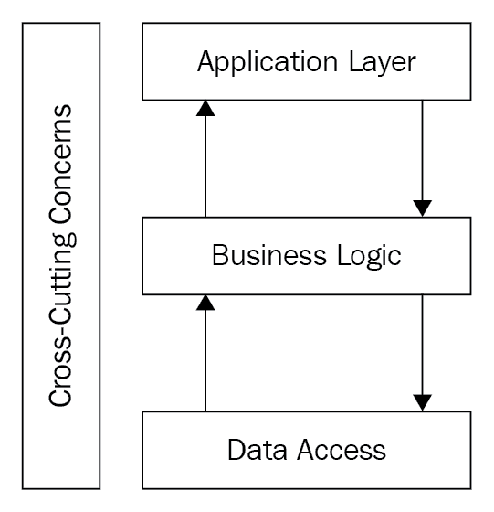
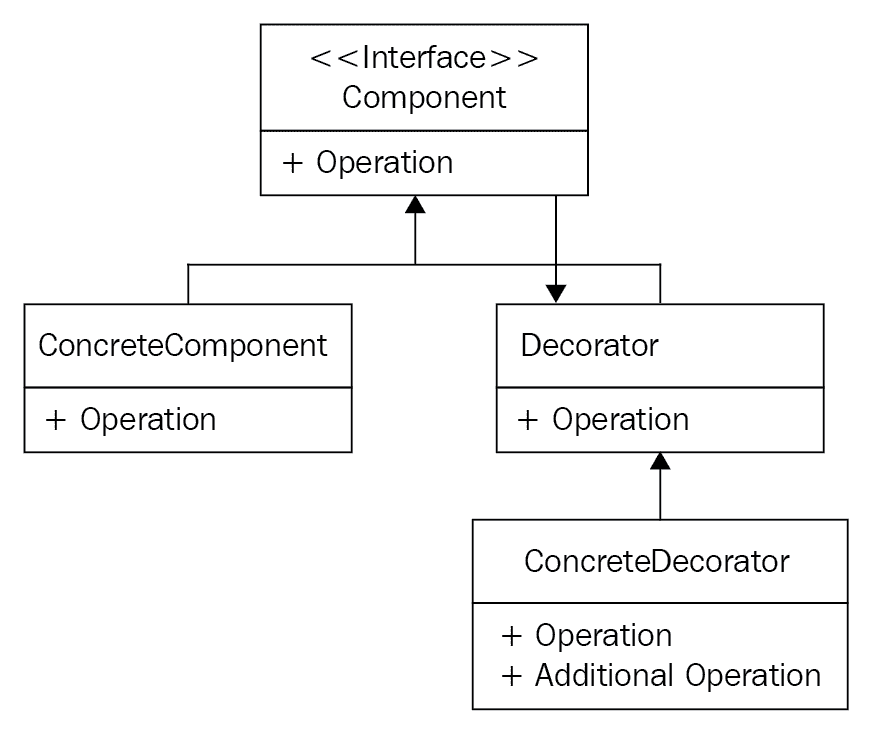
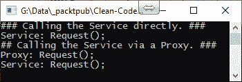
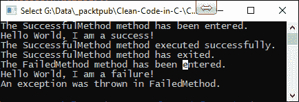

# 第十一章：解决横切关注点

在编写清晰代码时，您需要考虑两种类型的关注点-核心关注点和横切关注点。**核心关注点**是软件的原因以及为什么开发它。**横切关注点**是不属于业务需求的关注点，但必须在代码的所有区域中进行处理，如下图所示：



正是横切关注点，我们将在本章中通过构建一个可重用的类库来进行覆盖，您可以修改或扩展它以满足您的需求。横切关注点包括配置管理、日志记录、审计、安全、验证、异常处理、仪表、事务、资源池、缓存以及线程和并发。我们将使用装饰者模式和 PostSharp Aspect Framework 来帮助我们构建我们的可重用库，该库在编译时注入。

当您阅读本章时，您将看到**属性编程**如何导致使用更少的样板代码，以及更小、更可读、更易于维护和扩展的代码。这样，您的方法中只留下了所需的业务代码和样板代码。

我们已经讨论了许多这些想法。然而，它们在这里再次提到，因为它们是横切关注点。

在本章中，我们将涵盖以下主题：

+   装饰者模式

+   代理模式

+   使用 PostSharp 应用 AOP。

+   项目-横切关注点可重用库

通过本章结束时，您将具备以下技能：

+   实现装饰者模式。

+   实现代理模式。

+   使用 PostSharp 应用 AOP。

+   构建您自己的可重用 AOP 库，以解决您的横切关注点。

# 技术要求

要充分利用本章，您需要安装 Visual Studio 2019 和 PostSharp。有关本章的代码文件，请参阅[`github.com/PacktPublishing/Clean-Code-in-C-/tree/master/CH11`](https://github.com/PacktPublishing/Clean-Code-in-C-/tree/master/CH11)。让我们从装饰者模式开始。

# 装饰者模式

装饰者设计模式是一种结构模式，用于在不改变其结构的情况下向现有对象添加新功能。原始类被包装在装饰类中，并在运行时向对象添加新的行为和操作：



`Component`接口及其包含的成员由`ConcreteComponent`类和`Decorator`类实现。`ConcreteComponent`实现了`Component`接口。`Decorator`类是一个实现`Component`接口并包含对`Component`实例的引用的抽象类。`Decorator`类是组件的基类。`ConcreteDecorator`类继承自`Decorator`类，并为组件提供装饰器。

我们将编写一个示例，将一个操作包装在`try`/`catch`块中。`try`和`catch`都将向控制台输出一个字符串。创建一个名为`CH10_AddressingCrossCuttingConcerns`的新.NET 4.8 控制台应用程序。然后，添加一个名为`DecoratorPattern`的文件夹。添加一个名为`IComponent`的新接口：

```cs
public interface IComponent {
   void Operation();
}
```

为了保持简单，我们的接口只有一个`void`类型的操作。现在我们已经有了接口，我们需要添加一个实现接口的抽象类。添加一个名为`Decorator`的新抽象类，它实现了`IComponent`接口。添加一个成员变量来存储我们的`IComponent`对象：

```cs
private IComponent _component;
```

存储`IComponent`对象的`_component`成员变量是通过构造函数设置的，如下所示：

```cs
public Decorator(IComponent component) {
    _component = component;
}
```

在上述代码中，构造函数设置了我们将要装饰的组件。接下来，我们添加我们的接口方法：

```cs
public virtual void Operation() {
    _component.Operation();
}
```

我们将`Operation()`方法声明为`virtual`，以便可以在派生类中重写它。现在，我们将创建我们的`ConcreteComponent`类，它实现`IComponent`：

```cs
public class ConcreteComponent : IComponent {
    public void Operation() {
        throw new NotImplementedException();
    }
}
```

如您所见，我们的类包括一个操作，它抛出`NotImplementedException`。现在，我们可以写关于`ConcreteDecorator`类：

```cs
public class ConcreteDecorator : Decorator {
    public ConcreteDecorator(IComponent component) : base(component) { }
}
```

`ConcreteDecorator`类继承自`Decorator`类。构造函数接受一个`IComponent`参数，并将其传递给基类构造函数，然后设置成员变量。接下来，我们将重写`Operation()`方法：

```cs
public override void Operation() {
    try {
        Console.WriteLine("Operation: try block.");
        base.Operation();
    } catch(Exception ex)  {
        Console.WriteLine("Operation: catch block.");
        Console.WriteLine(ex.Message);
    }
}
```

在我们重写的方法中，我们有一个`try`/`catch`块。在`try`块中，我们向控制台写入一条消息，并执行基类的`Operation()`方法。在`catch`块中，当遇到异常时，会写入一条消息，然后是错误消息。在我们可以使用我们的代码之前，我们需要更新`Program`类。将`DecoratorPatternExample()`方法添加到`Program`类中：

```cs
private static void DecoratorPatternExample() {
    var concreteComponent = new ConcreteComponent();
    var concreteDecorator = new ConcreteDecorator(concreteComponent);
    concreteDecorator.Operation();
}
```

在我们的`DecoratorPatternExample()`方法中，我们创建一个新的具体组件。然后，我们将其传递给一个新的具体装饰器的构造函数。然后，我们在具体装饰器上调用`Operation()`方法。将以下两行添加到`Main()`方法中：

```cs
DecoratorPatternExample();
Console.ReadKey();
```

这两行执行我们的示例，然后等待用户按键退出。运行代码，您应该看到与以下截图相同的输出：


这就结束了我们对装饰器模式的讨论。现在，是时候来看看代理模式了。

# 代理模式

代理模式是一种结构设计模式，提供作为客户端使用的真实服务对象的替代对象。代理接收客户端请求，执行所需的工作，然后将请求传递给服务对象。代理对象可以与服务对象互换，因为它们共享相同的接口：


您希望使用代理模式的一个例子是当您有一个您不想更改的类，但您需要添加额外的行为时。代理将工作委托给其他对象。除非代理是服务的派生类，否则代理方法应最终引用`Service`对象。

我们将看一个非常简单的代理模式实现。在您的`Chapter 11`项目的根目录下添加一个名为`ProxyPattern`的文件夹。添加一个名为`IService`的接口，其中包含一个处理请求的方法：

```cs
public interface IService {
    void Request();
}
```

`Request()`方法执行执行请求的工作。代理和服务都将实现这个接口来使用`Request()`方法。现在，添加`Service`类并实现`IService`接口：

```cs
public class Service : IService {
    public void Request() {
        Console.WriteLine("Service: Request();");
    }
}
```

我们的`Service`类实现了`IService`接口，并处理实际的服务`Request()`方法。这个`Request()`方法将被`Proxy`类调用。实现代理模式的最后一步是编写`Proxy`类：

```cs
public class Proxy : IService {
    private IService _service;

    public Proxy(IService service) {
        _service = service;
    }

    public void Request() {
        Console.WriteLine("Proxy: Request();");
        _service.Request();
    }
}
```

我们的`Proxy`类实现了`IService`，并具有一个接受单个`IService`参数的构造函数。客户端调用`Proxy`类的`Request()`方法。`Proxy.Request()`方法将执行所需的操作，并负责调用`_service.Request()`。为了看到这一点，让我们更新我们的`Program`类。在`Main()`方法中添加`ProxyPatternExample()`调用。然后，添加`ProxyPatternExample()`方法：

```cs
private static void ProxyPatternExample() {
    Console.WriteLine("### Calling the Service directly. ###");
    var service = new Service();
    service.Request();
    Console.WriteLine("## Calling the Service via a Proxy. ###");
    new Proxy(service).Request();
}
```

我们的测试方法运行`Service`类的`Request()`方法。然后，通过`Proxy`类的`Request()`方法运行相同的方法。运行项目，您应该看到以下内容：



现在您已经对装饰器和代理模式有了工作理解，让我们来看看使用 PostSharp 的 AOP。

# 使用 PostSharp 的 AOP

AOP 可以与 OOP 一起使用。**方面**是应用于类、方法、参数和属性的属性，在编译时，将代码编织到应用的类、方法、参数或属性中。这种方法允许程序的横切关注从业务源代码移动到类库中。关注点在需要时作为属性添加。然后编译器在运行时编织所需的代码。这使得您的业务代码保持简洁和可读。在本章中，我们将使用 PostSharp。您可以从[`www.postsharp.net/download`](https://www.postsharp.net/download)下载它。

那么，AOP 如何与 PostSharp 一起工作呢？

您需要将 PostSharp 包添加到项目中。然后，您可以使用属性对代码进行注释。C#编译器将您的代码构建成二进制代码，然后 PostSharp 分析二进制代码并注入方面的实现。尽管二进制代码在编译时被修改并注入了代码，但您的项目源代码保持不变。这意味着您可以保持代码的整洁、简洁，从而使长期内维护、重用和扩展现有代码库变得更加容易。

PostSharp 有一些非常好的现成模式供您利用。这些模式涵盖了**Model-View-ViewModel**（**MVVM**）、缓存、多线程、日志和架构验证等。但好消息是，如果没有符合您要求的内容，那么您可以通过扩展方面框架和/或架构框架来自动化自己的模式。

使用方面框架，您可以开发简单或复合方面，将其应用于代码，并验证其使用。至于架构框架，您可以开发自定义的架构约束。在我们深入研究横切关注之前，让我们简要地看一下如何扩展方面和架构框架。

在编写方面和属性时，您需要添加`PostSharp.Redist` NuGet 包。完成后，如果发现您的属性和方面不起作用，那么右键单击项目并选择添加 PostSharp 到项目。完成此操作后，您的方面应该可以工作。

## 扩展方面框架

在本节中，我们将开发一个简单的方面并将其应用于一些代码。然后，我们将验证我们方面的使用。

### 开发我们的方面

我们的方面将是一个由单个转换组成的简单方面。我们将从原始方面类派生我们的方面。然后，我们将重写一些称为**建议**的方法。如果您想知道如何创建复合方面，可以在[`doc.postsharp.net/complex-aspects`](https://doc.postsharp.net/complex-aspects)上阅读如何做到这一点。

#### 在方法执行前后注入行为

`OnMethodBoundaryAspect`方面实现了装饰器模式。您已经在本章前面看到了如何实现装饰器模式。通过这个方面，您可以在目标方法执行前后执行逻辑。以下表格提供了`OnMethodBoundaryAspect`类中可用的建议方法列表：

| **建议** | **描述** |
| --- | --- |
| `OnEntry(MethodExecutionArgs)` | 在方法执行开始时使用，用户代码之前。 |
| `OnSuccess(MethodExecutionArgs)` | 在方法执行成功（即没有异常返回）后使用，用户代码之后。 |
| `OnException(MethodExecutionArgs)` | 在方法执行失败并出现异常后使用，用户代码之后。相当于`catch`块。 |
| `OnExit(MethodExecutionArgs)` | 在方法执行退出时使用，无论成功与否或出现异常。此建议在用户代码之后以及当前方面的`OnSuccess(MethodExecutionArgs)`或`OnException(MethodExecutionArgs)`方法之后运行。相当于`finally`块。 |

对于我们简单的方面，我们将查看所有正在使用的方法。在开始之前，将 PostSharp 添加到您的项目中。如果您已经下载了 PostSharp，可以右键单击您的项目，然后选择添加 PostSharp 到项目。之后，添加一个名为`Aspects`的新文件夹到您的项目中，然后添加一个名为`LoggingAspect`的新类：

```cs
[PSerializable]
public class LoggingAspect : OnMethodBoundaryAspect { }
```

`[PSerializeable]`属性是一个自定义属性，当应用于类型时，会导致 PostSharp 生成一个供`PortableFormatter`使用的序列化器。现在，重写`OnEntry()`方法：

```cs
public override void OnEntry(MethodExecutionArgs args) {
    Console.WriteLine("The {0} method has been entered.", args.Method.Name);
}
```

`OnEntry()`方法在任何用户代码之前执行。现在，重写`OnSuccess()`方法：

```cs
public override void OnSuccess(MethodExecutionArgs args) {
    Console.WriteLine("The {0} method executed successfully.", args.Method.Name);
}
```

`OnSuccess()`方法在用户代码完成时执行。重写`OnExit()`方法：

```cs
public override void OnExit(MethodExecutionArgs args) {
    Console.WriteLine("The {0} method has exited.", args.Method.Name);
} 
```

`OnExit()`方法在用户方法成功或失败完成并退出时执行。它相当于一个`finally`块。最后，重写`OnException()`方法：

```cs
public override void OnException(MethodExecutionArgs args) { 
    Console.WriteLine("An exception was thrown in {0}.", args.Method.Name); 
}
```

`OnException()`方法在方法执行失败并出现异常时执行，执行在任何用户代码之后。它相当于一个`catch`块。

下一步是编写两个可以应用`LoggingAspect`的方法。我们将添加`SuccessfulMethod()`：

```cs
[LoggingAspect]
private static void SuccessfulMethod() {
    Console.WriteLine("Hello World, I am a success!");
}
```

`SuccessfulMethod()`使用`LoggingAspect`并在控制台上打印一条消息。现在，让我们添加`FailedMethod()`：

```cs
[LoggingAspect]
private static void FailedMethod() {
    Console.WriteLine("Hello World, I am a failure!");
    var x = 1;
    var y = 0;
    var z = x / y;
}
```

`FailedMethod()`使用`LoggingAspect`并在控制台上打印一条消息。然后，它执行了一个除零操作，导致`DivideByZeroException`。从您的`Main()`方法中调用这两种方法，然后运行您的项目。您应该看到以下输出：



此时，调试器将导致程序退出。就是这样。正如您所看到的，创建自己的 PostSharp 方面以满足您的需求是一个简单的过程。现在，我们将看看如何添加我们自己的架构约束。

## 扩展架构框架

架构约束是采用必须在所有模块中遵守的自定义设计模式。我们将实现一个标量约束，用于验证代码的元素。

我们的标量约束，称为`BusinessRulePatternValidation`，将验证从`BusinessRule`类派生的任何类必须具有名为`Factory`的嵌套类。首先添加`BusinessRulePatternValidation`类：

```cs
[MulticastAttributeUsage(MulticastTargets.Class, Inheritance = MulticastInheritance.Strict)] 
public class BusinessRulePatternValidation : ScalarConstraint { }
```

`MulticastAttributeUsage`指定此验证方面只能与允许类和继承的类一起使用。让我们重写`ValidateCode()`方法：

```cs
public override void CodeValidation(object target)  { 
    var targetType = (Type)target; 
    if (targetType.GetNestedType("Factory") == null) { 
        Message.Write( 
            targetType, SeverityType.Warning, 
            "10", 
            "You must include a 'Factory' as a nested type for {0}.", 
            targetType.DeclaringType, 
            targetType.Name); 
    } 
} 
```

我们的`ValidateCode()`方法检查目标对象是否具有嵌套的`Factory`类型。如果`Factory`类型不存在，则会向输出窗口写入异常消息。添加`BusinessRule`类：

```cs
 [BusinessRulePatternValidation]
 public class BusinessRule  { }
```

`BusinessRule`类是空的，没有`Factory`。它有我们分配给它的`BusinessRulePatternValidation`属性，这是一个架构约束。构建您的项目，您将在输出窗口中看到消息。我们现在将开始构建一个可重用的类库，您可以在自己的项目中扩展和使用它来解决横切关注点，使用 AOP 和装饰器模式。

# 项目-横切关注点可重用库

在本节中，我们将通过编写一个可重用库来解决各种横切关注点的问题。它的功能有限，但它将为您提供进一步扩展项目所需的知识。您将创建的类库将是一个.NET 标准库，以便可以用于同时针对.NET Framework 和.NET Core 的应用程序。您还将创建一个.NET Framework 控制台应用程序，以查看库的运行情况。

首先创建一个名为`CrossCuttingConcerns`的新.NET 标准类库。然后，在解决方案中添加一个名为`TestHarness`的.NET Framework 控制台应用程序。我们将添加可重用的功能来解决各种问题，从缓存开始。

## 添加缓存关注点

**缓存**是一种用于提高访问各种资源时性能的存储技术。使用的缓存可以是内存、文件系统或数据库。您使用的缓存类型将取决于项目的需求。为了演示，我们将使用内存缓存来保持简单。

在`CrossCuttingConcerns`项目中添加一个名为`Caching`的文件夹。然后，添加一个名为`MemoryCache`的类。向项目添加以下 NuGet 包：

+   `PostSharp`

+   `PostSharp.Patterns.Common`

+   `PostSharp.Patterns.Diagnostics`

+   `System.Runtime.Caching`

使用以下代码更新`MemoryCache`类：

```cs
public static class MemoryCache {
    public static T GetItem<T>(string itemName, TimeSpan timeInCache, Func<T> itemCacheFunction) {
        var cache = System.Runtime.Caching.MemoryCache.Default;
        var cachedItem = (T) cache[itemName];
        if (cachedItem != null) return cachedItem;
        var policy = new CacheItemPolicy {AbsoluteExpiration = DateTimeOffset.Now.Add(timeInCache)};
        cachedItem = itemCacheFunction();
        cache.Set(itemName, cachedItem, policy);
        return cachedItem;
    }
}
```

“GetItem（）”方法接受缓存项的名称`itemName`，缓存项保留在缓存中的时间长度`timeInCache`，以及在将项目放入缓存时调用的函数`itemCacheFunction`。在`TestHarness`项目中添加一个新类，命名为`TestClass`。然后，添加“GetCachedItem（）”和“GetMessage（）”方法，如下所示：

```cs
public string GetCachedItem() {
    return MemoryCache.GetItem<string>("Message", TimeSpan.FromSeconds(30), GetMessage);
}

private string GetMessage() {
    return "Hello, world of cache!";
}
```

“GetCachedItem（）”方法从缓存中获取名为`"Message"`的字符串。如果它不在缓存中，那么它将由“GetMessage（）”方法存储在缓存中 30 秒。

在`Program`类中更新您的“Main（）”方法，调用“GetCachedItem（）”方法，如下所示：

```cs
var harness = new TestClass();
Console.WriteLine(harness.GetCachedItem());
Console.WriteLine(harness.GetCachedItem());
Thread.Sleep(TimeSpan.FromSeconds(1));
Console.WriteLine(harness.GetCachedItem());
```

第一次调用“GetCachedItem（）”将项目存储在缓存中，然后返回它。第二次调用从缓存中获取项目并返回它。睡眠线程使缓存无效，因此最后一次调用在返回项目之前将项目存储在缓存中。

## 添加文件日志功能

在我们的项目中，日志记录、审计和仪表化过程将它们的输出发送到文本文件。因此，我们需要一个类来管理如果文件不存在则添加文件，然后将输出添加到这些文件并保存它们。在类库中添加一个名为`FileSystem`的文件夹。然后，添加一个名为`LogFile`的类。将该类设置为`public static`，并添加以下成员变量：

```cs
private static string _location = string.Empty;
private static string _filename = string.Empty;
private static string _file = string.Empty;
```

_location 变量被分配为条目程序集的文件夹。_filename 变量被分配为带有文件扩展名的文件名。我们需要在运行时添加`Logs`文件夹（如果不存在）。因此，我们将在`FileSystem`类中添加“AddDirectory（）”方法：

```cs
private static void AddDirectory() {
    if (!Directory.Exists(_location))
        Directory.CreateDirectory("Logs");
}
```

“AddDirectory（）”方法检查位置是否存在。如果不存在，则创建该目录。接下来，我们需要处理如果文件不存在则添加文件的情况。因此，添加“AddFile（）”方法：

```cs
private static void AddFile() {
    _file = Path.Combine(_location, _filename);
    if (File.Exists(_file)) return;
    using (File.Create($"Logs\\{_filename}")) {

    }
}
```

在“AddFile（）”方法中，我们将位置和文件名组合在一起。如果文件名已经存在，那么我们退出方法；否则，我们创建文件。如果我们不使用`using`语句，当我们创建我们的第一条记录时，我们将遇到`IOException`，但随后的保存将会很好。因此，通过使用`using`语句，我们避免了异常并记录了数据。现在我们可以编写一个实际将数据保存到文件的方法。添加“AppendTextToFile（）”方法：

```cs
public static void AppendTextToFile(string filename, string text) {
    _location = $"{Path.GetDirectoryName(Assembly.GetEntryAssembly()?.Location)}\\Logs";
    _filename = filename;
    AddDirectory();
    AddFile();
    File.AppendAllText(_file, text);
}
```

“AppendTextToFile（）”方法接受文件名和文本，并将位置设置为条目程序集的位置。然后，它确保文件和目录存在。然后，它将文本保存到指定的文件中。现在我们已经处理了文件日志功能，现在我们可以继续查看我们的日志关注。

## 添加日志关注

大多数应用程序都需要某种形式的日志记录。通常的日志记录方法是控制台、文件系统、事件日志和数据库。在我们的项目中，我们只关注控制台和文本文件日志记录。在类库中添加一个名为`Logging`的文件夹。然后，添加一个名为`ConsoleLoggingAspect`的文件，并更新如下：

```cs
[PSerializable]
public class ConsoleLoggingAspect : OnMethodBoundaryAspect { }
```

`[PSerializable]` 属性通知 PostSharp 生成一个供 `PortableFormatter` 使用的序列化器。`ConsoleLoggingAspect` 继承自 `OnMethodBoundaryAspect`。`OnMethodBoundaryAspect` 类有我们可以重写的方法，以在方法主体执行之前、之后、成功执行时以及遇到异常时添加代码。我们将重写这些方法以向控制台输出消息。当涉及调试时，这可能是一个非常有用的工具，以查看代码是否实际被调用，以及它是否成功完成或遇到异常。我们将从重写 `OnEntry()` 方法开始：

```cs
public override void OnEntry(MethodExecutionArgs args) {
    Console.WriteLine($"Method: {args.Method.Name}, OnEntry().");
}
```

`OnEntry()` 方法在我们的方法体执行之前执行，并且我们的重写打印出已执行的方法的名称和它自己的名称。接下来，我们将重写 `OnExit()` 方法：

```cs
public override void OnExit(MethodExecutionArgs args) {
    Console.WriteLine($"Method: {args.Method.Name}, OnExit().");
}
```

`OnExit()` 方法在我们的方法体执行完成后执行，并且我们的重写打印出已执行的方法的名称和它自己的名称。现在，我们将添加 `OnSuccess()` 方法：

```cs
public override void OnSuccess(MethodExecutionArgs args) {
    Console.WriteLine($"Method: {args.Method.Name}, OnSuccess().");
}
```

`OnSuccess()` 方法在应用于方法的主体完成并且没有异常返回后执行。当我们的重写执行时，它打印出已执行的方法的名称和它自己的名称。我们将要重写的最后一个方法是 `OnException()` 方法：

```cs
public override void OnException(MethodExecutionArgs args) {
    Console.WriteLine($"An exception was thrown in {args.Method.Name}. {args}");
}
```

`OnException()` 方法在遇到异常时执行，在我们的重写中，我们打印出方法的名称和参数对象的名称。要应用属性，请使用 `[ConsoleLoggingAspect]`。要添加文本文件日志记录方面，添加一个名为 `TextFileLoggingAspect` 的类。`TextFileLoggingAspect` 与 `ConsoleLoggingAspect` 相同，除了重写方法的内容。`OnEntry()`、`OnExit()` 和 `OnSuccess()` 方法调用 `LogFile.AppendTextToFile()` 方法，并将内容附加到 `Log.txt` 文件中。`OnException()` 方法也是一样，只是它将内容附加到 `Exception.log` 文件中。这是 `OnEntry()` 的示例：

```cs
public override void OnEntry(MethodExecutionArgs args) {
    LogFile.AppendTextToFile("Log.txt", $"\nMethod: {args.Method.Name}, OnEntry().");
}
```

这就是我们的日志记录处理完毕。现在，我们将继续添加我们的异常处理关注。

## 添加异常处理关注

在软件中，用户将不可避免地遇到异常。因此，需要一些方法来记录它们。记录异常的常规方式是将错误存储在用户系统上的文件中，例如 `Exception.log`。这就是我们将在本节中做的。我们将继承自 `OnExceptionAspect` 类，并将我们的异常数据写入 `Exception.log` 文件中，该文件将位于我们应用程序的 `Logs` 文件夹中。`OnExceptionAspect` 将标记的方法包装在 `try`/`catch` 块中。在类库中添加一个名为 `Exceptions` 的新文件夹，然后添加一个名为 `ExceptionAspect` 的文件，其中包含以下代码：

```cs
[PSerializable]
public class ExceptionAspect : OnExceptionAspect {
    public string Message { get; set; }
    public Type ExceptionType { get; set; }
    public FlowBehavior Behavior { get; set; }

    public override void OnException(MethodExecutionArgs args) {
        var message = args.Exception != null ? args.Exception.Message : "Unknown error occured.";
        LogFile.AppendTextToFile(
            "Exceptions.log", $"\n{DateTime.Now}: Method: {args.Method}, Exception: {message}"
        );
        args.FlowBehavior = FlowBehavior.Continue;
    }

    public override Type GetExceptionType(System.Reflection.MethodBase targetMethod) {
        return ExceptionType;
    }
}
```

`ExceptionAspect` 类被分配了 `[PSerializable]` 方面，并继承自 `OnExceptionAspect`。我们有三个属性：`message`、`ExceptionType` 和 `FlowBehavior`。`message` 包含异常消息，`ExceptionType` 包含遇到的异常类型，`FlowBehavior` 决定异常处理后是否继续执行或者进程是否终止。`GetExceptionType()` 方法返回抛出的异常类型。`OnException()` 方法首先构造错误消息。然后通过调用 `LogFile.AppendTextToFile()` 将异常记录到文件中。最后，异常行为的流程被设置为继续。

要使用 `[ExceptionAspect]` 方面的唯一要做的就是将其作为属性添加到您的方法中。我们现在已经涵盖了异常处理。所以，我们将继续添加我们的安全性关注。

## 添加安全性关注

安全需求将针对正在开发的项目而具体。最常见的问题是用户是否经过身份验证并获得授权访问和使用系统的各个部分。在本节中，我们将使用装饰器模式实现具有基于角色的方法的安全组件。

安全本身是一个非常庞大的主题，超出了本书的范围。有许多优秀的 API，例如各种 Microsoft API。有关更多信息，请参阅[`docs.microsoft.com/en-us/dotnet/standard/security/`](https://docs.microsoft.com/en-us/dotnet/standard/security/)，有关 OAuth 2.0，请参阅[`oauth.net/code/dotnet/`](https://oauth.net/code/dotnet/)。我们将让您选择并实现自己的安全方法。在本章中，我们只是使用装饰器模式添加了我们自己定义的安全性。您可以将其用作实现任何前述安全方法的基础。

新增一个名为`Security`的文件夹，并为其添加一个名为`ISecureComponent`的接口：

```cs
public interface ISecureComponent {
    void AddData(dynamic data);
    int EditData(dynamic data);
    int DeleteData(dynamic data);
    dynamic GetData(dynamic data);
}
```

我们的安全组件接口包含前面的四种方法，这些方法都是不言自明的。`dynamic`关键字意味着可以将任何类型的数据作为参数传递，并且可以从`GetData()`方法返回任何类型的数据。接下来，我们需要一个实现接口的抽象类。添加一个名为`DecoratorBase`的类，如下所示：

```cs
public abstract class DecoratorBase : ISecureComponent {
    private readonly ISecureComponent _secureComponent;

    public DecoratorBase(ISecureComponent secureComponent) {
        _secureComponent = secureComponent;
    }
}
```

`DecoratorBase`类实现了`ISecureComponent`。我们声明了一个`ISecureComponent`类型的成员变量，并在默认构造函数中设置它。我们需要添加`ISecureComponent`的缺失方法。添加`AddData()`方法：

```cs
public virtual void AddData(dynamic data) {
    _secureComponent.AddData(data);
}
```

此方法将接受任何类型的数据，然后将其传递给`_secureComponent`的`AddData()`方法。为`EditData()`、`DeleteData()`和`GetData()`添加缺失的方法。现在，添加一个名为`ConcreteSecureComponent`的类，该类实现了`ISecureComponent`。对于每个方法，向控制台写入一条消息。对于`DeleteData()`和`EditData()`方法，还返回一个值`1`。对于`GetData()`，返回`"Hi!"`。`ConcreteSecureComponent`类是执行我们感兴趣的安全工作的类。

我们需要一种验证用户并获取其角色的方法。在执行任何方法之前，将检查角色。因此，添加以下结构：

```cs
public readonly struct Credentials {
    public static string Role { get; private set; }

    public Credentials(string username, string password) {
        switch (username)
        {
            case "System" when password == "Administrator":
                Role = "Administrator";
                break;
            case "End" when password == "User":
                Role = "Restricted";
                break;
            default:
                Role = "Imposter";
                break;
        }
    }
}
```

为了保持简单，该结构接受用户名和密码，并设置适当的角色。受限用户的权限比管理员少。我们安全问题的最终类是`ConcreteDecorator`类。添加如下类：

```cs
public class ConcreteDecorator : DecoratorBase {
    public ConcreteDecorator(ISecureComponent secureComponent) : base(secureComponent) { }
}
```

`ConcreteDecorator`类继承自`DecoratorBase`类。我们的构造函数接受`ISecureComponent`类型，并将其传递给基类。添加`AddData()`方法：

```cs
public override void AddData(dynamic data) {
    if (Credentials.Role.Contains("Administrator") || Credentials.Role.Contains("Restricted")) {
        base.AddData((object)data);
    } else {
        throw new UnauthorizedAccessException("Unauthorized");
    }
}
```

`AddMethod()`检查用户的角色是否与允许的`Administrator`和`Restricted`角色匹配。如果用户属于这些角色之一，则在基类中执行`AddData()`方法；否则，抛出`UnauthorizedAccessException`。其他方法遵循相同的模式。重写其他方法，但确保`DeleteData()`方法只能由管理员执行。

现在，让我们开始处理安全问题。在`Program`类的顶部添加以下行：

```cs
private static readonly ConcreteDecorator ConcreteDecorator = new ConcreteDecorator(
    new ConcreteSecureComponent()
);
```

我们声明并实例化一个具体的装饰器对象，并传入具体的安全对象。此对象将在我们的数据方法中引用。更新`Main()`方法，如下所示：

```cs
private static void Main(string[] _) {
    // ReSharper disable once ObjectCreationAsStatement
    new Credentials("End", "User");
    DoSecureWork();
    Console.WriteLine("Press any key to exit.");
    Console.ReadKey();
}
```

我们将用户名和密码分配给`Credentials`结构。这将导致设置`Role`。然后调用`DoWork()`方法。`DoWork()`方法将负责调用数据方法。然后暂停等待用户按任意键并退出。添加`DoWork()`方法：

```cs
private static void DoSecureWork() {
    AddData();
    EditData();
    DeleteData();
    GetData();
}
```

`DoSecureWork()`方法调用每个调用具体装饰器上的数据方法的数据方法。添加`AddData()`方法：

```cs
[ExceptionAspect(consoleOutput: true)]
private static void AddData() {
    ConcreteDecorator.AddData("Hello, world!");
}
```

`[ExceptionAspect]`应用于`AddData()`方法。这将确保任何错误都被记录到`Exceptions.log`文件中。参数设置为`true`，因此错误消息也将打印在控制台窗口中。方法本身调用`ConcreteDecorator`类的`AddData()`方法。按照相同的步骤添加其余的方法。然后运行你的代码。你应该看到以下输出：


现在我们有一个可以工作的基于角色的对象，包括异常处理。我们的下一步是实现验证关注点。

## 添加验证关注点

所有用户输入的数据都应该经过验证，因为它可能是恶意的、不完整的或格式错误的。您需要确保您的数据是干净的，不会造成伤害。对于我们的演示关注点，我们将实现空值验证。首先，在类库中添加一个名为`Validation`的文件夹。然后，添加一个名为`AllowNullAttribute`的新类：

```cs
[AttributeUsage(AttributeTargets.Parameter | AttributeTargets.ReturnValue | AttributeTargets.Property)]
public class AllowNullAttribute : Attribute { }
```

该属性允许参数、返回值和属性上的空值。现在，将`ValidationFlags`枚举添加到同名的新文件中：

```cs
[Flags]
public enum ValidationFlags {
    Properties = 1,
    Methods = 2,
    Arguments = 4,
    OutValues = 8,
    ReturnValues = 16,
    NonPublic = 32,
    AllPublicArguments = Properties | Methods | Arguments,
    AllPublic = AllPublicArguments | OutValues | ReturnValues,
    All = AllPublic | NonPublic
}
```

这些标志用于确定方面可以应用于哪些项。接下来，我们将添加一个名为`ReflectionExtensions`的类：

```cs
public static class ReflectionExtensions {
    private static bool IsCustomAttributeDefined<T>(this ICustomAttributeProvider value) where T 
        : Attribute  {
        return value.IsDefined(typeof(T), false);
    }

    public static bool AllowsNull(this ICustomAttributeProvider value) {
        return value.IsCustomAttributeDefined<AllowNullAttribute>();
    }

    public static bool MayNotBeNull(this ParameterInfo arg) {
        return !arg.AllowsNull() && !arg.IsOptional && !arg.ParameterType.IsValueType;
    }
}
```

`IsCustomAttributeDefined()`方法在该成员上定义了该属性类型时返回`true`，否则返回`false`。`AllowsNull()`方法在已应用`[AllowNull]`属性时返回`true`，否则返回`false`。`MayNotBeNull()`方法检查是否允许空值，参数是否可选，以及参数的值类型。然后通过对这些值进行逻辑`AND`操作来返回一个布尔值。现在是时候添加`DisallowNonNullAspect`了：

```cs
[PSerializable]
public class DisallowNonNullAspect : OnMethodBoundaryAspect {
    private int[] _inputArgumentsToValidate;
    private int[] _outputArgumentsToValidate;
    private string[] _parameterNames;
    private bool _validateReturnValue;
    private string _memberName;
    private bool _isProperty;

    public DisallowNonNullAspect() : this(ValidationFlags.AllPublic) { }

    public DisallowNonNullAspect(ValidationFlags validationFlags) {
        ValidationFlags = validationFlags;
    }

    public ValidationFlags ValidationFlags { get; set; }
}
```

该类应用了`[PSerializable]`属性，以通知 PostSharp 为`PortableFormatter`生成序列化程序。它还继承了`OnMethodBoundaryAspect`类。然后，我们声明变量来保存经过验证的参数名称、返回值验证和成员名称，并检查被验证的项是否是属性。默认构造函数配置为允许验证器应用于所有公共成员。我们还有一个构造函数，它接受一个`ValidationFlags`值和一个`ValidationFlags`属性。现在，我们将重写`CompileTimeValidate()`方法：

```cs
public override bool CompileTimeValidate(MethodBase method) {
    var methodInformation = MethodInformation.GetMethodInformation(method);
    var parameters = method.GetParameters();

    if (!ValidationFlags.HasFlag(ValidationFlags.NonPublic) && !methodInformation.IsPublic) return false;
    if (!ValidationFlags.HasFlag(ValidationFlags.Properties) && methodInformation.IsProperty) 
        return false;
    if (!ValidationFlags.HasFlag(ValidationFlags.Methods) && !methodInformation.IsProperty) return false;

    _parameterNames = parameters.Select(p => p.Name).ToArray();
    _memberName = methodInformation.Name;
    _isProperty = methodInformation.IsProperty;

    var argumentsToValidate = parameters.Where(p => p.MayNotBeNull()).ToArray();

    _inputArgumentsToValidate = ValidationFlags.HasFlag(ValidationFlags.Arguments) ? argumentsToValidate.Where(p => !p.IsOut).Select(p => p.Position).ToArray() : new int[0];

    _outputArgumentsToValidate = ValidationFlags.HasFlag(ValidationFlags.OutValues) ? argumentsToValidate.Where(p => p.ParameterType.IsByRef).Select(p => p.Position).ToArray() : new int[0];

    if (!methodInformation.IsConstructor) {
        _validateReturnValue = ValidationFlags.HasFlag(ValidationFlags.ReturnValues) &&
                                            methodInformation.ReturnParameter.MayNotBeNull();
    }

    var validationRequired = _validateReturnValue || _inputArgumentsToValidate.Length > 0 || _outputArgumentsToValidate.Length > 0;

    return validationRequired;
}
```

该方法确保在编译时正确应用了该方面。如果该方面应用于错误类型的成员，则返回`false`。否则，返回`true`。现在我们将重写`OnEntry()`方法：

```cs
public override void OnEntry(MethodExecutionArgs args) {
    foreach (var argumentPosition in _inputArgumentsToValidate) {
        if (args.Arguments[argumentPosition] != null) continue;
        var parameterName = _parameterNames[argumentPosition];

        if (_isProperty) {
            throw new ArgumentNullException(parameterName, 
                $"Cannot set the value of property '{_memberName}' to null.");
        } else {
            throw new ArgumentNullException(parameterName);
        }
    }
}
```

该方法检查*输入参数*进行验证。如果任何参数为`null`，则会抛出`ArgumentNullException`；否则，该方法将在不抛出异常的情况下退出。现在让我们重写`OnSuccess()`方法：

```cs
public override void OnSuccess(MethodExecutionArgs args) {
    foreach (var argumentPosition in _outputArgumentsToValidate) {
        if (args.Arguments[argumentPosition] != null) continue;
        var parameterName = _parameterNames[argumentPosition];
        throw new InvalidOperationException($"Out parameter '{parameterName}' is null.");
    }

    if (!_validateReturnValue || args.ReturnValue != null) return;

    if (_isProperty) {
        throw new InvalidOperationException($"Return value of property '{_memberName}' is null.");
    }
    throw new InvalidOperationException($"Return value of method '{_memberName}' is null.");
}
```

`OnSuccess()`方法验证*输出参数*。如果任何参数为 null，则会抛出`InvalidOperationException`。接下来我们需要做的是添加一个用于提取方法信息的`private class`。在`DisallowNonNullAspect`类的结束大括号之前，添加以下类：

```cs
private class MethodInformation { }
```

将以下三个构造函数添加到`MethodInformation`类中：

```cs
 private MethodInformation(ConstructorInfo constructor) : this((MethodBase)constructor) {
     IsConstructor = true;
     Name = constructor.Name;
 }

 private MethodInformation(MethodInfo method) : this((MethodBase)method) {
     IsConstructor = false;
     Name = method.Name;
     if (method.IsSpecialName &&
     (Name.StartsWith("set_", StringComparison.Ordinal) ||
     Name.StartsWith("get_", StringComparison.Ordinal))) {
         Name = Name.Substring(4);
         IsProperty = true;
     }
     ReturnParameter = method.ReturnParameter;
 }

 private MethodInformation(MethodBase method)
 {
     IsPublic = method.IsPublic;
 }
```

这些构造函数区分构造函数和方法，并对方法进行必要的初始化。添加以下方法：

```cs
private static MethodInformation CreateInstance(MethodInfo method) {
    return new MethodInformation(method);
}
```

`CreateInstance()`方法根据传入的方法的`MethodInfo`数据创建`MethodInformation`类的新实例，并返回该实例。添加`GetMethodInformation()`方法：

```cs
public static MethodInformation GetMethodInformation(MethodBase methodBase) {
    var ctor = methodBase as ConstructorInfo;
    if (ctor != null) return new MethodInformation(ctor);
    var method = methodBase as MethodInfo;
    return method == null ? null : CreateInstance(method);
}
```

该方法将`methodBase`转换为`ConstructorInfo`并检查是否为`null`。如果`ctor`不为`null`，则基于构造函数生成一个新的`MethodInformation`类。但是，如果`ctor`为`null`，则将`methodBase`转换为`MethodInfo`。如果方法不为`null`，则调用`CreateInstance()`方法，传入该方法。否则，返回`null`。最后，将以下属性添加到类中：

```cs
public string Name { get; private set; }
public bool IsProperty { get; private set; }
public bool IsPublic { get; private set; }
public bool IsConstructor { get; private set; }
public ParameterInfo ReturnParameter { get; private set; }
```

这些属性是应用了该方面的方法的属性。我们现在已经完成了编写验证方面。您现在可以使用验证器通过附加`[AllowNull]`属性来允许空值。您可以通过附加`[DisallowNonNullAspect]`来禁止空值。现在，我们将添加事务关注点。

## 添加事务关注点

事务是必须要完成或回滚的过程。在类库中添加一个名为`Transactions`的新文件夹，然后添加`RequiresTransactionAspect`类：

```cs
[PSerializable]
[AttributeUsage(AttributeTargets.Method)]
public sealed class RequiresTransactionAspect : OnMethodBoundaryAspect {
    public override void OnEntry(MethodExecutionArgs args) {
        var transactionScope = new TransactionScope(TransactionScopeOption.Required);
        args.MethodExecutionTag = transactionScope;
    }

    public override void OnSuccess(MethodExecutionArgs args) {
        var transactionScope = (TransactionScope)args.MethodExecutionTag;
        transactionScope.Complete();
    }

    public override void OnExit(MethodExecutionArgs args) {
        var transactionScope = (TransactionScope)args.MethodExecutionTag;
        transactionScope.Dispose();
    }
}
```

`OnEntry()`方法启动事务，`OnSuccess()`方法完成异常，`OnExit()`方法处理事务。要使用该方面，请在您的方法中添加`[RequiresTransactionAspect]`。要记录任何阻止事务完成的异常，还可以分配`[ExceptionAspect(consoleOutput: false)]`方面。接下来，我们将添加资源池关注点。

## 添加资源池关注点

资源池是在创建和销毁对象的多个实例昂贵时提高性能的好方法。我们将为我们的需求创建一个非常简单的资源池。添加一个名为`ResourcePooling`的文件夹，然后添加`ResourcePool`类：

```cs
public class ResourcePool<T> {
    private readonly ConcurrentBag<T> _resources;
    private readonly Func<T> _resourceGenerator;

    public ResourcePool(Func<T> resourceGenerator) {
        _resourceGenerator = resourceGenerator ??
                                 throw new ArgumentNullException(nameof(resourceGenerator));
        _resources = new ConcurrentBag<T>();
    }

    public T Get() => _resources.TryTake(out T item) ? item : _resourceGenerator();
    public void Return(T item) => _resources.Add(item);
}
```

该类创建一个新的资源生成器，并将资源存储在`ConcurrentBag`中。当请求项目时，它会从池中发出一个资源。如果不存在，则会创建一个并将其添加到池中，并发放给调用者：

```cs
var pool = new ResourcePool<Course>(() => new Course()); // Create a new pool of Course objects.
var course = pool.Get(); // Get course from pool.
pool.Return(course); // Return the course to the pool.
```

您刚刚看到的代码向您展示了如何使用`ResourcePool`类来创建资源池，获取资源并将其返回到资源池中。

## 添加配置设置关注点

配置设置应始终集中。由于桌面应用程序将其设置存储在`app.config`文件中，而 Web 应用程序将其设置存储在`Web.config`文件中，因此我们可以使用`ConfigurationManager`来访问应用程序设置。将`System.Configuration.Configuration` NuGet 库添加到您的类库中并测试测试工具。然后，添加一个名为`Configuration`的文件夹和以下`Settings`类：

```cs
public static class Settings {
    public static string GetAppSetting(string key) {
        return System.Configuration.ConfigurationManager.AppSettings[key];
    }

    public static void SetAppSettings(this string key, string value) {
        System.Configuration.ConfigurationManager.AppSettings[key] = value;
    }
}
```

该类将在`Web.config`文件和`App.config`文件中获取和设置应用程序设置。要在您的文件中包含该类，请添加以下`using`语句：

```cs
using static CrossCuttingConcerns.Configuration.Settings;
```

以下代码向您展示了如何使用这些方法：

```cs
Console.WriteLine(GetAppSetting("Greeting"));
"Greeting".SetAppSettings("Goodbye, my friends!");
Console.WriteLine(GetAppSetting("Greeting"));
```

使用静态导入，您无需包含`class`前缀。您可以扩展`Settings`类以获取连接字符串或在应用程序中执行所需的任何配置。

## 添加仪器化关注点

我们的最终横切关注点是仪器化。我们使用仪器化来分析我们的应用程序，并查看方法执行所需的时间。在类库中添加一个名为`Instrumentation`的文件夹，然后添加`InstrumentationAspect`类，如下所示：

```cs

[PSerializable]
[AttributeUsage(AttributeTargets.Method)]
public class InstrumentationAspect : OnMethodBoundaryAspect {
    public override void OnEntry(MethodExecutionArgs args) {
        LogFile.AppendTextToFile("Profile.log", 
            $"\nMethod: {args.Method.Name}, Start Time: {DateTime.Now}");
        args.MethodExecutionTag = Stopwatch.StartNew();
    }

    public override void OnException(MethodExecutionArgs args) {
        LogFile.AppendTextToFile("Exception.log", 
            $"\n{DateTime.Now}: {args.Exception.Source} - {args.Exception.Message}");
    }

    public override void OnExit(MethodExecutionArgs args) {
        var stopwatch = (Stopwatch)args.MethodExecutionTag;
        stopwatch.Stop();
        LogFile.AppendTextToFile("Profile.log", 
            $"\nMethod: {args.Method.Name}, Stop Time: {DateTime.Now}, Duration: {stopwatch.Elapsed}");
    }
}
```

正如您所看到的，仪器化方面仅适用于方法，记录方法的开始和结束时间，并将配置文件信息记录到`Profile.log`文件中。如果遇到异常，则将异常记录到`Exception.log`文件中。

我们现在拥有一个功能齐全且可重用的横切关注点库。让我们总结一下本章学到的内容。

# 总结

我们学到了一些宝贵的信息。我们首先看了装饰器模式，然后是代理模式。代理模式提供了作为客户端使用的真实服务对象的替代品。代理接收客户端请求，执行必要的工作，然后将请求传递给服务对象。由于代理与它们替代的服务共享相同的接口，它们是可互换的。

在介绍了代理模式之后，我们转向了使用 PostSharp 进行 AOP。我们看到了如何将切面和属性一起使用来装饰代码，以便在编译时注入代码来执行所需的操作，例如异常处理、日志记录、审计和安全性。我们通过开发自己的切面来扩展了切面框架，并研究了如何使用 PostSharp 和装饰器模式来解决配置管理、日志记录、审计、安全性、验证、异常处理、仪器化、事务、资源池、缓存、线程和并发的横切关注点。

在下一章中，我们将看看使用工具来帮助您提高代码质量。但在那之前，测试一下您的知识，然后继续阅读。

# 问题

1.  什么是横切关注点，AOP 代表什么？

1.  什么是切面，如何应用切面？

1.  什么是属性，如何应用属性？

1.  切面和属性如何一起工作？

1.  切面如何与构建过程一起工作？

# 进一步阅读

+   PostSharp 主页：[`www.postsharp.net/`](https://www.postsharp.net/download)
