使用工具来提高代码质量

作为程序员，提高代码质量是您的主要关注点之一。提高代码质量需要利用各种工具。旨在改进代码并加快开发速度的工具包括代码度量衡、快速操作、JetBrains dotTrace 分析器、JetBrains ReSharper 和 Telerik JustDecompile。

这是本章的主要内容，包括以下主题：

+   定义高质量的代码

+   执行代码清理和计算代码度量衡

+   执行代码分析

+   使用快速操作

+   使用 JetBrains dotTrace 分析器

+   使用 JetBrains ReSharper

+   使用 Telerik JustDecompile

通过本章结束时，您将掌握以下技能：

+   使用代码度量衡来衡量软件复杂性和可维护性

+   使用快速操作进行更改

+   使用 JetBrains dotTrace 对代码进行分析和瓶颈分析

+   使用 JetBrains ReSharper 重构代码

+   使用 Telerik JustDecompile 对代码进行反编译和生成解决方案

# 第十三章：技术要求

+   本书的源代码：[`github.com/PacktPublishing/Clean-Code-in-C-`](https://github.com/PacktPublishing/Clean-Code-in-C-)

+   Visual Studio 2019 社区版或更高版本：[`visualstudio.microsoft.com/downloads/`](https://visualstudio.microsoft.com/downloads/)

+   Telerik JustDecompile：[`www.telerik.com/products/decompiler.aspx`](https://www.telerik.com/products/decompiler.aspx)

+   JetBrains ReSharper Ultimate：[`www.jetbrains.com/resharper/download/#section=resharper-installer`](https://www.jetbrains.com/resharper/download/#section=resharper-installer)

# 定义高质量的代码

良好的代码质量是一种重要的软件属性。低质量的代码可能导致财务损失、时间和精力浪费，甚至死亡。高标准的代码将具有性能、可用性、安全性、可扩展性、可维护性、可访问性、可部署性和可扩展性（PASSMADE）的特质。

高性能的代码体积小，只做必要的事情，并且非常快。高性能的代码不会导致系统崩溃。导致系统崩溃的因素包括文件输入/输出（I/O）操作、内存使用和中央处理单元（CPU）使用。性能低下的代码适合重构。

可用性指的是软件在所需性能水平上持续可用。可用性是软件功能时间（tsf）与预期功能总时间（ttef）之比，例如，tsf=700；ttef=744。700 / 744 = 0.9409 = 94.09%的可用性。

安全的代码是指正确验证输入以防止无效数据格式、无效范围数据和恶意攻击，并完全验证和授权其用户的代码。安全的代码也是容错的代码。例如，如果正在从一个账户转账到另一个账户，系统崩溃了，操作应确保数据保持完整，不会从相关账户中取走任何钱。

可扩展的代码是指能够安全处理系统用户数量呈指数增长，而不会导致系统崩溃的代码。因此，无论软件每小时处理一个请求还是一百万个请求，代码的性能都不会下降，也不会因过载而导致停机。

可维护性指的是修复错误和添加新功能的难易程度。可维护的代码应该组织良好，易于阅读。应该低耦合，高内聚，以便代码可以轻松维护和扩展。

可访问的代码是指残障人士可以轻松修改和根据自己的需求使用的代码。例如，具有高对比度的用户界面，为诵读困难和盲人提供的叙述者等。

可部署性关注软件的用户——用户是独立的、远程访问的还是本地网络用户？无论用户类型如何，软件都应该非常容易部署，没有任何问题。

可扩展性指的是通过向应用程序添加新功能来扩展应用程序的容易程度。意大利面代码和高度耦合的代码与低内聚度使这变得非常困难且容易出错。这样的代码很难阅读和维护，也不容易扩展。因此，可扩展的代码是易于阅读、易于维护的代码，因此也易于添加新功能。

从优质代码的 PASSMADE 要求中，您可以轻松推断出未能满足这些要求可能导致的问题。未能满足这些要求将导致性能不佳的代码变得令人沮丧和无法使用。客户会因增加的停机时间而感到恼火。黑客可以利用不安全的代码中的漏洞。随着更多用户加入系统，软件会呈指数级下降。代码将难以修复或扩展，在某些情况下甚至无法修复或扩展。能力有限的用户将无法修改其限制周围的软件，并且部署将成为配置噩梦。

代码度量来拯救。代码度量使开发人员能够衡量代码复杂性和可维护性，从而帮助我们识别需要重构的代码。

使用快速操作，您可以使用单个命令重构 C#代码，例如将代码提取到自己的方法中。JetBrains dotTrace 允许您分析代码并找到性能瓶颈。此外，JetBrains ReSharper 是 Visual Studio 的生产力扩展，使您能够分析代码质量、检测代码异味、强制执行编码标准并重构代码。而 Telerik JustDecompile 则帮助您反编译现有代码进行故障排除，并从中创建中间语言（IL）、C#和 VB.NET 项目。如果您不再拥有源代码并且需要维护或扩展已编译的代码，这将非常有用。您甚至可以为编译后的代码生成调试符号。

让我们深入了解一下提到的工具，首先是代码度量。

# 执行代码清理和计算代码度量

在我们看如何收集代码度量之前，我们首先需要知道它们是什么，以及它们对我们有何用处。代码度量主要涉及软件复杂性和可维护性。它们帮助我们看到如何改进源代码的可维护性并减少源代码的复杂性。

Visual Studio 2019 为您计算的代码度量包括以下内容：

+   可维护性指数：代码可维护性是“应用生命周期管理”（ALM）的重要组成部分。在软件达到寿命终点之前，必须对其进行维护。代码基础越难以维护，源代码在完全替换之前的寿命就越短。与维护现有系统相比，编写新软件以替换不健康的系统需要更多的工作，也更昂贵。代码可维护性的度量称为可维护性指数。该值是 0 到 100 之间的整数值。以下是可维护性指数的评级、颜色和含义：

+   20 及以上的任何值都具有良好可维护性的绿色评级。

+   可维护性一般的代码在 10 到 19 之间，评级为黄色。

+   任何低于 10 的值都具有红色评级，意味着它很难维护。

+   圈复杂度：代码复杂度，也称为圈复杂度，指的是软件中的各种代码路径。路径越多，软件就越复杂。软件越复杂，测试和维护就越困难。复杂的代码可能导致更容易出错的软件发布，并且可能使软件的维护和扩展变得困难。因此，建议将代码复杂度保持在最低限度。

+   继承深度：继承深度和类耦合度受到了一种流行的编程范式的影响，称为面向对象编程（OOP）。在 OOP 中，类能够从其他类继承。被继承的类称为基类。从基类继承的类称为子类。每个类相互继承的数量度量被称为继承深度。

继承层次越深，如果基类中的某些内容发生变化，派生类中出现错误的可能性就越大。理想的继承深度是 1。

+   类耦合：面向对象编程允许类耦合。当一个类被参数、局部变量、返回类型、方法调用、泛型或模板实例化、基类、接口实现、在额外类型上定义的字段和属性装饰直接引用时，就会产生类耦合。

类耦合代码度量确定了类之间的耦合程度。为了使代码更易于维护和扩展，类耦合应该尽量减少。在面向对象编程中，实现这一点的一种方法是使用基于接口的编程。这样，您可以避免直接访问类。这种编程方法的好处是，只要它们实现相同的接口，您就可以随意替换类。质量低劣的代码具有高耦合和低内聚，而高质量的代码具有低耦合和高内聚。

理想情况下，软件应该具有高内聚性和低耦合性，因为这样可以使程序更容易测试、维护和扩展。

+   源代码行数：源代码的完整行数，包括空行，由源代码行数度量。

+   可执行代码行数：可执行代码中的操作数量由可执行代码行数度量。

现在，您已经了解了代码度量是什么，以及 Visual Studio 2019 版本 16.4 及更高版本中提供了哪些度量，现在是时候看到它们的实际效果了：

1.  在 Visual Studio 中打开任何您喜欢的项目。

1.  右键单击项目。

1.  选择分析和代码清理|运行代码清理（Profile 1），如下截图所示：

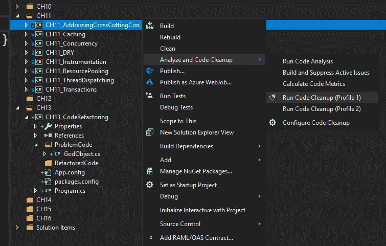

1.  现在，选择计算代码度量。

1.  您应该看到代码度量结果窗口出现，如下截图所示：

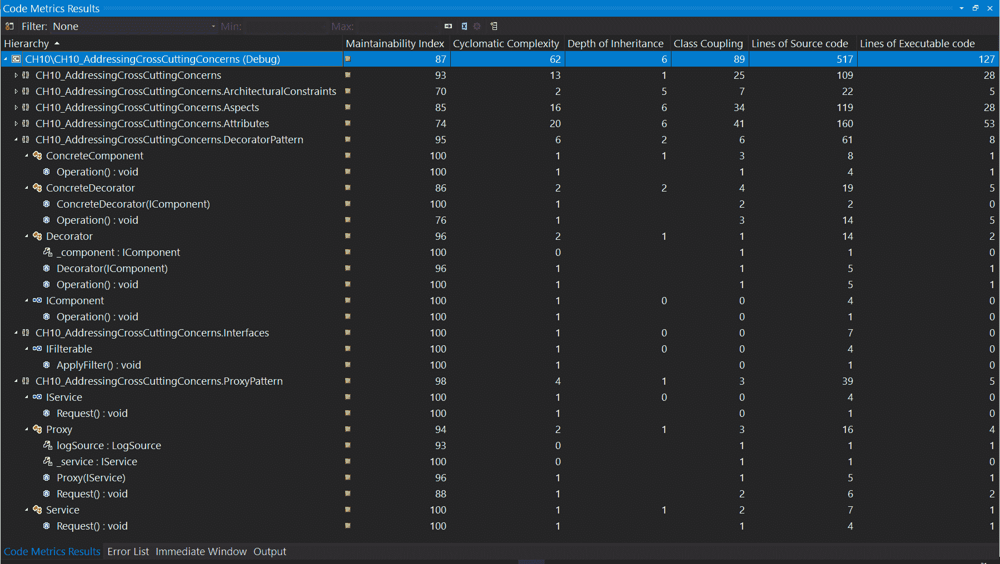

如截图所示，我们所有的类、接口和方法都标有绿色指示器。这意味着所选的项目是可维护的。如果其中任何一行标记为黄色或红色，那么您需要解决它们并重构它们以使其变为绿色。好了，我们已经介绍了代码度量，因此自然而然地，我们继续介绍代码分析。

# 执行代码分析

为了帮助开发人员识别其源代码的潜在问题，微软提供了 Visual Studio 的代码分析工具。代码分析执行静态源代码分析。该工具将识别设计缺陷、全球化问题、安全问题、性能问题和互操作性问题。

打开书中的解决方案，并选择 CH11_AddressingCrossCuttingConcerns 项目。然后，从项目菜单中选择项目|CH11_AddressingCrossCuttingConcerns |属性。在项目的属性页面上，选择代码分析，如下截图所示：


如上面的截图所示，如果您发现推荐的分析器包未安装，请单击“安装”进行安装。安装后，版本号将显示在已安装版本框中。对我来说，它是版本 2.9.6。默认情况下，活动规则是 Microsoft 托管推荐规则。如描述中所示，此规则集的位置是 C:\Program Files (x86)\Microsoft Visual Studio\2019\Professional\Team Tools\Static Analysis Tools\Rule Sets\MinimumRecommendedRules.ruleset。打开文件。它将作为 Visual Studio 工具窗口打开，如下所示：

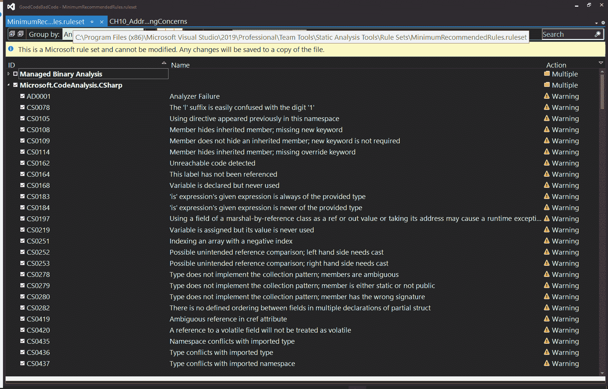

如上面的截图所示，您可以选择和取消选择规则。关闭窗口时，将提示您保存任何更改。要运行代码分析，转到分析和代码清理|代码分析。要查看结果，需要打开错误列表窗口。您可以从“视图”菜单中打开它。

一旦您运行了代码分析，您将看到错误、警告和消息的列表。您可以处理每一个，以提高软件的整体质量。以下截图显示了其中一些示例：


从上面的截图中，您可以看到`CH10_AddressingCrossCuttingConcerns`项目有*32 个警告和 13 个消息*。如果我们处理这些警告和消息，就可以将它们减少到 0 个消息和 0 个警告。因此，现在您已经知道如何使用代码度量来查看软件的可维护性，并对其进行分析以了解您可以做出哪些改进，现在是时候看看快速操作了。

# 使用快速操作

另一个我喜欢使用的方便工具是快速操作工具。在代码行上显示为螺丝刀，灯泡，或错误灯泡，快速操作使您能够使用单个命令生成代码，重构代码，抑制警告，执行代码修复，并添加`using`语句。

由于`CH10_AddressingCrossCuttingConcerns`项目有 32 个警告和 13 个消息，我们可以使用该项目来查看快速操作的效果。看看下面的截图：


看看上面的截图，我们看到第 10 行的灯泡。如果我们点击灯泡，将弹出以下菜单：


如果我们点击“添加 readonly 修饰符”，`readonly`访问修饰符将放置在私有访问修饰符之后。尝试使用快速操作修改代码。一旦掌握了，这是相当简单的。一旦您尝试了快速操作，就可以继续查看 JetBrains dotTrace 分析工具。

# 使用 JetBrains dotTrace 分析工具

JetBrains dotTrace 分析工具是 JetBrains ReSharper Ultimate 许可的一部分。因为我们将同时查看这两个工具，我建议您在继续之前下载并安装 JetBrains ReSharper Ultimate。

如果您还没有拥有副本，JetBrains 确实有试用版本可用。Windows、macOS 和 Linux 都有可用的版本。

JetBrains dotTrace 分析工具适用于 Mono、.NET Framework 和.NET Core。分析工具支持所有应用程序类型，您可以使用分析工具分析和跟踪代码库的性能问题。分析工具将帮助您解决导致 CPU 使用率达到 100%、磁盘 I/O 达到 100%、内存达到最大或遇到溢出异常等问题。

许多应用程序执行超文本传输协议（HTTP）请求。性能分析器将分析应用程序如何处理这些请求，并对数据库上的结构化查询语言（SQL）查询进行相同的分析。还可以对静态方法和单元测试进行性能分析，并可以在 Visual Studio 中查看结果。还有一个独立版本供您使用。

有四种基本的性能分析选项——Sampling、Tracing、Line-by-Line 和 Timeline。第一次开始查看应用程序的性能时，您可能决定使用 Sampling，它提供了准确的调用时间测量。Tracing 和 Line-by-Line 提供了更详细的性能分析，但会给被分析的程序增加更多开销（内存和 CPU 使用）。Timeline 类似于 Sampling，并会随时间收集应用程序事件。在它们之间，没有无法追踪和解决的问题。

高级性能分析选项包括实时性能计数器、线程时间、实时 CPU 指令和线程周期时间。实时性能计数器测量方法进入和退出之间的时间。线程时间测量线程运行时间。基于 CPU 寄存器，实时 CPU 指令提供了方法进入和退出的准确时间。

性能分析器可以附加到正在运行的.NET Framework 4.0（或更高版本）或.NET Core 3.0（或更高版本）应用程序和进程，对本地应用程序和远程应用程序进行性能分析。这些包括独立应用程序；.NET Core 应用程序；Internet 信息服务（IIS）托管的 Web 应用程序；IIS Express 托管的应用程序；.NET Windows 服务；Windows 通信基础（WCF）服务；Windows 商店和通用 Windows 平台（UWP）应用程序；任何.NET 进程（在运行性能分析会话后启动）；基于 Mono 的桌面或控制台应用程序；以及 Unity 编辑器或独立的 Unity 应用程序。

要在 Visual Studio 2019 中从菜单中访问性能分析器，请选择 Extensions | ReSharper | Profile | Show Performance Profiler。在下面的截图中，您可以看到尚未进行性能分析。当前选择要进行性能分析的项目设置为 Basic CH3，并且性能分析类型设置为 Timeline。我们将使用 Sampling 对 CH3 进行性能分析，通过展开时间轴下拉功能并选择 Sampling，如下面的截图所示：


如果要对不同的项目进行采样，请展开项目下拉列表并选择要进行性能分析的项目。项目将被构建，并启动性能分析器。然后您的项目将运行并关闭。结果将显示在 dotTrace 性能分析应用程序中，如下面的截图所示：

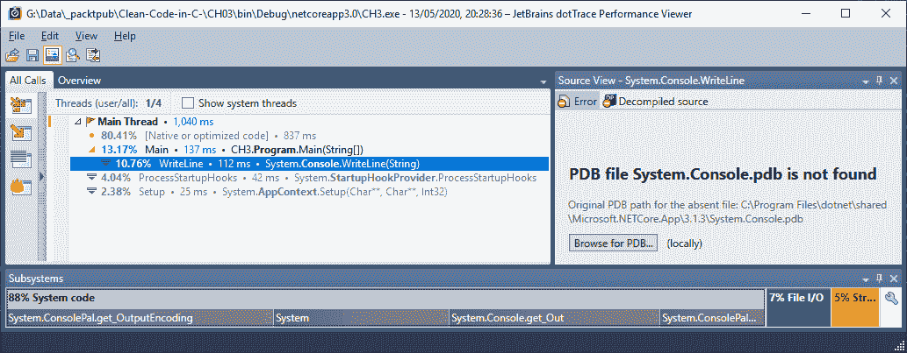

从上面的截图中，您可以看到四个线程中的第一个线程。这是我们程序的线程。其他线程是支持进程的线程，这些支持进程使我们的程序能够运行，还有负责退出程序并清理系统资源的 finalizer 线程。

左侧的所有调用菜单项包括以下内容：

+   线程树

+   调用树

+   普通列表

+   热点

当前选项选择了线程树。让我们来看看下面截图中展开的调用树：

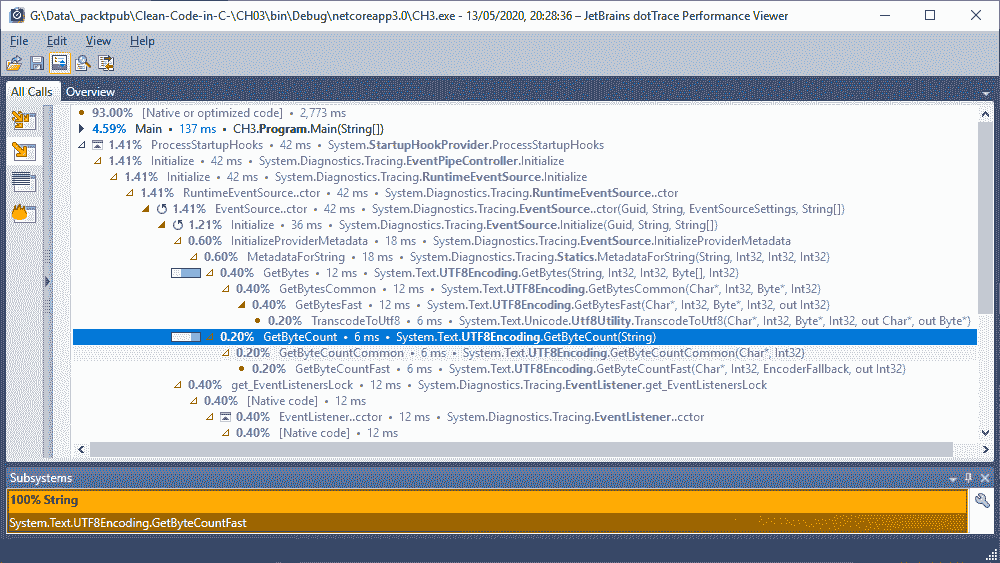

性能分析器为您的代码显示完整的调用树，包括系统代码和您自己的代码。您可以看到调用所花费的时间百分比。这使您能够识别任何运行时间较长的方法并加以解决。

现在，我们来看看普通列表。如下面截图中的普通列表视图所示，我们可以根据以下标准对其进行分组：

+   无

+   类

+   命名空间

+   程序集

您可以在下面的屏幕截图中看到前面的标准：


当您点击列表中的项目时，您可以查看包含该方法的类的源代码。这很有用，因为您可以看到问题所在的代码以及需要做什么。我们将看到的最后一个采样配置文件屏幕是热点视图，如下面的屏幕截图所示：

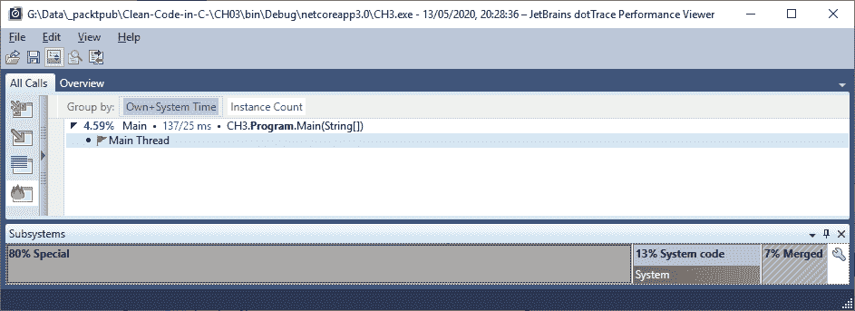

性能分析器显示，主线程（我们代码的起点）只占用了 4.59%的处理时间。如果您点击根，我们的用户代码占了 18%的代码，系统代码占了 72%的代码，如下面的屏幕截图所示：


我们只是用这个性能分析工具触及到了表面。还有更多内容，我鼓励您自己尝试一下。本章的主要目的是向您介绍可用的工具。

有关如何使用 JetBrains dotTrace 的更多信息，我建议您参考他们的在线学习材料，网址为[`www.jetbrains.com/profiler/documentation/documentation.html`](https://www.jetbrains.com/profiler/documentation/documentation.html)。

接下来，我们来看看 JetBrains ReSharper。

# 使用 JetBrains ReSharper

在这一部分，我们将看看 JetBrains ReSharper 如何帮助您改进您的代码。 ReSharper 是一个非常广泛的工具，就像性能分析器一样，它是 ReSharper 的旗舰版的一部分，我们只会触及到表面，但您希望能够欣赏到这个工具是什么，以及它如何帮助您改进您的 Visual Studio 编码体验。以下是使用 ReSharper 的一些好处：

+   使用 ReSharper，您可以对代码质量进行分析。

+   它将提供改进代码、消除代码异味和修复编码问题的选项。

+   通过导航系统，您可以完全遍历您的解决方案并跳转到任何感兴趣的项目。您有许多不同的辅助工具，包括扩展的智能感知、代码重组等。

+   ReSharper 的重构功能可以是局部的，也可以是整个解决方案的。

+   您还可以使用 ReSharper 生成源代码，例如基类和超类，以及内联方法。

+   在这里，可以根据公司的编码政策清理代码，以消除未使用的导入和其他未使用的代码。

您可以从 Visual Studio 2019 扩展菜单中访问 ReSharper 菜单。在代码编辑器中，右键单击代码片段将显示上下文菜单，其中包含适当的菜单项。上下文菜单中的 ReSharper 菜单项是 Refactor This...，如下面的屏幕截图所示：


现在，从 Visual Studio 2019 菜单中运行扩展 | ReSharper | 检查 | 解决方案中的代码问题。 ReSharper 将处理解决方案，然后显示检查结果窗口，如下面的屏幕截图所示：

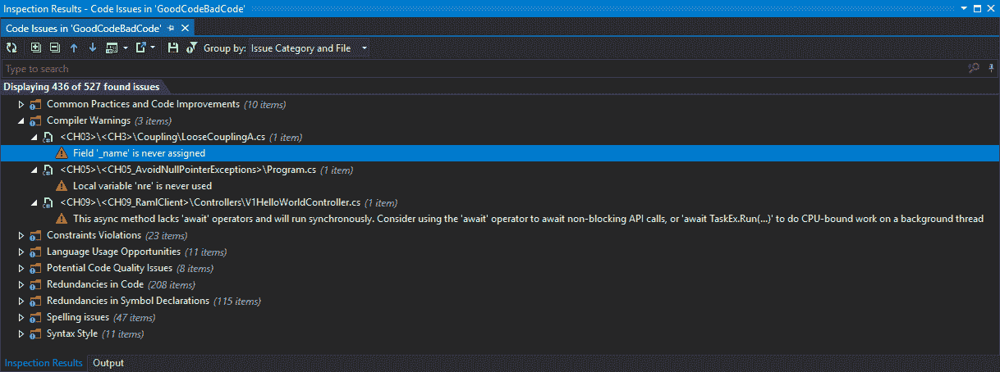

如前面的屏幕截图所示，ReSharper 发现了我们代码中的 527 个问题，其中 436 个正在显示。这些问题包括常见做法和代码改进、编译器警告、约束违规、语言使用机会、潜在的代码质量问题、代码冗余、符号声明冗余、拼写问题和语法风格。

如果我们展开编译器警告，我们会看到有三个问题，如下所示：

+   `_name`字段从未被赋值。

+   `nre`本地变量从未被使用。

+   这个`async`方法缺少`await`操作符，将以同步方式运行。使用`await`操作符等待非阻塞的**应用程序编程接口**（**API**）调用，或者使用`await TaskEx.Run(...)`在后台线程上执行 CPU 绑定的工作。

这些问题是声明的变量没有被赋值或使用，以及一个缺少`await`运算符的`async`方法将以同步方式运行。如果单击第一个警告，它将带您到从未分配的代码行。查看类，您会发现字符串已声明并使用，但从未分配。由于我们检查字符串是否包含`string.Empty`，我们可以将该值分配给声明。因此，更新后的行将如下所示：

```cs
private string _name = string.Empty;
```

由于`_name`变量仍然突出显示，我们可以将鼠标悬停在上面，看看问题是什么。快速操作通知我们，`_name`变量可以标记为只读。让我们添加`readonly`修饰符。所以，现在这行变成了这样：

```cs
private readonly string _name = string.Empty;
```

如果单击刷新按钮，我们将发现发现的问题数量现在是 526。然而，我们解决了两个问题。所以，问题数量应该是 525 吗？好吧，不是。我们解决的第二个问题不是 ReSharper 检测到的问题，而是 Visual Studio 快速操作检测到的改进。因此，ReSharper 显示了它检测到的正确问题数量。

让我们看看`LooseCouplingB`类的潜在代码质量问题。ReSharper 报告了这个方法内可能的`System.NullReferenceException`。让我们先看看代码，如下所示：

```cs
public LooseCouplingB()
{
    LooseCouplingA lca = new LooseCouplingA();
   lca = null;
    Debug.WriteLine($"Name is {lca.Name}");
}
```

果然，我们面对着`System.NullReferenceException`。我们将查看`LooseCouplingA`类，以确认应将哪些成员设置为`null`。另外，要设置的成员是`_name`，如下面的代码片段所示：

```cs
public string Name
{
    get => _name.Equals(string.Empty) ? StringIsEmpty : _name;

    set
    {
        if (value.Equals(string.Empty))
            Debug.WriteLine("Exception: String length must be greater than zero.");
    }
}
```

然而，`_name`正在被检查是否为空。所以，实际上，代码应该将`_name`设置为`string.Empty`。因此，我们在`LooseCouplingB`中修复的构造函数如下：

```cs
public LooseCouplingB()
{
    var lca = new LooseCouplingA
    {
        Name = string.Empty
    };
    Debug.WriteLine($"Name is {lca.Name}");
}
```

现在，如果我们刷新 Inspection Results 窗口，我们的问题列表将减少五个，因为除了正确分配`Name`属性之外，我们利用了语言使用机会来简化我们的实例化和初始化，这是由 ReSharper 检测到的。玩一下这个工具，消除检查结果窗口中发现的问题。

ReSharper 还可以生成*依赖关系图*。要为我们的解决方案生成依赖关系图，请选择 Extensions | ReSharper | Architecture | Show Project Dependency Diagram。这将显示我们解决方案的项目依赖关系图。称为`CH06`的黑色容器框是命名空间，以`CH06_`为前缀的灰色/蓝色框是项目，如下面的屏幕截图所示：

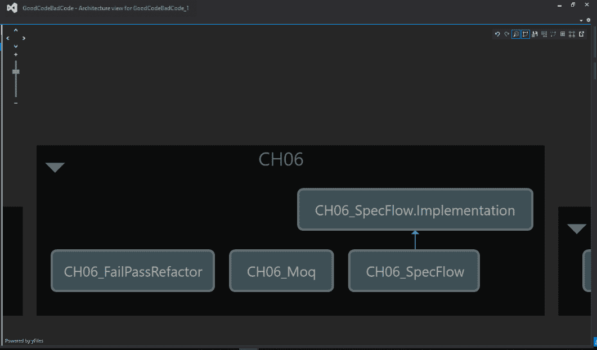

从`CH06`命名空间的项目依赖关系图中可以看出，`CH06_SpecFlow`和`CH06_SpecFlow.Implementation`之间存在项目依赖关系。同样，您还可以使用 ReSharper 生成类型依赖关系图。选择 Extensions | ReSharper | Architecture | Type Dependencies Diagram。

如果我们为`CH10_AddressingCrossCuttingConcerns`项目中的`ConcreteClass`生成图表，那么图表将被生成，但只有`ConcreteComponent`类将被最初显示。右键单击图表上的`ConcreteComponent`框，然后选择 Add All Referenced Types。您将看到`ExceptionAttribute`类和`IComponent`接口的添加。右键单击`ExceptionAttribute`类，然后选择 Add All Referenced Types，您将得到以下结果：

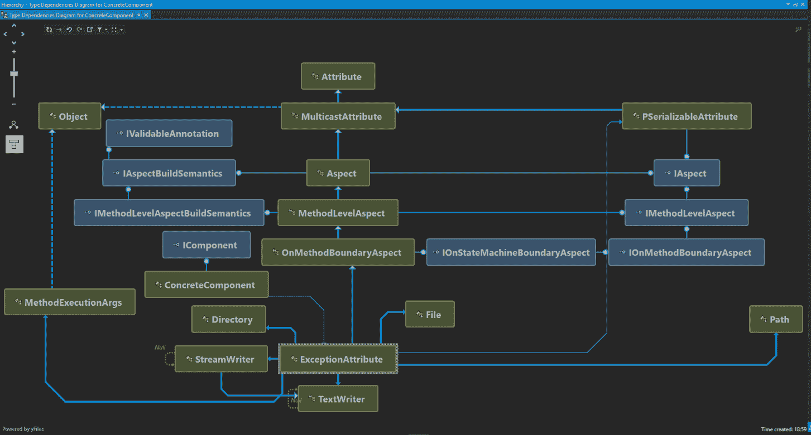

这个工具真正美妙的地方在于你可以按命名空间对图表元素进行排序。对于有多个大型项目和深度嵌套命名空间的庞大解决方案来说，这真的非常有用。虽然我们可以右键单击代码并转到项目声明，但是以可视化的方式看到你正在工作的项目的情况是无可替代的，这就是为什么这个工具非常有用。以下是一个按命名空间组织的类型依赖关系图的示例：

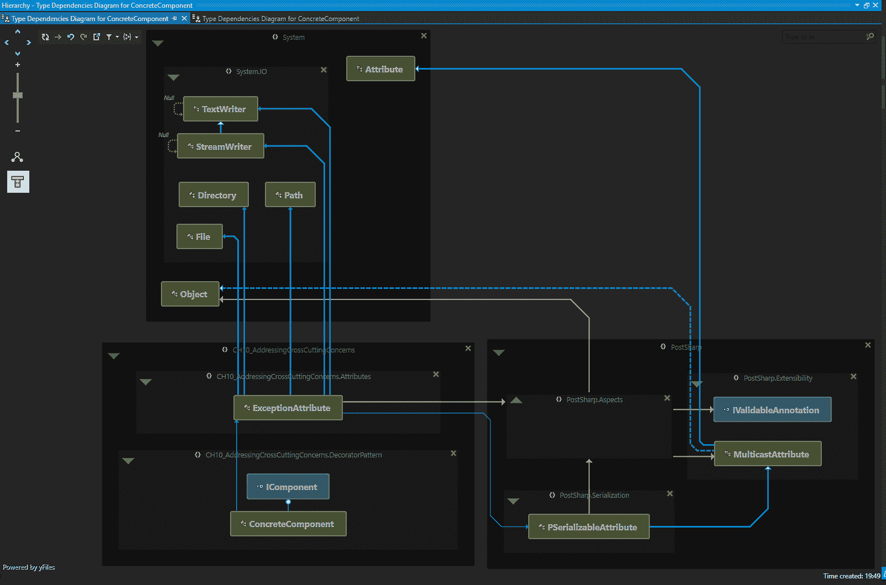

在日常工作中，我真的经常需要这样的图表。这个图表是技术文档，将帮助开发人员了解复杂解决方案。他们将能够看到哪些命名空间是可用的，以及一切是如何相互关联的。这将使开发人员具备正确的知识，知道在进行新开发时应该把新类、枚举和接口放在哪里，但也知道在进行维护时应该在哪里找到对象。这个图表也很适合查找重复的命名空间、接口和对象名称。

现在让我们来看看覆盖率。操作如下：

1.  选择扩展 | ReSharper | 覆盖 | 覆盖应用程序。

1.  覆盖配置对话框将被显示，并且默认选择的选项将是独立运行。

1.  选择你的可执行文件。

1.  你可以从`bin`文件夹中选择一个.NET 应用程序。

1.  以下截图显示了覆盖配置对话框：

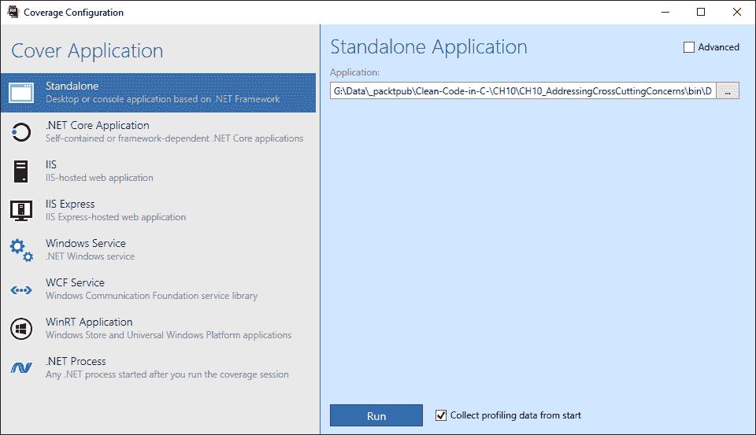

1.  点击运行按钮启动应用程序并收集分析数据。ReSharper 将显示以下对话框：


应用程序将会运行。当应用程序运行时，覆盖分析器将会收集数据。我们选择的可执行文件是一个控制台应用程序，显示如下数据：


1.  点击控制台窗口，然后按任意键退出。覆盖对话框将消失，然后存储将被初始化。最后，覆盖结果浏览器窗口将显示，如下所示：

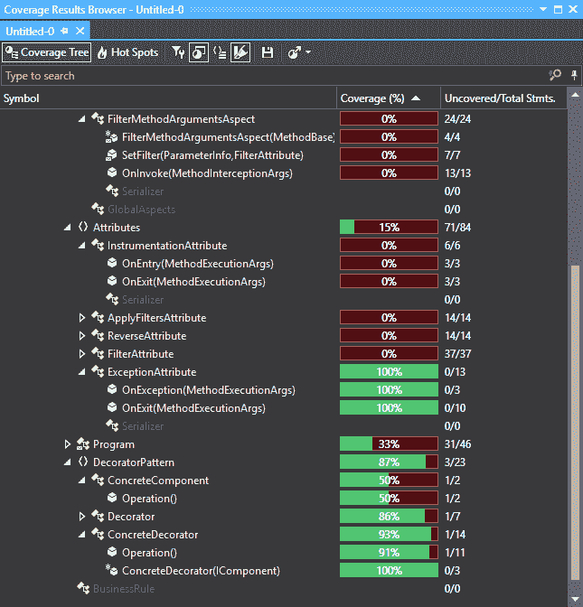

这个窗口包含了非常有用的信息。它提供了代码未被调用的视觉指示，用红色标记。执行的代码用绿色标记。使用这些信息，你可以看到代码是否是可以删除的死代码，或者由于系统路径而未被执行但仍然需要，或者由于测试目的而被注释掉，或者仅仅是因为开发人员忘记在正确的位置添加调用或者条件检查错误而未被调用。

要转到感兴趣的项目，你只需要双击该项目，然后你将被带到你感兴趣的具体代码。我们的`Program`类只覆盖了 33%的代码。所以，让我们双击`Program`，看看问题出在哪里。结果输出如下代码块所示：

```cs
static void Main(string[] args)
{
    LoggingServices.DefaultBackend = new ConsoleLoggingBackend();
    AuditServices.RecordPublished += AuditServices_RecordPublished;
    DecoratorPatternExample();
    //ProxyPatternExample();
    //SecurityExample();

    //ExceptionHandlingAttributeExample();

    //SuccessfulMethod();
    //FailedMethod();

    Console.ReadKey();
}
```

从代码中可以看出，我们的一些代码之所以没有被覆盖是因为调用代码的地方被注释掉了，用于测试目的。我们可以保留代码不变（在这种情况下我们会这样做）。然而，你也可以通过去掉注释来删除死代码或者恢复代码。现在，你知道代码为什么没有被覆盖了。

好了，现在你已经了解了 ReSharper 并且看了一下辅助你编写良好、干净的 C#代码的工具，是时候看看我们的下一个工具了，叫做 Telerik JustDecompile。

# 使用 Telerik JustDecompile

我曾多次使用 Telerik JustDecompile，比如追踪第三方库中的 bug，恢复丢失的项目源代码，检查程序集混淆的强度，以及学习目的。这是一个我强烈推荐的工具，多年来它已经证明了它的价值很多次。

反编译引擎是开源的，你可以从[`github.com/telerik/justdecompileengine`](https://github.com/telerik/justdecompileengine)获取源代码，因此你可以自由地为项目做出贡献并为其编写自己的扩展。你可以从 Telerik 网站下载 Windows 安装程序，网址是[`www.telerik.com/products/decompiler.aspx`](https://www.telerik.com/products/decompiler.aspx)。所有源代码都可以完全导航。反编译器可作为独立应用程序或 Visual Studio 扩展使用。你可以从反编译的程序集创建 VB.NET 或 C#项目，并提取和保存反编译的程序集中的资源。

下载并安装 Telerik JustDecompile。然后我们将进行反编译过程，并从程序集生成一个 C#项目。在安装过程中可能会提示你安装其他工具，但你可以取消选择 Telerik 提供的其他产品。

运行 Telerik JustDecompile 独立应用程序。找到一个.NET 程序集，然后将其拖入 Telerik JustDecompile 的左窗格中。它将对代码进行反编译，并在左侧显示代码树。如果你在左侧选择一个项目，右侧将显示代码，就像屏幕截图中所示的那样：

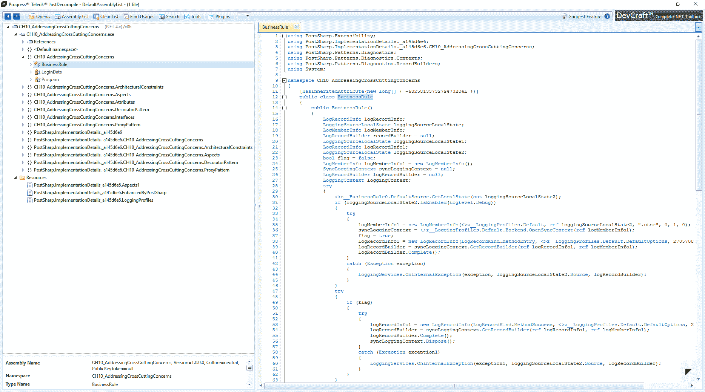

你可以看到，反编译过程非常快速，并且在大多数情况下，它都能很好地完成反编译工作。按照以下步骤进行：

1.  在“插件”菜单项右侧的下拉菜单中，选择 C#。

1.  然后，点击“工具”|“创建项目”。

1.  有时会提示你选择要针对的.NET 版本；有时则不会。

1.  然后，你将被要求保存项目的位置。

1.  项目将会被写入该位置。

然后你可以在 Visual Studio 中打开项目并对其进行操作。如果遇到任何问题，Telerik 会在你的代码中记录问题并提供电子邮件。你可以随时通过电子邮件联系他们。他们擅长回应和解决问题。

好了，我们已经完成了本章中工具的介绍，现在，让我们总结一下我们学到的东西。

# 总结

在本章中，你已经看到代码度量提供了代码质量的几个衡量标准，以及生成这些衡量标准有多么容易。代码度量包括行数（包括空行）与可执行代码行数的比例，圈复杂度，内聚性和耦合性水平，以及代码的可维护性。重构的颜色代码是绿色表示良好，黄色表示理想情况下需要重构，红色表示绝对需要重构。

然后你看到了提供项目的静态代码分析以及查看结果有多么容易。还涵盖了查看和修改规则集，规定了哪些内容会被分析，哪些不会被分析。然后，你体验了快速操作，并看到了如何通过单个命令进行错误修复，添加 using 语句，并重构代码。

然后，我们使用 JetBrains dotTrace 性能分析工具来测量我们应用程序的性能，找出瓶颈，并识别占用大部分处理时间的方法。接下来我们看了 JetBrains ReSharper，它使我们能够检查代码中的各种问题和潜在改进。我们确定了一些问题并进行了必要的更改，看到了使用这个工具改进代码有多么容易。然后，我们看了如何创建依赖关系和类型依赖的架构图。

最后，我们看了 Telerik JustDecompile，这是一个非常有用的工具，可以用来反编译程序集并从中生成 C#或 VB.NET 项目。当遇到错误或需要扩展程序，但无法访问现有源代码时，这将非常有用。

在接下来的章节中，我们将主要关注代码，以及我们如何重构它。但现在，用以下问题测试你的知识，并通过“进一步阅读”部分提供的链接进一步阅读。

# 问题

1.  代码度量是什么，为什么我们应该使用它们？

1.  列举六个代码度量测量。

1.  什么是代码分析，为什么它有用？

1.  什么是快速操作？

1.  JetBrains dotTrace 用于什么？

1.  JetBrains ReSharper 用于什么？

1.  为什么要使用 Telerik JustDecompile 来反编译程序集？

# 进一步阅读

+   官方微软文档关于代码度量：[`docs.microsoft.com/en-us/visualstudio/code-quality/code-metrics-values?view=vs-2019`](https://docs.microsoft.com/en-us/visualstudio/code-quality/code-metrics-values?view=vs-2019)

+   官方微软文档关于快速操作：[`docs.microsoft.com/en-us/visualstudio/ide/quick-actions?view=vs-2019`](https://docs.microsoft.com/en-us/visualstudio/ide/quick-actions?view=vs-2019)

+   JetBrains dotTrace 性能分析器：[`www.jetbrains.com/profiler/`](https://www.jetbrains.com/profiler/)
