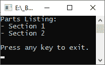
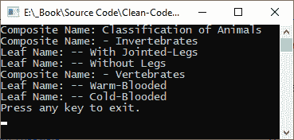
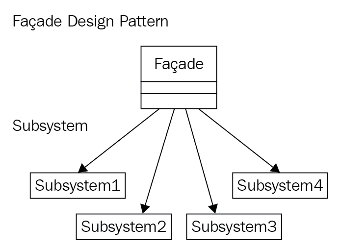

# 第十四章：重构 C#代码——实现设计模式

编写清晰代码的一半战斗在于正确实现和使用设计模式。设计模式本身也可能成为代码异味。当用于过度设计某些相当简单的东西时，设计模式就会成为代码异味。

在本书的前几章中，你已经看到了设计模式在编写清晰代码和重构代码中的应用。具体来说，我们已经实现了适配器模式、装饰器模式和代理模式。这些模式都是以正确的方式实现以完成手头的任务。它们保持简单，绝对不会使代码复杂。因此，当用于其适当的目的时，设计模式在消除代码异味方面确实非常有用，从而使你的代码变得清晰、干净和新鲜。

在这一章中，我们将讨论**四人帮（GoF）**的创建、结构和行为设计模式。设计模式并非一成不变，你不必严格按照它们的实现方式。但是有代码示例可以帮助你从仅仅拥有理论知识过渡到具备正确实现和使用设计模式所需的实际技能。

在本章中，我们将涵盖以下主题：

+   实现创建型设计模式

+   实现结构设计模式

+   行为设计模式的概述

在本章结束时，你将具备以下技能：

+   理解、描述和编程不同的创建型设计模式的能力

+   理解、描述和编程不同的结构设计模式的能力

+   理解行为设计模式的概述

我们将通过讨论创建型设计模式来开始我们对 GoF 设计模式的概述。

# 技术要求

+   Visual Studio 2019

+   一个 Visual Studio 2019 .NET Framework 控制台应用作为你的工作项目

+   本章的完整源代码：[`github.com/PacktPublishing/Clean-Code-in-C-/tree/master/CH14/CH14_DesignPatterns`](https://github.com/PacktPublishing/Clean-Code-in-C-/tree/master/CH14/CH14_DesignPatterns)

# 实现创建型设计模式

从程序员的角度来看，当我们执行对象创建时，我们使用创建型设计模式。模式是根据手头的任务选择的。有五种创建型设计模式：

+   **单例模式**：单例模式确保应用程序级别只存在一个对象实例。

+   **工厂方法**：工厂模式用于创建对象而不使用要使用的类。

+   **抽象工厂**：在不指定其具体类的情况下，抽象工厂实例化相关或依赖的对象组。

+   **原型**：指定要创建的原型的类型，然后创建原型的副本。

+   **建造者**：将对象的构建与其表示分离。

我们现在将开始实现这些模式，从单例设计模式开始。

## 实现单例模式

单例设计模式只允许一个类的一个实例，并且可以全局访问。当系统内的所有操作必须由一个对象协调时，使用单例模式：


这个模式中的参与者是**单例**——一个负责管理自己实例的类，并确保在整个系统中只有一个实例在运行。

我们现在将实现单例设计模式：

1.  在`CreationalDesignPatterns`文件夹中添加一个名为`Singleton`的文件夹。然后，添加一个名为`Singleton`的类：

```cs
public class Singleton {
    private static Singleton _instance;

    protected Singleton() { }

    public static Singleton Instance() {
        return _instance ?? (_instance = new Singleton());
    }
}
```

1.  `Singleton`类存储了自身实例的静态副本。您无法实例化该类，因为构造函数被标记为受保护。`Instance()`方法是静态的。它检查`Singleton`类的实例是否存在。如果存在，则返回该实例。如果不存在，则创建并返回该实例。现在，我们将添加调用它的代码：

```cs
var instance1 = Singleton.Instance();
var instance2 = Singleton.Instance();

if (instance1.Equals(instance2))
    Console.WriteLine("Instance 1 and instance 2 are the same instance of Singleton.");
```

1.  我们声明了`Singleton`类的两个实例，然后将它们进行比较，以查看它们是否是同一个实例。您可以在以下截图中看到输出：


正如你所看到的，我们有一个实现了单例设计模式的工作类。接下来，我们将着手实现工厂方法设计模式。

## 实现工厂方法模式

工厂方法设计模式创建对象，让它们的子类实现自己的对象创建逻辑。当您想要将对象实例化保持在一个地方并且需要生成特定组相关对象时，请使用此设计模式：


该项目的参与者如下：

+   `产品`**：** 工厂方法创建的抽象产品

+   `ConcreteProduct`：继承抽象产品

+   `创建者`：一个带有抽象工厂方法的抽象类

+   `Concrete Creator`**：** 继承抽象创建者并重写工厂方法

我们现在将实现工厂方法：

1.  在`CreationalDesignPatterns`文件夹中添加一个名为`FactoryMethod`的文件夹。然后，添加`Product`类：

```cs
public abstract class Product {}
```

1.  `Product`类定义了由工厂方法创建的对象。添加`ConcreteProduct`类：

```cs
public class ConcreteProduct : Product {}
```

1.  `ConcreteProduct`类继承了`Product`类。添加`Creator`类：

```cs
public abstract class Creator {
    public abstract Product FactoryMethod();
}
```

1.  `Creator`类将被`ConcreteFactory`类继承，后者将实现`FactoryMethod()`。添加`ConcreteCreator`类：

```cs
public class ConcreteCreator : Creator {
    public override Product FactoryMethod() {
        return new ConcreteProduct();
    }
}
```

1.  `ConcreteCreator`类继承了`Creator`类并重写了`FactoryMethod()`。该方法返回一个新的`ConcreteProduct`类。以下代码演示了工厂方法的使用：

```cs
var creator = new ConcreteCreator();
var product = creator.FactoryMethod();
Console.WriteLine($"Product Type: {product.GetType().Name}");
```

我们已经创建了`ConcreteCreator`类的一个新实例。然后，我们调用`FactoryMethod()`来创建一个新产品。由工厂方法创建的产品的名称随后输出到控制台窗口，如下所示：


现在我们知道如何实现工厂方法设计模式，我们将继续实现抽象工厂设计模式。

## 实现抽象工厂模式

在没有具体类的情况下，相关或依赖的对象组，称为家族，使用抽象工厂设计模式进行实例化：


该模式的参与者如下：

+   `AbstractFactory`：由具体工厂实现的抽象工厂

+   `ConcreteFactory`：创建具体产品

+   `AbstractProduct`：具体产品将继承的抽象产品

+   `Product`：继承`AbstractProduct`并由具体工厂创建

我们现在将开始实现该模式：

1.  在项目中添加一个名为`CreationalDesignPatterns`的文件夹。

1.  在`CreationalDesignPatterns`文件夹中添加一个名为`AbstractFactory`的文件夹。

1.  在`AbstractFactory`文件夹中，添加`AbstractFactory`类：

```cs
public abstract class AbstractFactory {
    public abstract AbstractProductA CreateProductA();
    public abstract AbstractProductB CreateProductB();
}
```

1.  `AbstractFactory`包含两个创建抽象产品的抽象方法。添加`AbstractProductA`类：

```cs
public abstract class AbstractProductA {
    public abstract void Operation(AbstractProductB productB);
}
```

1.  `AbstractProductA`类有一个单一的抽象方法，该方法对`AbstractProductB`执行操作。现在，添加`AbstractProductB`类：

```cs
public abstract class AbstractProductB {
    public abstract void Operation(AbstractProductA productA);
}
```

1.  `AbstractProductB`类有一个单一的抽象方法，该方法对`AbstractProductA`执行操作。添加`ProductA`类：

```cs
public class ProductA : AbstractProductA {
    public override void Operation(AbstractProductB productB) {
        Console.WriteLine("ProductA.Operation(ProductB)");
    }
}
```

1.  `ProductA`继承了`AbstractProductA`并重写了`Operation()`方法，该方法与`AbstractProductB`进行交互。在这个例子中，`Operation()`方法打印出控制台消息。对`ProductB`类也做同样的操作：

```cs
public class ProductB : AbstractProductB {
    public override void Operation(AbstractProductA productA) {
        Console.WriteLine("ProductB.Operation(ProductA)");
    }
}
```

1.  `ProductB`继承了`AbstractProductB`并重写了`Operation()`方法，该方法与`AbstractProductA`进行交互。在这个例子中，`Operation()`方法打印出控制台消息。添加`ConcreteFactory`类：

```cs
public class ConcreteProduct : AbstractFactory {
    public override AbstractProductA CreateProductA() {
        return new ProductA();
    }

    public override AbstractProductB CreateProductB() {
        return new ProductB();
    }
}
```

1.  `ConcreteFactory`继承了`AbstractFactory`类，并重写了两个产品创建方法。每个方法返回一个具体类。添加`Client`类：

```cs
public class Client
{
    private readonly AbstractProductA _abstractProductA;
    private readonly AbstractProductB _abstractProductB;

    public Client(AbstractFactory factory) {
        _abstractProductA = factory.CreateProductA();
        _abstractProductB = factory.CreateProductB();
    }

    public void Run() {
        _abstractProductA.Operation(_abstractProductB);
        _abstractProductB.Operation(_abstractProductA);
    }
}
```

1.  `Client`类声明了两个抽象产品。它的构造函数接受一个`AbstractFactory`类。在构造函数内部，工厂为两个声明的抽象产品分配了它们各自的具体产品。`Run()`方法执行了两个产品上的`Operation()`。以下代码执行了我们的抽象工厂示例：

```cs
AbstractFactory factory = new ConcreteProduct();
Client client = new Client(factory);
client.Run();
```

1.  运行代码，你会看到以下输出：


抽象工厂的一个很好的参考实现是 ADO.NET 2.0 的`DbProviderFactory`抽象类。一篇名为*ADO.NET 2.0 中的抽象工厂设计模式*的文章，作者是 Moses Soliman，发布在 C# Corner 上，对`DbProviderFactory`的抽象工厂设计模式的实现进行了很好的描述。这是链接：

[`www.c-sharpcorner.com/article/abstract-factory-design-pattern-in-ado-net-2-0/`](https://www.c-sharpcorner.com/article/abstract-factory-design-pattern-in-ado-net-2-0/).

我们已成功实现了抽象工厂设计模式。现在，我们将实现原型模式。

## 实现原型模式

原型设计模式用于创建原型的实例，然后通过克隆原型来创建新对象。当直接创建对象的成本昂贵时，使用此模式。通过此模式，可以缓存对象，并在需要时返回克隆：


原型设计模式中的参与者如下：

+   `Prototype`：提供克隆自身的方法的抽象类

+   `ConcretePrototype`：继承原型并重写`Clone()`方法以返回原型的成员克隆

+   `Client`：请求原型的新克隆

我们现在将实现原型设计模式：

1.  在`CreationalDesignPatterns`文件夹中添加一个名为`Prototype`的文件夹，然后添加`Prototype`类：

```cs
public abstract class Prototype {
    public string Id { get; private set; }

    public Prototype(string id) {
        Id = id;
    }

    public abstract Prototype Clone();
}
```

1.  我们的`Prototype`类必须被继承。它的构造函数需要传入一个标识字符串，该字符串存储在类级别。提供了一个`Clone()`方法，子类将对其进行重写。现在，添加`ConcretePrototype`类：

```cs
public class ConcretePrototype : Prototype {
    public ConcretePrototype(string id) : base(id) { }

    public override Prototype Clone() {
        return (Prototype) this.MemberwiseClone();
    }
}
```

1.  `ConcretePrototype`类继承自`Prototype`类。它的构造函数接受一个标识字符串，并将该字符串传递给基类的构造函数。然后，它重写了克隆方法，通过调用`MemberwiseClone()`方法提供当前对象的浅拷贝，并返回转换为`Prototype`类型的克隆。现在，我们来演示原型设计模式的代码：

```cs
var prototype = new ConcretePrototype("Clone 1");
var clone = (ConcretePrototype)prototype.Clone();
Console.WriteLine($"Clone Id: {clone.Id}");
```

我们的代码创建了一个带有标识符`"Clone 1"`的`ConcretePrototype`类的新实例。然后，我们克隆原型并将其转换为`ConcretePrototype`类型。然后，我们将克隆的标识符打印到控制台窗口，如下所示：


我们可以看到，克隆的标识符与其克隆自的原型相同。

对于一个真实世界示例的非常详细的文章，请参考一篇名为*具有真实场景的原型设计模式*的优秀文章，作者是 Akshay Patel，文章发布在 C# Corner 上。这是链接：[`www.c-sharpcorner.com/UploadFile/db2972/prototype-design-pattern-with-real-world-scenario624/`](https://www.c-sharpcorner.com/UploadFile/db2972/prototype-design-pattern-with-real-world-scenario624/)。

我们现在将实现我们的最终创建型设计模式，即建造者设计模式。

## 实现建造者模式

建造者设计模式将对象的构建与其表示分离。因此，您可以使用相同的构建方法来创建对象的不同表示。当您有一个需要逐步构建和连接的复杂对象时，请使用建造者设计模式：


建造者设计模式的参与者如下：

+   `Director`：一个类，通过其构造函数接收一个构建者，然后在构建者对象上调用每个构建方法

+   **`Builder`**：一个抽象类，提供抽象构建方法和一个用于返回构建对象的抽象方法

+   `ConcreteBuilder`：一个具体类，继承`Builder`类，重写构建方法以实际构建对象，并重写结果方法以返回完全构建的对象

让我们开始实现我们的最终创建型设计模式——建造者设计模式：

1.  首先，在`CreationalDesignPatterns`文件夹中添加一个名为`Builder`的文件夹。然后，添加`Product`类：

```cs
public class Product {
    private List<string> _parts;

    public Product() {
        _parts = new List<string>();
    }

    public void Add(string part) {
        _parts.Add(part);
    }

    public void PrintPartsList() {
        var sb = new StringBuilder();
        sb.AppendLine("Parts Listing:");
        foreach (var part in _parts)
            sb.AppendLine($"- {part}");
        Console.WriteLine(sb.ToString());
    }
}
```

1.  在我们的示例中，`Product`类保留了一个部件列表。这些部件是字符串。列表在构造函数中初始化。通过`Add()`方法添加部件，当对象完全构建时，我们可以调用`PrintPartsList()`方法将构成对象的部件列表打印到控制台窗口。现在，添加`Builder`类：

```cs
public abstract class Builder
{
    public abstract void BuildSection1();
    public abstract void BuildSection2();
    public abstract Product GetProduct();
}
```

1.  我们的`Builder`类将被具体类继承，这些具体类将重写其抽象方法以构建对象并返回它。我们现在将添加`ConcreteBuilder`类：

```cs
public class ConcreteBuilder : Builder {
    private Product _product;

    public ConcreteBuilder() {
        _product = new Product();
    }

    public override void BuildSection1() {
        _product.Add("Section 1");
    }

    public override void BuildSection2() {
        _product.Add(("Section 2"));
    }

    public override Product GetProduct() {
        return _product;
    }
}
```

1.  我们的`ConcreteBuilder`类继承了`Builder`类。该类存储要构建的对象的实例。构建方法被重写，并通过产品的`Add()`方法向产品添加部件。产品通过`GetProduct()`方法调用返回给客户端。添加`Director`类：

```cs
public class Director
{
    public void Build(Builder builder)
    {
        builder.BuildSection1();
        builder.BuildSection2();
    }
}
```

1.  `Director`类是一个具体类，通过其`Build()`方法接收一个`Builder`对象，并调用`Builder`对象上的构建方法来构建对象。现在我们需要的是演示建造者设计模式的代码：

```cs
var director = new Director();
var builder = new ConcreteBuilder();
director.Build(builder);
var product = builder.GetProduct();
product.PrintPartsList();
```

1.  我们创建一个导演和一个构建者。然后，导演构建产品。然后分配产品，并将其部件列表打印到控制台窗口，如下所示：



一切都按预期运行。

在.NET Framework 中，`System.Text.StringBuilder`类是现实世界中建造者设计模式的一个例子。使用加号（`+`）运算符进行字符串连接比使用`StringBuilder`类在连接五行或更多行时要慢。当连接少于五行时，使用`+`运算符的字符串连接速度比`StringBuilder`快，但当连接超过五行时，速度比`StringBuilder`慢。原因是每次使用`+`运算符创建字符串时，都会重新创建字符串，因为字符串在堆上是不可变的。但`StringBuilder`在堆上分配缓冲区空间，然后将字符写入缓冲区空间。对于少量行，由于使用字符串构建器时创建缓冲区的开销，`+`运算符更快。但当超过五行时，使用`StringBuilder`时会有明显的差异。在大数据项目中，可能会进行数十万甚至数百万次字符串连接，您决定采用的字符串连接策略将决定其性能快慢。让我们创建一个简单的演示。创建一个名为`StringConcatenation`的新类，然后添加以下代码：

```cs
private static DateTime _startTime;
private static long _durationPlus;
private static long _durationSb;
```

`_startTime` 变量保存方法执行的当前开始时间。`_durationPlus` 变量保存使用 `+` 运算符进行连接时的方法执行持续时间的滴答声数量，`_durationSb` 保存使用 `StringBuilder` 连接的操作的持续时间作为滴答声数量。将 `UsingThePlusOperator()` 方法添加到类中：

```cs
public static void UsingThePlusOperator()
{
    _startTime = DateTime.Now;
    var text = string.Empty;
    for (var x = 1; x <= 10000; x++)
    {
        text += $"Line: {x}, I must not be a lazy programmer, and should continually develop myself!\n";
    }
    _durationPlus = (DateTime.Now - _startTime).Ticks;
    Console.WriteLine($"Duration (Ticks) Using Plus Operator: {_durationPlus}");
}
```

`UsingThePlusOperator()` 方法演示了使用 `+` 运算符连接 10,000 个字符串时所花费的时间。处理字符串连接所花费的时间以触发的滴答声数量存储。每毫秒有 10,000 个滴答声。现在，添加 `UsingTheStringBuilder()` 方法：

```cs
public static void UsingTheStringBuilder()
{
    _startTime = DateTime.Now;
    var sb = new StringBuilder();
    for (var x = 1; x <= 10000; x++)
    {
        sb.AppendLine(
            $"Line: {x}, I must not be a lazy programmer, and should continually develop myself!"
        );
    }
    _durationSb = (DateTime.Now - _startTime).Ticks;
    Console.WriteLine($"Duration (Ticks) Using StringBuilder: {_durationSb}");
}
```

这个方法与前一个方法相同，只是我们使用 `StringBuilder` 类执行字符串连接。现在我们将添加代码来打印时间差异，称为 `PrintTimeDifference()`：

```cs
public static void PrintTimeDifference()
{
    var difference = _durationPlus - _durationSb;
    Console.WriteLine($"That's a time difference of {difference} ticks.");
    Console.WriteLine($"{difference} ticks = {TimeSpan.FromTicks(difference)} seconds.\n\n");
}
```

`PrintTimeDifference()` 方法通过从 `StringBuilder` 的滴答声中减去 `+` 的滴答声来计算时间差。然后将滴答声的差异打印到控制台，然后是将滴答声转换为秒的行。以下是用于测试我们的方法的代码，以便我们可以看到两种连接方法之间的时间差异：

```cs
StringConcatenation.UsingThePlusOperator();
StringConcatenation.UsingTheStringBuilder();
StringConcatenation.PrintTimeDifference();
```

当您运行代码时，您将在控制台窗口中看到时间和时间差异，如下所示：


从屏幕截图中可以看出，`StringBuilder` 要快得多。对于少量数据，肉眼几乎看不出差异。但是当处理的数据行数量大大增加时，肉眼可以看到差异。

另一个我想到的使用生成器模式的例子是报告构建。如果您考虑分段报告，那么各个段基本上是需要从各种来源构建起来的部分。因此，您可以有主要部分，然后每个子报告作为不同的部分。最终报告将是这些各种部分的融合。因此，您可以像以下代码一样构建报告：

```cs
var report = new Report();
report.AddHeader();
report.AddLastYearsSalesTotalsForAllRegions();
report.AddLastYearsSalesTotalsByRegion();
report.AddFooter();
report.GenerateOutput();
```

在这里，我们正在创建一个新的报告。我们首先添加标题。然后，我们添加去年所有地区的销售额，然后是去年按地区细分的销售额。然后我们为报告添加页脚，并通过生成报告输出完成整个过程。

所以，您已经从 UML 图表中看到了生成器模式的默认实现。然后，您使用 `StringBuilder` 类实现了字符串连接，这有助于以高性能的方式构建字符串。最后，您了解了生成器模式如何在构建报告的各个部分并生成其输出时有用。

好了，这就结束了我们对创建设计模式的实现。现在我们将继续实现一些结构设计模式。

# 实施结构设计模式

作为程序员，我们使用结构模式来改进代码的整体结构。因此，当遇到缺乏结构且不够清晰的代码时，我们可以使用本节中提到的模式来重构代码并使其变得清晰。有七种结构设计模式：

+   **适配器**：使用此模式使具有不兼容接口的类能够干净地一起工作。

+   **桥接**：使用此模式通过将抽象与其实现解耦来松散地耦合代码。

+   **组合**：使用此模式聚合对象并提供一种统一的方式来处理单个和对象组合。

+   **装饰者**：使用此模式保持接口相同，同时动态添加新功能到对象。

+   **外观**：使用此模式简化更大更复杂的接口。

+   **享元**：使用此模式节省内存并在对象之间传递共享数据。

+   **代理**：在客户端和 API 之间使用此模式拦截客户端和 API 之间的调用。

我们已经在之前的章节中提到了适配器、装饰器和代理模式，所以本章不会再涉及它们。现在，我们将开始实现我们的结构设计模式，首先是桥接模式。

## 实现桥接模式

我们使用桥接模式来解耦抽象和实现，使它们在编译时不受限制。抽象和实现都可以在不影响客户端的情况下变化。

如果您需要在实现之间进行运行时绑定，或者在多个对象之间共享实现，如果一些类由于接口耦合和各种实现而存在，或者需要将正交类层次结构映射到一起，则使用桥接设计模式：


桥接设计模式的参与者如下：

+   `Abstraction`：包含抽象操作的抽象类

+   `RefinedAbstraction`：继承`Abstraction`类并重写`Operation()`方法

+   `Implementor`：一个带有抽象`Operation()`方法的抽象类

+   `ConcreteImplementor`：继承`Implementor`类并重写`Operation()`方法

现在我们将实现桥接设计模式：

1.  首先将`StructuralDesignPatterns`文件夹添加到项目中，然后在该文件夹中添加`Bridge`文件夹。然后，添加`Implementor`类：

```cs
public abstract class Implementor {
    public abstract void Operation();
}
```

1.  `Implementor`类只有一个名为`Operation()`的抽象方法。添加`Abstraction`类：

```cs
public class Abstraction {
    protected Implementor implementor;

    public Implementor Implementor {
        set => implementor = value;
    }

    public virtual void Operation() {
        implementor.Operation();
    }
}
```

1.  `Abstraction`类有一个受保护的字段，保存着`Implementor`对象，该对象是通过`Implementor`属性设置的。一个名为`Operation()`的虚方法调用了实现者的`Operation()`方法。添加`RefinedAbstraction`类：

```cs
public class RefinedAbstraction : Abstraction {
    public override void Operation() {
        implementor.Operation();
    }
}
```

1.  `RefinedAbstraction`类继承了`Abstraction`类，并重写了`Operation()`方法以调用实现者的`Operation()`方法。现在，添加`ConcreteImplementor`类：

```cs
public class ConcreteImplementor : Implementor {
    public override void Operation() {
        Console.WriteLine("Concrete operation executed.");
    }
}
```

1.  `ConcreteImplementor`类继承了`Implementor`类，并重写了`Operation()`方法以在控制台打印消息。运行桥接设计模式示例的代码如下：

```cs
var abstraction = new RefinedAbstraction();
abstraction.Implementor = new ConcreteImplementor();
abstraction.Operation();
```

我们创建一个新的`RefinedAbstraction`实例，然后将其实现者设置为`ConcreteImplementor`的新实例。然后，我们调用`Operation()`方法。我们示例桥接实现的输出如下：


正如您所看到的，我们成功地在具体实现者类中执行了具体操作。我们接下来要看的模式是组合设计模式。

## 实现组合模式

使用组合设计模式，对象由树结构组成，以表示部分-整体的层次结构。这种模式使您能够以统一的方式处理单个对象和对象的组合。

当您需要忽略单个对象和对象组合之间的差异，需要树结构来表示层次结构，以及需要在整个结构中具有通用功能时，请使用此模式：


组合设计模式的参与者如下：

+   `Component`：组合对象接口

+   `Leaf`：组合中没有子节点的叶子

+   `Composite`：存储子组件并执行操作

+   `Client`：通过组件接口操纵组合和叶子

现在是时候实现组合模式了：

1.  在`StructuralDesignPatterns`类中添加一个名为`Composite`的新文件夹。然后，添加`IComponent`接口：

```cs
public interface IComponent {
    void PrintName();
}
```

1.  `IComponent`接口有一个方法，将由叶子和组合实现。添加`Leaf`类：

```cs
public class Leaf : IComponent {
    private readonly string _name;

    public Leaf(string name) {
        _name = name;
    }

    public void PrintName() {
        Console.WriteLine($"Leaf Name: {_name}");
    }
}
```

1.  `Leaf`类实现了`IComponent`接口。它的构造函数接受一个名称并存储它，`PrintName()`方法将叶子的名称打印到控制台窗口。添加`Composite`类：

```cs
public class Composite : IComponent {
    private readonly string _name;
    private readonly List<IComponent> _components;

    public Composite(string name) {
        _name = name;
        _components = new List<IComponent>();
    }

    public void Add(IComponent component) {
        _components.Add(component);
    }

    public void PrintName() {
        Console.WriteLine($"Composite Name: {_name}");
        foreach (var component in _components) {
            component.PrintName();
        }
    }
}
```

1.  `Composite`类以与叶子相同的方式实现`IComponent`接口。此外，`Composite`通过`Add()`方法存储添加的组件列表。它的`PrintName()`方法打印出自己的名称，然后是列表中每个组件的名称。现在，我们将添加代码来测试我们的组合设计模式实现：

```cs
var root = new Composite("Classification of Animals");
var invertebrates = new Composite("+ Invertebrates");
var vertebrates = new Composite("+ Vertebrates");

var warmBlooded = new Leaf("-- Warm-Blooded");
var coldBlooded = new Leaf("-- Cold-Blooded");
var withJointedLegs = new Leaf("-- With Jointed-Legs");
var withoutLegs = new Leaf("-- Without Legs");

invertebrates.Add(withJointedLegs);
invertebrates.Add(withoutLegs);

vertebrates.Add(warmBlooded);
vertebrates.Add(coldBlooded);

root.Add(invertebrates);
root.Add(vertebrates);

root.PrintName();
```

1.  如您所见，我们创建了我们的组合，然后创建了我们的叶子。然后，我们将叶子添加到适当的组合中。然后，我们将我们的组合添加到根组合中。最后，我们调用根组合的`PrintName()`方法，它将打印根的名称，以及层次结构中所有组件和叶子的名称。您可以看到输出如下：



我们的组合实现符合预期。我们将实现的下一个模式是外观设计模式。

## 实现外观模式

外观模式旨在使使用 API 子系统更容易。使用此模式将大型复杂系统隐藏在更简单的接口后，以供客户端使用。程序员实现此模式的主要原因是，他们必须使用或处理的系统过于复杂且非常难以理解。

采用此模式的其他原因包括如果太多类相互依赖，或者仅仅是因为程序员无法访问源代码：



外观模式中的参与者如下：

+   `Facade`：简单的接口，充当客户端和子系统更复杂系统之间的*中间人*

+   `子系统类`：子系统类直接从客户端访问中移除，并且由外观直接访问

现在我们将实现外观设计模式：

1.  在`StructuralDesignPatterns`文件夹中添加一个名为`Facade`的文件夹。然后，添加`SubsystemOne`和`SubsystemTwo`类：

```cs
public class SubsystemOne {
    public void PrintName() {
        Console.WriteLine("SubsystemOne.PrintName()");
    }
}

public class SubsystemOne {
    public void PrintName() {
        Console.WriteLine("SubsystemOne.PrintName()");
    }
}
```

1.  这些类有一个单一的方法，将类名和方法名打印到控制台窗口。现在，让我们添加`Facade`类：

```cs
public class Facade {
    private SubsystemOne _subsystemOne = new SubsystemOne();
    private SubsystemTwo _subsystemTwo = new SubsystemTwo();

    public void SubsystemOneDoWork() {
        _subsystemOne.PrintName();
    }

    public void SubsystemTwoDoWork() {
        _subsystemTwo.PrintName();
    }
}
```

1.  `Facade`类为其了解的每个系统创建成员变量。然后，它提供一系列方法，当请求时将访问各个子系统的各个部分。我们将添加代码来测试我们的实现：

```cs
var facade = new Facade();
facade.SubsystemOneDoWork();
facade.SubsystemTwoDoWork();
```

1.  我们只需创建一个`Facade`变量，然后我们可以调用执行子系统中的方法调用的方法。您应该看到以下输出：


现在是时候看看我们最后的结构模式，即享元模式。

## 实现享元模式

享元设计模式用于通过减少总体对象数量来高效处理大量细粒度对象。使用此模式可以通过减少创建的对象数量来提高性能并减少内存占用：


享元设计模式中的参与者如下：

+   `Flyweight`：为享元提供接口，以便它们可以接收外在状态并对其进行操作

+   `ConcreteFlyweight`：可共享的对象，为内在状态添加存储

+   `UnsharedConcreteFlyweight`：当享元不需要共享时使用

+   `FlyweightFactory`：正确管理享元对象并适当共享它们

+   `Client`：维护享元引用并计算或存储享元的外在状态

**外在状态**意味着它不是对象的基本特性的一部分，它是外部产生的。**内在状态**意味着状态属于对象并且对对象是必不可少的。

让我们实现享元设计模式：

1.  首先在`StructuralDesignPatters`文件夹中添加`Flyweight`文件夹。现在，添加`Flyweight`类：

```cs
public abstract class Flyweight {
    public abstract void Operation(string extrinsicState);
}
```

1.  这个类是抽象的，并包含一个名为`Operation()`的抽象方法，该方法传入了享元的外部状态：

```cs
public class ConcreteFlyweight : Flyweight
{
    public override void Operation(string extrinsicState)
    {
        Console.WriteLine($"ConcreteFlyweight: {extrinsicState}");
    }
}
```

1.  `ConcreteFlyweight`类继承了`Flyweight`类并重写了`Operation()`方法。该方法输出方法名及其外部状态。现在，添加`FlyweightFactory`类：

```cs
public class FlyweightFactory {
    private readonly Hashtable _flyweights = new Hashtable();

    public FlyweightFactory()
    {
        _flyweights.Add("FlyweightOne", new ConcreteFlyweight());
        _flyweights.Add("FlyweightTwo", new ConcreteFlyweight());
        _flyweights.Add("FlyweightThree", new ConcreteFlyweight());
    }

    public Flyweight GetFlyweight(string key) {
        return ((Flyweight)_flyweights[key]);
    }
}
```

1.  在我们特定的享元示例中，我们将享元对象存储在*哈希表*中。在我们的构造函数中创建了三个享元对象。我们的`GetFlyweight()`方法从哈希表中返回指定键的享元。现在，添加客户端：

```cs
public class Client
{
    private const string ExtrinsicState = "Arbitary state can be anything you require!";

    private readonly FlyweightFactory _flyweightFactory = new FlyweightFactory();

    public void ProcessFlyweights()
    {
        var flyweightOne = _flyweightFactory.GetFlyweight("FlyweightOne");
        flyweightOne.Operation(ExtrinsicState);

        var flyweightTwo = _flyweightFactory.GetFlyweight("FlyweightTwo");
        flyweightTwo.Operation(ExtrinsicState);

        var flyweightThree = _flyweightFactory.GetFlyweight("FlyweightThree");
        flyweightThree.Operation(ExtrinsicState);
    }
}
```

1.  外部状态可以是任何你需要的东西。在我们的示例中，我们使用了一个字符串。我们声明了一个新的享元工厂，添加了三个享元，并对每个享元执行了操作。让我们添加代码来测试我们对享元设计模式的实现：

```cs
var flyweightClient = new StructuralDesignPatterns.Flyweight.Client();
flyweightClient.ProcessFlyweights();
```

1.  该代码创建了一个新的`Client`实例，然后调用了`ProcessFlyweights()`方法。您应该会看到以下内容：


好了，结构模式就介绍到这里。现在是时候来看看如何实现行为设计模式了。

# 行为设计模式概述

作为程序员，您在团队中的行为受您的沟通和与其他团队成员的互动方式的影响。我们编程的对象也是如此。作为程序员，我们通过使用行为模式来确定对象的行为和与其他对象的通信方式。这些行为模式如下：

+   **责任链**：一系列处理传入请求的对象管道。

+   **命令**：封装了将在对象内部某个时间点用于调用方法的所有信息。

+   **解释器**：提供对给定语法的解释。

+   **迭代器**：使用此模式按顺序访问聚合对象的元素，而不暴露其底层表示。

+   **中介者**：使用此模式让对象通过中介进行通信。

+   **备忘录**：使用此模式来捕获和保存对象的状态。

+   **观察者**：使用此模式来观察并被通知被观察对象状态的变化。

+   **状态**：使用此模式在对象状态改变时改变对象的行为。

+   **策略**：使用此模式来定义一系列可互换的封装算法。

+   **模板方法**：使用此模式来定义一个算法和可以在子类中重写的步骤。

+   **访问者**：使用此模式向现有对象添加新操作而无需修改它们。

由于本书的限制，我们没有足够的页面来涵盖行为设计模式。鉴于此，我将指导您阅读以下书籍，以进一步了解设计模式。第一本书名为《C#设计模式：实例指南》，作者是 Vaskaring Sarcar，由 Apress 出版。第二本书名为《.NET 设计模式：C#和 F#中的可重用方法》，作者是 Dmitri Nesteruk，也由 Apress 出版。第三本书名为《使用 C#和.NET Core 的设计模式实战》，作者是 Gaurav Aroraa 和 Jeffrey Chilberto，由 Packt 出版。

在这些书籍中，您不仅将了解所有的模式，还将获得真实世界示例的经验，这将帮助您从仅仅拥有理论知识转变为具有实际技能，能够在自己的项目中以可重用的方式使用设计模式。

这就是我们对设计模式实现的介绍。在总结我们所学到的知识之前，我将给您一些关于清晰代码和重构的最终思考。

# 最后的思考

软件开发有两种类型——**brownfield 开发**和**greenfield 开发**。我们职业生涯中大部分时间都在进行 brownfield 开发，即维护和扩展现有软件，而 greenfield 开发则是新软件的开发、维护和扩展。在 greenfield 软件开发中，你有机会从一开始就编写清晰的代码，我鼓励你这样做。

确保在开始工作之前对项目进行适当规划。然后，利用可用的工具自信地开发清晰的代码。在进行 brownfield 开发时，最好花时间彻底了解系统，然后再进行维护或扩展。不幸的是，你可能并不总能有这样的时间。因此，有时你会开始编写你需要的代码，却没有意识到已经存在可以执行你正在实现的任务的代码。保持你编写的代码清晰和结构良好，将使项目后期的重构更加容易。

无论你正在进行的项目是 brownfield 还是 greenfield 项目，你都要确保遵循公司的程序。这些程序存在是有充分理由的，即开发团队之间的和谐以及清晰的代码库。当你在代码库中遇到不清晰的代码时，应立即考虑进行重构。

如果代码太复杂而无法立即更改，且需要跨层进行太多更改，那么这些更改必须被记录为项目中的技术债务，待适当规划后再进行处理。

在一天结束时，无论你自称自己是软件架构师、软件工程师、软件开发人员，或者其他任何称谓，你的**编程技能**才是你的生计。糟糕的编程可能对你目前的职位有害，甚至可能对你找到新职位产生负面影响。因此，尽一切资源确保你当前的代码给人留下持久的良好印象，展现你的能力水平。我曾听人说过以下话：

*"你的最后一个编程任务决定了你的水平！"*

在架构系统时，不要过于聪明，不要构建过于复杂的系统。将程序的继承深度控制在 1 以内，并尽力通过利用 LINQ 等函数式编程技术来减少循环。

你在第十三章中看到了，*重构 C#代码——识别代码异味*，LINQ 比`foreach`循环更高效。尽量减少软件的复杂性，限制计算机程序从开始到结束的路径数量。通过在编译时移除可以编织到代码中的样板代码，减少样板代码的数量。这样可以将方法中的行数减少到仅包含必要业务逻辑的行数。保持类小而专注于单一职责。同时，保持方法的代码行数不超过 10 行。类和方法必须只执行单一职责。

学会保持你编写的代码简单，以便易于阅读和理解。理解你所编写的代码。如果你能轻松理解自己的代码，那就没问题。现在，问问自己：*在另一个项目上工作后回到这个项目，你是否仍能轻松理解代码？*当代码难以理解时，就必须进行重构和简化。

不这样做可能会导致一个臃肿的系统，最终慢慢而痛苦地死去。使用文档注释来记录公开可访问的代码。对于隐藏的代码，只有在代码本身无法充分解释时才使用简洁而有意义的注释。对于经常重复的常见代码，使用模式以避免重复（DRY）。Visual Studio 2019 中的缩进是自动的，但默认的缩进在不同的文档类型中并不相同。因此，确保所有文档类型具有相同级别的缩进是一个好主意。使用微软建议的标准命名规范。

给自己一些编程挑战，不要复制粘贴他人的源代码。使用基准测试（性能分析）来重写相同的代码，以减少处理时间。经常测试你的代码，确保它表现正常并完成了它应该完成的任务。最后，练习，练习，然后再练习。

我们都会随着时间改变自己的编程风格。如果在一个采用了许多不良实践的团队中，一些程序员的代码会随着时间的推移而恶化。而另一些程序员的代码会随着时间的推移而改善，如果他们在一个采用了许多最佳实践的团队中。不要忘记，仅仅因为代码能编译并且能够完成其预期功能，并不一定意味着它是最清晰或者最高效的代码。

作为一名计算机程序员，你的目标是编写清晰高效的代码，易于阅读、理解、维护和扩展。练习实施 TDD 和 BDD，以及 KISS、SOLID、YAGNI 和 DRY 的软件范式。

考虑从 GitHub 上检出一些旧的代码，作为将旧的.NET 版本迁移到新的.NET 版本的培训机会，并重构代码以使其清晰高效，并添加文档注释以为开发团队生成 API 文档。这对磨练个人计算机编程技能是一个很好的实践。通过这样做，你经常会遇到一些相当聪明的代码，可以从中学习。有时，你可能会想知道程序员当时在想什么！但无论如何，利用每一个机会来提高你的清晰编码技能只会使你变得更强大、更优秀的程序员。

我相信编程领域的另一句话是：

“要成为真正的专业计算机程序员，你必须超越目前的能力。”

因此，无论你或你的同行认为你有多么专业，永远记住你可以做得更好。因此，不断前进，提高自己的水平。然后，当你退休时，你可以以一名计算机程序员的辉煌成就为荣，回顾你的职业生涯！

现在让我们总结一下我们在本章学到的内容。

# 总结

在本章中，我们涵盖了几种创建型、结构型和行为型设计模式。你利用本章学到的知识来查看遗留代码并理解其目标。然后，你使用本章学到的模式来重构现有代码，使其更易于阅读、理解、维护和扩展。通过使用本书中的模式以及其他可用的模式，你可以重构现有代码并从一开始编写清晰的代码。

你还使用了创建型设计模式来解决现实世界的问题，并提高了代码的效率。使用结构型设计模式来改善代码的整体结构和对象之间的关系。此外，使用行为设计模式来改善对象之间的通信，同时保持这些对象的解耦。

好吧，这是本章的结束，我感谢你抽出时间阅读这本书并通过代码示例进行学习。记住，软件应该是一种愉悦的工作。因此，我们不需要不洁净的代码给我们的业务、开发和支持团队以及软件的客户带来问题。因此，请考虑你正在编写的代码，并始终努力成为比今天更好的程序员——无论你在这个行业已经工作了多少年。有一句古话：*无论你有多优秀，你总是可以做得更好*！

让我们测试一下你对本章内容的了解，然后我会给你一些进一步阅读的建议。祝你在 C#中编写干净的代码！

# 问题

1.  GoF 模式是什么，为什么我们要使用它们？

1.  解释创建设计模式的用途并列举它们。

1.  解释结构设计模式的用途并列举它们。

1.  解释行为设计模式的用途并列举它们。

1.  是否可能过度使用设计模式并称之为代码异味？

1.  描述单例设计模式以及何时使用它。

1.  为什么我们要使用工厂方法？

1.  你会使用什么设计模式来隐藏一个庞大且难以使用的系统的复杂性？

1.  如何最小化内存使用并在对象之间共享公共数据？

1.  用于将抽象与其实现解耦的模式是什么？

1.  如何构建同一复杂对象的多个表示？

1.  如果你有一个需要经过多个阶段的操作才能将其转换为所需状态的项目，你会使用什么模式，为什么？

# 进一步阅读

+   *重构：改善现有代码的设计*，作者：Martin Fowler

+   *规模化的重构*，作者：Maude Lemaire

+   *软件开发、设计和编码：使用模式、调试、单元测试和重构*，作者：John F. Dooley

+   *软件设计异味的重构*，作者：Girish Suryanarayana, Ganesh Samarthyam 和 Tushar Sharma

+   *重构数据库：演进式数据库设计*，作者：Scott W. Ambler 和 Pramod J. Sadalage

+   *重构到模式*，作者：Joshua Kerievsky

+   *C#7 和.NET Core 2.0 高性能*，作者：Ovais Mehboob Ahmed Khan

+   *提高你的 C#技能*，作者：Ovais Mehboob Ahmed Khan, John Callaway, Clayton Hunt 和 Rod Stephens

+   *企业应用架构模式*，作者：Martin Fowler

+   *与遗留代码的有效工作*，作者：Michael C. Feathers

+   [`www.dofactory.com/products/dofactory-net`](https://www.dofactory.com/products/dofactory-net)：dofactory 提供的用于 RAD 的 C#设计模式框架

+   *使用 C#和.NET Core 的设计模式实践*，作者：Gaurav Aroraa 和 Jeffrey Chilberto

+   *使用 C#和.NET Core 的设计模式*，作者：Dimitris Loukas

+   *C#中的设计模式：实际示例指南*，作者：Vaskaring Sarcar
