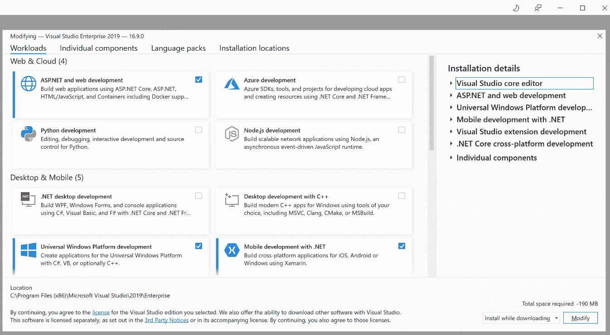
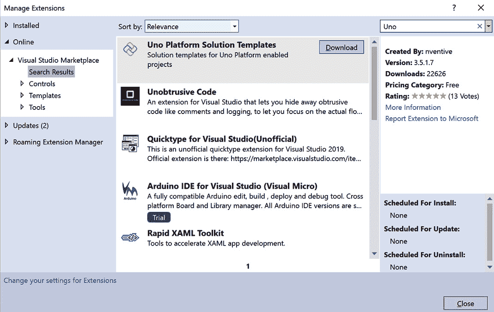

# 第一章：介绍 Uno 平台

**Uno 平台**是一个跨平台、单一代码库解决方案，用于开发在各种设备和操作系统上运行的应用程序。它在丰富的 Windows 开发 API 和工具基础上构建。这使您可以利用您已经拥有的 Windows 应用程序开发技能，并将其用于构建 Android、iOS、macOS、WebAssembly、Linux 等应用程序。

本书将是您学习 Uno 平台的指南。它将向您展示如何使用 Uno 平台的功能来构建各种解决现实场景的不同应用程序。

在本章中，我们将涵盖以下主题：

+   了解 Uno 平台是什么

+   使用 Uno 平台

+   设置您的开发环境

通过本章结束时，您将了解为什么要使用 Uno 平台开发应用程序，以及它最适合帮助您构建哪些类型的应用程序。您还将能够设置您的环境，以便在阅读本书后续章节时准备开始构建应用程序。

# 技术要求

在本章中，您将被引导完成设置开发机器的过程。要在本书中的所有示例中工作，您需要运行以下任何一种操作系统的机器：

+   **Windows 10**（1809）或更高版本

+   **macOS 10.15**（Catalina）或更高版本

如果您只能访问一个设备，您仍然可以跟随本书的大部分内容。本书将主要假设您正在使用 Windows 机器。我们只会在绝对必要时展示使用 Mac 的示例。

本章没有源代码。但是，其他章节的代码可以在以下网址找到：[`github.com/PacktPublishing/Creating-Cross-Platform-C-Sharp-Applications-with-Uno-Platform`](https://github.com/PacktPublishing/Creating-Cross-Platform-C-Sharp-Applications-with-Uno-Platform)。

# 了解 Uno 平台是什么

根据网站（[`platform.uno/`](https://platform.uno/)），Uno 平台是“*用于 Windows、WebAssembly、iOS、macOS、Android 和 Linux 的单一代码库应用程序的第一个和唯一 UI 平台*。”

这是一个复杂的句子，让我们分解一下关键元素：

+   作为一个 UI 平台，它是一种构建具有**用户界面**（**UI**）的应用程序的方式。这与那些基于文本并从命令行（或等效方式）运行、嵌入在硬件中或以其他方式进行交互的平台形成对比，比如通过语音。

+   使用*单一代码库*意味着您只需编写一次代码，即可在多个设备和操作系统上运行。具体来说，这意味着相同的代码可以为应用程序将在的每个平台编译。这与将代码转换或转译为另一种编程语言然后编译为另一个平台的工具形成对比。它也是唯一的单一代码库，而不是输出。一些可比较的工具在每个操作系统上创建一个独特的包，或者在 HTML 和 JavaScript 中创建所有内容，并在嵌入式浏览器中运行。Uno 平台都不这样做。相反，它为每个平台生成本机应用程序包。

+   Windows 应用程序基于 Windows 10 的**Universal Windows Platform**（**UWP**）。微软目前正在进行工作，将**WinUI 3**作为 UWP 的继任者。Uno 平台已与微软合作，以确保 Uno 平台可以在 WinUI 3 达到可比较的操作水平时轻松过渡。

+   Windows 支持还包括由 SkiaSharp 提供支持的**Windows Presentation Foundation**（**WPF**），用于需要在较旧版本的 Windows（7.1 或 8.1）上运行的应用程序。

+   在 WebAssembly 中运行的应用程序将所有代码编译为在 Web 浏览器中运行。这意味着它们可以在任何兼容浏览器的设备上访问，而无需在服务器上运行代码。

+   通过支持 iOS，创建的应用程序可以在 iPhone 和 iPad 上运行。

+   对于 macOS 的支持，应用程序可以在 MacBook、iMac 或 Mac Mini 上运行。

+   对 Android 的支持适用于运行 Android 操作系统的手机和平板电脑。

+   Linux 支持适用于特定的 Linux PC 等价发行版，并由 SkiaSharp 提供支持。

Uno 平台通过重用 Microsoft 为构建 UWP 应用程序创建的工具、API 和 XAML 来完成所有这些工作。

回答“Uno 平台是什么？”的另一种方式是，它是一种*一次编写代码，到处运行*的方式。 “到处”这个确切的定义并不精确，因为它不包括每个能够运行代码的嵌入式系统或微控制器。然而，许多开发人员和企业长期以来一直希望一次编写代码，并在多个平台上轻松运行。Uno 平台使这成为可能。

微软的 UWP 早期的批评之一是它只在 Windows 上是*通用*的。有了 Uno 平台，开发人员现在可以真正地使他们的 UWP 应用程序变得真正通用。

## Uno 平台的简要历史

随着当今跨平台工具的多样化，很容易忘记 2013 年的选择有多有限。那时，没有通用工具可以轻松构建在多个操作系统上运行的本地应用程序。

就在那时，加拿大软件设计和开发公司**nventive**([`nventive.com/`](https://nventive.com/))面临着一个挑战。他们在为 Windows 和 Microsoft 工具构建应用程序方面拥有大量知识和经验，但他们的客户也要求他们为 Android 和 iOS 设备创建应用程序。他们发明了一种方法，将他们为 Windows Phone（后来是 UWP）应用程序编写的代码编译并转移到其他平台，而不是重新培训员工或通过为不同平台构建多个版本的相同软件来复制工作。

到 2018 年，很明显这种方法对他们来说是成功的。然后他们做了以下两件事：

1.  他们将他们创建的工具转变为一个开源项目，称之为 Uno 平台。

1.  他们增加了对 WebAssembly 的支持。

作为一个开源项目，这使得其他开发人员解决同样的问题可以共同合作。Uno 平台自那时以来已经看到了来自 200 多名外部贡献者的数千次贡献，并且参与度已经扩展到支持更多平台，并为最初支持的平台添加额外功能。

作为一个开源项目，它是免费使用的。此外，它得到了一家商业模式由 Red Hat 广泛采用的公司的支持。使用是免费的，并且有一些免费的公共支持。然而，专业支持、培训和定制开发只能通过付费获得。

## Uno 平台的工作原理

Uno 平台以不同的方式工作，并使用多种基础技术，具体取决于您要构建的平台。这些总结在*图 1.1*中：

+   如果您正在为 Windows 10 构建应用程序，Uno 平台不会做任何事情，而是让所有 UWP 工具编译和执行您的应用程序。

+   如果您正在为 iOS、macOS 或 Android 构建应用程序，Uno 平台会将您的 UI 映射到本机平台等效，并使用本机`Xamarin`库调用其正在运行的操作系统。它会为每个操作系统生成适当的本机包。

+   如果您正在构建一个 WebAssembly 应用程序，Uno 平台会将您的代码编译成`mono.wasm`运行时，并将 UI 映射到 HTML 和 CSS。然后，它将其打包成一个`.NET`库，作为静态 Web 内容与 Uno 平台 Web 引导程序一起启动。

+   为了创建 Linux 应用程序，Uno 平台将您的代码转换为`.NET`等效，并使用**GTK3**的`.NET5`应用程序来呈现 UI。

+   Uno 平台通过将编译后的代码包装在一个简单的**WPF**（**NETCore 3.1**）应用程序中，并使用**SkiaSharp**来渲染 UI，从而创建了 Windows 7 和 8 的应用程序。

请参考以下图表：


图 1.1 - Uno 平台的高级架构

无论您要构建的操作系统或平台是什么，Uno 平台都使用该平台的本机控件。这使您的应用程序能够获得完全本机应用程序的体验和性能。唯一的例外是它使用 SkiaSharp。通过使用 SkiaSharp，Uno 平台在画布上绘制所有 UI 内容，而不是使用平台本机控件。Uno 平台不会向正在运行的应用程序添加额外的抽象层（就像使用容器的跨平台解决方案可能会在外壳应用程序中使用嵌入的 WebView 一样）。

Uno 平台使您能够使用单个代码库做很多事情。但它能做到一切吗？

## 它是灵丹妙药吗？

编写代码一次并在所有地方运行该代码的原则既强大又吸引人。然而，有必要意识到以下两个关键点：

+   并非所有应用程序都应该为所有平台创建。

+   这并不是不了解应用程序将在哪些平台上运行的借口。

此外，并非所有事情都需要应用程序。假设您只想分享一些不经常更新的信息。在这种情况下，静态网页的网站可能更合适。

*只是因为你能做某事并不意味着你应该*这个教训也适用于应用程序。当您看到创建可以在多个平台上运行的应用程序是多么容易时，您可能会被诱惑在您可以的所有地方部署您的应用程序。在这样做之前，您需要问一些重要的问题：

+   *应用程序是否在所有平台上都需要或想要？*人们是否希望并需要在您提供的所有平台上使用它？如果不是，您可能会浪费精力将其放在那里。

+   *应用程序在所有平台上都有意义吗？*假设应用程序的关键功能涉及在户外捕捉图像。在 PC 或 Mac 上提供它是否有意义？相反，如果应用程序需要输入大量信息，这是人们愿意在手机的小屏幕上做的吗？您对应用程序在哪里可用的决定应该由其功能和将使用它的人员决定。不要让您的决定仅基于可能性。

+   *您能在所有平台上支持它吗？*通过在平台上发布、维护和支持应用程序来获得的价值是否能够证明在该平台上释放、维护和支持应用程序的时间和精力？如果只有少数人在特定类型的设备上使用应用程序，但他们产生了许多支持请求，重新评估您对这些设备的支持是可以的。

没有技术能为所有场景提供完美的解决方案，但希望您已经看到 Uno 平台提供的机会。现在让我们更仔细地看看为什么以及何时您可能希望使用它。

# 使用 Uno 平台

现在您知道了 Uno 平台是什么，我们将看看在选择是否使用它时需要考虑什么。有四个因素需要考虑：

+   您已经知道的知识。

+   您希望针对哪些平台？

+   应用程序所需的功能。

+   与其他选择相比如何。

让我们探讨 Uno 平台与这些因素的关系。

## Uno 平台允许您使用您已经知道的知识

Uno 平台最初是为在**Visual Studio**中使用 C#和 XAML 的开发人员创建的。如果这对您来说很熟悉，那么开始使用 Uno 平台将会很容易，因为您将使用您已经知道的软件。

如果您已经熟悉 UWP 开发，差异将是最小的。如果您熟悉 WPF 开发，XAML 语法和可用功能会有轻微差异。在阅读本书的过程中，您将学到构建 Uno 平台所需的一切。只要您不期望一切都像 WPF 中那样工作，您就会没问题。此外，由于 WinUI 和 Uno 平台团队正在努力消除存在的轻微差异，您可能永远不会注意到差异。

如果您不了解 C#或 XAML，Uno 平台可能仍然适合您，但是由于本书假定您熟悉这些语言，您可能会发现先阅读* C# 9 and .NET 5 – Modern Cross-Platform Development – Fifth Edition, Mark J. Price, Packt Publishing*和*Learn WinUI 3.0, Alvin Ashcraft, Packt Publishing*会有所帮助。

## Uno 平台支持许多平台

Uno 平台的一个伟大之处在于它允许您为多个平台构建应用程序。Uno 平台支持最常见的平台，但如果您需要构建在小众平台或专用设备上运行的应用程序，那么它可能不适合您。此外，如果您需要支持旧版本的平台或操作系统，您可能需要找到解决方法或替代方案。以下表格显示了您可以使用 Uno 平台构建的受支持平台的版本：


图 1.2 - Uno 平台支持的最低受支持平台版本

支持多个平台也可能是有利的，即使您希望在不同平台上实现非常不同的应用行为或功能。可以通过创建多个解决方案来支持多个平台，而不是将所有内容合并到单个解决方案中。

Uno 平台声称可以实现高达 99%的代码和 UI 重用。当您需要在所有设备上使用相同的内容时，这非常有用。但是，如果您需要不同的行为或针对不同平台高度定制的 UI（这是我们将在未来章节中探讨的内容），则在不同的解决方案中构建不同的应用程序可能会更容易，而不是在代码中放置大量的条件逻辑。对于有多少条件代码是太多，没有硬性规定，这取决于项目和个人偏好。只需记住，如果您发现您的代码充满了使其难以管理的条件注释，那么这仍然是一个选择。

因此，也可以使用 Uno 平台为单个平台构建应用程序。您可能不希望创建一个可以在任何地方运行的应用程序。您可能只对单个平台感兴趣。如果是这种情况，您也可以使用 Uno 平台。如果您的需求发生变化，未来还可以轻松添加其他平台。

## Uno 平台是否能够满足您的应用程序的所有需求？

Uno 平台能够重用 UWP API 构建其他平台的核心在于它具有将 UWP API 映射到其他平台上的等效代码。由于时间、实用性和优先级的限制，并非所有 API 都适用于所有平台。一般指导方针是，最常见的 API 在最广泛的平台上都是可用的。假设您需要使用更专业的功能或针对的不是 Android、iOS、Mac 或 WebAssembly 的其他内容，建议您检查您所需的功能是否可用。

提示

我们建议在开始编写代码之前确认您的应用程序所需的功能是否可用。这将使您能够避免在开发过程的后期出现任何不愉快的惊喜。

由于印刷书籍的永久性以及新功能的频繁添加和更多 API 的支持，不适合在此列出支持的内容。相反，您可以在以下 URL 查看支持功能的高级列表：[`platform.uno/docs/articles/supported-features.html`](https://platform.uno/docs/articles/supported-features.html)。还有一个支持的 UI 元素列表，位于以下 URL：[`platform.uno/docs/articles/implemented-views.html`](https://platform.uno/docs/articles/implemented-views.html)。当然，确认可用和不可用的最终方法是检查以下 URL 的源代码：[`github.com/unoplatform/uno`](https://github.com/unoplatform/uno)。

如果您尝试使用不受支持的 API，您将在 Visual Studio 中看到提示，如*图 1.3*所示。如果您在运行时尝试使用此 API，您要么什么也不会得到（`NOOP`），要么会得到`NotSupported`异常：


图 1.3 - Visual Studio 中指示不受支持的 API 的示例

如有必要，您可以使用`Windows.Foundation.Metadata.ApiInformation`类在运行时检查支持的功能。

作为一个开源项目，您也可以选择自己添加任何当前不受支持的功能。将这样的添加贡献回项目总是受到赞赏的，团队也始终欢迎新的贡献者。

## Uno Platform 与其他替代方案相比如何？

如前所述，有许多工具可用于开发在多个平台上运行的应用程序。我们不打算讨论所有可用的选项，因为它们可以与前面的三个要点进行评估和比较。但是，由于本书旨在面向已经熟悉 C＃、XAML 和 Microsoft 技术的开发人员，因此适当提及`Xamarin.Forms`。

`Xamarin.Forms`是在大约与 Uno Platform 同时创建的，并且有几个相似之处。其中两个关键点是使用 C＃和 XAML 来创建在多个操作系统上运行的应用程序。两者都通过提供对包含 C＃绑定的`Xamarin.iOS`和`Xamarin.Android`库的抽象来实现这一点。

Uno Platform 与`Xamarin.Forms`之间的两个最大区别如下：

+   Uno Platform 支持构建更多平台的应用。

+   Uno Platform 重用了 UWP API 和 XAML 语法，而不是构建自定义 API。

第二点对于已经熟悉 UWP 开发的开发人员来说很重要。许多`Xamarin.Forms`元素和属性的名称听起来相似，因此记住这些变化可能是具有挑战性的。

`Xamarin.Forms`的第 5 版于 2020 年底发布，预计将是`Xamarin.Forms`的最后一个版本。它将被**.NET 多平台应用 UI**（**MAUI**）所取代，作为.NET 6 的一部分。.NET MAUI 将支持从单个代码库构建 iOS、Android、Windows 和 Mac 的应用程序。但是，它将不包括构建 WebAssembly 的能力。微软已经拥有 Blazor 用于构建 WebAssembly，因此不打算将此功能添加到.NET MAUI 中。

.NET 6 将带来许多新的功能。其中一些功能是专门为.NET MAUI 添加的。一旦成为.NET 6 的一部分，这些功能将不仅限于.NET MAUI。它们也将适用于 Uno Platform 应用。其中最明显的新功能之一是拥有一个可以为不同平台生成不同输出的单个项目。这将大大简化所需的解决方案结构。

重要提示

在我们撰写本书时，微软正在准备发布**WinUI 3**作为下一代 Windows 开发平台。这将建立在 UWP 之上，是**Project Reunion**努力的一部分，旨在使所有 Windows 功能和 API 对开发人员可用，无论他们使用的 UI 框架或应用程序打包技术如何。

由于 WinUI 3 是 UWP 开发的继任者，Uno 平台团队已经公开表示，计划和准备正在进行中，Uno 平台将过渡到使用 WinUI 3 作为其构建基础。这是与微软合作完成的，允许 Uno 平台团队获取 WinUI 代码并修改以在其他地方工作。您可以放心，您现在制作的任何东西都将有过渡路径，并利用 WinUI 带来的好处和功能。

另一个类似的跨平台解决方案，使用 XAML 来定义应用程序的 UI 的是 Avalonia ([`avaloniaui.net/`](https://avaloniaui.net/))。然而，它不同之处在于它只专注于桌面环境的应用程序。

现在您已经对 Uno 平台是什么以及为什么要使用它有了扎实的了解，您需要设置好您的机器，以便编写代码和创建应用程序。

# 设置您的开发环境

现在您已经熟悉 Uno 平台，无疑渴望开始编写代码。我们将在下一章开始，但在那之前，您需要设置好开发环境。

Visual Studio 是开发 Uno 平台应用程序最流行的**集成开发环境**（**IDE**）。其中一个重要原因是它具有最广泛的功能集，并且对构建 UWP 应用程序的支持最好。

## 使用 Visual Studio 进行开发

使用 Visual Studio 构建 Uno 平台应用程序，您需要做以下三件事：

+   确保您有**Visual Studio 2019**版本**16.3**或更高版本，尽管建议使用最新版本。

+   安装必要的工作负载。

+   安装项目和项目模板。

### 安装所需的工作负载

作为 Visual Studio 的一部分可以安装的许多工具、库、模板、SDK 和其他实用程序统称为**组件**。有超过 100 个可用的组件，相关组件被分组到工作负载中，以便更容易选择所需的内容。您可以在**Visual Studio 安装程序**中选择工作负载，这些显示在*图 1.4*中：



图 1.4 - Visual Studio 安装程序显示各种工作负载选项

要构建 Uno 平台应用程序，您需要安装以下工作负载：

+   **通用 Windows 平台开发**

+   **使用.NET 进行移动开发**

+   **ASP.NET 和 Web 开发**

+   .NET Core 跨平台开发

### 从市场安装所需的模板

为了更容易构建您的 Uno 平台应用程序，提供了多个项目和项目模板。这些作为**Uno 平台解决方案模板**扩展的一部分安装。您可以从 Visual Studio 内部安装这个，或者直接从市场安装。

#### 从 Visual Studio 内部安装模板

要安装包含模板的扩展，请在 Visual Studio 中执行以下操作：

1.  转到**扩展**>**管理扩展**。

1.  搜索`Uno`。它应该是第一个结果。

1.  点击**下载**按钮。

1.  点击**关闭**，让扩展安装程序完成，然后重新启动**Visual Studio**。



图 1.5 - 在“管理扩展”对话框中显示的 Uno 平台解决方案模板

#### 从市场安装模板

按照以下步骤从市场安装扩展：

1.  转到[`marketplace.visualstudio.com`](https://marketplace.visualstudio.com)并搜索`Uno`。它应该是返回的第一个结果。

或者，直接转到以下网址：[`marketplace.visualstudio.com/items?itemName=nventivecorp.uno-platform-addin`](https://marketplace.visualstudio.com/items?itemName=nventivecorp.uno-platform-addin)。

1.  点击**下载**按钮。

1.  双击下载的`.vsix`文件以启动安装向导。

1.  按照向导中的步骤操作。

安装了工作负载和模板后，您现在可以开始构建应用程序了。但是，如果您想要开发 iOS 或 Mac 应用，您还需要设置 Mac 设备，以便您可以从 Windows 上的 Visual Studio 连接到它。

## 使用其他编辑器和 IDE

在 Windows PC 上使用 Visual Studio 2019 并不是强制的，Uno 平台团队已经努力使构建 Uno 平台应用程序尽可能灵活。因此，您可以在现有的工作模式和偏好中使用它。

### 使用命令行安装所需的模板

除了在 Visual Studio 中使用模板外，还可以通过命令行安装它们以供使用。要以这种方式安装它们，请在命令行或终端中运行以下命令：

```cs
dotnet new -i Uno.ProjectTemplates.Dotnet
```

完成此命令后，它将列出所有可用的模板。您应该看到多个以*uno*开头的短名称条目。

### 使用 Visual Studio for Mac 构建 Uno 平台应用程序

要使用 Visual Studio for Mac 构建 Uno 平台应用程序，您将需要以下内容：

+   **Visual Studio** for Mac 版本 8.8 或更高（建议使用最新版本）。

+   **Xcode 12.0**或更高（建议使用最新版本）。

+   Apple ID。

+   **.NET Core 3.1**和**5.0 SDK**。

+   **GTK+3**（用于运行**Skia/GTK**项目）。

+   安装的模板（参见上一节）。

+   通过打开**首选项**菜单选项，然后选择**其他**>**预览功能**并选中**在新项目对话框中显示所有.NET Core 模板**，可以使模板在 Visual Studio for Mac 中可见。

所有这些的链接都可以在以下网址找到：[`platform.uno/docs/articles/get-started-vsmac.html`](https://platform.uno/docs/articles/get-started-vsmac.html)。

### 使用 Visual Studio Code 构建 Uno 平台应用程序

您可以使用 Visual Studio Code 在 Windows、Linux 或 Mac 上构建 WebAssembly 应用程序。目前尚不支持使用它构建其他平台的应用程序。

要使用 Visual Studio Code 构建 Uno 平台应用程序，您将需要以下内容：

+   **Visual Studio Code**（建议使用最新版本）

+   Mono

+   **.NET Core 3.1**和**5.0 SDK**。

+   安装的模板（参见上一节）

+   **Visual Studio Code**的**C#**扩展

+   **Visual Studio Code**的**JavaScript Debugger**（夜间版）扩展

所有这些的链接都可以在以下网址找到：[`platform.uno/docs/articles/get-started-vscode.html`](https://platform.uno/docs/articles/get-started-vscode.html)。

### 使用 JetBrains Rider 构建 Uno 平台应用程序

可以在 Windows、Mac 和 Linux 上使用**JetBrains Rider**，但并非所有版本都可以构建所有平台。

要使用 JetBrains Rider 构建 Uno 平台应用程序，您将需要以下内容：

+   **Rider 版本 2020.2**或更高，建议使用最新版本

+   **Rider Xamarin Android Support Plugin**

+   .NET Core 3.1 和 5.0 SDK

+   安装的模板（参见上一节）

在使用 JetBrains Rider 时，还有一些额外的注意事项，如下所示：

+   目前还无法从 IDE 内部调试 WebAssembly 应用程序。作为一种解决方法，可以使用 Chromium 浏览器中的调试器。

+   如果在 Mac 上构建**Skia/GTK**项目，还需要安装**GTK+3**。

+   如果您希望在 Windows PC 上构建 iOS 或 Mac 应用程序，您将需要连接的 Mac（就像使用 Visual Studio 一样）。

所有这些链接和更多详细信息都可以在以下 URL 中找到：[`platform.uno/docs/articles/get-started-rider.html`](https://platform.uno/docs/articles/get-started-rider.html)。

重要提示

还可以使用 Blend for Visual Studio（在 Windows 上）来处理代码，就像对常规 UWP 应用程序一样。但是，Blend 不支持 Uno Platform 解决方案包含的所有项目类型。您可能会发现，有一个不包含这些项目的解决方案的单独版本，并且可以在 Blend 中访问该版本，这是有益的。

## 检查您的设置

Uno Platform 有一个**dotnet 全局工具**，可以检查您的机器是否设置正确，并引导您解决它发现的任何问题。它被称为**uno-check**，非常简单易用，如下所示：

1.  打开开发人员命令提示符、终端或 PowerShell 窗口。

1.  通过输入以下内容安装该工具：

```cs
dotnet tool install --global Uno.Check
```

1.  通过输入以下内容运行该工具：

```cs
uno-check
```

1.  按照它给出的任何提示，并享受查看以下消息：**恭喜，一切看起来都很棒！**

## 调试您的设置

无论您使用哪种 IDE 或代码编辑器，都会有许多部分，使用多个工具、SDK 甚至机器可能会让人难以知道在出现问题时从何处开始。以下是一些通用提示，可帮助找出问题所在。其中一些可能看起来很明显，但我宁愿因为提醒您检查一些明显的东西而显得愚蠢，也不愿让您浪费时间在未经检查的假设上：

+   尝试重新启动您的机器。是的，我知道，如果它经常不起作用，那将会很有趣。

+   仔细阅读任何错误消息，然后再次阅读。它们有时可能会有所帮助。

+   检查您是否已正确安装*所有*内容。

+   有什么改变了吗？即使您没有直接做，也可能已经自动或在您不知情的情况下进行了更改（包括但不限于操作系统更新、安全补丁、IDE 更新、其他应用程序的安装或卸载以及网络安全权限更改）。

+   如果有一个东西已经更新了，所有依赖项和引用的组件也已经更新了吗？通常情况下，当事物相互连接、共享引用或通信时，它们必须一起更新。

+   任何密钥或许可证已过期吗？

+   如果以前创建的应用程序出现问题，您可以创建一个新的应用程序并编译和运行吗？

+   您可以创建一个新的应用程序，并确认它在每个平台上都可以编译和运行吗？

+   如果在 Windows 上，您可以创建一个新的空白 UWP 应用程序，然后编译和调试它吗？

尝试使用其他工具进行等效操作或创建等效应用程序通常会产生不同的错误消息。此外，您还可能找到解决方案的路径，可以修复 Uno Platform 项目设置中的问题：

+   如果使用 WebAssembly 应用程序，您可以创建一个新的空白**ASP.NET** Web 应用程序或**Blazor**项目，并编译和调试吗？

+   如果 WebAssembly 应用程序在一个浏览器中无法工作，浏览器日志或调试窗口中是否显示错误消息？它在另一个浏览器中工作吗？

+   对于`Xamarin.Forms`应用程序？

+   如果存在特定于 Android 的问题，您可以使用 Android Studio 创建和调试应用程序吗？

+   如果使用 Mac，您可以使用 Xcode 创建和调试空白应用程序吗？

有关解决常见设置和配置问题的其他提示可以在以下两个 URL 中找到：

+   [`platform.uno/docs/articles/get-started-wizard.html#common-issues`](https://platform.uno/docs/articles/get-started-wizard.html#common-issues)

+   [`platform.uno/docs/articles/uno-builds-troubleshooting.html`](https://platform.uno/docs/articles/uno-builds-troubleshooting.html)

如果问题来自从 PC 连接到 Mac，Xamarin 文档可能会有所帮助。它可以在以下 URL 找到：[`docs.microsoft.com/en-us/xamarin/ios/get-started/installation/windows/connecting-to-mac/`](https://docs.microsoft.com/en-us/xamarin/ios/get-started/installation/windows/connecting-to-mac/)。这也可以帮助识别和解决 Uno Platform 项目中的问题。

有关特定 Uno 平台相关问题答案的详细信息可以在*第八章*中找到，*部署您的应用程序并进一步*。

# 总结

在本章中，我们了解了 Uno 平台是什么，它设计解决的问题以及我们可以将其用于哪些项目类型。然后，我们看了如何设置开发环境，使其准备好以便使用 Uno 平台构建第一个应用程序。

在下一章中，我们将构建我们的第一个 Uno 平台应用程序。我们将探索生成解决方案的结构，看看如何在不同环境中进行调试，并在这些不同环境中运行应用程序时进行自定义。我们将看看如何创建可在未来的 Uno 平台项目中使用的可重用库。最后，我们将看看创建 Uno 平台应用程序的其他可用选项。

# 进一步阅读

本章前面提到了以下标题，如果您对使用 C#和 XAML 不熟悉，这些标题可能提供有用的背景信息：

+   *C# 9 and .NET 5 – Modern Cross-Platform Development – Fifth Edition，Price，Packt Publishing（2020 年）*

+   *学习 WinUI 3.0，Ashcraft，Packt Publishing（2021 年）*
