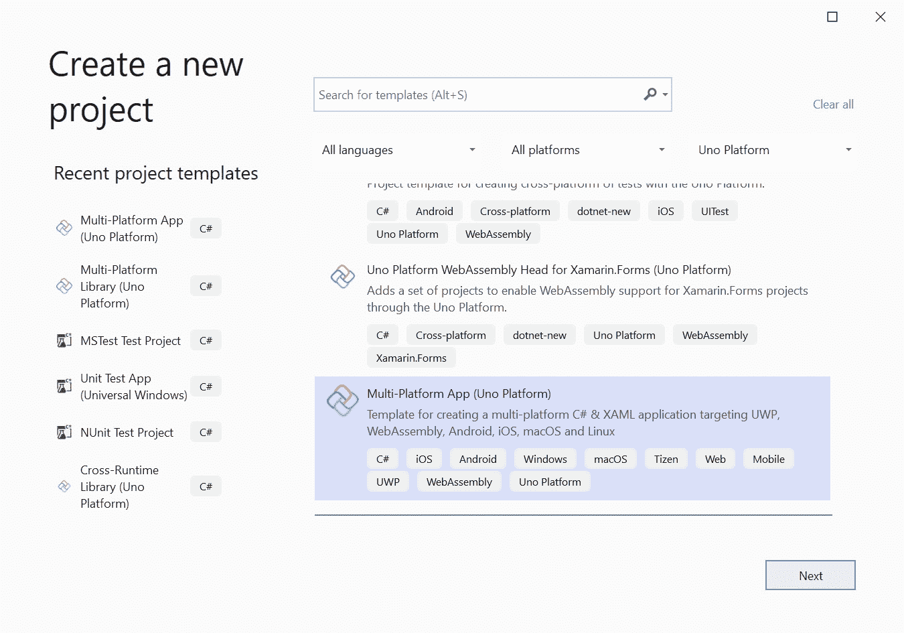
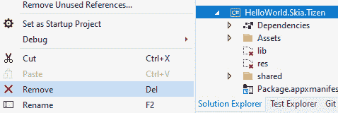
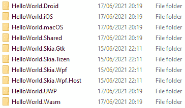
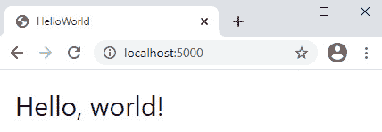
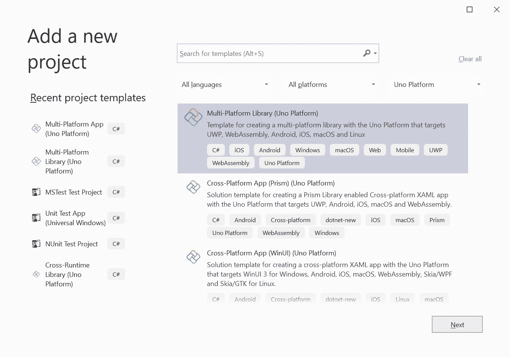

# 第二章：*第二章*：编写您的第一个 Uno 平台应用程序

在本章中，您将学习如何创建新的 Uno 平台应用程序，并了解典型的 Uno 平台应用程序的结构。首先，我们将介绍默认的 Uno 平台应用程序模板，包括不同的项目，并让您在 Windows 10 上运行您的第一个 Uno 平台应用程序。之后，我们将深入探讨在不同平台上运行和调试应用程序的方法，包括如何使用模拟器和调试应用程序的 WebAssembly（Wasm）版本。

由于 Uno 平台支持众多平台，并且越来越多的平台被添加到支持的平台列表中，因此在本书中，我们将只开发一部分支持的平台。以下平台是最突出和广泛使用的平台，因此我们将以它们为目标：Windows 10，Android，Web/Wasm，macOS 和 iOS。

虽然在本章中我们提到了其他平台以保持完整性，但其他章节将只包括前面提到的平台。这意味着我们不会向您展示如何在**Linux**、**Tizen**或**Windows 7/8**上运行或测试您的应用程序。

在本章中，我们将涵盖以下主题：

+   创建 Uno 平台应用程序并了解其结构

+   运行和调试您的应用程序，包括使用**XAML 热重载**和**C#编辑和继续**

+   使用 C#编译器符号和**XAML**前缀的特定于平台的代码

+   除了 Uno 平台应用程序之外的其他项目类型

在本章结束时，您将已经编写了您的第一个 Uno 平台应用程序，并根据运行平台进行了定制。除此之外，您将能够使用不同的 Uno 平台项目类型。

# 技术要求

本章假设您已经设置好了开发环境，包括安装了项目模板，就像在*第一章*中介绍的那样，*介绍 Uno 平台*。您可以在此处找到本章的源代码：[`github.com/PacktPublishing/Creating-Cross-Platform-C-Sharp-Applications-with-Uno-Platform/tree/main/Chapter02`](https://github.com/PacktPublishing/Creating-Cross-Platform-C-Sharp-Applications-with-Uno-Platform/tree/main/Chapter02)。

查看以下视频以查看代码的实际操作：[`bit.ly/37Dt0Hg`](https://bit.ly/37Dt0Hg)

注意

如果您使用本书的数字版本，我们建议您自己输入代码或从书的 GitHub 存储库中访问代码。这样做将有助于避免与复制和粘贴代码相关的任何潜在错误。

# 创建您的第一个应用程序

创建项目的不同方式，因此我们将从使用 Visual Studio 的最常见方式开始。

## 使用 Uno 平台解决方案模板创建您的项目

创建 Uno 平台应用程序项目的过程与在 Visual Studio 中创建其他项目类型的过程相同。根据安装的扩展和项目模板，当过滤**Uno 平台**时，您将看到*图 2.1*中的选项列表。请注意，对于*图 2.1*，只安装了**Uno 平台解决方案模板**扩展：



图 2.1 - 新项目对话框中 Uno 平台项目模板的列表

使用**多平台应用程序（Uno 平台）**项目模板是开始使用 Uno 平台的最简单方式，因为它包含了构建和运行 Uno 平台应用程序所需的所有项目。 

让我们通过选择**多平台应用程序（Uno Platform）**项目类型并单击**下一步**来开始创建您的应用程序。 请注意，您不要选择**多平台库（Uno Platform）**选项，因为那将创建一个不同的项目类型，我们将在*超越默认跨平台应用程序结构*部分中介绍。 现在，您需要选择项目的名称、位置和解决方案名称，如*图 2.2*中所示：


图 2.2 - 配置多平台应用程序（Uno Platform）

在我们的案例中，我们将称我们的项目为`HelloWorld`，并将其保存在`D:\Projects`下，这意味着项目将存储在`D:\Projects\HelloWorld`中，而`HelloWorld.sln`解决方案将是顶级元素。 当然，您可以在任何您想要的文件夹中创建项目； `D:\Projects`只是一个例子。 请注意，您应尽可能靠近驱动器根目录创建项目，以避免路径过长的问题。 单击**创建**后，Visual Studio 将为您创建项目并打开解决方案。 您将在**Solution Explorer**中看到所有生成的项目。

如果您在 Visual Studio for Mac 中创建项目，生成的解决方案将包括**Windows Presentation Foundation**（**WPF**）和**Universal Windows Platform**（**UWP**）应用程序的项目头。 项目或平台头是在为特定平台编译应用程序时将被编译的相应项目。 因此，在 Windows 10 的情况下，将编译 UWP 头。 您需要使用 Windows PC 来构建这些应用程序。 如果您不想为这些平台构建，可以从解决方案中删除这些项目。 如果您将在 Windows 机器上单独构建这些项目，请在 Mac 上工作时从解决方案中卸载它们。

由于您的应用程序可能不针对 Uno Platform 支持的每个平台，您可能希望为您的应用程序删除那些头。 要做到这一点，请通过右键单击项目视图中的项目并单击**删除**来从解决方案中删除这些项目，如*图 2.3*所示：



图 2.3 - 从解决方案中删除 Skia.Tizen 头

从解决方案中删除项目后，项目仍然存在于磁盘上。 要完全删除它，您必须打开项目文件夹并删除相应的文件夹。 由于我们只针对 Windows 10、Android、Web、macOS 和 iOS，您可以从解决方案中删除`Skia.GTK`、`Skia.Tizen`、`Skia.Wpf`和`Skia.WpfHost`项目。

## 使用.NET CLI 创建您的项目

当然，您不必使用 Visual Studio 来创建您的 Uno Platform 应用程序。 您还可以使用 Uno Platform 的`dotnet new`模板。 您可以通过打开终端并输入以下内容来创建新项目：

```cs
dotnet new unoapp -o MyApp
```

这将创建一个名为**MyApp**的新项目。 您可以在 Uno Platform 的模板文档中找到所有 dotnet new 模板的概述（[`platform.uno/docs/articles/get-started-dotnet-new.html`](https://platform.uno/docs/articles/get-started-dotnet-new.html)）。

当然，并非每个人都希望将其应用程序针对每个平台，也不是每个应用程序都适合在每个平台上运行。 您可以通过在命令中包含特定标志来选择不为特定平台创建目标项目（下一节将详细介绍这些内容）。 例如，使用以下命令，您将创建一个不在 Linux 和其他 Skia 平台上运行的新项目，因为我们排除了 Skia 头：

```cs
dotnet new unoapp -o MyApp -skia-wpf=false -skia-gtk=false     -st=false
```

要获取`unoapp`模板的所有可用选项列表，可以运行`dotnet new unoapp -h`。

## 项目结构和头

在 Windows 上使用 Uno 平台解决方案模板在 Visual Studio 中创建项目时，`Platforms`文件夹和`HelloWorld.Shared`共享 C#项目中有两个不同的顶级元素。请注意，在解决方案视图中，这些是两个顶级元素，但是`Platforms`文件夹在磁盘上不存在。相反，所有项目，包括共享项目，都有自己的文件夹，如*图 2.4*所示：



图 2.4 - 文件资源管理器中的 HelloWorld 项目

在生成的解决方案的根目录中有一个名为`.vsconfig`的文件。该文件包含了与生成的项目一起使用所需的所有 Visual Studio 组件的列表。如果您按照*第一章*中介绍 Uno 平台的方式设置了您的环境，那么您将拥有所需的一切。但是，如果您看到*图 2.5*中的提示，请单击**安装**链接并添加缺少的工作负载：


图 2.5 - 在 Visual Studio 中缺少组件的警告

在`Platforms`解决方案文件夹下，您将找到每个受支持平台的`C#`项目：

+   `HelloWorld.Droid.csproj` 用于 Android

+   `HelloWorld.iOS.csproj` 用于 iOS

+   `HelloWorld.macOS.csproj` 用于 macOS

+   `HelloWorld.Skia.Gtk.csproj` 用于带有 GTK 的 Linux

+   `HelloWorld.Skia.Tizen.csproj` 用于 Tizen

+   `HelloWorld.Skia.Wpf.csproj`：用于 Windows 7 和 Windows 8 的基本项目

+   `HelloWorld.Skia.Wpf.WpfHost.csproj`：用于 Windows 7 和 Windows 8 上的`HelloWorld.Skia.Wpf`项目的主机

+   `HelloWorld.UWP.csproj` 用于 Windows 10

+   `HelloWorld.Wasm.csproj` 用于 WebAssembly（WASM）

这些项目也被称为 iOS 的`UIApplication`，在 macOS 上创建和显示`NSApplication`，或在 WASM 上启动应用程序。

基于平台的一些特定设置和配置，例如应用程序所需的权限，将根据平台而异。一些平台允许您无任何限制地使用 API。相反，其他平台更加禁止，并要求您的应用程序事先指定这些 API 或要求用户授予权限，这是您必须在头项目中配置的内容。由于这些配置需要在各个头项目中完成，因此在不同平台上的体验将有所不同。在*第三章*中配置平台头时，我们将仅涵盖部分这些差异，*使用表单和数据*（Mac、WASM 和 UWP），以及*第四章*，*使您的应用程序移动*（Android 和 iOS）作为为这些平台开发应用程序的一部分。

与头项目相比，**共享项目**是几乎所有应用程序代码的所在地，包括页面和视图、应用程序的核心逻辑以及任何资源或图像等资产，这些资产将在每个平台上使用。共享项目被所有平台头引用，因此放在那里的任何代码都将在所有平台上使用。如果您不熟悉 C#共享项目，共享项目只不过是一个在编译引用共享项目的项目时将被包含的文件列表。

像我们的**Hello World**应用程序这样的新创建的跨平台应用程序已经在共享项目中带有一些文件：

+   `App.xaml.cs`：这是应用程序的入口点；它将加载 UI 并导航到`MainPage`。在这里，您还可以通过取消注释`InitializeLogging`函数中的相应行来配置事件的日志记录。

+   `App.xaml`：这包含了常见的 XAML 资源列表，如资源字典和主题资源。

+   `MainPage.xaml.cs`：这个文件包含了你的`MainPage`的 C#代码。

+   `MainPage.xaml`：这是您可以放置`MainPage`的 UI 的地方。

+   `Assets/SharedAssets.md`：这是一个演示资产文件，用于展示在 Uno 平台应用程序中如何使用资产。

+   `Strings/en/Resources.resw`：这也是一个演示资产文件，您可以使用它来开始在 Uno 平台应用程序中进行本地化。

现在您已经熟悉了您的第一个 Uno 平台应用程序的项目结构，让我们深入了解如何构建和运行您的应用程序。

# 构建和运行您的第一个 Uno 平台应用程序

既然您熟悉了 Uno 平台应用程序的结构，我们可以开始构建和运行您的第一个 Uno 平台应用程序了！在本节中，我们将介绍构建和运行应用程序的不同方法。

## 在 Windows 上使用 Visual Studio 运行和调试您的应用程序

从 Visual Studio 中运行您的 Uno 平台应用程序与运行常规的 UWP、`Xamarin.Forms`或 WASM 应用程序完全相同。要在特定设备或模拟器上构建和运行应用程序，可以从启动项目下拉菜单中选择相应的头。请注意，根据所选的配置、目标平台和架构，不是每个项目都会编译成预期的输出，甚至可能根本不会被编译。例如，UWP 项目始终针对明确的架构进行编译，因此在选择**任意 CPU**架构时将编译为 x86。这意味着并非所有目标架构和项目的组合都会编译成指定的内容，而是会退回到默认架构，例如在 UWP 的情况下是 x86。

要运行 UWP 应用程序，如果尚未选择**HelloWorld.UWP**项目作为启动项目，请从启动项目下拉菜单中选择**HelloWorld.UWP**，如*图 2.6*所示：


图 2.6 - Visual Studio 中的配置、架构、启动项目和目标机器选项

之后，选择适合您的计算机架构和要运行的运行配置、调试或发布。由于我们将在下一节中调试应用程序，请暂时选择**调试**。之后，您可以选择要部署到的目标设备，即本地计算机、连接的设备或模拟器。要做到这一点，请使用*图 2.7*中项目列表右侧的下拉菜单：


图 2.7 - Visual Studio 中的 Android 模拟器列表

然后，您可以通过单击绿色箭头或按下*F5*来启动项目。应用程序将构建，然后您应该会看到类似*图 2.8*的东西：


图 2.8 - 运行在 Windows 10 上的 HelloWorld 应用程序的屏幕截图

恭喜，您刚刚运行了您的第一个 Uno 平台应用程序！当然，在 Windows 上运行应用程序并不是开发跨平台应用程序的唯一部分。在 Android、iOS 和其他平台上运行和调试您的应用程序对于编写跨平台应用程序来说是至关重要的，以确保您的应用程序在所有支持的平台上都能正常运行。

对于 Android 开发，有多种不同的方法可以尝试和运行您的应用程序。一种可能性是使用 Visual Studio 附带的 Android 模拟器。为此，只需从目标列表下拉菜单中选择 Android 模拟器，如*图 2.7*所示。

注意

如果您还没有添加 Android 模拟器设备映像，您将只看到**Android 模拟器**作为选项。要了解如何添加和配置设备，Visual Studio 文档([`docs.microsoft.com/en-us/xamarin/android/get-started/installation/android-emulator/device-manager`](https://docs.microsoft.com/en-us/xamarin/android/get-started/installation/android-emulator/device-manager))介绍了如何创建新设备并根据您的需求进行配置。

如果您已将 Android 手机连接到计算机，它将显示在可用目标设备列表中。可以在*图 2.7*中看到 Samsung 设备的示例。

注意

为了获得与 Visual Studio 的最佳开发体验，在编辑 C#或 XAML 文件时，请确保 Visual Studio 将使用 UWP 头进行智能感知，否则智能感知可能无法正常工作。为此，在打开 C#或 XAML 文件时，从下拉菜单中选择已打开文件的选项卡名称下方的 UWP 头。

### 将 Windows 的 Visual Studio 与 Mac 配对

对于测试和调试 iOS 头，您可以直接在 Mac 上开发，我们将在下一节中介绍，或者您可以将 Windows 的 Visual Studio 与 Mac 配对，以远程调试 iOS 头。

在 Visual Studio 中的*使用.NET 进行移动开发*工作负载包括连接到 Mac 所需的软件。但是，需要三个步骤才能完全配置它：

1.  在 Mac 上安装**Xcode**和**Visual Studio for Mac**，并打开这些应用程序以确保安装了所有依赖项。

1.  在 Mac 上启用**远程登录**。

1.  从 Visual Studio 连接到 Mac。

在 Mac 上启用远程登录需要以下步骤：

1.  在**系统偏好设置**中打开**共享**窗格。

1.  检查**远程登录**并指定**允许访问的用户：**。

1.  根据提示更改防火墙设置。

要从 Visual Studio 连接，请执行以下操作：

+   转到**工具**>**iOS**>**配对到 Mac**。

+   如果您是第一次这样做，请选择**添加 Mac…**并输入 Mac 名称或 IP 地址，然后在提示时输入用户名和密码。

+   如果 Mac 已列出，请选择它并单击**连接**。

该工具将检查 Mac 上安装和可用的所有必需内容，然后打开连接。

如果出现问题，它将告诉您如何解决。

注意。

有关将 Visual Studio 配对到 Mac 以及解决可能遇到的任何问题的更详细说明，请访问[`docs.microsoft.com/xamarin/ios/get-started/installation/windows/connecting-to-mac/`](https://docs.microsoft.com/xamarin/ios/get-started/installation/windows/connecting-to-mac/)。

现在，Visual Studio 已成功与您的 Mac 配对，您可以从 Windows 机器调试应用程序，并在远程 iOS 模拟器上运行它。

## 使用 Visual Studio for Mac 运行和调试应用程序

如果您主要在 Mac 上工作，使用 Visual Studio for Mac 是开发 Uno 平台应用程序的最简单方法。

使用 Visual Studio for Mac 运行 Uno 平台应用程序与运行其他应用程序相同。您需要在启动项目列表中选择正确的头项目（例如，`HelloWorld.macOS`或`HelloWorld.iOS`），选择正确的目标架构来运行应用程序，并选择设备或模拟器来运行应用程序。

当然，除了在本地机器上运行应用程序之外，您还可以在模拟器上运行 Android 或 iOS 应用程序。您可以在 Windows 的 Visual Studio 中将任何适用的设备作为目标，包括任何模拟器或仿真器。

由于 Uno 平台应用程序的 WASM 版本的调试将在 Visual Studio 和 Visual Studio for Mac 之外进行，我们将在下一节中介绍这一点。

## 调试应用程序的 WASM 头

在撰写本文时，从 Visual Studio 或 Visual Studio for Mac 内部调试 WASM 的支持并不是很好，但是有替代选项。因此，当使用 Visual Studio for Windows 或 Visual Studio for Mac 时，WASM 的调试体验将在浏览器中进行。为了获得最佳的调试体验，我们建议使用最新的 Google Chrome Canary 版本。这可以从[`www.google.com/chrome/canary/`](https://www.google.com/chrome/canary/)获取。由于 WASM 的调试仍处于实验阶段，因此可能会发生变化，我们强烈建议访问官方文档([`platform.uno/docs/articles/debugging-wasm.html`](https://platform.uno/docs/articles/debugging-wasm.html))获取最新信息。您可以在这里了解有关使用 Visual Studio 调试 WASM 头的更多信息：[`platform.uno/blog/debugging-uno-platform-webassembly-apps-in-visual-studio-2019/`](https://platform.uno/blog/debugging-uno-platform-webassembly-apps-in-visual-studio-2019/)。

或者，您可以使用 Visual Studio Code 来调试应用程序的 WASM 版本。为了获得最佳体验，您应该使用`dotnet new`CLI 创建 Uno Platform 应用程序。您必须包括`–vscodeWasm`标志，如下所示，因为它将添加您可以在 Visual Studio Code 中使用的构建配置：

```cs
dotnet new unoapp -o HelloWorld -ios=false -android=false 
 -macos=false -uwp=false --vscodeWasm
```

请注意，通过前面的`dotnet new`命令，我们选择了不使用其他头部，因为在撰写本文时，只有 WASM 版本可以在 Visual Studio Code 中进行调试。

如果您已经创建了应用程序，请按照文档中显示的步骤进行操作[`platform.uno/docs/articles/get-started-vscode.html#updating-an-existing-application-to-work-with-vs-code`](https://platform.uno/docs/articles/get-started-vscode.html#updating-an-existing-application-to-work-with-vs-code)。当您的项目中已经存在其他平台的头部时，这也适用。

要使用 Visual Studio 启动应用程序并进行调试，首先使用`dotnet restore`恢复 NuGet 包。之后，您需要启动开发服务器。要做到这一点，打开 Visual Studio Code 左侧的三角形图标，显示**运行和调试**面板，如*图 2.9*所示：


图 2.9 - Visual Studio Code 的运行和调试视图

单击箭头，将运行**.NET Core Launch**配置，该配置将构建应用程序并启动开发服务器。开发服务器将托管您的应用程序。检查终端输出，以查看您可以在本地计算机上访问 WASM 应用程序的 URL，如*图 2.10*所示：


图 2.10 - 开发服务器的终端输出

如果您只想启动应用程序并在没有调试功能的情况下继续，那么您已经完成了。但是，如果您想利用调试和断点支持，您还需要选择**在 Chrome 中的.NET Core Debug Uno Platform WebAssembly**配置。在**运行和调试**面板中选择启动配置后，启动它，这将启动调试服务器。然后，调试服务器会打开一个浏览器窗口，其中包含您的 Uno Platform WASM 应用程序。

注意

默认情况下，调试服务器将使用最新的稳定版 Google Chrome 启动。如果您没有安装稳定版的 Google Chrome，服务器将无法启动。如果您希望改用最新的稳定版 Edge，可以更新`.vscode/launch.json`文件，并将`pwa-chrome`更改为`pwa-msedge`。

调试服务器启动并准备好接收请求后，它将根据您的配置在 Chrome 或 Edge 中打开网站。您在 Visual Studio Code 中放置的任何断点都将被浏览器所尊重，并暂停您的 WASM 应用程序，类似于在非 WASM 项目上使用 Visual Studio 时断点的工作方式。

成功完成这些步骤后，您可以在所选的浏览器中打开应用程序，它将看起来像*图 2.11*：



图 2.11–在浏览器中运行的 HelloWorld 应用程序

现在我们已经介绍了运行和调试应用程序，让我们快速介绍一下使用 Uno Platform 进行开发的两个非常有用的功能：XAML Hot Reload 和 C#编辑和继续。

## XAML Hot Reload 和 C#编辑和继续

为了使开发更加简单和快速，特别是 UI 开发，Uno Platform 在使用 Visual Studio 进行开发时支持 XAML Hot Reload 和 C#编辑和继续。XAML Hot Reload 允许您修改视图和页面的 XAML 代码，运行的应用程序将实时更新，而 C#编辑和继续允许您修改 C#代码，而无需重新启动应用程序以捕获更改。

由于您的应用程序的 UWP 头部是使用 UWP 工具链构建的，因此您可以使用 XAML Hot Reload 和 C#编辑和继续。由于在撰写本文时，UWP 是唯一支持两者的平台，因此我们将使用 UWP 来展示它。其他平台不支持 C#编辑和继续，但是支持 XAML Hot Reload。

### XAML Hot Reload

要尝试 XAML Hot Reload，请在共享项目中打开`MainPage.xaml`文件。页面的内容将只是一个`Grid`和一个`TextBlock`：

```cs
<Grid Background="{ThemeResource 
                   ApplicationPageBackgroundThemeBrush}">
    <TextBlock Text="Hello, world!"
        Margin="20" FontSize="30" />
</Grid>
```

现在让我们通过用**Hello from hot reload!**替换文本来更改我们的页面，保存文件（*Ctrl* + *S*），我们的应用程序现在看起来像*图 2.12*所示，而无需重新启动应用程序！


图 2.12–我们的 HelloWorld 应用程序使用 XAML Hot Reload 更改

XAML Hot Reload 可以在 UWP、iOS、Android 和 WebAssembly 上运行。但是，并非所有类型的更改都受支持，例如，更改控件的事件处理程序不受 XAML Hot Reload 支持，需要应用程序重新启动。除此之外，更新`ResourceDictionary`文件也不会更新应用程序，需要应用程序重新启动。

### C#编辑和继续

有时，您还需要对“*code-behind*”进行更改，这就是 C#编辑和继续将成为您的朋友的地方。请注意，您需要使用应用程序的 UWP 头部，因为它是唯一支持 C#编辑和继续的平台。在继续尝试 C#编辑和继续之前，您需要添加一些内容，因为我们的 HelloWorld 应用程序尚不包含太多 C#代码。首先，您需要关闭调试器和应用程序，因为 C#编辑和继续不支持以下代码更改。通过将`MainPage`内容更改为以下内容，更新您的页面以包含具有`Click`事件处理程序的按钮：

```cs
<StackPanel Background="{ThemeResource 
                   ApplicationPageBackgroundThemeBrush}">
    <TextBlock x:Name="helloTextBlock"
         Text="Hello from hot reload!" Margin="20"
         FontSize="30" />
    <Button Content="Change text"
        Click="ChangeTextButton_Click"/>
</StackPanel>
```

现在，在您的`MainPage`类中，添加以下代码：

```cs
private void ChangeTextButton_Click(object sender,
                                    RoutedEventArgs e)
{
    helloTextBlock.Text = "Hello from code behind!";
}
```

当您运行应用程序并单击按钮时，文本将更改为**Hello from code behind!**。现在单击*图 2.13*中突出显示的**全部中断**按钮，或按*Ctrl* + *Alt* + *Break*：


图 2.13–全部中断按钮

您的应用程序现在已暂停，您可以对 C#代码进行更改，当您通过单击`Click`事件处理程序来恢复应用程序时，这些更改将被捕获为`Hello from C# Edit and Continue!`：

```cs
private void ChangeTextButton_Click(object sender,
                                    RoutedEventArgs e)
{
    helloTextBlock.Text = 
        "Hello from C# Edit and Continue!";
}
```

然后恢复应用程序。如果现在点击按钮，文本将更改为**Hello from C# Edit and Continue!**。

但是，对于编辑和继续，有一些限制；并非所有代码更改都受支持，例如，更改对象的类型。有关不受支持更改的完整列表，请访问官方文档（[`docs.microsoft.com/en-us/visualstudio/debugger/supported-code-changes-csharp`](https://docs.microsoft.com/en-us/visualstudio/debugger/supported-code-changes-csharp)）。请注意，在撰写本文时，C#编辑和继续仅在 UWP 和 Skia 头部的 Windows 上运行。

现在我们已经讨论了构建和运行应用程序，让我们谈谈条件代码，即特定于平台的 C#和 XAML。

# 特定于平台的 XAML 和 C#

虽然 Uno 平台允许您在任何平台上运行应用程序，而无需担心底层特定于平台的 API，但仍然存在一些情况，您可能希望编写特定于平台的代码，例如访问本机平台 API。

## 特定于平台的 C#

编写特定于平台的 C#代码类似于编写特定于架构或特定于运行时的 C#代码。Uno 平台附带了一组编译器符号，这些符号将在为特定平台编译代码时定义。这是通过使用预处理器指令实现的。预处理器指令只有在为编译设置了符号时，编译器才会尊重它们，否则编译器将完全忽略预处理器指令。

在撰写本文时，Uno 平台附带了以下预处理器指令：

+   `NETFX_CORE`用于 UWP

+   `__ANDROID__`用于 Android

+   `__IOS__`用于 iOS

+   `HAS_UNO_WASM`（或`__WASM__`）用于使用 WebAssembly 的 Web

+   `__MACOS__`用于 macOS

+   `HAS_UNO_SKIA`（或`__SKIA__`）用于基于 Skia 的头

请注意，WASM 和 Skia 有两个不同的符号可用。两者都是有效的，除了它们的名称之外没有区别。

您可以像使用`DEBUG`一样使用这些符号，甚至可以组合它们，例如`if __ANDROID__ || __ MACOS__`。让我们在之前的示例中尝试一下，并使用 C#符号使`TextBlock`元素指示我们是在桌面、网络还是移动设备上：

```cs
private void ChangeTextButton_Click(object sender,
                                    RoutedEventArgs e)
{
#if __ANDROID__ || __IOS__
    helloTextBlock.Text = "Hello from C# on mobile!";
#elif HAS__UNO__WASM
    helloTextBlock.Text = "Hello from C# on WASM!";
#else
    helloTextBlock.Text = "Hello from C# on desktop!";
#endif
}
```

如果您运行应用程序的 UWP 头并单击按钮，然后文本将更改为设置的`NETFX_CORE`符号。现在，如果您在 Android 或 iOS 模拟器（或设备）上运行应用程序并单击按钮，它将显示`__ANDROID__`或`__IOS__`符号。

## 特定于平台的 XAML

虽然特定于平台的 C#代码很棒，但也有一些情况需要在特定平台上呈现控件。这就是特定于平台的 XAML 前缀发挥作用的地方。XAML 前缀允许您仅在特定平台上呈现控件，类似于 UWP 的条件命名空间。

在撰写本文时，您可以使用以下 XAML 前缀：


图 2.14 - 命名空间前缀表，支持的平台及其命名空间 URI

要在 XAML 中包含特定的 XAML 前缀，您必须在 XAML 文件的顶部与所有其他命名空间声明一起添加`xmlns:[prefix-name]=[namespace URI]`。**前缀名称**是 XAML 前缀（*图 2.14*中的第 1 列），而**命名空间 URI**是应与之一起使用的命名空间的 URI（*图 2.14*中的第 3 列）。

对于将从 Windows 中排除的前缀，您需要将前缀添加到`mc:Ignorable`列表中。这些前缀是`android`、`ios`、`wasm`、`macos`、`skia`、`xamarin`、`netstdref`、`not_netstdref`和`not_win`，因此所有不在`http://schemas.microsoft.com/winfx/2006/xaml/presentation`中的前缀。

现在让我们尝试一下通过更新我们的 HelloWorld 项目来使用一些平台 XAML 前缀，使`TextBlock`元素仅在 WASM 上呈现。为此，我们将首先将前缀添加到我们的`MainPage.xaml`文件中（请注意，我们省略了一些定义）：

```cs
<Page
    x:Class="HelloWorld.MainPage"
    ... 
    xmlns:win="http ://schemas.microsoft.com/winfx/2006/xaml/
             presentation"
    xmlns:android="http ://uno.ui/android"
    xmlns:ios="http ://uno.ui/ios"
    xmlns:wasm="http ://uno.ui/wasm"
    xmlns:macos="http ://uno.ui/macos"
    xmlns:skia="http ://schemas.microsoft.com/winfx/2006/xaml/
              presentation"
    ...
    mc:Ignorable="d android ios wasm macos skia">
    ...
</Page>
```

由于 Android、iOS、WASM、macOS 和 Skia XAML 前缀将在 Windows 上被排除，因此我们需要将它们添加到`mc:Ignorable`列表中。这是因为它们不是标准 XAML 规范的一部分，否则将导致错误。添加它们后，我们可以添加仅在应用程序在特定平台上运行时呈现的控件，例如 WASM 或 iOS。要尝试这一点，我们将添加一个`TextBlock`元素来欢迎用户：

```cs
<StackPanel>
     <TextBlock x:Name="helloTextBlock"
         Text="Hello World!" Margin="20"
         FontSize="30" />
     <win:TextBlock Text="Welcome on Windows!"/>
     <android:TextBlock Text="Welcome on Android!"/>
     <ios:TextBlock Text="Welcome on iOS!"/>
     <wasm:TextBlock Text="Welcome on WASM!"/>
     <macos:TextBlock Text="Welcome on Mac OS!"/>
     <skia:TextBlock Text="Welcome on Skia!"/>
     <Button Content="Change test"
         Click="ChangeTextButton_Click"/>
</StackPanel>
```

现在，如果您启动应用程序的 WASM 头并在浏览器中打开应用程序（如果尚未打开），应用程序将显示`TextBlock`元素，如*图 2.15*左侧所示。如果您现在启动应用程序的 UWP 头，应用程序将显示**欢迎使用 Windows！**，如*图 2.15*右侧所示：


图 2.15 - 使用 WASM（左）和使用 UWP（右）运行的 HelloWorld 应用程序

如果您在跨目标库中使用 XAML 前缀，例如`跨目标库（Uno 平台）`项目模板，这将在下一节中介绍，XAML 前缀的行为会略有不同。由于跨目标库的工作方式，`wasm`和`skia`前缀将始终计算为 false。跨目标库的一个示例是`跨运行时库`项目类型，我们将在下一节中介绍。这是因为两者都编译为.NET Standard 2.0，而不是 WASM 或 Skia 头。除了这些前缀，您还可以使用`netstdref`前缀，其命名空间 URI 为`http://uno.ui/netstdref`，如果在 WASM 或 Skia 上运行，则计算为 true。此外，还有`not_netstdref`前缀，其命名空间 URI 为`http://uno.ui/not_netstdref`，它与`netstdref`完全相反。请注意，您需要将这两个前缀都添加到`mc:Ignorable`列表中。现在您已经了解了使用 C#编译器符号和 XAML 前缀编写特定于平台的代码，让我们来看看其他项目类型。

# 超越默认的跨平台应用程序结构

到目前为止，我们已经创建了一个包含每个平台头的跨平台应用程序。但是，您还可以使用不同的项目类型来编写 Uno 平台应用程序，我们将在本节中介绍。

注意

如果您现在使用`dotnet` CLI，请打开终端并运行`dotnet new -i Uno.ProjectTemplates.Dotnet`，因为我们将在本章的其余部分中使用这些内容。

## 多平台库项目类型

除了**多平台应用程序（Uno 平台）**项目类型之外，最重要的项目类型之一是**跨平台库（Uno 平台）**类型。**跨平台库（Uno 平台）**项目类型允许您编写可以被 Uno 平台应用程序使用的代码。了解项目类型的最简单方法是创建一个新的跨平台库。我们将通过在现有的 HelloWorld 解决方案中创建一个新项目来实现这一点。

注意

为了能够使用`dotnet new` CLI 安装的所有项目模板，您需要允许 Visual Studio 在项目类型列表中包含`dotnet new`模板。您可以通过在**工具 > 选项**下打开**环境**下的**预览功能**部分，勾选**在新项目对话框中显示所有.NET Core 模板**来实现这一点。之后，您需要重新启动 Visual Studio 以使更改生效。

启用该选项后，重新启动 Visual Studio 并通过右键单击解决方案视图中的解决方案并单击**添加** > **新建项目**来打开新项目对话框。对话框将如*图 2.16*所示：



图 2.16 - Visual Studio 中的添加新项目对话框

接下来，选择`HelloWorld.Helpers`。输入名称后，单击**创建**。

这将在您的解决方案中创建一个新的跨平台 Uno 平台库。在磁盘上，该库有自己的文件夹，以自己的名称命名，您的解决方案视图将如*图 2.17*所示：


图 2.17 - HelloWorld 解决方案视图

现在让我们向我们的跨平台库添加一些代码。我们将把类`Class1`重命名为`Greetings`，并引入一个新的公共静态函数，名为`GetStandardGreeting`，它将返回字符串`"Hello from a cross-platform library!"`：

```cs
public class Greetings
{
    public static string GetStandardGreeting()
    {
        return "Hello from a cross-platform library!";
    }
}
```

除了创建库之外，您还必须在要在其中使用该项目的每个头项目中添加对它的引用。添加对库的引用的过程对所有头项目都是相同的，这就是为什么我们只会向您展示如何向 UWP 头添加引用。

要向 UWP 头添加引用，请在“解决方案资源管理器”中右键单击 UWP 项目。在上下文菜单中，您将找到**添加**类别，其中包含**引用…**选项，该选项也显示在*图 2.18*中：


图 2.18 - 添加|引用…选项，用于 UWP 头

单击**引用…**后，将打开一个新对话框，您可以在其中选择要添加的引用。在我们的情况下，您需要选择该项目，如*图 2.19*所示：


图 2.19 - UWP 头的参考管理器

在检查了`HelloWorld.Helpers`项目后，单击**确定**以保存更改。现在我们可以在应用程序的 UWP 版本中使用我们的库。让我们更新平台条件代码部分的事件处理程序，以使用 Greetings 辅助类，如下所示：

```cs
private void ChangeTextButton_Click(object sender,
                                    RoutedEventArgs e)
{
#if __ANDROID__ || __IOS__
    helloTextBlock.Text = "Hello from C# on mobile!";
#elif __WASM__
    helloTextBlock.Text = "Hello from C# on WASM!";
#else
    helloTextBlock.Text=
        HelloWorld.Helpers.Greetings.GetStandardGreeting();
#endif
}
```

如果现在运行 UWP 版本的应用程序并单击按钮，应用程序将在`HelloWorld 命名空间`中显示`Helpers 命名空间`。这是因为我们尚未从 macOS 头添加对库的引用。对于您计划在其中使用库的任何平台，您都需要在该平台的头中添加对库的引用。该过程也适用于作为 NuGet 包引用的库；您需要在要在其中使用库的每个平台头中添加对 NuGet 包的引用。与 Uno 平台应用程序项目不同，其中大部分源代码位于共享项目中，**跨平台库**项目类型是一个多目标项目。

## 其他项目类型

除了跨平台库项目类型，还有其他 Uno 平台项目模板。我们将在本节中广泛介绍它们。要能够从 Visual Studio 中创建它们，请按照上一节所示，启用在 Visual Studio 中显示`dotnet`新模板。

如果您已经熟悉使用 XAML 和 MVVM 模式进行应用程序开发，您可能已经了解 Prism ([`prismlibrary.com/`](https://prismlibrary.com/))，这是一个框架，用于构建“松散耦合、可维护和可测试的 XAML 应用程序”。Uno 平台模板中还包括**跨平台应用程序（Prism）（Uno 平台）**模板，它将创建一个 Prism Uno 平台应用程序。创建 Prism Uno 平台应用程序与创建“普通”多平台 Uno 应用程序相同。

除了 Uno 平台 Prism 应用程序模板之外，还有一个 Uno 平台模板，用于构建**WinUI 3**应用程序。但是，您可以创建一个使用 Windows 10 预览版 WinUI 3 的 Uno 平台应用程序。要使用 WinUI 3 创建 Uno 平台应用程序，在新项目对话框中，选择**跨平台应用程序（WinUI）（Uno 平台）**模板。

另一个将会很有用的项目类型，特别是在开发将使用 NuGet 进行发布的库时，是**跨运行时库（Uno 平台）**项目类型，它将创建一个跨运行时库。与跨平台库不同，Skia 和 WASM 版本不会分别构建，也无法区分，跨运行时库将为 WASM 和 Skia 分别编译项目，允许使用 XAML 前缀和编译器符号编写特定于 WASM 和 Skia 的代码。

除此之外，我们还有**跨平台 UI 测试库**。跨平台 UI 测试库允许您编写可以在多个平台上运行的 UI 测试，只需使用一个代码库。由于我们将在《第七章》中更全面地介绍测试，即《测试您的应用程序》，我们将在那里介绍该项目类型。

最后但并非最不重要的是，我们将在《第八章》中涵盖使用 WebAssembly 和 Uno 平台将`Xamarin.Forms`应用程序部署到 Web 上，即《部署您的应用程序并进一步》。

# 总结

在本章中，您学会了如何创建、构建和运行您的第一个 Uno 平台应用程序，并了解了一般解决方案结构以及平台头的工作原理。我们还介绍了如何使用 Visual Studio 和 Visual Studio Code 在不同平台上构建、运行和调试应用程序。除此之外，您还学会了如何使用 XAML 热重载和 C#编辑和继续功能，以使开发更加轻松。

在接下来的部分中，我们将为 UnoBookRail 编写应用程序，该公司运营 UnoBookCity 的公共交通。我们将从《第三章》开始，即《使用表单和数据》，为 UnoBookRail 编写一个任务管理应用程序，该应用程序允许在桌面和 Web 上输入、过滤和编辑数据。
