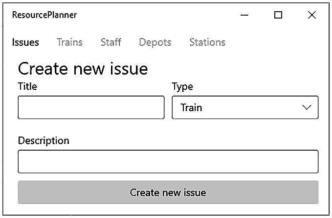
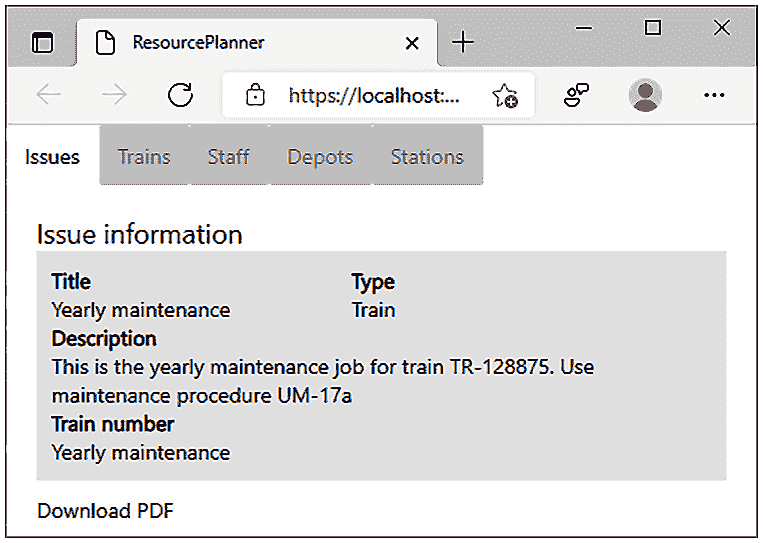

# 第三章：使用表单和数据

在这一章中，我们将为虚构公司 UnoBookRail 编写我们的第一个应用程序，该应用程序将针对桌面和 Web 进行定位。我们将编写一个典型的**业务线**（LOB）应用程序，允许我们查看、输入和编辑数据。除此之外，我们还将介绍如何以 PDF 格式导出数据，因为这是 LOB 应用程序的常见要求。

在本章中，我们将涵盖以下主题：

+   编写以桌面为重点的 Uno 平台应用程序

+   编写表单并验证用户输入

+   在您的 Uno 平台应用程序中使用 Windows 社区工具包

+   以编程方式生成 PDF 文件

到本章结束时，您将创建一个以桌面为重点的应用程序，也可以在 Web 上运行，显示数据，允许您编辑数据，并以 PDF 格式导出数据。

# 技术要求

本章假设您已经设置好了开发环境，并安装了项目模板，就像我们在*第一章*中介绍的那样，*介绍 Uno 平台*。本章的源代码可以在[`github.com/PacktPublishing/Creating-Cross-Platform-C-Sharp-Applications-with-Uno-Platform/tree/main/Chapter03`](https://github.com/PacktPublishing/Creating-Cross-Platform-C-Sharp-Applications-with-Uno-Platform/tree/main/Chapter03)找到。

本章的代码使用了以下库：[`github.com/PacktPublishing/Creating-Cross-Platform-C-Sharp-Applications-with-Uno-Platform/tree/main/SharedLibrary`](https://github.com/PacktPublishing/Creating-Cross-Platform-C-Sharp-Applications-with-Uno-Platform/tree/main/SharedLibrary)。

查看以下视频以查看代码的运行情况：[`bit.ly/3fWYRai`](https://bit.ly/3fWYRai)

# 介绍应用程序

在本章中，我们将构建 UnoBookRail **ResourcePlanner**应用程序，该应用程序将在 UnoBookRail 内部使用。UnoBookRail 的员工将能够使用这个应用程序来管理 UnoBookRail 内部的任何资源，比如火车和车站。在本章中，我们将开发应用程序的问题管理部分。虽然这个应用程序的真实版本会有更多的功能，但在本章中，我们只会开发以下功能：

+   创建一个新问题

+   显示问题列表

+   以 PDF 格式导出问题

由于这个应用程序是一个典型的业务线应用程序，该应用程序将针对 UWP、macOS 和 WASM。让我们继续创建这个应用程序。

## 创建应用程序

让我们开始创建应用程序的解决方案：

1.  在 Visual Studio 中，使用**多平台应用程序（Uno 平台）**模板创建一个新项目。

1.  将项目命名为**ResourcePlanner**。如果您愿意，也可以使用其他名称，但在本章中，我们将假设项目名为**ResourcePlanner**。

1.  删除除**UWP**、**macOS**和**WASM**之外的所有项目头。

1.  为了避免写更多的代码，我们需要从[`github.com/PacktPublishing/Creating-Cross-Platform-C-Sharp-Applications-with-Uno-Platform/tree/main/SharedLibrary`](https://github.com/PacktPublishing/Creating-Cross-Platform-C-Sharp-Applications-with-Uno-Platform/tree/main/SharedLibrary)下载共享库项目，并添加引用。为此，在`UnoBookRail.Common.csproj`文件中右键单击解决方案节点，然后单击**打开**。

1.  现在我们已经将项目添加到解决方案中，我们需要在特定于平台的项目中添加对库的引用。为此，在**解决方案资源管理器**中右键单击**UWP**项目节点，选择**添加 > 引用... > 项目**，选中**UnoBookRail.Common**条目，然后单击确定。*对 macOS 和 WASM 项目重复此过程*。

1.  最后，在`LinkerConfig.xml`文件的闭合链接标签之前添加以下代码，在`LinkerConfig.xml`文件中告诉 WebAssembly 链接器包括编译源代码中的类型，即使这些类目前没有被使用。如果我们不指定这些条目，那么程序集中定义的类型将不会被包括，因为链接器会删除代码。这是因为它找不到直接的引用。当使用其他包或库时，您可能还需要为这些库指定条目。不过，在本章中，前面的条目就足够了。

对于我们的应用程序，我们将使用**Model-View-ViewModel**（**MVVM**）模式。这意味着我们的应用程序将主要分为三个区域：

+   **Model**：**Model**包含应用程序的数据和业务逻辑。例如，这将处理从数据库加载数据或运行特定业务逻辑。

+   **ViewModel**：**ViewModel**充当视图和模型之间的层。它以适合视图的方式呈现应用程序的数据，提供视图与模型交互的方式，并通知视图模型的更改。

+   **View**：**View**代表用户的数据，并负责屏幕上的表示内容。

为了使开发更容易，我们将使用**Microsoft.Toolkit.MVVM**包，现在我们将添加它。这个包帮助我们编写我们的 ViewModel，并处理 XAML 绑定所需的样板代码：

1.  首先，在**解决方案**视图中右键单击解决方案节点，然后选择**管理解决方案的 NuGet 包...**。

1.  现在，搜索**Microsoft.Toolkit.MVVM**，并从列表中选择该包。

1.  从项目列表中选择**macOS**、**UWP**和**WASM**项目，然后单击**安装**。

1.  由于我们稍后会使用它们，还要创建三个名为**Models**、**ViewModels**和**Views**的文件夹。为此，在**ResourcePlanner.Shared**共享项目中右键单击，选择**添加 > 新文件夹**，并命名为**Models**。对于**ViewModels**和**Views**，重复此过程。

现在我们已经设置好了项目，让我们从向我们的应用程序添加第一部分代码开始。与业务应用程序一样，我们将使用**MenuBar**控件作为切换视图的主要方式：

1.  首先，在**ViewModels**文件夹中创建一个名为**NavigationViewModel**的新类。

1.  现在，用以下代码替换`NavigationViewModel.cs`文件中的代码：

```cs
using Microsoft.Toolkit.Mvvm.ComponentModel;
using Microsoft.Toolkit.Mvvm.Input;
using System.Windows.Input;
using Windows.UI.Xaml;
namespace ResourcePlanner.ViewModels
{
    public class NavigationViewModel :
        ObservableObject
    {
        private FrameworkElement content;
        public FrameworkElement Content
        {
            Get
            {
                return content;
            }
            Set
            {
                SetProperty(ref content, value);
            }
        }
        public ICommand Issues_OpenNewIssueViewCommand
            { get; }
        public ICommand Issues_ExportIssueViewCommand 
            { get; }
        public ICommand Issues_OpenAllIssuesCommand {
            get; }
        public ICommand Issues_OpenTrainIssuesCommand
            { get; }
        public ICommand 
            Issues_OpenStationIssuesCommand { get; }
        public ICommand Issues_Open OtherIssuesCommand
            { get; }
        public NavigationViewModel()
        {
            Issues_OpenNewIssueViewCommand = 
                new RelayCommand(() => { });
            Issues_ExportIssueViewCommand = 
                new RelayCommand(() => { });
            Issues_OpenAllIssuesCommand =
                new RelayCommand(() => { });
            Issues_OpenAllTrainIssuesCommand = 
                new RelayCommand(() => { });
            Issues_OpenAllStationIssuesCommand =
                new RelayCommand(() =>{ });
            Issues_OpenAllOtherIssuesCommand = 
                new RelayCommand(() =>{ });
        }
    }
}
```

这是处理导航到不同控件的类。随着我们在本章后面实现更多视图，我们将更新`Command`对象，使其指向正确的视图。

1.  现在，在`MainPage`类中添加以下代码：

```cs
using ResourcePlanner.ViewModels;
...
private NavigationViewModel navigationVM = new NavigationViewModel();
```

这将在`MainPage`类中添加一个`NavigationViewModel`对象，我们可以在 XAML 中绑定它。

1.  最后，用以下内容替换您的`MainPage.xaml`文件的内容：

```cs
    ...
    xmlns:muxc="using:Microsoft.UI.Xaml.Controls">
    <Grid Background="{ThemeResource 
        ApplicationPageBackgroundThemeBrush}">
        <Grid.RowDefinitions>
            <RowDefinition Height="Auto"/>
            <RowDefinition Height="*"/>
        </Grid.RowDefinitions>
        <muxc:MenuBar>
            <muxc:MenuBar.Items>
                <muxc:MenuBarItem Title="Issues">
                    <MenuFlyoutItem Text="New" 
                        Command="{x:Bind
                        navigationVM.Issues_
                        OpenNewIssueViewCommand}"/>
                    <MenuFlyoutItem Text="Export to 
                        PDF" Command="{x:Bind 
                        navigationVM.Issues_
                        ExportIssueViewCommand}"/>
                    <MenuFlyoutSeparator/>
                    <MenuFlyoutItem Text="All" 
                        Command="{x:Bind 
                        navigationVM.Issues_
                        OpenAllIssuesCommand}"/>
                    <MenuFlyoutItem Text="Train 
                        issues" Command="{x:Bind 
                        navigationVM.Issues_
                        OpenTrainIssuesCommand}"/>
                    <MenuFlyoutItem Text="Station 
                        issues" Command="{x:Bind 
                        navigationVM.Issues_
                        OpenStationIssuesCommand}"/>
                    <MenuFlyoutItem Text="Other 
                         issues" Command="{x:Bind 
                         navigationVM.Issues_
                         OpenOtherIssuesCommand}"/>
                </muxc:MenuBarItem>
                <muxc:MenuBarItem Title="Trains"
                    IsEnabled="False"/>
                <muxc:MenuBarItem Title="Staff"
                    IsEnabled="False"/>
                <muxc:MenuBarItem Title="Depots"
                    IsEnabled="False"/>
                <muxc:MenuBarItem Title="Stations"
                    IsEnabled="False"/>
            </muxc:MenuBar.Items>
        </muxc:MenuBar>
        <ContentPresenter Grid.Row="1"
            Content="{x:Bind navigationVM.Content,
                Mode=OneWay}"/>
    </Grid>
```

此代码添加了`MenuBar`，用户可以使用它导航到不同的视图。底部的`ContentPresenter`用于显示导航到的内容。

现在，如果启动应用程序，您将看到类似以下的内容：


图 3.1 - 运行带有 MenuBar 导航的 ResourcePlanner 应用程序

在下一节中，我们将向应用程序添加第一个视图，允许用户创建新问题。

# 输入和验证数据

业务应用程序的典型要求是输入数据并为所述数据提供输入验证。Uno 平台提供了各种不同的控件，允许用户输入数据，除了支持 Uno 平台的数十个库。

注意

在撰写本文时，尚无内置的输入验证支持，但 Uno 平台计划支持输入验证。这是因为目前 UWP 和 WinUI 3 都不完全支持输入验证。要了解有关即将到来的输入验证支持的更多信息，请查看 WinUI 存储库中的以下问题：[`github.com/microsoft/microsoft-ui-xaml/issues/179`](https://github.com/microsoft/microsoft-ui-xaml/issues/179)。Uno 平台正在跟踪此问题的进展：[`github.com/unoplatform/uno/issues/4839`](https://github.com/unoplatform/uno/issues/4839)。

为了使我们的开发过程更加简单，首先让我们添加对 Windows 社区工具包控件的引用：

1.  首先，在**解决方案**视图中右键单击解决方案节点，然后选择**管理解决方案的 NuGet 包…**。

1.  搜索**Microsoft.Toolkit.UI.Controls**并选择该包。

1.  在项目列表中选择**UWP**头，并单击**安装**。

1.  对**Microsoft.Toolkit.UI.Controls.DataGrid**包重复*步骤 2*和*3*。

1.  现在，搜索**Uno.Microsoft.Toolkit.UI.Controls**并选择该包。

注意

虽然 Windows 社区工具包仅支持 UWP，但由于 Uno 平台团队的努力，我们也可以在所有支持的平台上在 Uno 平台应用程序中使用 Windows 社区工具包。Uno 平台团队根据原始包维护了与 Uno 平台兼容的 Windows 社区工具包版本，并相应地更新它们。

1.  从项目列表中选择**macOS**和**WASM**头，并单击**安装**。

1.  最后，对**Uno.Microsoft.Toolkit.UI.Controls.DataGrid**包重复*步骤 5*和*6*。

这使我们能够在应用程序中使用 Windows 社区工具包控件。由于我们还希望在 macOS 和 WASM 上使用这些控件，因此我们还安装了这两个包的 Uno 平台版本。由于我们添加了**Windows 社区工具包**控件包，我们可以开始创建“创建问题”视图：

1.  首先，在`Models`文件夹内创建`IssueRepository.cs`类，并将以下代码添加到其中：

```cs
using System.Collections.Generic;
using UnoBookRail.Common.Issues;
namespace ResourcePlanner.Models
{
    public class IssuesRepository
    {
        private static List<Issue> issues = new
            List<Issue>();
        public static List<Issue> GetAllIssues()
        {
            return issues;
        }
        public static void AddIssue(Issue issue)
        {
            issues.Add(issue);
        }
    }
}
```

这是收集问题的模型。在现实世界的应用程序中，此代码将与数据库或 API 通信以持久化问题，但为简单起见，我们只会将它们保存在列表中。

1.  接下来，在`ViewModels`文件夹中创建`CreateIssueViewModel.cs`类，并使用来自 GitHub 的以下代码：[`github.com/PacktPublishing/Creating-Cross-Platform-C-Sharp-Applications-with-Uno-Platform/blob/main/Chapter03/ResourcePlanner.Shared/ViewModels/CreateIssueViewModel.cs`](https://github.com/PacktPublishing/Creating-Cross-Platform-C-Sharp-Applications-with-Uno-Platform/blob/main/Chapter03/ResourcePlanner.Shared/ViewModels/CreateIssueViewModel.cs)

现在我们已经创建了必要的模型和视图模型，接下来我们将继续添加用户界面以创建新问题。

对于用户界面，我们将实现输入验证，因为这在业务应用程序的数据输入表单中是典型的。为此，我们将实现以下行为：如果用户单击“创建问题”按钮，我们将使用代码后台中的函数验证数据。如果我们确定数据有效，我们将创建一个新问题；否则，我们将在每个未通过自定义验证的字段下方显示错误消息。除此之外，我们将在输入更改时验证输入字段。

让我们继续创建用户界面：

1.  在`Views`文件夹内创建一个名为`CreateIssueView.xaml`的新`UserControl`，并用以下内容替换 XAML：

```cs
<UserControl
    x:Class="ResourcePlanner.Views.CreateIssueView"
     xmlns="http://schemas.microsoft.com/winfx/2006
           /xaml/presentation"
     xmlns:x="http://schemas.microsoft.com/
              winfx/2006/xaml" 
    xmlns:local="using:ResourcePlanner.Views"
    xmlns:d="http://schemas.microsoft.com/
            expression/blend/2008"
    xmlns:mc="http://schemas.openxmlformats.org/
             markup-compatibility/2006"
    xmlns:wctcontrols="using:Microsoft.Toolkit.
                       Uwp.UI.Controls"
    xmlns:wctui="using:Microsoft.Toolkit.Uwp.UI"
    xmlns:ubrcissues="using:UnoBookRail.Common.Issues"
    mc:Ignorable="d"
    d:DesignHeight="300"
    d:DesignWidth="400">
    <StackPanel Orientation="Vertical" Padding="20">
        <TextBlock Text="Create new issue"
            FontSize="24"/>
        <Grid ColumnSpacing="10">
            <Grid.ColumnDefinitions>
                <ColumnDefinition Width="200"/>
                <ColumnDefinition Width="200"/>
            </Grid.ColumnDefinitions>
            <Grid.RowDefinitions>
                <RowDefinition />
                <RowDefinition />
            </Grid.RowDefinitions>
            <TextBox x:Name="TitleTextBox"
                Header="Title"
                Text="{x:Bind createIssueVM.Title,
                       Mode=TwoWay}"
                HorizontalAlignment="Stretch" 
                TextChanged="FormInput_TextChanged"/>
            <TextBlock x:Name="titleErrorNotification" 
                Grid.Row="1"Foreground="{ThemeResource
                    SystemErrorTextColor}"/>
            <ComboBox Header="Type" Grid.Column="1"
                ItemsSource="{wctui:EnumValues 
                    Type=ubrcissues:IssueType}"
                HorizontalAlignment="Stretch"
                SelectedItem="{x:Bind 
                    createIssueVM.IssueType, 
                    Mode=TwoWay}"/>
        </Grid>
        <TextBox Header="Description"
            Text="{x:Bind createIssueVM.Description,
                Mode=TwoWay}"
            MinWidth="410" MaxWidth="800" 
            HorizontalAlignment="Left"/>
        <Button Content="Create new issue"
            Margin="0,20,0,0" Width="410" 
            HorizontalAlignment="Left"
            Click="CreateIssueButton_Click"/>
    </StackPanel>
</UserControl>
```

这是一个基本的用户界面，允许用户输入标题和描述，并让用户选择问题的类型。请注意，我们在文本输入下方添加了一个`TextBlock`控件，以便在提供的输入无效时向用户显示错误消息。除此之外，我们还为`Title`添加了一个`TextChanged`监听器，以便在文本更改时更新错误消息。

1.  现在，用以下代码替换`CreateIssueView.xaml.cs`文件的内容：

```cs
using ResourcePlanner.ViewModels;
using Windows.UI.Xaml;
using Windows.UI.Xaml.Controls;
namespace ResourcePlanner.Views
{
    public sealed partial class CreateIssueView :
        UserControl
    {
        private CreateIssueViewModel createIssueVM;
        public CreateIssueView(CreateIssueViewModel
            viewModel)
        {
            this.createIssueVM = viewModel;
            this.InitializeComponent();
        }
        private void FormInput_TextChanged(object 
            sender, TextChangedEventArgs args)
        {
            EvaluateFieldsValid(sender);
        }
        private bool EvaluateFieldsValid(object
            sender)
        {
            bool allValid = true;
            if(sender == TitleTextBox || sender ==
               null)
            {
                if (TitleTextBox.Text.Length == 0)
                {
                    allValid = false;
                    titleErrorNotification.Text = 
                        "Title must not be empty.";
                }
                Else
                {
                    titleErrorNotification.Text = "";
                }
            }
            return allValid;
        }
        private void CreateIssueButton_Click(object
            sender, RoutedEventArgs args)
        {
            if (EvaluateFieldsValid(null))
            {                
                createIssueVM.CreateIssueCommand.
                    Execute(null);
            }
        }
    }
}
```

使用这段代码，我们现在在输入字段的文本更改或用户点击`CreateIssueCommand`时，将运行输入验证。

1.  最后，在`NavigationViewModel.cs`文件中，用以下代码替换`Issues_OpenNewIssueViewCommand`对象的创建，并添加必要的`using`语句。这样，当命令被调用时，`CreateIssueView`将被显示：

```cs
Issues_OpenNewIssueViewCommand = new RelayCommand(() =>
{
     Content = new CreateIssueView(new 
         CreateIssueViewModel(this));
});
```

现在，如果您启动应用程序并单击**问题**下拉菜单中的**新问题**选项，您将看到类似以下*图 3.2*的内容：



图 3.2 - 创建新问题界面

如果您尝试单击**创建新问题**按钮，您将在标题输入字段下方看到一条简短的消息，指出“标题不能为空”。在**标题**字段中输入文本后，消息将消失。虽然我们已经添加了简单的输入，但现在我们将使用 Windows Community Toolkit 添加更多的输入选项。

## 使用 Windows Community Toolkit 控件

到目前为止，用户只能输入标题和描述，并选择问题的类型。但是，我们还希望允许用户根据问题的类型输入特定的数据。为此，我们将使用 Windows Community Toolkit 提供的控件之一：**SwitchPresenter**。**SwitchPresenter**控件允许我们根据已设置的属性呈现 UI 的特定部分，类似于 C#中的 switch case 的工作方式。

当然，**SwitchPresenter**不是来自 Windows Community Toolkit 的唯一控件；还有许多其他控件，例如**GridSplitter**，**MarkdownTextBlock**和**DataGrid**，我们将在*使用 DataGrid 显示数据*部分中使用。由于我们在本章的早些时候已经安装了必要的软件包，我们将向用户界面添加控件。让我们开始吧：

1.  在`CreateIssueView.xaml`的描述`TextBox`控件下方添加以下 XAML 代码：

```cs
<wctcontrols:SwitchPresenter Value="{x:Bind createIssueVM.IssueType, Mode=OneWay}">
    <wctcontrols:SwitchPresenter.SwitchCases>
        <wctcontrols:Case Value="{x:Bind
            ubrcissues:IssueType.Train}">
            <StackPanel Orientation="Horizontal"
                Spacing="10">
                <StackPanel MinWidth="410" 
                    MaxWidth="800">
                    <TextBox x:Name=
                        "TrainNumberTextBox" 
                        Header="Train number" 
                        Text="{x:Bind
                          createIssueVM.TrainNumber,
                            Mode=TwoWay}"
                        HorizontalAlignment="Stretch"
                        TextChanged=
                          "FormInput_TextChanged"/>
                    <TextBlock x:Name=
                        "trainNumberErrorNotification"
                        Foreground="{ThemeResource 
                          SystemErrorTextColor}"/>
                </StackPanel>
            </StackPanel>
        </wctcontrols:Case>
        <wctcontrols:Case Value="{x:Bind 
            ubrcissues:IssueType.Station}">
            <StackPanel MinWidth="410" MaxWidth="800"
                HorizontalAlignment="Left">
                <TextBox x:Name="StationNameTextBox"
                  Header="Station name" Text="{x:Bind
                    createIssueVM.StationName,
                      Mode=TwoWay}"
                    HorizontalAlignment="Stretch"
                        TextChanged=
                            "FormInput_TextChanged"/>
                <TextBlock x:Name=
                    "stationNameErrorNotification" 
                        Foreground="{ThemeResource
                            SystemErrorTextColor}"/>
            </StackPanel>
        </wctcontrols:Case>
        <wctcontrols:Case Value="{x:Bind 
            ubrcissues:IssueType.Other}">
            <StackPanel MinWidth="410" MaxWidth="800"
                HorizontalAlignment="Left">
                <TextBox x:Name="LocationTextBox" 
                    Header="Location" Text="{x:Bind
                        createIssueVM.Location, 
                            Mode=TwoWay}"
                    HorizontalAlignment="Stretch"
                        TextChanged=
                            "FormInput_TextChanged"/>
                <TextBlock x:Name=
                    "locationErrorNotification"
                        Foreground="{ThemeResource 
                            SystemErrorTextColor}"/>
            </StackPanel>
        </wctcontrols:Case>
    </wctcontrols:SwitchPresenter.SwitchCases>
</wctcontrols:SwitchPresenter>
```

这使我们能够根据用户选择的问题类型显示特定的输入字段。这是因为`SwitchPresenter`根据已设置的`Value`属性呈现特定的`Case`。由于我们将其绑定到 ViewModel 的`IssueType`属性，所以每当用户更改问题类型时，它都会相应地更新。请注意，只有在我们将模式指定为`OneWay`时，此绑定才有效，因为`x:Bind`的默认绑定模式是`OneTime`，因此不会更新。

1.  现在，在`CreateIssueViewModel.xaml.cs`中的`EvaluateFields`函数的返回语句之前添加以下代码：

```cs
if (sender == TrainNumberTextBox || sender == null)
{
    if (TrainNumberTextBox.Text.Length == 0)
    {
        if (createIssueVM.IssueType ==
            UnoBookRail.Common.Issues.IssueType.Train)
        {
            allValid = false;
        }
        trainNumberErrorNotification.Text = 
            "Train number must not be empty.";
    }
    else
    {
        trainNumberErrorNotification.Text = "";
    }
}
if (sender == StationNameTextBox || sender == null)
{
    if (StationNameTextBox.Text.Length == 0)
    {
        if (createIssueVM.IssueType ==
          UnoBookRail.Common.Issues.IssueType.Station)
        {
            allValid = false;
        }
        stationNameErrorNotification.Text = 
            "Station name must not be empty.";
    }
    else
    {
        stationNameErrorNotification.Text = "";
    }
}
if (sender == LocationTextBox || sender == null)
{
    if (LocationTextBox.Text.Length == 0)
    {
        if (createIssueVM.IssueType == 
            UnoBookRail.Common.Issues.IssueType.Other)
        {
            allValid = false;
        }
        locationErrorNotification.Text = 
            "Location must not be empty.";
    }
    else
    {
        locationErrorNotification.Text = "";
    }
}
```

现在，我们的输入验证也将考虑到新增的输入字段。请注意，只有当与问题相关的输入不符合验证过程时，我们才会阻止创建问题。例如，如果问题类型是`Train`，我们将忽略位置文本是否通过验证，用户可以创建新问题，无论位置输入是否通过验证阶段。

现在，如果您启动应用程序并导航到**创建新问题**视图，您将看到类似以下*图 3.3*的内容：


图 3.3 - 更新的问题创建视图。左：选择了问题 Train 类型；右：选择了问题 Station 类型

当您更改问题类型时，您会注意到表单会更改，并根据问题类型显示正确的输入字段。虽然我们允许用户创建新问题，但我们目前无法显示它们。在下一节中，我们将通过添加新视图来改变这一点，以显示问题列表。

# 使用 DataGrid 显示数据

由于 UnoBookRail 员工将使用此应用程序来管理现有问题，对于他们来说，查看所有问题以便轻松了解其当前状态非常重要。虽然没有内置的 UWP 和 Uno Platform 控件可以轻松实现这一点，但幸运的是，Windows Community Toolkit 包含了适合这种情况的正确控件：**DataGrid**。

**DataGrid**控件允许我们将数据呈现为表格，指定要显示的列，并允许用户根据列对表格进行排序。然而，在开始使用**DataGrid**控件之前，我们需要创建 ViewModel 并准备视图：

1.  首先，在`ViewModels` `Solution`文件夹中创建一个名为`IssueListViewModel.cs`的新类，并向其中添加以下代码：

```cs
using System.Collections.Generic;
using UnoBookRail.Common.Issues;
namespace ResourcePlanner.ViewModels
{
    public class IssueListViewModel
    {
        public readonly IList<Issue> Issues;
        public IssueListViewModel(IList<Issue> issues)
        {
            this.Issues = issues; 
        }
    }
}
```

由于我们只想显示问题的一个子集，例如导航到列车问题列表时，要显示的问题列表将作为构造函数参数传递。

1.  现在，在`Views`文件夹中创建一个名为`IssueListView.xaml`的新`UserControl`。

1.  最后，在`NavigationViewModel`类的构造函数中，用以下代码替换创建`Issues_OpenAllIssuesCommand`，`Issues_OpenTrainIssuesCommand`，`Issues_OpenTrainIssuesCommand`和`Issues_OpenTrainIssuesCommand`对象：

```cs
Issues_OpenAllIssuesCommand = new RelayCommand(() =>
{
    Content = new IssueListView(new IssueListViewModel
        (IssuesRepository.GetAllIssues()), this);
});
Issues_OpenTrainIssuesCommand = new RelayCommand(() =>
{
    Content = new IssueListView(new IssueListViewModel
        (IssuesRepository.GetAllIssues().Where(issue
            => issue.IssueType == 
                IssueType.Train).ToList()), this);
});
Issues_OpenStationIssuesCommand = new RelayCommand(() =>
{
    Content = new IssueListView(new IssueListViewModel
        (IssuesRepository.GetAllIssues().Where(issue
            => issue.IssueType == 
                IssueType.Station).ToList()), this);
});
Issues_OpenOtherIssuesCommand = new RelayCommand(() =>
{
    Content = new IssueListView(new IssueListViewModel
        (IssuesRepository.GetAllIssues().Where(issue 
            => issue.IssueType == 
                IssueType.Other).ToList()), this);
});
```

这使用户可以在用户从导航中单击相应元素时导航到问题列表，同时确保我们只显示与导航选项相关的列表中的问题。请注意，我们选择使用内联 lambda 创建命令。但是，您也可以声明函数并使用它们来创建`RelayCommand`对象。

现在我们已经添加了必要的 ViewModel 并更新了`NavigationViewModel`以允许我们导航到问题列表视图，我们可以继续编写我们的问题列表视图的 UI。

## 使用 DataGrid 控件显示数据

在我们实现问题列表视图之前，让我们快速介绍一下我们将使用的 DataGrid 的基本功能。有两种方法可以开始使用 DataGrid：

+   让 DataGrid 自动生成列。这样做的缺点是，列标题将使用属性名称，除非您在`AutoGeneratingColumn`内部更改它们。虽然它们对于开始使用 DataGrid 控件是很好的，但通常不是最佳选择。此外，使用此方法，您无法选择要显示的列；相反，它将显示所有列。

+   通过手动指定要包含的属性来指定要包含的属性。这种选项的优点是我们可以控制要包含的属性，并且还可以指定列名。当然，这也意味着我们必须确保我们的绑定是正确的，这是潜在的错误原因。

通过设置 DataGrid 的`Columns`属性并提供`DataGridColumn`对象的集合来指定 DataGrid 的列。对于某些数据类型，已经有内置的列可以使用，例如`DataGridTextColumn`用于基于文本的数据。每列都允许您通过指定`Header`属性以及用户是否可以通过`CanUserSort`属性对列进行排序来自定义显示的标题。对于没有内置`DataGridColumn`类型的更复杂数据，您还可以实现自己的`DataGridColumn`对象。或者，您还可以使用`DataGridTemplateColumn`，它允许您基于指定的模板呈现单元格。为此，您可以指定一个`CellTemplate`对象，用于呈现单元格，并一个`CellEditTemplate`对象，用于让用户编辑当前单元格的值。

除了指定列之外，DataGrid 控件还有更多您可以自定义的功能。例如，DataGrid 允许您选择行并自定义行和单元格背景。现在，让我们继续编写我们的问题列表。

现在我们已经介绍了 DataGrid 的基础知识，让我们继续编写我们的问题列表显示界面：

1.  为此，请将以下代码添加到`IssueListView.xaml.cs`文件中：

```cs
using Microsoft.Toolkit.Uwp.UI.Controls;
using ResourcePlanner.ViewModels;
using UnoBookRail.Common.Issues;
using Windows.UI.Xaml.Controls;
namespace ResourcePlanner.Views
{
    public sealed partial class IssueListView :
        UserControl
    {
        private IssueListViewModel issueListVM;
        private NavigationViewModel navigationVM;
        public IssueListView(IssueListViewModel
            viewModel, NavigationViewModel 
                navigationViewModel)
        {
            this.issueListVM = viewModel;
            this.navigationVM = navigationViewModel;
            this.InitializeComponent();
        }
        private void IssueList_SelectionChanged(object
            sender, SelectionChangedEventArgs e)
        {
            navigationVM.SetSelectedIssue((sender as 
                DataGrid).SelectedItem as Issue);
        }
    }
}
```

这允许我们从 DataGrid 创建到问题列表的绑定。请注意，我们还将添加一个`SelectionChanged`处理程序函数，以便我们可以通知`NavigationViewModel`是否已选择问题。我们这样做是因为某些选项只有在选择问题时才有意义。其中一个选项是**导出为 PDF**选项，我们将在*以 PDF 格式导出问题*部分中实现。

1.  将以下 XAML 命名空间定义添加到`IssueListView.xaml`文件中：

```cs
xmlns:wct="using:Microsoft.Toolkit.Uwp.UI.Controls"
```

1.  现在，请用以下 XAML 替换`IssueListView.xaml`文件中的`Grid`：

```cs
<wct:DataGrid
    SelectionChanged="IssueList_SelectionChanged"
    SelectionMode="Single"
    AutoGenerateColumns="False"
    ItemsSource="{x:Bind 
        issueListVM.Issues,Mode=OneWay}">
    <wct:DataGrid.Columns>
        <wct:DataGridTextColumn Header="Title"
            Binding="{Binding Title}" 
           IsReadOnly="True" CanUserSort="True"/>
        <wct:DataGridTextColumn Header="Type"
            Binding="{Binding IssueType}" 
            IsReadOnly="True" CanUserSort="True"/>
        <wct:DataGridTextColumn Header="Creator" 
            Binding="{Binding OpenedBy.FormattedName}"
            IsReadOnly="True" CanUserSort="True"/>
        <wct:DataGridTextColumn Header="Created on" 
            Binding="{Binding OpenDate}" 
            IsReadOnly="True" CanUserSort="True"/>
        <wct:DataGridCheckBoxColumn Header="Open" 
            Binding="{Binding IsOpen}" 
            IsReadOnly="True" CanUserSort="True"/>
        <wct:DataGridTextColumn Header="Closed by" 
            Binding="{Binding ClosedBy.FormattedName}"
            IsReadOnly="True" CanUserSort="True"/>
        <wct:DataGridTextColumn Header="Closed on" 
            Binding="{Binding CloseDateReadable}" 
            IsReadOnly="True" CanUserSort="True"/>
    </wct:DataGrid.Columns>
</wct:DataGrid>
```

在这里，我们为问题的最重要字段添加了列。请注意，我们只允许更改标题，因为其他字段需要比 DataGrid 表格布局更容易显示的更多逻辑。由于在这种情况下不支持`x:Bind`，我们使用`Binding`将属性绑定到列。

现在，如果您启动应用程序并创建一个问题，您将看到类似于以下*图 3.4*的内容：


图 3.4 - DataGrid 显示演示问题

在本节中，我们只涵盖了使用 Windows Community Toolkit DataGrid 控件的基础知识。如果您希望了解更多关于 DataGrid 控件的信息，官方文档包含了涵盖不同可用 API 的实际示例。您可以在这里找到更多信息：[`docs.microsoft.com/en-us/windows/communitytoolkit/controls/datagrid`](https://docs.microsoft.com/en-us/windows/communitytoolkit/controls/datagrid)。现在我们可以显示现有问题列表，接下来我们将编写问题的 PDF 导出。作为其中的一部分，我们还将学习如何编写一个自定义的 Uno Platform 控件，我们将仅在 Web 上使用。

# 以 PDF 格式导出问题

除了能够在业务应用程序的界面中查看数据之外，通常还希望能够导出数据，例如作为 PDF，以便可以打印或通过电子邮件发送。为此，我们将编写一个允许用户将给定问题导出为 PDF 的接口。由于没有内置的 API 可用，我们将使用**iText**库。请注意，如果您想在应用程序中使用该库，您需要遵循 AGPL 许可证或购买该库的商业许可证。但是，在我们编写生成 PDF 的代码之前，我们需要准备项目：

1.  首先，我们需要安装**iText** NuGet 包。为此，请右键单击解决方案并搜索**iText**。选择该包。然后，从项目列表中选择**macOS**、**UWP**和**WASM**头，并单击**安装**。

1.  现在，在`ViewModels`文件夹中创建一个名为`ExportIssueViewModel.cs`的类，其中包含以下代码：

```cs
using iText.Kernel.Pdf;
using iText.Layout;
using iText.Layout.Element;
using Microsoft.Toolkit.Mvvm.Input;
using System;
using System.IO;
using System.Runtime.InteropServices.WindowsRuntime;
using System.Windows.Input;
using UnoBookRail.Common.Issues;
namespace ResourcePlanner.ViewModels
{
    public class ExportIssueViewModel
    {
        public readonly Issue Issue;
        public ICommand SavePDFClickedCommand;
        public ExportIssueViewModel(Issue issue)
        {
            Issue = issue;
            SavePDFClickedCommand = 
               new RelayCommand(async () => { });
        }
    }
}
```

请注意，我们现在添加这些`using`语句，因为我们稍后在本节中会用到它们。

1.  现在，在**Views**文件夹中创建一个名为`ExportIssueView.xaml`的新`UserControl`。

1.  请用以下内容替换`ExportIssueView.xaml.cs`中的代码：

```cs
using ResourcePlanner.ViewModels;
using Windows.UI.Xaml.Controls;
namespace ResourcePlanner.Views
{
    public sealed partial class ExportIssueView : 
        UserControl
    {
        private ExportIssueViewModel exportIssueVM;
        public ExportIssueView(ExportIssueViewModel 
            viewModel)
        {
            this.exportIssueVM = viewModel;
            this.InitializeComponent();
        }
    }
}
```

1.  请用 GitHub 上的代码替换`ExportIssueView.xaml`中的代码：

[`github.com/PacktPublishing/Creating-Cross-Platform-C-Sharp-Applications-with-Uno-Platform/blob/main/Chapter03/ResourcePlanner.Shared/Views/ExportIssueView.xaml`](https://github.com/PacktPublishing/Creating-Cross-Platform-C-Sharp-Applications-with-Uno-Platform/blob/main/Chapter03/ResourcePlanner.Shared/Views/ExportIssueView.xaml)

1.  最后，在`NavigationViewModel.cs`文件中用以下代码替换`Issue_ExportIssueViewCommand`的创建：

```cs
Issues_ExportIssueViewCommand = new RelayCommand(() =>
{
    Content = new ExportIssueView(new 
        ExportIssueViewModel(this.selectedIssue));
});
```

现在我们已经添加了必要的接口，接下来我们将编写将问题导出为 PDF 的代码。由于桌面上的行为与网络上的行为不同，我们将先介绍桌面版本。

## 在桌面上导出

由于我们已经编写了用户界面，允许用户导出问题，唯一剩下的就是更新`ExportIssueViewModel`以生成 PDF 并为用户提供访问方式。在桌面上，我们将 PDF 文件写入本地文件系统并打开它。由于应用程序也是 UWP 应用程序，我们将文件写入应用程序的本地文件夹。现在，让我们更新`ExportIssueViewModel`：

1.  首先，在`ExportIsseuViewModel`类内创建一个名为`GeneratePDF`的新函数，代码如下：

```cs
public byte[] GeneratePDF()
{
    byte[] bytes;
    using (var memoryStream = new MemoryStream())
    {       
        bytes = memoryStream.ToArray();
    }
    return bytes;
}
```

1.  现在，在`using`块内的赋值之前添加以下代码：

```cs
var pdfWriter = new PdfWriter(memoryStream);
var pdfDocument = new PdfDocument(pdfWriter);
var document = new Document(pdfDocument);
document.Close();
```

这将创建一个新的`PdfWriter`和`PdfDocument`，它将使用`MemoryStream`对象写入到字节数组中。

1.  在添加`PDFWriter`，`PDFDocument`和`Document`之后，添加以下代码来编写文档的标题：

```cs
var header = new Paragraph("Issue export: " +
    Issue.Title)
     .SetTextAlignment(
        iText.Layout.Properties.TextAlignment.CENTER)
     .SetFontSize(20);
document.Add(header);
```

这将创建一个新的段落，其中包含文本“**问题导出：**”和问题的标题。它还设置了文本对齐和字体大小，以便更容易区分为文档的标题。

1.  由于我们还想导出有关问题的信息，请在调用`document.Close()`之前添加以下代码：

```cs
var issueType = new Paragraph("Type: " + Issue.IssueType);
document.Add(issueType);
switch (Issue.IssueType)
{
    case IssueType.Train:
        var trainNumber = new Paragraph("Train number: "
             + Issue.TrainNumber);
        document.Add(trainNumber);
        break;
    case IssueType.Station:
        var stationName = new Paragraph("Station name: "
             + Issue.StationName);
        document.Add(stationName);
        break;
    case IssueType.Other:
        var location = new Paragraph("Location: " + 
            Issue.Location);
        document.Add(issueType);
        break;
}
var description = new Paragraph("Description: " + Issue.Description);
document.Add(description);
```

这将根据问题的类型向 PDF 文档添加必要的段落。除此之外，我们还将问题的描述添加到 PDF 文档中。

注意

由于在向文档添加第一个元素时出现`NullReferenceException`的错误。不幸的是，在撰写本书时，没有已知的解决方法。这只会在调试器附加时发生，并且不会在应用程序运行时造成任何问题。在调试器附加时运行应用程序，您可以通过工具栏点击**继续**来继续调试应用程序。

1.  最后，用以下代码替换`SavePDFClickedCommand`的创建：

```cs
SavePDFClickedCommand = new RelayCommand(async () =>
{
#if !__WASM__
    var bytes = GeneratePDF();
    var tempFileName = 
        $"{Path.GetFileNameWithoutExtension
            (Path.GetTempFileName())}.pdf";
    var folder = Windows.Storage.ApplicationData.
        Current.TemporaryFolder;
    await folder.CreateFileAsync(tempFileName, 
        Windows.Storage.CreationCollisionOption.
            ReplaceExisting);
    var file = await
        folder.GetFileAsync(tempFileName);
    await Windows.Storage.FileIO.WriteBufferAsync
        (file, bytes.AsBuffer());
    await Windows.System.Launcher.LaunchFileAsync
        (file);
#endif
});
```

这将创建一个 PDF，将其保存到`apps`临时文件夹，并使用默认的 PDF 处理程序打开它。

注意

在本章中，我们将文件写入临时文件夹，并使用默认的 PDF 查看器打开它。根据您的应用程序和用例，`FileSavePicker`和其他文件选择器可能非常合适。您可以在这里了解更多关于`FileSavePicker`和其他可用文件选择器的信息：[`platform.uno/docs/articles/features/windows-storage-pickers.html`](https://platform.uno/docs/articles/features/windows-storage-pickers.html)。

要尝试问题导出，请启动应用程序并创建一个新问题。之后，从问题列表中选择问题，并从顶部的**问题**下拉菜单中单击**导出为 PDF**。现在，如果单击**创建 PDF**，PDF 将被创建。之后不久，PDF 将在您的默认 PDF 查看器中打开。PDF 应该看起来像这样：


图 3.5 - 演示问题导出 PDF

由于在 WASM 上运行应用程序时无法将文件写入用户的本地文件系统，因此在接下来的部分中，我们将通过编写自定义 HTML 元素控件来更新我们的应用程序，以在 WASM 上提供下载链接，而不是使用**创建 PDF**按钮。

## 通过下载链接在网络上导出

Uno Platform 的主要功能是运行在所有平台上的代码，它还允许开发人员编写特定于平台的自定义控件。您可以利用这一点来使用特定于平台的控件。在我们的情况下，我们将使用它来创建一个 HTML `a-tag`，为我们应用程序的 WASM 版本提供下载链接。我们将使用`Uno.UI.Runtime.WebAssembly.HtmlElement`属性来实现这一点：

1.  首先，在`Views`文件夹中创建一个名为`WasmDownloadElement.cs`的新类，并添加以下代码：

```cs
using System;
using System.Collections.Generic;
using System.Text;
using Windows.UI.Xaml;
using Windows.UI.Xaml.Controls;
namespace ResourcePlanner.Views
{
#if __WASM__
    [Uno.UI.Runtime.WebAssembly.HtmlElement("a")]
    public class WasmDownloadElement : ContentControl
    {
    }
#endif
}
```

这将是我们的`a`标签，我们将使用它来允许用户下载问题导出的 PDF。由于我们只希望在 WASM 上使用此控件，因此我们将其放在`#if __WASM__`预处理指令内。

1.  为了能够自定义下载的 MIME 类型和下载文件的名称，请将以下代码添加到`WasmDownloadElement`类中：

```cs
public static readonly DependencyProperty MimeTypeProperty = DependencyProperty.Register(
    "MimeType", typeof(string),
        typeof(WasmDownloadElement), new
        PropertyMetadata("application/octet-stream",
        OnChanged));
public string MimeType
{
    get => (string)GetValue(MimeTypeProperty);
    set => SetValue(MimeTypeProperty, value);
}
public static readonly DependencyProperty FileNameProperty = DependencyProperty.Register(
    "FileName", typeof(string),
        typeof(WasmDownloadElement), new 
        PropertyMetadata("filename.bin", OnChanged));
public string FileName
{
    get => (string)GetValue(FileNameProperty);
    set => SetValue(FileNameProperty, value);}
private string _base64Content;
public void SetBase64Content(string content)
{
    _base64Content = content;
    Update();
}
private static void OnChanged(DependencyObject dependencyobject, DependencyPropertyChangedEventArgs args)
{
    if (dependencyobject is WasmDownloadElement wd)
    {
        wd.Update();
    }
}
private void Update()
{
    if (_base64Content?.Length == 0)
    {
        this.ClearHtmlAttribute("href");
    }
    else
    {
        var dataUrl =
           $"data:{MimeType};base64,{_base64Content}";
        this.SetHtmlAttribute("href", dataUrl);
        this.SetHtmlAttribute("download", FileName);
    }
}
```

尽管这是很多代码，但我们只在`WasmDownloadElement`类上创建了两个`DependencyProperty`字段，即`MimeType`和`FileName`，并允许它们设置将要下载的内容。其余的代码处理在底层控件上设置正确的属性。

1.  最后，在`ExportIssueView`的构造函数中添加以下代码，调用`this.InitializeComponent()`后：

```cs
#if __WASM__
    this.WASMDownloadLink.MimeType =
       "application/pdf";
    var bytes = exportIssueVM.GeneratePDF();
    var b64 = Convert.ToBase64String(bytes);
    this.WASMDownloadLink.SetBase64Content(b64);
#endif
```

这将在下载链接上设置正确的 MIME 类型，并设置正确的内容进行下载。请注意，我们在本章前面在`ExportIssueView.xaml`文件中定义了`WASMDownloadLink`元素。

要测试这一点，请启动应用程序的 WASM 头。加载完成后，创建一个问题，然后从问题列表中选择它，然后通过**问题**选项点击**导出为 PDF**。现在，您应该看到**下载 PDF**选项，而不是**创建 PDF**按钮，如*图 3.6*所示：



图 3.6 - 在 WASM 上导出 PDF

点击链接后，PDF 导出将被下载。

# 总结

在本章中，我们构建了一个桌面应用程序，可以在 Windows、macOS 和 Web 上使用 WASM。我们介绍了如何编写带有输入验证的数据输入表单以及如何使用 Windows Community Toolkit。之后，我们学习了如何使用 Windows Community Toolkit DataGrid 控件显示数据。最后，我们介绍了如何以 PDF 格式导出数据，并通过编写自定义 HTML 控件提供了下载链接。

在下一章中，我们将构建一个移动应用程序。虽然它也将被设计用于 UnoBookRail 的员工使用，但主要重点将放在在移动设备上运行应用程序。除其他事项外，我们将利用这个应用程序来研究如何处理不稳定的连接以及使用设备功能，如相机。
