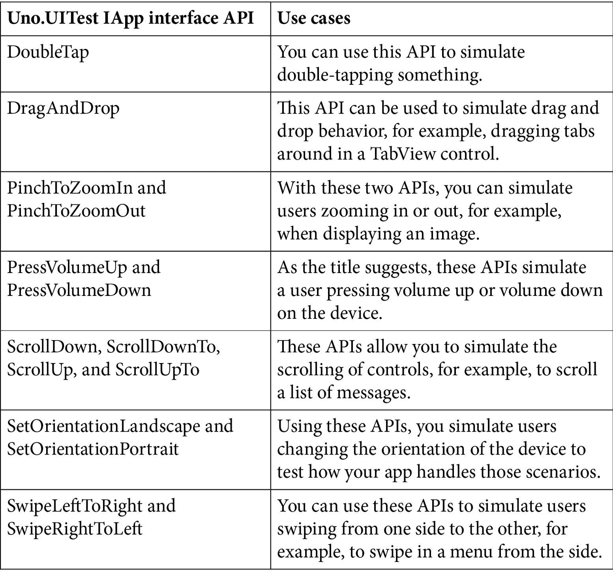
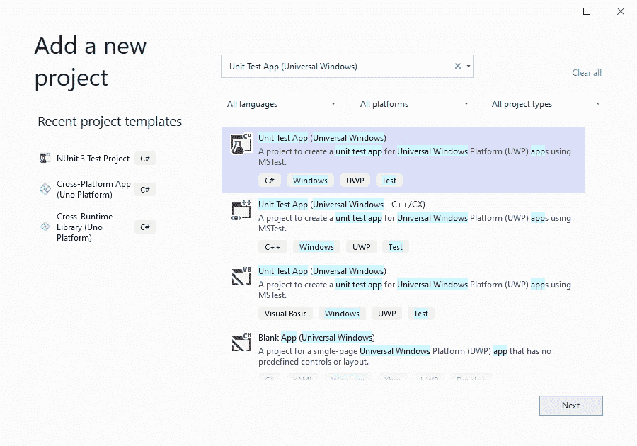

# 第七章：*第七章*：测试您的应用

在之前的章节中，我们介绍了使用 Uno 平台开发多种不同类型的应用。Uno 平台不仅允许编写应用程序，还允许使用 Uno.UITest 框架编写自动化 UI 测试，这些测试将在 Android、iOS 和 WebAssembly 上运行。在本章中，我们将使用 Uno.UITest 编写我们的第一个测试，并在不同平台上运行它，包括使用模拟器。之后，您还将学习如何使用 WinAppDriver 为 Windows 编写测试。

在本章中，我们将涵盖以下主题：

+   为您的应用设置`Uno.UITest`项目

+   为您的 Uno 平台应用编写`Uno.UITest`测试

+   针对您的应用的 WASM、Android 和 iOS 版本运行您的测试

+   为您的 Uno 平台应用编写单元测试

+   使用 WinAppDriver 为您的应用的 UWP 版本编写自动化测试

+   为什么手动测试仍然很重要

通过本章结束时，您将学会如何使用`Uno.UITest`和 WinAppDriver 为您的应用编写测试，如何在不同平台上运行这些测试，以及为什么手动测试您的应用仍然很重要。

# 技术要求

本章假设您已经设置好了开发环境，包括安装了项目模板，就像在*第一章*中介绍的那样，*介绍 Uno 平台*。本章的源代码可在[`github.com/PacktPublishing/Creating-Cross-Platform-C-Sharp-Applications-with-Uno-Platform/tree/main/Chapter07`](https://github.com/PacktPublishing/Creating-Cross-Platform-C-Sharp-Applications-with-Uno-Platform/tree/main/Chapter07)上找到。

本章中的代码使用了来自[`github.com/PacktPublishing/Creating-Cross-Platform-C-Sharp-Applications-with-Uno-Platform/tree/main/SharedLibrary`](https://github.com/PacktPublishing/Creating-Cross-Platform-C-Sharp-Applications-with-Uno-Platform/tree/main/SharedLibrary)的库。

查看以下视频以查看代码示例：[`bit.ly/3iBFZ2e`](https://bit.ly/3iBFZ2e)

# 开始使用 Uno.UITest

在我们开始使用 Uno.UITest 之前，让我们先了解一下 Uno.UITest 是什么，以及它的目标是什么。Uno.UITest 是由 Uno 平台团队开发和维护的库，允许开发人员为他们的 Uno 平台应用编写统一的 UI 测试。这些 UI 测试允许您模拟用户与您的应用进行交互，并验证您的应用的 UI，以确保用户交互正常工作，并且您的应用行为符合设计。使用 Uno.UITest，您可以编写 UI 测试（有时也称为交互测试），并针对您的应用的 Android、iOS 和 WASM 版本运行这些测试。

在内部，Uno.UITest 使用**Xamarin.UITest**来针对应用的 Android 和 iOS 版本运行测试。对于应用的 WASM 版本，Uno.UITest 使用**Selenium**和**Google Chrome**。使用这些库，Uno.UITest 允许您编写模拟用户与应用 UI 交互的测试，包括模拟鼠标输入（如点击）和键盘输入（如输入文本）。

但是何时应该使用 UI 测试？在编写复杂的应用程序时，确保代码更改没有破坏现有功能通常很难测试，特别是因为某些更改只有在使用应用程序时才会变得显而易见，而不是在单独测试组件或类时。UI 测试非常适合这种情况，因为您可以编写测试来模拟普通用户使用您的应用程序，而无需手动执行数十甚至数百个步骤。编写 UI 测试的常见场景是检查用户是否可以成功完成应用程序中的某些任务，例如登录到您的应用程序或搜索特定内容。虽然 UI 测试非常适合测试这些类型的场景，但 UI 测试并非万能药，也有其缺点。由于 UI 测试模拟用户输入，因此与仅测试单个对象或类的常规单元测试相比，它们运行速度较慢。此外，由于 UI 测试框架或库需要找到一种与您的应用程序交互的方法，因此在更新应用程序的 UI 或更改应用程序中的文本或名称时，UI 测试有时可能会出现问题。

然而，在开发应用程序时，编写 UI 测试非常重要，尤其是在尝试确保没有错误进入应用程序时。这在编写将在各种不同设备上运行的应用程序时尤其有用，这些设备具有不同的屏幕尺寸、功能和操作系统版本，因此可以更容易地在许多不同的配置上测试应用程序，因为手动测试速度慢且容易出错。

在使用 Uno.UITest 之前，我们首先需要一个可以用来编写测试的应用程序。为此，让我们首先创建一个新的解决方案，用于编写测试：

1.  使用**多平台应用程序（Uno 平台）**模板创建一个新项目。

1.  将项目命名为`UnoAutomatedTestsApp`。当然，您可以使用不同的名称；但是，在本章中，我们将假定项目命名为`UnoAutomatedTestsApp`。

1.  删除除 Android、iOS、UWP 和 WASM 之外的所有平台头项目。

1.  现在我们需要向我们的共享库添加引用。要做到这一点，右键单击解决方案文件，选择`UnoBookRail.Common.csproj`文件，然后单击**打开**。

1.  在每个头项目中引用共享库项目。为此，在头项目上右键单击，选择**添加 > 引用… > 项目**，选中**UnoBookRail.Common**，然后单击**确定**。由于我们需要在每个头中引用库，请为每个头重复此过程，换句话说，Android、iOS、UWP 和 WASM。

现在我们已经创建了项目，让我们向我们的应用程序添加一些内容，以便我们可以进行测试：

1.  将`xmlns:toolkit="using:Uno.UI.Toolkit"`添加到`MainPage.xaml`中。

1.  用以下内容替换`MainPage.xaml`文件中的`Grid`控件：

```cs
<StackPanel Spacing="10" Padding="10" 
    toolkit:VisibleBoundsPadding.PaddingMask="All" 
    Background="{ThemeResource 
        ApplicationPageBackgroundThemeBrush}">
    <StackPanel x:Name="SignInForm" Spacing="10">
        <TextBox x:Name="UsernameInput" 
            AutomationProperties.AutomationId=
                "UsernameInput"
            TextChanged="Username_TextChanged" 
                Header="Username"/>
        <PasswordBox x:Name="PasswordInput" 
            AutomationProperties.AutomationId=
                "PasswordInput"
            PasswordChanged="Password_PasswordChanged"
                Header="Password"/>
        <TextBlock x:Name=
            "SignInErrorMessageTextBlock" 
                AutomationProperties.AutomationId="
                    SignInErrorMessageTextBlock"
            Foreground="{ThemeResource 
                SystemErrorTextColor}" 
                    Visibility="Collapsed"/>
        <Button x:Name="SignInButton" 
            AutomationProperties.AutomationId=
                "SignInButton"
            Click="SignInButton_Click" 
                Content="Sign in" IsEnabled="False"
            HorizontalAlignment="Center" 
                BorderThickness="1"/>
    </StackPanel>
    <TextBlock x:Name="SignedInLabel" 
        AutomationProperties.AutomationId=
            "SignedInLabel"
        Text="Successfully signed in!" 
            Visibility="Collapsed"/>
</StackPanel>
```

1.  这是一个简单的登录界面，我们将在本章后面为其编写测试。它包括登录控件、登录按钮和在登录时显示的标签。

1.  现在，向`MainPage`类添加以下两个方法：

```cs
using UnoBookRail.Common.Auth;
...
private void Username_TextChanged(object sender, TextChangedEventArgs e)
{
    SignInButton.IsEnabled = UsernameInput.Text.Length
        > 0 && PasswordInput.Password.Length > 0;
}
private void Password_PasswordChanged(object sender, RoutedEventArgs e)
{
    SignInButton.IsEnabled = UsernameInput.Text.Length
        > 0 && PasswordInput.Password.Length > 0;
}
private void SignInButton_Click(object sender, RoutedEventArgs args)
{
    var signInResult = Authentication.SignIn(
        UsernameInput.Text, PasswordInput.Password);
    if(!signInResult.IsSuccessful && 
        signInResult.Messages.Count > 0)
    {
        SignInErrorMessageTextBlock.Text = 
            signInResult.Messages[0];
        SignInErrorMessageTextBlock.Visibility = 
            Visibility.Visible;
    }
    else
    {
        SignInErrorMessageTextBlock.Visibility = 
            Visibility.Collapsed;
        SignInForm.Visibility = Visibility.Collapsed;
        SignedInLabel.Visibility = Visibility.Visible;
    }
}
```

此代码添加了处理程序，允许我们在用户输入用户名和密码后立即启用登录按钮。否则，登录按钮将被禁用。除此之外，我们还处理登录按钮的点击，并相应地更新 UI，包括在登录失败时显示错误消息。

现在，如果您启动应用程序的 UWP 头，您将看到类似*图 7.1*的东西：


图 7.1 - 运行应用程序的屏幕截图，带有登录表单

现在我们已经添加了一个简单的测试应用程序，我们可以再次进行测试，现在我们可以添加我们的**Uno.UITest**测试项目：

1.  如果您想对应用程序的 WASM 头运行测试，请确保已安装 Google Chrome。

1.  首先，您需要更新 Android、iOS 和 WASM 头的项目文件。为此，在这些项目的`.csproj`文件的最后一个闭合项目标签之前添加以下条目：

```cs
<PropertyGroup Condition="'$(Configuration)'=='Debug' or '$(IsUiAutomationMappingEnabled)'=='True'"> 
    <IsUiAutomationMappingEnabled>
        True</IsUiAutomationMappingEnabled>
    <DefineConstants>$(DefineConstants);
        USE_UITESTS</DefineConstants>
 </PropertyGroup>
```

1.  对于 iOS 项目，添加对`Xamarin.TestCloud.Agent` NuGet 包的引用。由于在撰写时，最新的稳定版本是`OnLaunched`方法的`App.xaml.cs`文件，因此在该方法的开头添加以下内容：

```cs
#if __IOS__ && USE_UITESTS
      // Launches Xamarin Test Cloud Agent
      Xamarin.Calabash.Start();
 #endif
```

由于 Uno.UITest 库在底层使用 Xamarin.UITest，因此对于 iOS 应用程序，我们需要添加前面的代码。否则，Xamarin.UITest 无法与正在运行的 iOS 应用程序交互，测试将无法正常工作。

1.  由于 Uno.UITest 项目类型未包含在 Uno Platform Visual Studio 模板扩展中，请确保已安装了 Uno Platform `dotnet new`模板。您可以在*Chapter 1*中找到此说明，*介绍 Uno 平台*。

1.  在`UnoAutomatedTestsApp`文件夹内，创建一个名为`UnoAutomatedTestsApp.UITests`的文件夹。

1.  在新创建的文件夹内，运行以下命令：

```cs
dotnet new unoapp-uitest
```

这将在文件夹内创建一个新的 Uno.UITest 项目，并将该项目添加到解决方案文件中。

1.  更新 Android 和 iOS 应用程序的包名称。对于 Android，请使用`UnoBook.UnoAutomatedTestsApp`替换 Android 项目的`Properties/AndroidManifest.xml`文件。要替换 iOS 包名称，请打开 iOS 项目内的`Info.plist`文件，并将`Bundle Identifier`替换为`UnoBook.UnoAutomatedTestsApp`。

1.  现在我们需要更新 Uno.UITests 应用项目内的`Constants.cs`文件，以指向正确的应用程序。为此，请使用以下内容替换第 13、14 和 15 行：

```cs
public readonly static string iOSAppName = "UnoBook.UnoAutomatedTestsApp";
public readonly static string AndroidAppName = "UnoBook.UnoAutomatedTestsApp";
public readonly static string WebAssemblyDefaultUri = "http://localhost:[PORT]/";
```

由于 WASM 应用的端口是随机生成的，因此请使用前面代码中的以下信息替换`[PORT]`。

注意

我们需要更新`Constants.cs`文件，因为 Uno.UITest 需要能够通过应用程序名称或在 WASM 情况下的应用程序 URI 找到应用程序。要找出您的 WASM head 正在运行的 URI，请打开 WASM head 内的`Properties/launchSettings.json`。在那里，根据您是否将使用`[ProjectName].Wasm`目标，可以使用`[Project name].Wasm`配置文件中的`applicationUrl`来确定端口。在本章中，我们将使用位于 iOS 项目内的`Info.plist`文件。有关 Android 应用程序名称，请参考 Android 项目的`Properties/AndroidManifest.xml`文件中的包属性。

在**UnoAutomatedTestsApp.UITests**项目内，您将找到三个文件：

+   `Constants.cs`：这包含了使用应用程序包名称或应用程序的 URL 来找到正在运行的应用程序的配置，如前所述。

+   `Given_MainPage.cs`：这是一个包含小型测试的示例测试文件，显示了如何编写测试。

+   `TestBase.cs`：此文件包含所有启动和关闭应用程序的引导代码，并公开一个`IApp`实例（在下一节中详细介绍）。该文件还导出了一个`TakeScreenshot`函数，您可以使用它来对正在测试的运行中的应用程序进行截图。

现在我们已经介绍了如何设置 Uno.UITest 项目及其结构，让我们继续编写我们的第一个 Uno.UITest，并学习如何运行这些测试。

# 编写和运行您的第一个测试

在我们开始编写第一个测试之前，我们将介绍如何使用 Uno.UITest 与您的应用程序进行交互。为此，我们将首先介绍使用 Uno.UITests 查询功能对象来定位元素的基础知识。

## Uno.UITest 的工作原理

由于 UI 测试需要处理应用程序的 UI 元素，因此每个 UI 测试库都需要一种方式让开发人员处理这些元素。`Uno.UITest`使用`IAppQuery`接口来定义查询和`IApp`接口来运行这些查询和注入输入。

`IApp`接口为您提供了与应用程序交互所需的 API，包括单击元素、模拟滚动和注入文本输入。在创建`Uno.UITest`项目的过程中，`TestBase`类将为您提供一个`IApp`实例。由于`IApp`接口允许您模拟对应用程序的输入，并且大多数交互需要特定的控件作为交互的目标，因此`IApp`接口上的大多数方法都要求您指定控件的`AutomationID`属性或使用`IAppQuery`接口。

在下面的示例中，我们将使用`AutomationID`来单击按钮，如以下 XAML 中所定义的：

```cs
<!-- Setting AutomationId to reference button from UI test -->
<Button AutomationProperties.AutomationId="SignInButton Content="Sign in"/>
```

在编写 Uno.UITest 测试时，我们可以使用以下代码按下按钮：

```cs
App.Tap("SignInButton");
```

与使用`x:Name`/`AutomationID`来指定元素的控件不同，通过使用`IAppQuery`接口，您可以根据其他属性（例如它们的类型）或基于控件上设置的特定属性来寻址控件。在使用`IAppQuery`时，您会注意到`IApp`接口不希望得到`IAppQuery`类型的元素，而是希望得到`Func<IAppQuery,IAppQuery>`类型的元素。由于`IApp`接口在很大程度上依赖于此，因此您经常会看到以下`using-alias`语句：

```cs
using Query=System.Func<Uno.UITest.IAppQuery,Uno.UITest.IAppQuery>;
```

这使开发人员更容易编写查询，因为您可以简单地使用`Query`类型别名，而不必每次都写出来。为简单起见，在本章中，我们还将使用此`using`语句并使用`Query`类型。

如果我们从之前的 XAML 中获取，使用`IAppQuery`接口按下按钮可以按照以下方式完成：

```cs
Query signInButton = q => q.Marked("SignInButton");
App.Tap(signInButton);
```

当我们创建 Uno.UITest 项目时，您可能还注意到已添加了对 NUnit NuGet 包的引用。默认情况下，Uno.UITest 使用 NUnit 进行断言和测试。当然，这并不意味着您必须在测试中使用 NUnit。但是，如果您希望使用不同的测试框架，您将需要更新`TestBase.cs`文件，因为它使用 NUnit 属性来连接测试的设置和拆卸。

现在我们已经介绍了`Uno.UITest`的基本工作原理，现在我们将继续为我们的登录界面编写测试。

## 编写您的第一个测试

我们将从编写我们在本章开头添加的登录界面的第一个测试开始。为简单起见，我们将使用`NUnit`，因为在创建新的`Uno.UITest`项目时，默认情况下会使用`Uno.UITest`，这意味着我们不必更新`TestBase`类。我们首先创建一个新的测试文件：

1.  首先，删除现有的`Given_MainPage.cs`文件。

1.  创建一个名为`Tests`的新文件夹。

1.  在`Tests`文件夹内创建一个名为`SignInTests.cs`的新类。

1.  使用以下代码更新`SignInTests.cs`：

```cs
using NUnit.Framework;
using Query = System.Func<Uno.UITest.IAppQuery, Uno.UITest.IAppQuery>;
namespace UnoAutomatedTestsApp.UITests.Tests
{
    public class SignInTests : TestBase
    {
    }
}
```

我们继承自`TestBase`以访问当前测试运行的`IApp`实例并能够向我们的应用程序发送输入。除此之外，我们还添加了一个使用`NUnit`库的`using`语句，因为我们稍后将使用它，并添加了我们在*Uno.UITest 工作原理*部分中介绍的命名使用语句。

现在，让我们添加我们的第一个测试。让我们首先简单地检查电子邮件和密码输入字段以及登录按钮是否存在。在本节的其余部分，我们将只在`SignInTests.cs`文件中工作，因为我们正在为登录用户界面编写测试：

1.  首先添加一个新的公共函数，这将是我们的测试用例。我们将函数命名为`VerifySignInRenders`。

1.  添加`NUnit`知道该函数是一个测试。

1.  现在，在函数内添加以下代码：

```cs
App.WaitForElement("UsernameInput");
App.WaitForElement("PasswordInput");
App.WaitForElement("SignInButton");
```

您的`SignInTests`类现在应该看起来像这样：

```cs
public class SignInTests : TestBase
{
    [Test]
    public void VerifySignInRenders()
    {
        App.WaitForElement("UsernameInput", "Username input 
            wasn't found.");
        App.WaitForElement("PasswordInput", "Password input 
            wasn't found.");
        App.WaitForElement("SignInButton", "Sign in button 
            wasn't found.");
    }
}
```

现在我们的测试所做的是尝试查找具有`UserNameInput`、`PasswordInput`和`SignInButton`的自动化 ID 的元素，并且如果找不到这些元素，则测试失败。

现在我们已经编写了第一个测试，让我们试一下！为此，我们首先来看如何运行这些测试。

## 在 Android、iOS 和 WASM 上运行您的测试

针对您的应用的 Android、iOS 和 WASM 头运行您的`Uno.UITest`测试非常简单，尽管具体过程因您尝试启动的平台而略有不同。

### 针对 WASM 头运行测试

让我们首先针对我们应用的 WASM 头运行我们的测试：

1.  首先，您需要部署应用的 WASM 头。为此，请选择**UnoAutomatedTestsApp.Wasm**作为启动项目，并选择**IIS Express**目标，如*图 7.2*所示。然后，按下*Ctrl + F5*，这将部署项目。

图 7.2 - 选择了 IIS Express 的 WASM 项目

1.  更新`Constants.cs`并将`Constants.CurrentPlatform`更改为`Platform.Browser`。如果您尚未更新`Constants.WebAssemblyDefaultUri`属性，请按照*开始使用 Uno.UITest*部分中的说明进行操作。

1.  通过单击菜单栏中的**View**，然后单击**Test Explorer**来打开**Test Explorer**。现在，展开树并右键单击**VerifySignInRenders**测试。从弹出菜单中选择**Run**选项。现在，测试将针对在 Chrome 中运行的应用运行。

重要提示

在撰写本文时，由于 Uno.UITest 存在已知的 bug，针对 WASM 头运行测试可能无法正常工作，因为 Chrome 可能无法启动。不幸的是，目前还没有已知的解决方法。要了解有关此错误当前状态的更多信息，请参考以下 GitHub 问题：[`github.com/unoplatform/Uno.UITest/issues/60`](https://github.com/unoplatform/Uno.UITest/issues/60)。

一旦测试开始，Chrome 将以无头模式启动，一旦测试完成，测试将在 Visual Studio Test Explorer 中标记为通过。

### 针对您的应用的 Android 版本运行测试

除了针对 WASM 头运行测试外，您还可以针对在模拟器上运行的 Android 版本或在 Android 设备上运行的应用运行测试。要做到这一点，请按照以下步骤操作：

1.  确保**Android 模拟器**正在运行，并且应用已部署。要部署应用的 Android 版本，请选择 Android 项目作为启动项目，然后按下*Ctrl + F5*。如果您想对在 Android 设备上运行的应用运行测试，请确保应用已部署在设备上，并且您的设备已连接到计算机。

1.  更新`Constants.cs`并将`Constants.CurrentPlatform`更改为`Platform.Android`。如果您尚未更新`Constants.AndroidAppName`属性，请按照*开始使用 Uno.UITest*部分中的说明进行操作。

1.  与 WASM 一样，现在在**Test Explorer**中右键单击测试，然后单击**Run**。应用将在模拟器内或在 Android 设备上启动，并且测试将针对正在运行的 Android 应用运行。

### 针对 iOS 版本的应用运行测试

您还可以针对在模拟器上运行的 iOS 版本或在 iOS 设备上运行的应用运行 UI 测试。请注意，这需要 macOS。要针对 iOS 头运行测试，请按照以下步骤操作：

1.  确保 iOS 模拟器正在运行，并且应用已部署。要部署应用的 iOS 版本，请选择 iOS 项目作为启动项目并运行应用。如果您想对在 iOS 设备上运行的应用运行测试，请确保应用已部署在设备上，并且已连接到计算机。

1.  更新`Constants.cs`并将`Constants.CurrentPlatform`更改为`Platform.iOS`。将`iOSDeviceNameOrId`设置为您希望使用的模拟器或连接设备的名称。

如果使用连接设备，您可能还需要更改`iOSAppName`和`info.plist`，以使其与您的开发者证书兼容。

1.  现在，在**Tests**窗口中右键单击测试项目，然后单击**Run Test**。应用将启动，并且测试将运行。

附加信息

在 Mac 上运行 UI 测试需要具有兼容的测试库、工具和操作系统版本。如果在运行测试时遇到错误，请确保您拥有 OS X、Xcode、Visual Studio for Mac 和测试项目中使用的 NuGet 包的最新版本。您还可能需要确保您正在运行的设备或模拟器是最新的 iOS 版本（包括任何更新）。

在模拟器上运行 UI 测试可能会消耗大量资源。如果测试无法在模拟器上启动，可能需要在连接的设备上运行测试。

如果在物理设备上进行测试，必须启用 UI 自动化。在**设置 > 开发人员 > UI 自动化**中启用此功能。

希望会添加更多文档，使在 Mac 上进行测试和调试测试更加容易。有关此问题的进展，请参见[`github.com/unoplatform/Uno.UITest/issues/66`](https://github.com/unoplatform/Uno.UITest/issues/66)。

现在我们已经介绍了如何针对 Android、iOS 和 WASM 版本的应用程序运行测试，我们将通过为我们的登录界面编写更多 UI 测试来深入了解如何编写测试。

# 编写更复杂的测试

到目前为止，我们只测试了登录界面呈现的基本示例。但是，我们还希望确保我们的登录界面实际上可以正常工作并允许用户登录。为此，我们将编写一个新的测试，以确保在提供用户名和密码时，登录按钮是可点击的：

1.  在`SignInTests.cs`文件中创建一个名为`VerifyButtonIsEnabledWithUsernameAndPassword`的新函数，并为其添加**Test**属性。

1.  由于我们将经常使用这些查询，因此将以下`Query`对象添加到`SignInTests`类中：

```cs
Query usernameInput = q => q.Marked("UsernameInput");
Query passwordInput = q => q.Marked("PasswordInput");
Query signInButton = q => q.Marked("SignInButton");
```

1.  现在，让我们通过将以下代码插入`VerifyButtonIsEnabledWithUsernameAndPassword`测试来模拟在用户名和密码字段中输入文本：

```cs
App.ClearText(usernameInput);
App.EnterText(usernameInput, "test"); App.ClearText(passwordInput);
App.EnterText(passwordInput, "test");
```

重要提示

由于 Xamarin.UITest 存在一个 bug，Uno.UITest 用于 Android 和 iOS 的测试库，清除和输入测试无法在每台 Android 设备或模拟器上正常工作。您可以在这里找到有关此错误的更多信息：[`github.com/microsoft/appcenter/issues/1451`](https://github.com/microsoft/appcenter/issues/1451)。作为解决方法，您可以使用 API 版本为 28 或更低的 Android 模拟器，因为这些 Android 版本不受此 bug 影响。

这将模拟用户在用户名输入字段和密码输入字段中输入文本`test`。请注意，在这个和后续的测试中，我们将始终在输入文本之前清除文本，以确保输入了正确的文本。

注意

在作为一组运行多个测试时，例如通过选择多个测试或它们的根节点在测试资源管理器中，Uno.UITest 不会在各个测试之间重置应用程序。这意味着如果测试依赖于特定的初始应用程序状态，则需要为您的测试编写初始化代码。

1.  现在，让我们使用以下代码验证登录按钮是否已启用：

```cs
var signInButtonResult = App.WaitForElement(signInButton);
Assert.IsTrue(signInButtonResult[0].Enabled, "Sign in button was not enabled."); 
```

对于此操作，我们确保按钮存在，并获取该查询的`IAppResult[]`对象。然后，我们通过`IAppResult.Enabled`属性检查按钮是否已启用。请注意，我们通过提供第二个参数向断言添加了一条在断言失败时显示的消息。

现在，如果在 Android 上运行测试，应用程序将在您的 Android 设备或模拟器上启动。`Uno.UITest`然后会在**用户名**和**密码**输入字段中输入文本，您应该会看到登录按钮变为可点击状态。

现在让我们测试无效的登录凭据是否提供了有意义的错误消息。为此，我们将编写一个新的测试：

1.  在`SignInTests.cs`文件中创建一个名为`VerifyInvalidCredentialsHaveErrorMessage`的新函数，并为其添加**Test**属性。

1.  现在，在`SignInTests`类中添加一个新的查询，我们将用它来访问错误消息标签：

```cs
Query errorMessageLabel = q => q.Marked("SignInErrorMessageTextBlock");
```

1.  现在，让我们输入绝对无效的凭据并使用以下代码按下**登录**按钮：

```cs
App.ClearText(usernameInput);
App.EnterText(usernameInput, "invalid");
App.ClearText(passwordInput);
App.EnterText(passwordInput, "invalid");
App.Tap(signInButton);
```

1.  由于我们将在测试中使用`Uno.UITest`扩展方法和`Linq`，请添加以下`using`语句：

```cs
using System.Linq;
using Uno.UITest.Helpers.Queries;
```

1.  最后，我们需要使用以下代码验证错误消息。通过这样做，我们检查错误标签是否显示适当的错误消息：

```cs
var errorMessage = App.Query(q => errorMessageLabel (q).GetDependencyPropertyValue("Text").Value<string>()).First();
Assert.AreEqual(errorMessage, "Username or password invalid or user does not exist.", "Error message not correct."); 
```

1.  如果您现在运行此测试，您将看到用户名**“invalid”**和密码**“invalid”**将被输入。之后，测试点击登录按钮，您将看到错误消息**用户名或密码无效或用户不存在**。

最后，我们希望验证具有有效凭据的用户可以登录的事实。为此，我们将使用用户名`demo`和密码`1234`，因为这些对身份验证代码来说是已知的演示用户：

1.  与以前的测试一样，创建一个名为`VerifySigningInWorks`的新函数，并在`SignInTests.cs`文件中添加`Test`属性。

1.  由于我们将使用`SignedInLabel`来检测我们是否已登录，因此添加以下查询，因为我们稍后将使用它来检测标签是否可见。

1.  添加以下代码以输入演示用户凭据并登录：

```cs
App.ClearText(usernameInput);
App.EnterText(usernameInput, "demo");
App.ClearText(passwordInput);
App.EnterText(passwordInput, "1234");
App.Tap(signInButton);
```

1.  最后，通过以下代码验证我们是否已登录，以验证已登录标签是否可见并显示正确的文本：

```cs
var signedInMessage = App.Query(q => signedInLabel(q).GetDependencyPropertyValue("Text").Value<string>()).First();
Assert.AreEqual(signedInMessage, "Successfully signed in!", "Success message not correct."); 
```

1.  如果您运行此测试，您将看到用户名`demo`和密码`1234`已被输入。测试点击登录按钮后，登录表单将消失，您将看到文本**成功登录**。

虽然我们介绍了使用 Uno.UITest 编写测试，当然，我们并没有涵盖所有可用的 API。*图 7.3*显示了 Uno.UITest 作为一部分提供的不同 API 列表以及您可以如何使用它们：



图 7.3 - Uno.UITest 的其他可用 API 列表

现在我们已经介绍了使用`Uno.UITest`编写测试，让我们看看您可以使用的工具来为您的应用程序编写自动化测试，包括使用 WinAppDriver 为应用程序的 UWP 头部编写 UI 测试。

# 除了 Uno.UITest 之外的测试工具

`Uno.UITest`并不是您可以用来为 Uno 平台应用编写自动化测试的唯一工具。在本节中，我们将介绍使用 WinAppDriver 和 Selenium 为项目的 UWP 头部编写 UI 测试，并为项目的 UWP 头部编写单元测试。

## 使用 WinAppDriver 测试应用程序的 UWP 头部

在撰写本文时，Uno.UITest 不支持针对应用程序的 UWP 头部运行测试。但是，您可能还想针对应用程序的 UWP 版本运行 UI 测试。幸运的是，**WinAppDriver**和**Appium**允许我们实现这一点。WinAppDriver 是微软开发的一个工具，允许开发人员模拟对 Windows 应用程序（包括 UWP 应用程序）的输入。虽然 WinAppDriver 允许您与 Windows 应用程序交互，但它是通过在本地启动一个 Web 服务器，并通过与 WinAppDriver 通过基于 Web 的协议进行通信来允许与应用程序交互的。为了使开发过程对我们更加容易，我们将使用**Appium.WebDriver**作为编写 UI 测试的库。我们将首先创建我们的测试项目并添加必要的测试。请注意，我们将创建一个新项目，因为我们不希望 Appium.WebDriver 干扰 Uno.UITest，并且我们无法从 UWP 项目内部使用 Appium 和 WinAppDriver，这意味着我们无法重用我们的 UWP 单元测试项目：

1.  首先，您需要安装 WinAppDriver。为此，请转到 WinAppDriver 的发布页面（[`github.com/Microsoft/WinAppDriver/releases`](https://github.com/Microsoft/WinAppDriver/releases)）并下载最新的 MSI 安装程序。在撰写本文时，最新的稳定版本是版本`WinAppDriver.exe`文件，如果您在不同的文件夹中安装了 WinAppDriver，您应该记下安装文件夹。

1.  打开**UnoAutomatedTestsApp**解决方案并创建一个新的单元测试项目。要做到这一点，右键单击解决方案节点，然后点击**添加 > 新建项目**。

1.  在对话框中搜索`Unit Test App`并选择*图 7.4*中突出显示的选项：

图 7.4 - 新项目对话框中的单元测试项目模板

1.  按`UnoAutomatedTestsApp.UWPUITests`。当然，您可以以不同的名称命名项目；但是，在本章中，我们将假定项目命名为`UnoAutomatedTestsApp.UWPUITests`。然后，点击**下一步**。

1.  现在，选择目标框架；我们将使用**.NET 5.0**。现在，点击**创建**来创建项目。

1.  创建项目后，在解决方案视图中右键单击项目，然后在**浏览**部分点击`Appium.WebDriver`并安装该包。

现在我们已经创建了单元测试项目，我们可以使用`Appium.Webdriver`编写我们的第一个 UI 测试。我们将只介绍如何使用 Appium 和 WinAppDriver 编写您的第一个测试。您可以在它们的官方文档中找到有关 WinAppDriver 和编写测试的更多信息：

1.  在编写我们的第一个测试之前，首先将`UnitTest1.cs`文件重命名为`SignInTests.cs`。还将`UnitTest1`类重命名为`SignInTests`。

1.  打开位于应用程序 UWP 头部内的`Package.appxmanifest`文件，并更改`UnoAutomatedTestsApp`。现在，通过选择 UWP 头部并按下*Ctrl + F5*来部署您的应用程序的 UWP 头部。由于我们已更改了包名称，我们希望测试使用更新后的包名称启动应用程序。

1.  将以下`using`语句添加到`SignInTests`类中：

```cs
using OpenQA.Selenium.Appium;
using OpenQA.Selenium.Appium.Windows;
```

1.  现在，将以下代码添加到`SignInTests`类中。

```cs
private static WindowsDriver<WindowsElement> session;
[AssemblyInitialize]
public static void InitializeTests(TestContext _)
{
    AppiumOptions appiumOptions = new AppiumOptions();
    appiumOptions.AddAdditionalCapability("app", 
       "WindowsDriver object to interact with the app, we store a reference to it. Note that the highlighted section will be different for your app. To get the correct value, open the Package.appxmanifest file and open the Packaging tab. Then, replace the highlighted part with the Package family name value.
```

1.  现在，删除现有的`TestMethod1`测试，并添加以下测试：

```cs
[TestMethod]
public void VerifyButtonIsEnabledWithUsernameAndPasswordUWP()
{
    var usernameInput = 
        session.FindElementByAccessibilityId(
            "usernameInput");
    usernameInput.SendKeys("test");
    var passwordInput = 
        session.FindElementByAccessibilityId(
            "passwordInput");
    passwordInput.SendKeys("test");
    var signInButton = 
        session.FindElementByAccessibilityId(
            "signInButton");
    Assert.IsTrue(signInButton.Enabled, "Sign in 
        button should be enabled.");
}
```

与我们在 Uno.UITest 部分编写的`VerifyButtonIsEnabledWithUsernameAndPassword`测试一样，此测试验证了当输入用户名和密码时，登录按钮是否已启用。

现在我们已经编写了我们的第一个测试，让我们运行它！要做到这一点，您首先需要启动 WinAppDriver。如果您已将 WinAppDriver 安装在默认文件夹中，您将在`C:\Program Files (x86)\Windows Application Driver`文件夹中找到`WinAppDriver.exe`文件。如果您之前选择了不同的安装文件夹，打开该文件夹并在其中启动`WinAppDriver.exe`文件。启动后，您应该看到如*图 7.5*所示的内容。


图 7.5 - 运行 WinAppDriver 的窗口

现在，通过右键单击测试资源管理器中的**VerifyButtonIsEnabledWithUsernameAndPasswordUWP**测试并点击**运行**来启动测试。测试将启动应用程序，输入文本，然后检查登录按钮是否已启用。

### 使用 Axe.Windows 进行自动化可访问性测试

除了编写常规 UI 测试之外，您还可以添加`Axe.Windows`是由 Microsoft 开发和维护的旨在检测应用程序中的可访问性问题的库。将`Axe.Windows`添加到您的 UI 测试非常简单：

1.  在`Axe.Windows`和安装包中添加对`Axe.Windows`包的引用。

1.  现在，将以下两个`using`语句添加到`SignInTests.cs`文件中：

```cs
using Axe.Windows.Automation;
using System.Diagnostics;
```

1.  最后，将以下测试添加到`SignInTests`类中：

```cs
[TestMethod]
public void VerifySignInInterfaceIsAccessible()
{
    var processes = Process.GetProcessesByName(
        "UnoAutomatedTestsApp");
    Assert.IsTrue(processes.Length > 0);
    var config = Config.Builder.ForProcessId(
        processes[0].Id).Build();
    var scanner = ScannerFactory.CreateScanner(
        config);
    Assert.IsTrue(scanner.Scan().ErrorCount == 0, 
        "Accessibility issues found.");
}
```

由于`Axe.Windows`需要知道进程 ID，因此我们首先使用`Axe.Windows`配置获取正在运行的应用程序的进程 ID，然后使用该进程 ID 创建一个新的`Axe.Windows`扫描程序，允许我们使用`Scan()`扫描我们的应用程序以查找辅助功能问题，返回一个扫描结果对象告诉我们已经找到了所有辅助功能问题，我们断言我们已经找到了零个辅助功能错误。在编写更复杂应用程序的 UI 测试时，您将更频繁地扫描应用程序，以确保此辅助功能扫描覆盖了应用程序内的每种情景和视图。例如，您可以在导航到不同视图时每次扫描应用程序以查找辅助功能问题。如果现在运行测试，测试应用程序将启动，几秒钟后，测试将被标记为`Axe.Windows`。

在本节中，我们只是浅尝辄止地介绍了使用 WinAppDriver 和 Axe.Windows 进行测试，还有很多内容可以涵盖。如果您想了解更多关于使用 WinAppDriver 编写测试的信息，可以在其编写测试脚本文档中找到更多信息（[`github.com/microsoft/WinAppDriver/blob/master/Docs/AuthoringTestScripts.md`](https://github.com/microsoft/WinAppDriver/blob/master/Docs/AuthoringTestScripts.md)），或者查看它们的示例代码：[`github.com/microsoft/WinAppDriver/tree/master/Samples/C%23`](https://github.com/microsoft/WinAppDriver/tree/master/Samples/C%23)。如果您想了解更多关于 Axe.Windows 的信息，可以访问它们的 GitHub 存储库：[`github.com/microsoft/axe-windows`](https://github.com/microsoft/axe-windows)。

在下一节中，我们将介绍如何为 Uno 平台应用程序编写单元测试，包括不同的方法。

## 为 Uno 平台应用程序编写单元测试

随着应用程序复杂性的增加，确保应用程序逻辑的正常工作变得越来越难以在没有测试的情况下验证。虽然您可以使用 UI 测试来验证逻辑，但您只能验证作为 UI 的一部分公开的逻辑。然而，诸如网络访问或错误处理之类的事情很难使用 UI 测试来验证，因为这些事情通常是通过 UI 公开的。除此之外，UI 测试速度较慢，因为它们模拟用户交互并依赖于渲染的 UI 进行更新。

这就是**单元测试**的作用。单元测试是验证代码的单个单元的小测试。最常见的是，类或函数被视为单独的单元，并且测试是根据它们正在测试的类或函数进行分组的；换句话说，对于每个要测试的类，都有一组仅针对该类而不是任何其他类的测试。随着应用程序复杂性的增加，单元测试允许您验证单个类仍然按预期工作。

重要说明

单元测试并非万能药！虽然单元测试允许您验证单个功能片段的行为，但更大更复杂的应用程序除了单元测试之外还需要更多的测试，换句话说，还需要 UI 测试来确保整个应用程序按预期工作。仅仅因为单个类在隔离状态下工作正确，并不意味着整个构造体按预期工作且没有错误！

由于在撰写本文时，只有针对 UWP 头部创建单元测试得到了很好的支持，因此我们将重点关注这一点。我们现在将介绍创建单元测试项目的不同方法。

### 添加单元测试项目的不同方法

由于大多数，如果不是全部，您的应用程序逻辑都位于共享项目中，编写单元测试会更加复杂。由于共享项目实际上并不生成您可以引用的程序集，因此有不同的方法来测试应用程序的逻辑，它们都具有各自的优点和缺点。

第一个选项是创建一个包含要在其上运行测试的平台的单元测试的项目，并在该项目中引用共享项目。这是最简单的入门方式，因为您只需要创建一个新项目并引用共享项目。其中一个缺点是，由于共享项目不允许添加诸如 NuGet 包之类的引用，您在共享项目中使用的任何库也需要被测试项目引用。此外，由于共享项目不创建二进制文件，而是编译到引用它的项目中，对共享项目所做的更改将始终导致测试项目重新编译。

下一个选项是将代码留在共享项目中，并在单元测试项目中引用平台头项目；例如，创建一个 UWP 单元测试项目，并在其中引用您的应用程序的 UWP 头。这个选项比第一个选项更好，因为您不会遇到需要添加到测试项目的库引用的问题，因为平台头为我们引用了库。我们将在本章中使用这种方法。

最后一个选项是将共享项目中的代码移动到**跨平台库（Uno Platform）**项目中，并在平台头和单元测试项目中引用该库。这种方法的好处是您可以单独为库项目添加库引用，而无需手动添加到各个项目的引用。其中一个缺点是，您必须切换到跨平台库项目类型，而不能使用现有的共享项目。这种方法还有一个缺点，即跨平台库将始终为所有平台编译，从而在只需要特定平台时增加构建时间。

现在，通过使用先前讨论的第二个选项，即添加对平台头项目的引用，向我们的应用程序添加一个单元测试。

### 添加您的第一个单元测试项目

由于我们将引用 UWP 平台头，我们需要一个 UWP 单元测试应用程序。为此，我们首先需要添加一个新项目：

1.  右键单击解决方案，点击**添加 > 新建项目**。

1.  在对话框中，搜索**Unit Test App (Universal Windows)**文本，并选择**Unit Test App (Universal Windows)**项目类型，如*图 7.6*所示：

图 7.6 - 新项目对话框中的 Unit Test App (Universal Windows)项目类型

1.  点击`UnoAutomatedTestsApp.UWPUnitTests`。当然，您可以给项目取不同的名称；但是，在本节和接下来的几节中，我们将假设项目名称如前所述。

1.  选择最小和目标版本。我们将使用**18362**，因为应用程序的 UWP 头也使用这些版本。不使用与 UWP 头相同的最小和目标版本可能会导致构建错误，因此您应该始终努力匹配 UWP 头。

1.  现在，为 Unit Test App 项目添加对 UWP 头的引用。为此，在解决方案视图中右键单击**UnoAutomatedTestsApp.UWPUnitTests**项目，点击**添加 > 引用… > 项目**，勾选**UnoAutomatedTestsApp.UWP**，然后点击**确定**。

1.  由于对 UWP 头的引用还会将`Properties/Default.rd.xml`文件复制到构建输出文件夹中，这将导致构建问题，因为编译器希望将两个`Default.rd.xml`文件复制到同一个文件夹中。因此，将单元测试应用程序的`Default.rd.xml`文件重命名为`TestsDefault.rd.xml`。然后，还要更新`UnoAutomatedTestsApp.UWPUnitTests.csproj`文件指向该文件。如果您从**解决方案**视图重命名文件，只需选择项目并按下*Ctrl + S*。

1.  除此之外，我们还需要重命名单元测试项目的图像资产。为此，请在`Assets`文件夹中的所有图像前加上`UWPUnitTestApp-`。

我们现在能够为 UWP 头部内的所有内容编写和运行单元测试，包括共享项目内的类。对于还包含平台条件代码的较大应用程序，您只能引用为 UWP 头部编译的类和代码。现在我们已经创建了项目，让我们编写一个小的单元测试。与 Uno.UITest 测试项目相比，单元测试应用程序（Universal Windows）项目类型使用**MSTest**作为测试框架。当然，您可以更改这一点，但为了简单起见，我们将坚持使用 MSTest。请注意，您不能在 UWP 单元测试中使用 NUnit，因为它不支持 UWP。

1.  由于我们现在没有太多可以测试的类，让我们向共享项目添加一个新类。为此，请创建一个名为`DemoUtils`的新类。

1.  用以下内容替换文件的代码：

```cs
namespace UnoAutomatedTestsApp
{
    public class DemoUtils
    {
        public static bool IsEven(int number)
        {
            return number % 2 == 0; 
        }
    }
}
```

我们将只使用这段代码，以便我们有一些简单的单元测试可供编写。

1.  现在，将`DemoUtilsTests.cs`文件重命名为`UnitTest.cs`。

1.  现在，用以下内容替换`DemoUtilsTests.cs`文件的内容：

```cs
using UnoAutomatedTestsApp;
using Microsoft.VisualStudio.TestTools.UnitTesting;
namespace UnoAutomatedTests.UWPUnitTests
{
    [TestClass]
    public class DemoUtilsTests
    {
        [TestMethod]
        public void VerifyEvenNumberIsEven()
        {
            Assert.IsTrue(DemoUtils.IsEven(2), 
                "Number 2 should be even");
        }
    }
}
```

这是一个小的单元测试，用于验证我们的`DemoUtils.IsEven`函数成功确定数字**2**是偶数。

我们现在已经添加了我们的第一个单元测试。与 UI 测试一样，您可以通过打开测试资源管理器，展开树，右键单击**VerifyEvenNumberIsEven**测试，然后单击**运行**来运行测试。然后将编译测试应用程序，部署它并启动它。您的测试将运行，然后单元测试应用程序将关闭。

在本章的最后一节中，我们将介绍手动测试，为什么它很重要以及如何使用**Accessibility Insights**手动测试可访问性。

# 进行手动测试及其重要性

虽然自动化测试有助于发现错误和问题，但它们无法覆盖某些仍需要手动测试的内容。在开发利用摄像头、蓝牙或其他设备功能的应用程序时，编写自动化测试是困难的，有时甚至是不可能的。在这些情况下，手动测试是必要的。这在使用连接功能方面尤为重要，以查看您的应用程序如何处理不稳定的连接，以及您的应用程序是否仍然提供良好的用户体验，特别是在连接质量不同的情况下。更重要的是，使用模拟器进行测试很难验证应用程序在实际设备上的感觉，特别是在考虑用户体验时，例如元素的大小是否合适，并且在屏幕上是否容易点击。

除了测试特定功能，这些功能很难作为自动化测试的一部分进行模拟，例如 GPS 或漫游数据访问，手动测试也是确保您的应用在可用性方面表现出色的关键。在开发过程中，将应用程序在模拟器中运行是可以的，但随着开发的进行，手动测试变得越来越重要。

除了通过在设备或模拟器上使用应用程序手动测试应用程序之外，另一个重要方面是手动测试应用程序的可访问性。确保您的应用程序对用户是可访问的在开发应用程序时至关重要，虽然自动化测试，如`Axe.Windows`测试，可以帮助发现问题，但它们并不完美。由于可能有各种能力水平的人使用您的应用程序，使您的应用程序不可访问会使您的应用程序对这些客户更难甚至不可能使用。由于每个人都应该能够使用您的应用程序，无论他们的能力水平如何，因此在测试应用程序的可访问性时有不同的工具。然而，在本节中，我们将专注于使用辅助技术和使用**Accessibility Insights**扫描工具。

Accessibility Insights 是一个允许你手动扫描应用程序的无障碍问题的工具，类似于`Axe.Windows`所做的。事实上，`Axe.Windows`就是其内部实现。与`Axe.Windows`相比，Accessibility Insights 还允许测试你的 Web 应用程序和 Android 应用程序的无障碍问题。在本章中，你将学习如何使用 Accessibility Insights for Windows。如果你想了解更多关于 Accessibility Insights 的信息，包括使用 Accessibility Insights for Web 和 Accessibility Insights for Android，你可以查看官方网站：[`accessibilityinsights.io/`](https://accessibilityinsights.io/)。

现在，让我们开始使用 Accessibility Insights for Windows，在 UnoAutomatedTestsApp 的 UWP 头上使用它：

1.  首先，你需要从[`accessibilityinsights.io/docs/en/windows/overview/`](https://accessibilityinsights.io/docs/en/windows/overview/)点击**Download for Windows**来下载 Accessibility Insights for Windows。如果你已经安装了 Accessibility Insights for Windows，你可以继续进行*步骤 4*。

1.  一旦下载完成，运行 MSI 安装程序安装 Accessibility Insights。

1.  安装过程完成后，**Accessibility Insights for Windows**应该会启动，在关闭遥测对话框后，你会看到类似于*图 7.7*所示的内容：

图 7.7 – Accessibility Insights 的屏幕截图

1.  一旦你关闭了弹出窗口，启动`UnoAutomatedTestsApp`的 UWP 头。

现在，如果你将鼠标悬停在应用程序上，你会注意到你悬停的区域和该区域的控件将被一个深蓝色区域所包围。在 Accessibility Insights 中，你可以看到控件的不同 UI 自动化属性，例如控件的“控件类型”或它们是否可以通过键盘进行焦点控制。要扫描一个控件，你可以从**Live Inspect tree**中选择控件，或者点击蓝色矩形框右上角的扫描按钮，如*图 7.8*所示：


图 7.8 – 控件上突出显示的扫描图标

虽然 Accessibility Insights 是一个发现无障碍问题的有用工具，但通过使用辅助技术来测试你的应用程序对于确保你的应用程序可以被所有能力水平的用户使用至关重要。为此，我们将使用 Narrator 手动测试 UWP 头。然而，类似的测试也可以在 Android、iOS 和 macOS 上进行。要了解如何在不同平台上启动辅助技术，请参考*第五章*中的*在不同平台上启动屏幕阅读器*部分，*使你的应用程序准备好迎接现实世界*。

现在让我们使用 Narrator 来浏览我们的应用程序。要做到这一点，按下*Windows 标志键*、*Ctrl*和*Enter*同时启动 Narrator，并打开`Axe.Windows`和 Accessibility Insights for Windows 没有捕捉到的内容。为此，通过导航到用户名输入字段，输入文本`invalid`，然后重复这个过程来到密码字段。在导航到登录按钮并按下空格键时，你会注意到你没有收到任何错误消息的通知。这是一个无障碍问题，因为依赖辅助技术的用户将不会收到错误消息的通知，也不会知道发生了什么。

对于更大的应用程序，浏览应用程序将会更加复杂。虽然我们的测试应用程序很小，所有控件都是可访问的，但对于使用此测试的更大的应用程序，你可以发现关键的无障碍问题，例如对辅助技术来说没有帮助甚至误导的控件表示。在开发过程中早期发现这些问题会使它们更容易修复，并防止它们影响用户。

在本节中，我们只是浅尝辄止地介绍了手动测试以及为什么它是必要的。我们还介绍了如何使用 Accessibility Insights 和辅助技术进行辅助功能测试的方法。

# 总结

在本章中，我们学习了如何使用 Uno.UITest 和 Selenium 为您的应用程序编写自动化 UI 测试。然后，我们学习了如何在不同平台上运行这些测试，包括在模拟器上运行应用程序上的测试。之后，我们介绍了如何使用 WinAppDriver 为应用程序的 UWP 头部编写 UI 测试，并为 UWP 头部编写单元测试。最后，我们介绍了手动测试以及如何测试辅助功能问题。

在下一章中，我们将讨论部署您的应用程序以及如何使用 Uno 平台将您的 Xamarin.Forms 应用程序带到 Web 上。我们还将介绍如何为其他平台构建，并介绍如何加入甚至为 Uno 社区做出贡献。
