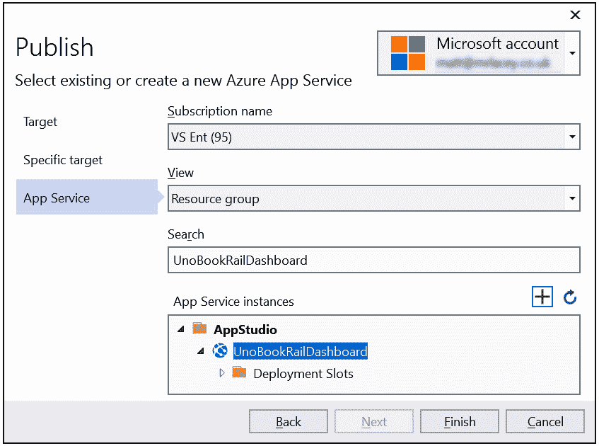

# 第八章：*第八章*：部署您的应用程序并进一步操作

本章结束了我们对 Uno 平台的介绍，但在结束之前还有很多内容需要涵盖。您已经知道 Uno 平台允许创建在多个环境中运行的应用程序。这不仅适用于新应用程序。Uno 平台的吸引力很大一部分在于它使开发人员能够将现有的应用程序在新环境中运行。因为它是建立在 UWP 和 WinUI 之上的，Uno 平台为您提供了一个出色的方式，可以将现有的应用程序在新环境中运行。

在本章中，我们将涵盖以下主题：

+   将`Xamarin.Forms`应用程序带到 WebAssembly

+   将 Wasm Uno 平台应用部署到 Web

+   将您的应用程序部署到商店

+   与 Uno 平台社区互动

通过本章结束时，您将知道如何部署您的应用程序，并且您将对 Uno 平台的后续步骤感到自信。

# 技术要求

本章假定您已经设置好了开发环境，包括安装项目模板。这在*第一章* *介绍 Uno 平台*中已经涵盖了。

本章还将使用在*第六章* *显示图表数据和自定义 2D 图形*中创建的源代码。这可以在以下网址找到：[`github.com/PacktPublishing/Creating-Cross-Platform-C-Sharp-Applications-with-Uno-Platform/tree/main/Chapter06`](https://github.com/PacktPublishing/Creating-Cross-Platform-C-Sharp-Applications-with-Uno-Platform/tree/main/Chapter06)。

查看以下视频以查看代码的运行情况：[`bit.ly/3xDJDwT`](https://bit.ly/3xDJDwT)

# 将 Xamarin.Forms 应用程序带到 WebAssembly

如果您使用.NET 进行开发，并且以前创建过移动（iOS 和/或 Android）应用程序，您可能已经使用过`Xamarin.Forms`。如果您有使用`Xamarin.Forms`构建的移动应用程序，现在希望在 WebAssembly 上运行，您可能担心需要重写代码，但实际上并非如此。

`Xamarin.Forms`可以创建 UWP 应用程序。Uno 平台允许 UWP 应用程序在其他平台上运行。因此，可以使用`Xamarin.Forms`生成的 UWP 应用程序，并将其作为 Uno 平台用来创建 Wasm 应用程序的输入。幸运的是，为了简化起见，所有项目输入和输出的连接都由提供的模板处理。

提示

还可以在 Xamarin 应用程序中使用 Uno 平台控件。这样做很简单，有一个指南显示在以下网址：[`platform.uno/docs/articles/howto-use-uno-in-xamarin-forms.html`](https://platform.uno/docs/articles/howto-use-uno-in-xamarin-forms.html)。

为了展示`Xamarin.Forms`创建的 UWP 应用程序如何被 Uno 平台用来创建 Wasm 应用程序，让我们创建一个新的`Xamarin.Forms`应用程序，并使用 Uno 添加一个 Wasm 头。当然，您也可以对现有的`Xamarin.Forms`应用程序执行相同的操作，但前提是它具有 UWP 头。如果您有一个没有 UWP 头的现有`Xamarin.Forms`应用程序，您需要先添加一个，然后才能创建一个 Wasm 头：

1.  在**Visual Studio**中，使用**移动应用（Xamarin.Forms）**项目模板创建一个新项目。

1.  给项目（和解决方案）命名为**UnoXfDemo**。当然，您也可以使用不同的名称，但您需要相应地调整所有后续引用。

1.  勾选**将解决方案和项目放在同一个目录中**框。

1.  选择`Xamarin.Forms`特定内容应该可以正常工作。但建议您在流程的早期进行测试，以确定您可能遇到的任何可能问题，特别是自定义 UI 或第三方控件。

1.  在**解决方案资源管理器**中右键单击**解决方案节点**，然后选择**在终端中打开**。

1.  **开发人员 PowerShell**窗口将在解决方案目录中打开。在其中，输入以下内容：

```cs
dotnet new -i Uno.ProjectTemplates.Dotnet::*
```

这将确保您安装了最新版本的模板。

1.  现在输入以下内容：

```cs
dotnet new wasmxfhead
```

这将向解决方案中添加新项目。

1.  选择**重新加载**，在提示时重新加载解决方案，您将看到**UnoXfDemo.Wasm**作为解决方案中的新项目。

1.  将所有**Xamarin.Forms**的引用降级为**5.0.0.1931**版本，因为这是 Uno 项目支持的最新版本。

1.  在 Wasm 项目中添加对`Xamarin.Forms`包的引用，如下所示：

```cs
Xamarin.Forms referenced from the projects in the solution should be the same, and they must also match the version supported by the Uno.Xamarin.Forms.Platform package. If they don't, you'll get an error explaining the different versions referenced and how to address them.
```

1.  更新`Xamarin.Forms`的版本，目前写作时，最新模板中引用的版本。

1.  将**UnoXfDemo.Wasm**项目设置为启动项目，然后开始调试。您将看到类似*图 8.1*的东西：


图 8.1 - 通过 WebAssembly 运行的默认（空白）Xamarin.Forms 应用程序

当然，您可以继续开发应用程序，添加或更改功能，然后像解决方案中的任何其他项目一样将最新版本部署到 WebAssembly。

现在，我们已经看到了使用 Uno 平台使`Xamarin.Forms`应用程序作为 Wasm 应用程序运行是多么简单。

重要提示

除了能够使用 Uno 平台使现有的`Xamarin.Forms`应用程序能够运行外，还可以将现有的 UWP 应用程序转换为使用 Uno 平台以针对其他操作系统。Uno 平台团队已经在以下网址发布了一份官方指南：[`platform.uno/docs/articles/howto-migrate-existing-code.html`](https://platform.uno/docs/articles/howto-migrate-existing-code.html)。

创建了应用程序的 Wasm 版本（无论它最初是作为`Xamarin.Forms`应用程序还是其他），您希望将其放在 Web 上，以便其他人可以使用。我们现在来看看这个过程。

# 将 Wasm Uno 平台应用程序部署到 Web

构建 Wasm 应用程序并在本地计算机上运行是一个令人兴奋的步骤，它展示了 Uno 平台的强大潜力。但是，在本地计算机上运行使其他人难以使用。您需要将应用程序托管在所有人都可以访问的地方。

托管基于.NET 的 Web 应用程序最受欢迎的选择可能是 Azure。您可以在任何地方托管您的应用程序，对所有服务来说，流程都非常相似，因为不需要服务器端处理。假设您可能想要托管您的应用程序在 Azure 上，现在让我们看看如何做到这一点。如果您以前从未部署过 Web 应用程序或使用过 Azure，可能会感到害怕，但您会发现这是多么容易，没有什么可害怕的。

免费试用 Azure

如果您还没有 Azure 帐户，可以通过访问以下网址注册免费试用：[`azure.microsoft.com/free/`](https://azure.microsoft.com/free/)。

与其创建一个新应用程序纯粹是为了展示它被部署，不如使用我们在*第六章*中创建的应用程序，*在图表中显示数据和自定义 2D 图形*：

1.  打开之前创建的**仪表板**应用程序（或从[`github.com/PacktPublishing/Creating-Cross-Platform-C-Sharp-Applications-with-Uno-Platform/tree/main/Chapter06`](https://github.com/PacktPublishing/Creating-Cross-Platform-C-Sharp-Applications-with-Uno-Platform/tree/main/Chapter06)下载版本）。

1.  右键单击**WASM**项目，然后选择**发布...**。

1.  您会看到有许多地方可以发布您的应用程序，但是因为我们想要将应用程序发布到 Azure，所以选择**Azure**选项，然后点击**下一步**。

1.  对于特定的目标，我们将选择**Azure App Service (Windows)**选项，尽管您也可以使用其他选项。

重要提示

静态 Web 应用程序是托管 Wasm 应用程序的另一种合适方式。有关更多详细信息，请参见[`azure.microsoft.com/services/app-service/static/`](https://azure.microsoft.com/services/app-service/static/)。

1.  如果您还没有这样做，请登录到您的 Azure 关联帐户。

1.  我们将创建一个新的应用服务来托管该应用程序，因此点击**创建 Azure 应用服务**的**加号**。

1.  将自动分配一个默认名称给您的应用程序。由于这将被用作应用程序将被提供的子域，因此这个名称必须是唯一的。默认名称将根据当前日期和时间基于项目名称附加一个数字。如果您希望更改此名称，但指定的值不是唯一的，您将看到一个警告，指出该名称不可用，您必须选择另一个名称。

1.  如果您的帐户链接了多个订阅，请选择要为此应用程序使用的订阅。

1.  选择或创建新的资源组和托管计划。出于演示目的，您现在可以使用**免费**托管计划。如果您的应用程序的需求意味着这是不够的，您可以在将来更改这一点。

重要提示

当您从免费试用转为生产应用程序时，非常重要的是，您充分了解为您的 Web 应用程序配置的选项和与计费相关的选择。这将避免您的信用卡出现任何意外费用，或者在信用用完时禁用关键应用程序。适合您和您的应用程序的适当设置将取决于您的应用程序和个人要求。有关计费选项的详细信息可以在以下 URL 找到：[`azure.microsoft.com/pricing/details/app-service/windows/`](https://azure.microsoft.com/pricing/details/app-service/windows/)。

1.  单击**创建**按钮，服务将为您创建。这可能需要几秒钟，屏幕角落将显示一条消息，说明正在进行此操作。

1.  现在您将看到类似于*图 8.2*的东西。这显示了我使用了名称**UnoBookRailDashboard**，因此该应用程序将在以下 URL 上可用：[`unobookraildashboard.azurewebsites.net/`](https://unobookraildashboard.azurewebsites.net/)。现在单击**完成**，应用程序将准备好进行部署：

图 8.2 - Azure 发布对话框准备发布应用程序

1.  现在，您已经设置好了您的 Web 应用程序，准备发布应用程序。单击窗口右上角的**发布**按钮。

可能需要一两分钟，但最终，浏览器将打开一个新标签页，其中包含从 Azure 运行的应用程序。这应该看起来类似于*图 8.3*：


图 8.3 - 在 Azure 上运行的仪表板应用程序

如果您没有在 Azure 上托管您的应用程序，您可以通过搜索如何部署**Blazor**应用程序来找到有用的指导，因为该过程可能是类似的。最终，基于 Uno 平台的 WebAssembly 应用程序只是静态文件，可以部署到任何能够托管静态内容的服务器上。

从 Visual Studio 发布很方便。但是，从创建一个被跟踪的、可重复的过程来看，这并不理想。理想情况下，您应该设置一个自动化过程来部署您的应用程序。接下来我们将看一下**持续集成和部署**（**CI/CD**）过程。

# 自动构建、测试和分发

理想情况下，您将使用自动化过程来构建、测试和部署您的应用程序，而不是依赖手动完成所有这些，因为手动过程更容易出错。

这就是 CI/CD 过程至关重要的地方。因为我们刚刚手动将 Wasm 应用程序部署到了 Azure，让我们从自动化这个过程开始。幸运的是，Visual Studio 工具使这变得简单。

如果您浏览配置了工作流程的`YAML`文件：


图 8.4 - 创建 GitHub 操作以通过发布向导发布您的 Wasm 应用程序

生成的文件只需要进行单个修改，以适应 Uno 平台模板使用的解决方案结构。工作目录需要更改为`Dashboard\Dashboard.Wasm`。

一旦您进行了任何更改并将其推送到 GitHub，代码将自动构建和部署。

您可以在以下 URL 看到一个 GitHub Actions 工作流文件的示例，该文件部署了一个基于 Uno 平台的 Wasm 应用程序：[`github.com/mrlacey/UnoWasmGithubActions/blob/main/.github/workflows/UnoWasmGithubActions.yml`](https://github.com/mrlacey/UnoWasmGithubActions/blob/main/.github/workflows/UnoWasmGithubActions.yml)。

GitHub 不是您可能存储代码的唯一位置，GitHub Actions 也不是唯一的 CI/CD 流水线选项。对于使用.NET 的开发人员，Azure DevOps（以前称为 Visual Studio Online）是一个流行的解决方案。

Nick Randolph 创建了一个全面的指南，介绍了如何为 Uno 平台应用程序创建基于 Azure DevOps 的构建流水线，网址如下：[`nicksnettravels.builttoroam.com/uno-complete-pipeline/`](https://nicksnettravels.builttoroam.com/uno-complete-pipeline/)。

Lance McCarthy 还创建了一个示例存储库，展示了在 GitHub 托管的存储库中使用多个 Azure DevOps 构建流水线。如果您需要进行类似操作，这可以作为一个有用的参考，并且可以在以下 URL 找到：[`github.com/LanceMcCarthy/UnoPlatformDevOps`](https://github.com/LanceMcCarthy/UnoPlatformDevOps)。

由于 Uno 平台允许您创建多种平台，并且您可以以多种方式构建和部署这些应用程序，因此不可能提供所有场景的操作指南。幸运的是，由于 Uno 平台是建立在其他知名技术之上的，因此构建这些其他技术的过程也与构建基于 Uno 平台的应用程序时使用的过程相同。例如，因为 Android、iOS 和 macOS 应用程序是基于 Xamarin 构建的，所以构建和部署过程可能与直接使用 Xamarin 构建时相同。

我们通过查看部署使用 Uno 构建的应用程序的 Wasm 版本开始了 CI/CD 的这一部分。这不是您可能需要部署应用程序的唯一位置。应用商店是您可能需要部署您构建的一些应用程序的地方，因此我们将在下一步中查看它们。

# 将您的应用程序部署到商店

假设您正在为公共使用构建应用程序。在这种情况下，您可能需要通过该操作系统的适当应用商店部署它。商店为使用 Uno 平台构建的应用程序所适用的规则、政策和限制与使用任何其他工具集构建的应用程序相同。

每个商店的政策可能会经常更改（通常每年至少几次），而且也相当长。因此，我们认为在这里重复它们没有价值。相反，您应该查看以下列表中的官方文档：

+   **Windows 商店**（适用于 UWP）：[`docs.microsoft.com/windows/uwp/publish/`](https://docs.microsoft.com/windows/uwp/publish/)

+   **Google Play 商店**（适用于 Android）：[`support.google.com/googleplay/android-developer#topic=3450769`](https://support.google.com/googleplay/android-developer#topic=3450769

)

+   **iOS 应用商店**：[`developer.apple.com/ios/submit/`](https://developer.apple.com/ios/submit/)

+   **macOS 应用商店**：[`developer.apple.com/macos/submit/`](https://developer.apple.com/macos/submit/)

Uno 基于应用程序的分发过程与任何其他应用程序相同。您需要为希望通过部署的每个商店创建开发人员帐户，然后根据需要将相关文件、软件包和捆绑包上传到商店。

由于 Android、iOS 和 Mac 应用程序都是构建在特定平台的 Xamarin 技术之上，您可能会发现它们与发布相关的文档也很有用：

+   **Google Play 商店**：[`docs.microsoft.com/xamarin/android/deploy-test/publishing/publishing-to-google-play/`](https://docs.microsoft.com/xamarin/android/deploy-test/publishing/publishing-to-google-play/)

+   **iOS 应用商店**：[`docs.microsoft.com/xamarin/ios/deploy-test/app-distribution/app-store-distribution/publishing-to-the-app-store`](https://docs.microsoft.com/xamarin/ios/deploy-test/app-distribution/app-store-distribution/publishing-to-the-app-store)

+   **macOS 应用商店**：[`docs.microsoft.com/xamarin/mac/deploy-test/publishing-to-the-app-store/`](https://docs.microsoft.com/xamarin/mac/deploy-test/publishing-to-the-app-store/)

前面的链接指向每个商店的一般信息。如果您遇到任何特定的与 Uno 相关的问题，有一个庞大的社区准备好帮助您。

# 与 Uno Platform 社区互动

Uno Platform 作为一个开源项目的吸引力之一。与许多开源项目一样，一个核心团队帮助领导贡献者社区。正是这个广泛的社区，您可以寻求信息、帮助并成为其中的一部分。

## 信息来源

除了这本书（显然！），获取信息的中心地带是官方网站，网址如下：[`platform.uno/`](https://platform.uno/)。在网站上，您会找到文档、指南、示例和博客。订阅博客是跟上所有未来公告的绝佳方式，还可以关注官方的 Twitter 账号，网址如下：[`twitter.com/unoplatform`](https://twitter.com/unoplatform)。

官方网站还包括超出本书范围的主题的信息，例如使用 Uno Platform 来针对 Windows 7 或 Linux（参见[`platform.uno/uno-platform-for-linux/`](https://platform.uno/uno-platform-for-linux/)）。

官方网站充满了信息，但是在您的应用程序中可能有很多功能和事情，您会遇到需要回答的问题。

## 帮助来源

有四个地方可以寻求与 Uno Platform 相关的帮助：

+   Stack Overflow

+   Discord

+   GitHub

+   专业支持

**Stack Overflow**是互联网上与软件开发相关的问题和答案的存储库。这是您关于如何使用 Uno Platform 的问题的第一个求助地点。您会发现许多核心团队和常规贡献者在那里回答问题。确保您的问题标记有**uno-platform**，并在以下网址提问：[`stackoverflow.com/questions/tagged/uno-platform`](https://stackoverflow.com/questions/tagged/uno-platform)。

如何寻求帮助

与大多数事物一样，您付出的努力越多，您得到的回报就越多。这也适用于寻求帮助。如果您不熟悉它，Stack Overflow 有一个关于如何提问问题的指南，网址如下：[`stackoverflow.com/help/how-to-ask`](https://stackoverflow.com/help/how-to-ask)。

有两个请求帮助的一般原则。首先，记住您是在寻求帮助，而不是让别人替您做工作。其次，让别人帮助您变得更容易，这增加了他们能够和愿意这样做的可能性。

一个很好的求助请求包括提供回答所需的所有必要具体信息，而不包括其他信息。对问题的模糊描述或您的代码不如提供您尝试过的细节或简单的最小化重现问题的方式有帮助。

如果你的问题涉及 Uno 平台的内部，或者你正在使用最新的预览版本，最好在**Discord**上提问。**UWP 社区**服务器有一个**uno-platform**频道，包括许多热情的社区成员和核心团队成员。你可以通过以下网址加入：[`discord.com/invite/eBHZSKG`](https://discord.com/invite/eBHZSKG)。

使用 Uno 平台，就像任何开源项目一样，都需要一定程度的责任感。开源软件是一个集体过程，每个人都在努力使每个人都拥有更好的软件。这意味着你应该报告一个 bug，即使你自己无法修复它。如果你认为在平台、示例或文档中发现了 bug，你应该在 GitHub 的以下网址上提交问题：[`github.com/unoplatform/uno/issues/new/choose`](https://github.com/unoplatform/uno/issues/new/choose)。与请求帮助一样，你应该提供尽可能多的适当信息，包括重现问题的最小方式，以便于找到并修复你发现的问题。务必提供所有请求的信息，这有助于快速解决问题，避免浪费精力，或者需要人们再次要求更多信息。

最后，如果你需要及时解决问题，或者你有比在 Stack Overflow 或 Discord 上处理的更深层次的支持需求，Uno 平台背后的公司也提供**专业付费支持**。请访问[`platform.uno/contact`](https://platform.uno/contact)讨论你的需求。

## 贡献

有一个普遍的误解，即对开源项目的贡献意味着添加代码，但与任何软件项目一样，使其成功和有价值的工作远不止于代码。当然，如果你想帮助贡献代码，你将受到热烈欢迎。首先看看标记为**good first issue**的问题，并查看以下网址的贡献指南：[`platform.uno/docs/articles/uno-development/contributing-intro.html`](https://platform.uno/docs/articles/uno-development/contributing-intro.html)。但请记住，还有很多其他事情可以做。

这是一个陈词滥调，但事实证明，无论大小，一切都有所帮助。分享你的经验是你可以做的最简单但也最有价值的事情之一。这可以是提供正式的操作指南或代码示例。或者，它可能只是回答某人想知道你已经做过的事情的问题。

无论大小，我们都期待看到你的贡献。

# 总结

在本章中，我们已经看到了各种领域，以补充你对 Uno 平台的介绍。你已经看到了 Uno 平台如何扩展现有的`Xamarin.Forms`应用程序，使其可以通过 WebAssembly 运行。你看到了如何将你的应用程序的 Wasm 版本部署到 Azure。我们看了持续集成和部署。你知道了去哪里进一步学习，我们看了你如何与 Uno 平台开发者社区互动。

通过这本书，我们已经来到了尽头。如果你已经逐章阅读，现在你将拥有知识和信心，可以使用 Uno 平台构建在多个操作系统上运行的应用程序。我们期待看到你的创作。

感谢阅读！
