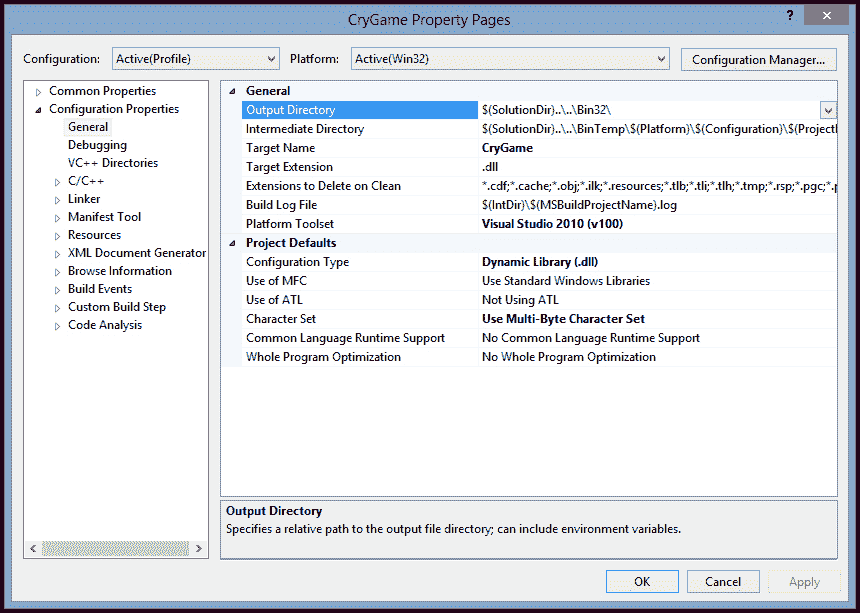

# 第一章：介绍和设置

CryENGINE 因其展示各种令人印象深刻的视觉效果和游戏玩法而被认为是最具可扩展性的引擎之一。这使得它成为程序员手中的无价工具，唯一的限制就是创造力。

在本章中，我们将涵盖以下主题：

+   安装**Visual Studio Express 2012 for Windows Desktop**

+   下载 CryENGINE 示例安装或使用自定义引擎安装

+   在[`www.crydev.net`](http://www.crydev.net)注册账户，这是官方的 CryENGINE 开发门户网站

+   编译精简的 CryGame 库

+   附加和使用调试器

# 安装 Visual Studio Express 2012

为了编译游戏代码，您需要一份 Visual Studio 的副本。在本演示中，我们将使用 Visual Studio Express 2012 for Windows Desktop。

### 注意

如果您已经安装了 Visual Studio 2012，则可以跳过此步骤。


要安装 Visual Studio，请按照以下步骤操作：

1.  访问[`www.microsoft.com/visualstudio/`](http://www.microsoft.com/visualstudio/)，然后下载 Visual Studio Express 2012 for Windows Desktop。

1.  下载可执行文件后，安装该应用程序，并在重新启动计算机后继续下一步。

# 选择 CryENGINE 安装类型

现在我们已经安装了 Visual Studio，我们需要下载一个 CryENGINE 版本进行开发。

我们为本书创建了一个精简的示例安装，推荐给刚开始使用引擎的用户。要下载，请参阅*下载本书的 CryENGINE 示例安装*部分。

如果您更愿意使用 CryENGINE 的其他版本，比如最新的 Free SDK 版本，请参阅本章后面的*使用自定义或更新的 CryENGINE 安装*部分。本节将介绍如何自行集成 CryMono。

# 下载本书的 CryENGINE 示例安装

对于本书，我们将使用自定义的 CryENGINE 示例作为学习引擎工作原理的基础。本书中的大多数练习都依赖于这个示例；然而，您从中获得的工作知识可以应用于默认的 CryENGINE Free SDK（可在[`www.crydev.net`](http://www.crydev.net)上获得）。

要下载示例安装，请按照以下步骤操作：

1.  访问[`github.com/inkdev/CryENGINE-Game-Programming-Sample`](https://github.com/inkdev/CryENGINE-Game-Programming-Sample)，然后单击**Download ZIP**按钮，以下载包含示例的压缩存档。

1.  下载完成后，将存档内容提取到您选择的文件夹中。为了示例，我们将其提取到`C:\Crytek\CryENGINE-Programming-Sample`。

## 刚才发生了什么？

现在您应该有我们示例 CryENGINE 安装的副本。您现在可以运行和查看示例内容，这将是本书大部分内容的使用内容。

# 使用自定义或更新的 CryENGINE 安装

本节帮助选择使用自定义或更新版本的引擎的读者。如果您对此过程不确定，我们建议阅读本章中的*下载本书的 CryENGINE 示例安装*部分。

## 验证构建是否可用

在开始之前，您应该验证您的 CryENGINE 版本是否可用，以便您可以在本书的章节中运行和创建基于代码。

### 注意

请注意，如果您使用的是旧版或新版引擎，某些章节可能提供了更改系统的示例和信息。请记住这一点，并参考前面提到的示例，以获得最佳的学习体验。

一个检查的好方法是启动编辑器和启动器应用程序，并检查引擎是否按预期运行。

## 集成 CryMono（C#支持）

如果您有兴趣使用以 C#为主题编写的示例代码和章节内容，您需要将第三方 CryMono 插件集成到 CryENGINE 安装中。

### 注意

请注意，CryMono 默认集成在我们专门为本书创建的示例中。

要开始集成 CryMono，请打开引擎根文件夹中的`Code`文件夹。我们将把源文件放在这里，放在一个名为`CryMono/`的子文件夹中。

要下载源代码，请访问[`github.com/inkdev/CryMono`](https://github.com/inkdev/CryMono)并单击**Download Zip**（或者如果您更喜欢使用 Git 版本控制客户端，则单击**Clone in Desktop**）。

下载后，将内容复制到我们之前提到的`Code/CryMono`文件夹中。如果该文件夹不存在，请先创建它。

文件成功移动后，您的文件夹结构应该类似于这样：


### 编译 CryMono 项目

现在我们有了 CryMono 源代码，我们需要编译它。

首先，使用 Visual Studio 打开`Code/CryMono/Solutions/CryMono.sln`。

### 注意

确保使用`CryMono.sln`而不是`CryMono Full.sln`。后者仅在需要重新构建整个 Mono 运行时时使用，该运行时已经与 CryMono 存储库预编译。

在编译之前，我们需要修改引擎的`SSystemGlobalEnvironment`结构（这是使用全局`gEnv`指针公开的）。

为此，请在`Code/CryEngine/CryCommon/`文件夹中打开`ISystem.h`。通过搜索结构`SSystemGlobalEnvironment`的定义来找到结构的定义。

然后将以下代码添加到结构的成员和函数的最后：

```cs
struct IMonoScriptSystem*
  pMonoScriptSystem;
```

### 注意

不建议修改接口，如果您没有完整的引擎源代码，因为其他引擎模块是使用默认接口编译的。但是，在这个结构的末尾添加是相对无害的。

完成后，打开您打开`CryMono.sln`的 Visual Studio 实例并开始编译。

### 注意

项目中的自动化后构建步骤应在成功编译后自动将编译文件移动到构建的`Bin32`文件夹中。

要验证 CryMono 是否成功编译，请在您的`Bin32`文件夹中搜索`CryMono.dll`。

### 通过 CryGame.dll 库加载和初始化 CryMono

现在我们在我们的`Bin32`文件夹中有了 CryMono 二进制文件，我们只需要在游戏启动时加载它。这是通过 CryGame 项目，通过`CGameStartup`类来完成的。

首先，打开位于`Code/Solutions/`中的`Code/Solutions/`中的 CryEngine 或 CryGame 解决方案文件（.`sln`）。

#### 包括 CryMono 接口文件夹

在修改游戏启动代码之前，我们需要告诉编译器在哪里找到 CryMono 接口。

首先，在 Visual Studio 的**Solution Explorer**中右键单击 CryGame 项目，然后选择**Properties**。这将显示以下**CryGame Property Pages**窗口：



现在，点击**C/C++**并选择**General**。这将显示一屏幕一般的编译器设置，我们将使用它来添加一个额外的包含文件夹，如下面的屏幕截图所示：


现在我们只需要将`..\..\CryMono\MonoDll\Headers`添加到**Additional Include Directories**菜单中。这将告诉编译器在使用`#include`宏时搜索 CryMono 的`Headers`文件夹，从而使我们能够找到 CryMono 的 C++接口。

#### 在启动时初始化 CryMono

在 CryGame 项目中打开`GameStartup.h`，并将以下内容添加到类声明的底部：

```cs
static HMODULE
m_cryMonoDll;
```

然后打开`GameStartup.cpp`并在`CGameStartup`构造函数之前添加以下内容：

```cs
HMODULE CGameStartup::m_cryMonoDll = 0;
```

现在导航到`CGameStartup`析构函数并添加以下代码：

```cs
if(m_cryMonoDll)
{
  CryFreeLibrary(m_cryMonoDll);
  m_cryMonoDll = 0;
}
```

现在导航到`CGameStartup::Init`函数声明，并在`REGISTER_COMMAND("g_loadMod", RequestLoadMod,VF_NULL,"");`片段之前添加以下内容：

```cs
m_cryMonoDll = CryLoadLibrary("CryMono.dll");
if(!m_cryMonoDll)
{
  CryFatalError("Could not locate CryMono DLL! %i", GetLastError());
  return false;
}

auto InitMonoFunc = (IMonoScriptSystem::TEntryFunction)CryGetProcAddress(m_cryMonoDll, "InitCryMono");
if(!InitMonoFunc)
{
  CryFatalError("Specified CryMono DLL is not valid!");
  return false;
}

InitMonoFunc(gEnv->pSystem, m_pFramework);
```

现在我们只需编译 CryGame，就可以在启动时加载和初始化 CryMono。

#### 注册流节点

由于流系统的最近更改，流节点必须在游戏启动的某个时刻注册。为了确保我们的 C#节点已注册，我们需要从`IGame::RegisterGameFlowNodes`中调用`IMonoScriptSysetm::RegisterFlownodes`。

要做到这一点，打开`Game.cpp`并在`CGame::RegisterGameFlowNodes`函数内添加以下内容：

```cs
GetMonoScriptSystem()->RegisterFlownodes();
```

现在，在编译后，所有托管流节点应该出现在 Flowgraph 编辑器中。

# 注册您的 CryDev 帐户

CryENGINE 免费 SDK 需要 CryDev 帐户才能启动应用程序。这可以通过[`www.crydev.net`](http://www.crydev.net)轻松获取，方法如下：

1.  在您选择的浏览器中访问[`www.crydev.net`](http://www.crydev.net)。

1.  单击右上角的**注册**。

1.  阅读并接受使用条款。

1.  选择您的用户名数据。

## 刚刚发生了什么？

您现在拥有自己的 CryDev 用户帐户。在运行 CryENGINE 免费 SDK 应用程序（参见*运行示例应用程序*）时，您将被提示使用刚刚注册的详细信息登录。

# 运行示例应用程序

在开始构建游戏项目之前，我们将介绍默认 CryENGINE 应用程序的基础知识。

### 注意

所有可执行文件都包含在`Bin32`或`Bin64`文件夹中，具体取决于构建架构。但是，我们的示例只包括一个`Bin32`文件夹，以保持简单和构建存储库的大小。

## 编辑器

这是开发人员将使用的主要应用程序。编辑器作为引擎的直接接口，用于各种开发人员特定的任务，如关卡设计和角色设置。

编辑器支持**WYSIWYP**（**所见即所得**）功能，允许开发人员通过按下快捷键*Ctrl* + *G*或导航到**游戏**菜单，并选择**切换到游戏**来预览游戏。

### 启动编辑器

打开主示例文件夹，并导航到`Bin32`文件夹。一旦到达那里，启动`Editor.exe`。


编辑器加载完成后，您将看到 Sandbox 界面，可用于创建游戏的大多数视觉方面（不包括模型和纹理）。

要创建新关卡，打开**文件**菜单，并选择**新建**选项。这应该呈现给您**新建关卡**消息框。只需指定您的关卡名称，然后单击**确定**，编辑器将创建并加载您的空关卡。

要加载现有关卡，打开**文件**菜单，并选择**打开**选项。这将呈现给您**打开关卡**消息框。选择您的关卡并单击**打开**以加载您的关卡。

## 启动器

这是最终用户看到的应用程序。启动器启动时显示游戏的主菜单，以及允许用户加载关卡和配置游戏的不同选项。

启动器的游戏上下文通常称为**纯游戏模式**。

### 启动启动器

打开主示例文件夹，并进入`Bin32`文件夹。一旦到达那里，启动`Launcher.exe`。


当您启动应用程序时，您将看到默认的主菜单。此界面允许用户加载关卡并更改游戏设置，如视觉和控制。

当您想要像最终用户一样玩游戏时，启动器比编辑器更可取。另一个好处是快速启动时间。

## 专用服务器

专用服务器用于启动其他客户端连接的多人游戏服务器。专用服务器不会初始化渲染器，而是作为控制台应用程序运行。


# 编译 CryGame 项目（C++）

CryENGINE Free SDK 提供了对游戏逻辑库`CryGame.dll`的完整源代码访问。这个动态库负责游戏功能的主要部分，以及初始游戏启动过程。

### 注意

库是一组现有的类和函数，可以集成到其他项目中。在 Windows 中，库的最常见形式是**动态链接库**，或**DLL**，它使用`.dll`文件扩展名。

首先，打开主样本文件夹，并导航到`Code/Solutions/`，其中应该存在一个名为`CE Game Programming Sample.sln`的 Visual Studio 解决方案文件。双击该文件，Visual Studio 应该启动，并显示包含的项目（请参阅以下分解）。

### 注意

**解决方案**是 Visual Studio 中组织项目的结构。**解决方案**包含关于项目的信息，存储在基于文本的`.sln`文件中，以及一个`.suo`文件（用户特定选项）。

要构建项目，只需按下*F7*或右键单击**解决方案资源管理器**中的 CryGame 项目，然后选择**构建**。

## 刚刚发生了什么？

您刚刚编译了`CryGame.dll`，现在应该在二进制文件夹中存在（32 位编译为`Bin32`，64 位为`Bin64`）。启动示例应用程序现在将加载包含您编译的源代码的`.dll`文件。

## CE 游戏编程示例解决方案分解

解决方案包括以下三个项目，其中一个编译为`.dll`文件。

### CryGame

CryGame 项目包括引擎使用的基础游戏逻辑。这将编译为`CryGame.dll`。

### CryAction

CryAction 项目包括对`CryAction.dll`的部分源代码，它负责大量的系统，如演员、UI 图形和游戏对象。这个项目不会编译为`.dll`文件，而是仅用于接口访问。

### CryCommon

CryCommon 项目是一个助手，包含所有共享的 CryENGINE 接口。如果有子系统需要访问，请在这里查找其公开的接口。

# CryENGINE 文件夹结构

请参阅以下表格，了解 CryENGINE 文件夹结构的解释：

| 文件夹名称 | 描述 |
| --- | --- |
| `Bin32` | 包含引擎使用的所有 32 位可执行文件和库。 |
| `Bin64` | 包含引擎使用的所有 64 位可执行文件和库。 |
| `Editor` | 编辑器配置文件夹，包含常见的编辑器助手、样式等。 |
| `Engine` | 用作引擎本身使用的资产的中央文件夹，而不是任何特定的游戏。着色器和配置文件存储在这里。 |
| `Game` | 每个游戏都包含一个游戏文件夹，其中包括所有的资产、脚本、关卡等。不一定要命名为`Game`，但取决于`sys_game_folder`控制台变量的值。 |
| `Localization` | 包含本地化资产，如每种语言的本地化声音和文本。 |

## PAK 文件

引擎附带**CryPak**模块，允许以压缩或未压缩的存档中存储游戏内容文件。存档使用`.pak`文件扩展名。

当游戏内容被请求时，CryPak 系统将查询所有找到的`.pak`文件，以找到文件。

### 文件查询优先级

PAK 系统优先考虑松散文件夹结构中找到的文件，而不是 PAK 中的文件，除非引擎是在发布模式下编译的。在这种情况下，PAK 系统中存储的文件优先于松散的文件。

如果文件存在于多个`.pak`存档中，则使用具有最近文件系统创建日期的存档。

### 附加调试器

Visual Studio 允许您将**调试器**附加到应用程序。这使您可以使用**断点**等功能，让您在 C++源代码中的特定行停止，并逐步执行程序。

要开始调试，请打开`CE Game Programming Sample.sln`并按下*F5*，或者单击 Visual Studio 工具栏上的绿色播放图标。如果出现**找不到 Editor.exe 的调试符号**消息框，只需单击**确定**。

## 刚刚发生了什么？

CryENGINE Sandbox 编辑器现在应该已经启动，并且已连接了 Visual Studio 调试器。我们现在可以在代码中设置断点，并且当执行特定行的代码时，程序执行会暂停。

# 总结

在本章中，我们已经下载并学习了如何使用 CryENGINE 安装。您现在应该了解了编译和调试 CryGame 项目的过程。

我们现在已经掌握了继续学习 CryENGINE 编程 API 的基本知识。

如果您想了解更多关于 CryENGINE 本身的知识，除了编程知识之外，可以随时启动 Sandbox 编辑器并尝试使用级别设计工具。这将帮助您为将来的章节做好准备，在那里您将需要利用编辑器视口等工具。
