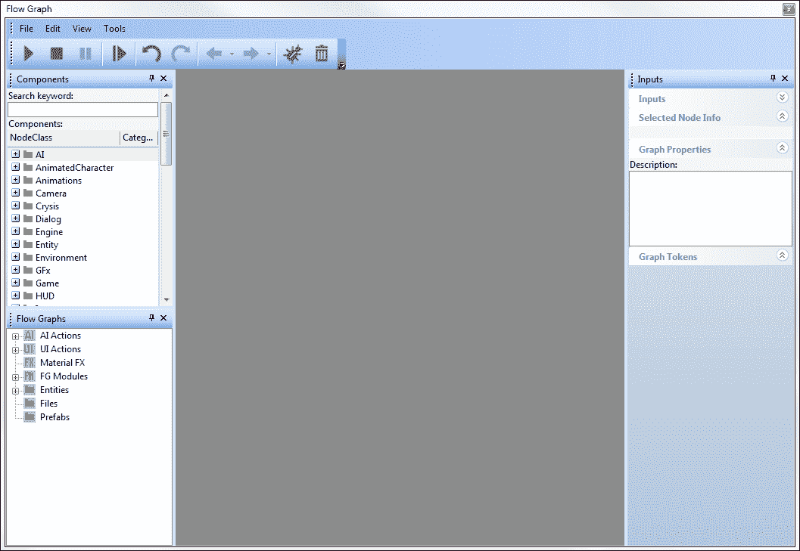
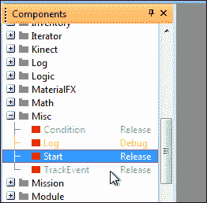
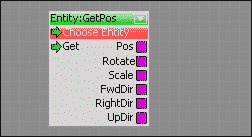
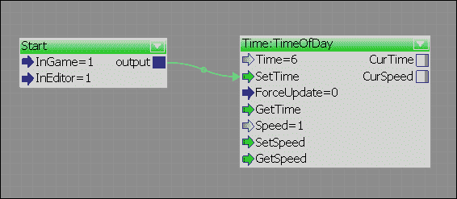
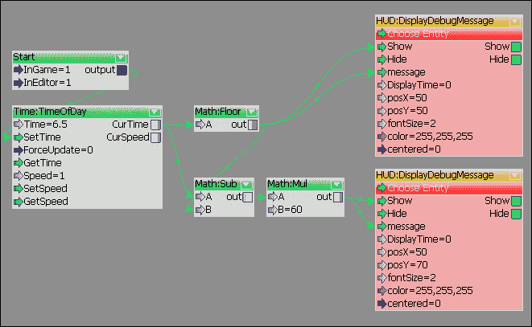
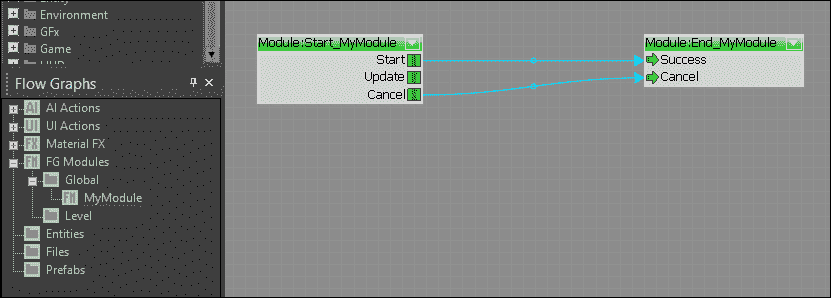
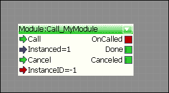
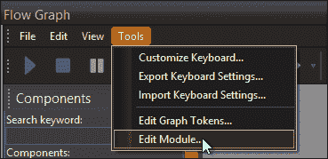
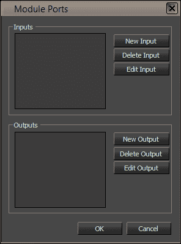
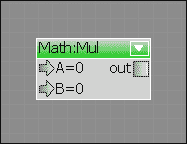

# 第二章。使用 Flowgraph 进行可视脚本编写

CryENGINE flowgraph 是一个强大的基于节点的可视脚本系统，帮助开发人员快速原型化功能，并创建特定于关卡的逻辑，而无需处理复杂的代码库。

在本章中，我们将：

+   讨论 flowgraph 的概念

+   创建新的 flowgraph

+   调试我们的 flowgraph

+   在 Lua、C#和 C++中创建自定义 flowgraph 节点（flownode）

# flowgraph 的概念

多年来，编写代码一直是创建游戏行为和逻辑的主要方法，如果不是唯一的方法。让我们以一个关卡设计师为例，为最新的游戏创建一个战斗部分。

传统上，设计师必须要求程序员为这种情况创建逻辑。这有几个问题：

+   这会导致设计和实现之间的脱节

+   程序员被迫花费时间，这实际上是设计师的工作

+   设计师无法立即了解他/她的部分如何进行

这是 CryENGINE 的**flowgraph**，通常称为**FG**，解决的问题。它提供了一组 flownode，最好将其视为方便的逻辑乐高积木，设计师可以利用它们来拼凑整个场景。不再需要向游戏代码团队发送请求；设计师可以立即实现他们的想法！我们将稍后更详细地讨论创建节点本身，但现在让我们看一些简单的 flowgraph，这样您就可以迈出 CryENGINE 游戏逻辑的第一步！

# 打开 Flowgraph 编辑器

要开始，我们需要打开 Sandbox。Sandbox 包含 Flowgraph 编辑器作为其众多有用工具之一，可以通过**视图**|**打开视图窗格**来打开它。

### 注意

在打开 Flowgraph 编辑器时，您应该始终加载一个关卡，因为 flowgraph 是与关卡相关的。如果您忘记了如何创建新关卡，请返回到第一章*介绍和设置*！


您刚刚访问了您的第一个 Sandbox 工具！您应该会看到一个新窗口，其中有许多子部分和功能，但不要担心，让我们逐个解决它们。

# Flowgraph 编辑器之旅

flowgraph 被保存在磁盘上作为 XML 文件，但可以被 Flowgraph 编辑器解析和编辑，以提供创建游戏逻辑过程的可视界面。



## 组件

编辑器的这一部分包含项目中的所有 flownode，组织成整洁的类别。让我们快速查看一下这个，打开**Misc**文件夹。您应该会看到一组节点，分配到不同的类别：



### 术语

+   **图**：这指的是包含一组相互链接的节点的上下文。

+   **节点**：这是一个类的可视表示，它可以从其输入端口接收数据和事件，也可以通过其输出端口发送数据。它连接到图中的其他节点以创建逻辑。

+   **端口**：这是一个函数的可视表示。节点可以指定多个输入和输出端口，然后可以从中发送或接收事件。

### 组件类别

您可能会错过这里标记为**调试**的节点；CryENGINE 为节点分配类别，以指示它们适合在哪里使用。

+   **发布**：此节点适用于生产

+   **高级**：虽然此节点适用于生产，但在某些情况下可能具有复杂的行为

+   **调试**：此节点只应用于内部测试

+   **过时**：不应使用此节点，此节点将不会在组件列表中可见

例如，在制作一个打算发布给公众的关卡时，您可能不希望意外包含任何调试节点！我们可以通过**视图**|**组件**来启用或禁用 Flowgraph 编辑器中的前三个类别的查看：


## 流程图类型

在创建新的流程图之前，我们需要知道我们的目的最相关的类型是什么。不同的流程图类型允许专门化，例如，创建处理玩家用户界面的**UI 图形**。


### AI 操作

这些是您可以创建的流程图，将 AI 行为封装成方便的节点，可以在其他地方重复使用。当您学习**人工智能**（**AI**）时，我们稍后会讨论这些。

### UI 操作

CryENGINE 允许您使用流程图脚本化用户界面和游戏中的抬头显示，通过 UI 事件系统。我们将在第七章中讨论这些，*用户界面*。

### 材质 FX

CryENGINE 支持方便的可设计的流程图，用于控制如何处理材质事件，例如，在附近射击地面时生成一个灰尘粒子并用一层灰尘遮挡玩家的屏幕。

### FG 模块

您可以将流程图打包成方便的模块，以便在不同情况下重复使用。我们稍后会详细描述这些。

### 实体

这是我们在本章中将花费大部分时间的地方！90%的时间，流程图都分配给一个实体，也就是**图实体**，这个逻辑发生在游戏世界中。

### 预制件

CryENGINE 支持预制件，这是一组实体打包成一个方便的文件以供重复使用。预制件中的任何实体流程图都将显示在此文件夹中。

# 创建流程图

现在我们对流程图编辑器的工作原理有了基本的了解，让我们立即开始创建我们的第一个流程图！您可以暂时关闭流程图编辑器。

## 流程图实体

流程图实体是一个极其轻量级的 CryENGINE 对象，设计用于在您需要一个不应用于任何特定实体的流程图时使用。与所有实体一样，它可以在 Sandbox 的**RollupBar**中找到。

### 注意

如果您不确定实体是什么，请跳过本节，直到您阅读完第三章为止，*创建和使用自定义实体*。


### 生成 FlowgraphEntity

选择**流程图实体**，然后双击并再次单击视口，或单击并将其拖动到级别中。您现在应该在**RollupBar**中看到一整套新选项，包括实体参数、材质层，但对我们来说最重要的是**实体：流程图实体**部分。

## 附加一个新的流程图

在**实体：流程图实体**部分，我们需要找到**流程图**子部分，然后单击**创建**按钮：


从这里，您将有选择将您的流程图分配给一个组。现在是否这样做并不重要，但在处理较大项目时，将相关图形分组在一起是很有用的。

### 注意

组用于为流程图创建结构，允许开发人员将不同的图形分类到文件夹中。

完成后，您应该看到流程图编辑器出现在背景上叠加了淡淡的网格。我们现在准备开始创建逻辑！

## 将节点添加到流程图中

将节点添加到新图形的最简单方法是浏览**组件**列表并拖动新节点。但是，如果您知道要添加的节点的名称，这并不是很有效。因此，您还可以在流程图编辑器中使用*Q*快捷键来调出搜索功能，然后只需输入要添加的节点的名称。

在我们的情况下，我们将从**Misc:Start**节点开始，这是一个简单的节点，用于在加载级别时或编辑器测试会话启动时触发其他事件：


## 输入和输出端口

放置节点后，您应该看到节点输入和输出端口的第一个示例。在这种情况下，我们有两个输入值**InGame**和**InEditor**，以及一个单一的输出端口，在这种情况下方便地命名为**output**：


输入端口用于向节点提供数据或触发事件，输出端口用于将数据和事件传递给图中的其他节点。在这个例子中，**Misc:Start**节点可以被编辑以定义它将在哪些游戏上下文中实际执行。也许您有一些调试逻辑只想在编辑器中运行，这种情况下我们可以将**InGame**设置为 false 或零。

### 端口类型

为了指定端口将处理什么类型的数据，我们需要知道它的端口类型。我们可以通过查看端口的颜色在 Flowgraph 编辑器中确定端口的类型。

以下是可用端口类型的列表：

+   **Void**：用于不传递特定值的端口，但激活以发出事件信号

+   **Int**：当端口应该只接收整数值时使用

+   **Float**：用于指示端口处理浮点值

+   **EntityId**：这表示端口期望一个实体标识符。（有关实体 ID 的更多信息，请参阅第三章，“创建和利用自定义实体”）

+   **Vec3**：用于处理三维向量的端口

+   **String**：在这种情况下，端口期望一个字符串

+   **Bool**：当端口期望真或假的布尔值时使用

### 注意

链接具有不同类型的端口将自动转换值。

## 目标实体

流节点可以具有目标实体，允许用户将当前级别中的实体链接到流节点。这对于旨在影响游戏世界中的实体的节点非常有用，例如**Entity:GetPos**节点，如下面的截图所示，获取指定实体的世界变换。

### 注意

我们还可以通过将**EntityId**输出端口链接到**Choose Entity**端口来动态指定实体。



有两种分配实体给支持它的节点的方法：

+   通过将另一个流节点的**EntityId**输出链接到**Choose Entity**输入

+   通过右键单击**Choose Entity**输入并选择：

+   **分配选定的实体**：这将链接节点到编辑器视口中当前选定的实体

+   **分配图形实体**：这将链接节点到分配给该图形的实体

## 链接流节点

单个流节点并不能做太多事情；让我们连接两个，并构建一个适当的图！为了演示目的，我们将使用**Time:TimeOfDay**节点：



要创建端口之间的链接，只需单击输出端口，按住鼠标按钮拖动光标到输入端口，然后释放鼠标，连接就会创建！

我们还编辑了**Time**输入端口的值；输入端口可以通过输出端口提供数据，也可以直接在编辑器中编辑它们的值。只需单击节点，查看 Flowgraph 编辑器的**Inputs**部分。从那里，您可以简单地编辑这些值：


您还可以查看有关节点的有价值的信息：例如，在这里我们可以看到这个节点用于设置白天的时间，以及游戏中时间流逝的速度。

完成这一步后，您可以暂时关闭 Flowgraph 编辑器。Flowgraphs 不需要手动保存；它们会自动保存在关卡中。

### 注意

尽管流图与关卡一起保存，但最好经常手动保存，以避免丢失工作。

## 测试我们的流图

正如我们在上一章中学到的，使用 Sandbox 在 CryENGINE 中测试逻辑非常简单。只需按下*Ctrl* + *G*快捷键组合，然后观察您进入游戏模式。现在，当您这样做时，您应该看到级别的照明和一般氛围发生变化，因为您刚刚改变了白天的时间！

恭喜，您刚刚迈出了使用 CryENGINE 创建游戏的第一步！现在看起来可能不是很多，但让我们让这个图表做更多事情。

# 存储的 flownode 概述

为了做一些更复杂的事情，我们需要了解 CryENGINE 默认提供的节点。

## 构建时钟

我们可以访问的最有用的节点之一，至少用于调试目的，是**HUD:DisplayDebugMessage**节点。它允许您在游戏窗口中显示信息，可选地带有超时。考虑到这一点，让我们基于我们之前学到的时间信息构建一个小的调试时钟。

**Time:TimeOfDay**节点以 CryENGINE 时间格式输出当前时间，该格式定义为小时加上分钟除以 60。例如，下午 1:30 会在 CryENGINE 时间中表示为 13.5。我们现在知道我们将需要一些数学运算，所以是时候检查 Math flownode 类别了。

我们要做的第一件事是通过将当前时间向下取整来获取小时数。为此，将**Math:Floor**放置在**Time:TimeOfDay**节点的**CurTime**输出上，然后将其连接到 Floor 的**A**输入端口。然后，将其馈送到 Debug Message 节点：


现在立即进入游戏，您应该在屏幕上看到当前的小时数。

然后我们需要从原始值中减去我们的新值以获得分钟部分。为此，我们需要**Math:Sub**来从原始**CurTime**值中减去四舍五入的小时数。之后，**Math:Mul**节点将新时间放大 60 倍，因此您的图应该如下所示：



记得将第二个 Debug 节点的**posY**设置为向下移动，这样您就可以同时看到两者。

如果您再次进入游戏，现在应该看到当前的小时和分钟被打印出来！

## 监听玩家输入

如果现在我们想要允许玩家测试不同时间的移动怎么办？一般来说，设置一个按键监听器是最简单的方法，在这里我们在按下某个键时触发一个事件。幸运的是，CryENGINE 将这个功能封装得很好，放入了一个单一的节点**Input:Key**。

现在让我们设置按下*P*键会使时间快速移动，按下*O*键会再次停止时间。

### 注意

**Input:Key**节点是一个调试节点。通常认为在生产中使用调试节点是一个不好的做法，因为可能会出现意外的结果，所以请不要将此节点用于实际游戏逻辑。

我们需要设置**Time:TimeOfDay**节点的**Speed**值，但在这种情况下，我们还需要输入两个值！CryENGINE 提供了一个名为**Logic:Any**的节点，它具有多个输入端口，并且只是传递给它的任何数据，我们可以在这里使用它来接收两个输入值。我们使用两个调用**Math:SetNumber**节点的关键节点，然后**Logic:Any**节点将这些信息传递给我们的**Time:TimeOfDay**节点，并调用**SetSpeed**：


现在进入游戏，按*P*键开始一天的运行！再次按*O*键，白天的时间应该会停止。

## 在循环中执行

您可能已经注意到我们的时钟不再正确更新。这是因为大多数节点不会输出数据，除非触发；在这种情况下，如果我们不触发**GetTime**或**SetTime**，我们将得不到任何输出。我们有两种调用的选择：我们可以使用**Time:Time**每帧执行它，或者**Time:Timer**。

后者可以控制 tick 的粒度，但在这种情况下，我们可能希望在快速移动时每帧更新，所以让我们保持简单。将**tick**输出连接到我们的**GetTime**输入，我们的时钟应该再次正确更新！


# 流程图模块

流程图模块系统允许将流程图导出为可以从另一个图中触发的模块。

通过创建模块，我们可以在多个级别中重用逻辑，而无需维护相同图的多个版本。还可以以非常模块化的方式发送和接收模块的唯一数据，实现动态逻辑。

## 创建模块

要开始创建自己的模块，打开流程图编辑器，选择**文件** | **新建 FG 模块...** | **全局**：


在结果的**保存**对话框中，使用您选择的名称保存模块。然后，您将看到模块的默认视图：



该模块默认包含两个节点；**Module:Start_MyModule**和**Module:End_MyModule**。

+   **Module:Start_MyModule**包含三个输出端口：

+   **开始**：当模块加载时调用

+   **更新**：当模块应更新时调用

+   **取消**：当模块应取消时调用，它默认连接到**Module:End_MyModule**的**取消**输入

+   **Module:End_MyModule**包含两个输入端口：

+   **成功**：当完成模块时应调用此函数，并将“成功”状态传递给调用者

+   **取消**：用于提前结束模块，并将“取消”状态传递给调用者

最后，要填充您的模块逻辑，只需将**Start**输出端口连接到您的逻辑节点。

## 调用模块

要调用现有模块，请在模块节点类别中找到相关节点。调用节点的名称为`Module:Call_<ModuleName>`：



然后简单地触发**Call**端口以激活您的模块，**Cancel**以中止它。

## 模块参数/端口

根据我们之前学到的知识，我们能够使用 void 端口调用模块。这在所有情况下都不是最佳选择，因为您可能希望向模块传递附加数据。

为了实现这一点，模块系统公开了模块参数。通过在流程图编辑器中选择**工具** | **编辑模块...**，我们可以为我们的模块添加一组参数：



此操作将打开**模块端口**窗口，允许我们添加和删除端口：



通过选择**新输入**或**新输出**，我们将能够添加新的端口，可以在激活模块时使用。


添加新的输入或输出将自动输出其**Module:Start_MyModule**或**Module:End_MyModule**节点，允许您接收数据：


所有**Module:Call_MyModule**节点也会自动更新，让您立即访问新参数：


# 自定义流节点

总之，CryENGINE 默认提供了许多有用的节点，涵盖了整个功能范围。然而，作为程序员，您经常会发现设计师会要求访问一些默认情况下流程图无法提供的隐藏功能。

例如，假设您正在创建一个角色扮演游戏，并且有一个经验系统。在您编写的代码中，有很多方法可以奖励玩家的经验，但级别设计师还希望能够在关卡的任意点使用这个功能。

在这种情况下，你可以很好地创建一个自定义流节点；你可以创建一个简化的代码中存在的系统的表示，也许允许设计师简单地指定在触发节点时奖励给玩家的经验点数。

不过，现在我们要看一些更简单的东西。假设我们没有现有的 CryENGINE 节点可供使用，我们想要实现我们之前看到的**Math:Mul**节点。简而言之，它只是一个在流程图中实现乘法的简单节点。



# 在 C++中创建自定义节点

回到第一章, *介绍和设置*，我们首次编译和运行 GameDLL，这里打包为 Visual Studio 的`MiniMonoGameSample.sln`。让我们再次加载它，确保任何 CryENGINE 实例，比如启动器或沙盒，都已关闭，因为我们将要覆盖运行时使用的`CryGame.dll`文件。

## 组织节点

CryENGINE 游戏的标准做法是在 GameDLL 项目**CryGame**中有一个名为**Nodes**的过滤器。如果不存在，现在就创建它。


## 创建一个新的节点文件

节点在项目的其他区域中从未被引用，所以可以简单地将节点实现为一个单独的`.cpp`文件，而不需要头文件。

在我们的情况下，让我们只添加一个新文件`TutorialNode.cpp`，并创建基本结构：

```cs
#include "stdafx.h"
#include "Nodes/G2FlowBaseNode.h"

  class CTutorialNode : public CFlowBaseNode<eNCT_Instanced>
  {

  };

  REGISTER_FLOW_NODE("Tutorial:Multiplier", CTutorialNode);
```

### 代码分解

首先，我们包含了`stdafx.h`；这提供了文件的常见功能和一些标准化的“包含”。这也是编译文件所需的。

之后，我们包含了第二个文件，`Nodes/G2FlowBaseNode.h`。虽然它不是严格意义上的 CryENGINE 组件，但这个文件在 CryENGINE 游戏中被广泛使用，将节点功能封装成一个易于访问的基类。

然后我们创建我们的实际类定义。我们从前面提到的基本节点继承，然后指定我们的节点是一个实例化节点；一般来说，你会在 CryENGINE 中使用实例化节点。

### 注意

CryENGINE 使用一些有限的匈牙利命名前缀，就像你在这里看到的那样。类是`CMyClass`，结构体变成`SMyData`，接口是`IMyInterface`。

对于字段，如`m_memberVariable`，通常使用`m_`前缀，对于指针变量，如`*pAnInstance`，通常使用`p`。

为了使节点注册更容易，CryENGINE 暴露了`REGISTER_FLOW_NODE`预处理宏。这个系统将在启动时自动处理节点的注册。

## 节点函数概述

对于我们正在创建的节点，我们不需要存储任何私有信息，所以只需使用 C++修饰符将所有节点信息公开为类内的第一行：

```cs
public:
```

然后我们开始实现两个函数，构造函数和`Clone`方法。我们在这两个函数中都不需要任何逻辑，所以实现非常简单；构造函数不初始化任何东西，`Clone`只是返回当前节点的一个新实例：

```cs
  CTutorialNode(SActivationInfo *pActInfo)
  {
  }

  virtual IFlowNodePtr Clone(SActivationInfo *pActInfo)
  {
    return new CTutorialNode(pActInfo);
  }
```

在这里，我们还第一次介绍了`SActivationInfo`。这个结构包含了关于节点当前状态的信息，以及它所包含的图表，我们稍后会在其他地方使用它。

现在，我们的节点至少需要三个额外的函数才能编译：

```cs
  virtual void ProcessEvent(EFlowEvent evt, SActivationInfo *pActInfo)
  {
  }

  virtual void GetConfiguration(SFlowNodeConfig &config)
  {
  }

  virtual void GetMemoryUsage(ICrySizer *s) const
  {
    s->Add(*this);
  }
```

`ProcessEvent`是我们将要做大部分节点逻辑的地方；当有有趣的事情发生在我们的节点上时，比如端口被触发，就会调用这个函数。`GetConfiguration`控制节点的显示方式，以及它包含的输入和输出端口。`GetMemoryUsage`不需要我们额外的实现，所以我们可以只是为内存使用跟踪添加对这个节点的引用。

现在，验证你的代码是否能编译是一个好的起点；如果不能，检查你是否正确声明了所有函数签名，并包含了头文件。

## 实现 GetConfiguration

如前所述，`GetConfiguration`是我们设置节点在 Flowgraph Editor 中如何使用的地方。首先，让我们设置`enum`来描述我们的输入端口；我们将使用两个值，左和右，以及一个激活端口来触发计算。在类内部声明：

```cs
  enum EInput
  {
    EIP_Activate,
    EIP_Left,
    EIP_Right
  };
```

当然，我们还需要一个用于计算的输出端口，因此让我们也创建一个单一值的`enum`。虽然不是必需的，但保持一致是一个好习惯，大多数节点将具有多个输出：

```cs
  enum EOutput
  {
    EOP_Result
  };
```

### 创建端口

有了这些声明，我们就可以开始构建我们的节点。端口被定义为`GetConfiguration`中声明的常量静态数组中的条目，并且使用一些辅助函数进行构造，即`InputPortConfig<T>`用于特定类型的值，以及`InputPortConfig_AnyType`用于允许所有值，以及`InputPortConfig_Void`用于不使用数据的端口。

考虑到这一点，我们知道除了两个浮点模板端口外，我们的触发输入还需要一个 void 输入。我们还需要一个浮点输出。

```cs
  virtual void GetConfiguration(SFlowNodeConfig &config)
  {
    static const SInputPortConfig inputs[] =
    {
      InputPortConfig_Void("Activate", "Triggers the calculation"),
      InputPortConfig<float>("Left", 0, "The left side of the calculation"),
      InputPortConfig<float>("Right", 0, "The right side of the calculation"),
      {0}
    };
  }
```

正如您所看到的，我们可以指定端口的名称、描述，以及对使用数据的端口设置默认值。它们应该与我们之前声明的枚举的顺序相匹配。

### 注意

更改已使用的节点的端口名称将破坏现有的图表。填写可选的`humanName`参数以更改显示名称。

现在我们重复该过程，只是使用输出函数集：

```cs
  static const SOutputPortConfig outputs[] =
  {
    OutputPortConfig<float>("Result", "The result of the calculation"),
    {0}
  };
```

### 将数组分配给节点配置

在创建端口的过程之后，我们需要将这些数组分配给我们的`config`参数，并提供描述和类别：

```cs
  config.pInputPorts = inputs;
  config.pOutputPorts = outputs;
  config.sDescription = _HELP("Multiplies two numbers");
  config.SetCategory(EFLN_APPROVED);
```

如果现在编译代码，节点应该完全显示在编辑器中。但是正如您将看到的那样，它还没有做任何事情；为了解决这个问题，我们必须实现`ProcessEvent`！

#### flownode 配置标志

`SFlowNodeConfig`结构允许您为 flownode 分配可选标志，如下所示列出：

+   `EFLN_TARGET_ENTITY`：这用于指示此节点应支持目标实体。要获取当前分配的目标实体，请查看`SActivationInfo::pEntity`。

+   `EFLN_HIDE_UI`：这将在 flowgraph UI 中隐藏节点。

+   `EFLN_UNREMOVEABLE`：这禁用了用户删除节点的功能。

要在`GetConfiguration`中添加一个标志，以支持目标实体，只需将标志添加到`nFlags`变量中：

```cs
  config.nFlags |= EFLN_TARGET_ENTITY;
```

## 实现 ProcessEvent

`ProcessEvent`是我们捕获节点的所有有趣事件的地方，例如触发端口。在我们的情况下，我们希望在触发我们的`Activate`端口时执行计算，因此我们需要检查端口的激活。不过，首先，我们可以通过检查我们想要处理的事件来节省一些处理时间。

```cs
  virtual void ProcessEvent(EFlowEvent evt, SActivationInfo *pActInfo)
  {
    switch (evt)
    {
      case eFE_Activate:
      {

      }
      break;
    }
  }
```

通常，您将处理多个事件，因此养成在此处使用`switch`语句的习惯是很好的。

在其中，让我们看一下我们用来检查激活、检索数据，然后触发输出的各种 flownode 函数：

```cs
  if (IsPortActive(pActInfo, EIP_Activate))
  {
    float left = GetPortFloat(pActInfo, EIP_Left);
    float right = GetPortFloat(pActInfo, EIP_Right);
    float answer = left * right;

    ActivateOutput(pActInfo, EOP_Result, answer);
  }
```

总之，我们在所有这些函数中使用我们的激活信息来表示当前状态。然后，我们可以使用`GetPort*`函数检索各种端口类型的值，然后触发带有数据的输出。

是时候加载编辑器并进行测试了；如果一切顺利，您应该能够在教程类别中看到您的节点。恭喜，您刚刚为 CryENGINE 编写了您的第一个 C++代码！


# 在 C#中创建自定义节点

CryMono 还支持使用 C#开发人员熟悉的习惯用法来创建自定义节点，例如属性元编程。要开始使用 C# CryENGINE 脚本，请打开`Game/Scripts/CryGameCode.sln`中的示例脚本解决方案。在 flownodes 文件夹中添加一个新的`.cs`文件，然后我们将开始在 C#中创建相同的节点，以便您可以看到创建方式的不同。

首先，让我们创建一个基本的骨架节点。我们需要为我们的节点引入正确的命名空间，以及为我们的节点设置一些基本属性：

```cs
  using CryEngine.Flowgraph;

  namespace CryGameCode.FlowNodes
  {
    [FlowNode(Name = "Multiplier", Category = "CSharpTutorial", Filter = FlowNodeFilter.Approved)]
    public class TutorialNode : FlowNode
    {

    }
  }
```

与 C++一样，节点在项目中没有其他引用，因此我们为我们的节点分配了一个单独的命名空间，以防止它们污染主要命名空间。

我们使用`FlowNodeAttribute`类来设置节点的元数据，例如正确的类别和可见性级别，而不是使用`GetConfiguration`。您的节点必须包括此属性，并从`FlowNode`继承，以便被 CryENGINE 注册；不需要任何手动注册调用。

### 注意

请记住，属性可以放置在其名称的最后一个`Attribute`之外。例如，`FlowNodeAttribute`可以放置为`[FlowNodeAttribute]`和`[FlowNode]`。

## 添加输入

在 CryMono 中，输入被定义为函数，并且它们接受定义数据类型的单个参数，或者对于 void 端口，不接受参数。它们还需要用`Port`属性进行修饰。在我们的情况下，让我们设置与节点的 C++版本中相同的三个输入：

```cs
  [Port]
  public void Activate()
  {
  }

  [Port]
  public void Left(float value)
  {
  }

  [Port]
  public void Right(float value)
  {
  }
```

我们将在接下来的实现中回到`Activate`。虽然你可以通过在属性中设置可选参数来覆盖端口名称，但更容易的方法是让你的函数名称定义节点在编辑器中的显示方式。

## 添加输出

输出被存储为`OutputPort`或`OutputPort<T>`的实例，如果需要值。让我们现在将我们的`Result`输出作为类的属性添加进去：

```cs
  public OutputPort<float> Result { get; set; }
```

## 实现激活

让我们回到我们的`Activate`输入；同样，我们需要检索我们的两个值，然后触发一个输出。`FlowNode`类有方便的函数来实现这些：

```cs
  var left = GetPortValue<float>(Left);
  var right = GetPortValue<float>(Right);
  var answer = left * right;

  Result.Activate(answer);
```

就是这样！下次您打开流程图编辑器时，您将看到您的新的**CSharpTutorial:Multiplier**节点，具有与您之前实现的 C++等效节点完全相同的功能：


再次恭喜你，因为你已经迈出了使用.NET 平台和 CryENGINE 编写游戏代码的第一步！

## 目标实体

在 CryMono 中添加对目标实体的支持很容易，只需将您的`FlowNode`属性中的`TargetsEntity`属性设置为 true 即可。

```cs
  [FlowNode(TargetsEntity = true)]
```

然后，您可以通过`FlowNode.TargetEntity`获取实体实例，假设它是在包含节点的流程图中分配的。

# 摘要

在本章中，我们已经学会了为什么流程图对设计师有用，并创建了我们自己的流程图。

我们还调查了 CryENGINE 提供的一些现有节点，然后用两种编程语言创建了我们自己的节点。现在，您应该对流程图系统有了很好的理解，并且知道如何利用它。

在未来的章节中，我们将探讨流程图可以实现的一些其他功能，包括设计用户界面、实现材质效果、创建特殊的流节点来表示世界中的实体，并将 AI 功能封装成方便的可重用模块。

如果您想更多地探索流程图的世界，为什么不试着找出如何实现更多的标准节点呢？熟悉一下编写 C++和 C#节点之间的区别，看看你更喜欢哪个。

如果您特别想尝试 CryMono，请尝试编辑您的节点脚本，并在运行 Sandbox 时保存它们；您可能会惊喜地发现它们在后台重新编译和重新加载！这应该帮助您测试新的节点想法，而不会因为编译时间和重新启动而受到阻碍。
