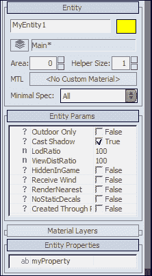
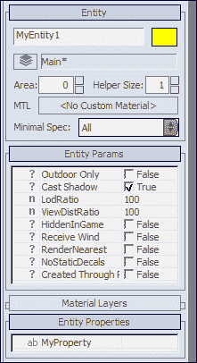
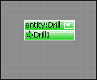

# 第三章：创建和利用自定义实体

CryENGINE 实体系统提供了创建从简单的物理对象到复杂的天气模拟管理器的一切的手段。

在本章中我们将：

+   详细介绍实体系统的基本概念和实现

+   在 Lua、C#和 C++中创建我们的第一个自定义实体

+   了解游戏对象系统

# 介绍实体系统

实体系统存在是为了在游戏世界中生成和管理实体。实体是逻辑容器，允许在运行时进行行为上的重大改变。例如，实体可以在游戏的任何时刻改变其模型、位置和方向。

考虑一下；你在引擎中与之交互的每个物品、武器、车辆，甚至玩家都是实体。实体系统是引擎中最重要的模块之一，经常由程序员处理。

通过`IEntitySystem`接口访问的实体系统管理游戏中的所有实体。实体使用`entityId`类型定义进行引用，允许在任何给定时间有 65536 个唯一实体。

如果实体被标记为删除，例如`IEntity::Remove(bool bNow = false)`，实体系统将在下一帧开始更新之前删除它。如果`bNow`参数设置为 true，则实体将立即被移除。

## 实体类

实体只是实体类的实例，由`IEntityClass`接口表示。每个实体类都被分配一个标识其的名称，例如，SpawnPoint。

类可以通过`IEntityClassRegistry::RegisterClass`注册，或者通过`IEntityClassRegistry::RegisterStdClass`注册以使用默认的`IEntityClass`实现。

## 实体

`IEntity`接口用于访问实体实现本身。`IEntity`的核心实现包含在`CryEntitySystem.dll`中，不能被修改。相反，我们可以使用游戏对象扩展（查看本章中的*游戏对象扩展*部分）和自定义实体类来扩展实体。

### entityId

每个实体实例都被分配一个唯一的标识符，该标识符在游戏会话的持续时间内保持不变。

### EntityGUID

除了`entityId`参数外，实体还被赋予全局唯一标识符，与`entityId`不同，这些标识符可以在游戏会话之间持续存在，例如在保存游戏等情况下。

## 游戏对象

当实体需要扩展功能时，它们可以利用游戏对象和游戏对象扩展。这允许更多的功能可以被任何实体共享。

游戏对象允许处理将实体绑定到网络、序列化、每帧更新以及利用现有（或创建新的）游戏对象扩展，如库存和动画角色。

在 CryENGINE 开发中，游戏对象通常只对更重要的实体实现（如演员）是必要的。演员系统在第五章中有更详细的解释，以及`IActor`游戏对象扩展。

## 实体池系统

实体池系统允许对实体进行“池化”，从而有效地控制当前正在处理的实体。这个系统通常通过流图访问，并允许根据事件在运行时基于事件禁用/启用实体组。

### 注意

池还用于需要频繁创建和释放的实体，例如子弹。

一旦实体被池系统标记为已处理，它将默认隐藏在游戏中。在实体准备好之前，它不会存在于游戏世界中。一旦不再需要，最好释放实体。

例如，如果有一组 AI 只需要在玩家到达预定义的检查点触发器时被激活，可以使用`AreaTrigger`（及其包含的流节点）和`Entity:EntityPool`流节点来设置。

# 创建自定义实体

现在我们已经学会了实体系统的基础知识，是时候创建我们的第一个实体了。在这个练习中，我们将演示在 Lua、C#和最后 C++中创建实体的能力。

## 使用 Lua 创建实体

Lua 实体相当简单设置，并围绕两个文件展开：实体定义和脚本本身。要创建新的 Lua 实体，我们首先必须创建实体定义，以告诉引擎脚本的位置：

```cs
<Entity
  Name="MyLuaEntity"
  Script="Scripts/Entities/Others/MyLuaEntity.lua"
/>
```

只需将此文件保存为`MyLuaEntity.ent`，放在`Game/Entities/`目录中，引擎将在`Scripts/Entities/Others/MyLuaEntity.lua`中搜索脚本。

现在我们可以继续创建 Lua 脚本本身！首先，在之前设置的路径创建脚本，并添加一个与实体同名的空表：

```cs
  MyLuaEntity = { }
```

在解析脚本时，引擎首先搜索与实体相同名称的表，就像您在`.ent`定义文件中定义的那样。这个主表是我们可以存储变量、编辑器属性和其他引擎信息的地方。

例如，我们可以通过添加一个字符串变量来添加我们自己的属性：

```cs
  MyLuaEntity = {
    Properties = {
      myProperty = "",
    },
  }
```

### 注意

可以通过在属性表中添加子表来创建属性类别。这对于组织目的很有用。

完成更改后，当在编辑器中生成类的实例时，您应该看到以下屏幕截图，通过**RollupBar**默认情况下位于编辑器的最右侧：



### 常见的 Lua 实体回调

脚本系统提供了一组回调，可以用于触发实体事件上的特定逻辑。例如，`OnInit`函数在实体初始化时被调用：

```cs
  function MyEntity:OnInit()
  end
```

## 在 C#中创建实体

第三方扩展**CryMono**允许在.NET 中创建实体，这使我们能够演示在 C#中创建我们自己的实体的能力。

首先，打开`Game/Scripts/Entities`目录，并创建一个名为`MyCSharpEntity.cs`的新文件。这个文件将包含我们的实体代码，并且在引擎启动时将在运行时编译。

现在，打开您选择的脚本（`MyCSharpEntity.cs`）IDE。我们将使用 Visual Studio 来提供**IntelliSense**和代码高亮。

一旦打开，让我们创建一个基本的骨架实体。我们需要添加对 CryENGINE 命名空间的引用，其中存储了最常见的 CryENGINE 类型。

```cs
  using CryEngine;

  namespace CryGameCode
  {
    [Entity]
    public class MyCSharpEntity : Entity
    {
    }
  }
```

现在，保存文件并启动编辑器。您的实体现在应该出现在**RollupBar**中的**默认**类别中。将**MyEntity**拖到视口中以生成它：


我们使用实体属性（`[Entity]`）作为为实体注册进度提供额外信息的一种方式，例如，使用`Category`属性将导致使用自定义编辑器类别，而不是**默认**。

```cs
  [Entity(Category = "Others")]
```

### 添加编辑器属性

编辑器属性允许关卡设计师为实体提供参数，也许是为了指示触发区域的大小，或者指定实体的默认健康值。

在 CryMono 中，可以通过使用`EditorProperty`属性来装饰支持的类型（查看以下代码片段）。例如，如果我们想添加一个新的`string`属性：

```cs
  [EditorProperty]
  public string MyProperty { get; set; }
```

现在，当您启动编辑器并将**MyCSharpEntity**拖到视口中时，您应该看到**MyProperty**出现在**RollupBar**的下部。

C#中的`MyProperty`字符串变量将在用户通过编辑器编辑时自动更新。请记住，编辑器属性将与关卡一起保存，允许实体在纯游戏模式中使用关卡设计师定义的编辑器属性。



#### 属性文件夹

与 Lua 脚本一样，CryMono 实体可以将编辑器属性放置在文件夹中以进行组织。为了创建文件夹，您可以使用`EditorProperty`属性的`Folder`属性，如下所示：

```cs
  [EditorProperty(Folder = "MyCategory")]
```

现在您知道如何使用 CryMono 创建具有自定义编辑器属性的实体！这在为关卡设计师创建简单的游戏元素并在运行时进行放置和修改时非常有用，而无需寻找最近的程序员。

## 在 C++中创建实体

在 C++中创建实体比使用 Lua 或 C#更复杂，可以根据实体所需的内容进行不同的操作。在本例中，我们将详细介绍通过实现`IEntityClass`来创建自定义实体类。

### 创建自定义实体类

实体类由`IEntityClass`接口表示，我们将从中派生并通过`IEntityClassRegistry::RegisterClass(IEntityClass *pClass)`进行注册。

首先，让我们为我们的实体类创建头文件。在 Visual Studio 中右键单击项目或其任何筛选器，并转到上下文菜单中的**添加** | **新项目**。在提示时，创建您的头文件（.h）。我们将称之为`CMyEntityClass`。

现在，打开生成的`MyEntityClass.h`头文件，并创建一个从`IEntityClass`派生的新类：

```cs
  #include <IEntityClass.h>

  class CMyEntityClass : public IEntityClass
  {
  };
```

现在，我们已经设置了类，我们需要实现从`IEntityClass`继承的纯虚拟方法，以便我们的类能够成功编译。

对于大多数方法，我们可以简单地返回空指针、零或空字符串。但是，有一些方法我们必须处理才能使类正常运行：

+   `Release()`: 当类应该被释放时调用，应该简单执行"delete this;"来销毁类

+   `GetName()`: 这应该返回类的名称

+   `GetEditorClassInfo()`: 这应该返回包含编辑器类别、帮助和图标字符串的`ClassInfo`结构到编辑器

+   `SetEditorClassInfo()`: 当需要更新刚才解释的编辑器`ClassInfo`时调用

`IEntityClass`是实体类的最低限度，尚不支持编辑器属性（稍后我们将稍后介绍）。

要注册实体类，我们需要调用`IEntityClassRegistry::RegisterClass`。这必须在`IGameFramework::CompleteInit`调用之前完成。我们将在`GameFactory.cpp`中的`InitGameFactory`函数中执行：

```cs
  IEntityClassRegistry::SEntityClassDesc classDesc;

  classDesc.sName = "MyEntityClass";
  classDesc.editorClassInfo.sCategory = "MyCategory";

  IEntitySystem *pEntitySystem = gEnv->pEntitySystem;

  IEntityClassRegistry *pClassRegistry = pEntitySystem->GetClassRegistry();

  bool result = pClassRegistry->RegisterClass(new CMyEntityClass(classDesc));
```

#### 实现属性处理程序

为了处理编辑器属性，我们将不得不通过新的`IEntityPropertyHandler`实现来扩展我们的`IEntityClass`实现。属性处理程序负责处理属性的设置、获取和序列化。

首先创建一个名为`MyEntityPropertyHandler.h`的新头文件。以下是`IEntityPropertyHandler`的最低限度实现。为了正确支持属性，您需要实现`SetProperty`和`GetProperty`，以及`LoadEntityXMLProperties`（后者需要从`Level` XML 中读取属性值）。

然后创建一个从`IEntityPropertyHandler`派生的新类：

```cs
  class CMyEntityPropertyHandler : public IEntityPropertyHandler
  {
  };
```

为了使新类编译，您需要实现`IEntityPropertyHandler`中定义的纯虚拟方法。关键的方法可以如下所示：

+   `LoadEntityXMLProperties`: 当加载关卡时，启动器会调用此方法，以便读取编辑器保存的实体的属性值

+   `GetPropertyCount`: 这应该返回注册到类的属性数量

+   `GetPropertyInfo`: 这是在编辑器获取可用属性时调用的，应该返回指定索引处的属性信息

+   `SetProperty`: 这是用来设置实体的属性值的

+   `GetProperty`: 这是用来获取实体的属性值的

+   `GetDefaultProperty`：调用此方法以检索指定索引处的默认属性值

要使用新的属性处理程序，创建一个实例（将请求的属性传递给其构造函数）并在`IEntityClass::GetPropertyHandler()`中返回新创建的处理程序。

我们现在有了一个基本的实体类实现，可以很容易地扩展以支持编辑器属性。这种实现非常灵活，可以用于各种用途，例如，稍后看到的 C#脚本只是简单地自动化了这个过程，减轻了程序员的很多代码责任。

# 实体流节点

在上一章中，我们介绍了流图系统以及流节点的创建。您可能已经注意到，在图表内右键单击时，上下文选项之一是**添加所选实体**。此功能允许您在级别内选择一个实体，然后将其实体流节点添加到流图中。

默认情况下，实体流节点不包含任何端口，因此在右侧显示时基本上没有用处。

然而，我们可以很容易地创建自己的实体流节点，以在所有三种语言中都针对我们选择的实体。



## 在 Lua 中创建实体流节点

通过扩展我们在*使用 Lua 创建实体*部分中创建的实体，我们可以添加其自己的实体流节点：

```cs
  function MyLuaEntity:Event_OnBooleanPort()
  BroadcastEvent(self, "MyBooleanOutput");end

  MyLuaEntity.FlowEvents =
  {
    Inputs =
    {
      MyBooleanPort = { MyLuaEntity.Event_OnBooleanPort, "bool" },
    },
    Outputs =
    {
      MyBooleanOutput = "bool",
    },
  }
```


我们刚刚为我们的`MyLuaEntity`类创建了一个实体流节点。如果您启动编辑器，生成您的实体，然后在流图中单击**添加所选实体**，您应该会看到节点出现。

## 使用 C#创建实体流节点

由于实现几乎与常规流节点完全相同，因此在 C#中创建实体流节点非常简单。要为您的实体创建一个新的流节点，只需从`EntityFlowNode<T>`派生，其中`T`是您的实体类名称：

```cs
  using CryEngine.Flowgraph;

  public class MyEntity : Entity { }

  public class MyEntityNode : EntityFlowNode<MyEntity>
  {
    [Port]
    public void Vec3Test(Vec3 input) { }

    [Port]
    public void FloatTest(float input) { }

    [Port]
    public void VoidTest()
    {
    }

    [Port]
    OutputPort<bool> BoolOutput { get; set; }
  }
```


我们刚刚在 C#中创建了一个实体流节点。这使我们可以轻松地使用我们从上一章学到的内容，并在新节点的逻辑中利用`TargetEntity`。

## 在 C++中创建实体流节点

### 注意

本节假定您已阅读了第二章中的*在 C++中创建自定义节点*部分。

简而言之，实体流节点在实现上与常规节点相同。不同之处在于节点的注册方式，以及实体支持`TargetEntity`的先决条件（有关更多信息，请参阅上一章）。

### 注册实体节点

我们使用与以前注册实体节点相同的方法，唯一的区别是类别必须是实体，节点名称必须与其所属的实体相同：

```cs
REGISTER_FLOW_NODE("entity:MyCppEntity", CMyEntityFlowNode);
```

### 最终代码

最后，根据我们现在和上一章学到的知识，我们可以很容易地在 C++中创建我们的第一个实体流节点：

```cs
  #include "stdafx.h"

  #include "Nodes/G2FlowBaseNode.h"

  class CMyEntityFlowNode : public CFlowBaseNode<eNCT_Instanced>
  {
    enum EInput
    {
      EIP_InputPort,
    };

    enum EOutput
    {
      EOP_OutputPort
    };

  public:
    CMyEntityFlowNode(SActivationInfo *pActInfo)
    {
    }

    virtual IFlowNodePtr Clone(SActivationInfo *pActInfo)
    {
      return new CMyEntityFlowNode(pActInfo);
    }

    virtual void ProcessEvent(EFlowEvent evt, SActivationInfo *pActInfo)
    {
    }

    virtual void GetConfiguration(SFlowNodeConfig &config)
    {
      static const SInputPortConfig inputs[] =
      {
        InputPortConfig_Void("Input", "Our first input port"),
        {0}
      };
      static const SOutputPortConfig outputs[] =
      {
        OutputPortConfig_Void("Output", "Our first output port"),
        {0}
      };

      config.pInputPorts = inputs;
      config.pOutputPorts = outputs;
      config.sDescription = _HELP("Entity flow node sample");

      config.nFlags |= EFLN_TARGET_ENTITY;
    }

    virtual void GetMemoryUsage(ICrySizer *s) const
    {
      s->Add(*this);
    }
  };

  REGISTER_FLOW_NODE("entity:MyCppEntity", CMyEntityFlowNode);
```

# 游戏对象

正如在本章开头提到的，当实体需要绑定到网络时，游戏对象用于需要更高级功能的实体。

有两种实现游戏对象的方法，一种是通过`IGameObjectSystem::RegisterExtension`直接注册实体（从而在实体生成时自动创建游戏对象），另一种是通过利用`IGameObjectSystem::CreateGameObjectForEntity`方法在运行时为实体创建游戏对象。

## 游戏对象扩展

通过创建扩展来扩展游戏对象，可以让开发人员钩入多个实体和游戏对象回调。例如，这就是演员默认实现的方式，我们将在第五章中进行介绍，*创建自定义演员*。

我们将在 C++中创建我们的游戏对象扩展。我们在本章前面创建的 CryMono 实体是由`CryMono.dll`中包含的自定义游戏对象扩展实现的，目前不可能通过 C#或 Lua 创建更多的扩展。

### 在 C++中创建游戏对象扩展

CryENGINE 提供了一个辅助类模板用于创建游戏对象扩展，称为`CGameObjectExtensionHelper`。这个辅助类用于避免重复常见代码，这些代码对于大多数游戏对象扩展是必要的，例如基本的 RMI 功能（我们将在第八章中介绍，*多人游戏和网络*）。

要正确实现`IGameObjectExtension`，只需从`CGameObjectExtensionHelper`模板派生，指定第一个模板参数为你正在编写的类（在我们的例子中为`CMyEntityExtension`），第二个参数为你要派生的`IGameObjectExtension`。

### 注意

通常，第二个参数是`IGameObjectExtension`，但对于特定的实现，比如`IActor`（它又从`IGameObjectExtension`派生而来），可能会有所不同。

```cs
  class CMyGameObjectExtension
    : public CGameObjectExtensionHelper<CMyGameObjectExtension, IGameObjectExtension>
    {
    };
```

现在你已经从`IGameObjectExtension`派生出来，你需要实现所有它的纯虚方法，以避免一堆未解析的外部。大多数可以用空方法重写，返回空或 false，而更重要的方法已经列出如下：

+   Init: 这是用来初始化扩展的。只需执行`SetGameObject(pGameObject)`；然后返回 true。

+   `NetSerialize`: 这是用来在网络上序列化东西的。这将在第八章中介绍，*多人游戏和网络*，但现在它只会简单地返回 true。

你还需要在一个新的类中实现`IGameObjectExtensionCreatorBase`，这个类将作为你实体的扩展工厂。当扩展即将被激活时，我们工厂的`Create()`方法将被调用以获取新的扩展实例：

```cs
  struct SMyGameObjectExtensionCreator
    : public IGameObjectExtensionCreatorBase
  {
    virtual IGameObjectExtension *Create() { return new CMyGameObjectExtension(); }

    virtual void GetGameObjectExtensionRMIData(void **ppRMI, size_t *nCount) { return CMyGameObjectExtension::GetGameObjectExtensionRMIData(ppRMI, nCount); }
  };
```

现在你已经创建了你的游戏对象扩展实现，以及游戏对象创建者，只需注册扩展：

```cs
static SMyGameObjectExtensionCreator creator;
  gEnv->pGameFramework->GetIGameObjectSystem()->RegisterExtension("MyGameObjectExtension", &creator, myEntityClassDesc);
```

### 注意

通过将实体类描述传递给`IGameObjectSystem::RegisterExtension`，你告诉它为你创建一个虚拟实体类。如果你已经这样做了，只需将最后一个参数`pEntityCls`传递为`NULL`，以便它使用你之前注册的类。

### 激活我们的扩展

为了激活你的游戏对象扩展，你需要在实体生成后调用`IGameObject::ActivateExtension`。一种方法是使用实体系统接收器`IEntitySystemSink`，并监听`OnSpawn`事件。

我们现在已经注册了我们自己的游戏对象扩展。当实体生成时，我们的实体系统接收器的`OnSpawn`方法将被调用，允许我们创建我们的游戏对象扩展的实例。

# 总结

在本章中，我们学习了核心实体系统的实现和暴露，并创建了我们自己的自定义实体。

你现在应该了解为你的实体创建附加的流程节点，并了解围绕游戏对象及其扩展的工作知识。

我们将在后面的章节中介绍现有的游戏对象扩展和实体实现，例如，通过创建我们自己的角色并实现基本的 AI。

如果你想更熟悉实体系统，为什么不试着自己创建一个稍微复杂的实体呢？

在下一章中，我们将介绍游戏规则系统。
