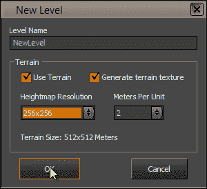
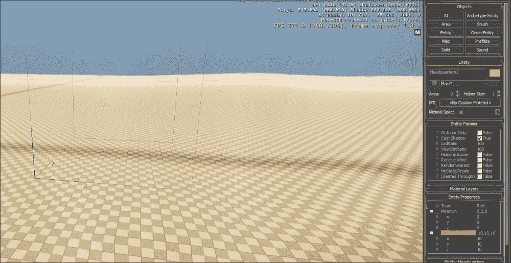

# 第四章 游戏规则

角色和实体是游戏的组成部分，但游戏规则是将它们联系在一起的东西。游戏规则系统管理所有初始玩家事件，如 OnConnect、OnDisconnect 和 OnEnteredGame。

使用游戏规则系统，我们可以创建自定义游戏流程来控制和联系我们的游戏机制。

在本章中，我们将：

+   学习游戏模式的基本概念

+   在 C++中创建我们的`IGameRules`实现

+   用 Lua 和 C#编写游戏规则脚本

# 游戏规则简介

在考虑游戏时，我们通常会将思绪引向游戏机制，如处理死亡和游戏结束条件。根据我们在前几章中学到的知识，由于每个实体和角色都不影响更大的方案，我们实际上无法实现这一点。

游戏规则确切地做了其名称所暗示的事情；控制游戏的规则。规则可以很简单，比如一个角色射击另一个角色时会发生什么，或者更复杂，例如开始和结束回合。

CryENGINE 游戏规则实现围绕着两种听起来非常相似但实际上有很大不同的类型：

+   **游戏规则**：这是通过 C++中的`IGameRules`接口实现的，它处理诸如`OnClientConnect`和`OnClientDisconnect`之类的回调。

+   **游戏模式**：这依赖于游戏规则实现，但通过添加额外的功能（如支持多个玩家）扩展了游戏规则实现的默认行为。例如，我们可以有两种游戏模式；单人游戏和死亡竞赛，它们都依赖于`IGameRules`实现提供的默认行为，但每种游戏模式都添加了额外的功能。

## IGameRules 接口 - 游戏规则

在第三章结束时，我们学习了游戏对象扩展。在本章中，我们将利用这些知识来实现`IGameRules`，这是一个游戏对象扩展，用于初始化游戏上下文并将游戏机制联系在一起。

### 注意

始终记住当前活动的游戏模式是一个实体。这有时可以通过请求实体事件来滥用。例如，在 Crytek 游戏 Crysis 中，一个常见的黑客技巧是围绕在游戏模式上发送子弹或杀死事件。这实质上“杀死”了游戏规则实体，并导致服务器严重崩溃。

`IGameRules`实现通常负责游戏模式的最基本行为，并将其他所有内容转发到其 C#或 Lua 脚本。

## 脚本 - 游戏模式

在注册我们的`IGameRules`实现之后，我们需要注册一个使用它的游戏模式。这是使用`IGameRulesSystem::RegisterGameRules`函数完成的（通常在`IGame::Init`中完成）。

```cs
pGameRulesSystem->RegisterGameRules("MyGameMode", "GameRules");
```

在处理了前面的片段之后，游戏规则系统将意识到我们的游戏模式。当`sv_gamerules`控制台变量更改为`MyGameMode`时，系统将创建一个新的实体，并激活其名为`GameRules`的游戏对象扩展（在前一节中注册）。

### 注意

`sv_gamerules`控制台变量在 CryENGINE 启动时设置为`sv_gamerulesdefault`的值，除非在专用服务器上运行。

此时，游戏将自动搜索名为你的游戏模式的 Lua 脚本，位于`Scripts/GameRules/`中。对于前面的片段，它会找到并加载`Scripts/GameRules/MyGameMode.lua`。

通过使用脚本，游戏规则实现可以将游戏事件（如新玩家连接）转发到 Lua 或 C#，允许每个游戏模式根据其内部逻辑专门化行为。

## 加载关卡

当使用地图控制台命令加载关卡时，游戏框架会在`Game/Levels`中搜索关卡。

通过使用`IGameRulesSystem::AddGameRulesLevelLocation`，我们可以在`Game/Levels`中添加子目录，当寻找新关卡时将会搜索这些子目录。例如：

```cs
gEnv->pGameFramework->GetIGameRulesSystem()->AddGameRulesLevelLocation("MyGameMode", "MGM_Levels");
```

当加载一个将 `sv_gamerules` 设置为 `MyGameMode` 的关卡时，游戏框架现在会在 `Levels/MGM_Levels/` 目录中搜索关卡目录。

这允许游戏模式特定的关卡被移动到 `Game/Levels` 目录中的子目录中，这样可以更容易地按游戏模式对关卡进行排序。

# 实现游戏规则接口

现在我们知道了游戏规则系统的基本工作原理，我们可以尝试创建一个自定义的 `IGameRules` 实现。

### 注意

在开始之前，请考虑你是否真的需要为你的游戏创建一个自定义的 `IGameRules` 实现。随游戏一起提供的默认 GameDLL 是专门为**第一人称射击游戏**（**FPS**）专门化的 `IGameRules` 实现。如果你的游戏前提类似于 FPS，或者你可以重用现有功能，那么可能更好地编写一个实现。

首先，我们需要创建两个新文件；`GameRules.cpp` 和 `GameRules.h`。完成后，打开 `GameRules.h` 并创建一个新的类。我们将命名为 `CGameRules`。

类就位后，我们必须从 `IGameRules` 派生。如前所述，游戏规则被处理为游戏对象扩展。因此，我们必须使用 `CGameObjectExtensionHelper` 模板类：

```cs
class CGameRules 
  : public CGameObjectExtensionHelper<CGameRules, IGameRules>
  {
  };
```

第三个可选的 `CGameObjectExtensionHelper` 参数定义了这个游戏对象支持多少个 RMIs。我们将在第八章 *多人游戏和网络*中进一步讨论它。

有了这个类，我们可以开始实现 `IGameRules` 和 `IGameObjectExtension` 结构中定义的所有纯虚方法。与实体一样，我们可以实现返回空、nullptr、零、false 或空字符串的虚拟方法。需要单独处理的方法如下：

| 函数名 | 描述 |
| --- | --- |
| `IGameObjectExtension::Init` | 用于初始化游戏对象扩展。应该调用 `IGameRulesSystem::SetCurrentGameRules(this)` |
| `IGameRules::OnClientConnect` | 当新客户端连接时在服务器上调用，必须使用 `IActorSystem::CreateActor` 创建一个新的角色 |
| `IGameRules::OnClientDisconnect` | 当客户端断开连接时在服务器上调用，必须包含对 `IActorSystem::RemoveActor` 的调用 |
| `IGameObjectExtension::Release / 析构函数` | `Release` 函数应该删除扩展实例，并通过其析构函数调用 `IGameRulesSystem::SetCurrentGameRules(nullptr)` |

## 注册游戏对象扩展

完成后，使用 `REGISTER_FACTORY` 宏注册游戏规则实现。

游戏对象扩展必须在游戏初始化过程中尽早注册，因此通常在 `IGame::Init` 函数中完成（通过默认 GameDLL 中的 `GameFactory.cpp`）：

```cs
  REGISTER_FACTORY(pFramework, "GameRules", CGameRules, false);
```

## 创建自定义游戏模式

要开始，我们需要注册我们的第一个游戏模式。

### 注意

注意 `IGameRules` 实现和游戏模式本身之间的区别。游戏模式依赖于 `IGameRules` 实现，并且需要单独注册。

要注册自定义游戏模式，CryENGINE 提供了 `IGameRulesSystem::RegisterGameRules` 函数：

```cs
  gEnv->pGameFramework->GetIGameRulesSystem()->RegisterGameRules("MyGameMode", "GameRules");

```

前面的代码将创建一个名为 `MyGameMode` 的游戏模式，它依赖于我们之前注册的 `GameRules` 游戏对象扩展。

当加载一个将 `sv_gamerules` 设置为 `MyGameMode` 的地图时，游戏规则实体将被创建并分配名称 `MyGameMode`。生成后，我们之前创建的 `IGameRules` 扩展将被构造。

### 注意

如果你只是创建一个现有游戏模式的副本或子类，例如从 `SinglePlayer.lua` 派生的默认 `DeathMatch.lua` 脚本，你需要单独注册 `DeathMatch` 游戏模式。

# 脚本

游戏模式通常是面向脚本的，游戏流程如生成、杀死和复活通常委托给 Lua 或 C# 等第二语言。

## Lua 脚本

由于 Lua 脚本已集成到 CryENGINE 中，我们无需进行任何额外的加载即可使其工作。要访问您的脚本表（基于与您的游戏模式同名的 Lua 文件在`Game/Scripts/GameRules`中）：

```cs
  m_script = GetEntity()->GetScriptTable();
```

### 调用方法

要在您的脚本表上调用方法，请参阅`IScriptSystem BeginCall`和`EndCall`函数：

```cs
  IScriptSystem *pScriptSystem = gEnv->pScriptSystem;

  pScriptSystem->BeginCall(m_script, "MyMethod");
  pScriptSystem->EndCall();
```

执行上述代码时，我们将能够在我们游戏模式的脚本表中包含的名为`MyMethod`的函数中执行 Lua 代码。表的示例如下所示：

```cs
  MyGameMode = { }

  function MyGameMode:MyMethod()
  end
```

### 调用带参数的方法

要为您的 Lua 方法提供参数，请在脚本调用的开始和结束之间使用`IScriptSystem::PushFuncParam`：

```cs
  pScriptSystem->BeginCall(m_script, name);
  pScriptSystem->PushFuncParam("myStringParameter");
  pScriptSystem->EndCall();
```

### 注意

`IScriptSystem::PushFuncParam`是一个模板函数，尝试使用提供的值创建一个`ScriptAnyValue`对象。如果默认的`ScriptAnyValue`构造函数不支持您的类型，将出现编译器错误。

恭喜，您现在已经使用字符串参数调用了 Lua 函数：

```cs
  function MyGameMode:MyMethod(stringParam)
  end
```

### 从 Lua 获取返回值

你还可以通过向`IScriptSystem::EndCall`传递一个额外的参数来从 Lua 函数中获取返回值。

```cs
  int result = 0;
  pScriptSystem->EndCall(&result);
  CryLog("MyMethod returned %i!", result);
```

### 获取表值

有时直接从 Lua 表中获取值可能是必要的，可以使用`IScriptTable::GetValue`来实现：

```cs
  bool bValue = false;
  m_script->GetValue("bMyBool", &bValue);
```

上述代码将在脚本中搜索名为`bMyBool`的变量，如果成功，则将其值设置为本机`bValue`变量。

## CryMono 脚本

要在`IGameObjectExtension::Init`实现中创建 CryMono 脚本的实例，请参阅`IMonoScriptSystem::InstantiateScript`：

```cs
  IMonoObjaect *pScript = GetMonoScriptSystem()->InstantiateScript(GetEntity()->GetClass()->GetName(), eScriptFlag_GameRules);
```

这段代码将查找一个具有当前游戏模式名称的 CryMono 类，并返回一个新的实例。

### 注意

无需同时使用 Lua 和 CryMono 游戏规则脚本。决定哪种对您的用例最好。

### 调用方法

现在您已经有了类实例，可以使用`IMonoObject::CallMethod`助手调用其中一个函数：

```cs
  m_pScript->CallMethod("OnClientConnect", channelId, isReset, playerName)
```

这段代码将搜索具有匹配参数的名为`OnClientConnect`的方法，并调用它：

```cs
  public bool OnClientConnect(int channelId, bool isReset = false, string playerName = "")
  {
  }
```

### 返回值

`IMonoObject::CallMethod`默认返回一个`mono::object`类型，表示一个装箱的托管对象。要获取本机值，我们需要将其解包：

```cs
  mono::object result = m_pScript->CallMethod("OnClientConnect", channelId, isReset, playerName);

  IMonoObject *pResult = *result;
  bool result = pResult->Unbox<bool>();
```

### 属性

要获取托管对象的属性值，请查看`IMonoObject::GetPropertyValue`：

```cs
  mono::object propertyValue = m_pScript->GetPropertyValue("MyFloatProperty");

  if(propertyValue)
  {
    IMonoObject *pObject = *propertyValue;

    float value = pObject->Unbox<float>();
  }
```

也可以直接设置属性值：

```cs
  float myValue = 5.5f;

  mono::object boxedValue = GetMonoScriptSystem()->GetActiveDomain()->BoxAnyValue(MonoAnyValue(myValue));

  m_pScript->SetPropertyValue("MyFloatProperty", boxedValue);
```

### 字段

也可以通过使用`IMonoObject`方法`GetFieldValue`和`SetFieldValue`以与属性相同的方式获取和设置字段的值。

# 在 C#中创建基本游戏模式

现在我们已经掌握了创建迷你游戏所需的基本知识，为什么不开始呢？首先，我们将致力于创建一个非常基本的用于生成演员和实体的系统。

## 定义我们的意图

首先，让我们明确我们想要做什么：

1.  生成我们的演员。

1.  将我们的演员分配给两个可能的团队之一。

1.  检查当演员进入对方的`Headquarters`实体时，并结束它。

## 创建演员

我们需要做的第一件事是生成我们的演员，这在我们拥有演员之前是无法完成的。为此，我们需要在`Game/Scripts`目录中的某个地方创建一个`MyActor.cs`文件，然后添加以下代码：

```cs
  public class MyActor : Actor 
  {
  }
```

这段代码片段是注册演员所需的最低限度。

我们还应该更新我们演员的视图，以确保玩家进入游戏时能看到一些东西。

```cs
  protected override void UpdateView(ref ViewParams viewParams)
  {
    var fov = MathHelpers.DegreesToRadians(60);

    viewParams.FieldOfView = fov;
    viewParams.Position = Position;
    viewParams.Rotation = Rotation;
  }
```

上述代码将简单地将摄像机设置为使用玩家实体的位置和旋转，视野为 60。

### 注意

要了解更多关于创建演员和视图的信息，请参阅第五章，*创建自定义演员*。

现在我们有了我们的演员，我们可以继续创建游戏模式：

```cs
  public class ReachTheHeadquarters : CryEngine.GameRules
  {
  }
```

与`Game/Scripts/`目录中找到的所有 CryMono 类型一样，我们的游戏模式将在 CryENGINE 启动后不久自动注册，即在调用`IGameFramework::Init`之后。

在继续创建特定于游戏的逻辑之前，我们必须确保我们的角色在连接时被创建。为此，我们实现一个`OnClientConnect`方法：

```cs
  public bool OnClientConnect(int channelId, bool isReset = false,  string playerName = "Dude")
  {
    // Only the server can create actors.
    if (!Game.IsServer)
      return false;

    var actor = Actor.Create<MyActor>(channelId, playerName);
    if (actor == null)
    {
      Debug.LogWarning("Failed to create the player.");
      return false;
    }

    return true;
  }
```

然而，由于脚本函数不是自动化的，我们需要修改我们的`IGameRules`实现的`OnClientConnect`方法，以确保我们在 C#中接收到这个回调：

```cs
  bool CGameRules::OnClientConnect(int channelId, bool isReset)
  {
  const char *playerName;
  if (gEnv->bServer && gEnv->bMultiplayer)
  {
    if (INetChannel *pNetChannel = gEnv->pGameFramework->GetNetChannel(channelId))
      playerName = pNetChannel->GetNickname();
  }
    else
      playerName = "Dude";

  return m_pScript->CallMethod("OnClientConnect", channelId, isReset, playerName) != 0;
  }
```

现在，当新玩家连接到服务器时，我们的`IGameRules`实现将调用`ReachTheHeadquarters.OnClientConnect`，这将创建一个新的`MyActor`类型的角色。

### 注意

请记住，游戏模式的`OnClientConnect`在非常早期就被调用，就在新客户端连接到服务器时。如果在`OnClientConnect`退出后没有为指定的`channelId`创建角色，游戏将抛出致命错误。

## 生成角色

当客户端连接时，角色现在将被创建，但是如何将角色重新定位到一个**SpawnPoint**呢？首先，在`Scripts`目录中的某个地方创建一个新的`SpawnPoint.cs`文件：

```cs
  [Entity(Category = "Others", EditorHelper = "Editor/Objects/spawnpointhelper.cgf")]
  public class SpawnPoint : Entity
  {
    public void Spawn(EntityBase otherEntity)
    {
      otherEntity.Position = this.Position;
      otherEntity.Rotation = this.Rotation;
    }
}
```

在重新启动编辑器后，这个实体现在应该出现在**RollupBar**中。我们将调用`spawnPoint.Spawn`函数来生成我们的角色。

首先，我们需要打开我们的`ReachTheHeadquarters`类，并添加一个新的`OnClientEnteredGame`函数：

```cs
  public void OnClientEnteredGame(int channelId, EntityId playerId, bool reset)
  {
    var player = Actor.Get<MyActor>(channelId);
    if (player == null)
    {
      Debug.LogWarning("Failed to get player");
      return;
    }
    var random = new Random();

 // Get all spawned entities off type SpawnPoint
    var spawnPoints = Entity.GetByClass<SpawnPoint>();

// Get a random spawpoint
    var spawnPoint = spawnPoints.ElementAt(random.Next(spawnPoints.Count()));
    if(spawnPoint != null)
    {
     // Found one! Spawn the player here.
      spawnPoint.Spawn(player);
    }
  }
```

这个函数将在客户端进入游戏时被调用。在启动器模式下，这通常发生在玩家完成加载后，而在编辑器中，它是在玩家按下*Ctrl* + *G*后切换到**纯游戏模式**时调用的。

在当前状态下，我们首先会获取我们玩家的`MyActor`实例，然后在随机选择的`SpawnPoint`处生成。

### 注意

不要忘记从你的`IGameRules`实现中调用你的脚本的`OnClientEnteredGame`函数！

## 处理断开连接

我们还需要确保玩家断开连接时角色被移除：

```cs
  public override void OnClientDisconnect(int channelId)
  {
    Actor.Remove(channelId);
  }
```

不要忘记从你的`IGameRules`实现中调用`OnClientConnect`函数！

### 注意

在断开连接后未能移除玩家将导致角色在游戏世界中持续存在，并且由于相关玩家不再与服务器连接，可能会出现更严重的问题。

## 将玩家分配到一个队伍

现在玩家可以连接和生成了，让我们实现一个基本的队伍系统，以跟踪每个玩家所属的队伍。

首先，让我们向我们的游戏模式添加一个新的`Teams`属性：

```cs
  public virtual IEnumerable<string> Teams
  {
    get
    {
      return new string[] { "Red", "Blue" };
    }
  }
```

这段代码简单地确定了我们的游戏模式允许的队伍，即`红队`和`蓝队`。

现在，让我们还向我们的`MyActor`类添加一个新属性，以确定角色所属的队伍：

```cs
  public string Team { get; set; }
```

太好了！然而，我们还需要将相同的片段添加到`SpawnPoint`实体中，以避免生成相同队伍的玩家相邻。

完成这些操作后，打开`ReachTheHeadquarters`游戏模式类，并导航到我们之前创建的`OnClientEnteredGame`函数。我们要做的是扩展`SpawnPoint`选择，只使用属于玩家队伍的生成点。

看一下以下片段：

```cs
// Get all spawned entities of type SpawnPoint
  var spawnPoints = Entity.GetByClass<SpawnPoint>(); 

```

现在，用以下代码替换这个片段：

```cs
// Get all spawned entities of type SpawnPoint belonging to the players team
  var spawnPoints = Entity.GetByClass<SpawnPoint>().Where(x => x.Team == player.Team);
```

这将自动删除所有`Team`属性与玩家不相等的生成点。

但等等，我们还需要把玩家分配到一个队伍！为了做到这一点，在获取生成点之前添加以下内容：

```cs
  player.Team = Teams.ElementAt(random.Next(Teams.Count()));
```

当玩家进入游戏时，我们将随机选择一个队伍分配给他们。如果你愿意，为什么不扩展这一点，以确保队伍始终保持平衡？例如，如果红队比蓝队多两名玩家，就不允许新玩家加入红队。

### 注意

在继续之前，随意玩弄当前的设置。你应该能够在游戏中生成！

## 实现总部

最后，让我们继续创建我们的游戏结束条件；总部。简单来说，每个队伍都会有一个`总部`实体，当玩家进入对方队伍的总部时，该玩家的队伍就赢得了比赛。

### 添加游戏结束事件

在创建`Headquarters`实体之前，让我们在`ReachTheHeadquarters`类中添加一个新的`EndGame`函数：

```cs
  public void EndGame(string winningTeam)
  {
    Debug.LogAlways("{0} won the game!", winningTeam);
  }
```

我们将从`Headquarters`实体中调用此函数，以通知游戏模式游戏应该结束。

### 创建总部实体

现在，我们需要创建我们的`Headquarters`实体（请参阅以下代码片段）。该实体将通过 Sandbox 放置在每个级别中，每个队伍一次。我们将公开三个编辑器属性；`Team`，`Minimum`和`Maximum`：

+   `Team`：确定`Headquarters`实例属于哪个队伍，在我们的例子中是蓝队或红队

+   `Minimum`：指定触发区域的最小大小

+   `Maximum`：指定触发区域的最大大小

```cs
  public class Headquarters : Entity
  {
    public override void OnSpawn()
    {
      TriggerBounds = new BoundingBox(Minimum, Maximum);
    }

    protected override void OnEnterArea(EntityId entityId, int areaId, EntityId areaEntityId)
    {
    }

    [EditorProperty]
    public string Team { get; set; }

    [EditorProperty]
    public Vec3 Minimum { get; set; }

    [EditorProperty]
    public Vec3 Maximum { get; set; }
  }
```

太棒了！现在我们只需要扩展`OnEnterArea`方法，在游戏结束时通知我们的游戏模式：

```cs
  protected override void OnEnterArea(EntityId entityId, int areaId, EntityId areaEntityId)
  {
    var actor = Actor.Get<MyActor>(entityId);
    if (actor == null)
      return;

    if (actor.Team != Team)
    {
      var gameMode = CryEngine.GameRules.Current;
      var rthGameRules = gameMode as ReachTheHeadquarters;

      if (rthGameRules != null)
        rthGameRules.EndGame(actor.Team);
    }
  }
```

`Headquarters`实体现在将在对立队伍的实体进入时通知游戏模式。

#### 绕道 - 触发器边界和实体区域

实体可以通过注册区域接收区域回调。这可以通过将实体链接到形状实体或手动创建触发器代理来完成。在 C#中，您可以通过设置`EntityBase.TriggerBounds`属性来手动创建代理，就像我们在之前的代码片段中所做的那样。

当实体位于或靠近该区域时，它将开始接收该实体上的事件。这允许创建特定实体，可以跟踪玩家何时以及何地进入特定区域，以触发专门的游戏逻辑。

请参阅以下表格，了解可通过 C++实体事件和 C# `Entity`类中的虚拟函数接收的可用区域回调列表：

| 回调名称 | 描述 |
| --- | --- |
| 当一个实体进入与该实体链接的区域时调用`OnEnterArea`。 |
| `OnLeaveArea` | 当存在于与该实体链接的区域内的实体离开时触发 |
| `OnEnterNearArea` | 当实体靠近与该实体链接的区域时触发 |
| `OnMoveNearArea` | 当实体靠近与该实体链接的区域时调用 |
| `OnLeaveNearArea` | 当实体离开与该实体链接的附近区域时调用 |
| `OnMoveInsideArea` | 当实体重新定位到与该实体链接的区域内时触发 |

## 填充级别

基本示例现在已经完成，但需要一些调整才能使其正常工作！首先，我们需要创建一个新级别，并为每个队伍放置`Headquarters`。

首先，打开 Sandbox 编辑器，并通过导航到**文件** | **新建**来创建一个新级别：



这将弹出**新级别**对话框，在其中我们可以设置级别名称和地形设置。

点击**确定**后，您的级别将被创建，然后加载。完成后，现在是时候开始向我们的级别添加必要的游戏元素了！

首先，打开**RollupBar**并通过将其拖入视口中生成**Headquarters**实体：


生成后，我们必须设置在**Headquarters**类中创建的编辑器属性。

将**Team**设置为**红色**，**Maximum**设置为**10,10,10**。这会告诉类`Headquarters`属于哪个队伍，并且我们将查询以检测另一个玩家是否进入了该区域的最大大小。



完成后，生成另一个**Headquarters**实体（或复制现有实体），然后按照相同的过程进行操作，只是这次将**Team**属性设置为**蓝色**。

现在，我们只需要为每个队伍生成一个 SpawnPoint 实体，然后我们就可以开始了！再次打开**RollupBar**，然后转到**其他** | **SpawnPoint**：


现在，将实体拖放到视口中，以与生成**Headquarters**相同的方式生成它。生成后，将**Team**属性设置为**红色**，然后为蓝队重复该过程：


完成了！现在你应该能够使用 *Ctrl* + *G* 进入游戏，或者通过导航到 **游戏** | **切换到游戏**。然而，由于我们还没有添加任何类型的玩家移动，玩家将无法朝着敌方总部移动以结束游戏。

学习如何处理玩家输入和移动，请参考下一章，第五章，*创建自定义角色*。

# 总结

在本章中，我们学习了游戏规则系统的基本行为，并创建了自己的`IGameRules`实现。

在注册了自己的游戏模式并在 C#中创建了`Headquarters`示例之后，你应该对游戏规则系统有了很好的理解。

我们已经创建了第一个游戏模式，现在可以继续下一章了。记住未来章节中游戏规则的目的，这样你就可以将需要在游戏中创建的所有游戏机制联系在一起。

对游戏规则还不满意？为什么不尝试在你选择的脚本语言中创建一个基本的游戏规则集，或者扩展我们之前创建的示例。在下一章中，我们将看到如何创建自定义角色。
