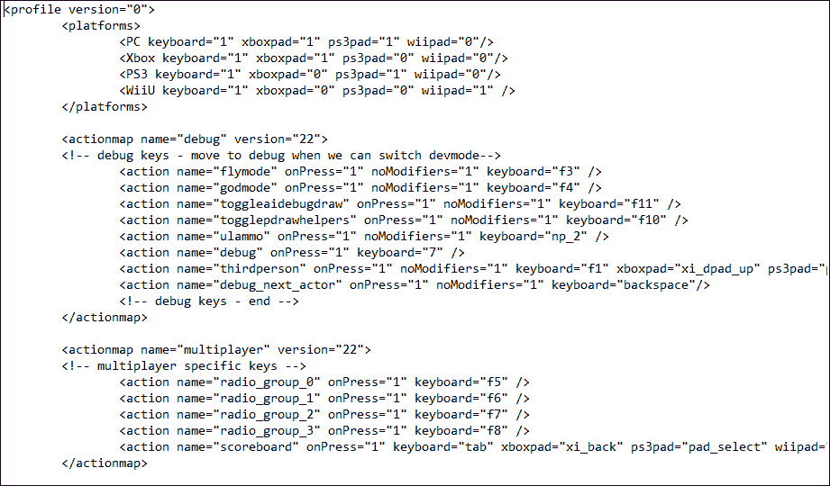
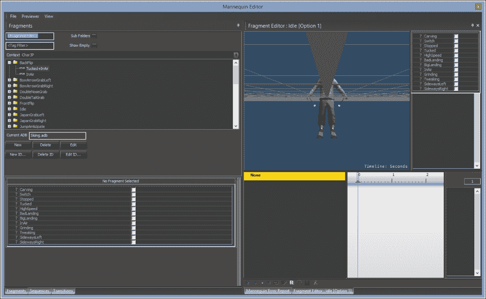
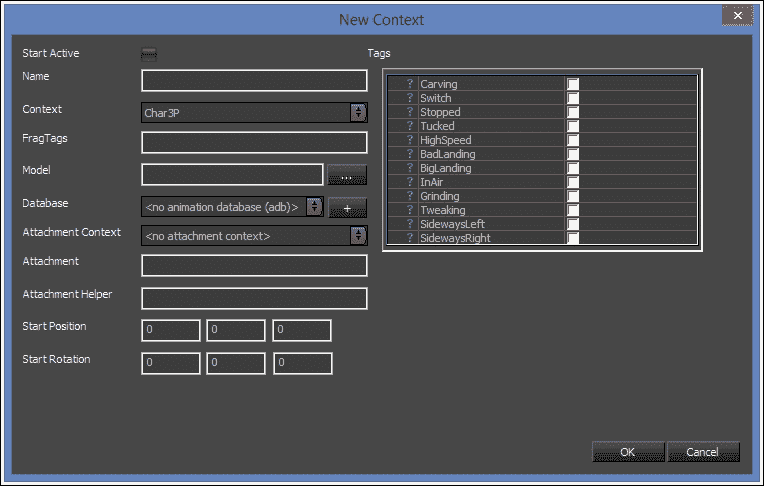
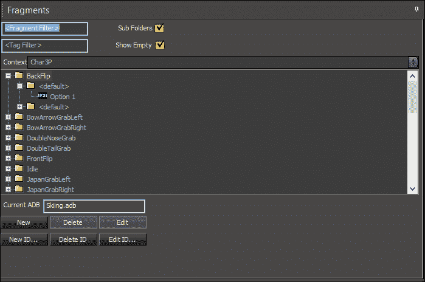
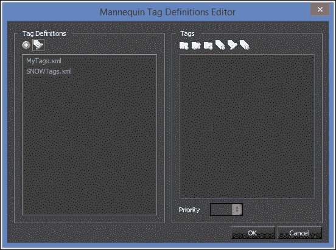
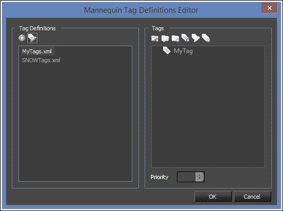

# 第五章：创建自定义角色

使用 CryENGINE 角色系统，我们可以创建具有自定义行为的玩家或 AI 控制实体，以填充我们的游戏世界。

在本章中，我们将涵盖以下主题：

+   了解角色的目的以及实现它们背后的核心思想

+   在 C++和 C#中创建自定义角色

+   创建我们的第一个玩家摄像头处理程序

+   实现基本玩家移动

# 介绍角色系统

我们在第三章中学习了游戏对象扩展是什么，以及如何使用它们，*创建和利用自定义实体*。我们将在此基础上创建一个 C++和 C#中的自定义角色。

角色由`IActor`结构表示，它们是核心中的游戏对象扩展。这意味着每个角色都有一个支持实体和一个处理网络和`IActor`扩展的游戏对象。

角色由`IActorSystem`接口处理，该接口管理每个角色的创建、移除和注册。

## 通道标识符

在网络上下文中，每个玩家都被分配一个通道 ID 和 Net Nub 的索引，我们将在第八章中进一步介绍，*多人游戏和网络*。

## 角色生成

玩家角色应在客户端连接到游戏时生成，在`IGameRules::OnClientConnect`中。要生成角色，请使用`IActorSystem::CreateActor`如下所示：

```cs
IActorSystem *pAS = gEnv->pGameFramework->GetIActorSystem();

pAS ->CreateActor(channelId, "MyPlayerName", "MyCppActor", Vec3(0, 0, 0), Quat(IDENTITY), Vec3(1, 1, 1));
```

### 注意

请注意，先前的代码仅适用于由玩家控制的角色。非玩家角色可以随时创建。

### 移除角色

为了确保在客户端断开连接时正确删除玩家角色，我们需要通过`IGameRules::OnClientDisconnect`回调手动删除它：

```cs
pActorSystem->RemoveActor(myActorEntityId);
```

在玩家断开连接后忘记移除玩家角色可能会导致崩溃或严重的伪影。

## 视图系统

为了满足处理玩家和其他摄像头来源的视图的需求，CryENGINE 提供了视图系统，可通过`IViewSystem`接口访问。

视图系统是围绕着任意数量的视图，由`IView`接口表示，每个视图都有更新位置、方向和配置（如视野）的能力。

### 注意

请记住，一次只能激活一个视图。

可以使用`IViewSystem::CreateView`方法创建新视图，如下所示：

```cs
IViewSystem *pViewSystem = gEnv->pGame->GetIGameFramework()->GetIViewSystem();

IView *pNewView = pViewSystem->CreateView();
```

然后，我们可以使用`IViewSystem::SetActiveView`函数设置活动视图：

```cs
pViewSystem_>SetActiveView(pNewView);
```

一旦激活，视图将在每一帧更新系统相机。要修改视图的参数，我们可以调用`IView::SetCurrentParams`。例如，要更改位置，请使用以下代码片段：

```cs
SViewParams viewParams = *GetCurrentParams();
viewParams.position = Vec3(0, 0, 10);
SetCurrentParams(viewParams);
```

当前视图的位置现在是（0，0，10）。

### 将视图链接到游戏对象

每个视图还可以将自己链接到游戏对象，允许其游戏对象扩展订阅`UpdateView`和`PostUpdateView`函数。

这些函数允许每帧更新的视图的位置、方向和配置很容易地更新。例如，这用于角色，以提供为每个玩家创建自定义相机处理的可访问方式。

有关相机操作的更多信息，请参见本章后面的*相机操作*部分。

# 创建自定义角色

现在我们知道角色系统是如何工作的，我们可以继续在 C#和 C++中创建我们的第一个角色。

### 注意

默认情况下，无法仅使用 Lua 脚本创建角色。通常，角色是在 C++中创建的，并处理自定义回调以包含在`Game/Scripts/Entities/Actors`文件夹中的 Lua 脚本。

## 在 C#中创建角色

使用 CryMono，我们可以完全在 C#中创建自定义角色。为此，我们可以从`Actor`类派生，如下所示：

```cs
public class MyActor : Actor
{
}
```

上面的代码是在 CryMono 中创建演员的最低要求。然后你可以转到你的游戏规则实现，并在客户端连接时通过`Actor.Create`静态方法生成演员。

### CryMono 类层次结构

如果你对各种 CryMono/C#类感到困惑，请参阅以下继承图：


### 注意

请注意，当使用`Entity.Get`（或通过`Actor.Get`查询演员）查询实体时，你将得到一个`EntityBase`或`ActorBase`类型的对象。这是因为本地实体和演员存在于托管系统之外，当查询时返回了有限的表示。

### 同时使用本地和 CryMono 演员

如果你更喜欢在 C++中自己创建你的演员，你仍然可以通过使用`NativeActor`类在 CryMono 代码中引用它。为此，只需在 C#中创建一个新的类，名称与你注册的`IActor`实现相同，并从`NativeActor`派生，如下所示：

#### C++演员注册

演员注册是使用注册工厂完成的。这个过程可以使用`REGISTER_FACTORY`宏自动化，如下所示： 

```cs
REGISTER_FACTORY(pFramework, "Player", CPlayer, false);
```

#### C#声明

在 C#中声明基于本地的演员非常简单，只需要从`CryEngine.NativeActor`类派生，如下所示：

```cs
public class Player : NativeActor
{
}
```

这允许 C#代码仍然可以使用，但保持大部分代码在你的 C++ `IActor`实现中。

### 注意

`CryEngine.NativeActor`直接派生自`CryEngine.ActorBase`，因此不包含常见的`CryEngine.Actor`回调，比如 OnEditorReset。要获得这个额外的功能，你需要在你的`IActor`实现中创建它。

## 在 C++中创建演员

要在 C++中创建一个演员，我们依赖于`IActor`接口。由于演员是核心中的游戏对象扩展，我们不能简单地从`IActor`派生，而是必须像下面的代码中所示使用`CGameObjectExtensionHelper`模板：

```cs
class CMyCppActor
  : public CGameObjectExtensionHelper<CMyCppActor, IActor>
{
};
```

### 注意

第三个`CGameObjectExtensionHelper`参数定义了这个游戏对象支持的最大 RMI（远程机器调用）数量。我们将在第八章中进一步介绍，*多人游戏和网络*。

现在我们有了这个类，我们需要实现`IActor`结构中定义的纯虚方法。

### 注意

请注意，`IActor`派生自`IGameObjectExtension`，这意味着我们还需要实现它的纯虚方法。有关此信息，请参阅第四章中的*实现游戏规则接口*部分，*游戏规则*。

对于大多数`IActor`方法，我们可以实现虚拟方法，要么返回空，要么返回虚拟值，比如 nullptr，零，或者空字符串。以下表格列出了例外情况：

| 函数名称 | 描述 |
| --- | --- |
| `IGameObjectExtension::Init` | 用于初始化游戏对象扩展。应该调用`IGameObjectExtension::SetGameObject`和`IActorSystem::AddActor`。 |
| 类析构函数 | 应该始终调用`IActorSystem::RemoveActor`。 |
| `IActor::IsPlayer` | 用于确定演员是否由人类玩家控制。我们可以简单地返回`GetChannelId() != 0`，因为通道标识符只对玩家非零。 |
| `IActor::GetActorClassName` | 用于获取演员类的名称，例如，在我们的情况下是`CMyCppActor`。 |
| `IActor::GetEntityClassName` | 获取实体类的名称的辅助函数。我们可以简单地返回`GetEntity()->GetClass()->GetName()`。 |

当你解决了纯虚函数后，继续下一节注册你的演员。完成后，你可以在`IGameRules::OnClientConnect`中为连接的玩家创建你的演员。

### 注册演员

要在游戏框架（包含在`CryAction.dll`中）中注册一个演员，我们可以使用与在`GameFactory.cpp`中注册 C++游戏规则实现时相同的设置：

```cs
REGISTER_FACTORY(pFramework, "MyCppActor", CMyCppActor, false);
```

在执行前面的代码之后，您将能够通过`IActorSystem::CreateActor`函数生成您的演员。

# 摄像机处理

玩家控制的演员在`IActor::UpdateView(SViewParams &viewParams)`和`IActor::PostUpdateView(SViewParams &viewParams)`函数中管理视口摄像机。

`SViewParams`结构用于定义摄像机属性，如位置、旋转和视野。通过修改`UpdateView`方法中的`viewParams`引用，我们可以将摄像机移动到游戏所需的位置。

### 注意

CryMono 演员以与 C++演员相同的方式接收和处理`UpdateView(ref ViewParams viewParams)`和`PostUpdateView(ref ViewParams viewParams)`事件。

## 实现 IGameObjectView

为了获得视图事件，我们需要实现并注册一个游戏对象视图。要做到这一点，首先从`IGameObjectView`派生，并实现它包括的以下两个纯虚函数：

+   `UpdateView`：用于更新视图位置、旋转和视野

+   `PostUpdateView`：在更新视图后调用

在实现游戏对象视图之后，我们需要确保在演员扩展初始化时捕获它（在 Init 中）：

```cs
if(!GetGameObject()->CaptureView(this))
  return false;
```

您的演员现在应该接收视图更新回调，可以利用它来移动视口摄像机。不要忘记在析构函数中释放视图：

```cs
GetGameObject()->ReleaseView(this);
```

## 创建俯视摄像机

为了展示如何创建自定义摄像机，我们将扩展我们在上一章中创建的示例，添加一个自定义的俯视摄像机。简单来说，就是从上方查看角色，并从远处跟随其动作。

首先，打开您的 C#演员的`UpdateView`方法，或者在您的`.cs`源文件中实现它。

### 视图旋转

为了使视图朝向玩家的顶部，我们将使用玩家旋转的第二列来获取向上的方向。

### 注意

四元数以一种允许轻松插值和避免万向节锁的方式表示玩家的旋转。您可以获得代表每个四元数方向的三列：0（右）、1（前）、2（上）。例如，这非常有用，可以获得一个面向玩家前方的向量。

除非您自上次函数以来对演员的`UpdateView`函数进行了任何更改，否则它应该看起来与以下代码片段类似：

```cs
protected override void UpdateView(ref ViewParams viewParams)
{
  var fov = MathHelpers.DegreesToRadians(60);

  viewParams.FieldOfView = fov;
  viewParams.Position = Position;
  viewParams.Rotation = Rotation
}
```

这只是将视角摄像机放在与玩家完全相同的位置，具有相同的方向。我们需要做的第一个改变是将摄像机向上移动一点。

为此，我们将简单地将玩家旋转的第二列附加到其位置，并将摄像机放置在与玩家相同的 x 和 y 位置，但略高于玩家：

```cs
var playerRotation = Rotation;

float distanceFromPlayer = 5;
var upDir = playerRotation.Column2;

viewParams.Position = Position + upDir * distanceFromPlayer;
```

随时随地进入游戏并查看。当您准备好时，我们还必须将视图旋转为直接向下：

```cs
// Face straight down
var angles = new Vec3(MathHelpers.DegreesToRadians(-90), 0, 0);

//Convert to Quaternion
viewParams.Rotation = Quat.CreateRotationXYZ(angles);
```

完成！我们的摄像机现在应该正对着下方。


这大致是您应该看到的新摄像机。

请注意视图中缺少玩家角色。这是因为我们还没有将对象加载到玩家实体中。我们可以通过在`OnSpawn`函数中调用`EntityBase.LoadObject`来快速解决这个问题：

```cs
public override void OnSpawn()
{
  // Load object
  LoadObject("Objects/default/primitive_cube.cgf");

  // Physicalize to weigh 50KG
  var physicalizationParams = new PhysicalizationParams(PhysicalizationType.Rigid);
  physicalizationParams.mass = 50;
  Physicalize(physicalizationParams);
}
```

现在您应该能够在场景中看到代表玩家角色的立方体。请注意，它也是物理化的，允许它推动或被其他物理化的对象推动。


现在您应该对玩家视图功能有了基本的了解。要了解更多，为什么不尝试创建您自己的摄像机，即 RPG 风格的等距摄像机？

现在我们可以继续下一节，*玩家输入*。

# 玩家输入

当您无法控制演员时，演员往往会变得相当无聊。为了将事件映射到输入，我们可以利用以下三个系统：

| 系统名称 | 描述 |
| --- | --- |
| IHardwareMouse | 当需要直接获取鼠标事件时使用，例如 x/y 屏幕位置和鼠标滚轮增量。 |
| IActionMapManager | 允许注册与按键绑定相关的回调。这是首选的键盘和鼠标按钮输入方法，因为它允许每个玩家通过他们的行动地图配置文件自定义他们喜欢的输入方式。行动地图通常通过游戏界面公开，以简化最终用户的按键映射。 |
| IInput | 用于监听原始输入事件，例如检测空格键何时被按下或释放。除了在聊天和文本输入等极少数情况下，不建议使用原始输入，而是使用行动地图更可取。 |

## 硬件鼠标

硬件鼠标实现提供了`IHardwareMouseEventListener`结构，允许接收鼠标事件回调。在派生并实现其纯虚函数后，使用`IHardwareMouse::AddListener`来使用它：

```cs
gEnv->pHardwareMouse->AddListener(this);
```

监听器通常在构造函数或初始化函数中调用。确保不要注册两次监听器，并始终在类析构函数中移除它们以防止悬空指针。

## 行动地图

在前面的表中简要提到，行动地图允许将按键绑定到命名动作。这用于允许从不同的游戏状态简单重新映射输入。例如，如果你有一个有两种类型车辆的游戏，你可能不希望相同的按键用于两种车辆。

行动地图还允许实时更改动作映射到的按键。这允许玩家自定义他们喜欢的输入方式。

### 监听行动地图事件

默认的行动地图配置文件包含在`Game/Libs/Config/defaultProfile.xml`中。游戏发布时，默认配置文件会被复制到用户的个人文件夹（通常在`My Games/Game_Title`），用户可以修改它来重新映射按键，例如更改触发**截图**动作的按键。



要监听行动地图事件，我们首先要么在配置文件中创建一个新的动作，要么选择一个现有的动作并修改它。在这个例子中，我们将利用现有的截图动作。

#### IActionListener

行动地图系统提供了`IActionListener`结构来支持为需要行动地图事件的类提供回调函数。

利用监听器相对容易：

1.  派生自`IActorListener`结构。

1.  实现`OnAction`事件。

1.  注册你的监听器：

```cs
gEnv->pGameFramework->GetIActionMapManager()->AddExtraActionListener(this);
```

监听器应该只注册一次，这就是为什么注册最好在构造函数或初始化函数中进行。

确保在类实例销毁时移除你的监听器。

### 启用行动地图部分

行动地图系统允许在同一个配置文件中创建多个行动地图部分，使游戏代码能够实时切换不同的行动地图部分。这对于具有多个玩家状态的游戏非常有用，比如行走和使用车辆。在这种情况下，车辆和行走行动地图将包含在不同的部分中，然后在退出或进入车辆时启用/禁用它们。

```cs
<actionmap name="walk" version="22">
  <action name="walkBack" onPress="1" keyboard="s" />
</actionmap>

<actionmap name="drive" version="22">
  <action name="break" onPress="1" keyboard="s" />
</actionmap>
```

要启用自定义的行动地图，调用`IActionMapManager::EnableActionMap`：

```cs
gEnv->pFramework->GetIActionMapManager()->EnableActionMap("walk", true);
```

这应该在玩家应该能够接收这些新动作的确切时刻完成。在前面的例子中，当玩家退出车辆时启用“行走”动作。

# 动画角色

`IAnimatedCharacter`是一个游戏对象扩展，允许对象进行运动和物理整合。通过使用它，角色可以请求物理移动请求，利用动画图功能等。

由于该扩展是可选的，任何游戏对象都可以通过简单获取它来激活它，如第三章中所述，*创建和利用自定义实体*

```cs
m_pAnimatedCharacter = static_cast<IAnimatedCharacter*>(GetGameObject()->AcquireExtension("AnimatedCharacter"))
```

一旦获取，动画角色可以立即使用。

### 注意

动画角色功能，如移动请求，需要通过`IGameObject::EnablePhysicsEvent`启用 eEPE_OnPostStepImmediate 物理事件。

## 移动请求

当动画角色作为生物实体物理化时，可以请求移动。这本质上是 pe_action_move 物理请求的包装（有关更多信息，请参见第九章，“物理编程”）以允许更简单的使用。

处理高级机制，如玩家移动时，角色移动请求非常有用。

### 注意

请注意请求移动和直接设置玩家位置之间的区别。通过请求速度变化，我们能够使我们的实体自然地对碰撞做出反应。

## 添加移动请求

要添加移动请求，利用`IAnimatedCharacter::AddMovement`，需要一个`SCharacterMoveRequest`对象：

```cs
SCharacterMoveRequest request;

request.type = eCMT_Normal;
request.velocity = Vec3(1, 0, 0);
request.rotation = Quat(IDENTITY);

m_pAnimatedCharacter->AddMovement(request);
```

在上面的代码中看到的是一个非常基本的移动请求示例，它将目标设置为无限制地向前（世界空间）（如果连续提交）。

### 注意

移动请求必须通过物理循环添加，参见通过`IGameObjectExtension::ProcessEvent`发送的 ENTITY_EVENT_PREPHYSICSUPDATE。

# 模特动画系统

CryENGINE 3.5 引入了高级模特动画系统。该系统旨在解耦动画和游戏逻辑，有效地作为 CryAnimation 模块和游戏代码之间的附加层。

### 注意

请记住，模特可以应用于任何实体，而不仅仅是演员。但是，默认情况下，模特集成到`IAnimatedCharacter`扩展中，使演员更容易利用新的动画系统。

在开始使用之前，模特依赖一组类型，这些类型应该在开始使用之前清楚地理解：

| 名称 | 描述 |
| --- | --- |
| 片段 | 片段指的是一个状态，例如，“着陆”。每个片段可以在多个层上指定多个动画，以及一系列效果。这允许在同时处理第一人称和第三人称视图时，动画更加流畅。对于这个问题，每个片段将包含一个全身动画，一个第一人称动画，然后额外的声音，粒子和游戏事件。 |
| 片段 ID | 为了避免直接传递片段，我们可以通过它们的片段 ID 来识别它们。 |
| 范围 | 范围允许解耦角色的部分，以便保持处理，例如，上半身和下半身动画分开。在创建新的范围时，每个片段将能够向该范围添加额外的动画和效果，以扩展其行为。对于 Crysis 3，第一人称和第三人称模式被声明为单独的范围，以允许相同的片段同时处理这两种状态。 |
| 标签 | 标签是指选择标准，允许根据活动的标签选择子片段。例如，如果我们有两个名为“空闲”的片段，但一个分配给“受伤”标签，我们可以根据玩家是否受伤动态地在两个片段变化之间切换。 |
| 选项 | 如果我们最终有多个共享相同标识和标签的片段，我们有多种选择。默认行为是在查询片段时随机选择其中一个，从而有效地创建实体动画的变化。 |

## 模特编辑器

**模特编辑器**用于通过沙盒编辑器实时调整角色动画和模特配置。

### 预览设置

**模特编辑器**使用存储在`Animations/Mannequin/Preview`中的预览文件，以加载默认模型和动画数据库。启动**模特编辑器**时，我们需要通过选择**文件** | **加载预览设置**来加载我们的预览设置。

加载后，我们将得到预览设置的可视表示，如下面的截图所示：



我们预览文件的内容如下：

```cs
<MannequinPreview>
  <controllerDef filename="Animations/Mannequin/ADB/SNOWControllerDefinition.xml"/>
  <contexts>
    <contextData name="Char3P" enabled="1" database="Animations/Mannequin/ADB/Skiing.adb" context="Char3P" model="scripts/config/base.cdf"/>
  </contexts>
  <History StartTime="-4.3160208e+008" EndTime="-4.3160208e+008"/>
</MannequinPreview>
```

我们将在本章后面进一步介绍控制器定义、上下文数据等详细信息。

### 创建上下文

如本章前面提到的，上下文可用于根据角色状态应用不同的动画和效果。

我们可以通过选择**文件** | **上下文编辑器**在**人体模型编辑器**中访问**上下文编辑器**，来创建和修改上下文。


要创建新上下文，只需单击左上角的**新建**，将打开**新上下文**对话框，如下屏幕截图所示：



这使我们能够在创建之前调整上下文，包括选择要使用的动画数据库和模型。

完成后，只需单击**确定**即可查看您创建的上下文。

### 创建片段

默认情况下，我们可以在**人体模型编辑器**的左上部看到片段工具箱。这个工具是我们将用来创建和编辑片段的工具，还可以添加或编辑选项。



在上一个屏幕截图中，可以看到片段工具箱中打开了**BackFlip**片段，显示了两个选项。

要创建新片段，请单击**新 ID…**按钮，在新打开的消息框中输入所需的名称，然后单击**确定**。

现在您应该在**人体模型片段 ID 编辑器**对话框中看到如下屏幕截图所示：


现在我们将能够选择该片段应在哪些范围内运行。在我们的情况下，我们只需要检查**Char3P**并单击**确定**。

现在您应该能够在片段工具箱中看到您的片段：


#### 添加选项

有两种方法可以向片段添加新选项：

+   打开角色编辑器，选择您的动画，然后将其拖放到人体模型片段上。

+   在片段工具箱中单击新建按钮，然后手动修改选项。

### 创建和使用标签

如前所述，人体模型系统允许创建**标签**，允许根据标签当前是否激活来选择每个片段的特定选项。

要创建新标签，请打开人体模型编辑器，然后选择**文件 -> 标签定义编辑器**：


一旦打开，您将看到**人体模型标签定义编辑器**。编辑器为您提供了两个部分：**标签定义**和**标签**。

我们需要做的第一件事是创建一个**标签定义**。这是一个跟踪一组标签的文件。要这样做，请在**标签定义**部分按加号（*+*）符号，然后指定您的定义的名称。



太棒了！现在您应该在**人体模型标签定义编辑器**中看到您的标签定义。要创建新标签，请选择**MyTags.xml**，然后单击标签创建图标（在**标签**部分的第三个）。

这将为您呈现一个**标签创建**对话框，在其中您只需要指定您的标签的名称。完成后，单击**确定**，您应该立即在**标签**部分看到该标签（如下屏幕截图所示）：



#### 向选项附加标签

现在您已经创建了自定义标签，我们可以在片段编辑器中选择任何片段选项，然后向下查找标签工具箱：


只需在选择片段选项时简单地选中每个标签旁边的复选框，我们就告诉动画系统在指定标签激活时应优先考虑该选项。

### 保存

要保存你的**Mannequin Editor**更改，只需点击**文件** | **保存更改**，并在出现的**Mannequin 文件管理器**对话框中验证你的更改（如下截图所示）：


当你准备好保存时，只需点击**保存**，系统将更新文件。

## 开始片段

在 C++中，片段由`IAction`接口表示，可以由每个游戏自由实现或扩展。

通过调用`IActionController::Queue`函数来排队一个片段，但在这之前，我们必须获取我们片段的`FragmentId`。

### 获取片段标识符

要获取片段标识符，我们需要获取当前的动画上下文，以便从中获取当前的控制器定义，从中获取片段 ID：

```cs
SAnimationContext *pAnimContext = GetAnimatedCharacter()->GetAnimationContext();

FragmentID fragmentId = pAnimContext->controllerDef.m_fragmentIDs.Find(name);
CRY_ASSERT(fragmentId != FRAGMENT_ID_INVALID);
```

注意我们如何调用`IAnimatedCharacter::GetAnimationContext`。正如本章前面提到的，动画角色扩展为我们实现了 Mannequin 功能。

### 排队片段

现在我们有了片段标识符，我们可以简单地创建我们选择使用的动作的新实例。在我们的情况下，我们将使用通过`TAction`模板公开的默认 Mannequin 动作：

```cs
int priority = 0;
IActionPtr pAction = new TAction<SAnimationContext>(priority, id);
```

现在我们有了优先级为 0 的动作。动画系统将比较排队动作的优先级，以确定应该使用哪个。例如，如果两个动作同时排队，一个优先级为 0，另一个优先级为 1，那么优先级为 1 的第二个动作将首先被选择。

现在要排队动作，只需调用`IActionController::Queue`：

```cs
IActionController *pActionController = GetAnimatedCharacter()->GetActionController();

pActionController->Queue(pAction);
```

## 设置标签

要在运行时启用标签，我们首先需要获取我们标签的标识符，如下所示：

```cs
SAnimationContext *pAnimationContext = pActionController->GetContext();

TagID tagId = pAnimationContext->state.GetDef().Find(name);
CRY_ASSERT(tagId != TAG_ID_INVALID);
```

现在我们只需要调用`CTagState::Set`：

```cs
SAnimationContext *pAnimContext = pActionController->GetContext();

bool enable = true;
pAnimContext->state.Set(tagId, enable);
```

完成！我们的标签现在已激活，并将在动画系统中显示为活动状态。如果你的动作设置为动态更新，它将立即选择适当的选项。

### 强制动作重新查询选项

默认的`IAction`实现在更改标签时不会自动选择相关选项。要更改这一点，我们需要创建一个从中派生的新类，并用以下代码覆盖其`Update`函数：

```cs
IAction::EStatus CUpdatedAction::Update(float timePassedSeconds)
{
  TBase::Update(timePassedSeconds);

  const IScope &rootScope = GetRootScope();
  if(rootScope.IsDifferent(m_fragmentID, m_fragTags))
  {
    SetFragment(m_fragmentID, m_fragTags);
  }

  return m_eStatus;
}
```

之前的代码所做的是检查是否有更好的选项可用，并选择那个选项。

## 调试 Mannequin

要启用 Mannequin 调试，我们需要向动作控制器附加`AC_DebugDraw`标志：

```cs
pActionController->SetFlag(AC_DebugDraw, g_pGameCVars->pl_debugMannequin != 0);
```

现在你将看到可视片段和标签选择调试信息。在使用 Mannequin 时非常有用。

## 为自定义实体设置 Mannequin

正如本章前面提到的，动画角色游戏对象扩展默认集成了 Mannequin。在使用演员时非常方便，但在某些情况下，可能需要在自定义实体上使用 Mannequin 提供的功能。

首先，我们需要在实体扩展中存储指向我们的动作控制器和动画上下文的指针，如下所示：

```cs
IActionController *m_pActionController;
SAnimationContext *m_pAnimationContext;
```

然后，我们需要初始化 Mannequin；这通常在游戏对象扩展的`PostInit`函数中完成。

### 初始化 Mannequin

首先要做的是获取 Mannequin 接口：

```cs
// Mannequin Initialization
IMannequin &mannequinInterface = gEnv->pGame->GetIGameFramework()->GetMannequinInterface();
IAnimationDatabaseManager &animationDBManager = mannequinInterface.GetAnimationDatabaseManager();
```

### 加载控制器定义

接下来，我们需要加载为我们实体创建的控制器定义：

```cs
const SControllerDef *pControllerDef = animationDBManager.LoadControllerDef("Animations/Mannequin/ADB/myControllerDefinition.xml");
```

太棒了！现在我们有了控制器定义，可以用以下代码创建我们的动画上下文：

```cs
m_pAnimationContext = new SAnimationContext(*pControllerDef);
```

现在我们可以创建我们的动作控制器：

```cs
m_pActionController = mannequinInterface.CreateActionController(pEntity, *m_pAnimationContext);
```

### 设置活动上下文

现在我们已经初始化了我们的动作控制器，我们需要设置默认的上下文。

首先，获取上下文标识符：

```cs
const TagID mainContextId = m_pAnimationContext->controllerDef.m_scopeContexts.Find("Char3P");

CRY_ASSERT(mainContextId != TAG_ID_INVALID);
```

然后加载我们将要使用的动画数据库：

```cs
const IAnimationDatabase *pAnimationDatabase = animationDBManager.Load("Animations/Mannequin/ADB/myAnimDB.adb");
```

加载后，只需调用`IActionController::SetScopeContext`：

```cs
m_pActionController->SetScopeContext(mainContextId, *pEntity, pCharacterInstance, pAnimationDatabase);
```

一旦上下文设置好，Mannequin 就初始化好了，可以处理你实体的排队片段。

记住，你可以随时使用之前使用过的`IActionController::SetScopeContext`函数来改变作用域上下文。

# 摘要

在这一章中，我们学习了演员系统的功能，并在 C＃和 C ++中创建了自定义演员。通过查看输入和摄像头系统，我们将能够处理基本的玩家输入和视图设置。

您还应该对 Mannequin 的用例有很好的理解，并知道如何设置自定义实体来利用它们。

现在，我们已经拥有了游戏所需的所有核心功能：流节点、实体、游戏规则和演员。在接下来的章节中，我们将在现有知识的基础上进行扩展，并详细介绍这些系统如何一起使用。

如果您想在继续之前继续研究演员，请随时尝试并实现自己定制的演员，以适应新的情景；例如，配备基本 RPG 玩家元素的等距摄像头。

在下一章中，我们将利用在演员身上学到的知识来创建**人工智能**（**AI**）。
