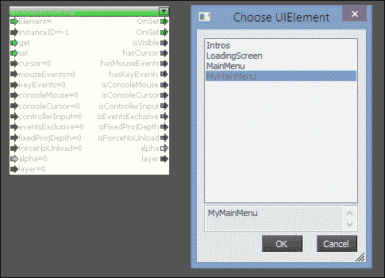
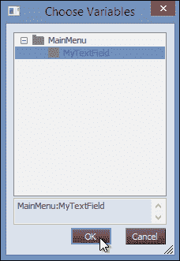
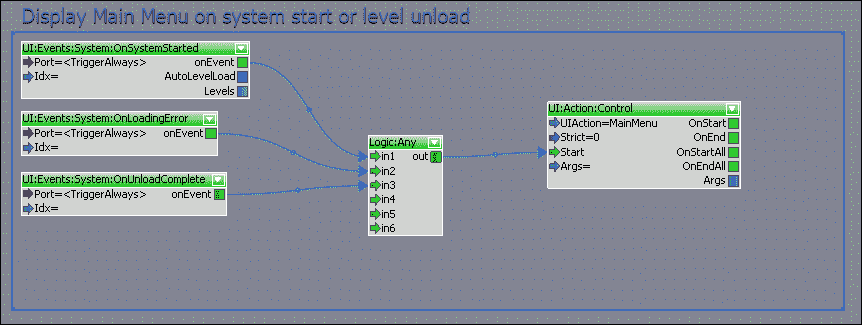
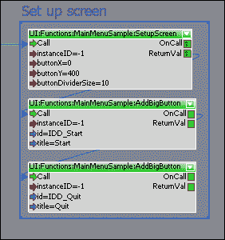
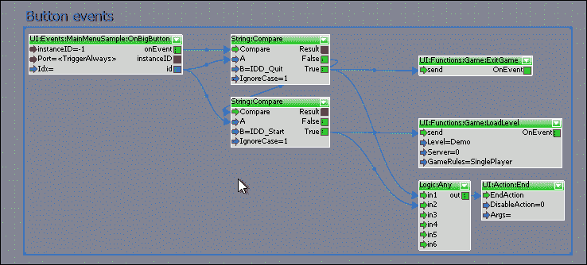
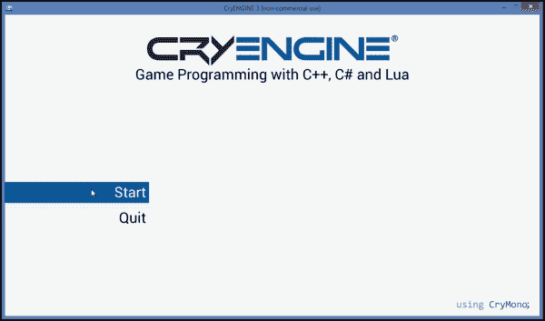

# 第七章：用户界面

CryENGINE 集成了 Scaleform GFx，允许呈现基于 Adobe Flash 的用户界面、HUD 和动画纹理。通过在运行时使用 UI 流程图解决方案将 UI 元素直观地连接在一起，开发人员可以迅速创建和扩展用户界面。

在本章中，我们将涵盖以下主题：

+   了解 CryENGINE Scaleform 实现及其带来的好处。

+   创建我们的主菜单。

+   实施 UI 游戏事件系统

# Flash 电影剪辑和 UI 图形

为了为开发人员提供创建用户界面的解决方案，CryENGINE 集成了 Adobe Scaleform GFx，这是一个用于游戏引擎的实时 Flash 渲染器。该系统允许在 Adobe Flash 中创建用户界面，然后可以导出以立即在引擎中使用。

### 注意

还可以在材质中使用 Flash `.swf`文件，从而在游戏世界中的 3D 对象上呈现 Flash 电影剪辑。

通过 UI 流程图系统，创建模块化动态用户界面所需的工作大大简化。

UI 流程图系统基于两种类型的概念：**元素**和**动作**。每个元素代表一个 Flash 文件（`.swf`或`.gfx`），而每个动作是一个表示 UI 状态的流程图。

## 元素

UI 元素通过`Game/Libs/UI/UIElements/`中的 XML 文件进行配置，并表示每个 Flash 文件。通过修改 UI 元素的配置，我们可以更改它接收的事件和对齐模式，以及公开导出的 SWF 文件中存在的不同函数和回调。

### XML 分解

元素的最低要求可以在以下代码中看到：

```cs
<UIElements name="Menus">
  <UIElement name="MyMainMenu" mouseevents="1" keyevents="1" cursor="1" controller_input="1">

    <GFx file="Menus_Startmenu.swf" layer="3">
      <Constraints>
        <Align mode="fullscreen" scale="1"/>
      </Constraints>
    </GFx>

    <functions>
    </functions>

    <events>
    </events>
    <Arrays>
    </Arrays>

    <MovieClips>
    </MovieClips>
  </UIElement>
</UIElements>
```

前面的 XML 代码可以保存为`Game/Libs/UI/UIElements/MyMainMenu.xml`，并将 Flash 文件`Menus_Startmenu.swf`加载到`Game/Libs/UI/`文件夹中。

创建完成后，我们将能够通过流程图节点选择我们的新 UI 元素，例如**UI:Display:Config**（用于重新配置任何元素，例如在运行时启用元素的鼠标事件）。



既然我们知道它是如何工作的，让我们来详细了解一下：

```cs
<UIElements name="Menus">
```

这第一个元素定义了文件的开始，并确定了我们的元素应该放在哪个类别中。

```cs
<UIElement name="MyMainMenu" mouseevents="1" keyevents="1" cursor="1" controller_input="1">
```

`UIElement` XML 元素用于决定初始配置，包括默认名称，并确定默认应接收哪些事件。

如前所述，每个元素都可以通过一组属性进行配置，允许开发人员定义要监听的事件类型：

| 属性名称 | 描述 |
| --- | --- |
| `name` | 定义元素的名称（字符串）。 |
| `mouseevents` | 确定是否将鼠标事件发送到 Flash 文件（0/1）。 |
| `cursor` | 确定在元素可见时是否显示光标（0/1）。 |
| `keyevents` | 确定是否将键事件发送到 Flash 文件（0/1）。 |
| `console_mouse` | 确定在控制台硬件上拇指杆是否应该作为光标（0/1）。 |
| `console_cursor` | 确定在控制台硬件上运行时是否显示光标（0/1）。 |
| `layer` | 定义元素显示顺序，以防多个元素存在。 |
| `alpha` | 设置元素的背景透明度（0-1）。允许在游戏中使用透明度，例如在主菜单后显示游戏关卡。 |

### 注意

请注意，先前提到的属性可以通过使用**UI:Display:Config**节点实时调整。

```cs
<GFx file="Menus_Startmenu.swf" layer="3">
```

`GFx`元素确定应加载哪个 Flash 文件用于该元素。可以加载多个 GFx 文件并将它们放入不同的层。

这允许在运行时选择要使用的元素层，例如，通过**UI:Display:Config**节点上的`layer`输入，如前面截图所示。

```cs
<Constraints>
  <Align mode="fullscreen" scale="1"/>
</Constraints>
```

`Constraints`允许配置 GFx 元素在屏幕上的显示方式，使开发人员能够调整元素在不同显示分辨率下的表现方式。

目前有三种模式如下：

| 模式名称 | 描述 | 附加属性 |
| --- | --- | --- |
| 固定 | 在固定模式下，开发人员可以使用四个属性来设置距离顶部和左侧角的像素距离，以及设置所需的分辨率。 | 顶部、左侧、宽度和高度 |
| 动态 | 在动态模式下，元素根据锚点对齐，允许水平和垂直对齐。halign 可以设置为`left`、`center`或`right`，而 valign 可以设置为`top`、`center`或`bottom`。如果比例设置为`1`，元素将按比例缩放到屏幕分辨率。如果最大设置为`1`，元素将被最大化，以确保覆盖屏幕的 100%。 | halign、valign、比例和最大 |
| 全屏 | 在此模式下激活时，元素视口将与渲染视口完全相同。如果比例设置为`1`，元素将被拉伸到屏幕分辨率。 | 比例 |

## 动作

UI 动作是 UI 流程图实现的核心。每个动作都由一个流程图表示，并定义了一个 UI 状态。例如，主菜单中的每个屏幕都将使用单独的动作来处理。

所有可用的 UI 动作都可以在**流程图**工具箱中看到，在流程图编辑器中。


要创建新的 UI 动作，导航到**文件** | **新 UI 动作**，并在新打开的**另存为**对话框中指定您的新动作的名称： 


通过使用**UI:Action:Control**节点启动动作，并在**UIAction**输入端口中指定待处理动作的名称，然后激活**Start**输入来启动动作。


一旦启动，具有指定名称的 UI 图将被激活，假设它包含一个如下所示的**UI:Action:Start**节点：


然后，图表可以通过监听**StartAction**输出端口来初始化请求的 UI。一旦动作完成，应该调用**UI:Action:End**，如下所示：


就是这样。UI 图表以 flowgraph XML 文件的形式保存在`Game/Libs/UI/UIActions/`中。初始 UI 动作称为**Sys_StateControl**，并且始终处于活动状态。状态控制器图应负责根据系统事件（如关卡加载）加载和启用菜单。

系统状态控制动作（`Sys_StateControl.xml`）始终处于活动状态，并且用于启动初始动作，例如在引擎启动时显示主菜单。

# 创建主菜单

现在我们对 UI 流程图实现有了基本的了解，让我们开始创建我们自己的主菜单吧。

## 创建菜单元素

我们需要做的第一件事是创建我们的 UI 元素定义，以便为引擎提供加载我们导出的 SWF 文件的手段。

为此，在`Game/Libs/UI/UIElements/`中创建一个名为`MainMenuSample.xml`的新 XML 文档。我们菜单所需的最低限度的代码可以在以下代码中看到：

```cs
<UIElements name="Menus">
  <UIElement name="MainMenuSample" mouseevents="1" keyevents="1" cursor="1" controller_input="1">
    <GFx file="MainMenuSample.swf" layer="3">
      <Constraints>
        <Align mode="dynamic" halign="left" valign="top" scale="1" max="1"/>
      </Constraints>
    </GFx>
  </UIElement>
</UIElements>
```

有了上面的代码，引擎就会知道在哪里加载我们的 SWF 文件，以及如何在屏幕上对齐它。

### 注意

SWF 文件可以通过使用`GFxExport.exe`（通常位于`<root>/Tools/`目录中）重新导出，以便在引擎中更高效地使用。这通常是在发布游戏之前完成的。

## 暴露 ActionScript 资产

接下来，我们需要暴露我们在 Flash 源文件中定义的函数和事件，以便允许引擎调用和接收这些函数和事件。

在暴露函数和事件时，我们创建了简单的流程图节点，可以被任何流程图使用。

创建后，函数节点可以通过导航到**UI** | **函数**来访问，如下面的截图所示：


通过导航到**UI** | **Events**，可以找到事件。

### 注意

还可以在 C++中创建 UI 操作和元素，有效地使用户界面能够从本机代码发送和接收事件。我们将在本章后面的*创建 UI 游戏事件系统*部分中介绍这一点。

### 函数

要公开一个方法，我们需要像以下代码中所示，在`UIElement`定义中添加一个新的`<functions>`部分：

```cs
<functions>
  <function name="SetupScreen" funcname="setupScreen" desc="Sets up screen, clearing previous movieclips and configuring settings">
    <param name="buttonX" desc="Initial x pos of buttons" type="int" />
    <param name="buttonY" desc="Initial y pos of buttons" type="int" />
    <param name="buttonDividerSize" desc="Size of the space between buttons" type="int" />
  </function>

  <function name="AddBigButton" funcname="addBigButton" desc="Adds a primary button to the screen">
    <param name="id" desc="Button Id, sent with the onBigButton event" type="string" />
    <param name="title" desc="Button text" type="string" />
  </function>
</functions>
```

使用上述代码，引擎将创建两个节点，我们可以利用这些节点来调用 UI 图表中的`setupScreen`和`addBigButton` ActionScript 方法。

### 注意

函数始终放置在相同的 flowgraph 类别中：**UI:Functions:ElementName:FunctionName**


当触发前一个截图中显示的任一节点上的**Call**端口时，将调用 ActionScript 方法并使用指定的参数。

### 注意

**instanceID**输入端口确定要在哪个元素实例上调用函数。如果值设置为`-1`（默认值），则将在所有实例上调用，否则如果设置为`-2`，则将在所有初始化的实例上调用。

### 事件

设置事件的方式与函数类似，使用`<events>`标签如下：

```cs
<events>
  <event name="OnBigButton" fscommand="onBigButton" desc="Triggered when a big button is pressed">    
    <param name="id" desc="Id of the button" type="string" />
  </event>
</events>
```

上述代码将使引擎创建**OnBigButton**节点可用，当 Flash 文件调用`onBigButton` fscommand 时触发，同时会有相关的按钮 ID。


从 Flash 中调用`fscommand`相对容易。以下代码将触发`onBigButton`事件，并附带相关的按钮 ID 字符串。

```cs
fscommand("onBigButton", buttonId);
```

### 注意

与函数类似，事件始终放置在**UI:Events:ElementName:EventName**中。

### 变量

还可以通过元素定义定义访问 Flash 源文件中存在的变量。这允许通过使用**UI:Variable:Var**节点获取和设置变量的值。

首先，在元素定义的`<variables>`块中定义数组：

```cs
<variables>
  <variable name="MyTextField" varname="_root.m_myTextField.text"/>
</variables>
```

重新启动编辑器后，放置一个新的**UI:Variable:Var**节点，并按照以下截图中所示浏览您的新变量：



然后我们可以通过 flowgraph 随时设置或获取我们的变量的值：


### 数组

在上一节中，我们在运行时设置了 Flash 变量的值。通过使用**UI:Variable:Array**节点，也可以对数组进行相同操作。

首先，按照以下方式公开元素`<arrays>`块中的数组：

```cs
<arrays>
  <array name="MyArray" varname="_root.m_myArray"/>
</arrays>
```

然后简单地重新启动数组并重复之前的过程，但使用**UI:Variable:Array**节点。要通过 UI 图表创建新数组，请使用**UI:Util:ToArray**节点：


## 将 MovieClip 实例公开给 flowgraph

与变量可以公开类似，也可以通过 UI 图表直接访问 MovieClips。这允许跳转到特定帧，更改属性等。

所有允许 MovieClip 交互的节点都可以在 Flowgraph 编辑器中的**UI** | **MovieClip**中找到，如下截图所示：


首先，按照以下方式添加或编辑元素定义中的`<movieclips>`块：

```cs
<movieclips>
  <movieclip name="MyMovieClip" instancename="_root.m_myMovieclip"/>
</movieclips>
```

这将使 flowgraph 可以访问 Flash 文件中存在的**m_myMovieClip** MovieClip。

编辑器重新启动后，我们可以使用**UI:MovieClip:GotoAndPlay**节点，例如直接跳转到指定剪辑中的不同帧，如下截图所示：


## 创建 UI 操作

现在我们已经配置了主菜单元素，是时候创建 UI 操作，使菜单出现在启动器应用程序中了。

### 创建状态控制图

首先打开 Sandbox 和 Flowgraph Editor。一旦打开，通过导航到**文件**|**新建 UI 动作**来创建一个新的 UI 动作。将动作命名为**Sys_StateControl**。这将是我们触发初始菜单和处理关键系统事件的主要 UI 动作。

创建动作后，我们将使用以下三个系统事件：

+   OnSystemStarted

+   OnLoadingError

+   OnUnloadComplete

这些事件一起表示我们的主菜单应该何时出现。我们将把它们绑定到一个**UI:Action:Control**节点中，该节点将激活我们稍后将创建的 MainMenu UIAction。



### 创建 MainMenu 动作

完成后，创建另一个 UI 动作，并命名为**MainMenu**。一旦打开，放置一个**UI:Action:Start**节点。当我们之前创建的**UI:Action:Control**节点被执行时，它的**StartAction**输出端口将自动激活。

现在我们可以将**Start**节点连接到**UI:Display:Display**和**UI:Display:Config**节点，以初始化主菜单，并确保用户可以看到它。


我们的 flash 文件现在将在游戏启动时显示，但目前还缺少来自 flowgraph 的任何额外配置。

### 添加按钮

现在我们的主菜单文件已初始化，我们需要在 Flash 文件中添加一些 ActionScript 代码，以允许从 UI 图中动态生成和处理按钮。

本节假定您有一个 MovieClip 可以在运行时实例化。在我们的示例中，我们将使用一个名为**BigButton**的自定义按钮。


### 注意

我们的主菜单的 Flash 源文件（.fla）位于我们示例安装的`Game/Libs/UI/`文件夹中，可从[`github`](https://github) [.com/inkdev/CryENGINE-Game-Programming-Sample/](http://.com/inkdev/CryENGINE-Game-Programming-Sample/)下载。

本节还假定您有两个 ActionScript 函数：`SetupScreen`和`AddBigButton`。

`SetupScreen`应该配置场景的默认设置，并删除所有先前生成的对象。在我们的情况下，我们希望使用`AddBigButton`生成的按钮在调用`SetupScreen`时被移除。

`AddBigButton`应该只是一个生成预先创建的按钮实例的函数，如下所示：

```cs
var button = _root.attachMovie("BigButton", "BigButton" + m_buttons.length, _root.getNextHighestDepth());
```

当单击按钮时，它应该调用一个事件，我们在 flowgraph 中捕获：

```cs
fscommand("onBigButton", button._id);
```

有关创建功能和事件的信息，请参阅前面讨论的*公开 ActionScript 资产*部分。

完成后，将节点添加到 MainMenu 动作中，并在配置元素后调用它们：



我们的主菜单现在应该在启动启动器应用程序时出现，但是对于用户与之交互没有任何反馈。

为了解决这个问题，我们可以利用前面在本章中公开的 OnBigButton 节点。该节点将在按钮被点击时发送事件，以及一个字符串标识符，我们可以用来确定点击了哪个节点：



在前面的图中，我们拦截按钮事件，并使用**String:Compare**节点来检查我们需要对输入做什么。如果点击了**IDD_Quit**按钮，我们退出游戏，如果点击了**IDD_Start**节点，我们加载**Demo**关卡。

## 最终结果

假设您没有创建自己的菜单设计，现在启动启动器时应该看到以下截图：



现在您已经学会了创建一个简单菜单有多么容易，为什么不继续创建一个在玩家生成时显示的**HUD**（**Heads-Up Display**）呢？

# 引擎 ActionScript 回调

引擎会自动调用一些 ActionScript 回调。只需在 Flash 源文件根目录中定义这些函数，引擎就能够调用它们。

+   `cry_onSetup(isConsole:Boolean)`: 当 SWF 文件被引擎初始加载时调用此函数。

+   `cry_onShow()`: 当 SWF 文件显示时调用此函数。

+   `cry_onHide()`: 当 SWF 文件隐藏时调用此函数。

+   `cry_onResize(_iWidth:Number, _iHeight:Number)`: 当游戏分辨率更改时调用此函数。

+   `cry_onBack()`: 当用户按下返回按钮时调用此函数。

+   `cry_requestHide()`: 当元素隐藏时调用此函数。

# 创建 UI 游戏事件系统

UI 系统利用`IUIGameEventSystem`接口与流程图进行通信，允许以与公开 ActionScript 资源相同的方式定义自定义函数和事件。

这用于允许用户界面访问游戏和引擎功能，例如获取可玩关卡列表。每个游戏事件系统都指定其类别，然后在流程图编辑器中用于定义注册的函数和事件的类别。

例如，如果我们使用`IFlashUI::CreateEventSystem`创建名为 MyUI 的事件系统，可以通过导航到**UI** | **Functions** | **MyUI**找到所有函数。

## 实现`IUIGameEventSystem`

实现`IUIGameEventSystem`不需要太多工作；我们只需要分配以下三个纯虚函数：

+   `GetTypeName`: 不直接重写；而是使用`UIEVENTSYSTEM`宏。

+   `InitEventSystem`: 调用此函数初始化事件系统。

+   `UnloadEventSystem`: 调用此函数卸载事件系统。

因此，最低要求如下（以下文件保存为`MyUIGameEventSystem.h`）：

```cs
class CMyUIGameEventSystem
  : public IUIGameEventSystem
{
public:
  CMyUIGameEventSystem() {}

  // IUIGameEventSystem
  UIEVENTSYSTEM("MyUIGameEvents");
  virtual void InitEventSystem() {}
  virtual void UnloadEventSystem() {}
  // ~IUIGameEventSystem
};
```

现在我们已经解析了类定义，可以继续进行代码本身。首先创建一个名为`MyUIGameEventSystem.cpp`的新文件。

创建此文件后，使用`REGISTER_UI_EVENTSYSTEM`宏注册事件系统。这用于从`CUIManager`类内部自动创建您的类的实例。

将宏放在 CPP 文件的底部，超出方法范围，如下所示：

```cs
REGISTER_UI_EVENTSYSTEM(CMyUIGameEventSystem);
```

### 注意

请注意，`REGISTER_UI_EVENTSYSTEM`宏仅在 CryGame 项目中有效。

我们的事件系统现在应该编译，并将与 CryGame 中包含的其他事件系统一起创建。

我们的事件系统目前没有任何功能。阅读以下部分以了解如何将函数和事件公开给 UI 流程图。

## 接收事件

事件系统可以公开与我们通过主菜单元素注册的节点相同方式工作的函数。通过公开函数，我们可以允许图形与我们的游戏交互，例如请求玩家健康状况。

首先，我们需要向`CMyUIGameEventSystem`类添加两个新成员：

```cs
SUIEventReceiverDispatcher<CMyUIGameEventSystem> m_eventReceiver;
IUIEventSystem *m_pUIFunctions;
```

事件分发器将负责在流程图中触发其节点时调用函数。

要开始创建函数，请将以下代码添加到类声明中：

```cs
void OnMyUIFunction(int intParameter) 
{
  // Log indicating whether the call was successful
  CryLogAlways("OnMyUIFunction %i", intParameter);
}
```

要注册我们的函数，请在`InitEventSystem`函数中添加以下代码：

```cs
// Create and register the incoming event system
m_pUIFunctions = gEnv->pFlashUI->CreateEventSystem("MyUI", IUIEventSystem::eEST_UI_TO_SYSTEM);
m_eventReceiver.Init(m_pUIFunctions, this, "MyUIGameEvents");

// Register our function
{
  SUIEventDesc eventDesc("MyUIFunction", "description");

  eventDesc.AddParam<SUIParameterDesc::eUIPT_Int>("IntInput", "parameter description");

  m_eventReceiver.RegisterEvent(eventDesc, &CMyUIGameEventSystem::OnMyUIFunction);
}
```

重新编译并重新启动 Sandbox 后，您现在应该能够在流程图编辑器中看到您的节点。


## 分派事件

能够向 UI 图形公开事件非常有用，允许您处理基于事件的 UI 逻辑，例如在用户请求时显示记分牌。

首先，让我们向您的类添加以下代码：

```cs
enum EUIEvent
{
	eUIE_MyUIEvent
};

SUIEventSenderDispatcher<EUIEvent> m_eventSender;
IUIEventSystem *m_pUIEvents;
```

`EUIEvent`枚举包含我们要注册的各种事件，并且作为事件发送方知道您要发送到 UI 系统的事件的一种方式。

现在我们需要在`InitEventSystem`函数中添加一些代码来公开我们的事件，如下所示：

```cs
// Create and register the outgoing event system
m_pUIEvents = gEnv->pFlashUI->CreateEventSystem("MyUI", IUIEventSystem::eEST_SYSTEM_TO_UI);

m_eventSender.Init(m_pUIEvents);

// Register our event
{
	SUIEventDesc eventDesc("OnMyUIEvent", "description");
	eventDesc.AddParam<SUIParameterDesc::eUIPT_String>("String", "String output description");
	m_eventSender.RegisterEvent<eUIE_MyUIEvent>(eventDesc);
}
```

成功重新编译后，**OnMyUIEvent**节点现在应该出现在编辑器中：


### 分派事件

要分派您的 UI 事件，请使用`SUIEventSenderDispatcher::SendEvent`：

```cs
m_eventSender.SendEvent<eUIE_MyUIEvent>("MyStringParam");
```

# 摘要

在本章中，我们学习了在 CryENGINE 中创建用户界面，并利用这些知识创建了自己的主菜单。

您现在已经掌握了实现自己的 UI 和 UI 事件系统所需的基本知识。

如果您更喜欢在进入下一章之前更多地与用户界面一起工作，为什么不扩展我们之前创建的主菜单呢？一个很好的起点可能是实现一个关卡选择屏幕。

在下一章中，我们将介绍创建网络游戏的过程，以实现多人游戏功能。
