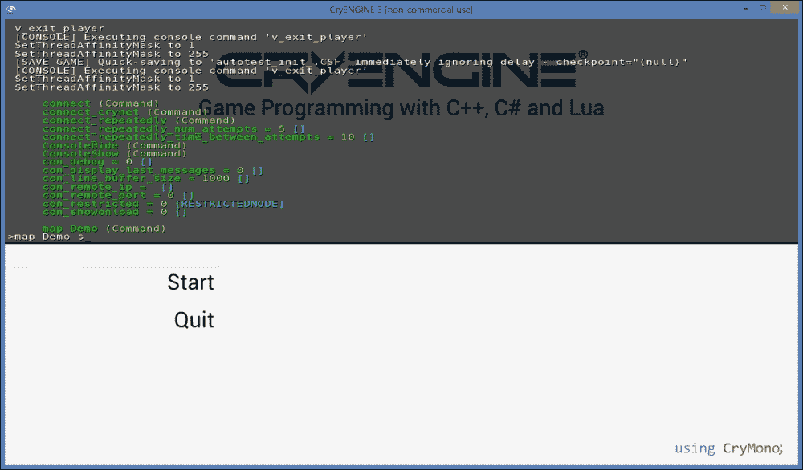

# 第八章：多人游戏和网络

使用 CryENGINE 网络系统，我们可以从单人游戏转移到创建具有大量人类玩家的生动世界。

在本章中，我们将：

+   学习网络系统的基础知识

+   利用远程方法调用（RMIs）

+   使用方面在网络上序列化流动数据

# 网络系统

CryENGINE 的网络实现是一种灵活的设置，用于与游戏服务器和其他客户端通信。

所有网络消息都是从**独立的网络线程**发送的，以避免网络更新受游戏帧速率的影响。

## 网络标识符

在本地，每个实体都由实体标识符（`entityId`）表示。然而，在网络环境中，将它们传输到网络上是不可行的，因为不能保证它们指向远程客户端或服务器上的相同实体。

为了解决这个问题，每个游戏对象都被分配了一个由`SNetObjectID`结构表示的网络对象标识符，其中包含标识符及其盐的简单包装器。

在编写游戏代码时，将实体和实体 ID 序列化到网络上时，我们不必直接处理`SNetObjectID`结构，因为将`entityId`转换为`SNetObjectID`（并在远程机器上再转换为`entityId`）的过程是自动的。

要确保您的实体 ID 映射到远程机器上的相同实体，请在序列化时使用`eid`压缩策略。在本章后面的*压缩策略*部分中，了解有关策略以及如何使用它们的更多信息。

## 网络通道

CryENGINE 提供了`INetChannel`接口来表示两台机器之间的持续连接。例如，如果客户端 A 和客户端 B 需要相互通信，则在两台机器上都会创建一个网络通道来管理发送和接收的消息。

通过使用通道标识符来引用每个通道，通常可以确定哪个客户端属于哪台机器。例如，要检索连接到特定通道上的玩家角色，我们使用`IActorSystem::GetActorByChannelId`。

### 网络 nubs

所有网络通道都由`INetNub`接口处理，该接口由一个或多个用于基于数据包的通信的端口组成。

# 设置多人游戏

要设置多人游戏，我们需要两台运行相同版本游戏的计算机。

## 启动服务器

有两种方法可以创建远程客户端可以连接的服务器。如下所述：

### 专用服务器

专用服务器存在的目的是有一个不渲染或播放音频的客户端，以便完全专注于支持没有本地客户端的服务器。

要启动专用服务器，请执行以下步骤：

1.  启动`Bin32/DedicatedServer.exe`。

1.  输入`map`，然后输入要加载的级别名称，然后按*Enter*。

### 启动器

还可以通过启动器启动服务器，从而允许您与朋友一起玩而无需启动单独的服务器应用程序。

要通过启动器启动服务器，请按照以下步骤操作：

1.  启动您的启动器应用程序。

1.  打开控制台。

1.  输入`map <level name> s`。

### 注意

在`map`命令后添加`s`将告诉 CryENGINE 以服务器的多人游戏上下文加载级别。省略`s`仍将加载级别，但在单人状态下加载。



## 通过控制台连接到服务器

要使用控制台连接到服务器，请使用`connect`命令：

+   `connect <ip> <port>`

### 注意

默认连接端口是 64089。

还可以通过`cl_serveraddr`控制台变量设置 IP 地址，通过`cl_serverport`设置端口，然后简单地调用`connect`。

### 注意

请记住，您可以同时运行多个启动器，这在调试多人游戏时非常有用。

## 调试网络游戏

在调试网络游戏时非常有用的一个控制台变量是`netlog 1`，这将导致网络系统在控制台中记录更多关于网络问题和事件的信息。

# 使用游戏对象扩展进行网络连接

游戏对象有两种通过网络进行通信的方法：RMIs 和通过`Aspects`进行网络序列化。基本上，RMIs 允许基于事件的数据传输，而 Aspect 则在数据失效时连续同步数据。

在能够通过网络通信之前，每个游戏对象都必须使用`IGameObject::BindToNetwork`函数绑定到网络。这可以通过`IGameObjectExtension`的`Init`实现来调用。

## 远程方法调用（RMI）

**远程方法调用**（**RMI**）用于在远程客户端或服务器上调用函数。这对于在网络上同步状态非常有用，例如，让所有客户端知道名为“Dude”的玩家刚刚生成，并且应该移动到特定位置和方向。

### RMI 结构

要声明 RMI，我们可以使用列出的宏：

+   `DECLARE_SERVER_RMI_NOATTACH`

+   `DECLARE_CLIENT_RMI_NOATTACH`

+   `DECLARE_SERVER_RMI_PREATTACH`

+   `DECLARE_CLIENT_RMI_PREATTACH`

+   `DECLARE_SERVER_RMI_POSTATTACH`

+   `DECLARE_CLIENT_RMI_POSTATTACH`

例如：

```cs
DECLARE_CLIENT_RMI_NOATTACH(ClMoveEntity, SMoveEntityParams, eNRT_ReliableUnordered);
```

### 注意

最后一个参数指定数据包的可靠性，但在最新版本的 CryENGINE 中已大部分被弃用。

在创建时要记住你正在暴露哪种类型的 RMI。例如，`DECLARE_CLIENT`仅用于将在远程客户端上调用的函数，而`DECLARE_SERVER`定义了将在服务器上调用的函数，在客户端请求后。

#### 参数

RMI 声明宏需要提供三个参数：

+   **函数名称**：这是确定方法名称的第一个参数，也是在声明函数和调用 RMI 本身时将使用的名称。

+   **RMI 参数**：RMI 必须指定一个包含将与方法一起序列化的所有成员的结构。该结构必须包含一个名为`SerializeWith`的函数，该函数接受一个`TSerialize`参数。

+   **数据包传递可靠性枚举**：这是定义数据包传递可靠性的最后一个参数。

我们刚刚看到的宏之间有三种不同之处：

#### 附加类型

附加类型定义了 RMI 在网络序列化期间何时附加：

+   `NOATTACH`：当 RMI 不依赖游戏对象数据时使用，因此可以在游戏对象数据序列化之前或之后附加。

+   `PREATTACH`：在此类型中，RMI 将在游戏对象数据序列化之前附加。当 RMI 需要准备接收的数据时使用。

+   `POSTATTACH`：在此类型中，RMI 在游戏对象数据序列化后附加。当新接收的数据与 RMI 相关时使用。

#### 服务器/客户端分离

从 RMI 声明宏中可以看出，RMI 不能同时针对客户端和服务器。

因此，我们要么决定哪个目标应该能够运行我们的函数，要么为每个目标创建一个宏。

这是一个非常有用的功能，当处理服务器授权的游戏环境时，由于可以持续区分可以在服务器和客户端上远程触发的函数。

#### 函数定义

要定义 RMI 函数，我们可以使用`IMPLEMENT_RMI`宏：

```cs
  IMPLEMENT_RMI(CGameRules, ClMoveEntity)
  {
  }
```

该宏定义了在调用 RMI 时调用的函数，具有两个参数：

+   `params`：这包含从远程机器发送的反序列化数据。

+   `pNetChannel`：这是一个`INetChannel`实例，描述了源和目标机器之间建立的连接。

### RMI 示例

为了演示如何创建基本的 RMI，我们将创建一个 RMI，允许客户端请求重新定位实体。这将导致服务器向所有客户端发送`ClMoveEntity` RMI，通知它们新实体的情况。

首先，我们需要打开我们的头文件。这是我们将定义 RMI 和我们的参数的地方。首先创建一个名为`SMoveEntityParams`的新结构。

然后我们将添加三个参数：

+   **EntityID entityId**：这是我们想要移动的实体的标识符

+   **Vec3 位置**：这确定了实体应该移动到哪个位置

+   **Quat 方向**：这用于在生成时设置实体的旋转

添加参数后，我们需要在`SMoveEntityParams`结构内定义`SerializeWith`函数。这将在发送数据到网络时调用，然后再次接收数据时调用。

```cs
  void SerializeWith(TSerialize ser)
  {
    ser.Value("entityId", entityId, 'eid');
    ser.Value("position", position, 'wrld');
    ser.Value("orientation", orientation, 'ori0');
  }
```

### 注意

`eid`压缩策略的使用需要特别注意，它确保`entityId`指向相同的实体。有关为什么需要该策略的更多信息，请参阅本章的*网络标识符*部分。

现在我们已经定义了我们的 RMI 参数，我们需要声明两个 RMI：一个用于客户端，一个用于服务器：

```cs
  DECLARE_SERVER_RMI_NOATTACH(SvRequestMoveEntity, SMoveEntityParams, eNRT_ReliableUnordered);

  DECLARE_CLIENT_RMI_NOATTACH(ClMoveEntity, SMoveEntityParams, eNRT_ReliableUnordered);
```

现在我们所要做的就是创建函数实现，我们可以在我们的 CPP 文件中使用`IMPLEMENT_RMI`宏来实现。

```cs
  IMPLEMENT_RMI(CGameRules, SvRequestMoveEntity)
  {
    IEntity *pEntity = gEnv->pEntitySystem->GetEntity(params.entityId);
    if(pEntity == nullptr)
      return true;

    pEntity->SetWorldTM(Matrix34::Create(Vec3(1, 1, 1), params.orientation, params.position));

    GetGameObject()->InvokeRMI(ClMoveEntity(), params, eRMI_ToAllClients | eRMI_NoLocalCalls);

    return true;
  }
```

这段代码定义了我们的`SvRequestMoveEntity`函数，当客户端执行以下操作时将调用该函数：

```cs
  GetGameObject()->InvokeRMI(SvRequestMoveEntity(), params, eRMI_Server);
```

尝试自己实现`ClMoveEntity`函数。它应该以与我们在`SvRequestMoveEntity`中所做的相同方式设置实体的世界变换(`IEntity::SetWorldTM`)。

## 网络方面序列化

游戏对象扩展可以实现`IGameObjectExtension::NetSerialize`函数，该函数用于在网络上序列化与扩展相关的数据。

### 方面

为了允许特定机制相关数据的分离，网络序列化过程公开了**方面**。当服务器或客户端将方面声明为“脏”（更改）时，网络将触发序列化并调用具体方面的`NetSerialize`函数。

要将您的方面标记为脏，请调用`IGameObject::ChangedNetworkState`：

```cs
  GetGameObject()->ChangedNetworkState(eEA_GameClientF);
```

这将触发`NetSerialize`来序列化您的方面，并将其数据发送到远程机器，然后在同一函数中对其进行反序列化。

### 注意

当方面的值与上次发送到远程客户端或服务器的值不同时，该方面被认为是“脏”。

例如，如果我们想序列化与玩家输入相关的一组标志，我们将创建一个新的方面，并在客户端的输入标志发生变化时将其标记为脏：

```cs
  bool CMyGameObjectExtension::NetSerialize(TSerialize ser, EEntityAspects aspect, uint8 profile, int flags)
  {
    switch(aspect)
    {
      case eEA_GameClientF:
        {
          ser.EnumValue("inputFlags", (EInputFlags &)m_inputFlags, EInputFlag_First, EInputFlag_Last);
        }
        break;
    }
  }
```

### 注意

`TSerialize::EnumValue`是`TSerialize::Value`的一种特殊形式，它计算枚举的最小值和最大值，有效地充当动态压缩策略。

`EnumValue`和压缩策略应尽可能使用，以减少带宽使用。

现在，当客户端上的`eEA_GameClientF`方面被标记为脏时，将调用`NetSerialize`函数，并将`m_inputFlags`变量值写入网络。

当数据到达远程客户端或服务器时，`NetSerialize`函数将再次被调用，但这次将值写入`m_inputFlags`变量，以便服务器知道客户端提供的新输入标志。

### 注意

方面不支持条件序列化，因此每个方面在每次运行时都必须序列化相同的变量。例如，如果在第一个方面序列化了四个浮点数，那么你将始终需要序列化四个浮点数。

仍然可以序列化复杂对象，例如，我们可以写入数组的长度，然后迭代读取/写入数组中包含的每个对象。

## 压缩策略

`TSerialize::Value`使能够传递一个额外的参数，即压缩策略。此策略用于确定在同步数据时可以使用哪些压缩机制来优化网络带宽。

压缩策略定义在`Scripts/Network/CompressionPolicy.xml`中。现有策略的示例如下：

+   `eid`：这用于在网络上序列化`entityId`标识符，并将游戏对象的`SNetObjectID`与远程客户端上的正确`entityId`进行比较。

+   `wrld`：这在序列化代表世界坐标的`Vec3`结构时使用。由于默认情况下被限制在 4095，这可能需要针对更大的级别进行调整。

+   `colr`：这用于在网络上序列化`ColorF`结构，允许浮点变量表示 0 到 1 之间的值。

+   `bool`：这是布尔值的特定实现，并且可以减少大量冗余数据。

+   `ori1`：这用于在网络上序列化`Quat`结构，用于玩家方向。

### 创建一个新的压缩策略

添加新的压缩策略就像修改`CompressionPolicy.xml`一样简单。例如，如果我们想要创建一个新的 Vec3 策略，其中 X 和 Y 轴只能达到 2048 米，而 Z 轴限制为 1024 米：

```cs
<Policy name="wrld2" impl="QuantizedVec3">
  <XParams min="0" max="2047.0" nbits="24"/>
  YParams min="0" max="2047.0" nbits="24"/>
  <ZParams min="0" max="1023.0" nbits="24"/>
</Policy>
```

# 将 Lua 实体暴露给网络

现在我们知道如何在 C++中处理网络通信，让我们看看如何将 Lua 实体暴露给网络。

## Net.Expose

为了定义 RMIs 和服务器属性，我们需要在`.lua`脚本的全局范围内调用`Net.Expose`：

```cs
Net.Expose({
  Class = MyEntity,
  ClientMethods = {
    ClRevive             = { RELIABLE_ORDERED, POST_ATTACH, ENTITYID, },
  },
  ServerMethods = {
    SvRequestRevive          = { RELIABLE_UNORDERED, POST_ATTACH, ENTITYID, },
  },
  ServerProperties = {
  },
});
```

前一个函数将定义`ClRevive`和`SvRequestRevive` RMIs，可以通过使用为实体自动创建的三个子表来调用：

+   `allClients`

+   `otherClients`

+   `server`

### 函数实现

远程函数定义在实体脚本的`Client`或`Server`子表中，以便网络系统可以快速找到它们，同时避免名称冲突。

例如，查看以下`SvRequestRevive`函数：

```cs
  function MyEntity.Server:SvRequestRevive(playerEntityId)
  end
```

### 调用 RMIs

在服务器上，我们可以触发`ClRevive`函数，以及我们之前定义的参数，对所有远程客户端进行触发。

#### 在服务器上

要在服务器上调用我们的`SvRequestRevive`函数，只需使用：

```cs
  self.server:SvRequestRevive(playerEntityId);
```

#### 在所有客户端

如果您希望所有客户端都收到`ClRevive`调用：

```cs
  self.allClients:ClRevive(playerEntityId);
```

#### 在所有其他客户端上

将`ClRevive`调用发送到除当前客户端之外的所有客户端：

```cs
  self.otherClients:ClRevive(playerEntityId);
```

## 将我们的实体绑定到网络

在能够发送和接收 RMI 之前，我们必须将我们的实体绑定到网络。这是通过为我们的实体创建一个游戏对象来完成的：

```cs
  CryAction.CreateGameObjectForEntity(self.id);
```

我们的实体现在将拥有一个功能性的游戏对象，但尚未设置为网络使用。要启用此功能，请调用`CryAction.BindGameObjectToNetwork`函数：

```cs
  CryAction.BindGameObjectToNetwork(self.id);
```

完成！我们的实体现在已绑定到网络，并且可以发送和接收 RMI。请注意，这应该在实体生成后立即进行。

# 总结

在本章中，我们已经学习了 CryENGINE 实例如何在网络上远程通信，并且还创建了我们自己的 RMI 函数。

现在您应该了解网络方面和压缩策略函数，并且对如何将实体暴露给网络有基本的了解。

如果您想在进入下一章之前继续进行多人游戏和网络游戏，为什么不创建一个基本的多人游戏示例，其中玩家可以向服务器发送生成请求，结果是玩家在所有远程客户端上生成？

在下一章中，我们将介绍物理系统以及如何利用它。
