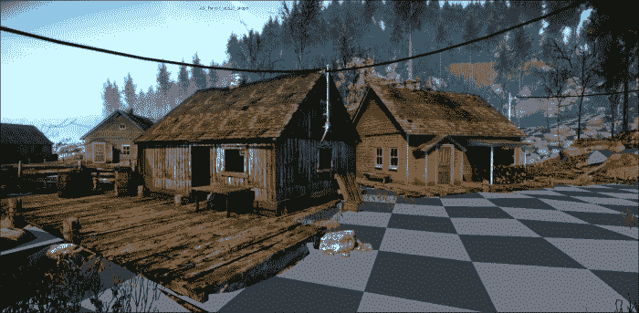

# 第九章：物理编程

CryENGINE 物理系统是一个可扩展的物理实现，允许创建真正动态的世界。开发人员将发现，在实现物理模拟时有很大的灵活性。

在本章中，我们将：

+   了解物理系统的工作原理

+   发现如何调试我们的物理化几何体

+   学习如何进行射线投射和相交基元，以发现接触点、地面法线等

+   创建我们自己的物理化实体

+   通过模拟爆炸使事物爆炸

# CryPhysics

物理实体系统围绕物理实体的概念而设计，可以通过`IPhysicalEntity`接口访问。物理实体代表具有物理代理的几何体，可以影响和受到交叉、碰撞和其他事件的影响。

虽然可以通过`IPhysicalWorld::CreatePhysicalEntity`函数创建没有基础实体（`IEntity`）的物理实体，但通常会调用`IEntity::Physicalize`以启用当前由实体加载的模型的物理代理。

### 注意

物理代理是渲染网格的简化模型。这用于减少物理系统的负担。

当调用`IEntity::Physicalize`时，将创建一个新的实体代理，通过调用`IPhysicalWorld::CreatePhysicalEntity`来处理其物理化表示。CryENGINE 允许创建多种物理实体类型，具体取决于物理化对象的目的。

## 物理化实体类型

以下是 CryENGINE 当前实现的物理化实体类型：

+   **PE_NONE**：当实体不应物理化时使用，或者当我们想要去物理化时传递给`IEntity::Physicalize`。在未物理化时，实体将没有物理代理，因此无法与其他对象进行物理交互。

+   **PE_STATIC**：这告诉物理系统利用实体的物理代理，但永远不允许通过物理交互移动或旋转它。

+   **PE_RIGID**：将刚体类型应用于对象，允许外部对象发生碰撞并移动目标。

+   **PE_WHEELEDVEHICLE**：用于车辆的专用类型。

+   **PE_LIVING**：用于生物演员，例如需要地面对齐和地面接触查询的人类。

+   **PE_PARTICLE**：这是基于`SEntityPhysicalizeParams`中传递的粒子进行物理化的，对于避免快速移动物体（如抛射物）的问题非常有用。

+   **PE_ARTICULATED**：用于由几个刚体通过关节连接的关节结构，例如布娃娃。

+   **PE_ROPE**：用于创建可以将两个物理实体绑在一起或自由悬挂的物理化绳索对象。也用于 Sandbox 绳索工具。

+   **PE_SOFT**：这是一组连接的顶点，可以与环境进行交互，例如布料。

## 引入物理实体标识符

所有物理实体都被分配唯一的标识符，可以通过`IPhysicalWorld::GetPhysicalEntityId`检索，并用于通过`IPhysicalWorld::GetPhysicalEntityById`获取物理实体。

### 注意

物理实体 ID 被序列化为一种将数据与特定物理实体关联的方式，因此在重新加载时应保持一致。

### 绘制实体代理

我们可以利用`p_draw_helpers` CVar 来获得关卡中各种物理化对象的视觉反馈。

要绘制所有物理化对象，只需将 CVar 设置为 1。


对于更复杂的用法，请使用`p_draw_helpers [Entity_Types]_[Helper_Types]`。

例如，要绘制地形代理几何：

```cs
  p_draw_helpers t_g
```



#### 实体类型

以下是实体类型的列表：

+   **t**：这显示地形

+   **s**：这显示静态实体

+   **r**：这显示休眠刚体

+   **R**：这显示活动刚体

+   **l**：这显示生物实体

+   **i**：这显示独立实体

+   **g**：这显示触发器

+   **a**：这显示区域

+   **y**：这显示`RayWorldIntersection`射线

+   **e**：这显示爆炸遮挡地图

#### 辅助类型

以下是辅助类型列表：

+   **g**：这显示几何体

+   **c**：这显示接触点

+   **b**：这显示边界框

+   **l**：这显示可破碎物体的四面体晶格

+   **j**：这显示结构关节（将在主几何体上强制半透明）

+   **t(#)**：这显示直到级别#的边界体积树

+   **f(#)**：这只显示设置了此位标志的几何体（多个 f 叠加）

# 物理实体动作、参数和状态

`IPhysicalEntity`接口提供了三种改变和获取实体物理状态的方法：

## 参数

物理实体参数确定几何体的物理表示应在世界中如何行为。可以通过`IPhysicalEntity::GetParams`函数检索参数，并通过使用`IPhysicalEntity::SetParams`设置。

所有参数都作为从`pe_params`派生的结构传递。例如，要修改实体受到的重力，我们可以使用`pe_simulation_params`：

```cs
  pe_simulation_params simParams;

  simParams.gravity = Vec3(0, 0, -9.81f);
  GetEntity()->GetPhysics()->SetParams(&simParams);
```

此代码将更改应用于实体的重力加速度为-9.81f。

### 注意

大多数物理实体参数结构的默认构造函数标记某些数据为未使用；这样我们就不必担心覆盖我们未设置的参数。

## 动作

与参数类似，动作允许开发人员强制执行某些物理事件，例如脉冲或重置实体速度。

所有动作都源自`pe_action`结构，并可以通过`IPhysicalEntity::Action`函数应用。

例如，要对我们的实体施加一个简单的冲量，将其发射到空中，请使用：

```cs
  pe_action_impulse impulseAction;
  impulseAction.impulse = Vec3(0, 0, 10);

  GetEntity()->GetPhysics()->Action(&impulseAction);
```

## 状态

还可以从实体获取各种状态数据，例如确定其质心位置或获取其速度。

所有状态都源自`pe_status`结构，并可以通过`IPhysicalEntity::GetStatus`函数检索。

例如，要获取玩家等生物实体的速度，请使用：

```cs
  pe_status_living livStat;
  GetEntity()->GetPhysics()->GetStatus(&livStat);

  Vec3 velocity = livStat.vel;
```

# 物理化实体类型详细信息

默认物理化实体实现有许多参数、动作和状态。我们列出了它们最常用的类型的一些选择：

## 常见参数

+   **pe_params_pos**：用于设置物理实体的位置和方向。

+   **pe_params_bbox**：这允许将实体的边界框强制为特定值，或在与`GetParams`一起使用时查询它，以及查询交集。

+   **pe_params_outer_entity**：这允许指定外部物理实体。如果在其边界框内发生碰撞，则将忽略与外部实体的碰撞。

+   **pe_simulation_params**：为兼容实体设置模拟参数。

## 常见动作

+   **pe_action_impulse**：这对实体施加一次性冲量。

+   **pe_action_add_constraint**：用于在两个物理实体之间添加约束。例如，可以使用忽略约束使幽灵穿过墙壁。

+   **pe_action_set_velocity**：用于强制物理实体的速度。

## 常见状态

+   **pe_status_pos**：请求实体或实体部分的当前变换

+   **pe_status_dynamics**：用于获取实体运动统计数据，如加速度、角加速度和速度

# 静态

将实体物理化为静态类型会创建基本物理化实体类型，从中派生所有扩展，如刚性或生物。

静态实体是物理化的，但不会移动。例如，如果将球扔向静态物体，它将在不移动目标物体的情况下反弹回来。

# 刚性

这指的是基本的物理实体，当受到外部力的影响时可以在世界中移动。

如果我们使用相同的先前示例，向刚性物体投掷球将导致刚性物体被推开

# 轮式车辆

这代表了一个轮式车辆，简单地说，实现是一个刚体，具有车轮、刹车和 CryENGINE 等车辆功能。

## 独特参数

+   **pe_params_car**：用于获取或设置特定于车辆的参数，例如 CryENGINE 功率、RPM 和齿轮数

+   **pe_params_wheel**：用于获取或设置车辆车轮的特定参数，例如摩擦、表面 ID 和阻尼

## 独特状态

+   **pe_status_vehicle**：用于获取车辆统计信息，允许获取速度、当前档位等

+   **pe_status_wheel**：获取特定车轮的状态，例如接触法线、扭矩和表面 ID

+   **pe_status_vehicle_abilities**：这允许检查特定转弯的最大可能速度

## 独特动作

+   **pe_action_drive**：用于车辆事件，如刹车、踏板和换挡。

# 生物

生物实体实现是处理演员及其移动请求的专门设置。

生物实体有两种状态：在地面上和在空中。在地面上，玩家将被“粘”在地面上，直到尝试将其与地面分离（通过施加远离地面的显著速度）。

### 注意

还记得来自第五章*创建自定义演员*的动画角色移动请求吗？该系统在核心中使用生物实体`pe_action_move`请求。

## 独特参数

+   **pe_player_dimensions**：用于设置与生物实体的静态属性相关的参数，例如 sizeCollider，以及是否应该使用胶囊或圆柱体作为碰撞几何体

+   **pe_player_dynamics**：用于设置与生物实体相关的动态参数，例如惯性、重力和质量

## 独特状态

+   **pe_status_living**：获取当前生物实体状态，包括飞行时间、速度和地面法线等统计信息

+   **pe_status_check_stance**：用于检查新尺寸是否引起碰撞。参数的含义与 pe_player_dimensions 中的相同

## 独特动作

+   **pe_action_move**：用于提交实体的移动请求。

# 粒子

还可以使用对象的粒子表示。这通常用于应该以高速移动的对象，例如抛射物。基本上，这意味着我们实体的物理表示只是一个二维平面。

## 独特参数

+   **pe_params_particle**：用于设置特定于粒子的参数

# 关节

关节结构由几个刚体通过关节连接而成，例如布娃娃。这种方法允许设置撕裂限制等。

## 独特参数

+   **pe_params_joint**：用于在设置时在两个刚体之间创建关节，并在与`GetParams`一起使用时查询现有关节。

+   **pe_params_articulated_body**：用于设置特定于关节类型的参数。

# 绳索

当您想要创建将多个物理化对象绑在一起的绳索时，应该使用绳索。该系统允许绳索附着到动态或静态表面。

## 独特参数

+   **pe_params_rope**：用于更改或获取物理绳索参数

# 软

软是一种非刚性连接的顶点系统，可以与环境进行交互，例如布料物体。

## 独特参数

+   **pe_params_softbody**：用于配置物理软体

## 独特动作

+   **pe_action_attach_points**：用于将软实体的一些顶点附加到另一个物理实体

# 射线世界交叉

使用`IPhysicalWorld::RayWorldIntersection`函数，我们可以从世界的一个点向另一个点投射射线，以检测到特定对象的距离、表面类型、地面的法线等。

`RayWorldIntersection`很容易使用，我们可以证明它！首先，看一个射线投射的例子：

```cs
  ray_hit hit;

  Vec3 origin = pEntity->GetWorldPos();
  Vec3 dir = Vec3(0, 0, -1);

  int numHits = gEnv->pPhysicalWorld->RayWorldIntersection(origin, dir, ent_static | ent_terrain, rwi_stop_at_pierceable | rwi_colltype_any, &hit, 1);
  if(numHits > 0)
  {
    // Hit something!
  }
```

## ray_hit 结构

我们将`ray_hit hit`变量的引用传递给`RayWorldIntersection`，这是我们将能够检索有关射线命中的所有信息的地方。

### 常用的成员变量

+   **float dist**：这是从原点（在我们的例子中是实体的位置）到射线命中位置的距离。

+   **IPhysicalEntity *pCollider**：这是指向我们的射线碰撞的物理实体的指针。

+   **short surface_idx**：这是我们的射线碰撞的材料表面类型的表面标识符（请参见`IMaterialManager::GetSurfaceType`以获取其`ISurfaceType`指针）。

+   **Vec3 pt**：这是接触点的世界坐标。

+   **Vec3 n**：这是接触点的表面法线。

+   **ray_hit *next**：如果我们的射线多次命中，这将指向下一个`ray_hit`结构。有关更多信息，请参阅*允许多次射线命中*部分。

## 起点和方向

`RayWorldIntersection`函数的第一个和第二个参数定义了射线应该从哪里投射，以及在特定方向上的距离。

在我们的例子中，我们从实体的当前位置向下移动一个单位来发射射线。

## 对象类型和射线标志

请注意，在`dir`之后，我们向`RayWorldIntersection`函数传递了两种类型的标志。这些标志指示射线应该如何与对象相交，以及要忽略哪些碰撞。

### 对象类型

对象类型参数需要基于`entity_query_flags`枚举的标志，并用于确定我们希望允许射线与哪种类型的对象发生碰撞。如果射线与我们未定义的对象类型发生碰撞，它将简单地忽略并穿过。

+   **ent_static**：这指的是静态对象

+   **ent_sleeping_rigid**：这表示睡眠刚体

+   **ent_rigid**：这表示活动刚体

+   **ent_living**：这指的是生物体，例如玩家

+   **ent_independent**：这表示独立对象

+   **ent_terrain**：这表示地形

+   **ent_all**：这指的是所有类型的对象

### 射线标志

射线标志参数基于`rwi_flags`枚举，并用于确定投射应该如何行为。

## 允许多次射线命中

正如前面提到的，也可以允许射线多次命中对象。为此，我们只需创建一个`ray_hit`数组，并将其与命中次数一起传递给`RayWorldIntersection`函数：

```cs
  const int maxHits = 10;

  ray_hit rayHits[maxHits];
  int numHits = gEnv->pPhysicalWorld->RayWorldIntersection(origin, direction, ent_all, rwi_stop_at_pierceable, rayHits, maxHits);

  for(int i = 0; i < numHits; i++)
  {
    ray_hit *pRayHit = &rayHits[i];

// Process ray
  }
```

# 创建一个物理实体

现在我们知道了物理系统是如何工作的，我们可以创建自己的物理实体，可以与场景中的其他物理几何体发生碰撞：

### 注意

本节假设您已阅读了第三章，*创建和使用自定义实体*。

## 在 C++

根据我们之前学到的，我们知道可以通过`PE_STATIC`类型来使静态实体物理化：

```cs
  SEntityPhysicalizeParams physicalizeParams;
  physicalizeParams.type = PE_STATIC;

  pEntity->Physicalize(physicalizeParams);
```

假设在调用`IEntity::Physicalize`之前已为实体加载了几何体，现在其他物理化的对象将能够与我们的实体发生碰撞。

但是如果我们想要允许碰撞来移动我们的物体呢？这就是`PE_RIGID`类型发挥作用的地方：

```cs
  SEntityPhysicalizeParams physicalizeParams;
  physicalizeParams.type = PE_RIGID;
  physicalizeParams.mass = 10;

  pEntity->Physicalize(physicalizeParams);
```

现在，CryENGINE 将知道我们的对象重 10 千克，并且在与另一个物理化实体发生碰撞时将被移动。

## 在 C#

我们还可以在 C#中使用`EntityBase.Physicalize`函数以及`PhysicalizationParams`结构来做到这一点。例如，如果我们想要给一个静态对象添加物理属性，我们可以使用以下代码：

```cs
  var physType = PhysicalizationType.Static;
  var physParams = new PhysicalizationParams(physType);

  Physicalize(physParams);
```

当然，这假设通过`EntityBase.LoadObject`方法加载了一个对象。

现在，如果我们想要创建一个刚性实体，我们可以使用：

```cs
  var physType = PhysicalizationType.Rigid;

  var physParams = new PhysicalizationParams(physType);
  physParams.mass = 50;

  Physicalize(physParams);
```

我们的实体现在重 50 公斤，当与其他物理化的物体发生碰撞时可以移动。

# 模拟爆炸

我们知道你在想，“如果我们不能炸毁东西，所有这些物理知识有什么用？”，我们已经为你准备好了！

物理世界实现提供了一个简单的函数，用于在世界中模拟爆炸，具有广泛的参数范围，允许自定义爆炸区域。

为了演示，我们将创建一个最大半径为 100 的爆炸：

```cs
  pe_explosion explosion;
  explosion.rmax = 100;

  gEnv->pPhysicalWorld->SimulateExplosion(&explosion);
```

### 注意

`SimulateExplosion`函数仅仅模拟爆炸并产生一个推动实体远离的力，不会产生任何粒子效果。

# 总结

在本章中，我们已经学习了物理世界实现的基本工作原理，以及如何在视觉上调试物理代理。

有了你的新知识，你应该知道如何使用射线世界交叉点来收集关于周围游戏世界的信息。哦，我们已经炸毁了一些东西。

如果你觉得还不准备好继续前进，为什么不创建一个扩展的物理实体或物理修改器，比如重力枪或蹦床呢？

在下一章中，我们将涵盖渲染管线，包括如何编写自定义着色器，以及如何在运行时修改材质。
