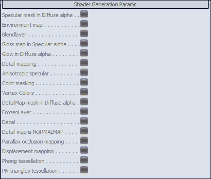
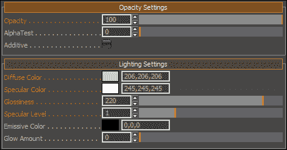
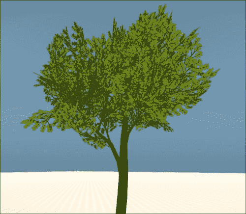
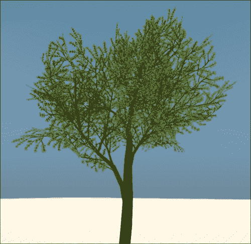

# 第十章：渲染编程

CryENGINE 渲染器很可能是引擎中最著名的部分，为 PC、Xbox 360 和 PlayStation 3 等平台提供高度复杂的图形功能和出色的性能。

在本章中，我们将涵盖以下主题：

+   学习渲染器的基本工作原理

+   了解每一帧如何渲染到世界中

+   学习着色器编写的基础知识

+   学习如何在运行时修改静态对象

+   在运行时修改材质

# 渲染器细节

CryENGINE 渲染器是一个模块化系统，允许绘制复杂的场景，处理着色器等。

为了方便不同的平台架构，CryENGINE 存在多个渲染器，都实现了**IRenderer**接口。我们列出了一些选择，如下所示：

+   DirectX：用于 Windows 和 Xbox

+   PSGL：用于 PlayStation 3

很可能也正在开发**OpenGL**渲染器，用于 Linux 和 Mac OS X 等平台。

## 着色器

CryENGINE 中的着色器是使用基于 HLSL 的专门语言 CryFX 编写的。该系统与 HLSL 非常相似，但专门用于核心引擎功能，如材质和着色器参数，`#include`宏等。

### 注意

请注意，本书撰写时，Free SDK 中未启用着色器编写；但这在未来可能会改变。

### 着色器排列组合

每当材质改变着色器生成参数时，基本着色器的一个排列组合将被创建。引擎还公开了将引擎变量暴露给着色器的功能，以便在运行时禁用或调整效果。

这是由于 CryFX 语言允许`#ifdef`、`#endif`和`#include`块，允许引擎在运行时剥离着色器代码的某些部分。



### 着色器缓存

由于在运行时编译着色器在所有平台上都不可行，CryENGINE 提供了着色器缓存系统。这允许存储一系列预编译的着色器，为最终用户的设备节省了相当多的工作。

### 注意

如前一节所述，着色器可以包含大量的变体。因此，在设置缓存时，有必要确保所有所需的排列组合都已经编译。

#### PAK 文件

渲染器可以从`Engine`文件夹加载四个`.pak`文件，包含着色器定义、源文件等。

| 存档名称 | 描述 |
| --- | --- |
| `Shaders.pak` | 包含着色器源文件和`.ext`（定义）文件。在使用预编译着色器缓存时，着色器源通常被排除在此存档之外。 |
| `ShadersBin.pak` | 包含着色器源代码的二进制解析信息。 |
| `ShaderCache.pak` | 包含所有已编译的着色器；仅在当前级别的着色器缓存中找不到着色器时使用。 |
| `ShaderCacheStartup.pak` | 在启动时加载以加快启动时间；应该只包含主菜单所需的着色器。 |

# 渲染节点

提供**IRenderNode**接口，以便为 Cry3DEngine 系统提供管理对象的方法。

这允许生成对象可见性层次结构（允许轻松地剔除当前未见的对象）和对象的渲染。

# 渲染分解

游戏的渲染分为两个步骤：

1.  预更新

1.  后更新

## 预更新

渲染每一帧到场景的初始步骤发生在`IGameFramework::PreUpdate`函数中。预更新负责更新大多数游戏系统（如流程图、视图系统等），并首次调用`ISystem::RenderBegin`。

### 注意

`PreUpdate`最常从`CGame::Update`中调用，在原始的`CryGame.dll`中。请记住，这个过程只适用于启动器应用程序；编辑器处理游戏更新和渲染的方式是独特的。

RenderBegin 表示新帧的开始，并告诉渲染器设置新的帧 ID，清除缓冲区等。

## 更新后

更新游戏系统后，是时候渲染场景了。这一初始步骤通过`IGameFramework::PostUpdate`函数完成。

在渲染之前，必须更新对游戏更新中和之后从新信息中检索到的关键系统。这包括闪烁 UI、动画同步等。

完成后，`PostUpdate`将调用`ISystem::Render`，然后使用`I3DEngine::RenderWorld`函数渲染世界。

渲染世界后，系统将调用诸如`IFlashUI::Update`和`PostUpdate`等函数，最终以调用`ISystem::RenderEnd`结束。


# 使用渲染上下文渲染新视口

渲染上下文本质上是本机窗口句柄的包装器。在 Windows 上，这允许您指定一个**HWND**，然后让渲染器直接绘制到它上面。

渲染上下文的本质是特定于平台的，因此不能保证在一个渲染模块（如 D3D）到另一个渲染模块（如 OpenGL）之间的工作方式相同。

### 注意

注意：渲染上下文目前仅在 Windows 的编辑器模式下受支持，用于在工具窗口中渲染视口。

为了使用您的窗口句柄创建新的上下文，请调用`IRenderer::CreateContext`。

### 注意

请注意，上下文在创建时会自动启用；调用`IRenderer::MakeMainContextActive`来重新启用主视图。

## 渲染

在渲染上下文时，你需要做的第一件事是激活它。这可以通过使用`IRenderer::SetCurrentContext`来完成。一旦启用，渲染器就会意识到应该传递给 DirectX 的窗口。

接下来你需要做的是使用`IRenderer::ChangeViewport`来更新上下文的分辨率。这指示渲染器关于应该渲染的区域的位置和大小。

这样做后，只需调用典型的渲染函数，如`IRenderer::BeginFrame`（参见*渲染分解*部分），最后通过`IRenderer::MakeMainContextActive`使主上下文在最后处于活动状态。

### 使用 I3DEngine::RenderWorld 函数

在某些情况下，手动调用`I3DEngine::RenderWorld`而不是依赖游戏框架的更新过程可能是有意义的。

为此，我们需要稍微改变流程。首先，调用`IRenderer::SetCurrentContext`，然后调用`IRenderer::MakeMainContextActive`如下所示：

```cs
gEnv->pRenderer->SetCurrentContext(hWnd);
// Restore context
gEnv->pRenderer->MakeMainContextActive();
```

很好，现在我们的上下文将被激活。但为了实际渲染，我们需要填补之间的空白。首先，我们必须在`SetCurrentContext`之后直接调用`IRenderer::ChangeViewport`如下所示：

```cs
gEnv->pRenderer->ChangeViewport(0, 0, width, height, true);
```

这将视口设置为`0`、`0`的坐标和我们指定的`width`和`height`变量。

设置视口大小后，您将需要根据新的分辨率配置您的摄像机，并调用`IRenderer::SetCamera`如下所示：

```cs
CCamera camera;
// Set frustrum based on width, height and field of view (60)
camera.SetFrustum(width, height, DEG2RAD(60));
// Set camera scale, orientation and position.
Vec3 scale(1, 1, 1);
Quat rotation = Quat::CreateRotationXYZ(Ang3(DEG2RAD(-45), 0, 0));
Vec3 position(0, 0, 0);
camera.SetMatrix(Matrix34::Create(scale, rotation, position));
gEnv->pRenderer->SetCamera(m_camera);
```

太好了！渲染器现在知道应该使用哪个摄像机进行渲染。我们还需要在稍后提供给`I3DEngine::RenderWorld`。但首先我们必须清除缓冲区，以删除之前的帧，使用以下代码：

```cs
// Set clear color to pure black
ColorF clearColor(0.f)

gEnv->pRenderer->SetClearColor(Vec3(clearColor.r, clearColor.g, clearColor.b));
gEnv->pRenderer->ClearBuffer(FRT_CLEAR, &clearColor);
```

然后调用`IRenderer::RenderBegin`来指示开始渲染：

```cs
gEnv->pSystem->RenderBegin();
gEnv->pSystem->SetViewCamera(m_camera);

// Insert rendering here

gEnv->pSystem->RenderEnd();
```

现在我们所要做的就是在`SetViewCamera`和`RenderEnd`调用之间渲染场景：

```cs
gEnv->pRenderer->SetViewport(0, 0, width, height);
gEnv->p3DEngine->Update();

int renderFlags = SHDF_ALLOW_AO | SHDF_ALLOWPOSTPROCESS | SHDF_ALLOW_WATER | SHDF_ALLOWHDR | SHDF_ZPASS;

gEnv->p3DEngine->RenderWorld(renderFlags, &camera, 1, __FUNCTION__);
```

完成！世界现在根据我们的摄像机设置进行渲染，并应该在通过`IRenderer::SetCurrentContext`设置的窗口中可见。

#### I3DEngine::RenderWorld 标志

渲染标志确定如何绘制世界。例如，我们可以排除`SHDF_ALLOW_WATER`来完全避免渲染水。下表列出了可用标志及其功能：

| 标志名称 | 描述 |
| --- | --- |
| `SHDF_ALLOWHDR` | 如果未设置，将不使用 HDR。 |
| `SHDF_ZPASS` | 允许 Z-Pass。 |
| `SHDF_ZPASS_ONLY` | 允许 Z-Pass，而不允许其他通道。 |
| `SHDF_DO_NOT_CLEAR_Z_BUFFER` | 如果设置，Z 缓冲区将永远不会被清除。 |
| `SHDF_ALLOWPOSTPROCESS` | 如果未设置，所有后期处理效果将被忽略。 |
| `SHDF_ALLOW_AO` | 如果设置，将使用**环境光遮蔽**。 |
| `SHDF_ALLOW_WATER` | 如果未设置，所有水体将被忽略并且不会渲染。 |
| `SHDF_NOASYNC` | 无异步绘制。 |
| `SHDF_NO_DRAWNEAR` | 排除所有在近平面的渲染。 |
| `SHDF_STREAM_SYNC` | 启用同步纹理流式传输。 |
| `SHDF_NO_DRAWCAUSTICS` | 如果设置，将不绘制水光。 |

# 着色器

在 CryENGINE 中创建自定义着色器相对容易，只需通过复制现有着色器（`.cfx`）及其扩展文件（`.ext`）即可完成。举例来说，从`Engine/Shaders`复制`Illum.ext`并命名为`MyShader.ext`。然后复制`Engine/Shaders/HWScripts/CryFX/Illum.cfx`并将其重命名为`MyShader.cfx`。

请注意，创建自定义着色器应该经过深思熟虑；如果可能的话，最好使用现有的着色器。这是因为 CryENGINE 已经接近着色器排列的可行极限。

### 注意

正如本章前面所述，本书撰写时，CryENGINE Free SDK 中未启用自定义着色器编写。

## 着色器描述

每个着色器都需要定义一个描述，以设置其选项。选项设置在全局`Script`变量中，如下面的代码所示：

```cs
float Script : STANDARDSGLOBAL
<
  string Script =        
           "Public;"
           "SupportsDeferredShading;"
           "SupportsAttrInstancing;"
           "ShaderDrawType = Light;"
           "ShaderType = General;"
>;
```

## 纹理插槽

每个材质可以在一组纹理插槽中指定纹理的文件路径，如下所示：


我们可以通过使用一组助手（如下所示）在着色器中访问这些纹理插槽，然后将其添加到自定义采样器中，然后可以使用`GetTexture2D`函数加载它们。

| 插槽名称 | 助手名称 |
| --- | --- |
| 扩散 | $扩散 |
| 光泽（高光） | $光泽 |
| 凹凸 |   |
| 凹凸高度图 | $凹凸高度 |
| 环境 | $环境 |
| 环境立方体贴图 | $环境立方体贴图 |
| 细节 | $细节 |
| 不透明度 | $不透明度 |
| 贴花 | $贴花叠加 |
| 次表面 | $次表面 |
| 自定义 | $自定义贴图 |
| 自定义次要 | $自定义次要贴图 |

## 着色器标志

通过使用`#ifdef`和`#endif`预处理器命令，可以定义在编译或运行时可以删除的代码区域。这允许使用单个超级着色器具有多个可切换的子效果，如 Illum。

例如，我们可以通过以下方式检查用户是否正在运行 DX11：

```cs
#if D3D11
// Include DX11 specific shader code here
#endif
```

### 材质标志

材质标志是通过**材质编辑器**设置的，允许每个材质使用不同的效果，如视差遮挡映射和镶嵌。材质标志在编译时进行评估。

要创建新的材质标志，请打开您的着色器的`.ext`文件，并使用以下代码创建一个新的属性：

```cs
Property
{
  Name = %MYPROPERTY
  Mask = 0x160000000
  Property    (My Property)
  Description (My property is a very good property)
}
```

现在当您重新启动编辑器时，您的属性应该出现在材质编辑器中。

以下是可能的属性数据列表：

| 属性数据 | 描述 |
| --- | --- |
| 名称 | 定义属性的内部名称，并且是您应该通过使用`#ifdef`块进行检查的名称。 |
| 掩码 | 用于识别您的属性的唯一掩码。不应与着色器定义（`.ext`）中其他属性的掩码冲突。 |
| 属性 | 属性的公共名称，在材质编辑器中显示。 |
| 描述 | 在材质编辑器中悬停在属性上时显示的公共描述。 |
| 依赖设置 | 当用户修改纹理插槽的值时，该属性被设置，材质标志将被激活。这在与隐藏标志结合使用时最常见。 |
| 依赖重置 | 当用户修改纹理插槽的值时，将清除该属性。用于避免与其他材质标志冲突。 |
| 隐藏 | 如果设置，属性将在编辑器中不可见。 |

### 引擎标志

引擎标志由引擎直接设置，并包含诸如当前支持的着色器模型或引擎当前运行的平台等信息。

### 运行时标志

运行时标志由`%_RT_`前缀定义，并且可以由引擎在运行时设置或取消设置。所有可用标志都可以在`RunTime.ext`文件中查看。

## 采样器

采样器是特定纹理类型的单个纹理的表示。通过创建自定义采样器，我们可以在着色器内引用特定纹理，例如加载包含预生成噪音的纹理。

预加载采样器的一个示例如下所示：

```cs
sampler2D mySampler = sampler_state
{
  Texture = EngineAssets/Textures/myTexture.dds;
  MinFilter = LINEAR;
  MagFilter = LINEAR;
  MipFilter = LINEAR;
  AddressU = Wrap;
  AddressV = Wrap;
  AddressW = Wrap;
}
```

我们现在可以在我们的代码中引用`mySampler`。

### 使用采样器的纹理槽

在某些情况下，最好让采样器指向材质中定义的纹理槽之一。

为此，只需用您首选的纹理槽的名称替换纹理的路径：

```cs
sampler2D mySamplerWithTextureSlot = sampler_state
{
  Texture = $Diffuse;
  MinFilter = LINEAR;
  MagFilter = LINEAR;
  MipFilter = LINEAR; 
  AddressU = Wrap;
  AddressV = Wrap;
  AddressW = Wrap;
}
```

加载后，纹理将是材质在漫反射槽中指定的纹理。

## 获取纹理

现在我们有了一个纹理，我们可以学习如何在着色器中获取纹理数据。这是通过使用`GetTexture2D`函数来完成的，如下所示：

```cs
half4 myMap = GetTexture2D(mySampler, baseTC.xy);
```

第一个参数指定要使用的采样器（在我们的情况下，我们之前创建的采样器），而第二个参数指定纹理坐标。

# 在运行时操作静态对象

在这一部分，我们将学习如何在运行时修改静态网格，从而允许在游戏过程中操纵渲染和物理网格。

为此，首先我们需要获取我们对象的`IStatObj`实例。例如，如果您正在修改一个实体，您可以使用`IEntity::GetStatObj`，如下所示：

```cs
IStatObj *pStatObj = pMyEntity->GetStatObj(0);
```

### 注意

请注意，我们将`0`作为第一个参数传递给`IEntity::GetStatObj`。这样做是为了获取具有最高**细节级别**（**LOD**）的对象。这意味着对这个静态对象所做的更改不会反映在其其他 LOD 中。

现在您有一个指向保存模型静态对象数据的接口的指针。

我们现在可以调用`IStatObj::GetIndexedMesh`或`IStatObj::GetRenderMesh`。后者很可能是最好的起点，因为它是从优化的索引网格数据构建的，如下所示：

```cs
IIndexedMesh *pIndexedMesh = pStatObj->GetIndexedMesh();
if(pIndexedMesh)
{
  IIndexedMesh::SMeshDescription meshdesc;
  pIndexedMesh->GetMesh(meshdesc);
}
```

现在我们可以访问包含有关网格信息的`meshdesc`变量。

请注意，我们需要调用`IStatObj::UpdateVertices`以传递我们对网格所做的更改。

### 注意

请记住，更改静态对象将传递更改到使用它的所有对象。在编辑之前使用`IStatObj::Clone`方法创建其副本，从而允许您只操纵场景中的一个对象。

# 在运行时修改材质

在这一部分，我们将在运行时修改材质。

### 注意

与`IStatObj`类似，我们还可以克隆我们的材质，以避免对当前使用它的所有对象进行更改。为此，请调用`IMaterialManager::CloneMaterial`，可通过`gEnv->p3DEngine->GetMaterialManager()`访问。

我们需要做的第一件事是获取我们想要编辑的材质的实例。如果附近有一个实体，我们可以使用`IEntity::GetMaterial`，如下所示：

```cs
IMaterial *pMaterial = pEntity->GetMaterial();
```

### 注意

请注意，如果没有设置自定义材质，`IEntity::GetMaterial`将返回 null。如果是这种情况，您可能希望依赖于诸如`IStatObj::GetMaterial`之类的函数。

## 克隆材质

请注意，`IMaterial`实例可以用于多个对象。这意味着修改对象的参数可能会导致检索对象之外的对象发生变化。

为了解决这个问题，我们可以简单地在通过`IMaterialManager::Clone`方法修改之前克隆材质，如下所示：

```cs
IMaterial *pNewMaterial = gEnv->p3DEngine->GetMaterialManager()->CloneMaterial(pMaterial);
```

然后我们只需将克隆应用于我们检索到原始实例的实体：

```cs
pEntity->SetMaterial(pNewMaterial);
```

现在我们可以继续修改材质的参数，或者与其分配的着色器相关的参数。

## 材料参数

在某些情况下修改我们材料的参数是很有用的。这使我们能够调整每种材料的属性，比如**不透明度**、**Alpha 测试**和**漫反射颜色**，如下截图所示：



要设置或获取材料参数，请使用`IMaterial::SetGetMaterialParamFloat`或`IMaterial::SetGetMaterialVec3`。

例如，要查看我们材料的 alpha 值，使用以下代码：

```cs
float newAlpha = 0.5f;
pMaterial->SetGetMaterialParamFloat("alpha",  0.5f, false);
```

材料现在应该以半强度绘制 alpha。

以下是可用参数的列表：

| 参数名称 | 类型 |
| --- | --- |
| `"alpha"` | `浮点数` |
| `"不透明度"` | `浮点数` |
| `"发光"` | `浮点数` |
| `"光泽度"` | `浮点数` |
| `"漫反射"` | `Vec3` |
| `"发光"` | `Vec3` |
| `"高光"` | `Vec3` |

## 着色器参数

正如我们之前学到的，每个着色器都可以公开一组参数，允许材料调整着色器的行为，而不会影响全局着色器。


要修改我们材料的着色器参数，我们首先需要获取与该材料关联的着色器项目：

```cs
const SShaderItem& shaderItem(pMaterial->GetShaderItem());
```

现在我们有了着色器项目，我们可以使用以下代码访问`IRenderShaderResources::GetParameters`：

```cs
DynArray<SShaderParam> params = shaderItem.m_pShaderResources->GetParameters();
```

我们现在可以修改其中包含的参数，并调用`IRenderShaderResources::SetShaderParams`，如下所示：

```cs
// Iterate through the parameters to find the one we want to modify
for(auto it = params.begin(), end = params.end(); it != end; ++it)
{
  SShaderParam param = *it;

  if(!strcmp(paramName, param.m_Name))
  {
    UParamVal paramVal;
    paramVal.m_Float = 0.7f;

    // Set the value of the parameter (to 0.7f in this case)
    param.SetParam(paramName, &params, paramVal);

    SInputShaderResources res;
    shaderItem.m_pShaderResources->ConvertToInputResource(&res);

    res.m_ShaderParams = params;

    // Update the parameters in the resources.
    shaderItem.m_pShaderResources->SetShaderParams(&res,shaderItem.m_pShader);
    break;
  }
}
```

## 示例-植被动态 Alpha 测试

现在让我们来测试一下您的知识！

我们已经包含了一个树的设置，用于使用 alpha 测试属性与示例（如下截图所示）。当增加 alpha 测试时，模拟叶子掉落。



为了展示这一点，我们将编写一小段代码，在运行时修改这些参数。

首先创建一个名为`CTreeOfTime`的新类。要么创建一个新的游戏对象扩展，要么从我们在第三章中创建的示例中派生一个。

创建后，我们需要在实体生成时加载我们的树对象，如下所示：

```cs
void CTreeOfTime::ProcessEvent(SEntityEvent& event)
{
  switch(event.event) 
  { 
    case ENTITY_EVENT_INIT:
    case ENTITY_EVENT_RESET:
    case ENTITY_EVENT_START_LEVEL:
    {
      IEntity *pEntity = GetEntity();

      pEntity->LoadGeometry(0, "Objects/nature/trees/ash/tree_ash_01.cgf");
    }
    break;
  }
}
```

我们的实体现在应该在生成时将`Objects/nature/trees/ash/tree_ash_01.cgf`对象加载到其第一个槽（索引 0）中。

接下来，我们需要重写实体的`Update`方法，以便根据当前时间更新 alpha 测试属性。完成后，添加以下代码：

```cs
if(IStatObj *pStatObj = GetEntity()->GetStatObj(0))
{
  IMaterial *pMaterial = pStatObj->GetMaterial();
  if(pMaterial == nullptr)
    return;

  IMaterial *pBranchMaterial = pMaterial->GetSubMtl(0);
  if(pBranchMaterial == nullptr)
    return;

  // Make alpha peak at 12
  float alphaTest = abs(gEnv->p3DEngine->GetTimeOfDay()->GetTime() - 12) / 12;
  pBranchMaterial->SetGetMaterialParamFloat("alpha", alphaTest, false);
}
```

您现在应该有一个时间周期，在这个周期内，您的树会失去并重新长出叶子。这是通过在运行时修改材料可能实现的众多技术之一。



# 摘要

在本章中，我们已经学习了引擎如何使用着色器，并且已经分解了渲染过程。您现在应该知道如何使用渲染上下文，在运行时操纵静态对象，并以编程方式修改材料。

如果您还没有准备好继续下一章关于特效和声音的内容，为什么不接受一个挑战呢？例如，您可以创建一个在受到攻击时变形的自定义对象。
