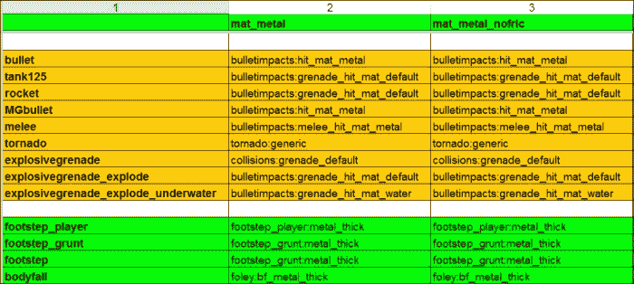
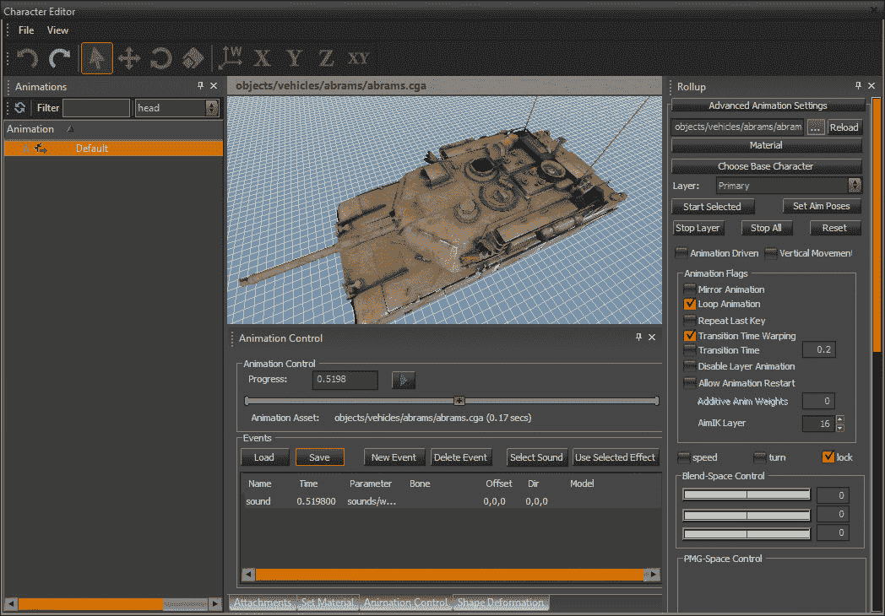
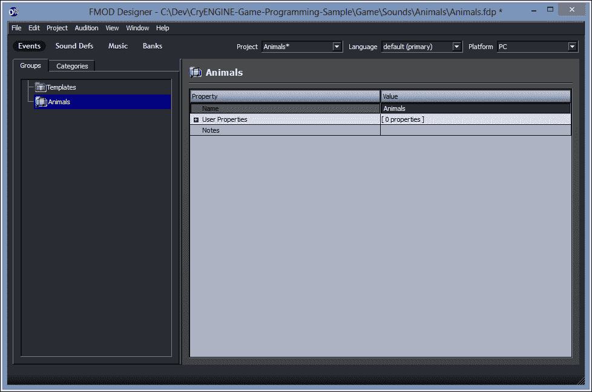
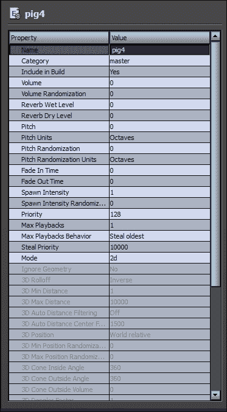
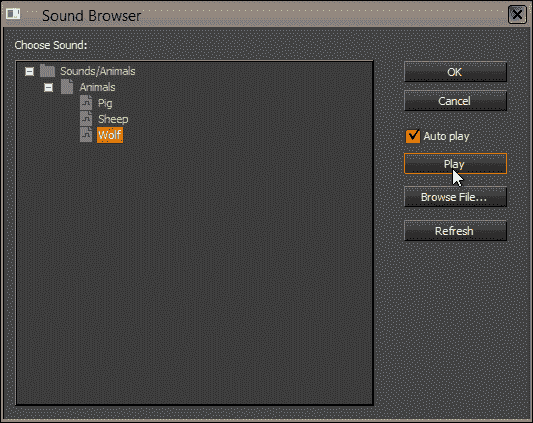
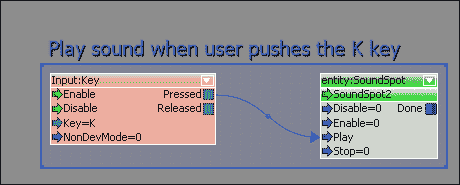

# 第十一章：效果和声音

CryENGINE 拥有非常模块化的效果系统，允许在运行时轻松生成效果。引擎还具有 FMOD 集成，为开发人员提供了动态播放音频、音乐和本地化对话的工具。

在本章中，我们将涵盖以下主题：

+   学习有关效果和声音系统

+   发现如何创建和触发材料效果

+   学习如何通过 FMOD Designer 导出和自定义声音

+   播放自定义声音

+   学习如何将声音集成到粒子和物理事件中

# 引入效果

没有 FX，游戏世界通常很难相信，并且被认为是没有生命的。简单地添加声音和粒子等效果有助于使世界变得生动，给玩家带来更加沉浸式的世界感。

尽管引擎中没有一个统一的系统来处理所有类型的效果，但我们将涵盖处理各种效果的多个系统。这包括材料效果、粒子效果、音效等。

## 材料效果

材料效果系统处理材料之间的反应，例如，根据岩石落在的材料播放不同的粒子和声音效果。

### 表面类型

每种材料都被分配了一个**表面类型**，表示其是什么类型的表面。例如，如果我们正在创建一个岩石材料，我们应该使用`mat_rock`表面类型。

通过分配表面类型，物理系统将能够收集有关碰撞应如何行为的信息，例如，通过获取表面类型的摩擦值。多个表面类型之间的相互作用还允许根据彼此接触的表面类型动态改变效果。

可以很容易地通过编程方式查询表面类型，从而允许各种系统创建基于表面类型触发的不同代码路径。

在 C++中，表面类型由`ISurfaceType`接口表示，可通过`IMaterial::GetSurfaceType`获得。

使用 C#，表面类型由`CryEngine.SurfaceType`类表示，并且可以通过`CryEngine.Material.SurfaceType`属性检索。

#### 添加或修改表面类型

表面类型在`Game/Libs/MaterialEffects/SurfaceTypes.xml`中定义。引擎在启动时解析该文件，允许材料使用加载的表面类型。

每种表面类型都是通过使用`SurfaceType`元素定义的，例如，如下代码所示的`mat_fabric`：

```cs
<SurfaceType name="mat_fabric">
  <Physics friction="0.80000001" elasticity="0" pierceability="7" can_shatter="1"/>
</SurfaceType>
```

当发生碰撞时，物理系统会查询物理属性。

## 粒子效果

粒子效果由`IParticleManager`接口处理，可通过`I3DEngine::GetParticleManager`访问。要获得`IParticleEffect`对象的指针，请参阅`IParticleManager::FindEffect`。

通过**Sandbox Editor**中包含的**Particle Editor**创建粒子效果，并通常保存到`Game/Libs/Particles`中。

## 音效

CryENGINE 声音系统由游戏音频内容创建工具 FMOD 提供支持。通过使用 FMOD，引擎支持轻松创建和操作声音，以立即在游戏中使用。

声音系统可以通过`ISoundSystem`接口访问，通常通过`gEnv->pSoundSystem`指针检索。声音由`ISound`接口表示，可以通过`ISoundSystem::CreateSound`或`ISoundSystem::GetSound`检索到指针。

通过访问`ISound`接口，我们可以更改语义、距离倍增器等，以及通过`ISound::Play`实际播放声音。

### FMOD Designer

设计师是我们每次想要向项目中使用的不同声音库添加更多声音时使用的工具。


设计师允许创建和维护声音库，本质上是创建不同声音之间的分离的库。声音库中包括事件、声音定义和音乐。这些可以被赋予静态和动态修饰符，例如根据游戏环境给声音赋予独特的 3D 效果。

# 创建和触发材料效果

有两种触发自定义材料效果的方法，如下节所述。

## 基于物理相互作用的自动播放

当两种材料由于物理事件发生碰撞时，引擎将根据分配给材料的表面类型在`Game/Libs/MaterialEffects/MaterialEffects.xml`中查找材料效果。这允许在发生某些交互时播放各种粒子和声音。

例如，如果岩石与木材发生碰撞，我们可以播放特定的声音事件以及木屑粒子。

首先，用 Microsoft Excel 打开`MaterialEffects.xml`。

### 注意

虽然可以手动修改材料效果文档，但由于 Excel 格式的复杂性，这并不推荐。


现在您应该在 Excel 应用程序中看到材料效果表。各种表面类型以网格形式布置，行和列的交叉点定义了要使用的效果。

例如，根据上一个屏幕截图中显示的表，如果一个具有表面类型**mat_flesh**的材料与**mat_vegetation**表面发生碰撞，引擎将加载**collision:vegetation_spruce**效果。

### 注意

可以通过`Libs/MaterialEffects/SurfaceTypes.xml`查看（或修改）完整的表面类型列表。

### 添加新的表面类型

如果需要向材料效果文档中添加新的表面类型，只需添加一个相应的行和一个带有表面类型名称的列，以便引擎加载它。

### 注意

请记住，表面类型的名称必须按照相同的顺序出现在行和列中。

### 效果定义

现在我们知道系统如何为各种表面类型的碰撞找到效果，那么我们如何找到并创建效果呢？

效果以纯 XML 文件的形式包含在`Libs/MaterialEffects/FXLibs/`中。例如，先前使用的**collision:vegetation_spruce**效果的定义包含在`Libs/MaterialEffects/FXLibs/Collision.xml`中，内容如下：

```cs
<FXLib>
  <Effect name="vegetation_spruce">
    <Particle>
      <Name>Snow.Vegetation.SpruceNeedleGroup</Name>
    </Particle>
  </Effect>
</FXLib>
```

这告诉引擎在触发效果时播放指定的粒子。例如，如前所述，如果一个具有**mat_flesh**表面类型的材料与另一个**mat_vegetation**类型的材料发生碰撞，引擎将在碰撞位置生成`Snow.Vegetation.SpruceNeedleGroup`效果。

但是声音呢？声音可以通过事件以类似的方式播放，只需用声音的名称替换`Particle`标签，如下面的代码所示：

```cs
<Sound>
  <Name>Sounds/Animals:Animals:Pig</Name>
</Sound>
```

现在当效果播放时，我们应该能够听到猪的挣扎声。这就是当你撞到植被时会发生的事情，对吧？

### 注意

值得记住的是，一个效果不必包含一种特定类型的效果，而可以在触发时同时播放多种效果。例如，根据前面的代码，我们可以创建一个新的效果，在触发时播放声音并生成粒子效果。

## 触发自定义事件

还可以触发自定义材料效果，例如，当创建应基于交互名称不同的脚步效果时非常有用。



### 注意

冒号（'**:**'）代表效果类别，这是我们在`Libs/MaterialEffects/FXLibs/`文件夹中创建的效果库的名称。

上一个屏幕截图是以编程方式触发的自定义材料效果的较小选择。

要获取效果的 ID，请调用`IMaterialEffects::GetEffectId`，并提供交互名称和相关表面类型，如下所示。

```cs
IMaterialEffects *pMaterialEffects = gEnv->pGame->GetIGameFramework()->GetIMaterialEffects();

TMFXEffectId effectId = pMaterialEffects->GetEffectId("footstep_player", surfaceId);
```

### 注意

有许多获取表面标识符的方法。例如，使用`RayWorldIntersection`投射射线将允许我们通过`ray_hit::surface_idx`变量获取碰撞表面 ID。我们也可以简单地在任何材质实例上调用`IMaterial::GetSurfaceTypeId`。

现在，我们应该有`footstep_player`效果的标识符，基于我们传递给`GetEffectId`的表面类型。例如，通过与先前的截图交叉引用，并假设我们传递了`mat_metal`标识符，我们应该有`footstep_player:metal_thick`效果的 ID。

然后，我们可以通过调用`IMaterialEffects::ExecuteEffect`来执行效果，如下所示：

```cs
SMFXRunTimeEffectParams params;
params.pos = Vec3(0, 0, 10);

bool result = gEnv->pGame->GetIGameFramework()->GetIMaterialEffects()->ExecuteEffect(effectId, params);
```

还可以通过调用`IMaterialEffects::GetResources`来获取效果资源，如下所示：

```cs
if(effectId != InvalidEffectId)
{
  SMFXResourceListPtr->pList = pMaterialEffects->GetResources(effectId);

  if(pList && pList->m_particleList)
  {
    const char *particleEffectName = pList->m_particleList->m_particleParams.name;
  }
}
```

# 基于动画的事件和效果

基于动画的事件可用于在动画的特定时间触发特定效果。例如，我们可以使用这个来将声音链接到动画，以确保声音始终与其对应的动画同步播放。

首先，通过**Sandbox Editor**打开**Character Editor**，加载任何角色定义，然后选择任何动画。



在窗口底部中央选择**Animation Control**选项卡，并选择动画期间的任何时间，您想要播放声音的时间。

当滑块定位在应播放声音的时间上时，单击**New Event**。

事件的**Name**字段应为**sound**，并将**Parameter**字段设置为要播放的声音路径。


单击**Save**后，声音应该会在指定的时间与动画一起播放。

# 生成粒子发射器

如*Particle effects*部分所述，粒子效果由`IParticleEffect`接口表示。但是，粒子效果与粒子发射器不同。效果接口处理默认效果的属性，并可以生成显示游戏中的视觉效果的单个发射器。

发射器由`IParticleEmitter`接口表示，通常通过调用`IParticleEffect::Spawn`来检索。

# 通过使用 FMod 导出声音

所以你想要将一些声音导出到引擎？我们需要做的第一件事是通过**FMOD Designer**创建一个新的 FMod 项目。要这样做，首先通过`<Engine Root>/Tools/FmodDesigner/fmod_designer.exe`打开设计师。 

要创建新项目，请单击**File**菜单，选择**New Project**，然后将项目保存到您认为合适的位置。我们将保存到`Game/Sounds/Animals/Animals.fdp`。

### 注意

有关 FMOD 音频系统的更深入教程，请参阅 CryENGINE 文档[`docs.cryengine.com/display/SDKDOC3/The+FMOD+Designer`](http://docs.cryengine.com/display/SDKDOC3/The+FMOD+Designer)。

## 向项目添加声音

现在我们有一个声音项目，是时候添加一些声音了。要这样做，请确保您在**Events**菜单中，**Groups**选项卡处于激活状态，如下截图所示：



现在，要添加声音，只需将`.wav`文件拖放到您选择的组中，然后它应该出现在那里。现在，您可以导航到**Project** | **Build**，或按*Ctrl* + *B*，以构建项目的波形库，这是引擎将加载以检测声音的内容。


通过向事件组添加更多声音，系统将在请求组时随机选择一个声音。

通过在 FMOD 中选择事件组，我们还可以修改其属性，从而调整声音在播放时的播放方式。



大多数属性静态影响声音，而以**随机化**结尾的属性会在运行时随机应用效果。例如，通过调整**音高随机化**，我们可以确保声音的音高会随机偏移我们选择的值，给声音增添独特的风格。

# 播放声音

在播放音频时，我们必须区分由程序员触发的动态声音和由关卡创建者触发的静态声音。

有多种触发音频事件的方式，应根据声音的目的进行评估。

## 使用 SoundSpots

声音点实体存在是为了让关卡设计师轻松地放置一个实体，以便在特定区域播放预定义的声音。声音实体支持循环声音，或者在从脚本事件触发时每次播放一次。

要使用声音点，首先通过 Rollupbar 放置一个新的**SoundSpot**实体的实例，或导航到**Sound** | **Soundspot**。放置后，您应该看到类似于以下屏幕截图的示例：


现在我们可以分配应该在该位置播放的声音。要这样做，请单击**Source**实体属性，然后通过**Sound Browser**窗口选择一个声音，如下面的屏幕截图所示：



然后可以设置**SoundSpot**以始终播放声音，或者通过流程图触发。例如，在下面的屏幕截图中，当玩家使用*K*键时，声音点将播放其声音。



## 以编程方式播放声音

要以编程方式播放声音，我们首先需要通过`ISoundSystem::CreateSound`检索与我们感兴趣的特定声音相关的`ISound`指针，如下所示：

```cs
ISound *pSound = gEnv->pSoundSystem->CreateSound("Sounds/Animals:Animals:Pig", 0);
```

然后可以通过`ISound::Play`直接播放声音，或将其附加到实体的声音代理：

```cs
IEntitySoundProxy *pSoundProxy = (IEntitySoundProxy *)pEntity->CreateProxy(ENTITY_PROXY_SOUND);

if(pSoundProxy)
  pSoundProxy->PlySound(pSound);
```

通过使用实体声音代理，我们可以确保声音在游戏世界中移动时跟随该实体。

### 声音标志

通过使用`ISoundSystem::CreateSound`接口创建声音时，我们可以指定一组标志，这些标志将影响我们声音的播放。

### 注意

在使用之前，需要在 FMOD 中设置一些标志。例如，具有 3D 空间效果的声音必须在 FMOD 中设置好才能在引擎中使用。

这些标志包含在`ISound.h`中，作为带有`FLAG_SOUND_`前缀的预处理器宏。例如，我们可以在我们的声音中应用`FLAG_SOUND_DOPPLER`标志，以便在播放时模拟多普勒效应。

### 声音语义

语义本质上是应用于声音的修饰符，每个声音都需要它才能播放。

不同的声音语义可以在`ISound.h`（在 CryCommon 项目中）中查看，其中包括`ESoundSemantic`枚举。

# 摘要

在这一章中，我们已经将声音从 FMOD 导入到引擎中，并学会了如何调整它们。

现在您应该知道如何通过 Sandbox 编辑器和以编程方式触发声音，并且对材质效果有了工作知识。

如果您还没有准备好进入下一章，为什么不尝试扩展您的知识呢？一个可能的选择是深入研究粒子编辑器，并创建自己的粒子，包括自定义效果和声音。

在下一章中，我们将介绍调试和分析游戏逻辑的过程，帮助您更高效地工作。
