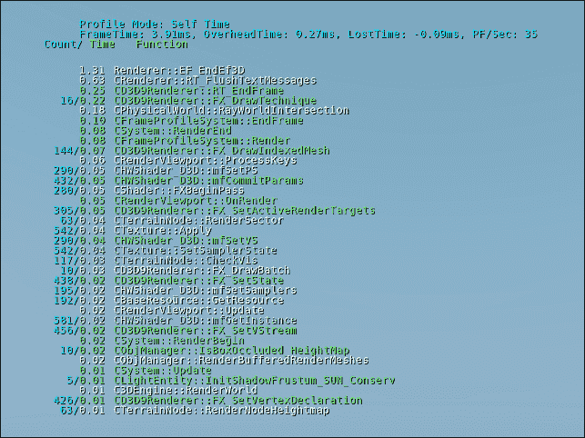

# 第十二章：调试和性能分析

创建高效且无 bug 的代码可能很困难。因此，引擎提供了许多工具来帮助开发人员，以便轻松识别错误并可视化性能问题。

在编写游戏和引擎逻辑时，始终牢记调试和性能分析工具非常重要，以确保代码运行良好并且可以轻松地扫描问题。在解决未来问题时，添加一些游戏日志警告可能非常重要，可以节省大量时间！

在本章中，我们将涵盖以下主题：

+   学习调试 CryENGINE 应用程序的常见方法

+   利用内置性能分析工具

+   创建我们自己的控制台变量和命令

# 调试游戏逻辑

保持代码无 bug 可能非常困难，特别是如果你只依赖于调试器。即使没有连接到运行中的进程，CryENGINE 也会暴露一些系统来帮助调试代码。

始终牢记使用哪种配置构建 GameDll。在构建项目之前，可以在 Visual Studio 中更改此配置，如下面的屏幕截图所示：


默认情况下，有三种主要配置，如下表所示：

| 配置名称 | 描述 |
| --- | --- |
| 配置文件 | 在开发应用程序时使用，确保生成调试数据库。 |
| 调试 | 当您需要关闭编译优化以及专门为此模式打开的额外 CryENGINE 助手时使用。 |
| 发布 | 此模式旨在用于发送给最终用户的最终构建。此配置执行一系列操作，包括禁用调试数据库的生成和多个仅用于调试的 CryENGINE 系统。CryENGINE 游戏通常会将所有库（如 CryGame）链接到一个启动器应用程序中以确保安全。 |

## 记录到控制台和文件

日志系统允许将文本打印到控制台和根文件结构中包含的`.log`文件中。日志的名称取决于启动了哪个应用程序：

| 日志名称 | 描述 |
| --- | --- |
| `Game.log` | 由启动器应用程序使用。 |
| `Editor.log` | 仅供沙盒编辑器应用程序使用。 |
| `Server.log` | 用于专用服务器。 |

日志功能通常用于非常严重的问题，或者警告设计人员不支持的行为。

记录严重错误和初始化统计信息的最大好处是，通过简单地阅读用户的游戏日志，您通常可以弄清楚为什么您的代码在最终用户的计算机上无法正常工作。

### 日志冗长度

通过使用`log_verbosity`控制台变量（用于控制台的可视部分）和`log_writeToFileVerbosity`（用于写入磁盘的日志）来设置日志冗长度。

冗长度确定应该记录/显示哪些消息，并且对于过滤掉不太严重的消息非常有用。

| 冗长度级别 | 描述 |
| --- | --- |
| `-1`（无日志记录） | 抑制所有已记录的信息，包括`CryLogAlways`。 |
| `0`（始终） | 抑制所有已记录的信息，不包括使用`CryLogAlways`记录的信息。 |
| `1`（错误） | 与级别 0 相同，但包括额外的错误。 |
| `2`（警告） | 与级别 1 相同，但包括额外的警告。 |
| `3`（消息） | 与级别 2 相同，但包括额外的消息。 |
| `4`（注释） | 最高冗长度，记录之前提到的所有内容以及额外的注释。 |

### 全局日志函数

以下是全局日志函数列表：

+   `CryLog`：此函数将消息记录到控制台和文件日志中，假设日志冗长度为 3 或更高。

```cs
CryLog("MyMessage");
```

+   `CryLogAlways`：此函数将消息记录到控制台和文件中，假设日志冗长度为 0 或更高。

```cs
CryLogAlways("This is always logged, unless log_verbosity is set to -1");
```

+   `CryWarning`：此函数向日志和控制台输出一个警告，前缀为[Warning]。它还可用于警告设计人员他们错误地使用功能。只有在日志详细程度为 2 或更高时才会记录到文件中。

```cs
CryWarning(VALIDATOR_MODULE_GAME, VALIDATOR_WARNING, "My warning!");
```

+   `CryFatalError`：此函数用于指定发生了严重错误，并导致消息框后跟程序终止。

```cs
CryFatalError("Fatal error, shutting down!");
```

+   `CryComment`：此函数输出一个注释，假设日志详细程度为 4。

```cs
CryComment("My note");
```

### 注意

注意：在 C#中，通过使用静态的`Debug`类来记录日志。例如，要记录一条消息，可以使用`Debug.Log("message");`

要使用 Lua 进行记录，可以使用`System.Log`函数，例如，`System.Log("MyMessage");`

## 持久调试

持久调试系统允许绘制持久性辅助工具，以在游戏逻辑上提供视觉反馈。例如，该系统在以下截图中用于在每一帧上绘制玩家在其世界位置面对的方向，其中每个箭头在消失之前持续了指定数量的秒数。

该系统可以带来非常有趣的效果，例如一种查看玩家旋转和物理交互的方式，如在免费游戏 SNOW 中显示的那样：


### C++

可以通过游戏框架访问`IPersistantDebug`接口，如下所示：

```cs
IPersistantDebug *pPersistantDebug = gEnv->pGame->GetIGameFramework()->GetIPersistantDebug();
```

在调用各种绘图函数之前，我们需要调用`IPersistantDebug::Begin`来表示应该开始新的持久调试组。

```cs
pPersistantDebug->Begin("myPersistentDebug", false);
```

最后一个布尔参数指定系统是否应清除所选范围内所有先前绘制的持久调试对象（`"myPersistentDebug"`）。

现在我们可以使用各种**Add***函数，例如`AddSphere`：

```cs
pPersistantDebug->AddSphere(Vec3(0, 0, 10), 0.3f, ColorF(1, 0, 0),2.0f);
```

在上一个片段中，系统将在游戏世界中的`0`，`0`，`10`处绘制一个半径为`0.3`的红色球体。球体将在`2`秒后消失。

### C#

在 C#中，可以通过使用静态的`Debug`类来访问持久调试接口。例如，要添加一个球体，可以使用以下代码：

```cs
Debug.DrawSphere(new Vec3(0, 0, 10), 0.3f, Color.Red, 2.0f);
```

## CryAssert

CryAssert 系统允许开发人员确保某些变量保持在边界内。通过进行仅在开发构建中编译的检查，可以不断测试系统如何与其他系统交互。这对性能和确保功能不容易出错都很有好处。

可以通过使用`sys_asserts` CVar 来切换系统，并且可能需要在`StdAfx`头文件中定义`USE_CRYASSERT`宏。

要进行断言，请使用`CRY_ASSERT`宏，如下所示：

```cs
CRY_ASSERT(pPointer != nullptr)
```

然后每次运行代码时都会进行检查，除了在发布模式下，并且当条件为假时会输出一个大的警告消息框。

# 分析

在处理实时产品（如 CryENGINE）时，程序员不断地需要考虑其代码的性能。为了帮助解决这个问题，我们可以使用`profile`控制台变量。

CVar 允许获取代码最密集部分的可视化统计信息，如下截图所示：



在上一个截图中，profile 设置为`1`，默认模式，对每一帧调用的最密集的函数进行排序。

## 使用情况分析

目前，profile 变量支持以下表中列出的 13 种不同状态：

| 值 | 描述 |
| --- | --- |
| 0 | 默认值；当设置为此值时，分析系统将处于非活动状态。 |
| 1 | 自身时间 |
| 2 | 分层时间 |
| 3 | 扩展自身时间 |
| 4 | 扩展分层时间 |
| 5 | 峰值时间 |
| 6 | 子系统信息 |
| 7 | 调用次数 |
| 8 | 标准偏差 |
| 9 | 内存分配 |
| 10 | 内存分配（以字节为单位） |
| 11 | 停顿 |
| -1 | 用于启用分析系统，而不将信息绘制到屏幕上。 |

## 在 C++中进行分析

在 C++中进行分析，我们可以利用`FUNCTION_PROFILER`预处理器宏定义，如下所示：

```cs
FUNCTION_PROFILER(GetISystem(), PROFILE_GAME);
```

该宏将设置必要的分析器对象：一个静态的`CFrameProfiler`对象，该对象保留在方法中，以及一个`CFrameProfilerSection`对象，每次运行该方法时都会创建（并在返回时销毁）。

如果分析器检测到您的代码与其他引擎功能的关系密切，它将在分析图表中显示更多，如下面的截图所示：


如果要调试代码的某个部分，还可以使用`FRAME_PROFILER`宏，其工作方式与`FUNCTION_PROFILER`相同，只是允许您指定受监视部分的名称。

`FRAME_PROFILER`的一个示例用例是在`if`块内部，因为帧分析器部分将在块完成后被销毁：

```cs
if (true)
{
  FRAME_PROFILER("MyCheck", gEnv->pSystem, PROFILE_GAME);

  auto myCharArray = new char[100000];
  for(int i = 0; i < 100000; i++)
    myCharArray[i] = 'T';

  // Frame profiler section is now destroyed
}
```

现在我们可以在游戏中对先前的代码进行分析，如下面的截图所示：


## 在 C#中进行分析

也可以以大致相同的方式对 C#代码进行分析。不同之处在于我们不能依赖托管代码中的析构函数/终结器，因此必须自己做一些工作。

我们首先要做的是创建一个`CryEngine.Profiling.FrameProfiler`对象，该对象将在实体的生命周期内持续存在。然后只需在每次需要对函数进行分析时在新的帧分析器对象上调用`FrameProfiler.CreateSection`，然后在使用以下代码时在生成的对象上调用`FrameProfilerSection.End`：

```cs
using CryEngine.Profiling;

public SpawnPoint()
{
  ReceiveUpdates = true;

  m_frameProfiler = FrameProfiler.Create("SpawnPoint.OnUpdate");
}

public override void OnUpdate()
{
  var section = m_frameProfiler.CreateSection();

  var stringArray = new string[10000];
  for(int i = 0; i < 10000; i++)
    stringArray[i] = "is it just me or is it laggy in here";

  section.End();
}

FrameProfiler m_frameProfiler;
```

然后，分析器将列出`SpawnPoint.OnUpdate`，如下面的截图所示：


# 控制台

尽管与调试没有直接关联，但 CryENGINE 控制台提供了创建命令的手段，这些命令可以直接从游戏中执行函数，并创建可以修改以改变世界行为方式的变量。

### 注意

有趣的是：通过在控制台中使用井号（`#`）符号，我们可以直接在游戏中执行 Lua，例如，`#System.Log("My message!");`

## 控制台变量

**控制台变量**，通常称为**CVars**，允许在 CryENGINE 控制台中公开代码中的变量，有效地允许在运行时或通过配置（`.cfg`）文件中调整设置。

几乎每个子系统都在运行时使用控制台变量，以便在不需要代码修改的情况下调整系统的行为。

### 注册 CVar

在注册新的 CVar 时，重要的是要区分引用变量和包装变量。

不同之处在于引用 CVar 指向您自己代码中定义的变量，当通过控制台更改值时会直接更新。

包装变量包含专门的**ICVar**（C++）实现中的变量本身，位于`CrySystem.dll`中。

引用变量最常用于 CVars，因为它们不需要每次想要知道控制台变量的值时都调用`IConsole::GetCVar`。

#### 在 C++中

要在 C++中注册引用控制台变量，请调用`IConsole::Register`，如下所示：

```cs
gEnv->pConsole->Register("g_myVariable", &m_myVariable, 3.0f, VF_CHEAT, "My variable description!");
```

现在，`g_myVariable` CVar 的默认值将是`3.0f`。如果我们通过控制台更改了值，`m_myVariable`将立即更新。

### 注意

要了解`VF_CHEAT`标志的作用，请参阅*标志*部分的进一步讨论。

要注册包装的控制台变量，请使用`IConsole::RegisterString`，`RegisterFloat`或`RegisterInt`。

#### 在 C#中

要通过 CryMono 注册引用控制台变量，请使用`CVar.RegisterFloat`或`CVar.RegisterInt`，如下面的代码所示：

```cs
float m_myVariable;

CVar.RegisterFloat("g_myCSharpCVar", ref m_myVariable, "My variable is awesome");
```

### 注意

由于 C++和 C#字符串的后端结构不同，因此无法创建引用字符串 CVars。

如果您喜欢使用包装变量，请使用`CVar.Register`。

### 标志

在注册新的 CVar 时，开发人员应指定默认标志。标志控制变量在修改或查询时的行为。

+   `VF_NULL`: 如果没有其他标志存在，则将此标志设置为零。

+   `VF_CHEAT`: 此标志用于在启用作弊时防止更改变量，例如在发布模式或多人游戏中。

+   `VF_READONLY`: 用户永远无法更改此标志。

+   `VF_REQUIRE_LEVEL_RELOAD`: 此标志警告用户更改变量将需要重新加载级别才能生效。

+   `VF_REQUIRE_APP_RESTART`: 此标志警告用户更改将需要重新启动应用程序才能生效。

+   `VF_MODIFIED`: 当变量被修改时设置此标志。

+   `VF_WASINCONFIG`: 如果变量是通过配置（.cfg）文件更改的，则设置此标志。

+   `VF_RESTRICTEDMODE`: 如果变量应在受限制（发布）的控制台模式中可见和可用，则设置此标志。

+   `VF_INVISIBLE`: 如果变量不应在控制台中对用户可见，则设置此标志。

+   `VF_ALWAYSONCHANGE`: 此标志始终接受新值，并在值保持不变时调用更改回调。

+   `VF_BLOCKFRAME`: 此标志在使用变量后阻止执行更多控制台命令一帧。

+   `VF_CONST_CVAR`: 如果变量不应通过配置（.cfg）文件进行编辑，则设置此标志。

+   `VF_CHEAT_ALWAYS_CHECK`: 如果变量非常脆弱并且应该持续检查，则设置此标志。

+   `VF_CHEAT_NOCHECK`: 此标志与`VF_CHEAT`相同，只是由于对其进行的更改是无害的，因此不会进行检查。

### 控制台变量组

为了便于创建不同的系统规格（低/中/高/非常高的图形级别），也称为**Sys Spec**，我们可以利用 CVar 组。这些组允许在更改规范时同时更改多个 CVars 的值。

### 注意

如果您不确定 Sys Specs 的作用，请阅读本章后面讨论的*系统规格*部分。

要更改系统规范，用户只需更改`sys_spec`控制台变量的值。一旦更改，引擎将解析`Engine/Config/CVarGroups/`中的链接规范文件，并设置定义的 CVar 值。

例如，如果更改了`sys_spec_GameEffects` CVar，引擎将打开`Engine/Config/CVarGroups/sys_spec_GameEffects.cfg`。

### 注意

`sys_spec_Full`组被视为根组，并且在更改`sys_spec` CVar 时触发。当更改时，它将更新所有子组，例如`sys_spec_Quality`。

#### Cfg 结构

CVar 组配置文件的结构相对容易理解。例如，查看以下`sys_spec_GameEffects`文件：

```cs
[default]
; default of this CVarGroup
= 3

i_lighteffects = 1
g_ragdollUnseenTime = 2
g_ragdollMinTime = 13
g_ragdollDistance = 30

[1]
g_ragdollMinTime = 5
g_ragdollDistance = 10

[2]
g_ragdollMinTime = 8
g_ragdollDistance = 20

[3]

[4]
g_ragdollMinTime = 15
g_ragdollDistance = 40
```

前三行定义了此配置文件的默认规范，本例中为高（`3`）。

在默认规范之后是高规范中 CVars 的默认值。除非被覆盖，否则这些值将被用作基线并应用于所有规范。

在默认规范之后是低规范（`[1]`）、中等规范（`[2]`）和非常高规范（`[4]`）。在定义之后放置的 CVars 定义了在该规范中应将变量设置为的值。

#### 系统规格

当前系统规范由`sys_spec` CVar 的值确定。更改变量的值将自动加载为该规范专门调整的着色器和 CVar 组。例如，如果游戏在您的 PC 上运行得有点糟糕，您可能想将规范更改为低（`1`）。

+   `0`: 自定义

+   `1`: 低

+   `2`: 中等

+   `3`: 高

+   `4`: 非常高

+   `5`: Xbox 360

+   `6`: PlayStation 3

## 控制台命令

**控制台命令**（通常称为**CCommands**）本质上是已映射到控制台变量的函数。但是，与将命令输入控制台时更改引用变量的值不同，调用将触发在注册命令时指定的函数。

### 注意

请注意，控制台变量还可以指定`On Change`回调，在值更改时会自动调用。当内部变量与您的意图无关时，请使用控制台命令。

### 在 C#中注册控制台命令

要在 C#中注册控制台命令，请使用`ConsoleCommand.Register`，如下面的代码所示：

```cs
public void OnMyCSharpCommand(ConsoleCommandArgs e)
{
}

ConsoleCommand.Register("MyCSharpCommand", OnMyCSharpCommand, "C# CCommands are awesome.");
```

在控制台中触发`MyCSharpCommand`现在将导致调用`OnMyCSharpCommand`函数。

#### 参数

当触发回调时，您将能够检索在命令本身之后添加的参数集。例如，如果用户通过键入`MyCommand 2`来激活命令，我们可能希望检索字符串的`2`部分。

为此，请使用`ConsoleCommandArgs.Args`数组，并指定要获取的参数的索引。对于前面的示例，代码将如下所示：

```cs
string firstArgument = null;
if(e.Args.Length >= 1)
  firstArgument = e.Args[0];
```

### 注意

要检索使用命令指定的完整命令行，请使用`ConsoleCommandArgs.FullCommandLine`。

### 在 C++中创建控制台命令

要在 C++中添加新的控制台命令，请使用`IConsole::AddCommand`，如下所示：

```cs
void MyCommandCallback(IConsoleCmdArgs *pCmdArgs)
{
}
gEnv->pConsole->AddCommand("MyCommand", MyCommandCallback, VF_NULL, "My command is great!");
```

编译并启动引擎后，您将能够在控制台中键入`MyCommand`并触发您的`MyCommandCallback`函数。

# 摘要

在本章中，我们有：

+   学会了如何使用引擎的一些调试工具

+   对我们的代码进行了性能优化

+   学习了什么是控制台变量（CVars），以及如何使用它们

+   创建自定义控制台命令

现在，您应该对如何在 CryENGINE 中进行最佳编程有了基本的了解。请确保始终牢记性能分析和调试方法，以确保您的代码运行良好。

假设您按顺序阅读了本书的章节，现在您应该了解最重要的引擎系统的运作方式。我们希望您喜欢阅读，并祝您在使用您新获得的 CryENGINE 知识时一切顺利！
