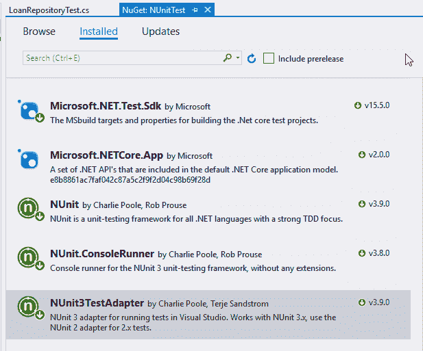
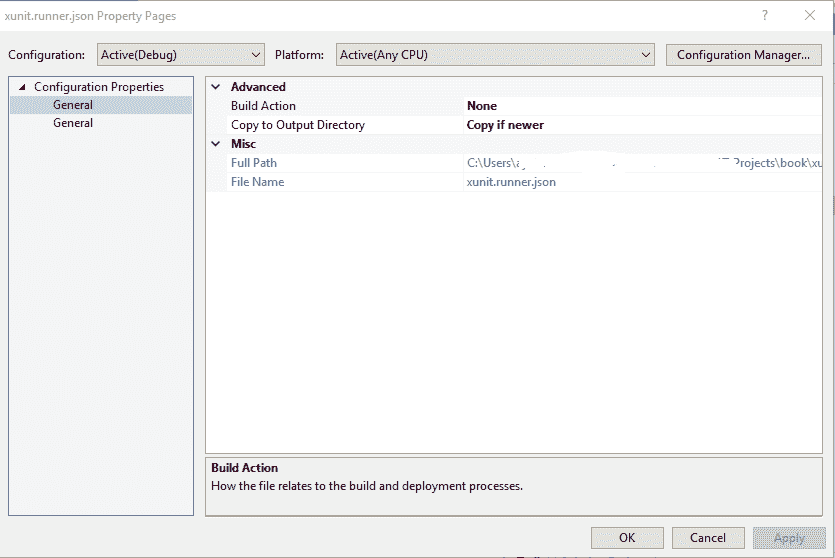
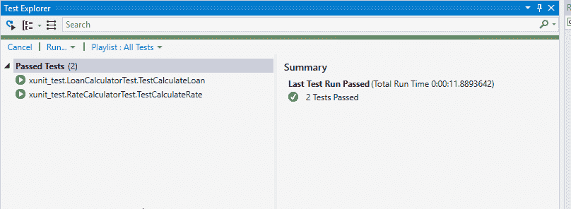
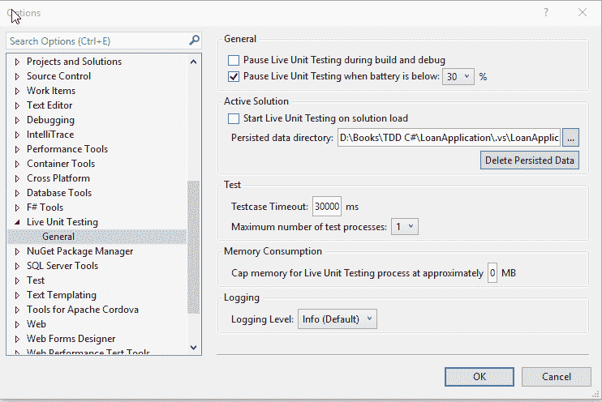
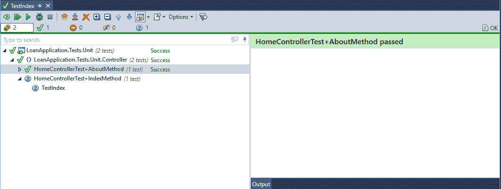

# 第四章：.NET Core 单元测试

**单元测试**是软件开发领域最近几年讨论最多的概念之一。单元测试并不是软件开发中的新概念；它已经存在了相当长的时间，自 Smalltalk 编程语言的早期。基于对质量和健壮软件应用程序的增加倡导，软件开发人员和测试人员已经意识到单元测试在软件产品质量改进方面所能提供的巨大好处。

通过单元测试，开发人员能够快速识别代码中的错误，从而增加开发团队对正在发布的软件产品质量的信心。单元测试主要由程序员和测试人员进行，这项活动涉及将应用程序的要求和功能分解为可以单独测试的单元。

单元测试旨在保持小型并经常运行，特别是在对代码进行更改时，以确保代码库中的工作功能不会出现故障。在进行 TDD 时，必须在编写要测试的代码之前编写单元测试。测试通常用作设计和编写代码的辅助工具，并且有效地是代码设计和规范的文档。

在本章中，我们将解释如何创建基本单元测试，并使用 xUnit 断言证明我们的单元测试结果。本章将涵盖以下主题：

+   良好单元测试的属性

+   .NET Core 和 C#的当前单元测试框架生态系统

+   ASP.NET MVC Core 的单元测试考虑因素

+   使用 xUnit 构建单元测试

+   使用 xUnit 断言证明单元测试结果

+   .NET Core 和 Windows 上可用的测试运行器

# 良好单元测试的属性

单元测试是编写用于测试另一段代码的代码。有时它被称为最低级别的测试，因为它用于测试应用程序的最低级别的代码。单元测试调用要测试的方法或类来验证和断言有关被测试代码的逻辑、功能和行为的假设。

单元测试的主要目的是验证被测试代码单元，以确保代码片段执行其设计用途而不是其他用途。通过单元测试，可以证明代码单元的正确性，只有当单元测试编写得好时才能实现。虽然单元测试将证明正确性并有助于发现代码中的错误，但如果被测试的代码设计和编写不佳，代码质量可能不会得到改善。

当您正确编写单元测试时，您可以在一定程度上确信您的应用程序在发布时会正确运行。通过测试套件获得的测试覆盖率，您可以获得有关代码库中方法、类和其他对象的测试写入频率的指标，并且您将获得有关测试运行频率以及测试通过或失败次数的有意义信息。

通过可用的测试指标，参与软件开发的每个利益相关者都可以获得客观信息，这些信息可用于改进软件开发过程。迭代进行单元测试可以通过测试代码中的错误来增加代码的价值，从而提高代码的可靠性和质量。这是通过对代码进行错误测试来实现的——测试会多次重复运行，这是一个被称为**回归测试**的概念，以便在软件应用程序成熟并且之前工作的组件出现故障时找到可能发生的错误。

# 可读性

单元测试的这一特性不容忽视。与被测试的代码类似，单元测试应该易于阅读和理解。编码标准和原则也适用于测试。应该避免使用魔术数字或常量等反模式，因为它们会使测试混乱并且难以阅读。在下面的测试中，整数`10`是一个魔术数字，因为它直接使用。这影响了测试的可读性和清晰度：

```cs
[Fact]
 public void Test_CheckPasswordLength_ShouldReturnTrue() { 

    string password = "civic";

    bool isValid=false;
    if(password.Length >=10)
        isValid=true;

    Assert.True(isValid);
 }
```

有一个良好的测试结构模式可以采用，它被广泛称为**三 A 模式**或**3A 模式**——`安排`，`行动`和`断言`——它将测试设置与验证分开。您需要确保测试所需的数据被安排好，然后是对被测试方法进行操作的代码行，最后断言被测试方法的结果是否符合预期：

```cs
 [Fact]
 public void Test_CompareTwoStrings_ShouldReturnTrue() { 
    string input = "civic";

    string reversed =  new string(input.Reverse().ToArray());

    Assert.Equal(reversed, input);
 }
```

虽然测试没有严格的命名约定，但您应确保测试的名称代表特定的业务需求。测试名称应包含预期的输入以及预期的输出，`Test_CheckPasswordLength_ShouldReturnTrue`，这是因为除了用于测试特定应用功能之外，单元测试还是源代码的丰富文档来源。

# 单元独立性

单元测试基本上应该是一个单元，它应该被设计和编写成可以独立运行的形式。在这种情况下，被测试的单元，即一个方法，应该已经被编写成微妙地依赖于其他方法。如果可能的话，方法所需的数据应该通过方法参数传递，或者应该在单元内提供，它不应该需要外部请求或设置数据来进行功能。

单元测试不应该依赖于或受到任何其他测试的影响。当单元测试相互依赖时，如果其中一个测试在运行时失败，所有其他依赖测试也会失败。代码所需的所有数据应该由单元测试提供。

与第二章中讨论的*单一职责原则*类似，*开始使用.NET Core*，一个单元应该只有一个职责，任何时候只有一个关注点。单元在任何时候应该只有一个任务，以便作为一个单元进行测试。当您有一个方法实际上执行多个任务时，它只是单元的包装器，应该分解为基本单元以便进行简单的测试：

```cs
[Fact]
 public void Test_DeleteLoan_ShouldReturnNull() {

    loanRepository.ArchiveLoan(12);    
    loanRepository.DeleteLoan(12);    
    var loan=loanRepository.GetById(12); 

    Assert.Null(loan);
 }
```

此片段中测试的问题在于同时发生了很多事情。如果测试失败，没有特定的方法来检查哪个方法调用导致了失败。为了清晰和易于维护，这个测试可以分解成不同的测试。

# 可重复

单元测试应该易于运行，而无需每次运行时都进行修改。实质上，测试应该准备好重复运行而无需修改。在下面的测试中，`Test_DeleteLoan_ShouldReturnNull`测试方法是不可重复的，因为每次运行测试都必须进行修改。为了避免这种情况，最好模拟`loanRepository`对象：

```cs
[Fact]
 public void Test_DeleteLoan_ShouldReturnNull() { 
    loanRepository.DeleteLoan(12);

    var loan=loanRepository.GetLoanById(12); 

    Assert.Null(loan);
 }
```

# 易维护且运行速度快

单元测试应该以一种允许它们快速运行的方式编写。测试应该易于实现，任何开发团队的成员都应该能够运行它。因为软件应用是动态的，不断发展的，所以代码库的测试应该易于维护，因为被测试的底层代码发生变化。为了使测试运行更快，尽量减少依赖关系。

很多时候，大多数程序员在单元测试方面做错了，他们编写具有固有依赖关系的单元测试，这反过来使得测试运行变得更慢。一个快速的经验法则可以给你一个线索，表明你在单元测试中做错了什么，那就是测试运行得非常慢。此外，当你的单元测试调用后端服务器或执行一些繁琐的 I/O 操作时，这表明存在测试问题。

# 易于设置，非琐碎，并具有良好的覆盖率

单元测试应该易于设置，并且与任何直接或外部依赖项解耦。应使用适当的模拟框架对外部依赖项进行模拟。适当的对象设置应在设置方法或测试类构造函数中完成。

避免冗余代码，这可能会使测试变得混乱，并确保测试只包含与被测试方法相关的代码。此外，应该为单元或方法编写测试。例如，为类的 getter 和 setter 编写测试可能被认为太琐碎。

最后，良好的单元测试应该具有良好的代码覆盖率。测试方法中的所有执行路径都应该被覆盖，所有测试都应该有定义的可测试标准。

# .NET Core 和 C#的单元测试框架生态系统

.NET Core 开发平台已经被设计为完全支持测试。这可以归因于采用的架构。这使得在.NET Core 平台上进行 TDD 相对容易且值得。

在.NET 和.NET Core 中有几个可用的单元测试框架。这些框架基本上提供了从您喜欢的 IDE、代码编辑器、专用测试运行器，或者有时通过命令行直接编写和执行单元测试的简单和灵活的方式。

.NET 平台上存在着蓬勃发展的测试框架和套件生态系统。这些框架包含各种适配器，可用于创建单元测试项目以及用于持续集成和部署。

这个框架生态系统已经被.NET Core 平台继承。这使得在.NET Core 上实践 TDD 非常容易。Visual Studio IDE 是开放且广泛的，可以更快、更容易地从 NuGet 安装测试插件和适配器，用于测试项目。

有许多免费和开源的测试框架，用于各种类型的测试。最流行的框架是 MSTest、NUnit 和 xUnit.net。

# .NET Core 测试与 MSTest

Microsoft MSTest 是随 Visual Studio 一起提供的默认测试框架，由微软开发，最初是.NET 框架的一部分，但也包含在.NET Core 中。MSTest 框架用于编写负载、功能、UI 和单元测试。

MSTest 可以作为统一的应用程序平台支持，也可以用于测试各种应用程序——桌面、商店、通用 Windows 平台（UWP）和 ASP.NET Core。MSTest 作为 NuGet 软件包提供。

基于 MSTest 的单元测试项目可以添加到包含要测试的项目的现有解决方案中，按照在 Visual Studio 2017 中向解决方案添加新项目的步骤进行操作：

1.  在解决方案资源管理器中右键单击现有解决方案，选择添加，然后选择新项目。或者，要从头开始创建一个新的测试项目，点击“文件”菜单，选择“新建”，然后选择“项目”。

1.  在显示的对话框中，选择 Visual C#，点击.NET Core 选项。

1.  选择 MSTest 测试项目（.NET Core）并为项目指定一个名称。然后点击确定：


或者，在创建新项目或向现有解决方案添加新项目时，选择“类库（.NET Core）”选项，并从 NuGet 添加对 MSTest 的引用。从 NuGet 安装以下软件包到类库项目中，使用 NuGet 软件包管理器控制台或 GUI 选项。您可以从 NuGet 软件包管理器控制台运行以下命令：

```cs
Install-Package MSTest.TestFramework
Install-Package dotnet-test-mstest
```

无论使用哪种方法创建 MSTest 测试项目，Visual Studio 都会自动创建一个`UnitTest1`或`Class1.cs`文件。您可以重命名类或删除它以创建一个新的测试类，该类将使用 MSTest 的`TestClass`属性进行修饰，表示该类将包含测试方法。

实际的测试方法将使用`TestMethod`属性进行修饰，将它们标记为测试，这将使得 MSTest 测试运行器可以运行这些测试。MSTest 有丰富的`Assert`辅助类集合，可用于验证单元测试的期望结果：

```cs
using Microsoft.VisualStudio.TestTools.UnitTesting;
using LoanApplication.Core.Repository;
namespace MsTest
{
    [TestClass]
    public class LoanRepositoryTest
    {
        private LoanRepository loanRepository;
        public LoanRepositoryTest()
        {
            loanRepository = new LoanRepository();
        }

        [TestMethod]
        public void Test_GetLoanById_ShouldReturnLoan()
        {            
            var loan = loanRepository.GetLoanById(12);
            Assert.IsNotNull(loan);
        }
    }
}
```

您可以从 Visual Studio 2017 的测试资源管理器窗口中运行`Test_GetLoanById_ShouldReturnLoan`测试方法。可以从`测试`菜单中打开此窗口，选择`窗口`，然后选择`测试资源管理器`。右键单击测试并选择运行选定的测试：


您还可以从控制台运行测试。打开命令提示窗口并将目录更改为包含测试项目的文件夹，或者如果要运行解决方案中的所有测试项目，则更改为解决方案文件夹。运行`dotnet test`命令。项目将被构建，同时可用的测试将被发现和执行：


# 使用 NUnit 进行.NET Core 测试

**NUnit**是一个最初从 Java 的 JUnit 移植的测试框架，可用于测试.NET 平台上所有编程语言编写的项目。目前是第 3 版，其开源测试框架是在 MIT 许可下发布的。

NUnit 测试框架包括引擎和控制台运行器。此外，它还有用于测试在移动设备上运行的应用程序的测试运行器—**Xamarin Runners**。NUnit 测试适配器和生成器基本上可以使使用 Visual Studio IDE 进行测试变得无缝和相对容易。

使用 NUnit 测试.NET Core 或.NET 标准应用程序需要使用 Visual Studio 测试适配器的 NUnit 3 版本。需要安装 NUnit 测试项目模板，以便能够创建 NUnit 测试项目，通常只需要进行一次。

NUnit 适配器可以通过以下步骤安装到 Visual Studio 2017 中：

1.  单击`工具`菜单，然后选择`扩展和更新`

1.  单击在线选项，并在搜索文本框中键入`nunit`以过滤可用的 NUnit 适配器

1.  选择 NUnit 3 测试适配器并单击下载

这将下载适配器并将其安装为 Visual Studio 2017 的模板，您必须重新启动 Visual Studio 才能生效：


或者，您可以每次要创建测试项目时直接从 NuGet 安装 NUnit 3 测试适配器。

要将 NUnit 测试项目添加到现有解决方案中，请按照以下步骤操作：

1.  在解决方案资源管理器中右键单击解决方案，选择添加，新建项目。

1.  在对话框中，选择 Visual C#，然后选择.NET Core 选项。

1.  选择类库(.NET Core)，然后为项目指定所需的名称。

1.  从 NuGet 向项目添加`NUnit3TestAdapter`和`NUnit.ConsoleRunner`包：



项目设置完成后，可以编写和运行单元测试。与 MSTest 类似，NUnit 也有用于设置测试方法和测试类的属性。

`TestFixture`属性用于标记一个类作为测试方法的容器。`Test`属性用于修饰测试方法，并使这些方法可以从 NUnit 测试运行器中调用。

NUnit 还有其他用于一些设置和测试目的的属性。`OneTimeSetup`属性用于修饰一个方法，该方法仅在运行所有子测试之前调用一次。类似的属性是`SetUp`，用于修饰在运行每个测试之前调用的方法：

```cs
using LoanApplication.Core.Repository;
using NUnit;
using NUnit.Framework;
namespace MsTest
{
    [TestFixture]
    public class LoanRepositoryTest
    {
        private LoanRepository loanRepository;

        [OneTimeSetUp]
        public void SetupTest()
        {
            loanRepository = new LoanRepository();
        }

        [Test]
        public void Test_GetLoanById_ShouldReturnLoan()
        {            
            var loan = loanRepository.GetLoanById(12);
            Assert.IsNotNull(loan);
        }
    }
}
```

测试可以从“测试资源管理器”窗口运行，类似于在 MSTest 测试项目中运行的方式。此外，可以使用`dotnet test`从命令行运行测试。但是，您必须将**Microsoft.NET.Test.Sdk Version 15.5.0**添加为 NUnit 测试项目的引用：


# xUnit.net

**xUnit.net**是用于测试使用 F＃，VB.NET，C＃和其他符合.NET 的编程语言编写的项目的.NET 平台的开源单元测试框架。xUnit.net 是由 NUnit 的第 2 版的发明者编写的，并根据 Apache 2 许可证获得许可。

xUnit.net 可用于测试传统的.NET 平台应用程序，包括控制台和 ASP.NET 应用程序，UWP 应用程序，移动设备应用程序以及包括 ASP.NET Core 的.NET Core 应用程序。

与 NUnit 或 MSTest 不同，测试类分别使用`TestFixture`和`TestClass`属性进行装饰，xUnit.net 测试类不需要属性装饰。该框架会自动检测测试项目或程序集中所有公共类中的所有测试方法。

此外，在 xUnit.net 中不提供测试设置和拆卸属性，可以使用无参数构造函数来设置测试对象或模拟依赖项。测试类可以实现`IDisposable`接口，并在`Dispose`方法中清理对象或依赖项：

```cs
public class TestClass : IDisposable
{
    public TestClass()
    {
        // do test class dependencies and object setup
    }
    public void Dispose()
    {
        //do cleanup here
    }
}
```

xUnit.net 支持两种主要类型的测试-事实和理论。**事实**是始终为真的测试；它们是没有参数的测试。**理论**是只有在传递特定数据集时才为真的测试；它们本质上是参数化测试。分别使用`[Fact]`和`[Theory]`属性来装饰事实和理论测试：

```cs
[Fact]
public void TestMethod1()
{
    Assert.Equal(8, (4 * 2));
}

[Theory]
[InlineData("name")]
[InlineData("word")]
public void TestMethod2(string value)
{
    Assert.Equal(4, value.Length);
}
```

`[InlineData]`属性用于在`TestMethod2`中装饰理论测试，以向测试方法提供测试数据，以在测试执行期间使用。

# 如何配置 xUnit.net

xUnit.net 的配置有两种类型。xUnit.net 允许配置文件为基于 JSON 或 XML。必须为要测试的每个程序集进行 xUnit.net 配置。用于 xUnit.net 的配置文件取决于被测试应用程序的开发平台，尽管 JSON 配置文件可用于所有平台。

要使用 JSON 配置文件，在 Visual Studio 2017 中创建测试项目后，应向测试项目的根文件夹添加一个新的 JSON 文件，并将其命名为`xunit.runner.json`：


将文件添加到项目后，必须指示 Visual Studio 将`.json`文件复制到项目的输出文件夹中，以便 xUnit 测试运行程序找到它。为此，应按照以下步骤操作：

1.  从“解决方案资源管理器”中右键单击 JSON 配置文件。从菜单选项中选择“属性”，这将显示一个名为 xunit.runner.json 属性页的对话框。

1.  在“属性”窗口页面上，将“复制到输出目录”选项从“从不”更改为“如果较新则复制”，然后单击“确定”按钮：

****

这将确保在更改时配置文件始终被复制到输出文件夹。 xUnit 中支持的配置元素放置在配置文件中的顶级 JSON 对象中，如此处所见：

```cs
{
  "appDomain": "ifAvailable",
  "methodDisplay": "classAndMethod",
  "diagnosticMessages": false,
  "internalDiagnosticMessages": false,
  "maxParallelThreads": 8
}
```

使用支持 JSON 的 Visual Studio 版本时，它将根据配置文件名称自动检测模式。此外，在编辑`xunit.runner.json`文件时，Visual Studio IntelliSense 中将提供上下文帮助。此表中解释了各种配置元素及其可接受的值：

| **键** | **值** |
| --- | --- |
| `appDomain` | `appDomain`配置元素是`enum` JSON 模式类型，可以采用三个值来确定是否使用应用程序域——`ifAvailable`、`required`和`denied`。应用程序域仅由桌面运行器使用，并且将被非桌面运行器忽略。默认值应始终为`ifAvailable`，表示如果可用应该使用应用程序域。当设置为`required`时，将需要使用应用程序域，如果设置为`denied`，将不使用应用程序域。 |
| `diagnosticMessages` | `diagnosticMessages`配置元素是`boolean` JSON 模式类型，如果要在测试发现和执行期间启用诊断消息，应将其设置为`true`。 |
| `internalDiagnosticMessages` | `internalDiagnosticMessages`配置元素是`boolean` JSON 模式类型，如果要在测试发现和执行期间启用内部诊断消息，应将其设置为`true`。 |
| `longRunningTestSeconds` | `longRunningTestSeconds`配置元素是`integer` JSON 模式类型。如果要启用长时间运行的测试，应将此值设置为正整数；将值设置为`0`会禁用该配置。您应该启用`diagnosticMessages`以获取长时间运行测试的通知。 |
| `maxParallelThreads` | `maxParallelThreads`配置元素是`integer` JSON 模式类型。将值设置为要在并行化时使用的最大线程数。将值设置为`0`将保持默认行为，即计算机上的逻辑处理器数量。设置为`-1`意味着您不希望限制用于测试并行化的线程数。 |
| `methodDisplay` | `methodDisplay`配置元素是`enum` JSON 模式类型。当设置为`method`时，显示名称将是方法，不包括类名。将值设置为`classAndMethod`，这是默认值，表示将使用默认显示名称，即类名和方法名。 |
| `parallelizeAssembly` | `parallelizeAssembly`配置元素是`boolean` JSON 模式类型。将值设置为`true`将使测试程序集与其他程序集并行化。 |
| `parallelizeTestCollections` | `parallelizeTestCollections`配置元素是`boolean` JSON 模式类型。将值设置为 true 将使测试在程序集中并行运行，这允许不同测试集中的测试并行运行。同一测试集中的测试仍将按顺序运行。将其设置为`false`将禁用测试程序集中的并行化。 |
| `preEnumerateTheories` | `preEnumerateTheories`配置元素是`boolean` JSON 模式类型，如果要预先枚举理论以确保每个理论数据行都有一个单独的测试用例，应将其设置为`true`。当设置为`false`时，将返回每个理论的单个测试用例，而不会提前枚举数据。 |
| `shadowCopy` | `shadowCopy`配置元素是`boolean` JSON 模式类型，如果要在不同应用程序域中运行测试时启用影子复制，应将其设置为`true`。如果测试在没有应用程序域的情况下运行，则将忽略此配置元素。 |

xUnit.net 用于桌面和 PCL 测试项目的另一个配置文件选项是 XML 配置。如果测试项目尚未具有`App.Config`文件，则应将其添加到测试项目中。

在`App.Config`文件的`appSettings`部分下，您可以添加配置元素及其值。在使用 XML 配置文件时，必须在前面表中解释的配置元素后面添加 xUnit。例如，JSON 配置文件中的`appDomain`元素将写为`xunit.appDomain`：

```cs
<?xml version="1.0" encoding="utf-8"?>
<configuration>
  <appSettings>
    <add key="xunit.appDomain" value="ifAvailable"/>
    <add key="xunit.diagnosticMessages" value="false"/>
  </appSettings>
</configuration>
```

# xUnit.net 测试运行器

在 xUnit.net 中，有两个负责运行使用该框架编写的单元测试的角色——xUnit.net 运行器和测试框架。**测试运行器**是一个程序，也可以是搜索程序集中的测试并激活发现的测试的第三方插件。xUnit.net 测试运行器依赖于`xunit.runner.utility`库来发现和执行测试。

测试框架是实现测试发现和执行的代码。测试框架将发现的测试链接到`xunit.core.dll`和`xunit.execution.dll`库。这些库与单元测试一起存在。`xunit.abstractions.dll`是 xUnit.net 的另一个有用的库，其中包含测试运行器和测试框架在通信中使用的抽象。

# 测试并行

**测试并行化**是在 xUnit.net 的 2.0 版本中引入的。这个功能允许开发人员并行运行多个测试。测试并行化是必要的，因为大型代码库通常有数千个测试运行，需要多次运行。

这些代码库有大量的测试，因为需要确保功能代码的工作正常且没有问题。它们还利用了现在可用的超快计算资源来运行并行测试，这要归功于计算机硬件技术的进步。

您可以编写使用并行化的测试，并利用计算机上可用的核心，从而使测试运行更快，或者让 xUnit.net 并行运行多个测试。通常情况下，后者更受欢迎，这可以确保测试以计算机运行它们的速度运行。在 xUnit.net 中，测试并行可以在框架级别进行，其中框架支持在同一程序集中并行运行多个测试，或者在测试运行器中进行并行化，其中运行器可以并行运行多个测试程序集。

测试是使用测试集合并行运行的。每个测试类都是一个测试集合，测试集合内的测试不会相互并行运行。例如，如果运行`LoanCalculatorTest`中的测试，测试运行器将按顺序运行类中的两个测试，因为它们属于同一个测试集合：

```cs
public class LoanCalculatorTest
{
        [Fact]
        public void TestCalculateLoan()
        {
            Assert.Equal(16, (4*4));
        }

        [Fact]
        public void TestCalculateRate()
        {
            Assert.Equal(12, (4*3));
        }
}
```

不同的测试类中的测试可以并行运行，因为它们属于不同的测试集合。让我们修改`LoanCalculatorTest`，将`TestCalculateRate`测试方法放入一个单独的测试类`RateCalculatorTest`中：

```cs
public class LoanCalculatorTest
{
        [Fact]
        public void TestCalculateLoan()
        {
            Assert.Equal(16, (4*4));
        }
}

public class RateCalculatorTest
{
        [Fact]
        public void TestCalculateRate()
        {
            Assert.Equal(12, (4*3));
        }
}
```

如果我们运行测试，运行`TestCalculateLoan`和`TestCalculateRate`的总时间将会减少，因为它们位于不同的测试类中，这将使它们位于不同的测试集合中。此外，从测试资源管理器窗口，您可以观察到用于标记两个测试正在运行的图标：



不同的测试类中的测试可以配置为不并行运行。这可以通过使用相同名称的`Collection`属性对类进行装饰来实现。如果将`Collection`属性添加到`LoanCalculatorTest`和`RateCalculatorTest`中：

```cs
[Collection("Do not run in parallel")]
public class LoanCalculatorTest
{
        [Fact]
        public void TestCalculateLoan()
        {
            Assert.Equal(16, (4*4));
        }
}

[Collection("Do not run in parallel")]
public class RateCalculatorTest
{
        [Fact]
        public void TestCalculateRate()
        {
            Assert.Equal(12, (4*3));
        }
}
```

`LoanCalculatorTest`和`RateCalculatorTest`类中的测试不会并行运行，因为这些类基于属性装饰属于同一个测试集合。

# ASP.NET MVC Core 的单元测试考虑

ASP.NET Core MVC 开发范式将 Web 应用程序分解为三个不同的部分——`Model`、`View`和`Controller`，符合 MVC 架构模式的原则。**Model-View-Controller**（MVC）模式有助于创建易于测试和维护的 Web 应用程序，并且具有明确的关注点和边界分离。

MVC 模式提供了清晰的演示逻辑和业务逻辑之间的分离，易于扩展和维护。它最初是为桌面应用程序设计的，但后来在 Web 应用程序中得到了广泛的使用和流行。

ASP.NET Core MVC 项目可以以与测试其他类型的 .NET Core 项目相同的方式进行测试。ASP.NET Core 支持对控制器类、razor 页面、页面模型、业务逻辑和应用程序数据访问层进行单元测试。为了构建健壮的 MVC 应用程序，各种应用程序组件必须在隔离环境中进行测试，并在集成后进行测试。

# 控制器单元测试

ASP.NET Core MVC 控制器类处理用户交互，这转化为浏览器上的请求。控制器获取适当的模型并选择要呈现的视图，以显示用户界面。控制器从视图中读取用户的输入数据、事件和交互，并将其传递给模型。控制器验证来自视图的输入，然后执行修改数据模型状态的业务操作。

`Controller` 类应该轻量级，并包含渲染视图所需的最小逻辑，以便进行简单的测试和维护。控制器应该验证模型的状态并确定有效性，调用执行业务逻辑验证和管理数据持久性的适当代码，然后向用户显示适当的视图。

在对 `Controller` 类进行单元测试时，主要目的是在隔离环境中测试控制器动作方法的行为，这应该在不混淆测试与其他重要的 MVC 构造（如模型绑定、路由、过滤器和其他自定义控制器实用对象）的情况下进行。这些其他构造（如果是自定义编写的）应该以不同的方式进行单元测试，并在集成测试中与控制器一起进行整体测试。

审查 `LoanApplication` 项目的 `HomeController` 类，`Controller` 类包含在 Visual Studio 中创建项目时添加的四个动作方法：

```cs
using System;
using System.Collections.Generic;
using System.Diagnostics;
using System.Linq;
using System.Threading.Tasks;
using Microsoft.AspNetCore.Mvc;
using LoanApplication.Models;

namespace LoanApplication.Controllers
{
    public class HomeController : Controller
    {
        public IActionResult Index()
        {
            return View();
        }

        public IActionResult About()
        {
            ViewData["Message"] = "Your application description page.";

            return View();
        }
    }
}
```

`HomeController` 类当前包含具有返回视图的基本逻辑的动作方法。为了对 MVC 项目进行单元测试，应向解决方案添加一个新的 xUnit.net 测试项目，以便将测试与实际项目代码分开。将 `HomeControllerTest` 测试类添加到新创建的测试项目中。

将要编写的测试方法将验证 `HomeController` 类的 `Index` 和 `About` 动作方法返回的 `viewResult` 对象：

```cs
using System;
using System.Collections.Generic;
using System.Linq;
using System.Threading.Tasks;
using Microsoft.AspNetCore.Mvc;
using LoanApplication.Controllers;
using Xunit;

namespace LoanApplication.Tests.Unit.Controller
{
    public class HomeControllerTest
    {
        [Fact]
        public void TestIndex()
        {
            var homeController = new HomeController();
            var result = homeController.Index();
            var viewResult = Assert.IsType<ViewResult>(result);
        }

        [Fact]
        public void TestAbout()
        {
            var homeController = new HomeController();
            var result = homeController.About();
            var viewResult = Assert.IsType<ViewResult>(result);
        }
    }
}
```

在前面的控制器测试中编写的测试是基本的和非常简单的。为了进一步演示控制器单元测试，可以更新 `Controller` 类代码以支持依赖注入，这将允许通过对象模拟来测试方法。此外，通过使用 `AddModelError` 来添加错误，可以测试无效的模型状态：

```cs
public class HomeController : Controller
{        
        private ILoanRepository loanRepository;

        public HomeController(ILoanRepository loanRepository)
        {
            this.loanRepository = loanRepository;
        }

        public IActionResult Index()
        {
            var loanTypes=loanRepository.GetLoanTypes();
            ViewData["LoanTypes"]=loanTypes;
            return View();
        }             
 }
```

`ILoanRepository` 通过类构造函数注入到 `HomeController` 中，在测试类中，`ILoanRepository` 将使用 Moq 框架进行模拟。在 `TestIndex` 测试方法中，使用 `LoanType` 列表设置了 `HomeController` 类中 `Index` 方法所需的模拟对象：

```cs
public class HomeControllerTest
{
    private Mock<ILoanRepository> loanRepository;
    private HomeController homeController;

    public HomeControllerTest()
    {
        loanRepository = new Mock<ILoanRepository>();
        loanRepository.Setup(x => x.GetLoanTypes()).Returns(GetLoanTypes());
        homeController = new HomeController(loanRepository.Object);
    }
    [Fact]
    public void TestIndex()
    {
       var result = homeController.Index();
       var viewResult = Assert.IsType<ViewResult>(result);
       var loanTypes = Assert.IsAssignableFrom<IEnumerable<LoanType>>(viewResult.ViewData["LoanTypes"]);
       Assert.Equal(2, loanTypes.Count());
    }

    private List<LoanType> GetLoanTypes()
    {
            var loanTypes = new List<LoanType>();
            loanTypes.Add(new LoanType()
            {
                Id = 1,
                Name = "Car Loan"
            });
            loanTypes.Add(new LoanType()
            {
                Id = 2,
                Name = "House Loan"
            });
            return loanTypes;
    }
 }
```

# razor 页面单元测试

在 ASP.NET MVC 中，视图是用于呈现 Web 应用程序用户界面的组件。视图以适当且易于理解的输出格式（如 HTML、XML、XHTML 或 JSON）呈现模型中包含的信息。视图根据对模型执行的更新向用户生成输出。

**Razor 页面**使得在页面上编写功能相对容易。Razor 页面类似于 Razor 视图，但增加了`@page`指令。`@page`指令必须是页面中的第一个指令，它会自动将文件转换为 MVC 操作，处理请求而无需经过控制器。

在 ASP.NET Core 中，可以测试 Razor 页面，以确保它们在隔离和集成应用程序中正常工作。Razor 页面测试可以涉及测试数据访问层代码、页面组件和页面模型。

以下代码片段显示了一个单元测试，用于验证页面模型是否正确重定向：

```cs
using Microsoft.AspNetCore.Http;
using Microsoft.AspNetCore.Mvc;
using Microsoft.AspNetCore.Mvc.ModelBinding;
using Microsoft.AspNetCore.Mvc.RazorPages;
using Microsoft.AspNetCore.Mvc.Routing;
using Microsoft.AspNetCore.Mvc.ViewFeatures;
using Microsoft.AspNetCore.Routing;
using Xunit;

public class ViewTest
{
    [Fact]
    public void TestResultView()
    {
        var httpContext = new DefaultHttpContext();
        var modelState = new ModelStateDictionary();
        var actionContext = new ActionContext(httpContext, new RouteData(), new PageActionDescriptor(), modelState);
        var modelMetadataProvider = new EmptyModelMetadataProvider();
        var viewData = new ViewDataDictionary(modelMetadataProvider, modelState);
        var pageContext = new PageContext(actionContext);
        pageContext.ViewData = viewData;
        var pageModel = new ResultModel();
        pageModel.PageContext = pageContext;
        pageModel.Url = new UrlHelper(actionContext);
        var result = pageModel.RedirectToPage();
        Assert.IsType<RedirectToPageResult>(result);
    }
}

public class ResultModel : PageModel
{
    public string Message { get; set; }
}
```

# 使用 xUnit 构建单元测试

与应用程序代码库结构化方式类似，以便易于阅读和有效地维护源代码，单元测试也应该被结构化。这是为了便于维护和使用 Visual Studio IDE 中的测试运行器快速运行测试。

**测试用例**是包含测试方法的测试类。通常，每个被测试类都有一个测试类。开发人员在测试中构建测试的另一种常见做法是为每个被测试的方法创建一个嵌套类，或者为被测试的类创建一个基类测试类，为每个被测试的方法创建一个子类。此外，还有每个功能一个测试类的方法，其中所有共同验证应用程序功能的测试方法都分组在一个测试用例中。

这些测试结构方法促进了 DRY 原则，并在编写测试时实现了代码的可重用性。没有一种方法适用于所有目的，选择特定的方法应该基于应用程序开发周围的情况，并在与团队成员进行有效沟通后进行。

选择每个测试一个类或每个方法一个类的路线取决于个人偏好，有时也取决于团队合作时的惯例或协议，每种方法都有其利弊。当您使用每个测试一个类的方法时，您会在测试类中为被测试的类中的方法编写测试，而不是每个方法一个类的方法，其中您只在类中编写一个与被测试方法相关的测试，尽管有时可能会在类中编写多个测试，只要它们与方法相关即可：

```cs
public class HomeControllerTest
    {
        private Mock<ILoanRepository> loanRepository;
        private HomeController homeController;
        public HomeControllerTest()
        {
            loanRepository = new Mock<ILoanRepository>();
            loanRepository.Setup(x => x.GetLoanTypes()).Returns(GetLoanTypes());
            homeController = new HomeController(loanRepository.Object);
        }

        private List<LoanType> GetLoanTypes()
        {
            var loanTypes = new List<LoanType>();
            loanTypes.Add(new LoanType()
            {
                Id = 1,
                Name = "Car Loan"
            });
            loanTypes.Add(new LoanType()
            {
                Id = 2,
                Name = "House Loan"
            });
            return loanTypes;
        }       
    }
```

将创建两个测试类`IndexMethod`和`AboutMethod`。这两个类都将扩展`HomeControllerTest`类，并将分别拥有一个方法，遵循每个测试类一个方法的单元测试方法：

```cs
 public class IndexMethod :HomeControllerTest
        {
            [Fact]
            public void TestIndex()
            {               
                var result = homeController.Index();
                var viewResult = Assert.IsType<ViewResult>(result);
                var loanTypes = Assert.IsAssignableFrom<IEnumerable<LoanType>>(viewResult.ViewData["LoanTypes"]);
                Assert.Equal(3, loanTypes.Count());
            }            
        }

        public class AboutMethod : HomeControllerTest
        {
            [Fact]
            public void TestAbout()
            {
                var result = homeController.About();
                var viewResult = Assert.IsType<ViewResult>(result);
            }
        }
```

重要的是要注意，给测试用例和测试方法赋予有意义和描述性的名称可以在使它们有意义和易于理解方面起到很大作用。测试方法的名称应包含被测试的方法或功能的名称。可选地，可以在测试方法的名称中进一步描述性地添加预期结果，以`Should`为前缀：

```cs
[Fact]
public void TestAbout_ShouldReturnViewResult()
{
      var result = homeController.About();
      var viewResult = Assert.IsType<ViewResult>(result);
}
```

# xUnit.net 共享测试上下文

测试上下文设置是在测试类构造函数中完成的，因为测试设置在 xUnit 中不适用。对于每个测试，xUnit 会创建测试类的新实例，这意味着类构造函数中的代码将为每个测试运行。

往往，单元测试类希望共享测试上下文，因为创建和清理测试上下文可能很昂贵。xUnit 提供了三种方法来实现这一点：

+   **构造函数和 dispose**：共享设置或清理代码，而无需共享对象实例

+   **类装置**：在单个类中跨测试共享对象实例

+   **集合装置**：在多个测试类之间共享对象实例

当您希望每个测试类中的每个测试都有一个新的测试上下文时，您应该使用构造函数和 dispose。在下面的代码中，上下文对象将为`LoanModuleTest`类中的每个测试方法构造和处理：

```cs
public class LoanModuleTest : IDisposable
{
    public LoanAppContext Context { get; private set; }

    public LoanModuleTest()
    {
        Context = new LoanAppContext();
    }

    public void Dispose()
    {
        Context=null;
    }

    [Fact]
    public void TestSaveLoan_ShouldReturnTrue()
    {
        Loan loan= new Loan{Description = "Car Loan"};
        Context.Loan.Add(loan);
        var isSaved=Context.Save();
        Assert.True(isSaved);
    }
}
```

当您打算创建将在类中的所有测试之间共享的测试上下文，并在所有测试运行完成后进行清理时，可以使用类装置方法。要使用类装置，您必须创建一个具有包含要共享的对象代码的构造函数的装置类。测试类应该实现`IClassFixture<>`，并且您应该将装置类作为测试类的构造函数参数添加：

```cs
public class EFCoreFixture : IDisposable
{
    public LoanAppContext Context { get; private set; }

    public EFCoreFixture()
    {
        Context = new LoanAppContext();
    }

    public void Dispose()
    {
        Context=null;
    }
}

```

以下片段中的`LoanModuleTest`类实现了`IClassFixture`，并将`EFCoreFixture`作为参数传递。`EFCoreFixture`被注入到测试类构造函数中：

```cs
public class LoanModuleTest : IClassFixture<EFCoreFixture>
{
    EFCoreFixture efCoreFixture;

    public LoanModuleTest(EFCoreFixture efCoreFixture)
    {
        this.efCoreFixture = efCoreFixture;
    }

    [Fact]
    public void TestSaveLoan_ShouldReturnTrue()
    {
        // test to persist using EF Core context
    }
}
```

与类装置类似，集合装置用于创建在多个类中共享的测试上下文。测试上下文的创建将一次性完成所有测试类，并且如果实现了清理，则将在测试类中的所有测试运行完成后执行。

使用集合装置：

1.  创建一个与类装置类似的构造函数的装置类。

1.  如果应该进行代码清理，则可以在装置类上实现`IDisposable`，这将放在`Dispose`方法中：

```cs
public class EFCoreFixture : IDisposable
{
    public LoanAppContext Context { get; private set; }

    public EFCoreFixture()
    {
        Context = new LoanAppContext();
    }

    public void Dispose()
    {
        Context=null;
    }
}
```

1.  将创建一个定义类，该类将没有代码，并添加`ICollectionFixture<>`，因为其目的是定义集合定义。使用`[CollectionDefinition]`属性装饰类，并为测试集合指定名称：

```cs
[CollectionDefinition("Context collection")]
public class ContextCollection : ICollectionFixture<EFCoreFixture>
{

}
```

1.  向测试类添加`[Collection]`属性，并使用先前用于集合定义类属性的名称。

1.  如果测试类需要实例化的装置，则添加一个以装置为参数的构造函数：

```cs
[Collection("Context collection")]
public class LoanModuleTest 
{
    EFCoreFixture efCoreFixture;

    public LoanModuleTest(EFCoreFixture efCoreFixture)
    {
        this.efCoreFixture = efCoreFixture;
    }

    [Fact]
    public void TestSaveLoan_ShouldReturnTrue()
    {
        // test to persist using EF Core context
    }
}

[Collection("Context collection")]
public class RateModuleTest 
{
    EFCoreFixture efCoreFixture;

    public RateModuleTest(EFCoreFixture efCoreFixture)
    {
        this.efCoreFixture = efCoreFixture;
    }

    [Fact]
    public void TestUpdateRate_ShouldReturnTrue()
    {
        // test to persist using EF Core context
    }
}
```

# 使用 Visual Studio 2017 企业版进行实时单元测试

Visual Studio 2017 企业版具有实时单元测试功能，可以自动运行受您对代码库所做更改影响的测试。测试在后台运行，并且结果在 Visual Studio 中呈现。这是一个很酷的 IDE 功能，可以为您对项目源代码所做的更改提供即时反馈。

Visual Studio 2017 企业版目前支持 NUnit、MSTest 和 xUnit 的实时单元测试。可以从工具菜单配置实时单元测试——从顶级菜单选择选项，并在选项对话框的左窗格中选择实时单元测试。可以从选项对话框调整可用的实时单元测试配置选项：

****

可以通过选择实时单元测试并选择开始来从测试菜单启用实时单元测试：


启用实时单元测试后，实时单元测试菜单上的其他可用选项将显示。除了开始，还将有暂停、停止和重置清理。菜单功能在此处描述：

+   暂停：这暂时暂停实时单元测试，保留单元测试数据，但隐藏测试覆盖`visualization.rk`以赶上在暂停时所做的所有编辑，并相应地更新图标

+   停止：停止实时单元测试并删除所有收集的单元测试数据

+   重置清理：通过停止并重新启动来重新启动实时单元测试

+   选项：打开选项对话框以配置实时单元测试

在下面的屏幕截图中，可以在启用实时单元测试时看到覆盖可视化。每行代码都会更新并用绿色、红色和蓝色装饰，以指示该行代码是由通过的测试、失败的测试覆盖还是未被任何测试覆盖的：

****

# 使用 xUnit.net 断言证明单元测试结果

xUnit.net 断言验证测试方法的行为。断言验证了预期结果应为真的条件。当断言失败时，当前测试的执行将终止，并抛出异常。以下表格解释了 xUnit.net 中可用的断言：

| **断言** | **描述** |
| --- | --- |
| `相等` | 验证对象是否等于另一个对象 |
| `NotEqual` | 验证对象不等于另一个对象 |
| `相同` | 验证两个对象是否是相同类型的 |
| `NotSame` | 验证两个对象不是相同类型的 |
| `包含` | 是一个重载的断言/方法，验证字符串包含给定的子字符串或集合包含对象 |
| `DoesNotContain` | 是一个重载的断言/方法，验证字符串不包含给定的子字符串或集合不包含对象 |
| `DoesNotThrow` | 验证代码不会抛出异常 |
| `InRange` | 验证值在给定的包容范围内 |
| `IsAssignableFrom` | 验证对象是否是给定类型或派生类型的 |
| `空` | 验证集合为空 |
| `NotEmpty` | 验证集合不为空 |
| `假` | 验证表达式是否为假 |
| `真` | 验证表达式是否为真 |
| `IsType<T>` | 验证对象是否是给定类型的 |
| `IsNotType<T>` | 验证对象不是给定类型的 |
| `空` | 验证对象引用是否为空 |
| `NotNull` | 验证对象引用不为空 |
| `NotInRange` | 验证值不在给定的包容范围内 |
| `Throws<T>` | 验证代码是否抛出精确异常 |

以下代码片段使用了前面表格中描述的一些 xUnit.net 断言方法。`Assertions`单元测试方法展示了在 xUnit.net 中进行单元测试时如何使用断言方法来验证方法的行为：

```cs
        [Fact]
        public void Assertions()
        {
            Assert.Equal(8 , (4*2));
            Assert.NotEqual(6, (4 * 2));

            List<string> list = new List<String> { "Rick", "John" };
            Assert.Contains("John", list);
            Assert.DoesNotContain("Dani", list);

            Assert.Empty(new List<String>());
            Assert.NotEmpty(list);

            Assert.False(false);
            Assert.True(true);

            Assert.NotNull(list);
            Assert.Null(null); 
        }
```

# 在.NET Core 和 Windows 上可用的测试运行器

.NET 平台有一个庞大的测试运行器生态系统，可以与流行的测试平台 NUnit、MSTest 和 xUnit 一起使用。测试框架都有随附的测试运行器，可以促进测试的顺利运行。此外，还有几个开源和商业测试运行器可以与可用的测试平台一起使用，其中之一就是 ReSharper。

# ReSharper

**ReSharper**是 JetBrains 开发的.NET 开发人员的 Visual Studio 扩展。它的测试运行器是.NET 平台上可用的测试运行器中最受欢迎的，ReSharper 生产工具提供了增强程序员生产力的其他功能。它有一个单元测试运行器，可以帮助您基于 xUnit.net、NUnit、MSTest 和其他几个测试框架运行和调试单元测试。

ReShaper 可以检测到.NET 和.NET Core 平台上使用的测试框架编写的测试。ReSharper 在编辑器中添加图标，可以单击以调试或运行测试：


ReSharper 使用*Unit Test Sessions*窗口运行单元测试。**ReSharper 的单元测试会话**窗口允许您并行运行任意数量的单元测试会话，彼此独立。但是在调试模式下只能运行一个会话。

您可以使用单元测试树来过滤测试，这样可以获得测试的结构。它显示了哪些测试失败、通过或尚未运行。此外，通过双击测试，您可以直接导航到源代码：



# 摘要

单元测试可以提高代码的质量和应用程序的整体质量。这些测试也可以作为源代码的丰富评论和文档。创建高质量的单元测试是一个应该有意识学习的技能，遵循本章讨论的准则。

在本章中，讨论了良好单元测试的属性。我们还广泛讨论了使用 xUnit.net 框架中可用的测试功能的单元测试程序。解释了 Visual Studio 2017 中的实时单元测试功能，并使用 xUnit.net 的`Fact`属性，使用断言来创建基本的单元测试。

在下一章中，我们将探讨数据驱动的单元测试，这是单元测试的另一个重要方面，它可以方便地使用来自不同来源的数据，比如来自数据库或 CSV 文件，来执行单元测试。这是通过 xUnit.net 的`Theory`属性实现的。
