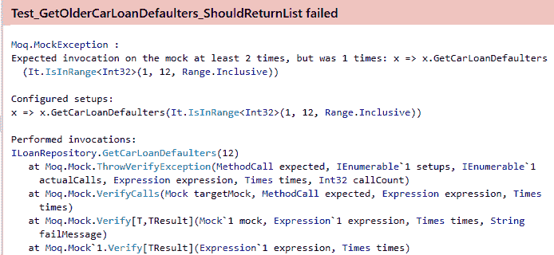
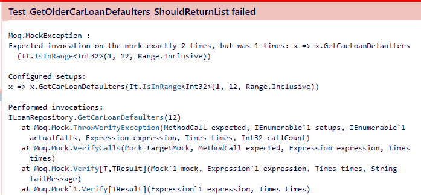

# 第六章：模拟依赖

在第五章中，我们讨论了使用 xUnit 框架进行数据驱动的单元测试，这使我们能够创建从不同来源（如平面文件、数据库或内联数据）获取数据的测试。现在，我们将解释模拟依赖的概念，并探讨如何使用 Moq 框架来隔离正在测试的类与其依赖关系，使用 Moq 创建的模拟对象。

在软件项目的代码库中通常存在对象依赖，无论是简单项目还是复杂项目。这是因为各种对象需要相互交互并在边界之间共享信息。然而，为了有效地对对象进行单元测试并隔离它们的行为，每个对象必须在隔离的环境中进行测试，而不考虑它们对其他对象的依赖。

为了实现这一点，类中的依赖对象被替换为模拟对象，以便在测试时能够有效地进行隔离测试，而无需经历构造依赖对象的痛苦，有时这些依赖对象可能并未完全实现，或者在编写被测试对象时构造它们可能是不切实际的。

**模拟对象**用于模拟真实对象以进行代码测试。模拟对象用于替换真实对象；它们是从真实接口或类创建的，并用于验证交互。模拟对象是另一个类中引用的必要实例，用于模拟这些类的行为。由于软件系统的组件需要相互交互和协作，模拟对象用于替换协作者。使用模拟对象时，可以验证使用是否正确且符合预期。模拟对象可以使用模拟框架或库创建，或者通过手工编写模拟对象的代码生成。

本章将详细探讨 Moq 框架，并将用它来创建模拟对象。Moq 是一个功能齐全的模拟框架，可以轻松设置。它可用于创建用于单元测试的模拟对象。Moq 具有模拟框架应具备的几个基本和高级特性，以创建有用的模拟对象，并基本上编写良好的单元测试。

本章将涵盖以下主题：

+   模拟对象的好处

+   模拟框架的缺点

+   手动编写模拟对象与使用模拟框架

+   使用 Moq 框架进行模拟对象

# 模拟对象的好处

在良好架构的软件系统中，通常有相互交互和协调以实现基于业务或自动化需求的设定目标的对象。这些对象往往复杂，并依赖于其他外部组件或系统，如数据库、SOAP 或 REST 服务，用于数据和内部状态更新。

大多数开发人员开始采用 TDD，因为它可以提供许多好处，并且意识到程序员有责任编写质量良好、无错误且经过充分测试的代码。然而，一些开发人员反对模拟对象，因为存在一些假设。例如，向单元测试中添加模拟对象会增加编写单元测试所需的总时间。这种假设是错误的，因为使用模拟对象提供了几个好处，如下节所述。

# 快速运行测试

单元测试的主要特征是它应该运行非常快，并且即使使用相同的数据集多次执行，也应该给出一致的结果。然而，为了有效地运行单元测试并保持具有高效和快速运行的单元测试的属性，重要的是在被测试的代码中存在依赖关系时设置模拟对象。

例如，在以下代码片段中，`LoanRepository`类依赖于 Entity Framework 的`DbContext`类，后者创建与数据库服务器的连接以进行数据库操作。要为`LoanRepository`类中的`GetCarLoans`方法编写单元测试，将需要构造`DbContext`对象。可以对`DbContext`对象进行模拟，以避免每次对该类运行单元测试时打开和关闭数据库连接的昂贵操作：

```cs
public class LoanRepository
{
    private DbContext dbContext;

    public LoanRepository(DbContext dbContext)
    {
        this.dbContext=dbContext;
    }

    public List<CarLoan> GetCarLoans()
    {
        return dbContext.CarLoan;
    }
}
```

在软件系统中，根据需求，将需要访问外部系统，如大型文件、数据库或 Web 连接。在单元测试中直接与这些外部系统交互会增加测试的运行时间。因此，最好对这些外部系统进行模拟，以便测试能够快速运行。当您有长时间运行的测试时，单元测试的好处可能会丧失，因为这显然会浪费生产时间。在这种情况下，开发人员可以停止运行测试，或者完全停止单元测试，并断言单元测试是浪费时间。

# 依赖项隔离

使用依赖项模拟，您在代码中实际上创建了依赖项的替代方案，可以进行实验。当您在适当位置有依赖项的模拟实现时，您可以进行更改并测试更改的效果，因为测试将针对模拟对象而不是真实对象运行。

当您将依赖项隔离时，您可以专注于正在运行的测试，从而将测试的范围限制在对测试真正重要的代码上。实质上，通过减少范围，您可以轻松重构被测试的代码以及测试本身，从而清晰地了解代码可以改进的地方。

为了在以下代码片段中隔离地测试`LoanRepository`类，可以对该类依赖的`DbContext`对象进行模拟。这将限制单元测试的范围仅限于`LoanRepository`类：

```cs
public class LoanRepository
{
    private DbContext dbContext;

    public LoanRepository(DbContext dbContext)
    {
        this.dbContext=dbContext;
    }
}
```

此外，通过隔离依赖项来保持测试范围较小，使得测试易于理解并促进了易于维护。通过不模拟依赖项来增加测试范围，最终会使测试维护变得困难，并减少测试的高级详细覆盖。由于必须对依赖项进行测试，这可能导致由于范围增加而导致测试的细节减少。

# 重构遗留代码

遗留源代码是由您或其他人编写的代码，通常没有测试或使用旧的框架、架构或技术。这样的代码库可能很难重写或维护。它有时可能是难以阅读和理解的混乱代码，因此很难更改。

面对维护遗留代码库的艰巨任务，特别是没有充分或适当测试的代码库，为这样的代码编写单元测试可能很困难，也可能是浪费时间，并且可能需要大量的辛苦工作。然而，使用模拟框架可以极大地简化重构过程，因为正在编写的新代码可以与现有代码隔离，并使用模拟对象进行测试。

# 更广泛的测试覆盖

通过模拟，您可以确保进行广泛的测试覆盖，因为您可以轻松使用模拟对象来模拟可能的异常、执行场景和条件，否则这些情况将很难实现。例如，如果您有一个清除或删除数据库表的方法，使用模拟对象测试这个方法比每次运行单元测试时在实时数据库上运行更安全。

# 模拟框架的缺点

虽然模拟框架在 TDD 期间非常有用，因为它们通过使用模拟对象简化了单元测试，但它们也有一些限制和缺点，可能会影响代码的设计，或者通过过度使用导致包含不相关模拟对象的混乱测试的创建。

# 接口爆炸

大多数嘲弄框架的架构要求必须创建接口来模拟对象。实质上，你不能直接模拟一个类；必须通过类实现的接口来进行。为了在单元测试期间模拟依赖关系，为每个要模拟的对象或依赖关系创建一个接口，即使在生产代码中使用该依赖关系时并不需要该接口。这导致创建了太多的接口，这种情况被称为**接口爆炸**。

# 额外的复杂性

大多数模拟框架使用反射或创建代理来调用方法并创建单元测试中所需的模拟。这个过程很慢，并给单元测试过程增加了额外的开销。特别是当希望使用模拟来模拟所有类和依赖关系之间的交互时，这一点尤其明显，这可能导致模拟返回其他模拟的情况。

# 模拟爆炸

有了几种模拟框架，更容易熟悉模拟概念并为单元测试创建模拟。然而，开发人员可能会开始过度模拟，即每个对象似乎都是模拟候选对象的情况。此外，拥有太多的模拟可能会导致编写脆弱的测试，使你的测试容易在接口更改时出现问题。当你有太多的模拟时，最终会减慢测试套件的速度，并因此增加开发时间。

# 手动编写模拟与使用模拟框架

使用模拟框架可以促进流畅的单元测试体验，特别是在单元测试具有依赖关系的代码部分时，模拟对象被创建并替代依赖关系。虽然使用模拟框架更容易，但有时你可能更喜欢手动编写模拟对象进行单元测试，而不向项目或代码库添加额外的复杂性或附加库。

手动编写的模拟是为了测试而创建的类，用于替换生产对象。这些创建的类将具有与生产类相同的方法和定义，以及返回值，以有效模拟生产类并用作单元测试中依赖关系的替代品。

# 模拟概念

创建模拟的第一步应该是识别依赖关系。单元测试的目标应该是编写清晰的代码，并尽可能快地运行具有良好覆盖率的测试。你应该识别可能减慢测试速度的依赖关系。例如，Web 服务或数据库调用就是模拟的候选对象。

创建模拟对象的方法可以根据被模拟的依赖关系的类型而变化。然而，模拟的概念可以遵循模拟对象在调用方法时应返回特定预定义值的基本概念。应该有适当的验证机制来确保模拟的方法被调用，并且如果根据测试要求进行配置，模拟对象可以抛出异常。

了解模拟对象的类型对于有效地手动编写模拟对象非常重要。可以创建两种类型的模拟对象——动态和静态模拟对象。**动态对象**可以通过反射或代理类创建。这类似于模拟框架的工作方式。**静态模拟对象**可以通过实现接口的类以及有时作为要模拟的依赖关系的实际具体类来创建。当你手动编写模拟对象时，实质上你正在创建静态模拟对象。

**反射**可以用来创建模拟对象。C#中的反射是一个有用的构造，允许你创建一个类型的实例对象，以及获取或绑定类型到现有对象，并调用类型中可用的字段和方法。此外，你可以使用反射来创建描述模块和程序集的对象。

# 手动编写模拟的好处

手动编写您的模拟有时可能是一种有效的方法，当您打算完全控制测试设置并指定测试设置的行为时。此外，当测试相对简单时，使用模拟框架不是一个选择；最好手动编写模拟并保持一切简单。

使用模拟框架时，对被模拟的真实对象进行更改将需要更改在其使用的任何地方的模拟对象。这是因为对依赖项进行的更改将破坏测试。例如，如果依赖对象上的方法名称发生更改，您必须在动态模拟中进行更改。因此，必须在代码库的几个部分进行更改。使用手动编写的模拟，您只需要在一个地方进行更改，因为您可以控制向测试呈现的方法。

# 模拟和存根

**模拟**和**存根**都很相似，因为它们用于替换类依赖项或协作者，并且大多数模拟框架都提供创建两者的功能。存根可以以与手动编写模拟相同的方式手动编写。

那么模拟和存根真正的区别是什么？模拟用于测试协作。这包括验证实际协作者的期望。模拟被编程为具有包含要接收的方法调用详细信息的期望，而存根用于模拟协作者。让我们通过一个例子进一步解释这一点。

存根可用于表示来自数据库的结果。可以创建一个 C#列表，其中包含可用于执行测试的数据，以替代数据库调用返回一组数据。如果未验证测试的依赖项交互上方的存根，则测试将仅关注数据。

以下片段中的`LoanService`类具有一个`GetBadCarLoans`方法，该方法接受要从数据库中检索的`Loan`对象列表：

```cs
public class LoanService
{    
    public List<Loan> GetBadCarLoans(List<Loan> carLoans)
    {
        List<Loan> badLoans= new List<Loan>();
        //do business logic computations on the loans
        return badLoans;
    }
}
```

以下片段中`Test_GetBadCarLoans_ShouldReturnLoans`的`GetBadCarLoans`方法的测试使用了存根，这是一个`Loan`对象列表，作为参数传递给`GetBadCarLoans`方法，而不是调用数据库以获取用于`Test`类的`Loan`对象列表：

```cs
[Fact]
 public void Test_GetBadCarLoans_ShouldReturnLoans()
 {
    List<Loan> loans= new List<Loan>();
    loans.Add(new Loan{Amount=120000, Rate=12.5, ServiceYear=5, HasDefaulted=false});
    loans.Add(new Loan{Amount=150000, Rate=12.5, ServiceYear=4, HasDefaulted=true});
    loans.Add(new Loan{Amount=200000, Rate=12.5, ServiceYear=5, HasDefaulted=false});

    LoanService loanService= new LoanService();
    List<Loan> badLoans = loanService.GetBadCarLoans(loanDTO);
    Assert.NotNull(badLoans);
 }
```

以下片段中的`LoanService`类具有连接到数据库以获取记录的`LoanRepository` DI。该类具有一个构造函数，在该构造函数中注入了`ILoanRepository`对象。`LoanService`类具有一个`GetBadCarLoans`方法，该方法调用依赖项上的`GetCarLoan`方法，后者又调用数据库获取`Loan`对象列表：

```cs
public class LoanService
{
    private ILoanRepository loanRepository;

    public LoanService(ILoanRepository loanRepository)
    {
        this.loanRepository=loanRepository;
    }

    public List<Loan> GetBadCarLoans()
    {
        List<Loan> badLoans= new List<Loan>();
        var carLoans=loanRepository.GetCarLoans();
        //do business logic computations on the loans
        return badLoans;
    }
}
```

与使用存根时不同，模拟将验证调用依赖项中的方法。这意味着模拟对象将设置依赖项中要调用的方法。在以下片段中的`LoanServiceTest`类中，从`ILoanRepository`创建了一个模拟对象：

```cs
 public class LoanServiceTest
 {
        private Mock<ILoanRepository> loanRepository;
        private LoanService loanService;
        public LoanServiceTest()
        {
            loanRepository= new Mock<ILoanRepository>();
            List<Loan> loans = new List<Loan>
            {
                new Loan{Amount = 120000, Rate = 12.5, ServiceYear = 5, HasDefaulted = false },
                new Loan {Amount = 150000, Rate = 12.5, ServiceYear = 4, HasDefaulted = true },
                new Loan { Amount = 200000, Rate = 12.5, ServiceYear = 5, HasDefaulted = false }
            };
            loanRepository.Setup(x => x.GetCarLoans()).Returns(loans);
            loanService= new LoanService(loanRepository.Object);
        }

        [Fact]
        public void Test_GetBadCarLoans_ShouldReturnLoans()
        {
            List<Loan> badLoans = loanService.GetBadCarLoans();
            Assert.NotNull(badLoans);
        }
    }
```

在`LoanServiceTest`类的构造函数中，首先创建了模拟对象要返回的数据，然后设置了依赖项中的方法，如`loanRepository.Setup(x => x.GetCarLoans()).Returns(loans);`。然后将模拟对象传递给`LoanService`构造函数，`loanService= new loanService(loanRepository.Object);`。

# 手动编写模拟

我们可以手动编写一个模拟对象来测试`LoanService`类。要创建的模拟对象将实现`ILoanRepository`接口，并且仅用于单元测试，因为在生产代码中不需要它。模拟对象将返回一个`Loan`对象列表，这将模拟对数据库的实际调用。

```cs
public class LoanRepositoryMock : ILoanRepository
{
    public List<Loan> GetCarLoans()
    {
        List<Loan> loans = new List<Loan>
        {
            new Loan{Amount = 120000, Rate = 12.5, ServiceYear = 5, HasDefaulted = false },
            new Loan {Amount = 150000, Rate = 12.5, ServiceYear = 4, HasDefaulted = true },
            new Loan { Amount = 200000, Rate = 12.5, ServiceYear = 5, HasDefaulted = false }
        };
        return loans;
    }
}
```

现在可以在`LoanService`类中使用创建的`LoanRepositoryMock`类来模拟`ILoanRepository`，而不是使用从模拟框架创建的模拟对象。在`LoanServiceTest`类的构造函数中，将实例化`LoanRepositoryMock`类并将其注入到`LoanService`类中，该类在`Test`类中使用：

```cs
public class LoanServiceTest
{
    private ILoanRepository loanRepository;
    private LoanService loanService;

    public LoanServiceTest()
    {
        loanRepository= new LoanRepositoryMock();
        loanService= new LoanService(loanRepository);
    }

    [Fact]
    public void Test_GetBadCarLoans_ShouldReturnLoans()
    {
        List<Loan> badLoans = loanService.GetBadCarLoans();
        Assert.NotNull(badLoans);
    }
}
```

因为`LoanRepositoryMock`被用作`ILoanRepository`接口的具体类，是`LoanService`类的依赖项，所以每当在`ILoanRepository`接口上调用`GetCarLoans`方法时，`LoanRepositoryMock`的`GetCarLoans`方法将被调用以返回测试运行所需的数据。

# 使用 Moq 框架模拟对象

选择用于模拟对象的模拟框架对于顺利进行单元测试是很重要的。然而，并没有必须遵循的书面规则。在选择用于测试的模拟框架时，您可以考虑一些因素和功能。

在选择模拟框架时，性能和可用功能应该是首要考虑因素。您应该检查模拟框架创建模拟的方式；使用继承、虚拟和静态方法的框架无法被模拟。要注意的其他功能可能包括方法、属性、事件，甚至是框架是否支持 LINQ。

此外，没有什么比库的简单性和易用性更好。您应该选择一个易于使用的框架，并且具有良好的可用功能文档。在本章的后续部分中，将使用 Moq 框架来解释模拟的其他概念，这是一个易于使用的强类型库。

使用 Moq 时，模拟对象是一个实际的虚拟类，它是使用反射为您创建的，其中包含了被模拟的接口中包含的方法的实现。在 Moq 设置中，您将指定要模拟的接口以及测试类需要有效运行测试的方法。

要使用 Moq，您需要通过 NuGet 包管理器或 NuGet 控制台安装该库：

```cs
Install-Package Moq
```

为了解释使用 Moq 进行模拟，让我们创建一个`ILoanRepository`接口，其中包含两种方法，`GetCarLoan`用于从数据库中检索汽车贷款列表，以及`GetLoanTypes`方法，用于返回`LoanType`对象的列表：

```cs
public interface ILoanRepository
{
   List<LoanType> GetLoanTypes();
   List<Loan> GetCarLoans();
}
```

`LoanRepository`类使用 Entity Framework 作为数据访问和检索的 ORM，并实现了`ILoanRepository`。`GetLoanTypes`和`GetCarLoans`两种方法已经被`LoanRepository`类实现：

```cs
public class LoanRepository :ILoanRepository
{
    public List<LoanType> GetLoanTypes()
    {
        List<LoanType> loanTypes= new List<LoanType>();
        using (LoanContext context = new LoanContext())
        {
            loanTypes=context.LoanType.ToList();
        }
        return loanTypes;
    }

    public List<Loan> GetCarLoans()
    {
        List<Loan> loans = new List<Loan>();
        using (LoanContext context = new LoanContext())
        {
            loans = context.Loan.ToList();
        }
        return loans;
    }
}
```

让我们为`ILoanRepository`创建一个模拟对象，以便在不依赖任何具体类实现的情况下测试这两种方法。

使用 Moq 很容易创建一个模拟对象：

```cs
Mock<ILoanRepository> loanRepository = new Mock<ILoanRepository>();
```

在上一行代码中，已经创建了一个实现`ILoanRepository`接口的模拟对象。该对象可以被用作`ILoanRepository`的常规实现，并注入到任何具有`ILoanRepository`依赖的类中。

# 模拟方法、属性和回调

在测试中使用模拟对象的方法之前，它们需要被设置。这个设置最好是在测试类的构造函数中完成，模拟对象创建后，但在将对象注入到需要依赖的类之前。

首先，需要创建要由设置的方法返回的数据；这是测试中要使用的虚拟数据：

```cs
List<Loan> loans = new List<Loan>
{
    new Loan{Amount = 120000, Rate = 12.5, ServiceYear = 5, HasDefaulted = false },
    new Loan {Amount = 150000, Rate = 12.5, ServiceYear = 4, HasDefaulted = true },
    new Loan { Amount = 200000, Rate = 12.5, ServiceYear = 5, HasDefaulted = false }
};
```

在设置方法的时候，返回数据将被传递给它，以及任何方法参数（如果适用）。在下一行代码中，`GetCarLoans`方法被设置为以`Loan`对象的列表作为返回数据。这意味着每当在单元测试中使用模拟对象调用`GetCarLoans`方法时，之前创建的列表将作为方法的返回值返回：

```cs
Mock<ILoanRepository> loanRepository = new Mock<ILoanRepository>();
loanRepository.Setup(x => x.GetCarLoans()).Returns(loans);
```

您可以对方法返回值进行延迟评估。这是使用 LINQ 提供的语法糖：

```cs
loanRepository.Setup(x => x.GetCarLoans()).Returns(() => loans);
```

Moq 有一个`It`对象，它可以用来指定方法中参数的匹配条件。`It`指的是被匹配的参数。假设`GetCarLoans`方法有一个字符串参数`loanType`，那么方法设置的语法可以改变以包括参数和返回值：

```cs
loanRepository.Setup(x => x.GetCarLoans(It.IsAny<string>())).Returns(loans);
```

可以设置一个方法，每次调用时返回不同的返回值。例如，可以设置`GetCarLoans`方法的设置，以便在每次调用该方法时返回不同大小的列表：

```cs
Random random = new Random();
loanRepository.Setup(x => x.GetCarLoans()).Returns(loans).Callback(() => loans.GetRange(0,random.Next(1, 3));
```

在上面的片段中，生成了`1`和`3`之间的随机数，以设置。这将确保由`GetCarLoans`方法返回的列表的大小随每次调用而变化。第一次调用`GetCarLoans`方法时，将调用`Returns`方法，而在随后的调用中，将执行`Callback`中的代码。

Moq 的一个特性是提供异常测试的功能。您可以设置方法以测试异常。在以下方法设置中，当调用时，`GetCarLoans`方法会抛出`InvalidOperationException`：

```cs
loanRepository.Setup(x => x.GetCarLoans()).Throws<InvalidOperationException>();
```

# 属性

如果您有一个具有要在方法调用中使用的属性的依赖项，可以使用 Moq 的`SetupProperty`方法为这些属性设置虚拟值。让我们向`ILoanRepository`接口添加两个属性，`LoanType`和`Rate`：

```cs
public interface ILoanRepository
{
   LoanType LoanType{get;set;}
   float Rate {get;set;}

   List<LoanType> GetLoanTypes();
   List<Loan> GetCarLoans();
}
```

使用 Moq 的`SetupProperty`方法，您可以指定属性应具有的行为，这实质上意味着每当请求属性时，将返回在`SetupProperty`方法中设置的值：

```cs
Mock<ILoanRepository> loanRepository = new Mock<ILoanRepository>();
loanRepository.Setup(x => x.LoanType, LoanType.CarLoan);
loanRepository.Setup(x => x.Rate, 12.5);
```

在上面的片段中的代码将`LoanType`属性设置为枚举值`CarLoan`，并将`Rate`设置为`12.5`。在测试中请求属性时，将返回设置的值到调用点。

使用`SetupProperty`方法设置属性会自动将属性设置为存根，并允许跟踪属性的值并为属性提供默认值。

此外，在设置属性时，还可以使用`SetupSet`方法，该方法接受 lambda 表达式来指定对属性设置器的调用类型，并允许您将值传递到表达式中：

```cs
loanRepository.SetupSet(x => x.Rate = 12.5F);
```

`SetupSet`类似于`SetupGet`，用于为属性的调用指定类型的设置：

```cs
loanRepository.SetupGet(x => x.Rate);
```

递归模拟允许您模拟复杂的对象类型，特别是嵌套的复杂类型。例如，您可能希望模拟`Loan`类型中`Person`复杂类型的`Age`属性。Moq 框架可以以优雅的方式遍历此图以模拟属性：

```cs
loanRepository.SetupSet(x => x.CarLoan.Person.Age= 40);
```

您可以使用`SetupAllProperties`方法存根模拟对象上的所有属性。此方法将指定模拟上的所有属性都具有属性行为设置。通过在模拟中为每个属性生成默认值，使用 Moq 框架的`Mock.DefaultProperty`属性生成默认属性：

```cs
 loanRepository.SetupAllProperties();
```

# 匹配参数

在使用 Moq 创建模拟对象时，您可以匹配参数以确保在测试期间传递了预期的参数。使用此功能，您可以确定在测试期间调用方法时传递的参数的有效性。这仅适用于具有参数的方法，并且匹配将在方法设置期间进行。

使用 Moq 的`It`关键字，您可以在设置期间为方法参数指定不同的表达式和验证。让我们向`ILoanRepository`接口添加一个`GetCarLoanDefaulters`方法定义。`LoanRepository`类中的实现接受一个整数参数，该参数是贷款的服务年限，并返回汽车贷款拖欠者的列表。以下片段显示了`GetCarLoanDefaulters`方法的代码：

```cs
public List<Person> GetCarLoanDefaulters(int year)
{
    List<Person> defaulters = new List<Person>();
    using (LoanContext context = new LoanContext())
    {
        defaulters = context.Loan.Where(c => c.HasDefaulted 
                     && c.ServiceYear == year).Select(c => c.Person).ToList();
    }
    return defaulters;
}
```

现在，让我们在`LoanServiceTest`构造函数中设置`GetCarLoanDefaulters`方法，以使用 Moq 的`It`关键字接受不同的`year`参数值：

```cs
List<Person> people = new List<Person>
{
    new Person { FirstName = "Donald", LastName = "Duke", Age =30},
    new Person { FirstName = "Ayobami", LastName = "Adewole", Age =20}
};

Mock<ILoanRepository> loanRepository = new Mock<ILoanRepository>();
loanRepository.Setup(x => x.GetCarLoanDefaulters(It.IsInRange<int>(1, 5, Range.Inclusive))).Returns(people);
```

已创建了一个`Person`对象列表，将传递给模拟设置的`Returns`方法。`GetCarLoanDefaulters`方法现在将接受指定范围内的值，因为`It.IsInRange`方法已经使用了上限和下限值。

`It` 类有其他有用的方法，用于在设置期间指定方法的匹配条件，而不必指定特定的值：

+   `IsRegex` 用于指定一个正则表达式来匹配一个字符串参数

+   `Is` 用于指定与给定谓词匹配的值

+   `IsAny<>` 用于匹配指定类型的任何值

+   `Ref<>` 用于匹配在 `ref` 参数中指定的任何值

您可以创建一个自定义匹配器，并在方法设置中使用它。例如，让我们为 `GetCarLoanDefaulters` 方法创建一个自定义匹配器 `IsOutOfRange`，以确保不会提供大于 `12` 的值作为参数。通过使用 `Match.Create` 来创建自定义匹配器：

```cs
public int IsOutOfRange() 
{ 
  return Match.Create<int>(x => x > 12);
}
```

现在可以在模拟对象的方法设置中使用创建的 `IsOutOfRange` 匹配器：

```cs
loanRepository.Setup(x => x.GetCarLoanDefaulters(IsOutOfRange())).Throws<ArgumentException>();
```

# 事件

Moq 有一个功能，允许您在模拟对象上引发事件。要引发事件，您使用 `Raise` 方法。该方法有两个参数。第一个是 Lambda 表达式，用于订阅事件以在模拟上引发事件。第二个参数提供将包含在事件中的参数。要在 `loanRepository` 模拟对象上引发 `LoanDefaulterNotification` 事件，并使用空参数，您可以使用以下代码行：

```cs
Mock<ILoanRepository> loanRepository = new Mock<ILoanRepository>();
loanRepository.Raise(x => x.LoanDefaulterNotification+=null, EventArgs.Empty);
```

真实用例是当您希望模拟对象响应动作引发事件或响应方法调用引发事件时。在模拟对象上设置方法以允许引发事件时，模拟上的 `Returns` 方法将被替换为 `Raises` 方法，该方法指示在测试中调用方法时，应该引发事件：

```cs
loanRepository.Setup(x => x.GetCarLoans()).Raises(x=> x.LoanDefaulterNotification+=null, new LoanDefualterEventArgs{OK=true});
```

# 回调

使用 Moq 的 `Callback` 方法，您可以指定在调用方法之前和之后要调用的回调。有一些测试场景可能无法使用简单的模拟期望轻松测试。在这种复杂的情况下，您可以使用回调来执行特定的操作，当调用模拟对象时。`Callback` 方法接受一个动作参数，根据回调是在方法调用之前还是之后设置，将执行该动作。该动作可以是要评估的表达式或要调用的另一个方法。

例如，您可以设置一个回调，在调用特定方法之后更改数据。此功能允许您创建提供更大灵活性的测试，同时简化测试复杂性。让我们向 `loanRepository` 模拟对象添加一个回调。

回调可以是一个将被调用的方法，或者是您需要设置值的属性：

```cs
List<Person> people = new List<Person>
{
    new Person { FirstName = "Donald", LastName = "Duke", Age =30},
    new Person { FirstName = "Ayobami", LastName = "Adewole", Age =20}
};

Mock<ILoanRepository> loanRepository = new Mock<ILoanRepository>();

loanRepository.Setup(x => x.GetCarLoanDefaulters())
.Callback(() => CarLoanDefaultersCallbackAfter ())
.Returns(() => people)
.Callback(() => CarLoanDefaultersCallbackAfter());
```

上面的片段为方法设置设置了两个回调。`CarLoanDefaultersCallback` 方法在实际调用 `GetCarLoanDefaulters` 方法之前被调用，`CarLoanDefaultersCallbackAfter` 在在模拟对象上调用 `GetCarLoanDefaulters` 方法之后被调用。`CarLoanDefaultersCallback` 向 `List` 添加一个新的 `Person` 对象，`CarLoanDefaultersCallback` 删除列表中的第一个元素：

```cs
public void CarLoanDefaultersCallback()
{
    people.Add(new Person { FirstName = "John", LastName = "Doe", Age =40});
}

public void CarLoanDefaultersCallbackAfter()
{
    people.RemoveAt(0);
}
```

# 模拟定制

在使用 Moq 框架时，您可以进一步定制模拟对象，以增强有效的单元测试体验。可以将 `MockBehavior` 枚举传递到 Moq 的 `Mock` 对象构造函数中，以指定模拟的行为。枚举成员有 `Default`、`Strict` 和 `Loose`：

```cs
loanRepository= new Mock<ILoanRepository>(MockBehavior.Loose);
```

当选择 `Loose` 成员时，模拟将不会抛出任何异常。默认值将始终返回。这意味着对于引用类型，将返回 null，对于值类型，将返回零或空数组和可枚举类型：

```cs
loanRepository= new Mock<ILoanRepository>(MockBehavior.Strict);
```

选择 `Strict` 成员将使模拟对于每次在模拟上没有适当设置的调用都抛出异常。最后，`Default` 成员是模拟的默认行为，从技术上讲等同于 `Loose` 枚举成员。

# CallBase

在模拟构造期间初始化`CallBase`时，用于指定是否在没有匹配的设置时调用基类虚拟实现。默认值为`false`。这在模拟`System.Web`命名空间的 HTML/web 控件时非常有用：

```cs
loanRepository= new Mock<ILoanRepository>{CallBase=true};
```

# 模拟存储库

通过使用 Moq 中的`MockRepository`，可以避免在测试中分散创建模拟对象的代码，从而避免重复的代码。`MockRepository`可用于在单个位置创建和验证模拟，从而确保您可以通过设置`CallBase`、`DefaultValue`和`MockBehavior`进行模拟配置，并在一个地方验证模拟：

```cs
var mockRepository = new MockRepository(MockBehavior.Strict) { DefaultValue = DefaultValue.Mock };
var loanRepository = repository.Create<ILoanRepository>(MockBehavior.Loose);
var userRepository = repository.Create<IUserRepository>();
mockRepository.Verify();
```

在上述代码片段中，使用`MockBehaviour.Strict`创建了一个模拟存储库，并创建了两个模拟对象，每个对象都使用`loanRepository`模拟，覆盖了存储库中指定的默认`MockBehaviour`。最后一条语句是对`Verify`方法的调用，以验证存储库中创建的所有模拟对象的所有期望。

# 在模拟中实现多个接口

此外，您可以在单个模拟中实现多个接口。例如，我们可以创建一个模拟，实现`ILoanRepository`，然后使用`As<>`方法实现`IDisposable`接口，该方法用于向模拟添加接口实现并为其指定设置：

```cs
var loanRepository = new Mock<ILoanRepository>();
loanRepository.Setup(x => x.GetCarLoanDefaulters(It.IsInRange<int>(1, 5, Range.Inclusive))).Returns(people);

loanRepository.As<IDisposable>().Setup(disposable => disposable.Dispose());
```

# 使用 Moq 进行验证的方法和属性调用

模拟行为在设置期间指定。这是对象和协作者的预期行为。在单元测试时，模拟不完整，直到验证了所有模拟依赖项的调用。了解方法执行的次数或属性访问的次数可能会有所帮助。

Moq 框架具有有用的验证方法，可用于验证模拟的方法和属性。此外，`Times`结构包含有用的成员，显示可以在方法上允许的调用次数。

`Verify`方法可用于验证在模拟上执行的方法调用及提供的参数是否与先前在模拟设置期间配置的内容匹配，并且使用了默认的`MockBehaviour`，即`Loose`。为了解释 Moq 中的验证概念，让我们创建一个依赖于`ILoanRepository`的`LoanService`类，并向其添加一个名为`GetOlderCarLoanDefaulters`的方法，以返回年龄大于`20`岁的贷款拖欠人的列表。`ILoanRepository`通过构造函数注入到`LoanService`中：

```cs
public class LoanService
{
    private ILoanRepository loanRepository;
    public LoanService(ILoanRepository loanRepository)
    {
        this.loanRepository = loanRepository;
    }

    public List<Person> GetOlderCarLoanDefaulters(int year)
    {
        List<Person> defaulters = loanRepository.GetCarLoanDefaulters(year);
        var filteredDefaulters = defaulters.Where(x => x.Age > 20).ToList();
        return filteredDefaulters;
    }
}
```

为了测试`LoanService`类，我们将创建一个`LoanServiceTest`测试类，该类使用依赖模拟来隔离`LoanService`进行单元测试。`LoanServiceTest`将包含一个构造函数，用于设置`LoanService`类所需的`ILoanRepository`的模拟：

```cs
public class LoanServiceTest
{
    private Mock<ILoanRepository> loanRepository;
    private LoanService loanService;
    public  LoanServiceTest()
    {
        loanRepository= new Mock<ILoanRepository>();
        List<Person> people = new List<Person>
        {
            new Person { FirstName = "Donald", LastName = "Duke", Age =30},
            new Person { FirstName = "Ayobami", LastName = "Adewole", Age =20}
        };
        loanRepository.Setup(x => x.GetCarLoanDefaulters(It.IsInRange<int>(1,12,Range.Inclusive))).Returns(() => people);
        loanService = new LoanService(loanRepository.Object);
   }
}
```

`LoanServiceTest`构造函数包含对`ILoanRepository`接口的`GetCarLoanDefaulters`方法的模拟设置，包括参数期望和返回值。让我们创建一个名为`Test_GetOlderCarLoanDefaulters_ShouldReturnList`的测试方法，以测试`GetCarLoanDefaulters`。在断言语句之后，有`Verify`方法来检查`GetCarLoanDefaulters`是否被调用了一次：

```cs
[Fact]
public void Test_GetOlderCarLoanDefaulters_ShouldReturnList()
{
    List<Person> defaulters = loanService.GetOlderCarLoanDefaulters(12);
    Assert.NotNull(defaulters);
    Assert.All(defaulters, x => Assert.Contains("Donald", x.FirstName));
    loanRepository.Verify(x => x.GetCarLoanDefaulters(It.IsInRange<int>(1, 12, Range.Inclusive)), Times.Once());
}
```

`Verify`方法接受两个参数：要验证的方法和`Time`结构。使用了`Time.Once`，指定模拟方法只能被调用一次。

`Times.AtLeast(int callCount)`用于指定模拟方法应该被调用的最小次数，该次数由`callCount`参数的值指定。这可用于验证方法被调用的次数：

```cs
[Fact]
public void Test_GetOlderCarLoanDefaulters_ShouldReturnList()
{
    List<Person> defaulters = loanService.GetOlderCarLoanDefaulters(12);
    Assert.NotNull(defaulters);
    Assert.All(defaulters, x => Assert.Contains("Donald", x.FirstName));
    loanRepository.Verify(x => x.GetCarLoanDefaulters(It.IsInRange<int>(1, 12, Range.Inclusive)), Times.AtLeast(2));
}
```

在上述测试片段中，将`Times.AtLeast(2)`传递给`Verify`方法。当运行测试时，由于被测试的代码中的`GetCarLoanDefaulters`方法只被调用了一次，测试将失败，并显示`Moq.MoqException`。



`Times.AtLeastOnce`可用于指定模拟方法应至少调用一次，这意味着该方法可以在被测试的代码中被多次调用。我们可以修改`Test_GetOlderCarLoanDefaulters_ShouldReturnList`中的`Verify`方法，以将第二个参数设置为`Time.AtLeastOnce`，以验证测试运行后`GetCarLoanDefaulters`至少在被测试的代码中被调用一次：

```cs
[Fact]
public void Test_GetOlderCarLoanDefaulters_ShouldReturnList()
{
    List<Person> defaulters = loanService.GetOlderCarLoanDefaulters(12);
    Assert.NotNull(defaulters);
    Assert.All(defaulters, x => Assert.Contains("Donald", x.FirstName));
    loanRepository.Verify(x => x.GetCarLoanDefaulters(It.IsInRange<int>(1, 12, Range.Inclusive)), Times.AtLeastOnce);
}
```

`Times.AtMost(int callCount)`可用于指定在被测试的代码中应调用模拟方法的最大次数。 `callCount`参数用于传递方法的最大调用次数的值。这可用于限制允许对模拟方法的调用。如果调用方法的次数超过指定的`callCount`值，则会抛出 Moq 异常：

```cs
loanRepository.Verify(x => x.GetCarLoanDefaulters(It.IsInRange<int>(1, 12, Range.Inclusive)), Times.AtMost(1));
```

`Times.AtMostOnce`类似于`Time.Once`或`Time.AtLeastOnce`，但不同之处在于模拟方法最多只能调用一次。如果方法被调用多次，则会抛出 Moq 异常，但如果在运行代码时未调用该方法，则不会抛出异常：

```cs
loanRepository.Verify(x => x.GetCarLoanDefaulters(It.IsInRange<int>(1, 12, Range.Inclusive)), Times.AtMostOnce);
```

`Times.Between(callCountFrom,callCountTo, Range)`可用于在`Verify`方法中指定模拟方法应在`callCountFrom`和`callCountTo`之间调用，并且`Range`枚举用于指定是否包括或排除指定的范围：

```cs
loanRepository.Verify(x => x.GetCarLoanDefaulters(It.IsInRange<int>(1, 12, Range.Inclusive)), Times.Between(1,2,Range.Inclusive));
```

`Times.Exactly(callCount)`在您希望指定模拟方法应在指定的`callCount`处调用时非常有用。如果模拟方法的调用次数少于指定的`callCount`或多次，将生成 Moq 异常，并提供期望和失败的详细描述：

```cs
[Fact]
public void Test_GetOlderCarLoanDefaulters_ShouldReturnList()
{
    List<Person> defaulters = loanService.GetOlderCarLoanDefaulters(12);
    Assert.NotNull(defaulters);
    Assert.All(defaulters, x => Assert.Contains("Donald", x.FirstName));
    loanRepository.Verify(x => x.GetCarLoanDefaulters(It.IsInRange<int>(1, 12, Range.Inclusive)), Times.Exactly(2));
}
```

现在让我们检查代码：



还有一个重要的是`Times.Never`。当使用时，它可以验证模拟方法从未被使用。当您不希望调用模拟方法时，可以使用此选项：

```cs
loanRepository.Verify(x => x.GetCarLoanDefaulters(It.IsInRange<int>(1, 12, Range.Inclusive)), Times.Never);
```

模拟属性验证与使用`VerifySet`和`VerifyGet`方法的模拟方法类似进行。`VerifySet`方法用于验证在模拟对象上设置了属性。此外，`VerifyGet`方法用于验证在模拟对象上读取了属性，而不管属性中包含的值是什么：

```cs
loanRepository.VerifyGet(x => x.Rate);
```

要验证在模拟对象上设置了属性，而不管设置了什么值，可以使用`VerifySet`方法，语法如下：

```cs
loanRepository.VerifySet(x => x.Rate);
```

有时，您可能希望验证在模拟对象上分配了特定值给属性。您可以通过将值分配给`VerifySet`方法中的属性来执行此操作：

```cs
loanRepository.VerifySet(x => x.Rate = 12.5);
```

Moq 4.8 中引入的`VerifyNoOtherCalls()`方法可用于确定除了已经验证的调用之外没有进行其他调用。`VerifyAll()`方法用于验证所有期望，无论它们是否已被标记为可验证。

# LINQ 到模拟

**语言集成查询**（**LINQ**）是在.NET 4.0 中引入的一种语言构造，它提供了.NET Framework 中的查询功能。 LINQ 具有以声明性查询语法编写的查询表达式。有不同的 LINQ 实现-LINQ 到 XML，用于查询 XML 文档，LINQ 到实体，用于 ADO.NET 实体框架操作，LINQ 到对象用于查询.NET 集合，文件，字符串等。

在本章中，我们使用 Lambda 表达式语法创建了模拟对象。 Moq 框架中提供的另一个令人兴奋的功能是**LINQ 到模拟**，它允许您使用类似 LINQ 的语法设置模拟。

LINQ 到模拟非常适用于简单的模拟，并且在您真的不关心验证依赖关系时。使用`Of<>`方法，您可以创建指定类型的模拟对象。

您可以使用 LINQ 到模拟来在单个模拟和递归模拟上进行多个设置，使用类似 LINQ 的语法：

```cs
 var loanRepository = Mock.Of<ILoanRepository>
                    (x => x.Rate==12.5F &&
                         x.LoanType.Name=="CarLoan"&& LoanType.Id==3 );
```

在前面的模拟初始化中，`Rate`和`LoanType`属性被设置为存根，在测试调用期间访问这些属性时，它们将使用属性的默认值。

# 高级的 Moq 功能

有时，Moq 提供的默认值可能不适用于某些测试场景，您需要创建自定义的默认值生成方法来补充 Moq 当前提供的`DefaultValue.Empty`和`DefaultValue.Mock`。这可以通过扩展 Moq 4.8 及更高版本中提供的`DefaultValueProvider`或`LookupOrFallbackDefaultValueProvider`来实现：

```cs
public class TestDefaultValueProvider : LookupOrFallbackDefaultValueProvider
{
    public TestDefaultValueProvider()
    {
        base.Register(typeof(string), (type, mock) => string.empty);
        base.Register(typeof(List<>), (type, mock) => Activator.CreateInstance(type));
    }
}
```

`TestDefaultValueProvider`类创建了子类`LookupOrFallbackDefaultValueProvider`，并为`string`和`List`的默认值进行了实现。对于任何类型的`string`，都将返回`string.empty`，并创建一个空列表，其中包含任何类型的`List`。`TestDefaultValueProvider`现在可以在`Mock`构造函数中用于模拟创建：

```cs
var loanRepository = new Mock<ILoanRepository> { DefaultValueProvider = new TestDefaultValueProvider()};
var objectName = loanRepository.Object.Name;
```

在前面的代码片段中，`objectName`变量将包含一个零长度的字符串，因为`TestDefaultValueProvider`中的实现表明应该为`string`类型分配一个空字符串。

# 模拟内部类型

根据项目的要求，您可能需要为内部类型创建模拟对象。在 C#中，内部类型或成员只能在同一程序集中的文件中访问。可以通过向相关项目的`AssemblyInfo.cs`文件添加自定义属性来模拟内部类型。

如果包含内部类型的程序集尚未具有`AssemblyInfo.cs`文件，您可以添加它。此外，当程序集没有强名称时，您可以添加`InternalsVisibleTo`属性，其中排除了公钥。您必须指定要与之共享可见性的项目名称，在这种情况下应该是测试项目。

如果将`LoanService`的访问修饰符更改为 internal，您将收到错误消息，`LoanService`由于其保护级别而无法访问。为了能够测试`LoanService`，而不更改访问修饰符，我们需要将`AssemblyInfo.cs`文件添加到项目中，并添加所需的属性，指定测试项目名称，以便与包含`LoanService`的程序集共享：


`AssemblyInfo.cs`文件中添加的属性如下所示：

```cs
[assembly:InternalsVisibleTo("LoanApplication.Tests.Unit")
```

# 总结

Moq 框架与 xUnit.net 框架一起使用时，可以提供流畅的单元测试体验，并使整个 TDD 过程变得有价值。Moq 提供了强大的功能，有效使用时，可以简化单元测试的依赖项模拟的创建。

使用 Moq 创建的模拟对象可以让您在单元测试中替换具体的依赖项，以便通过您创建的模拟对象来隔离代码中的不同单元进行测试和后续重构，这有助于编写优雅的生产就绪代码。此外，您可以使用模拟对象来实验和测试依赖项中可用的功能，否则可能无法轻松地使用实际依赖项来完成。

在本章中，我们探讨了模拟的基础知识，并在单元测试中广泛使用了模拟。此外，我们配置了模拟以设置方法和属性，并返回异常。还解释了 Moq 库提供的一些其他功能，并介绍了模拟验证。

项目托管和持续集成将在下一章中介绍。这将包括测试和企业方法来自动运行测试，以确保能够提供有关代码覆盖率的质量反馈。
