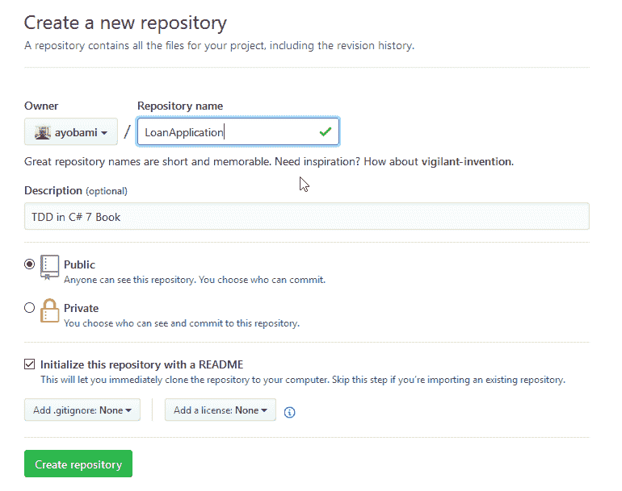
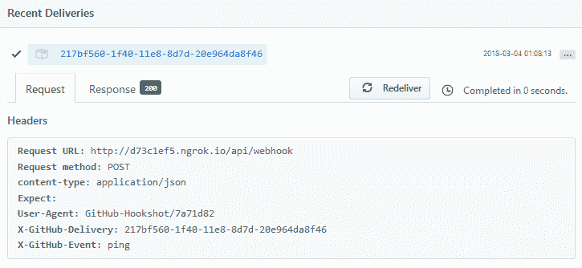
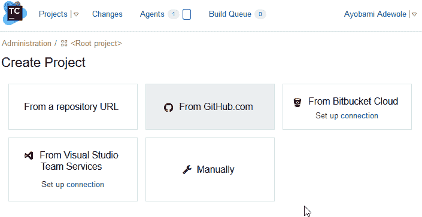
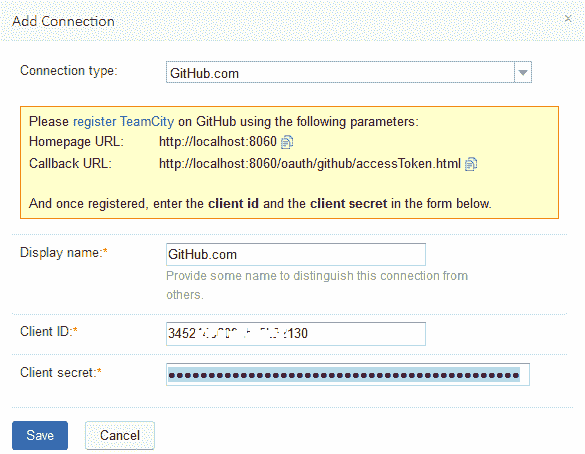
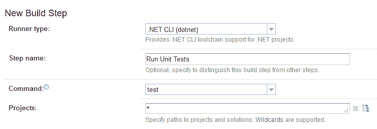

# 第七章：持续集成和项目托管

在第四章中，我们探讨了.NET Core 和 C#可用的各种单元测试框架，然后详细探讨了 xUnit.net 框架。然后我们转向第五章中的数据驱动单元测试，这有助于创建可以使用来自不同数据源加载的数据执行的单元测试。在第六章中，我们详细解释了依赖项模拟，其中我们通过*Moq 框架*创建了模拟对象。

有效的 TDD 实践可以帮助提供有用和深刻的反馈，评估软件项目的代码库质量。通过持续集成，构建自动化和代码自动化测试的过程被提升到了一个新的水平，允许开发团队充分利用现代源代码版本控制系统中提供的基本和高级功能。

正确的持续集成设置和实践会产生有益的持续交付，使软件项目的开发过程能够在项目的生命周期中被交付或部署到生产环境。

在本章中，我们将探讨持续集成和持续交付的概念。本章将涵盖以下主题：

+   持续集成

+   持续交付

+   GitHub 在线项目托管

+   基本的 Git 命令

+   配置 GitHub WebHooks

+   TeamCity 持续集成平台

# 持续集成

**持续集成**（**CI**）是软件开发实践，软件项目的源代码每天由软件开发团队的成员集成到存储库中。最好在开发过程的早期阶段开始。代码集成通常由 CI 工具执行，该工具使用自动构建脚本对代码进行验证。

在开发团队中，通常有多个开发人员在项目的不同部分上工作，项目的源代码托管在存储库中。每个开发人员可以在他们的计算机上拥有主分支或主线的本地版本或工作副本。

负责某个功能的开发人员会对本地副本进行更改，并使用一组准备好的自动化测试来测试代码，以确保代码能够正常工作并不会破坏任何现有的工作功能。一旦可以验证，本地副本将更新为存储库中的最新版本。如果更新导致任何冲突，这些冲突需要在最终提交或集成工作之前解决。

源代码存储库通过保留源文件的快照和版本以及随时间所做的更改，有助于充分对项目的代码库进行版本控制。开发人员可以在必要时恢复或检出以前的提交版本。存储库可以在团队基础设施上本地托管，例如拥有现场**Microsoft Team Foundation Server**或云存储库，例如**GitHub**、**Bitbucket**和其他许多存储库。

# CI 工作流

CI 要求建立适当的工作流程。CI 的第一个重要组成部分是建立一个可工作的源代码存储库。这是为了跟踪项目贡献者所做的所有更改，并协调不同的活动。

为了实现一个稳健和有效的 CI 设置，需要涵盖并正确设置以下领域。

# 单一的源代码存储库

为了有效地使用源代码存储库，所有成功构建项目的所需文件都应该放在一个单一的源代码存储库中。这些文件应该包括源文件、属性文件、数据库脚本和架构，以及第三方库和使用的资产。

其他配置文件也可以放在存储库中，特别是开发环境配置。这将确保项目上的开发人员拥有一致的环境设置。开发团队的新成员可以轻松地使用存储库中可用的配置来设置他们的环境。

# 构建自动化

CI 工作流程的构建自动化步骤是为了确保项目代码库中的更改被检测并自动进行测试和构建。构建自动化通常是通过构建脚本完成的，这些脚本分析需要进行的更改和编译。源代码应该经常构建，最好是每天或每晚。提交的成功与否是根据代码库是否成功构建来衡量的。

构建自动化脚本应该能够在有或没有测试的情况下构建系统。这应该在构建中进行配置。无论开发人员的集成开发环境是否具有内置的构建管理，都应该在服务器上配置一个中央构建脚本，以确保项目可以构建并在开发服务器上轻松运行。

# 自动化测试

代码库应该具有自动化测试，覆盖了大部分可能的测试组合，使用相关的测试数据。自动化测试应该使用适当的测试框架，可以覆盖软件项目的所有层或部分。

通过适当的自动化测试，源代码中的错误可以在自动化构建脚本运行时轻松被检测到。将自动化测试整合到构建过程中将确保良好的测试覆盖率，并提供失败或通过测试的报告，以便便于重构代码。

# 相同的测试和生产环境

为了确保顺利的 CI 体验，重要的是要确保测试和生产环境是相同的。两个环境应该具有类似的硬件和操作系统配置，以及环境设置。

此外，对于使用数据库的应用程序，测试和生产环境应该具有相同的版本。运行时和库也应该是相似的。然而，有时可能无法在每个生产环境实例中进行测试，比如桌面应用程序，但必须确保在测试中使用生产环境的副本。

# 每日提交

代码库的整体健康状况取决于成功运行的构建过程。项目的主干应该经常更新，以便开发人员提交。提交代码的开发人员有责任确保在推送到存储库之前对代码进行测试。

在开发人员的提交导致构建失败的情况下，不应该拖延。可以回滚以在提交更改之前独立修复问题。项目的主干或主分支应该始终保持良好状态。通常更喜欢每日提交更改。

# CI 的好处

将 CI 纳入开发流程中对开发团队非常有价值。CI 流程提供了许多好处，下面将解释其中一些。

# 快速发现错误

通过 CI 流程，自动化测试经常运行，可以及时发现并修复错误，从而产生高质量的健壮系统。CI 不会自动消除系统中的错误；开发人员必须努力编写经过充分测试的清洁代码。然而，CI 可以促进及时发现本来可能会进入生产环境的错误。

# 提高生产力

通过 CI，开发团队的整体生产力可以得到提高，因为开发人员可以摆脱单调或手动的任务，这些任务已经作为 CI 过程的一部分自动化了。开发人员可以专注于开发系统的功能。

# 降低风险

有时，由于固有的复杂性，软件项目往往会因为对需求的低估和其他问题而超出预算和时间表。CI 可以帮助减少与软件开发相关的风险。通过频繁的代码提交和集成，可以建立项目状态的更清晰的图像，并且可以轻松地隔离和处理任何潜在问题。

# 促进持续交付

对于使用 CI 的开发团队，持续或频繁的部署变得相对容易。这是因为新功能或需求可以快速交付和部署。这将允许用户对产品提供充分和有用的反馈，这可以用来进一步完善软件并提高质量。

# CI 工具

有许多可用的 CI 工具，每个工具都具有不同的功能，可以促进简单的 CI 并为部署流水线提供良好的结构。选择 CI 工具取决于几个因素，包括：

+   开发环境、程序语言、框架和应用架构

+   开发团队的构成、经验水平、技能和能力

+   部署环境设置、操作系统和硬件要求

接下来将解释一些流行和最常用的 CI 工具。这些 CI 工具在有效使用时可以帮助开发团队在软件项目中达到质量标准。

# 微软 Team Foundation Server

微软**Team Foundation Server**（**TFS**）是一个集成的服务器套件，包含一组协作工具，以提高软件开发团队的生产力。TFS 提供可以与 IDE（如**Visual Studio**、**Eclipse**等）集成的工具和代码编辑器。

TFS 提供了一套工具和扩展，可以促进流畅的 CI 过程。使用 TFS，可以自动化构建、测试和部署应用程序。TFS 通过支持各种编程语言和源代码存储库，提供了很大的灵活性。

# TeamCity

**TeamCity**是 JetBrains 的企业级 CI 工具。它支持捆绑的.NET CLI，并且与 TFS 类似，它提供了自动化部署和组合构建的支持。TeamCity 可以通过 IDE 的可用插件在服务器上验证和运行自动化测试，然后再提交代码。

# Jenkins

**Jenkins**是一个开源的 CI 服务器，可以作为独立运行或在容器中运行，或通过本地系统包安装。它是自包含的，能够自动化测试、构建相关任务和应用部署。通过一组链式工具和插件，Jenkins 可以与 IDE 和源代码存储库集成。

# 持续交付

**持续交付**是 CI 的续篇或延伸。它是一组软件开发实践，确保项目的代码可以部署到与生产环境相同的测试环境。持续交付确保所有更改都是最新的，并且一旦更改通过自动化测试，就可以立即发货和部署到生产环境。

众所周知，实践 CI 将促进团队成员之间的良好沟通，并消除潜在风险。开发团队需要进一步实践持续交付，以确保他们的开发活动对客户有益。这可以通过确保应用程序在开发周期的任何阶段都可以部署和准备好生产来实现。

通过开发团队成员的有效沟通和协作，可以实现持续交付。这要求应用程序交付过程的主要部分通过开发和完善的部署管道进行自动化。在任何时候，正在开发的应用程序都应该可以部署。产品所有者或客户将确定应用程序何时部署。

# 持续交付的好处

通过持续交付，可以提高软件开发团队的生产率，同时降低将软件应用程序发布到生产环境的成本和周转时间。以下是您的团队应该实践持续交付的原因。

# 降低风险

类似于 CI，持续交付有助于降低通常与软件发布和部署相关的风险。这可以确保零停机和应用程序的高可用性，因为经常进行的更改会定期集成并准备投入生产。

# 质量软件产品

由于测试、构建和部署过程的自动化，软件产品可以很快地提供给最终用户。用户将能够提供有用和宝贵的反馈意见，这些意见可以用来进一步完善和提高应用程序的质量。

# 降低成本

由于开发和部署过程的不同部分自动化，软件项目开发和发布成本可以大大降低。这是因为与增量和持续变更相关的成本被消除。

# GitHub 在线项目托管

GitHub 是一个源代码托管平台，用于版本控制，允许开发团队成员协作和开发软件项目，无论他们的地理位置在哪里。GitHub 目前托管了多个不同编程语言的开源和专有项目。

GitHub 提供了基本和高级功能，使协作变得更加容易。它本质上是一个基于 Web 的源代码存储库或托管服务，使用 Git 作为版本控制系统，基于 Git 的分布式版本控制行为。

有趣的是，像**Microsoft**、**Google**、**Facebook**和**Twitter**这样的顶级公司在 GitHub 上托管他们的开源项目。基本上，任何 CI 工具都可以与 GitHub 一起使用。这使得开发团队可以根据预算选择 CI 工具。

除了 GitHub 提供的源代码托管服务外，还可以通过 GitHub 免费托管公共网页。这个功能允许 GitHub 用户创建与托管的开源项目相关的个人网站。

GitHub 支持公共和私人项目存储库托管。任何人都可以查看公共存储库的文件和提交历史，而私人存储库的访问仅限于添加的成员。GitHub 上的私人存储库托管是需要付费的。

# 项目托管

要创建项目存储库并使用 GitHub 的功能，您需要首先创建一个 GitHub 帐户。这可以通过访问[`github.com`](https://github.com)来完成。成功创建帐户后，您可以继续创建项目存储库。

GitHub 存储库用于组织项目文件夹、文件和资产。文件可以是图像、视频和源文件。在 GitHub 中，存储库通常会有一个包含项目简要描述的`README`文件。还可以向项目添加软件许可文件。

以下步骤描述了如何在 GitHub 中创建一个新存储库：

1.  使用创建的帐户登录 GitHub。

1.  转到[`github.com/`](https://github.com/)的新页面，或者在屏幕右上角，账户的头像或个人资料图片旁边，单击+图标。

1.  会显示一个下拉菜单，您可以在其中选择新存储库：


1.  将存储库命名为 `LoanApplication` 并提供项目描述。

1.  选择公共，使存储库可以公开访问。

1.  选择使用 README 初始化此存储库，以在项目中包括 `README` 文件。

1.  最后，单击创建存储库以创建和初始化存储库：



# 使用 GitHub Flow 进行分支

GitHub 有一个基于分支的工作流程，称为**GitHub Flow**，为开发团队提供了很好的支持和工具，以便频繁地协作和部署项目。

GitHub Flow 便于以下操作：

+   从新的或现有存储库创建分支

+   创建、编辑、重命名、移动或删除文件

+   根据约定的更改从分支发送拉取请求

+   根据需要在分支上进行更改

+   当分支准备好合并时合并拉取请求

+   通过在拉取请求或分支页面上使用删除按钮进行清理和清理分支

从项目创建分支是 Git 的核心，并且是 GitHub 流程的扩展，这是 GitHub Flow 的核心概念。**分支**用于尝试新概念和想法，或用于修复功能。分支是存储库的不同版本。

创建新分支时，通常的做法是从主分支创建分支。这将在那个时间点创建主分支中包含的所有文件和配置的副本。分支在技术上独立于主分支，因为在分支上进行的更改不会影响主分支。但是，可以从主分支拉取新的更新到分支，并且可以将在分支上进行的更更合并回主分支。

GitHub 上的以下图表进一步解释了项目分支的 GitHub 流程，其中对分支进行的提交更改通过拉取请求合并到主分支：


主分支必须始终可以随时部署。创建的分支上的更改应该只在拉取请求打开后合并到主分支。更改将在通过必要的验证和自动化测试后进行仔细审查和接受。

要从之前创建的 `LoanApplication` 存储库创建新分支，请执行以下步骤：

1.  导航到存储库。

1.  单击位于文件列表顶部的下拉菜单，标题为分支：主。

1.  在新分支文本框中键入提供有关分支的有意义信息的描述性分支名称。

1.  单击带有分支名称的突出显示的链接以创建分支：


目前，新创建的分支和主分支完全相同。您可以开始对创建的分支进行更改，添加和修改源文件。更改直接提交到分支而不是主分支。

提交更改有助于正确跟踪随时间对分支所做的更改。每次要提交更改时都会提供提交消息。提交消息提供了对更改内容的详细描述。始终提供提交消息很重要，因为 Git 使用提交跟踪更改。这可以便于在项目上进行轻松的协作，提交消息提供了更改历史记录。

在存储库中，每个提交都是一个独立的更改单元。如果由于提交而导致工作代码库中断，或者提交引入错误，可以回滚提交。

# 拉取请求

无论您对代码库所做的更改是小还是大，您都可以在项目开发过程中的任何时候发起拉取请求。拉取请求对于 GitHub 中的协作至关重要，因为它们促进了提交的讨论和审查。

要打开拉取请求，请单击“新拉取请求”选项卡。您将被带到拉取请求页面，在那里您可以为请求提供评论或描述，并单击“新拉取请求”按钮：


当您发起拉取请求时，项目的所有者或维护者将收到有关待定更改和您意图进行合并的通知。在对分支所做的更改进行适当审查后，可以提供必要的反馈以进一步完善代码。拉取请求显示了文件的差异以及您的分支和主分支的内容。如果所做的贡献被认为是可以接受的，它们将被接受并合并到主分支中：


# 审查更改和合并

拉取请求发起后，参与的团队成员对更改进行审查，并根据存储库的当前位置提供评论。您可以在拉取请求保持打开状态时继续进行更改，并且与审查相关的任何评论都将显示在统一的拉取请求视图上。评论以 markdown 编写，包含预格式化的文本块、图像和表情符号。

一旦拉取请求经过审查并被接受，它们将被合并到主分支中。可以按以下步骤在 GitHub 中合并请求。单击“合并拉取请求”按钮将更改合并到主分支中。然后单击“确认合并”，这将将分支上的提交合并到主分支中：


GitHub 中保存了拉取请求的历史记录，可以在以后进行搜索，以确定为什么发起了拉取请求，同时提供对已进行的审查和添加的评论的访问。

# 基本的 Git 命令

Git 是一种**分布式版本控制系统**（**DVCS**）。Git 的分支系统非常强大，使其在其他版本控制系统中脱颖而出。使用 Git，可以创建项目的多个独立分支。分支的创建、合并和删除过程是无缝且非常快速的。

Git 极大地支持无摩擦的上下文切换概念，您可以轻松地创建一个分支来探索您的想法，创建和应用补丁，进行提交，合并分支，然后稍后切换回您正在工作的早期分支。使用的分支工作流程将决定是否为每个功能或一组功能创建一个分支，同时在分支之间轻松切换以测试功能。

通过为生产、测试和开发设置不同的分支，您的开发可以得到组织并且高效，从而控制进入每个分支的文件和提交的流程。通过拥有良好的存储库结构，您可以轻松快速地尝试新的想法，并在完成后删除分支。

Git 具有丰富的有用命令集，掌握后可以完全访问其内部，并允许基本和高级源代码版本控制操作。Git 为 Windows、Macintosh 和 Linux 操作系统提供命令行界面和图形用户界面客户端。命令可以从 Mac 和 Linux 上的终端运行，而在 Windows 上有 Git Bash，用于从命令行运行 Git 的仿真器。

Git 上的可用命令用于执行源代码存储库的初始设置和配置，共享和更新项目，分支和合并，以及各种与源代码版本控制相关的操作。

# 配置命令

有一组命令可用于配置用户信息，这些命令跨越安装了 Git 的计算机上的所有本地存储库。`git config`命令用于获取和设置全局存储库选项。它接受`--global`选项，后跟要从全局`.gitconfig`文件中获取或设置的特定配置。

要设置将附加到所有提交事务的全局用户名，请运行以下命令：

```cs
git config --global user.name "[name]"
```

也可以设置全局用户电子邮件地址。这将将设置的电子邮件地址附加到所有提交事务。运行以下命令来实现这一点：

```cs
git config --global user.email "[email address]"
```

为了美观，可以使用以下命令启用命令行输出的颜色：

```cs
git config --global color.ui auto
```

# 初始化存储库命令

`git init` 命令用于创建一个空的 Git 存储库，以及重新初始化现有存储库。运行`git init` 命令时，会创建一个`.git` 目录，以及用于保存对象、`refs/heads`、`refs/tags`、模板文件和初始 HEAD 文件的子目录，该文件引用主分支的 HEAD。在其最简单的形式中，`git init` 命令传递存储库名称，这将创建一个具有指定名称的存储库：

```cs
git init [repository-name]
```

要更新并选择新添加的模板或将存储库重新定位到另一个位置，可以在现有存储库中重新运行`git init`。该命令不会覆盖存储库中已有的配置。完整的`git init` 命令概要如下：

```cs
git init [-q | --quiet] [--bare] [--template=<template_directory>] 
 [--separate-git-dir <git dir>]  [--shared[=<permissions>]] [directory] 
```

让我们详细讨论前面的命令：

+   当使用`-q` 或 `--quiet` 选项时，将打印错误和警告消息，而其他输出消息将被抑制。

+   `--bare` 选项用于创建一个裸存储库。

+   `--template=<template_directory>` 用于指定要使用模板的文件夹。

+   `--separate-git-dir=<git dir>` 用于指示存储库的目录或路径，或者在重新初始化的情况下，移动存储库的路径。

+   `--shared[=(false|true|umask|group|all|world|everybody|0xxx)]` 选项用于通知 Git 存储库将被多个用户共享。属于同一组的用户可以推送到存储库中。

使用`git clone` 命令，可以将现有存储库克隆到新目录中。该命令为克隆存储库中的所有分支创建远程跟踪分支。它将下载项目及其整个版本历史。`git clone` 命令可以通过传递存储库的 URL 作为选项来简单使用：

```cs
git clone [url]
```

传递给命令的 URL 将包含传输协议的信息、远程服务器的地址和存储库路径。Git 支持的协议有 SSH、Git、HTTP 和 HTTPS。该命令还有其他选项可以传递给它，以配置要克隆的存储库。

# 更改命令

Git 有一组有用的命令，用于检查存储库中文件的状态，审查对文件所做的更新，并提交对项目文件所做的更改。

`git status` 命令用于显示存储库的工作状态。该命令基本上提供了已更改并准备提交的文件的摘要。它显示了当前 HEAD 提交和索引文件之间存在差异的文件路径。它还显示了索引文件和工作树之间存在差异的文件路径，以及当前未被 Git 跟踪但未在`.gitignore` 文件中添加的文件路径：

```cs
git status
```

`git add` 命令使用工作树中找到的内容来更新索引。它基本上是将文件内容添加到索引中。它用于添加现有路径的当前内容。它可以用于删除树中不再存在的路径，或者添加工作树中所做更改的部分内容。

通常的做法是在执行提交之前多次运行该命令。它会添加文件的内容，就像在运行命令时的那样。它接受用于调整其行为的选项：

```cs
git add [file]
```

`git commit` 命令用于将索引的内容与用户提供的提交消息一起记录或存储到提交中，以描述对项目文件所做的更改。在运行该命令之前，必须使用`git add` 添加更改。

该命令灵活，使用允许不同的选项来记录更改。一种方法是将具有更改的文件列为提交命令的参数，这会告诉 Git 忽略在索引中暂存的更改，并存储列出的文件的当前内容。

此外，可以使用`-a`开关与该命令一起使用，以添加索引中列出但不在工作树中的所有文件的更改。开关`-m`用于指定提交消息：

```cs
git commit -m "[commit message]"
```

有时，希望显示索引和工作树之间的差异或更改，两个文件或 blob 对象之间可用的更改。`git diff`命令用于此目的。当传递`--staged`选项给命令时，Git 显示暂存和最后一个文件版本之间的差异：

```cs
git diff
```

`git rm`命令从工作树和索引中删除文件。要删除的文件作为命令的选项传递。作为参数传递给命令的文件将从工作目录中删除并标记为删除。当传递`--cached`选项给命令时，Git 不会从工作目录中删除文件，而是从版本控制中删除它：

```cs
git rm [files]
```

`git reset`命令可用于取消暂存并保留已在存储库中暂存的文件的内容。该命令用于将当前`HEAD`重置为指定状态。此外，它还可以根据指定的选项修改索引和工作树。

该命令有三种形式。第一和第二种形式用于从树复制条目到索引，而最后一种形式用于将当前分支`HEAD`设置为特定提交：

```cs
git reset [-q] [<tree-ish>] [--] <paths>…​
git reset (--patch | -p) [<tree-ish>] [--] [<paths>…​]
git reset [--soft | --mixed [-N] | --hard | --merge | --keep] [-q] [<commit>]
```

# 分支和合并命令

`git branch`命令是 Git 版本控制系统的核心。它用于在存储库中创建、移动、重命名、删除和列出可用的分支。该命令有几种形式，并接受用于设置和配置存储库分支的不同选项。在 Bash 上运行`git branch`命令，不指定选项时，将列出存储库中可用的分支。这类似于使用`--list`选项。

要创建一个新分支，使用`git branch`命令并将分支名称作为参数运行：

```cs
git branch [branch name]
```

`--delete`选项用于删除指定的分支，`--copy`选项用于创建指定分支的副本以及其`reflog`。

要将工作树或分支中的文件更新为另一个工作树中可用的内容，使用`git checkout`命令。该命令用于切换分支或恢复工作树文件。与`git branch`类似，它有几种形式并接受不同的选项。

当使用分支名称作为参数运行该命令时，Git 切换到指定的分支，更新工作目录，并将 HEAD 指向该分支：

```cs
git checkout [branch name]
```

如前一节所述，分支概念允许开发团队尝试新想法，并从现有项目创建新版本。分支的美妙之处在于能够将一个分支的更改合并到另一个分支中，实质上是将分支或开发线连接或合并在一起。

在 Git 中，`git merge`命令用于将从一个分支创建的开发分支集成到单个分支中。例如，如果有一个从主分支创建的开发分支来测试某个功能，当运行`git merge [分支名称]`命令时，Git 将追溯对该分支所做的更改。这是因为它是从主分支分出的，直到最新的分支，并将这些更改存储在主分支上的新提交中：

```cs
git merge [branch name]
git merge --abort
git merge -- continue
```

经常，合并过程可能会导致不同分支的文件之间发生冲突。运行`git merge --abort`命令将中止合并过程并将分支恢复到合并前的状态。解决了遇到的冲突后，可以运行`git merge --continue`重新运行合并过程。

# 配置 GitHub WebHooks

**WebHook**是通过 HTTP POST 传递的事件通知。WebHook 通常被称为 Web 回调或 HTTP 推送 API。WebHook 提供了一种机制，应用程序可以实时将数据传递给其他应用程序。

WebHook 与常规 API 不同之处在于，它没有通过轮询数据来获取最新数据的持续资源利用。当数据可用时，订阅者或消费应用程序将通过已在 WebHook 提供程序注册的 URL 接收数据。WebHook 对数据提供程序和消费者都是有效且高效的。

# 消费 WebHooks

要从 WebHook 接收通知或数据，消费应用程序需要向提供程序注册一个 URL。提供程序将通过 POST 将数据传递到 URL。URL 必须从网络公开访问并可达。

WebHook 提供程序通常通过 HTTP POST 以 JSON、XML 或作为多部分或 URL 编码的表单数据的形式传递数据。订阅者 URL 上的 API 的实现将受到 WebHook 提供程序使用的数据传递模式的影响。

经常会出现需要调试 WebHooks 的情况。这可能是为了解决错误。由于 WebHooks 的异步性质，有时可能会有挑战。首先，必须理解来自 WebHook 的数据。可以使用能够获取和解析 WebHook 请求的工具来实现这一点。根据对 WebHook 数据结构和内容的了解，可以模拟请求以测试 URL API 代码以解决问题。

在从 WebHook 消费数据时，重要的是要注意安全性，并将其纳入消费应用程序的设计中。因为 WebHook 提供程序将 POST 数据到的回调 URL 是公开可用的，所以可能会受到恶意攻击。

一种常见且简单的方法是在 URL 中附加一个强制身份验证令牌，每次请求都将对其进行验证。还可以围绕 URL 构建基本身份验证，以在接受和处理数据之前验证发起 POST 的一方。或者，如果请求签名已经在提供程序端实现，提供程序可以对每个 WebHook 请求进行签名。每个发布的请求的签名将由消费者进行验证。

根据订阅者生成事件的频率，WebHooks 可能会引发大量请求。如果订阅者未能正确设计以处理这样大量的请求，这可能会导致资源利用率高，无论是带宽还是服务器资源。当资源被充分利用并用完时，消费者可能无法处理更多请求，导致消费应用程序的拒绝服务。

# GitHub WebHook

在 GitHub 中，WebHooks 用作在事件发生时向外部 Web 服务器发送通知的手段。GitHub WebHooks 允许您设置托管在 GitHub 上的项目以订阅[www.github.com](http://www.github.com)平台上可用的所需事件。当事件发生时，GitHub 将向配置的端点发送有效负载。

WebHooks 可以在任何存储库或组织级别进行配置。成功配置后，每当触发订阅的事件或操作时，WebHook 都将被触发。GitHub 允许为存储库或组织的每个事件创建多达 20 个 WebHooks。安装后，WebHooks 可以在存储库或组织上触发。

# 事件和负载

在 GitHub 的 WebHook 配置点，您可以指定要从 GitHub 接收请求的事件。GitHub 中的 WebHook 请求数据称为有效负载。最好只订阅所需数据的事件，以限制从 GitHub 发送到应用程序服务器的 HTTP 请求。默认情况下，即使在 GitHub 上创建的 WebHook 也订阅了`push`事件。事件订阅可以通过 GitHub Web 或 API 进行修改。

以下表格中解释了 GitHub 上可订阅的一些可用事件：

| **事件** | **描述** |
| --- | --- |
| `push` | 这是默认事件，当对存储库进行 Git 推送时引发。这还包括通过更新引用的 API 操作进行的编辑标签或分支和提交 |
| `create` | 每当创建分支或标签时引发。 |
| `delete` | 每当删除分支或标签时引发。 |
| `issues` | 每当分配问题，取消分配，加标签，取消标签，打开，编辑，里程碑，取消里程碑，关闭或重新打开时引发。 |
| `repository` | 每当创建，删除（仅限组织挂钩），存档，取消存档，公开或私有化存储库时引发。 |
| `*` | 这是通配符事件，表示应通知 URL 以获取任何事件。 |

GitHub 上所有可用事件的完整列表可在[`developer.github.com/webhooks/`](https://developer.github.com/webhooks/)上找到。

`push`事件具有包含更详细信息的有效负载。GitHub 中的每个事件都具有特定的有效负载格式，用于描述该事件所需的信息。除了特定于事件的特定字段外，每个事件在有效负载中都包括触发事件的用户或发送者。

有效负载还包括发生事件的存储库或组织以及与事件相关的应用程序。有效负载大小不能超过 5 MB。产生有效负载大小超过 5 MB 的事件将不会触发。传递到 URL 的有效负载通常包含几个标头，其中一些在以下表格中进行了解释。创建新 WebHook 时，GitHub 会向配置的 URL 发送 ping，作为 WebHook 配置成功的指示：

| **标题** | **描述** |
| --- | --- |
| `User-Agent` | 发起请求的用户代理。这将始终具有前缀`Github-Hookshot`。 |
| `X-GitHub-Event` | 包含触发交付的事件名称。 |
| `X-GitHub-Delivery` | 用于标识交付的 GUID。 |
| `X-Hub-Signature` | 此标头包含响应正文的 HMAC 十六进制摘要。如果 WebHook 配置了密钥，则将发送此标头。标头的内容使用`sha1 hash`函数和密钥作为 HMAC 密钥生成。 |

# 设置您的第一个 WebHook

要配置 WebHook，我们将使用之前创建的`LoanApplication`存储库。单击存储库的设置页面，单击 Webhooks，然后单击添加 Webhook：


GitHub 将要求您对操作进行身份验证。提供您的 GitHub 帐户密码以继续。将加载 WebHook 配置页面，在那里您可以配置 WebHook 的选项：

1.  在有效负载 URL 字段中，提供 Web 应用程序服务器的端点。由于我们将从 Visual Studio 运行`LoanApplication`，我们将使用以下 URL：`http://localhost:54113/API/webhook`。

1.  将内容类型下拉菜单更改为 application/json，以允许 GitHub 通过 POST 以 JSON 发送有效负载。

1.  接下来，选择“让我选择单个事件”选项。这将显示所有可用 WebHook 事件的完整列表。

1.  选择您希望 WebHook 订阅的事件。

1.  最后，单击**添加 Webhook**按钮，完成配置：


创建 WebHook 后，GitHub 将尝试向 WebHook 中配置的 URL 发送 ping。指定的 URL `http://localhost:54113/api/webhook` 是本地开发，不是公开可用的。因此，GitHub 无法访问，导致 WebHook 请求失败：


为了将开发环境暴露给 GitHub 以使其可访问互联网，我们可以使用**Ngrok**，这是一个用于暴露本地 Web 服务器的公共 URL 的工具。转到[`ngrok.com/download`](https://ngrok.com/download)下载适用于您操作系统的 Ngrok。

运行以下命令告诉 Ngrok 将端口`54113`暴露到互联网上：

```cs
ngrok http -host-header="localhost:54113" 54113
```

Ngrok 将创建一个公共 URL，可访问并转发到开发 PC 上指定的端口。在这种情况下，Ngrok 生成了`http://d73c1ef5.ngrok.io`作为将转发到端口`54113`的 URL：


接下来，更新之前创建的 WebHook 的有效负载 URL 为`http://d73c1ef5.ngrok.io/api/webhook`。单击“更新 WebHook”按钮以保存更改。在“最近的交付”选项卡下，单击未能交付的有效负载的 GUID。这将打开一个屏幕，显示 JSON 有效负载，包括请求和响应。

单击“重新交付”按钮。这将显示一个对话框，询问您是否要重新交付有效负载。单击“是，重新交付此有效负载”按钮。这将尝试将 JSON 有效负载 POST 到有效负载 URL 字段中指定的新端点。这次，有效负载交付将成功，HTTP 响应代码为`200`，表示端点已成功联系：



您可以编写消费者 Web 应用程序以按照您的意愿处理有效负载数据。成功配置后，GitHub 将在 WebHook 订阅的任何事件引发时将有效负载 POST 到端点。

# TeamCity CI 平台

TeamCity 是 JetBrains 推出的一个独立于平台的 CI 工具。它是一个用户友好的 CI 工具，专门为软件开发人员和工程师设计。TeamCity 是一个强大而功能强大的 CI 工具，因为它能够充分优化集成周期。

TeamCity 还可以在不同平台和环境上同时并行运行构建。使用 TeamCity，您可以获得有关代码质量、构建持续时间甚至创建自定义指标的定制统计信息。它具有运行代码覆盖率和查找重复项的功能。

# TeamCity 概念

在本节中，将解释 TeamCity 中经常使用的一些基本术语。这是为了理解成功配置构建步骤以及质量连续过程所需的一些概念。让我们来看看一些基本术语：

+   **项目**：这是正在开发的软件项目。它可以是一个发布或特定版本。此外，它包括构建配置的集合。

+   **构建代理**：这是执行构建过程的软件。它独立安装在 TeamCity 服务器之外。它们可以都驻留在同一台机器上，也可以在运行相似或不同操作系统的不同机器上。对于生产目的，通常建议它们都安装在不同的机器上以获得最佳性能。

+   **TeamCity 服务器**：TeamCity 服务器监视构建代理，同时使用兼容性要求将构建分发到连接的代理，并报告进度和结果。结果中的信息包括构建历史记录、日志和构建数据。

+   **构建**：这是创建软件项目的特定版本的过程。触发构建过程会将其放入构建队列，并在有可用代理运行时启动。构建代理在构建完成后将构建产物发送到 TeamCity 服务器。

+   **构建队列**：这是一个包含已触发但尚未启动的构建的列表。TeamCity 服务器读取待处理构建的队列，并在代理空闲时将构建分发给兼容的构建代理。

+   **构建产物**：这些是构建生成的文件。这些可以包括`dll`文件、可执行文件、安装程序、报告、日志文件等。

+   **构建配置**：这是描述构建过程的一组设置。这包括 VCS 根、构建步骤和构建触发器。

+   **构建步骤**：构建步骤由与构建工具集成的构建运行器表示，例如 MSBuild，代码分析引擎和测试框架，例如 xUnit.net。构建步骤本质上是要执行的任务，可以包含顺序执行的许多步骤。

+   **构建触发器**：这是一组规则，触发某些事件的新构建，例如当 VCS 触发新构建时，当 TeamCity 检测到配置的 VCS 根中的更改时。

+   **VCS 根**：这是一组版本控制设置，包括源路径、凭据和其他定义 TeamCity 与版本控制系统通信方式的设置。

+   **更改**：这是对项目源代码的修改。当更改已提交到版本控制系统但尚未包含在构建中时，对于某个构建配置，更改被称为待处理更改。

# 安装 TeamCity 服务器

TeamCity 可以在开发团队的服务器基础设施上本地托管，也可以通过与云解决方案集成来托管 TeamCity。这允许虚拟机被配置以运行 TeamCity。TeamCity 安装将包括服务器安装和默认的构建代理。

要安装 TeamCity 服务器，请转到 JetBrains 下载站点，获取 TeamCity 服务器的免费专业版，该版本附带免费许可密钥，可解锁 3 个构建代理和 100 个构建配置。如果您使用 Windows 操作系统，请运行捆绑了 Tomcat Java JRE 1.8 的下载`.exe`。按照对话框提示提取和安装 TeamCity 核心文件。

在安装过程中，您可以设置 TeamCity 将监听的端口，也可以将其保留为默认的`8080`。如果安装成功，TeamCity 将在浏览器中打开，并提示您通过在服务器上指定数据目录位置来完成安装过程。指定路径并单击“继续”：


在数据目录位置路径初始化后，您将进入数据库选择页面，在该页面上，您将有选择任何受支持的数据库的选项。选择内部（HSQLDB）并单击“继续”按钮：


数据库配置将需要几秒钟，然后您将看到许可协议页面。接受许可协议并单击“继续”按钮。下一页是管理员帐户创建页面。使用所需的凭据创建帐户以完成安装。安装完成后，您将被引导到概述页面：


# TeamCity CI 工作流

TeamCity 构建生命周期描述了服务器和代理之间的数据流。这基本上是传递给代理的信息以及 TeamCity 检索结果的过程。工作流描述了为项目配置的构建步骤是如何端到端执行的：

1.  TeamCity 服务器检测 VCS 根中的更改，并将其持久化到数据库中。

1.  构建触发器注意到数据库中的更改并将构建添加到队列中。

1.  TeamCity 服务器将队列中的构建分配给兼容的空闲构建代理。

1.  构建代理执行构建步骤。在执行构建步骤期间，代理将构建进度报告发送到服务器。构建代理将构建进度报告发送到 TeamCity 服务器，以允许实时监控构建过程。

1.  构建代理在构建完成后将构建产物发送到 TeamCity 服务器。

# 配置和运行构建

基本上，项目应包含运行成功构建所需的配置和项目属性。使用 TeamCity CI 服务器，可以自动化运行测试、执行环境检查、编译、构建，并提供可部署版本的项目。

安装的 TeamCity 服务器可以在安装期间指定的端口上本地访问。在这种情况下，我们将使用`http://localhost:8060`。要创建一个 TeamCity 项目，请转到服务器 URL 并使用之前创建的凭据登录。点击“项目”菜单，然后点击“创建项目”按钮。

您将看到创建项目的几个选项，可以从存储库、手动创建，或连接到 GitHub、Bitbucket 或 Visual Studio Team Services 中的任何一个。点击“来自 GitHub.com”按钮，将 TeamCity 连接到我们之前在 GitHub 上创建的`LoanApplication`存储库：



**添加连接**对话框显示了 TeamCity 将连接到 GitHub。需要创建一个新的 GitHub OAuth 应用程序才能成功将 TeamCity 连接到 GitHub。要在 GitHub 中创建新的 OAuth 应用程序，请执行以下步骤：

1.  转到[`github.com/settings/applications/new`](https://github.com/settings/applications/new)。

1.  在主页 URL 字段中，提供 TeamCity 服务器的 URL：`http://localhost:8060`。

1.  在授权回调 URL 中提供`http://localhost:8060/oauth/github/accessToken.html`。

1.  点击“注册应用程序”按钮完成注册。将为您创建新的客户端密钥和客户端 ID：


1.  创建的新客户端 ID 和客户端密钥将用于填写 TeamCity 上添加连接对话框中的字段，以创建从 TeamCity 到 GitHub 的连接。点击“保存”按钮保存设置：



1.  下一步是授权 TeamCity 访问 VCS。点击“登录 GitHub”按钮即可完成。将显示一个页面，您必须授权 TeamCity 访问 GitHub 帐户中的公共和私有存储库。点击“授权”完成流程。

1.  TeamCity 将启动到 GitHub 的连接，以检索可以选择的可用存储库列表。您可以筛选列表以选择所需的存储库：


1.  TeamCity 将验证与所选存储库的连接。如果成功，将显示“创建项目”。在此页面上，将显示项目和构建配置名称。如果需要，可以进行修改。点击“继续”按钮继续进行项目设置：


1.  在下一个屏幕上，TeamCity 将扫描连接的存储库以查找可用的配置构建步骤。您可以点击“创建构建步骤”按钮添加构建步骤：



1.  在新的构建步骤屏幕上，您必须从下拉菜单中选择构建运行程序。

1.  为构建步骤指定一个描述性名称。

1.  然后选择要构建运行程序执行的命令。填写所有其他必填字段

1.  点击保存按钮保存构建步骤：


1.  保存构建步骤后，将显示可用构建步骤的列表，您可以按照相同的步骤添加更多构建步骤。此外，您可以重新排序构建步骤，并通过单击“自动检测构建步骤”按钮来检测构建步骤。

1.  配置构建步骤后，您可以通过单击 TeamCity 网页顶部菜单上的运行链接来运行构建。这将重定向到构建结果页面，您可以在那里查看构建的进度，随后审查或编辑构建配置：


# 总结

在本章中，我们广泛探讨了 CI 的概念，这是一种软件开发实践，可以帮助开发团队频繁地集成其代码。开发人员预计每天多次检查代码，然后由 CI 工具通过自动化构建过程进行验证。

还讨论了 CI 的常见术语，用于持续交付。我们解释了如何在 GitHub 和在线托管平台上托管软件项目的步骤，然后讨论了基本的 Git 命令。

探讨了创建 GitHub WebHooks 以配置与构建管理系统集成的过程。最后，给出了安装和配置 TeamCity CI 平台的逐步说明。

在下一章中，我们将探讨 Cake Bootstrapper 并配置 TeamCity 以使用名为 Cake 的跨平台构建自动化系统来清理、构建和恢复软件包依赖项并测试我们的`LoanApplication`项目。
