# 第八章：创建持续集成构建流程

持续反馈、频繁集成和及时部署，这些都是持续集成实践带来的结果，可以极大地减少与软件开发过程相关的风险。开发团队可以提高生产率，减少部署所需的时间，并从持续集成中获得巨大的好处。

在第七章中，*持续集成和项目托管*，我们设置了 TeamCity，一个强大的持续集成工具，简化和自动化了管理源代码检入和更改、测试、构建和部署软件项目的过程。我们演示了在 TeamCity 中创建构建步骤，并将其连接到我们在 GitHub 上的`LoanApplication`项目。TeamCity 具有内置功能，可以连接到托管在 GitHub 或 Bitbucket 上的软件项目。

CI 流程将许多不同的步骤整合成一个易于重复的过程。这些步骤根据软件项目类型而有所不同，但有一些步骤是常见的，并适用于大多数项目。可以使用构建自动化系统自动化这些步骤。

在本章中，我们将配置 TeamCity 使用名为**Cake**的跨平台构建自动化系统，来清理、构建、恢复软件包依赖，并测试`LoanApplication`解决方案。本章后面，我们将探讨在**Visual Studio Team Services**中使用 Cake 任务创建构建步骤。我们将涵盖以下主题：

+   安装 Cake 引导程序

+   使用 C#编写构建脚本

+   Visual Studio 的 Cake 扩展

+   使用 Cake 任务创建构建步骤

+   使用 Visual Studio Team Services 进行 CI

# 安装 Cake 引导程序

**Cake**是一个跨平台的构建自动化框架。它是一个用于编译代码、运行测试、复制文件和文件夹，以及运行与构建相关任务的构建自动化框架。Cake 是开源的，源代码托管在 GitHub 上。

Cake 具有使文件系统路径操作变得简单的功能，并具有操作 XML、启动进程、I/O 操作和解析 Visual Studio 解决方案的功能。可以使用 C#领域特定语言自动化 Cake 构建相关活动。

它采用基于依赖的编程模型进行构建自动化，通过该模型，在任务之间声明依赖关系。基于依赖的模型非常适合构建自动化，因为大多数自动化构建步骤都是幂等的。

Cake 真正实现了跨平台；其 NuGet 包 Cake.CoreCLR 允许它在 Windows、Linux 和 Mac 上使用.NET Core 运行。它有一个 NuGet 包，可以在 Windows 上依赖.NET Framework 4.6.1 运行。此外，它可以使用 Mono 框架在 Linux 和 Max 上运行，建议使用 Mono 版本 4.4.2。

无论使用哪种 CI 工具，Cake 在所有支持的工具中都具有一致的行为。它广泛支持大多数构建过程中使用的工具，包括**MSBuild**、**ILMerge**、**Wix**和**Signtool**。

# 安装

为了使用 Cake 引导程序，需要安装 Cake。安装 Cake 并测试运行的简单方法是克隆或下载一个`.zip`文件，即位于[`github.com/cake-build/example`](https://github.com/cake-build/example)的 Cake 构建示例存储库。示例存储库包含一个简单的项目和运行 Cake 脚本所需的所有文件。

在示例存储库中，有一些感兴趣的文件——`build.ps1`和`build.sh`。它们是引导程序脚本，确保 Cake 所需的依赖项与 Cake 和必要的文件一起安装。这些脚本使调用 Cake 变得更容易。`build.cake`文件是构建脚本；构建脚本可以重命名，但引导程序将默认定位`build.cake`文件。`tools.config`/`packages.config`文件是包配置，指示引导程序脚本在`tools`文件夹中安装哪些 NuGet 包。

解压下载的示例存储库存档文件。在 Windows 上，打开 PowerShell 提示符并通过运行`.\build.ps1`执行引导程序脚本。在 Linux 和 Mac 上，打开终端并运行`.\build.sh`。引导程序脚本将检测到计算机上未安装 Cake，并自动从 NuGet 下载它。

根据引导程序脚本的执行，在 Cake 下载完成后，将运行下载的示例`build.cake`脚本，该脚本将清理输出目录，并在构建项目之前恢复引用的 NuGet 包。运行`build.cake`文件时，它应该清理测试项目，恢复 NuGet 包，并运行项目中的单元测试。`运行设置`和`测试运行摘要`将如下截图所示呈现：

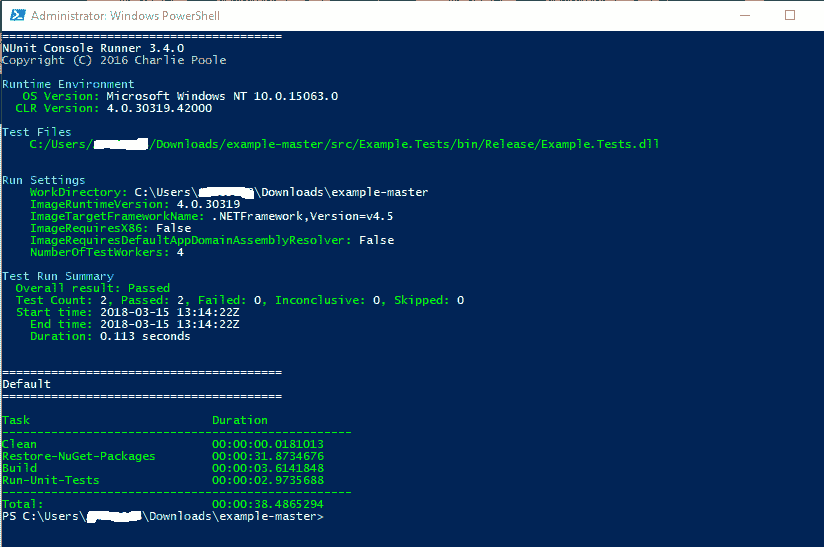

蛋糕引导程序可以通过从托管在 GitHub 上的*Cake 资源*存储库（[`github.com/cake-build/resources`](https://github.com/cake-build/resources)）下载并安装，其中包含配置文件和引导程序。引导程序将下载 Cake 和构建脚本所需的必要工具，从而避免在源代码存储库中存储二进制文件。

# PowerShell 安全

通常，PowerShell 可能会阻止运行`build.ps1`文件。您可能会在 PowerShell 屏幕上收到错误消息，指出由于系统上禁用了运行脚本，无法加载`build.ps1`。由于 PowerShell 中默认的安全设置，对文件的运行限制。

打开 PowerShell 窗口，将目录更改为之前下载的 Cake 构建示例存储库的文件夹，并运行`.\build.ps1`命令。如果系统上的执行策略未从默认值更改，这应该会给您以下错误：


要查看系统上当前的执行策略配置，请在 PowerShell 屏幕上运行`Get-ExecutionPolicy -List`命令；此命令将呈现一个包含可用范围和执行策略的表格，就像以下屏幕上显示的那样。根据您运行 PowerShell 的方式，您的实例可能具有不同的设置：


要更改执行策略以允许随后运行脚本，运行`Set-ExecutionPolicy RemoteSigned -Scope Process`命令，该命令旨在将进程范围从未定义更改为`RemoteSigned`。运行该命令将在 PowerShell 屏幕上显示一个警告并提示您的 PC 可能会面临安全风险。输入*Y*以确认并按*Enter*。运行命令时，PowerShell 屏幕上显示的内容如下截图所示：

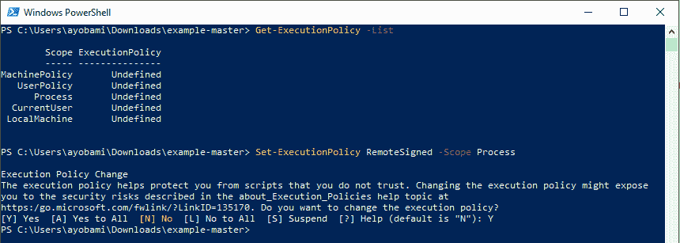

这将更改 PC 的执行策略并允许运行 PowerShell 脚本。

# 蛋糕引导程序安装步骤

安装 Cake 引导程序的步骤对于不同平台是相似的，只有一些小的差异。执行以下步骤设置引导程序。

# 步骤 1

导航到 Cake 资源存储库以下载引导程序。对于 Windows，下载 PowerShell `build.ps1`文件，对于 Mac 和 Linux，下载`build.sh` bash 文件。

在 Windows 上，打开一个新的 PowerShell 窗口并运行以下命令：

```cs
Invoke-WebRequest https://cakebuild.net/download/bootstrapper/windows -OutFile build.ps1
```

在 Mac 上，从新的 shell 窗口运行以下命令：

```cs
curl -Lsfo build.sh https://cakebuild.net/download/bootstrapper/osx
```

在 Linux 上，打开一个新的 shell 来运行以下命令：

```cs
curl -Lsfo build.sh https://cakebuild.net/download/bootstrapper/linux
```

# 步骤 2

创建一个 Cake 脚本来测试安装。创建一个`build.cake`文件；应该放在与`build.sh`文件相同的位置：

```cs
var target = Argument("target", "Default");

Task("Default")
  .Does(() =>
{
  Information("Installation Successful");
});

RunTarget(target);
```

# 步骤 3

现在可以通过调用 Cake 引导程序来运行*步骤 2*中创建的 Cake 脚本。

在 Windows 上，您需要指示 PowerShell 允许运行脚本，方法是更改 Windows PowerShell 脚本执行策略。由于执行策略，PowerShell 脚本执行可能会失败。

要执行 Cake 脚本，请运行以下命令：

```cs
./build.ps1
```

在 Linux 或 Mac 上，您应该运行以下命令，以授予当前所有者执行脚本的权限：

```cs
chmod +x build.sh
```

运行命令后，可以调用引导程序来运行*步骤 2*中创建的 Cake 脚本：

```cs
./build.sh
```

# 使用 C#编写构建脚本

使用 Cake 自动化构建和部署任务可以避免与项目部署相关的问题和头痛。构建脚本通常包含构建和部署源代码以及配置文件和项目的其他工件所需的步骤和逻辑。

使用 Cake 资源库上可用的示例`build.cake`文件可以作为编写项目的构建脚本的起点。但是，为了实现更多功能，我们将介绍一些基本的 Cake 概念，以便编写用于自动化构建和部署任务的健壮脚本。

# 任务

在 Cake 的构建自动化的核心是任务。Cake 中的**任务**是用于按照所需的顺序执行特定操作或活动的简单工作单元。Cake 中的任务可以具有指定的条件、相关依赖项和错误处理。

可以使用`Task`方法来定义任务，将任务名称或标题作为参数传递给它：

```cs
Task("Action")
    .Does(() =>
{
    // Task code goes here
});
```

例如，以下代码片段中的`build`任务会清理`debugFolder`文件夹以删除其中的内容。运行任务时，将调用`CleanDirectory`方法：

```cs
var debugFolder = Directory("./bin/Debug");

Task("CleanFolder")
    .Does(() =>
{
    CleanDirectory(debugFolder);
});
```

Cake 允许您使用 C#在任务中使用异步和等待功能来创建异步任务。实质上，任务本身将以单个线程同步运行，但任务中包含的代码可以受益于异步编程功能并利用异步 API。

Cake 具有`DoesForEach`方法，可用于将一系列项目或产生一系列项目的委托作为任务的操作添加。当将委托添加到任务时，委托将在任务执行后执行：

```cs
Task("LongRunningTask")
    .Does(async () => 
    {
        // use await keyword to multi thread code
    }); 
```

通过将`DoesForEach`链接到`Task`方法来定义`DoesForEach`，如以下代码片段所示：

```cs
Task("ProcessCsv")
    .Does(() => 
{ 
})
.DoesForEach(GetFiles("**/*.csv"), (file) => 
{ 
    // Process each csv file. 
});
```

# TaskSetup 和 TaskTeardown

`TaskSetup`和`TaskTeardown`用于包装要在执行每个任务之前和之后执行的构建操作。当执行诸如配置初始化和自定义日志记录等操作时，这些方法尤其有用：

```cs
TaskSetup(setupContext =>
{
    var taskName =setupContext.Task.Name;
    // perform action
});

TaskTeardown(teardownContext =>
{
    var taskName =teardownContext.Task.Name;
    // perform action
});
```

与任务的`TaskSetup`和`TaskTeardown`类似，Cake 具有`Setup`和`Teardown`方法，可用于在第一个任务之前和最后一个任务之后执行操作。这些方法在构建自动化中非常有用，例如，当您打算在运行任务之前启动一些服务器和服务以及在运行任务后进行清理活动时。应在`RunTarget`之前调用`Setup`或`Teardown`方法以确保它们正常工作：

```cs
Setup(context =>
{
    // This will be executed BEFORE the first task.
});

Teardown(context =>
{
    // This will be executed AFTER the last task.
});
```

# 配置和预处理指令

Cake 操作可以通过使用环境变量、配置文件和将参数传递到 Cake 可执行文件来进行控制。这是基于指定的优先级，配置文件会覆盖环境变量和传递给 Cake 的参数，然后覆盖在环境变量和配置文件中定义的条目。

例如，如果您打算指定工具路径，即 cake 在恢复工具时检查的目录，您可以创建`CAKE_PATHS_TOOLS`环境变量名称，并将值设置为 Cake 工具文件夹路径。

在使用配置文件时，文件应放置在与`build.cake`文件相同的目录中。可以在配置文件中指定 Cake 工具路径，就像在以下代码片段中一样，它会覆盖环境变量中设置的任何内容：

```cs
[Paths]
Tools=./tools
```

Cake 工具路径可以直接传递给 Cake，这将覆盖环境变量和配置文件中设置的内容：

```cs
cake.exe --paths_tools=./tools
```

Cake 具有默认用于配置条目的值，如果它们没有使用任何配置 Cake 的方法进行覆盖。这里显示了可用的配置条目及其默认值，以及如何使用配置方法进行配置：


*预处理器指令*用于在 Cake 中引用程序集、命名空间和脚本。预处理器行指令在脚本执行之前运行。

# 依赖关系

通常，您将创建依赖于其他任务完成的任务；为了实现这一点，您可以使用`IsDependentOn`和`IsDependeeOf`方法。要创建依赖于另一个任务的任务，请使用`IsDependentOn`方法。在以下构建脚本中，Cake 将在执行`Task2`之前执行`Task1`：

```cs
Task("Task1")
    .Does(() =>
{
});

Task("Task2")
    .IsDependentOn("Task1")
    .Does(() =>
{
});

RunTarget("Task2");
```

使用`IsDependeeOf`方法，您可以定义具有相反关系的任务依赖关系。这意味着依赖于任务的任务在该任务中定义。前面的构建脚本可以重构为使用反向关系：

```cs
Task("Task1")
    .IsDependeeOf("Task2")
    .Does(() =>
{
});

Task("Task2")
    .Does(() =>
{
});

RunTarget("Task2");
```

# 标准

在 Cake 脚本中使用标准允许您控制构建脚本的执行流程。**标准**是必须满足才能执行任务的谓词。标准不会影响后续任务的执行。标准用于根据指定的配置、环境状态、存储库分支和任何其他所需选项来控制任务执行。

最简单的形式是使用`WithCriteria`方法来指定特定任务的执行标准。例如，如果您只想在下午清理`debugFolder`文件夹，可以在以下脚本中指定标准：

```cs
var debugFolder = Directory("./bin/Debug");

Task("CleanFolder")
    .WithCriteria(DateTime.Now.Hour >= 12)
    .Does(() =>
{
    CleanDirectory(debugFolder);
});

RunTarget("CleanFolder");
```

您可以有一个任务的执行取决于另一个任务；在以下脚本中，`CleanFolder`任务的标准将在创建任务时设置，而`ProcessCsv`任务评估的标准将在任务执行期间进行：

```cs
var debugFolder = Directory("./bin/Debug");

Task("CleanFolder")
    .WithCriteria(DateTime.Now.Hour >= 12)
    .Does(() =>
{
    CleanDirectory(debugFolder);
});

Task("ProcessCsv")
    .WithCriteria(DateTime.Now.Hour >= 12)
    .IsDependentOn("CleanFolder")
    .Does(() => 
{ 
})
.DoesForEach(GetFiles("**/*.csv"), (file) => 
{ 
    // Process each csv file. 
});

RunTarget("ProcessCsv");
```

一个更有用的用例是编写一个带有标准的 Cake 脚本，检查本地构建并执行一些操作，以清理、构建和部署项目。将定义四个任务，每个任务执行一个要执行的操作，第四个任务将链接这些操作在一起：

```cs
var isLocalBuild = BuildSystem.IsLocalBuild
Task("Clean")
    .WithCriteria(isLocalBuild)
    .Does(() =>
    {
        // clean all projects in the soution
    });

Task("Build")   
    .WithCriteria(isLocalBuild)
    .Does(() =>
    {    
        // build all projects in the soution
    });

Task("Deploy")    
    .WithCriteria(isLocalBuild)
    .Does(() => 
    {
        // Deploy to test server
    });    

Task("Main")
    .IsDependentOn("Clean")
    .IsDependentOn("Build")
    .IsDependentOn("Deploy")    
    .Does(() => 
    {
    });
RunTarget("Main");
```

# Cake 的错误处理和最终块

Cake 具有错误处理技术，您可以使用这些技术从错误中恢复，或者在构建过程中发生异常时优雅地处理异常。有时，构建步骤调用外部服务或进程；调用这些外部依赖项可能会导致错误，从而导致整个构建失败。强大的构建应该在不停止整个构建过程的情况下处理这些异常。

`OnError`方法是一个任务扩展，用于在构建中生成异常时执行操作。您可以在`OnError`方法中编写代码来处理错误，而不是强制终止脚本：

```cs
Task("Task1")
.Does(() =>
{
})
.OnError(exception =>
{
    // Code to handle exception.
});
```

有时，您可能希望忽略抛出的错误并继续执行生成异常的任务；您可以使用`ContinueOnError`任务扩展来实现这一点。使用`ContinueOnError`方法时，您不能与之一起使用`OnError`方法：

```cs
Task("Task1")
    .ContinueOnError()
    .Does(() =>
{
});
```

如果您希望报告任务中生成的异常，并仍然允许异常传播并采取其课程，请使用`ReportError`方法。如果由于任何原因，在`ReportError`方法内引发异常，则会被吞噬：

```cs
Task("Task1")
    .Does(() =>
{
})
.ReportError(exception =>
{  
    // Report generated exception.
});
```

此外，您可以使用`DeferOnError`方法将任何抛出的异常推迟到执行的任务完成。这将确保任务在抛出异常并使脚本失败之前执行其指定的所有操作：

```cs
Task("Task1")
    .Does(() => 
{ 
})
.DeferOnError();
```

最后，您可以使用`Finally`方法执行任何操作，而不管任务执行的结果如何：

```cs
Task("Task1")
    .Does(() =>
{
})
.Finally(() =>
{  
    // Perform action.
});
```

# LoanApplication 构建脚本

为了展示 Cake 的强大功能，让我们编写一个 Cake 脚本来构建`LoanApplication`项目。Cake 脚本将清理项目文件夹，还原所有包引用，构建整个解决方案，并运行解决方案中的单元测试项目。

以下脚本设置要在整个脚本中使用的参数，定义目录和任务以清理`LoanApplication.Core`项目的`bin`文件夹，并使用`DotNetCoreRestore`方法恢复包。可以使用`DotNetCoreRestore`方法来还原 NuGet 包，该方法又使用`dotnet restore`命令：

```cs
//Arguments
var target = Argument("target", "Default");
var configuration = Argument("configuration", "Release");
var solution = "./LoanApplication.sln";

// Define directories.
var buildDir = Directory("./LoanApplication.Core/bin") + Directory(configuration);

//Tasks
Task("Clean")
    .Does(() =>
{
    CleanDirectory(buildDir);
});

Task("Restore-NuGet-Packages")
    .IsDependentOn("Clean")
    .Does(() =>
{
    Information("Restoring NuGet Packages");
    DotNetCoreRestore();
});
```

脚本的后部分包含使用`DotNetCoreBuild`方法构建整个解决方案的任务，该方法使用`DotNetCoreBuildSettings`对象中提供的设置使用`dotnet build`命令构建解决方案。使用`DotNetCoreTest`方法执行测试项目，该方法使用`DotNetCoreTestSettings`对象中提供的设置在解决方案中的所有测试项目中运行测试使用`dotnet test`：

```cs
Task("Build")
    .IsDependentOn("Restore-NuGet-Packages")
    .Does(() =>
{
    Information("Build Solution");
    DotNetCoreBuild(solution,
           new DotNetCoreBuildSettings()
                {
                    Configuration = configuration
                });    
});

Task("Run-Tests")
    .IsDependentOn("Build")
    .Does(() =>
{
     var testProjects = GetFiles("./LoanApplication.Tests.Units/*.csproj");
        foreach(var project in testProjects)
        {
            DotNetCoreTool(
                projectPath: project.FullPath, 
                command: "xunit", 
                arguments: $"-configuration {configuration} -diagnostics -stoponfail"
            );
        }        
});

Task("Default")
    .IsDependentOn("Run-Tests");

RunTarget(target);
```

Cake Bootstrapper 可用于通过从 PowerShell 窗口调用引导程序来运行 Cake `build`文件。当调用引导程序时，Cake 将使用`build`文件中可用的任务定义来开始执行定义的构建任务。执行开始时，执行的进度和状态将显示在 PowerShell 窗口中：

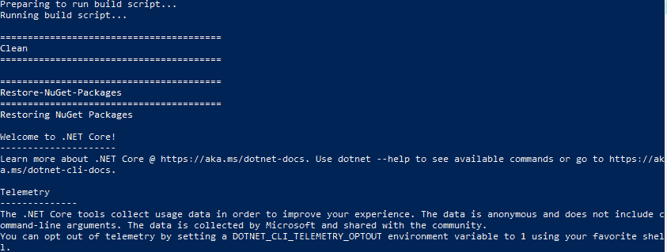

每个任务的执行进度将显示在 PowerShell 窗口中，显示 Cake 当前正在进行的所有活动。当构建执行完成时，将显示脚本中每个任务的执行持续时间，以及所有任务的总执行时间： 


# Visual Studio 的 Cake 扩展

**Visual Studio 的 Cake 扩展**为 Visual Studio 带来了对 Cake 构建脚本的语言支持。该扩展支持新模板、任务运行器资源管理器以及引导 Cake 文件的功能。可以在**Visual Studio Market Place**下载**Visual Studio 的 Cake 扩展**（[`marketplace.visualstudio.com/items?itemName=vs-publisher-1392591.CakeforVisualStudio`](https://marketplace.visualstudio.com/items?itemName=vs-publisher-1392591.CakeforVisualStudio)）。

从市场下载的`.vsix`文件本质上是一个`.zip`文件。该文件包含要安装在 Visual Studio 中的 Cake 扩展的内容。运行下载的`.vsix`文件时，它将为 Visual Studio 2015 和 2017 安装 Cake 支持：


# Cake 模板

安装扩展后，在创建新项目时，Visual Studio 的可用选项中将添加一个**Cake 模板**。该扩展将添加四种不同的 Cake 项目模板类型：

+   **Cake Addin**：用于创建 Cake Addin 的项目模板

+   **Cake Addin Unit Test Project**：用于为 Cake Addin 创建单元测试的项目模板，其中包括作为指南的示例

+   **Cake Addin Unit Test Project (empty)**：用于为 Cake Addin 创建单元测试的项目模板，但不包括示例

+   **Cake Module**：此模板用于创建 Cake 模块，并附带示例

以下图片显示了不同的 Cake 项目模板：


# 任务运行器资源管理器

在使用 Cake 脚本进行构建自动化的 Visual Studio 解决方案中，当发现`build.cake`文件时，Cake 任务运行器将被触发。Cake 扩展激活了**任务运行器资源管理器**集成，允许您在 Visual Studio 中直接运行包含的绑定的 Cake 任务。

要打开任务运行器资源管理器，请右键单击 Cake 脚本（`build.cake`文件）并从显示的上下文菜单中选择任务运行器资源管理器；它应该打开任务运行器资源管理器，并在窗口中列出 Cake 脚本中的所有任务：


有时，当右键单击 Cake 脚本时，任务运行器资源管理器可能不会显示在上下文菜单中。如果是这样，请单击“查看”菜单，选择“其他窗口”，然后选择“任务运行器资源管理器”以打开它：

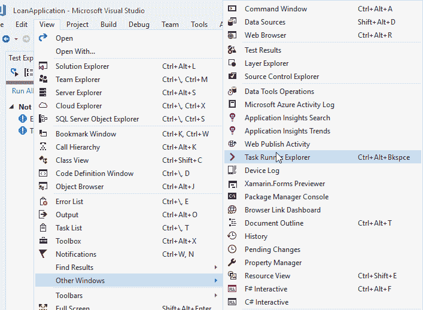

通过安装 Cake 扩展，Visual Studio 的构建菜单现在将包含一个 Cake 构建的条目，可以用来安装 Cake 配置文件、PowerShell 引导程序和 Bash 引导程序，如果它们在解决方案中尚未配置的话：

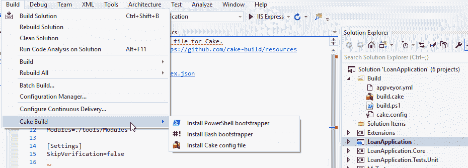

现在，您可以通过双击或右键单击并选择运行，直接从任务运行器资源管理器中执行每个任务。任务执行的进度将显示在任务运行器资源管理器上：


# 语法高亮显示

Cake 扩展为 Visual Studio 添加了语法高亮显示功能。这是 IDE 的常见功能，其中源代码以不同的格式、颜色和字体呈现。源代码高亮显示是基于定义的组、类别和部分进行的。

安装扩展后，任何带有`.cake`扩展名的文件都可以在 Visual Studio 中打开，并具有完整的任务和语法高亮显示。目前，Visual Studio 中的`.cake`脚本文件没有 IntelliSense 支持；预计这个功能将在以后推出。

以下截图显示了在 Visual Studio 中对`build.cake`文件进行的语法高亮显示：

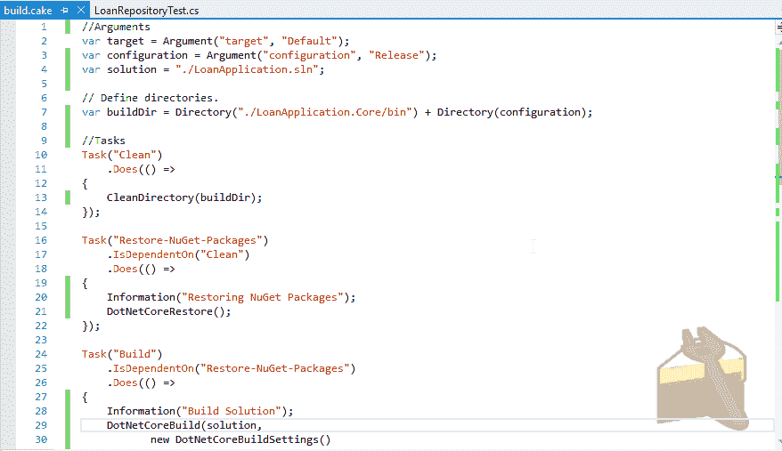

# 使用 Cake 任务来构建步骤

使用任务运行器资源管理器来运行用 Cake 脚本编写的构建任务更加简单和方便。这通常是通过 Visual Studio 的 Cake 扩展或直接调用 Cake 引导文件来完成的。然而，还有一种更有效的替代方法，那就是使用 TeamCity CI 工具来运行 Cake 构建脚本。

TeamCity 构建步骤可用于执行 Cake 脚本作为构建步骤执行过程的一部分。让我们按照以下步骤为`LoanApplication`项目创建执行 Cake 脚本的构建步骤：

+   单击添加构建步骤以打开新的构建步骤窗口。

+   在运行器类型中，选择 PowerShell，因为 Cake 引导文件将由 PowerShell 调用。

+   在文本字段中为构建步骤命名。

+   在脚本选项中，选择文件。这是因为它是一个`.ps1`文件，将被调用，而不是一个直接的 PowerShell 脚本。

+   要选择脚本文件，请单击树图标；这将加载 GitHub 上托管的项目中可用的文件和文件夹。在显示的文件列表中选择`build.ps1`文件。

+   单击保存按钮以保存更改并创建构建步骤：

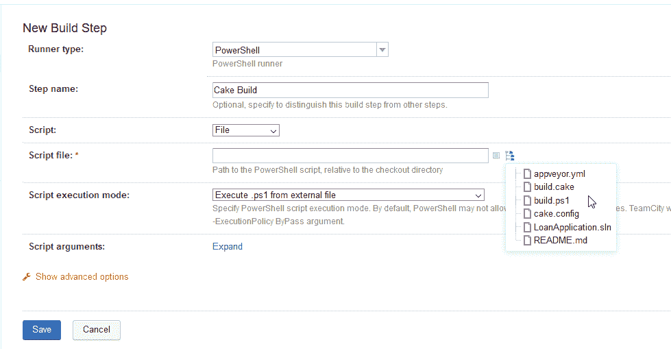

新的构建步骤应该出现在 TeamCity 项目中配置的可用构建步骤列表中。在参数描述选项卡中，将显示有关构建步骤的信息，显示运行器类型和要执行的 PowerShell 文件，如下截图所示：


# 使用 Visual Studio Team Services 进行 CI

**Microsoft Visual Studio Team Services**（**VSTS**）是**Team Foundation Server**（**TFS**）的云版本。它提供了让开发人员协作进行软件项目开发的出色功能。与 TFS 类似，它提供了易于理解的服务器管理体验，并增强了与远程站点的连接。

VSTS 为实践 CI 和**持续交付**（**CD**）的开发团队提供了出色的体验。它支持 Git 存储库进行源代码控制，易于理解的报告以及可定制的仪表板，用于监视软件项目的整体进展。

此外，它还具有内置的构建和发布管理功能，规划和跟踪项目，使用*Kanban*和*Scrum*方法管理代码缺陷和问题。它同样还有一个内置的维基用于与开发团队进行信息传播。

您可以通过互联网连接到 VSTS，使用开发人员需要已创建的 Microsoft 帐户。但是，组织中的开发团队可以配置 VSTS 身份验证以与**Azure Active Directory**（**Azure AD**）一起使用，或者设置 Azure AD 以具有 IP 地址限制和多因素身份验证等安全功能。

# 在 VSTS 中设置项目

要开始使用 VSTS，请转到[`www.visualstudio.com/team-services/`](https://www.visualstudio.com/team-services/)创建免费帐户。如果您已经创建了 Microsoft 帐户，可以使用该帐户登录，或者使用您组织的 Active Directory 身份验证。您应该被重定向到以下屏幕：


在 VSTS 中，每个帐户都有自己定制的 URL，其中包含一个团队项目集合，例如，[`packt.visualstudio.com`](https://packt.visualstudio.com)。您应该在字段中指定 URL，并选择要与项目一起使用的版本控制。VSTS 目前支持 Git 和 Team Foundation 版本控制。单击“继续”以继续进行帐户创建。

创建帐户后，单击“项目”菜单导航到项目页面，然后单击“新建项目”创建新项目。这将加载项目创建屏幕，在那里您将指定项目名称，描述，要使用的版本控制以及工作项过程。单击“创建”按钮完成项目创建：

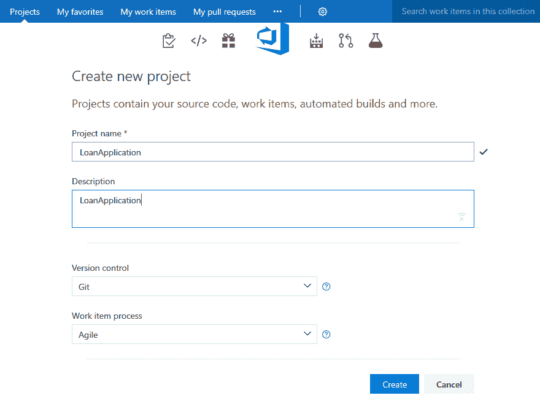

项目创建完成后，您将看到“入门”屏幕。该屏幕提供了克隆现有项目或将现有项目推送到其中的选项。让我们导入我们之前在 GitHub 上创建的`LoanApplication`项目。单击“导入”按钮开始导入过程：

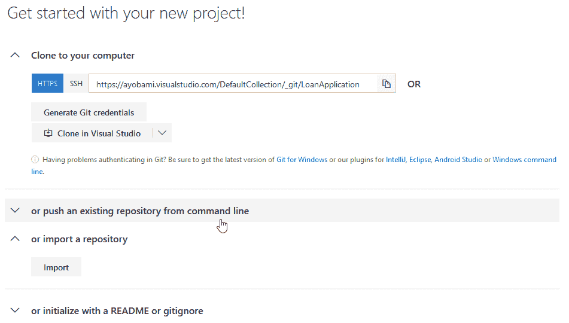

在导入屏幕上，指定源类型和 GitHub 存储库的 URL，并提供 GitHub 登录凭据。单击“导入”按钮开始导入过程：

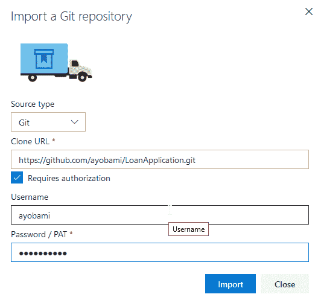

您将看到一个显示导入进度的屏幕。根据要导入的项目的大小，导入过程可能需要一些时间。当过程完成时，屏幕上将显示“导入成功”消息：

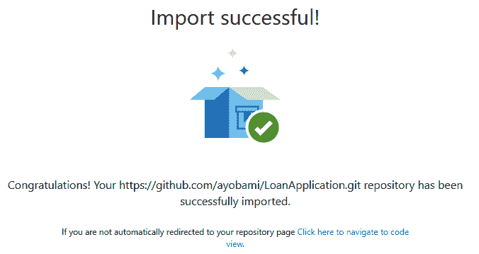

单击“单击此处导航到代码视图”以查看 VSTS 导入的文件和文件夹。文件屏幕将显示项目中可用的文件和文件夹以及提交和日期详细信息：

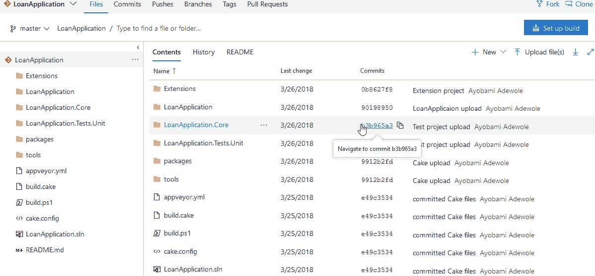

# 在 VSTS 中安装 Cake

Cake 在 VSTS 中有一个扩展，允许您相对容易地直接从 VSTS 构建任务运行 Cake 脚本。安装了扩展后，Cake 脚本就不必像在 TeamCity 中运行 Cake 脚本时那样使用 PowerShell 来运行。

在 Visual Studio Marketplace 上导航到 Cake Build 的 URL：[`marketplace.visualstudio.com/items/cake-build.cake`](https://marketplace.visualstudio.com/items/cake-build.cake)。点击“获取免费”按钮开始将 Cake 扩展安装到 VSTS 中：


单击“获取免费”按钮将重定向到 VSTS Visual Studio | Marketplace 集成页面。在此页面上，选择要安装 Cake 的帐户，然后单击“安装”按钮：


安装成功后，将显示一条消息，说明一切都已设置，类似于以下截图中的内容。点击“转到帐户”按钮，将您重定向到 VSTS 帐户页面：


# 添加构建任务

成功将 Cake 安装到 VSTS 后，您可以继续配置代码的构建方式以及软件的部署方式。VSTS 提供了简单的方法来构建您的源代码并发布您的软件。

要创建由 Cake 提供支持的 VSTS 构建，请单击“生成和发布”，然后选择“生成”子菜单。这将加载构建定义页面；单击此页面上的+新建按钮，开始构建创建过程。

将显示一个屏幕，选择存储库，如下截图所示。屏幕提供了从不同来源选择存储库的选项：

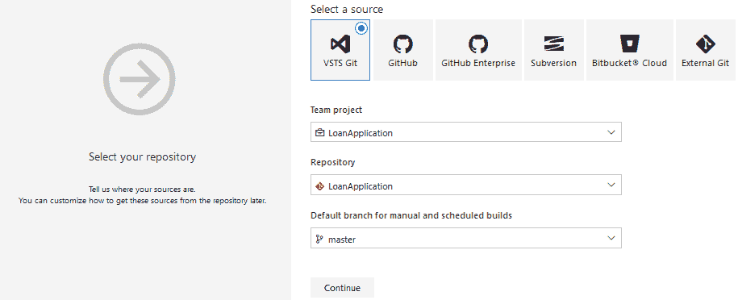

选择存储库来源后，单击“继续”按钮以加载模板屏幕。在此屏幕上，您可以选择用于配置构建的构建模板。VSTS 为各种支持的项目类型提供了特色模板。每个模板都配置了与模板项目相关的构建步骤：


向下滚动到模板列表的底部，或者在搜索框中简单地输入`Empty`以选择空模板。将鼠标悬停在模板上以激活“应用”按钮，然后单击该按钮，以继续到任务创建页面：

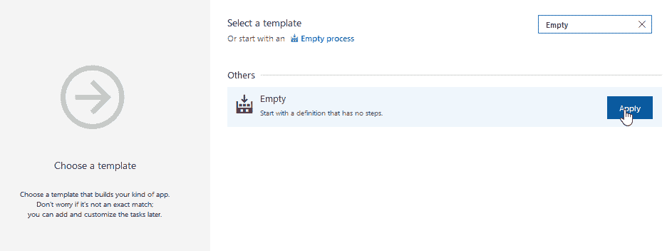

当任务屏幕加载时，单击+按钮以向构建添加任务。滚动浏览显示的任务模板列表，选择 Cake，或使用搜索框过滤到 Cake。单击“添加”按钮，将 Cake 任务添加到构建阶段可用任务列表中：


添加 Cake 任务后，单击任务以加载属性屏幕。单击“浏览”按钮以选择包含`LoanApplication`项目的构建脚本的`build.cake`文件，以与构建任务关联。您可以修改显示名称并更改目标和详细程度属性。此外，如果有要传递给 Cake 脚本的参数，可以在提供的字段中提供它们：

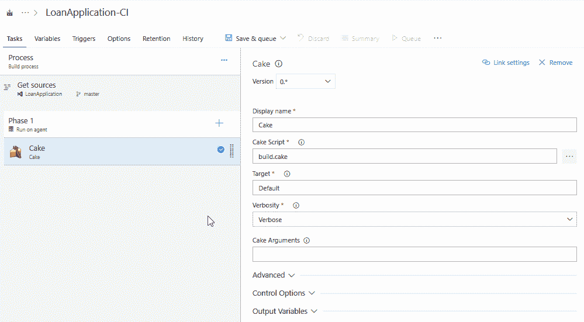

单击“保存并排队”菜单，然后选择“保存并排队”，以确保创建的构建将在托管代理上排队。这将加载构建定义和排队屏幕，您可以在其中指定注释和代理队列：

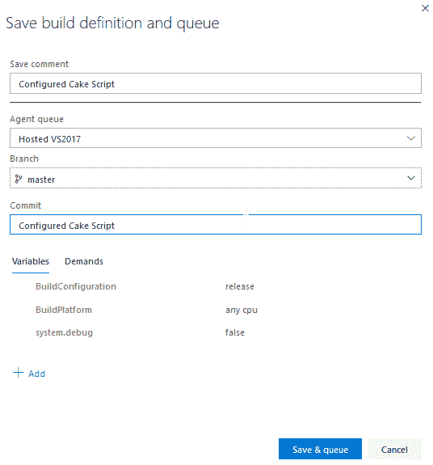

托管代理是运行构建作业的软件。使用托管代理是执行构建的最简单和最简单的方法。托管代理由 VSTS 团队管理。

如果构建成功排队，您应该会收到屏幕上显示构建编号的通知，指出构建已排队：


单击构建编号以导航到构建执行页面。托管代理将处理队列并执行队列中构建的配置任务。构建代理将显示构建执行的进度。执行完成后，将报告构建的成功或失败。

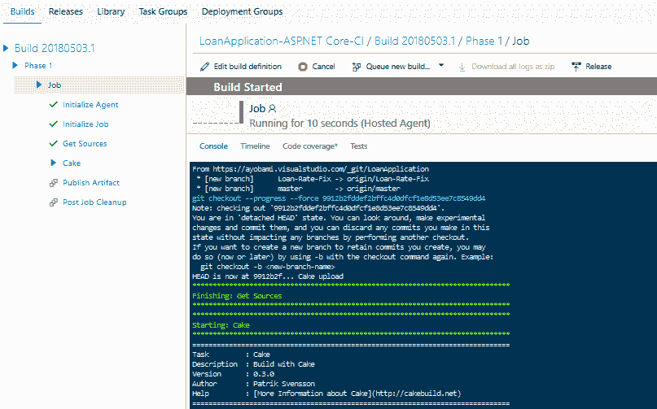

VSTS 提供了巨大的好处，并简化了 CI 和 CD 过程。它提供了工具和功能，允许不同的 IDE 轻松集成，并使端到端的开发和项目测试相对容易。

# 摘要

在本章中，我们详细探讨了 Cake 构建自动化。我们介绍了安装 Cake 和 Cake Bootstrapper 的步骤。之后，我们探讨了编写 Cake 构建脚本和任务创建的过程，并提供了可用于各种构建活动的示例任务。

此外，我们为`LoanApplication`项目创建了一个构建脚本，其中包含了清理、恢复和构建解决方案中所有项目以及构建解决方案中包含的单元测试项目的任务。

后来，我们在 TeamCity 中创建了一个构建步骤，通过使用 PowerShell 作为运行器类型来执行 Cake 脚本。在本章的后面，我们介绍了如何设置 Microsoft Visual Studio Team Services，安装 Cake 到 VSTS，并配置了一个包含 Cake 任务的构建步骤。

在最后一章中，我们将探讨如何使用 Cake 脚本执行 xUnit.net 测试。在本章的后面，我们将探讨.NET Core 版本控制、.NET Core 打包和元包。我们将为 NuGet 分发打包`LoanApplication`项目。
